HỌC PHẦN THAY THẾ TỐT NGHIỆP 2 CHUYÊN NGÀNH CÔNG NGHỆ PHẦN MỀM

# PHÂN TÍCH THIẾT KẾĐẢM BẢO CHẤT LƯỢNG PHẦN MỀM

NGUYỄN MẠNH HÙNG ĐỖ THỊ BÍCH NGỌC

# GIỚI THIỆU

# TÀI LIỆU THAM KHẢO

[1] Object-Oriented and Classical Software Engineering, Stephen R. Schach, Eigtth Edition, Mc Graw Hill, 2010.   
[2] . Mastering Software Quality Assurance: Best Practices, Tools and Techniques for Software Developers, Murali Chemuturi, J. Ross Publication Inc., 2011.

# MỤC LỤC

# MỤC LỤC...........

# CHƯƠNG 1: QUY TRÌNH VÀ VÒNG ĐỜI PHÁT TRIỂN PHẦN MỀM...... ......4

1.1 PHẦN MỀM VÀ PHÁT TRIỂN PHẦN MỀM..

1.1.1. Phần mềm. .4   
1.1.2. Phát triển phần mềm. ..4   
1.2 VÒNG ĐỜI PHÁT TRIỂN PHẦN MỀM. ..6   
1.2.1 Quy trình phát triển phần mềm hướng đối tượng. ...6   
1.2.2 Một số mô hình vòng đời phát triển phần mềm.. ..10   
1.3 UML - CÔNG CỤ HỖ TRỢ PHÂN TÍCH THIẾT KẾ HƯỚNG ĐỐI TƯỢNG. ..18   
1.3.1 Lịch sử ra đời của UML. ..18   
1.3.2 UML – Ngôn ngữ mô hình hoá hướng đối tượng.. ..19   
1.3.3 Các khái niệm cơ bản trong UML. ..19   
1.3.4 Các biểu đồ UML. ..21   
1.4 CÂU HỎI ÔN TẬP.. ..34

# CHƯƠNG 2: ĐẢM BẢO CHẤT LƯỢNG PHẦN MỀM.. .35

2.1 TỔNG QUAN VỀ ĐẢM BẢO CHẤT LƯỢNG PHẦN MỀM .35   
2.1.1 Một số khái niệm .35   
2.1.2 Các tiêu chí chất lượng . .36   
2.2 CÁC HOẠT ĐỘNG ĐẢM BẢO CHẤT LƯỢNG PHẦN MỀM . ...41   
2.2.1. Đảm bảo chất lượng đặc tả ..41   
2.2.2. Đảm bảo chất lượng phân tích thiết kế ...42   
2.2.3. Đảm bảo chất lượng phát triển phần mềm (lâp trình) . ..43   
2.2.4. Kiểm thử phần mềm .... ...44   
2.3. CÁC KỸ THUẬT RÀ SOÁT ..46   
2.3.1. Mục tiêu của rà soát ..46   
2.3.2. Các hình thức rà soát ..46   
2.4. CÁC KỸ THUẬT KIỂM THỬ . ..52   
2.4.1 Kỹ thuật kiểm thử hộp đen . .52   
2.4.2 Kỹ thuật kiểm thử hộp trắng ..54   
2.5 CÂU HỎI ÔN TẬP.. .55

# CHƯƠNG 3: THU THẬP VÀ PHÂN TÍCH YÊU CẦU...... ..56

# 3.1 THU THẬP YÊU CẦU.. ..56

3.1.1 Tìm hiểu lĩnh vực chuyên môn. .56   
3.1.2 Mô tả hệ thống bằng ngôn ngữ tự nhiên.. ..58   
3.1.3 Mô tả hệ thống bằng ngôn ngữ UML - use case.. ..62

3.2 PHÂN TÍCH YÊU CẦU.. ......68

3.2.1 Viết kịch bản.. .68   
3.2.2 Trích lớp thực thể.. ..72   
3.2.3 Trích các lớp biên và điều khiển. ..76   
3.2.4 Phân tích hoạt động.. ..83   
3.3 BÀI TẬP.... ..91

# CHƯƠNG 4: THIẾT KẾ. .92

4.1 THIẾT KẾ LỚP THỰC THỂ. ..92

4.1.1 Quy trình thực hiện..... ..92

# 4.1.2 Áp dụng... ..92

4.2 THIẾT KẾ CSDL. ..94

4.2.1 Quy trình thực hiện. ..94

4.2.2 Áp dụng.. ..95

4.3 THIẾT KẾ CHI TIẾT CHO MODUL. ..96

4.3.1 Thiết kế tĩnh.. ..96   
4.3.2 Thiết kế hoạt động.. ..103   
4.3.3 Thiết kế triển khai. .113

4.4 CÂU HỎI ÔN TẬP.. .114

# CHƯƠNG 5: CÀI ĐẶT HỆ THỐNG.. ..115

5.1 TỔ CHỨC DỰ ÁN... 115

5.2.1 Chức năng đăng kí học.. .116   
5.2.2 Chức năng nhập điểm.. .142   
5.2.3 Chức năng xem thống kê.. .149

5.3 KIỂM THỬ ĐƠN VỊ . .157

5.3.Xây dựng bộ test case cho kiểm thử đơn vị.. .158

5.3.2 Cài đặt kiểm thử đơn vị.. .159

5.4 CÂU HỎI ÔN TẬP.. ..169

# CHƯƠNG 6: RÀ SOÁT VÀ KIỂM THỬ HỆ THỐNG... ..170

# 6.1 THỰC HIỆN CÁC HOẠT ĐỘNG RÀ SOÁT . ..170

6.1.1 Rà soát đặc tả... .170   
6.1.2 Rà soát phân tích. ..172   
6.1.3 Rà soát thiết kế.. ..177   
6.1.4 Rà soát code. ..182   
6.2. THỰC HIỆN TEST CHỨC NĂNG ..184   
6.3 CÂU HỎI ÔN TẬP.. ..233

# BÀI TẬP DỰ ÁN...... .. 234

# CHƯƠNG 1: QUY TRÌNH VÀ VÒNG ĐỜI PHÁT TRIỂN PHẦN MỀM

# 1.1 PHẦN MỀM VÀ PHÁT TRIỂN PHẦN MỀM

# 1.1.1. Phần mềm

# Đặc trưng của phần mềm

• Phần mềm không mòn   
Phần mềm được phát triển mà không được sản xuất theo nghĩa thông thường Mặc dù công nghiệp phần mềm đang hướng đến phát triển dựa trên thành phần nhưng phần lớn phần mềm phát triển dựa theo yêu cầu của khách hàng. Cho đến nay những đặc trưng của phần mềm vẫn còn là vấn đề tranh cãi. Chính điều này thể hiện sự chưa trưởng thành của ngành học CÔNG NGHỆ PHẦN MỀM.

# Các kiểu phần mềm

Phần mềm hệ thống: Tập hợn các Chương trình được viết để phục vụ các chương trình khác, tương tác với phần cứng (ví dụ, biên dịch, trình soạn thảo, HĐH…) Phần mềm thời gian thực: Phần mềm điều phối/phân tích kiểm soát, đáp ứng thời gian Phần mềm nghiệp vụ: Các phần mềm tính lương, kế toán, quản lý kho… Phần mềm khoa học và công nghệ: Các ứng dụng trong thiên văn, sinh học phân tử, điều khiển tàu con thoi,… Phần mềm nhúng: Nằm trong bộ nhớ chỉ đọc điều khiển các sản phẩm và hệ thống   
• Phần mềm máy tính cá nhân: Xử lý văn bản, đồ họa máy tính… Phần mềm trên Web Phần mềm trí tuệ nhân tạo: Dựa trên những kỹ thuật của Trí tuệ nhân tạo như hệ chuyên gia.

Nhận xét: Hiện nay web được xem là môi trường phổ biến để xây dựng giao diện với người sử dụng cho nhiều hệ thống phần mềm trên mạng.

# 1.1.2. Phát triển phần mềm

# Khía cạnh lịch sử

• Năm 1967 nhóm NATO đưa ra thuật ngữ Công nghệ phần mềm (Software Engineering).

• Năm 1968 Hội nghị Software Engineering ở Garmisch, Đức đưa ra mục đích là giải quyết “Cuộc khủng hoảng phần mềm”:

Phần mềm hoàn thành không đúng thời hạn Chi phí vượt dự toán ban đầu Phần mềm còn nhiều lỗi

Tại sao không thể sử dụng kỹ nghệ xây cất như xây dựng cầu để xây dựng các hệ điều hành?

• Thái độ đối với việc sập cầu/hệ điều hành   
• Thông tin về CNPM thường không đầy đủ, không chắc chắn   
• Độ phức tạp   
• Bảo trì

Công nghệ phần mềm không thể xem giống như các kỹ nghệ thông thường khác.

# Khía cạnh kinh tế

• CNPM và khoa học máy tính (tương tự như hóa học và kỹ nghệ hóa)

• Khoa học có phần thực nghiệm và lý thuyết: Phần thực nghiệm của Hóa học là thí nghiệm còn của khoa học máy tính là lập trình.   
• Khoa học máy tính nghiên cứu những sách khác nhau để tạo ra phần mềm. Nhưng kỹ sư phần mềm chỉ quan tâm kỹ thuật có ý nghĩa kinh tế.   
• Ví dụ: Phương pháp mã hóa mới KTmới (lập trình hướng thành phần) nhanh hơn phương pháp đang sử dụng hiện thời KTcũ (lập trình hướng đối tượng) là 10%. Chúng ta nên sử dụng phương pháp mới hay không?   
• Câu trả lời thông thường là: Tất nhiên! Câu trả lời Công nghệ phần mềm: xét hiệu quả của KTmới.

# Khía cạnh bảo trì

• Vòng đời phần mềm: Một loạt các pha mà phần mềm phải trải qua từ khám phá các khái niệm đến loại bỏ hoàn toàn.

• Mô hình vòng đời • Pha yêu cầu • Pha đặc tả • Pha thiết kế • Pha cài đặt • Pha tích hợp • Pha bảo trì Loại bỏ

• Bảo trì: Mọi thay đổi đối với sản phẩm một khách hàng đã đồng ý sản phẩm thỏa mãn tài liệu đặc tả.

• Phần mềm tốt được bảo trì khác với phần mềm tồi bị loại bỏ

• Các dạng bảo trì”

Bảo trì sửa lỗi [17,5%]: sửa chữa lỗi nhưng đặc tả không đổi Bảo trì nâng cao: sửa chữa theo thay đổi của đặc tả. Bảo trì hoàn thiện [60,5%]: thêm chức năng để cải tiến sản phẩm. Bảo trì thích nghi [18%]: thay đổi phần mềm để đáp ứng thay đổi của môi trường như quy định chính phủ, CPU, công nghệ mới…

Kết luận: Bảo trì là pha tốn kém nhiều thời gian và chi phí

# Khía cạnh phân tích và thiết kế

• 60 đến 70% lỗi của phần mềm là những lỗi do đặc tả và thiết kế Dữ liệu của Kelly, Sherif and Hops [1992] về chương trình không gian liên hành tinh của Nasa   
• 1,9 lỗi trên một trang đặc tả   
• 0,9 lỗi trên một trang thiết kế   
• 0,3 lỗi trên một trang chương trình nguồn   
• Dữ liệu của Bhandari et al. [1994]: Lỗi trong cuối pha thiết kế của phiên bản mới của sản phẩm

• 13% lỗi từ phiên bản trước 16% lỗi trong pha đặc tả mới 71% lỗi trong pha thiết kế mới

Kết luận: Xây dựng những kỹ thuật sinh ra thiết kế và đặc tả tốt hơn là một vấn đề quan trọng trong công nghệ phần mềm.

# Khía cạnh nhóm phát triển

• Phần cứng rẻ, khả năng tăng, kích thước giảm   
• Phần mềm lớn, đắt. Nhiều phần mềm quá lớn nên một người không thể phát triển được trong thời gian có hạn.

# 1.2 VÒNG ĐỜI PHÁT TRIỂN PHẦN MỀM

# 1.2.1 Quy trình phát triển phần mềm hướng đối tượng

• Tiến trình phần mềm là “phương cách” sản xuất ra phần mềm. Tiến trình phần mềm nghiên cứu các cách kết hợp:

Mô hình vòng đời   
Các công cụ CASE   
Các cá nhân xây dựng phần mềm   
Các công nghệ

# Tiến trình phần mềm = Khía cạnh kỹ thuật + Khía cạnh quản lý

Các tổ chức khác nhau có những tiến trình phần mềm khác nhau.   
• Khâu viết tài liệu (quan trọng/không quan trọng)   
• Chi phí dành cho kiểm thử (1/2 chi phí/không quan trọng)   
• Tập trung khaua nghiên cứu, phát triển phần mềm. Khâu bảo trì dành cho người khác.   
• Vì sao như vậy? Thiếu kỹ năng về kỹ nghệ phần mềm Nhiều người quản lý phần mềm thiếu kiến thức về bảo trì và phát triển phần mềm (do đó trễ hạn!)   
• Quan điểm về quản lý (giao đúng hạn hay kiểm tra kỹ trước khi giao)   
• Phụ thuộc vào cá nhân

# Có pha kiểm thử không?

• KHÔNG có pha kiểm thử. Vì sao? Kiểm thử là hoạt động thực hiện trong mọi pha của sản xuất phần mềm. Check = test Testing: Thương được hiểu sau khi coding Kiểm tra (Varification): Thực hiện vào cuối mỗi pha   
• Kiểm chứng (Validation): Thực hiện trước khi giao sản phẩm cho khách hàng

# Có pha viết tài liệu không?

KHÔNG có pha viết tài liệu Mọi pha phải được viết tài liệu trước khi khởi đầu một pha mới.

• Một số lý do:

Tài liệu bị hoãn lại thì sẽ không bao giờ hoàn thành Cá nhân chịu trách nhiệm trong pha trước có thể đã chuyển sang bộ phận khác. Sản phẩm thường xuyên thay đổi trong khi phát triển vì thế ta cần tài liệu để ghi lại điều này. Ví dụ, thiết kế thường phải sửa đổi trong khi cài đặt. Việc sửa đổi như vậy chỉ có thể thực hiện được khi có tài liệu của nhóm thiết kế.

Kiểm thử và viết tài liệu được tiến hành trong mọi pha của tiến trình phần mềm.

• Nhóm đảm bảo chất lượng phần mềm (SQA: Software quality assurance): ◦ Có trách nhiệm đảm bảo sản phẩm được xây dựng đúng (theo đặc tả) và theo đơn đặt hàng. ◦ Nhóm SQA phải đóng đúng vai trò ngay từ đầu của tiến trình và hoạt động trong mọi pha của tiến trình phần mềm. ◦ SQA kiểm tra với khách hàng xem phiên bản cuối cùng thỏa mãn hoàn toàn chưa.

# Pha yêu cầu

• Tiến trình phát triển phần mềm bắt đầu khi khách hàng tiếp xúc với công ty phần mềm và cho rằng: Phần mềm có khả năng thích hợp với khách hàng và giá thành hợp lý.

Khám phá khái niệm:

1. Trong lần gặp đầu tiên, khách hàng phát họa sản phẩm mà họ hình dung. Theo quan điểm của người phát triển, mô tả này không rõ ràng, không hợp lý, mâu thuẫn hay không thể xây dựng phần mềm như thế được.

2. Người phát triển xác định nhu cầu và ràng buộc của khách hàng Kiểm thử pha yêu cầu:

• Làm bản mẫu nhanh: là mẫu phần mềm kết hợp nhiều chức năng của sản phẩm cuối cùng nhưng bỏ qua những khía cạnh mà khách hàng không thấy được như cập nhật file hay xử lý lỗi. Bản mẫu nhanh phải được kiểm tra bởi khách hàng và người sử dụng. Bản mẫu nhanh có thể thay đổi cho đến khi khách hàng và người sử dụng cho rằng nó có những chức năng mà họ mong muốn.

Viết tài liệu pha yêu cầu:

• Tài liệu pha yêu cầu: • Có bản mẫu: Bản mẫu nhanh. Bản ghi thỏa thuận với khách hàng và người sử dụng về cơ sở xây dựng và sửa đổi bản mẫu. • Không có bản mẫu (nhóm quyết định không xây dựng bản mẫu): Mô tả nhu cầu khách hàng. Tài liệu này phải được khách hàng, người sử dụng và nhóm phát triển kiểm tra trước khi nhóm SQA xem xét.

# Pha đặc tả/phân tích

Khi khách hàng cho rằng nhóm phát triển hiểu được yêu cầu, nhóm đặc tả viết tài liệu đặc tả để mô tả chức năng của sản phẩm (những gì sản phẩm cần có + ràng buộc). Đặc tả bao gồm những input của sản phẩm và output được yêu cầu Ví dụ: Khách hàng cần tính bảng lương thì input bao gồm mức trả cho mỗi nhân viên, thông tin từ hồ sơ cá nhân để tính thuế… và output là số lương thuế, chi bảo hiểm,… • Yêu cầu của đặc tả Không nhập nhằng: không sử dụng thuật ngữ như tiện lợi, đầy đủ chức năng, nhanh, 98%... Đầy đủ: Thể hiện mọi yêu cầu của khách hàng Phi mâu thuẫn: không chứa mâu thuẫn • Theo dõi được (Traceability): có thể lần theo phán đoán trong đặc tả trở lại phán đoán đưa ra bởi khách hàng trong pha yêu cầu. Nếu đặc tả được trình bày đúng phương pháp, có đánh chỉ số,… thì nhóm SQA sẽ ít gặp khó khăn. Nếu có bản mẫu thì phán đoán liên quan của đặc tả phải theo dõi được đến bản mẫu. Môt khi đặc tả được hoàn thành và đã thông qua thì hình thành kế hoạch quản lý quá trình sản xuất phần mềm (SPMP : The software product management plan). • Yêu cầu kế hoạch:

SPMP cần nêu lên thời gian thực hiện, chi phí cho từng pha, gán trách nhiệm cá nhân cho từng pha, thời hạn hoàn thành cho mỗi pha.   
Mô hình vòng đời nào sẽ sử dụng, cấu trúc tổ chức, kỹ thuật và CASE sử dụng, lịch tình, chi phí…

Kiểm thử pha đặc tả:

• Nguồn gốc chính của lỗi trong các phần mềm đã phân phối đến nay là những lỗi trong tài liệu đặc tả và những lỗi này chỉ được phát hiện khi tổ chức khách hàng sử dụng nó. Duyệt xét lại (Review): là cách tốt nhất để kiểm tra đặc tả. Mục đích là xác định đặc tả có đùng không. Nhóm SQA chủ trì cuộc họp với đại diện nhóm đặc tả và khách hàng.

# Pha thiết kế

• Đặc tả - What   
• Thiết kế - How Giữ lại quyết định thiết kế • Thời điểm kết thúc • Cho nhóm bảo trì Thiết kế nên mở (open-ended)   
• Thiết kế kiến trúc : Phân rã sản phẩm thành mô đun Thiết kế chi tiết: Thiết kế các mô đun: cấu trúc dữ liệu, thuật toán

Kiểm thử pha thiết kế:

• Tài liệu viết sao cho dễ theo dõi Duyệt tài liệu

# Pha cài đặt

• Cài đặt thiết kế chi tiết thành chương trình Kiểm thử pha cài đặt:

• Rà soát   
• Các test case • Test không hình thức (desk checking) Test hình thức (Formal testing) do nhóm SQA

# Tích hợp

• Kết hợp các mô đun và kiểm thử toàn bộ sản phẩm

Tài liệu pha tích hợp:

Mã nguồn có chú thích • Các test cases

# 1.2.2 Một số mô hình vòng đời phát triển phần mềm

# a. Mô hình xây sửa (code and fixe)

Không thiết kế Không đặc tả  Bảo trì là ác mộng • Là cách dễ dàng nhất để phát triển phần mềm • Là cách đắt nhất

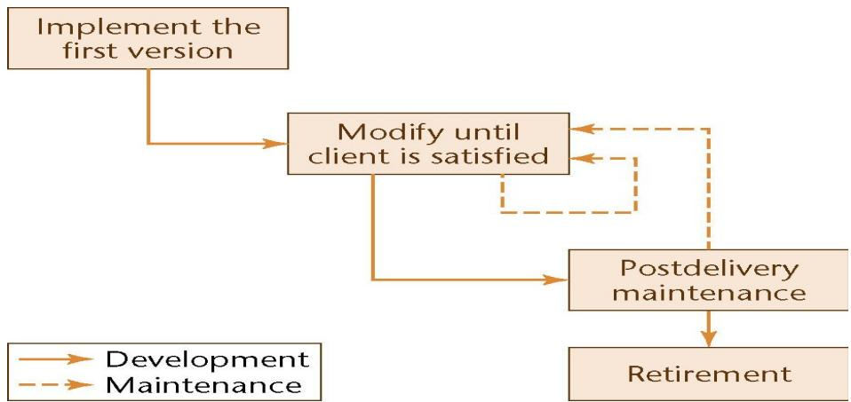  
Hình 1.1: Mô hình xây và sửa

# b. Mô hình thác nước (waterfall)

• Đặc trưng bởi  Các vòng lặp phản hồi  Hướng tài liệu  Mô hình thác nước không biểu hiện thứ tự các sự kiện Thuận lợi  Tài liệu  Bảo trì dễ dàng   
• Bất lợi Tài liệu đặc tả o Joe và Jane Johnson o Mark Marberry

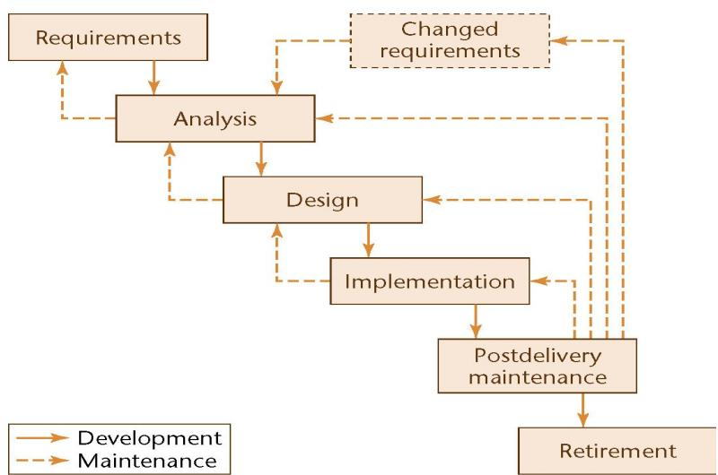  
Hình 1.2: Mô hình thác nước

# c. Mô hình bản mẫu nhanh (Rapid prototype)

• Mô hình tuyến tính

“Nhanh”

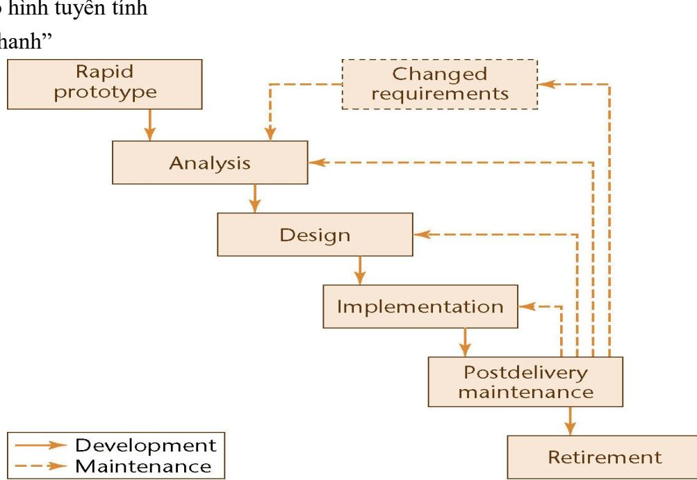  
Hình 1.3: Mô hình bản mẫu nhanh

# d. Mô hình lặp và tăng trưởng (Iteration and Increasement)

• Trong thực tế, chúng ta không thể nói về “pha phân tích”  Mặc dù, các thao tác của pha phân tích trải rộng xuyên suốt vòng đời phần mềm.   
• Tiến trình phát triển phần mềm là lặp  Mỗi phiên bản kế tiếp tiến gần với hệ thống đích hơn phiên bản trước đó.

Luật Miller:

• Ở bất cứ thời điểm nào, chúng ta chỉ có thể tập trung vào khoảng 7 chunks ( tương ứng 7đơn vị thông tin)

• Để xử lý lượng thông tin lớn hơn yêu cầu sử dụng bước làm mịn theo kiểu bậc thang

Tập trung vào các khía cạnh quan trọng nhất hiện thời Các khía cạnh trì hoãn thường ít quan trọng hơn Cuối cùng mọi khía cạnh đều được xử lý nhưng theo thứ tự mức độ quan trọng hiện thời

Đây là tiến trình tăng

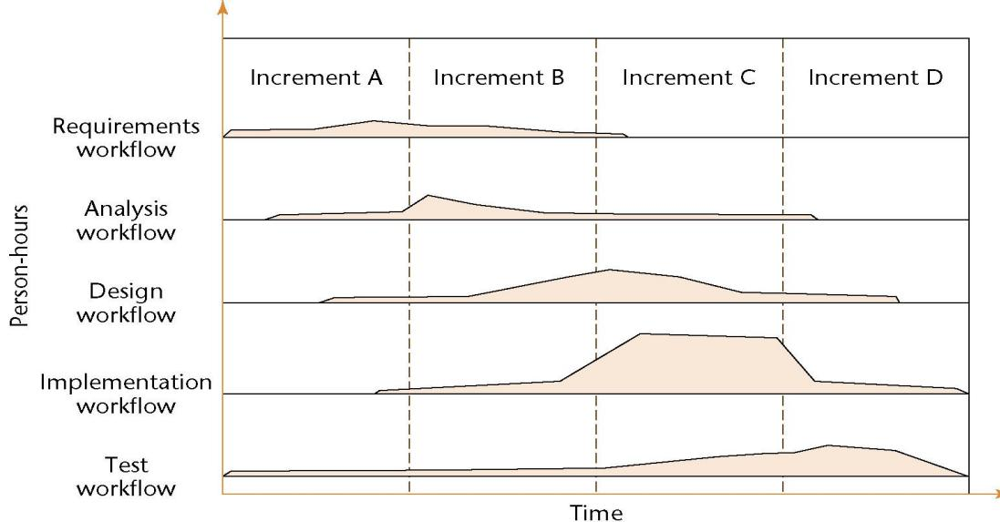  
Hình 1.4: Các bước tăng trưởng

• Lặp và tăng được sử dụng chung với các mô hình khác.

 Không có Episode nào mà chỉ có pha “xác định yêu cầu” hoặc “pha thiết kế” Có nhiều thể hiện ở mỗi pha

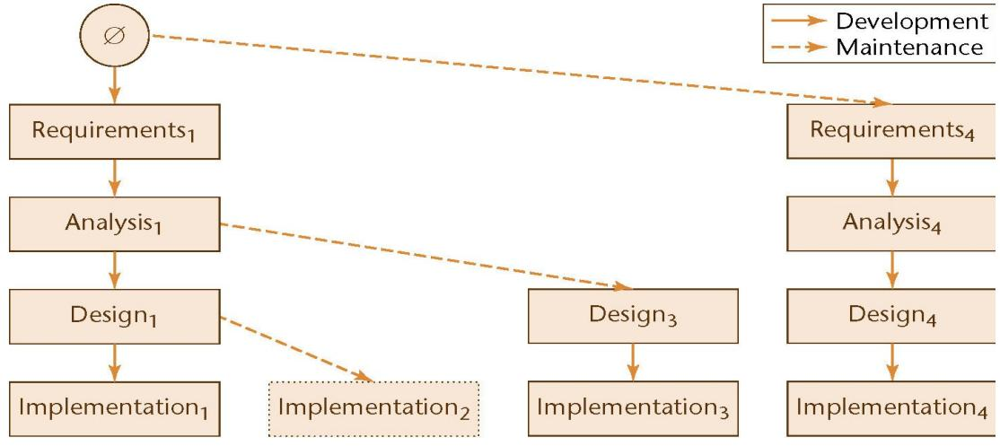  
Episode 1   
Episode 2   
Episode 3   
Episode 4   
Hình 1.5: Các bước lặp và tăng trưởng

• Số lượng của sự gia tăng sẽ thay đổi – không phải là 4 • Và số lượng vòng lặp cũng thay đồi không phải luôn bằng ba.

Các pha cổ điển với các workflow • Các pha tuần tự không có trong thế giới thực • Mặc dù có 5 workflow (luồng công việc) chính được thực hiện ở trên toàn vòng đời phát triển phần mềm

Luồng công việc xác định yêu cầu - Requirements workflow  Luồng công việc phân tích - Analysis workflow  Luồng công việc thiết kế - Design workflow  Luồng công việc cài đặt - Implementation workflow  Luồng công việc kiểm thử - Test workflow

Các luồng công việc

• Cả năm luồng công việc chính được thực hiện trên toàn bộ vòng đời phần mềm Tuy nhiên, ở mỗi một thời điểm có một luồng công việc chiếm ưu thế.

• Chẳng hạn:

 Ở đầu mỗi vòng đời phát triển phần mềm o Luồng công việc đặc tả yêu cầu chiếm ưu thế   
 Ở cuối mỗi vòng đời phát triển phần mềm o Luồng công việc cài đặt và kiểm thử chiếm ưu thế

• Các hoạt động lập kế hoạch và viết tài liệu được thực hiện xuyết suốt vòng đời phát triển phần mềm

Xem xét lại bài toán Winburg Mini

• Mô hình cây tiến hóa đã được thêm vào mô hình vòng đời lặp và tăng • Luồng kiểm thử đã bị bỏ quên – mô hình cây tiến hóa giả sử rằng kiểm thử liên tục

• Đối với quá trình tăng:

Mỗi Episode tương ứng với một sự gia tăng   
Không phải mỗi sự gia tăng đều bao gồm mọi luông công việc   
Sự gia tăng B không được hoàn thiện   
Những đường nét đứt biểu diễn sự bảo trì o Episodes 2, 3: Bảo trì sửa lỗi o Episode 4: Bảo trì hoàn thiện chức năng

Rủi ro và những khía cạnh khác của mô hình lặp và tăng • Chúng ta có thể xem xét toàn bộ dự án như là một tập các dự án nhỏ (quá trình tăng) • Mỗi dự án nhỏ gồm

■ Tài liệu yêu cầu  Tài liệu phân tích  Tài liệu thiết kế  Tài liệu cài đặt

Tài liệu kiểm thử

• Tập tài liệu cuối cùng là sản phẩm phần mềm hoàn thiện • Trong suốt dự án nhỏ:During each mini project we

Mở rộng các tài liệu (Sự gia tăng); (ci:) Kiểm tra tài liệu (luồng công việc kiểm thử); và Nếu cần, thay đổi các tài liệu liên quan (vòng lặp)

• Mỗi vòng lặp có thể được xem xét như là một mô hình vòng đời thác nước nhỏ nhưng hoàn thiện

• Trong suốt mỗi vòng lặp chúng ta lựa chọn một phần của hệ thống phần mềm

• Trong mỗi phần đó cần thực hiện:

 Pha xác định yêu cầu cổ điển  Pha phân tích cổ điển  Pha thiết kế cổ điển (c:) Pha cài đặt cổ điển

Điểm mạnh của mô hình vòng đời lặp và tăng • Có nhiều sự tối ưu cho việc kiểm tra tính đúng đắn của sản phẩm  Mỗi vòng lặp có tích hợp luồng công việc kiểm thử  Các lỗi có thể được phát hiện và sửa chữa sớm

Sự mạnh mẽ của kiến trúc có thể được xác định sớm trong vòng đời  Kiến trúc – các mô đun thành phần khác nhau và cách chúng kết hợp với nhau Sự mạnh mẽ - có khả năng xử lý việc mở rộng và thay đổi mà hệ thống không bị tách thành từng mảnh

• Chúng ta có thể giảm bớt rủi ro sớm hơn  Lúc nào cũng vậy rủi ro luôn liên quan tới quá trình phát triển phần mềm và bảo trì

• Chúng ta có một phiên bản hệ thống phần mềm đang làm việc  Khách hàng và người dùng có thể thử nghiệm với phiên bản này để xác định cái họ cần thay đổi Mức độ thay đổi: các phiên bản từng phần đưa ra để làm cho sự giới thiệu sản phẩm mới tới tổ chức khách hàng dễ dàng hơn.

• Có bằng chứng thực nghiệm chứng tỏ mô hình vòng đời làm việc • Các bản tường trình CHAOS của nhóm Standish đã chỉ ra phần trăm phần mềm thành công tăng

• Lý do của sự suy giảm của các dự án thành công năm 2004 bao gồm:

Nhiều dự án lớn trong năm 2004 hơn năm 2002 (:) Sử dụng mô hình thác nước Thiếu sự quan tâm của người dùng Thiếu sự hỗ trợ từ những người điều hành lâu năm

Việc quản lý lặp và tăng

• Mô hình vòng đời lặp và tăng là tập hợp các mô hình thách nước… • … bởi vì mô hình vòng đời lặp và tăng là mô hình thác nước, được áp dụng liên tiếp • Mỗi sự gia tăng là mộ dự án nhỏ theo mô hình vòng đời thác nước

# e. Mô hình xoắn ốc (Spiral)

Là mô hình bản mẫu nhanh kết hợp với phân tích rủi ro đi kèm ở mỗi pha Đặc điểm chính của mô hình xoán ốc: Nếu các rủi ro không được làm giảm bớt, thì dự án bị kết thúc ngay lập tức.

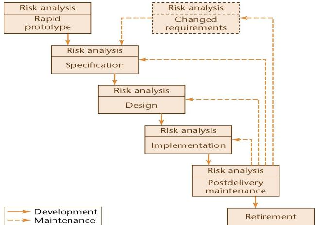  
Hình 1.6: Mô hình xoắn ốc

Mô hình xoắn ốc đầy đủ:

• Ở trước mỗi pha là các giải pháp và phân tích rủi ro • Theo sau mỗi pha là: Đánh giá và lập kế hoạch cho pha tiếp theo • Chiều bán kính: Chi phí tích lũy cho đến hiện tại • Chiều góc: sự đi lên theo vòng ốc

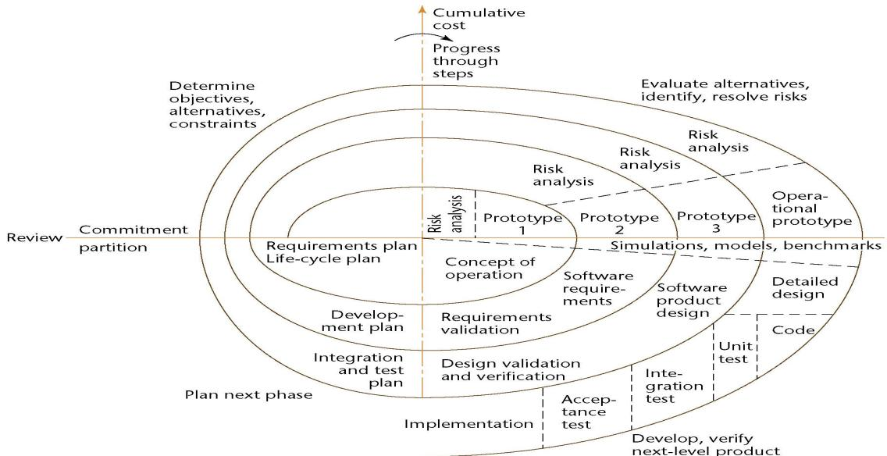  
Hình 1.7: Các bước lặp xoắn ốc

• Điểm mạnh của mô hình xoắn ốc:

• Dễ dàng thay đổi mức độ kiểm thử • Không phân biệt giữa phát triển và bảo trì • Điểm yếu của mô hình xoắn ốc: • Chỉ phù hợp với những phần mềm lớn Chỉ phù hợp với những phần mềm nội bộ

# f. Mô hình mã nguồn mở (Open source)

Hai pha không hình thức • Đầu tiên, một các nhân xây dựng một phiên bản đầu tiên Đưa phiên bản này lên Internet (ví dụ: SourceForge.net)

• Sau đó, nếu có sự quan tâm về dự án này Phiên bản đầu tiên sẽ được tải về một cách rộng rãi  Người dùng trở thành người đồng phát triển Sản phẩm được mở rộng

• Điểm chính: Các cá nhân nhìn chung làm việc tình nguyện đối với dự án mã nguồn mở trong thời gian rảnh rỗi của họ

• Các hoạt động trong pha phi hình thức thứ hai

Báo cáo và sửa lỗi   
o Bảo trì sửa lỗi  Thêm các chức năng mới   
o Bảo trì hoàn thiện chức năng   
o Điều chỉnh phần mềm ở môi trường mới   
o Bảo trì thích hợp   
o Pha phi hình thức thứ hai chỉ bao gồm bảo trì sau khi đã chuyển giao sản phẩm   
o Từ “người đồng phát triển” trong slide trước có thể thay thế bằng từ “đồng bảo trì”

• Mô hình vòng đời bảo trì sau khi chuyển giao sản phẩm • Sản phẩm mã nguồn đóng được bảo trì và kiểm thử bởi nhân viên

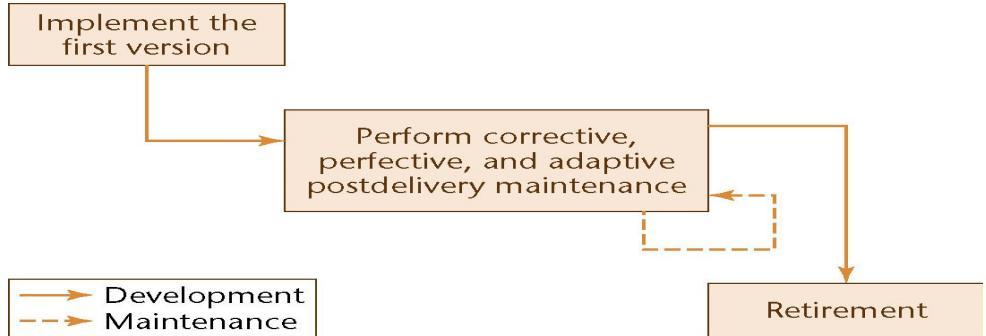  
Hình 1.8: Mô hình mã nguồn mở

Người dùng có thể đưa ra bản tường trình sự thất bại của phần mềm (failure) nhưng không bao giờ đưa ra được lỗi mã nguồn (fault) (vì mã nguồn không sẵn có)

• Phần mềm mã nguồn mở nhìn chung được bảo trì bởi người tình nguyện viên không lương

 Người dùng được khuyến khích đưa ra bản tường trình về sự thất bại của phần mềm (failure) cũng như lỗi mã nguồn (fault)

Nhóm chính

Số lượng nhỏ những người bảo trì tận tụy với sở thích, thời gian và những kỹ năng cần thiết để đưa ra những báo cáo lỗi mã nguồn đã được cố định(“fixes”)   
 Họ chịu trách nhiệm quản lý dữ án   
 Họ có quyền cài đặt lại những lỗi đã cố định

• Nhóm ngoại vi  Users who choose to submit defect reports from time to time

Các phiên bản mới của phần mềm mã nguồn đóng được phát hành thường xuyên một năm một lần  Sau khi đã được kiểm thử cẩn thận bởi nhóm quản lý chất lượng phần mềm

• Các phát hành của nhóm chính của một phiên bản mới của sản phẩm mã nguồn mở được đưa ra ngay khi sẵn sàng

 Có thể là một tháng hoặc thậm chí là một ngày so với với phiên bản trước đó   
 Nhóm chính thực hiện kiểm thử tối thiểu Kiểm thử mở rộng được thực hiện bởi các thành viên của nhóm ngoại vi trong suốt thời gian sử dụng phần mềm   
□: “Phát hành sớm và thường xuyên”

• Phiên bản làm việc đầu tiên được đưa ra khi sử dụng:

Mô hình bản mẫu nhanh;  Mô hình xây và sửa; và  Mô hình mã nguồn mở

• Sau đó:

Mô hình bản mẫu nhanh o Phiên bản đầu tiên bị bỏ qua Mô hình xây và sửa và mô hình vòng đời mã nguồn mở o Phiên bản ban đầu trở thành phiên bản đích

• Do đó, trong dự án mã nguồn mở, nhình chung không có đặc tả và không có thiết kế • Một số dự án mã nguồn mở đã thành công như thế nào khi không có đặc tả hoặc thiết kế?

• Sản phẩm mã nguồn mở đã thu hút được một số chuyên gia phần mềm tốt nhất trên thế giới  Họ có thể xây dựng các chức năng hiệu quả mà không cần đặc tả hoặc thiết kế

• Tuy nhiên, cuối cùng thì sự phát triển sản phẩm mã nguồn mở cũng dừng lại khi mà nó không có sự bảo trì nữa

• Nó có thể thành công cực độ đối với những dự án cơ sở hạ tầng như

Hệ điều hành (Linux, OpenBSD, Mach, Darwin)   
 Trình duyệt Web (Firefox, Netscape)   
 Trình biên dịch (gcc) Máy chủ Web (Apache) Hệ thống quản lý dữ liệu (MySQL)   
Không thể phát triển mã nguồn mở một sản phẩm phần mềm mà chỉ được sử dụng trong tổ chức thương mại  Các thành viên của cả nhóm chính và nhóm ngoại vi đều luôn luôn là những người dùng của phần mềm đang được phát triển   
• Mô hình vòng đời mã nguồn mở không không thể áp dụng được trừ khi sản phẩm đích được xem xét bởi một số lượng lớn người dùng vì sản phẩm đó có ích cho họ. Khoảng một nửa dự án mã nguồn mở trên Web không thu hút được các nhóm phát triển vào làm việc cho dự án   
• Even where work has started, the overwhelming preponderance will never be completed   
• Nhưng khi mô hình mã nguồn mở đã làm việc thì đối khi nó cũng đem lại thành công đáng kinh ngạc  Những sản phẩm mã nguồn mở được kể ở slide trước đã đước sử dụng bởi hàng triệu người dùng

# 1.3 UML - CÔNG CỤ HỖ TRỢ PHÂN TÍCH THIẾT KẾ HƯỚNG ĐỐI TƯỢNG

# 1.3.1 Lịch sử ra đời của UML

Việc áp dụng rộng rãi phương pháp hướng đối tượng đã đặt ra yêu cầu cần phải xây dựng một phương pháp mô hình hóa để có thể sử dụng như một chuẩn chung cho những người phát triển phần mềm hướng đối tượng trên khắp thế giới. Trong khi các ngôn ngữ hướng đối tượng ra đời khá sớm, ví dụ như Simula-67 (năm 1967), Smalltalk (đầu những năm 1980), C++, CLOS (giữa những năm 1980)…thì những phương pháp luận cho phát triển hướng đối tượng lại ra đời khá muộn. Cuối những năm 80, đầu những năm 1990, một loạt các phương pháp luận và ngôn ngữ mô hình hóa hướng đối tượng mới ra đời, như Booch của Grady Booch, OMT của James Rambaugh, OOSE của Ivar Jacobson, hay OOA and OOD của Coad và Yordon.

Mỗi phương pháp luận và ngôn ngữ trên đều có hệ thống ký hiệu riêng, phương pháp xử lý riêng và công cụ hỗ trợ riêng. Chính điều này đã thúc đẩy những người tiên phong trong lĩnh vực mô hình hoá hướng đối tượng ngồi lại cùng nhau để tích hợp những điểm mạnh của mỗi phương pháp và đưa ra một mô hình thống nhất chung. Nỗ lực thống nhất đầu tiên bắt đầu khi Rumbaugh gia nhập nhóm nghiên cứu của Booch tại tập đoàn Rational năm 1994 và sau đó Jacobson cũng gia nhập nhóm này vào năm 1995.

James Rumbaugh, Grady Booch và Ivar Jacobson đã cùng cố gắng xây dựng được một Ngôn Ngữ Mô Hình Hoá Thống Nhất và đặt tên là UML (Unifield Modeling Language). UML đầu tiên được đưa ra năm 1997 và sau đó được chuẩn hoá để trở thành phiên bản 1.0. Chương này trình bày ngôn ngữ UML phiên bản 2.0.

# 1.3.2 UML – Ngôn ngữ mô hình hoá hướng đối tượng

UML (Unified Modelling Language) là ngôn ngữ mô hình hoá tổng quát được xây dựng để đặc tả, phát triển và viết tài liệu cho các khía cạnh trong phát triển phần mềm hướng đối tượng. UML giúp người phát triển hiểu rõ và ra quyết định liên quan đến phần mềm cần xây dựng. UML bao gồm một tập các khái niệm, các ký hiệu, các biểu đồ và hướng dẫn. UML hỗ trợ xây dựng hệ thống hướng đối tượng dựa trên việc nắm bắt khía cạnh cấu trúc tĩnh và các hành vi động của hệ thống.

• Các cấu trúc tĩnh định nghĩa các kiểu đối tượng quan trọng của hệ thống, nhằm cài đặt và chỉ ra mối quan hệ giữa các đối tượng đó.   
• Các hành vi động (dynamic behavior) định nghĩa các hoạt động của các đối tượng theo thời gian và tương tác giữa các đối tượng hướng tới đích.

Các mục đích của ngôn ngữ mô hình hoá thống nhất UML:

• Mô hình hoá các hệ thống sử dụng các khái niệm hướng đối tượng.   
• Thiết lập sự liên hệ từ nhận thức của con người đến các sự kiện cần mô hình hoá.   
• Giải quyết vấn đề về mức độ thừa kế trong các hệ thống phức tạp với nhiều ràng buộc khác nhau.   
• Tạo một ngôn ngữ mô hình hoá có thể sử dụng được bởi người và máy.

UML quy định một loạt các ký hiệu và quy tắc để mô hình hoá các pha trong quá trình phát triển phần mềm hướng đối tượng dưới dạng các biểu đồ.

# 1.3.3 Các khái niệm cơ bản trong UML

# Khái niệm mô hình

Mô hình là một biểu diễn của sự vật hay một tập các sự vật trong một lĩnh vực áp dụng nào đó theo một cách khác. Mô hình nhằm nắm bắt các khía cạnh quan trọng của sự vật, bỏ qua các khía cạnh không quan trọng và biểu diễn theo một tập ký hiệu và quy tắc nào đó. Các mô hình thường được xây dựng sao cho có thể vẽ được thành các biểu đồ dựa trên tập ký hiệu và quy tắc đã cho.

Khi xây dựng các hệ thống, mô hình được sử dụng nhằm thoả mãn các mục đích sau:

• Nắm bắt chính xác yêu cầu và tri thức miền mà hệ thống cần phát triển • Thể hịên tư duy về thiết kế hệ thống • Trợ giúp ra quyết định thiết kế dựa trên việc phân tích yêu cầu • Tổ chức, tìm kiếm, lọc, kiểm tra và sửa đổi thông tin về các hệ thống lớn.

• Làm chủ được các hệ thống phức tạp

Các thành phần trong một mô hình bao gồm:

Ngữ nghĩa và biểu diễn: Ngữ nghĩa là nhằm đưa ra ý nghĩa, bản chất và các tính chất của tập các ký hiệu. Biểu diễn là phương pháp thể hiện mô hình theo cách sao cho có thể nhìn thấy được. • Ngữ cảnh: mô tả tổ chức bên trong, cách sử dụng mô hình trong tiến trình phần mềm

# • Các hướng nhìn (View) trong UML

Các mô hình trong UML nhằm mục đích hỗ trợ phát triển các hệ thống phần mềm hướng đối tượng. Trong phương pháp luận hướng đối tượng không có sự phân biệt rạch ròi giữa các pha hay các bước. Tuy nhiên, thông thường UML vẫn được chia thành một số hướng nhìn và nhiều loại biểu đồ.

Một hướng nhìn trong UML là một tập con các biểu đồ UML được xây dựng để biểu diễn một khía cạnh nào đó của hệ thống.

Sự phân biệt giữa các hướng nhìn là rất linh hoạt. Có thể có những biểu đồ UML có mặt trong cả hai hướng nhìn. Các hướng nhìn cùng các biểu đồ tương ứng được mô tả trong bảng sau:

Khía cạnh Hướng nhìn Các biểu Các khái niệm chính chính đồ   
Khía cạnh cấu Hướng nhìn tĩnh (static Biểu đồ lớp, liên hệ, kế thừa, phụ   
trúc hệ thống view) lớp thuộc, giao diện Hướng nhìn use case Biểu đồ Use case, tác nhân, liên (Use case view) use case hệ, extend, include … Hướng nhìn cài đặt Biểu đồ Thành phần, giao diện, (implementation view) thành phần quan hệ phụ thuộc … Hướng nhìn triển khai Biểu đồ Node, thành phần, quan hệ (deployment view) triển khai phụ thuộc, vị trí (location)   
Khía cạnh động Hướng nhìn máy trạng Biểu đồ Trạng thái, sự kiện, thái (state machine view) trạng thái chuyển tiếp, hành động Hướng nhìn hoạt động Biểu đồ Trạng thái, sự kiện, (activity view) động chuyển tiếp, kết hợp, đồng bộ … Hướng nhìn tương tác Biểu đồ Tương tác, đối tượng, (interaction view) tuần tự thông điệp, kích hoạt …

Biểu đồ Cộng tác, vai trò cộng tác, cộng tác thông điệp … Khía cạnh quản Hướng nhìn quản lý mô Biểu đồ Gói, hệ thống con, mô lý mô hình hình lớp hình Khía cạnh khả Tất cả Tất cả Các ràng buộc, stereotype, năng mở rộng …

# 1.3.4 Các biểu đồ UML

Thành phần mô hình chính trong UML là các biểu đồ:

Biểu đồ use case biểu diễn sơ đồ chức năng của hệ thống. Từ tập yêu cầu của hệ thống, biểu đồ use case sẽ phải chỉ ra hệ thống cần thực hiện điều gì để thoả mãn các yêu cầu của người dùng hệ thống đó. Đi kèm với biểu đồ use case là các kịch bản.

• Biểu đồ lớp chỉ ra các lớp đối tượng trong hệ thống, các thuộc tính và phương thức của từng lớp và các mối quan hệ giữa những lớp đó.

• Biểu đồ trạng thái tương ứng với mỗi lớp sẽ chỉ ra các trạng thái mà đối tượng của lớp đó có thể có và sự chuyển tiếp giữa những trạng thái đó.

Các biểu đồ tương tác biểu diễn mối liên hệ giữa các đối tượng trong hệ thống và giữa các đối tượng với các tác nhân bên ngoài. Có hai loại biểu đồ tương tác:

 Biểu đồ tuần tự: Biểu diễn mối quan hệ giữa các đối tượng và giữa các đối tượng và tác nhân theo thứ tự thời gian.

 Biểu đồ cộng tác: Biểu diễn mối quan hệ giữa các đối tượng và giữa các đối tượng và tác nhân nhưng nhấn mạnh đến vai trò của các đối tượng trong tương tác.

• Biểu đồ hoạt động biểu diễn các hoạt động và sự đồng bộ, chuyển tiếp các hoạt động, thường được sử dụng để biểu diễn các phương thức phức tạp của các lớp.

• Biểu đồ thành phần định nghĩa các thành phần của hệ thống và mối liên hệ giữa các thành phần đó.

• Biểu đồ triển khai hệ thống mô tả hệ thống sẽ được triển khai như thế nào, thành phần nào được cài đặt ở đâu, các liên kết vật lý hoặc giao thức truyền thông nào được sử dụng.

Dựa trên tính chất của các biểu đồ, UML chia các biểu đồ thành hai lớp mô hình1:

Biểu đồ mô hình cấu trúc (Structural Modeling Diagrams): biểu diễn các cấu trúc tĩnh của hệ thống phần mềm được mô hình hoá. Các biểu đồ trong mô hình tĩnh tập trung biểu diễn khía cạnh tĩnh của hệ thống, liên quan đến cấu trúc cơ bản cũng như các phần tử chính trong miền quan tâm của bài toán. Các biểu đồ trong mô hình tĩnh bao gồm:

1.

2.

3.

Biểu đồ gói Biểu đồ đối tượng và lớp Biểu đồ thành phần Biểu đồ triển khai

4.

Biểu đồ mô hình hành vi (Behavioral Modeling Diagrams): Nắm bắt đến các hoạt động và hành vi của hệ thống, cũng như tương tác giữa các phần tử bên trong và bên ngoài hệ thống. Các dạng biểu đồ trong mô hình động bao gồm:

Biểu đồ use case Biểu đồ tương tác dạng tuần tự Biểu đồ tương tác dạng cộng tác Biểu đồ trạng thái Biểu đồ động

Chúng ta sẽ lần lượt xem xét chi tiết các biểu đồ UML, mỗi biểu đồ sẽ được trình bày ý nghĩa của nó, tập kí hiệu UML cho biểu đồ đó và một ví dụ.

# a. Biểu đồ use case Ý nghĩa

Biểu đồ use case biểu diễn sơ đồ chức năng của hệ thống. Từ tập yêu cầu của hệ thống, biểu đồ use case sẽ phải chỉ ra hệ thống cần thực hiện điều gì để thoả mãn các yêu cầu của người dùng hệ thống đó. Đi kèm với biểu đồ use case là các kịch bản (scenario). Có thể nói, biểu đồ use case chỉ ra sự tương tác giữa các tác nhân và hệ thống thông qua các use case.

Mỗi use case mô tả một chức năng mà hệ thống cần phải có xét từ quan điểm người sử dụng. Tác nhân là con người hay hệ thống thực khác cung cấp thông tin hay tác động tới hệ thống.

Một biểu đồ use case là một tập hợp các tác nhân, các use case và các mối quan hệ giữa chúng. Các use case trong biểu đồ use case có thể được phân rã theo nhiều mức khác nhau.

# Tập ký hiệu UML cho biểu đồ use case

Một biểu đồ Use Case chứa các phần tử mô hình biểu thị hệ thống, tác nhân cũng như các trường hợp sử dụng và các mối quan hệ giữa các Use Case. Chúng ta sẽ lần lượt xem xét các phần tử mô hình này:

• Hệ thống: Với vai trò là thành phần của biểu đồ use case, hệ thống biểu diễn ranh giới giữa bên trong và bên ngoài của một chủ thể trong phần mềm chúng ta đang xây dựng. Chú ý rằng một hệ thống ở trong biểu đồ use case không phải bao giờ cũng nhất thiết là một hệ thống phần mềm; nó có thể là một chiếc máy, hoặc là một hệ thống thực (như một doanh nghiệp, một trường đại học, …).

Tác nhân (actor): là người dùng của hệ thống, một tác nhân có thể là một người dùng thực hoặc các hệ thống máy tính khác có vai trò nào đó trong hoạt động của hệ thống. Như vậy, tác nhân thực hiện các use case. Một tác nhân có thể thực hiện nhiều use case và ngược lại một use case cũng có thể được thực hiện bởi nhiều tác nhân.

Các use case: Đây là thành phần cơ bản của biểu đồ use case. Các use case được biểu diễn bởi các hình elip. Tên các use case thể hiện một chức năng xác định của hệ thống.

• Mối quan hệ giữa các use case: giữa các use case có thể có các mối quan hệ như sau:

• Include: use case này sử dụng lại chức năng của use case kia.

• Extend: use case này mở rộng từ use case kia bằng cách thêm vào một chức năng cụ thể.

• Generalization: use case này được kế thừa các chức năng từ use case kia.

Các phần tử mô hình use case cùng với ý nghĩa và cách biểu diễn của nó được tổng kết trong Bảng 1.2.

Bảng 1.2: Các phần tử mô hình trong biểu đồ use case   

<table><tr><td rowspan=1 colspan=1>Phàn túr môhình</td><td rowspan=1 colspan=2>Y ngha</td><td rowspan=1 colspan=1>Cách bieu din</td><td rowspan=1 colspan=1>Ký hiu trong biêu dò</td></tr><tr><td rowspan=1 colspan=3>U                Biu din môt Hinh ellip chúra tên cüaUsecase namechúc nng xác use casedinh cúa h thóng</td><td rowspan=1 colspan=1>Biu din môt Hinh ellip chúra tên cüa</td><td rowspan=1 colspan=1></td></tr><tr><td rowspan=1 colspan=1>Tác nhân</td><td rowspan=1 colspan=2>Là môt dói tuongbên ngoài h thóngtuong tác tryc tiépvói các use case</td><td rowspan=1 colspan=1>Bieu din bōi môt lópkiu actor (hinh nguòituąng trung)</td><td rowspan=1 colspan=1>Actor</td></tr><tr><td rowspan=1 colspan=1>Me xtendgianchadesecase _ − − − −</td><td rowspan=1 colspan=2>Tiy tùng dang Extend và include cóquan h− →</td><td rowspan=1 colspan=1>Tiy tùng dang Extend và include códang các mūi tên dútnétGeneralization có dangmūi tên tam giác.</td><td rowspan=1 colspan=1></td></tr><tr><td rowspan=1 colspan=2>m</td><td rowspan=1 colspan=1>ch bit phàn bênng và bên ngoàihe thóng</td><td rowspan=1 colspan=1>Dugc biu din bói mthinh chū nhât rōng.</td><td rowspan=1 colspan=1></td></tr></table>

# b. Biểu đồ lớp Ý nghĩa

Trong phương pháp hướng đối tượng, một nhóm đối tượng có chung một số thuộc tính và phương thức tạo thành một lớp. Mối tương tác giữa các đối tượng trong hệ thống sẽ được biểu diễn thông qua mối quan hệ giữa các lớp.

Các lớp (bao gồm cả các thuộc tính và phương thức) cùng với các mối quan hệ sẽ tạo thành biểu đồ lớp. Biểu đồ lớp là một biểu đồ dạng mô hình tĩnh nhằm mô tả hướng nhìn tĩnh về một hệ thống bằng các khái niệm lớp, các thuộc tính, phương thức của lớp và mối quan hệ giữa chúng với nhau.

# Tập ký hiệu UML cho biểu đồ lớp

Trong phần này, tài liệu sẽ xem xét các vấn đề liên quan đến biểu diễn sơ đồ lớp trong UML.   
Cuối phần này sẽ là một bảng tổng kết các ký hiệu UML sử dụng trong sơ đồ lớp.

• Kí hiệu lớp: trong UML, mỗi lớp được biểu diễn bởi hình chữ nhật gồm 3 phần: tên lớp, các thuộc tính và các phương thức.

• Thuộc tính: các thuộc tính trong biểu đồ lớp được biểu diễn theo cấu trúc chung như sau:

phạm_vi tên : kiểu số_đối_tượng = mặc_định (Giá_ trị_giới_hạn )

Trong đó:

phạm_vi cho biết phạm vi truy nhập của thuộc tính. Có ba kiểu xác định thuộc tính phổ biến là:

+: thuộc tính kiểu public   
#: thuộc tính kiểu protected   
-: thuộc tính kiểu private.   
\~: thuộc tính được phép truy nhập tới từ các lớp trong cùng package

Các phạm vi của thuộc tính có thể được biểu diễn dưới dạng ký hiệu (+, #, -, \~) hoặc biểu diễn dưới dạng các từ khoá (public, protected, private).

Tên: là xâu ký tự biểu diễn tên thuộc tính.   
kiểu: là kiểu dữ liệu của thuộc tính.   
số_đối_tượng: chỉ ra số đối tượng khai báo cho thuộc tính ứng với một mặc_định: là giá trị khởi đầu mặc định (nếu có) của thuộc tính.

Giá_ trị_giới_hạn: là giới hạn các giá trị cho thuộc tính (thông tin này không bắt buộc).

purchaseDate:Date[1] =”01-01-2000” (Saturday)

• Phương thức (method): các phương thức trong UML được biểu diễn theo cấu trúc chung như sau [UNG]:

phạm_vi tên(danh_s ách_tham_số): kiểu_trả_lại { ki ểu_ph ương_thức}

Trong đó:

visibility biểu diễn phạm vi cho phương thức. Giống như đối với thuộc tính, có ba dạng kiểu xác định cơ bản cho phương thức là:

• +: phương thức kiểu public   
• #: phương thức kiểu protected   
• -: phương thức kiểu private   
• \~: phương thức được phép truy nhập tới từ các lớp trong cùng package tên là xâu ký tự xác định tên của phương thức.   
kiểu_trả_lại: chỉ ra kiểu giá trị trả về của phương thức.   
danh_sách_tham_số: biểu diễn danh sách các tham số trong khai báo của phương thức.   
Mỗi tham số được biểu diễn dưới dạng chung: tên tham số: kiểu giá trị = giá trị mặc định.

ki ểu_ph ương_thức: không bắt buộc, cho biết kiểu phương thức. Phương thức có thể nhận một trong các kiểu đặc biệt sau:

abstract: phương thức kiểu trừu tượng query: phương thức kiểu truy vấn.

Ví dụ một khai báo phương thức cho một lớp:

generatePurchaseList(prodID:int): String

# • Các kiểu lớp trong UML

UML định nghĩa một số kiểu lớp đăc biệt dựa trên vai trò của nó trong biểu đồ lớp. Ngoài kiểu lớp thông thường đã trình bày ở trên, UML còn định nghĩa một số kiểu lớp bổ sung gồm:

Lớp thực thể: là lớp đại diện cho các thực thể chứa thông tin về các đối tượng xác định nào đó.   
Lớp biên (lớp giao diện): là lớp nằm ở ranh giới giữa hệ thống với môi trường bên ngoài, thực hiện vai trò nhận yêu cầu trực tiếp từ các tác nhân và chuyển các yêu cầu đó cho các lớp bên trong hệ thống.   
Lớp điều khiển: thực hiện các chức năng điều khiển hoạt động của hệ thống ứng với các chức năng cụ thể nào đó với một nhóm các lớp biên hoặc lớp thực thể xác định.

Lớp thực thể

Lớp biên (lớp giao diện)

3 Lớp điều khiển

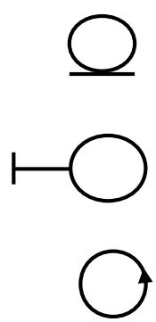  
Bảng 1.3: Các kiểu lớp trong UML

# • Các mối quan hệ trong biểu đồ lớp

Giữa các lớp có các dạng quan hệ cơ bản như sau:

Quan hệ kết hợp (Association): Một kết hợp (association) là một sự nối kết giữa các lớp, cũng có nghĩa là sự nối kết giữa các đối tượng của các lớp này. Trong UML, một quan hệ đượcấnc định nhằm mô tả một tập hợp các liên kết (links), tức là một sự liên quan về ngữ nghĩa (semantic connection) giữa một nhóm các đối tượng được biểu diễn bởi các lớp tương ứng. Mặc định, quan hệ kết hợp được biểu diễn bởi đoạn thẳng 2 chiều nối 2 đối tượng và có thể kèm theo ngữ nghĩa của quan hệ tại hai đầu của đoạn thẳng.

Khái quát hóa (Generalization): Khái quát hóa là mối quan hệ giữa một lớp có các đặc trưng mang tính khái quát cao hơn và một lớp có tính chất đặc biệt hơn. Trong sơ đồ lớp, mối quan hệ khái quát hóa chính là sự kế thừa của một lớp từ lớp khác. Quan hệ khái quát hoá được biểu diễn bằng một mũi tên có tam giác rỗng gắn ở đầu.

Quan hệ cộng hợp (Aggregation): là dạng quan hệ mô tả một lớp A là một phần của lớp B và lớp A có thể tồn tại độc lập. Quan hệ cộng hợp được biểu diễn bằng một mũi tên gắn hình thoi rỗng ở đầu hướng về lớp bao hàm.

Quan hệ gộp (Composition): Một quan hệ gộp biểu diễn một quan hệ kiểu tổng thể-bộ phận. Lớp A có quan hệ gộp với lớp B nếu lớp A là một phần của lớp B và sự tồn tại của đối tượng lớp B điều khiển sự tồn tại của đối tượng lớp A. Quan hệ này được biểu diễn bởi một mũi tên gắn hình thoi đặc ở đầu.

Quan hệ phụ thuộc (Dependency): Phụ thuộc là mối quan hệ giữa hai lớp đối tượng: một lớp đối tượng A có tính độc lập và một lớp đối tượng B phụ thuộc vào A; một sự thay đổi của A sẽ ảnh hưởng đến lớp phụ thuộc B.

Quan hệ thực thi (Realization): biểu diễn mối quan hệ ngữ nghĩa giữa các thành phần của biểu đồ lớp, trong đó một thành phần mô tả một công việc dạng hợp đồng và thành phần còn lại thực hiện hợp đồng đó. Thông thường lớp thực hiện hợp đồng có thể là các giao diện.

Bảng 1.4 tổng kết các phần tử mô hình UML được sử dụng trong mô hình lớp, ý nghĩa và ký hiệu tương ứng trong các biểu đồ.

Bảng 1.4: Tóm tắt các phần tử mô hình UML trong biểu đồ lớp   

<table><tr><td rowspan=1 colspan=3>Phàn tü môhình</td><td rowspan=1 colspan=3>Y nghãa</td><td rowspan=1 colspan=1>Cách biu din</td><td rowspan=1 colspan=3>Ký hiçu trong biu dò</td></tr><tr><td rowspan=4 colspan=3>Lóp (class)</td><td rowspan=4 colspan=3>Bieu din tên lóp, các thuc tính và nhât gom 3 phànphuong thúc cua tách bit.lóp dó.</td><td rowspan=4 colspan=1>Môt hinh chūcác thuc tính và nhât gom 3 phàn</td><td></td><td rowspan=1 colspan=1>Tên lóp</td><td rowspan=4 colspan=1></td></tr><tr><td></td><td rowspan=1 colspan=1>Các thuc tính</td></tr><tr><td></td><td rowspan=1 colspan=1>Các phuong thúc</td></tr><tr><td></td><td></td></tr><tr><td rowspan=2 colspan=3>Quan h kiêuop Tên</td><td rowspan=3 colspan=3>Bieu din quan h Môt duòng kěhai lóp dôc lièn nét (có têncó liên quan xác dinh) noidén nhau.</td><td rowspan=3 colspan=1>Bieu din quan h Môt duòng kěhai lóp dôc lièn nét (có têncó liên quan xác dinh) noigiūa hai lóp.</td><td rowspan=3 colspan=3></td></tr><tr><td rowspan=1 colspan=2></td></tr><tr><td rowspan=1 colspan=3></td></tr><tr><td rowspan=4 colspan=3> hê gop</td><td rowspan=4 colspan=3>din quan hê Duòng ké liènbô phân tong thê.</td><td rowspan=4 colspan=1>din quan hê Duòng ké liènnét có hinh thoi odàu.</td><td rowspan=4 colspan=3></td></tr><tr><td rowspan=1 colspan=1></td></tr><tr><td rowspan=1 colspan=1></td></tr><tr><td rowspan=1 colspan=1></td></tr><tr><td rowspan=1 colspan=3>Quan hê khái PLóp này thùaquát hoá (ké huöng các thucu)</td><td rowspan=1 colspan=3>Quan hê khái PLóp này thùaquát hoá (ké huöng các thuc=phuong thúccúa lóp kia</td><td rowspan=1 colspan=1>Mūi tên tam giác.</td><td rowspan=1 colspan=3></td></tr><tr><td rowspan=3 colspan=3>hê phu</td><td rowspan=3 colspan=3>p phu thucau trong hoataong cúa h thóng.</td><td rowspan=3 colspan=1>Mūi tên dút nét.</td><td rowspan=3 colspan=3></td></tr><tr><td rowspan=1 colspan=1></td></tr><tr><td rowspan=1 colspan=1></td></tr></table>

# c. Biểu đồ trạng thái Ý nghĩa

Biểu đồ trạng thái được sử dụng để biểu diễn các trạng thái và sự chuyển tiếp giữa các trạng thái của các đối tượng trong một lớp xác định. Thông thường, mỗi lớp sẽ có một biểu đồ trạng thái (trừ lớp trừu tượng là lớp không có đối tượng). Biểu đồ trạng thái được biểu diễn dưới dạng máy trạng thái hữu hạn với các trạng thái và sự chuyển tiếp giữa các trạng thái đó. Có hai dạng biểu đồ trạng thái:

• Biểu đồ trạng thái cho một use case: mô tả các trạng thái và chuyển tiếp trạng thái của một đối tượng thuộc một lớp nào đó trong hoạt động của một use case cụ thể.

Biểu đồ trạng thái hệ thống mô tả tất cả các trạng thái của một đối tượng trong toàn bộ hoạt động của cả hệ thống.

# Tập ký hiệu UML cho biểu đồ trạng thái

Các thành phần trong một biểu đồ trạng thái bao gồm:

Trạng thái (state). Bên trong các trạng thái có thể miêu tả các biến trạng thái hoặc các hành động (action) tương ứng với trạng thái đó.

Trạng thái con (substate): là một trạng thái chứa bên trong một trạng thái khác. Trạng thái có nhiều trạng thái con gọi là trạng thái tổ hợp.

• Trạng thái khởi đầu (initial state): trạng thái đầu tiên khi kích hoạt đối tượng.

• Trạng thái kết thúc (final state): kết thúc vòng đời đối tượng.

• Các chuyển tiếp (transition): biểu diễn các chuyển đổi giữa các trạng thái.

• Sự kiện (event): sự kiện tác động gây ra sự chuyển đổi trạng thái. Mỗi sự kiện được đi kèm với các điều kiện (guard) và các hành động (action).

Trong biểu đồ trạng thái của UML, một số loại sự kiện sau đây sẽ được xác định:

• Sự kiện gọi (call event): Yêu cầu thực hiện một hành động (một phương thức)   
• Sự kiện tín hiệu (signal event): Gửi thông điệp (chứa các giá trị thuộc tính tham số liên quan) giữa các trạng thái.   
• Sự kiện thời gian (time event): Biểu diễn quá trình chuyển tiếp theo thời gian, thường kèm theo từ mô tả thời gian cụ thể.

Các phần tử mô hình UML và ký hiệu tương ứng cho biểu đồ trạng thái được tổng kết như trong Bảng 1.5.

<table><tr><td rowspan=1 colspan=1>Phàn türmô hinh</td><td rowspan=1 colspan=1>Y ngha</td><td rowspan=1 colspan=1>Biêu din</td><td rowspan=1 colspan=1>Ký hiu trong biěu dò</td></tr><tr><td rowspan=1 colspan=1>Trang thái</td><td rowspan=1 colspan=1>Bieu din môt trangthái cúa dói tugng o góc, gom 3 phàn:trong vòng dòi cúa tên, các bién, và cácdói tuçng dó.</td><td rowspan=1 colspan=1>Hinh chū nhât vòngthái cúa dói tugng o góc, gom 3 phàn:trong vòng dòi cúa tên, các bién, và cáchoat dng.</td><td rowspan=1 colspan=1>NameState variablesActivities</td></tr><tr><td rowspan=1 colspan=1>khōi dàu</td><td rowspan=1 colspan=1>Trang thái Khöi dàu vòng dòi Hinh tròn dccùa dói tugng.</td><td rowspan=1 colspan=1></td><td rowspan=1 colspan=1></td></tr><tr><td rowspan=1 colspan=1>két thúc</td><td rowspan=1 colspan=1>cua dói tugng.</td><td rowspan=1 colspan=1>nhau</td><td rowspan=1 colspan=1></td></tr></table>

Bảng 1.5: Các phần tử mô hình UML trong biểu đồ trạng thái   

<table><tr><td>Chuyén (transition)  khác</td><td>Chuyén tù trang thái tiépTên_chuynytinng trang thi</td><td>Mūi tên lièn nét vói tên goi là bieu din cúa chuyén tiép dó.</td><td></td></tr></table>

# d. Biểu đồ tương tác dạng tuần tự

Các biểu đồ tương tác biểu diễn mối liên hệ giữa các đối tượng trong hệ thống và giữa các đối tượng với các tác nhân bên ngoài. Có hai loại biểu đồ tương tác: Biểu đồ tuần tự và biểu đồ cộng tác.

# Ý nghĩa

Biểu đồ tuần tự: Biểu diễn mối quan hệ giữa các đối tượng, giữa các đối tượng và tác nhân theo thứ tự thời gian. Biểu đồ tuần tự nhấn mạnh thứ tự thực hiện của các tương tác.

# Tập ký hiệu UML cho biểu đồ tuần tự

Các thành phần cơ bản của một biểu đồ tuần tự là:

Các đối tượng (object): được biểu diễn bởi các hình chữ nhật, bên trong là tên của đối tượng. Cách viết chung của đối tượng là: tên đối tượng: tên lớp. Nếu chỉ viết: tên_lớp thì có nghĩa là bất cứ đối tượng nào của lớp tương ứng đó. Trong biểu đồ tuần tự, không phải các đối tượng đều xuất hiện ở trên cùng của biểu đồ mà chúng chỉ xuất hiện (về mặt thời gian) khi thực sự tham gia vào tương tác.

Các message: được biểu diễn bằng các mũi tên hướng từ đối tượng gửi sang đối tượng nhận. Tên các message có thể biểu diễn dưới dạng phi hình thức (như các thông tin trong kịch bản) hoặc dưới dạng hình thức (với dạng giống như các phương thức). Biểu đồ tuần tự cho phép có các message từ một đối tượng tới chính bản thân nó.

Trong biểu đồ tuần tự có thể có nhiều loại message khác nhau tuỳ theo mục đích sử dụng và tác động của message đến đối tượng. Các dạng message được tổng kết trong Bảng 1.6 dưới đây:

<table><tr><td>ST</td><td>Loai message</td><td>Mô tá</td><td>Biêu diên</td></tr><tr><td>T 1</td><td>Goi (call)</td><td>Mô tà môt lòi goi tù dói</td><td>Method()</td></tr><tr><td></td><td></td><td>tuong này dén dói tuong kia.</td><td></td></tr><tr><td></td><td>Tr vè (return)</td><td>Trá vè giá tri úng vói lòi goi</td><td></td></tr><tr><td></td><td></td><td></td><td>Giá tri trà vè</td></tr><tr><td>3</td><td>Güri (send)</td><td>Gúi môt tín hiu tói môt dói tugng</td><td>Send()</td></tr><tr><td></td><td>4 Tao (create)</td><td>Tao môt dói tuong</td><td>&lt;&lt;create&gt;&gt;</td></tr><tr><td></td><td>5 Huy (destroy)</td><td>Huy môt dói tuong</td><td>&lt;&lt;destroy&gt;&gt;</td></tr></table>

• Đường lifeline: là một đường kẻ nối dài phía dưới đối tượng, mô tả quá trình của đối tượng trong tương tác thuộc biểu đồ. Chú thích: biểu đồ tuần tự cũng có thể có chú thích để người đọc dễ dàng hiểu được nội dung của biểu đồ đó.

# e. Biểu đồ tương tác dạng cộng tác Ý nghĩa

Biểu đồ cộng tác: Là biểu đồ tương tác biểu diễn mối quan hệ giữa các đối tượng; giữa các đối tượng và tác nhân nhấn mạnh đến vai trò của các đối tượng trong tương tác.

Biểu đồ cộng tác cũng có các messgage với nội dung tương tự như trong biểu đồ tuần tự. Tuy nhiên, các đối tượng được đặt một cách tự do trong không gian của biểu đồ và không có đường life line cho mỗi đối tượng. Các message được đánh số thể hiện thứ tự thời gian.

# Tập ký hiệu UML cho biểu đồ cộng tác

Các thành phần cơ bản của một biểu đồ cộng tác là:

Các đối tượng: được biểu diễn bởi các hình chữ nhật, bên trong là tên của đối tượng. Cách viết chung của đối tượng là: tên đối tượng: tên lớp. Trong biểu đồ cộng tác, các đối tượng tham gia tương tác luôn xuất hiện tại một vị trí xác định. Các liên kết: giữa hai đối tượng có tương tác sẽ có một liên kết nối 2 đối tượng đó. Liên kết này không có chiều.   
• Các message: được biểu diễn bằng các mũi tên hướng từ đối tượng gửi sang đối tượng nhận bên cạnh liên kết giữa 2 đối tượng đó. Trong biểu đồ cộng tác, các message được đánh số thứ tự theo thứ tự xuất hiện trong kịch bản mô tả use case tương ứng.

# f. Biểu đồ hoạt động Ý nghĩa

Biểu đồ hoạt động biểu diễn các hoạt động và sự đồng bộ, chuyển tiếp các hoạt động của hệ thống trong một lớp hoặc kết hợp giữa các lớp với nhau trong một chức năng cụ thể.

Biểu đồ hoạt động có thể được sử dụng cho nhiều mục đích khác nhau, ví dụ như:

• Để xác định các hành động phải thực hiện trong phạm vi một phương thức.   
• Để xác định công việc cụ thể của một đối tượng.   
• Để chỉ ra một nhóm hành động liên quan của các đối tượng được thực hiện như thế nào và chúng sẽ ảnh hưởng đến những đối tượng nằm xung quanh.

# Tập ký hiệu UML

Các phần tử mô hình UML cho biểu đồ hoạt động bao gồm:

Hoạt động (Activity): là một quy trình được định nghĩa rõ ràng, có thể được thực hiện bởi một hàm hoặc một nhóm đối tượng. Hoạt động được thể hiện bằng hình chữ nhật tròn cạnh.   
• Thanh đồng bộ hóa (Synchronisation bar): cho phép ta mở ra hoặc là đóng lại các nhánh chạy song song trong tiến trình.   
• Điều kiện (Guard Condition): các biểu thức logic có giá trị hoặc đúng hoặc sai. Điều kiện được thể hiện trong ngoặc vuông, ví dụ: [Customer existing].   
• Các luồng (swimlane): Mỗi biểu đồ động có thể biểu diễn sự phối hợp hoạt động trong nhiều lớp khác nhau. Khi đó mỗi lớp được phân tách bởi một luồng (swimlane) riêng biệt. Các luồng này được biểu diễn đơn giản là các ô khác nhau trong biểu đồ.

Các ký hiệu UML cho biểu đồ hoạt động được tổng kết trong Bảng sau:

<table><tr><td rowspan=1 colspan=1>Phàn túr mô hinh</td><td rowspan=1 colspan=1>Y nghãa</td><td rowspan=1 colspan=1>Ký hiçu trong biêu dò</td></tr><tr><td rowspan=1 colspan=1>Hoat dng</td><td rowspan=1 colspan=1>Mô tà mt hoat dông gom tênhoat dng và dc tà cúa nó.</td><td rowspan=1 colspan=1>NewActivity</td></tr><tr><td rowspan=1 colspan=1>Trang thái khói du</td><td rowspan=1 colspan=1></td><td rowspan=1 colspan=1>©</td></tr><tr><td rowspan=1 colspan=1>Trang thái két thúc</td><td rowspan=1 colspan=1></td><td rowspan=1 colspan=1></td></tr><tr><td rowspan=1 colspan=1>Thanh dōng bô Mô t thanh dong bô nm ngangngang</td><td rowspan=1 colspan=1>Thanh dōng bô Mô t thanh dong bô nm ngang</td><td rowspan=1 colspan=1></td></tr></table>

Bảng 1.7: Các phần tử của biểu đồ hoạt động   

<table><tr><td rowspan=1 colspan=1>Thanh dong b hoádoc</td><td rowspan=1 colspan=1>Mô tà thanh dong bô theo chièuthng dúng</td><td rowspan=1 colspan=1></td></tr><tr><td rowspan=1 colspan=1>Chuyên tiép</td><td rowspan=1 colspan=1></td><td rowspan=1 colspan=1></td></tr><tr><td rowspan=1 colspan=1>Quyét dinh</td><td rowspan=1 colspan=1>Mô tà môt lua chon dièu kin.</td><td rowspan=1 colspan=1></td></tr><tr><td rowspan=1 colspan=1>Các              luōngd)(swimlane)</td><td rowspan=1 colspan=1>Phân tách các lóp dói tuęng khác Phân cách nhau bōi môtnhau tōn tai trong biu dò hoatdng</td><td rowspan=1 colspan=1>Phân tách các lóp dói tuęng khác Phân cách nhau bōi môtduòng ké doc tù trênxuóng duói biu dò</td></tr></table>

# g. Biểu đồ thành phần Ý nghĩa

Biểu đồ thành phần được sử dụng để biểu diễn các thành phần phần mềm cấu thành nên hệ thống. Một hệ phần mềm có thể được xây dựng từ đầu bằng cách sử dụng mô hình lớp như đã trình bày trong các phần trước của tài liệu, hoặc cũng có thể được tạo nên từ các thành phần sẵn có.

Mỗi thành phần có thể coi như một phần mềm nhỏ hơn, cung cấp một khối dạng hộp đen trong quá trình xây dựng phần mềm lớn. Nói cách khác, các thành phần là các gói được xây dựng cho quá trình triển khai hệ thống. Các thành phần có thể là các gói ở mức cao như JavaBean, các gói thư viện liên kết động dll, hoặc các phần mềm nhỏ được tạo ra từ các thành phần nhỏ hơn như các lớp và các thư viện chức năng.

# Tập ký hiệu UML

Tập ký hiệu UML cho biểu đồ thành phần được tổng kết trong bảng sau:

<table><tr><td>Phàn túr mô hình</td><td>Y ngha</td><td>Ký hiçu trong biu dò</td></tr></table>

Bảng 1.8: Các ký hiệu của biểu đồ thành phần   

<table><tr><td rowspan=1 colspan=1>Thành phån</td><td rowspan=1 colspan=1>Mô tà môt thành phàn cua biu dò, mōithành phàn có thé chúa nhièu lóp hocnhièu chuong trình con.</td><td rowspan=1 colspan=1>Component</td></tr><tr><td rowspan=1 colspan=1>Giao tiép</td><td rowspan=1 colspan=1>Mô tà giao tiép gán vói mõi thànhphàn. Các thành phàn trao dôi thông tinqua các giao tiép.</td><td rowspan=1 colspan=1></td></tr><tr><td rowspan=1 colspan=1>phu thuc giūacó).các  thànhphân</td><td rowspan=1 colspan=1>Mói quan hê Mói quan h giūa các thành phàn (néu</td><td rowspan=1 colspan=1>− − − &gt;</td></tr><tr><td rowspan=1 colspan=1>Gói (package)</td><td rowspan=1 colspan=1>Duçc sú dung dé nhóm môt só thànhphàn lai vói nhau.</td><td rowspan=1 colspan=1>NewPackage</td></tr></table>

# h. Biểu đồ triển khai hệ thống Ý nghĩa

Biểu đồ triển khai biểu diễn kiến trúc cài đặt và triển khai hệ thống dưới dạng các nodes và các mối quan hệ giữa các node đó. Thông thường, các nodes được kết nối với nhau thông qua các liên kết truyền thông như các kết nối mạng, liên kết TCP-IP, microwave… và được đánh số theo thứ tự thời gian tương tự như trong biểu đồ cộng tác.

# Tập ký hiệu UML cho biểu đồ triển khai

Tập ký hiệu UML cho biểu đồ triển khai hệ thống được biểu diễn trong Bảng sau:

<table><tr><td rowspan=1 colspan=1>Phàn tü mô hinh</td><td rowspan=1 colspan=1>Y nghãa</td><td rowspan=1 colspan=1>Ký hiu trong biu dò</td></tr><tr><td rowspan=1 colspan=1>Các nodes (haycác thiét bi)</td><td rowspan=1 colspan=1>Biěu din các thành phàn không có bôvi xú ly trong biu dò trin khai hthóng</td><td rowspan=1 colspan=1>Device</td></tr></table>

Bảng 1.9: Các ký hiệu của biểu đồ triển khai hệ thống   

<table><tr><td rowspan=1 colspan=1>Cc bô x lý</td><td rowspan=1 colspan=1>Biu din các thành phàn có bô vi xùly trong biu dò trin khai h thóng</td><td rowspan=1 colspan=1>Processor</td></tr><tr><td rowspan=1 colspan=1>Các Jiên  ket</td><td rowspan=2 colspan=1>Các liên két Nói các thành phàn cüa bieu dò triênkhai h thóng. Thuòng mô tà mt giaothúc truyěn thông cu thě.</td><td rowspan=2 colspan=1></td></tr><tr><td rowspan=1 colspan=1>truyên thông</td></tr></table>

# 1.4 CÂU HỎI ÔN TẬP

# CHƯƠNG 2: ĐẢM BẢO CHẤT LƯỢNG PHẦN MỀM

# 2.1 TỔNG QUAN VỀ ĐẢM BẢO CHẤT LƯỢNG PHẦN MỀM

# 2.1.1 Một số khái niệm

Khái niệm đảm bảo chất lượng phần mềm được định nghĩa như sau :

Đảm bảo chất lượng phần mềm là một tập các hoạt động đã được lập kế hoạch và có hệ thống, cần thiết để cung cấp đầy đủ sự tin cậy vào quy trình phát triển phần mềm hay quy trình bảo trì phần mềm của sản phẩm hệ thống phần mềm phù hợp với các yêu cầu chức năng kỹ thuật cũng như với các yêu cầu quản lý mà giữ cho lịch biểu và hoạt động trong phạm vi ngân sách.

# Mục tiêu đảm bảo chất lượng phần mềm

Những mục tiêu đảm bảo chất lượng phần mềm tương ứng với giai đoạn phát triển và bảo trì được xác định cụ thể như sau :

# - Phát triển phần mềm (hướng tiến trình)

1. Đảm bảo một mức độ chấp nhận được rằng phần mềm sẽ thực hiện được các yêu cầu chức năng.

2. Đảm bảo một mức đọ cấp nhận được rằng phần mềm sẽ đáp ứng được các yêu cầu về lịch biểu và ngân sách

3. Thiết lập và quản lý các hoạt động để cải thiện và nâng cao hiệu quả của phát triển phần mềm và các hoạt động SQA.

# - Bảo trì phần mềm (hướng sản phẩm)

1. Đảm bảo một mức độ chấp nhận được rằng các hoạt động bảo trì phần mềm sẽ đáp ứng được các yêu cầu chức năng.

2. Đảm bảo một mức đọ cấp nhận được rằng các hoạt động bảo trì phần mềm sẽ đáp ứng được các yêu cầu về lịch biểu và ngân sách

3. Thiết lập và quản lý các hoạt động để cải thiện và nâng cao hiệu quả của bảo trì phần mềm.

# Xác minh, thẩm định và đánh giá chất lượng

Ba khía cạnh đảm bảo chất lượng của sản phẩm phần mềm gồm Verification, Validation, và Qualification.

• Verification: quá trình đánh giá một hệ thống hay một thành phần để xác định xem những sản phẩm của một pha phát triển xác định có thỏa mãn những điểu kiện được đặt gia khi bắt đầu pha đó hay không.

• Validation: quá trình đánh giá một hệ thống hay một thành phần trong suốt hoặc khi kết thúc quá trình phát triển để xác định xem nó có thỏa mãn những yêu cầu đã đặc tả hay không.

• Qualification: quá trình xác định một hệ thống hoặc một thành phần có phù hợp với việc sử dụng hay không.

Theo những định nghĩa của IEEE, verification kiểm tra tính nhất quán của sản phẩm đang phát triển với những sản phẩm đã được phát triển ở pha trước. Khi thực hiện, người thẩm tra đi sau quy trình phát triền và giả sử rằng tất cả những pha phát triển đằng trước đã được hoàn thành một cách chính xác hoặc là như kế hoặc gốc hoặc là sau khi đã sửa chữa những sai sót được phát hiện.

Validation miêu tả sự quan tâm của khách hàng, bằng cách thẩm tra những yêu cầu gốc của họ.

Qualification tập trung vào những khía cạnh hoạt động, ở đó việc bảo trì là vấn đề chính. Một thành phần phần mềm đã được phát triển và tài liệu hóa theo những chuẩn, kiểu, và cấu trúc chuyên nghiệp sẽ dễ dàng để bảo trì hơn những thành phần có code lạ.

Người lên kế hoạch cần phải xác định xem những khía cạnh nào nên được sát hạnh trong mỗi hoạt động đảm bảo chất lượng phần mềm.

Xác minh thường là hoạt động có tính kỹ thuật cao hơn, sử dụng những tri thức về các yêu cầu, đặc tả phần mềm. Xác nhận thường phụ thuộc vào tri thức về lĩnh vực tương ứng. Cụ thể là, tri thức về ứng dụng của phần mềm được viết. Ví dụ, xác nhận của phần mềm về máy bay yêu cầu tri thức từ kỹ sư hàng không và phi công.

Cụm từ IV & V - independent verification and validation- nghĩa là xác nhận và xác minh độc lập. IV & V yêu cầu việc đánh giá phải được thực hiện bởi người không phải là lập trình viên. Một số trường hợp đội IV & V thuộc dự án, hoặc thuộc cùng công ty, cũng có thể thuộc một tổ chức độc lập. Vì sự độc lập của IV & V, tiến trình thường chưa bắt đầu cho tới khi dự án kết thúc và thường được thực hiện bởi chuyên gia trong lĩnh vực hơn là người phát triển phần mềm.

# 2.1.2 Các tiêu chí chất lượng

Đã có nhiều tác giả nghiên cứu về các tiêu chí chất lượng phần mềm từ các yêu cầu. Theo thời gian có thể quan niệm về việc đảm bảo chất lượng phần mềm có phần thay đổi, tuy nhiên mô hình các yếu tố đảm bảo chất lượng phần mềm của McCall ra đời vào những năm 70 của thế kỷ trước vẫn còn được nhiều người nhắc đến như là cơ sở tham chiếu các yêu cầu phần mềm. Sau McCall cũng có một số mô hình được quan tâm như mô hình do Evans, Marciniak do hay mô hình của Deutsch và Willis, tuy nhiên những mô hình này chỉ bổ sung hay sửa đổi một vài yếu tố chất lượng. Theo McCall, các yếu tố chất lượng phần mềm được chia làm ba loại :

- Các yếu tố hoạt động của sản phẩm bao gồm tính chính xác, tin cậy, hiệu quả, tính toàn vẹn, sử dụng được   
- Các yếu tố rà soát bao gồm tính bảo trì, linh hoạt, có thể test được   
- Các yếu tố chuyển giao bao gồm tính khả chuyển, có khả năng sử dụng lại, có khả năng giao tác.

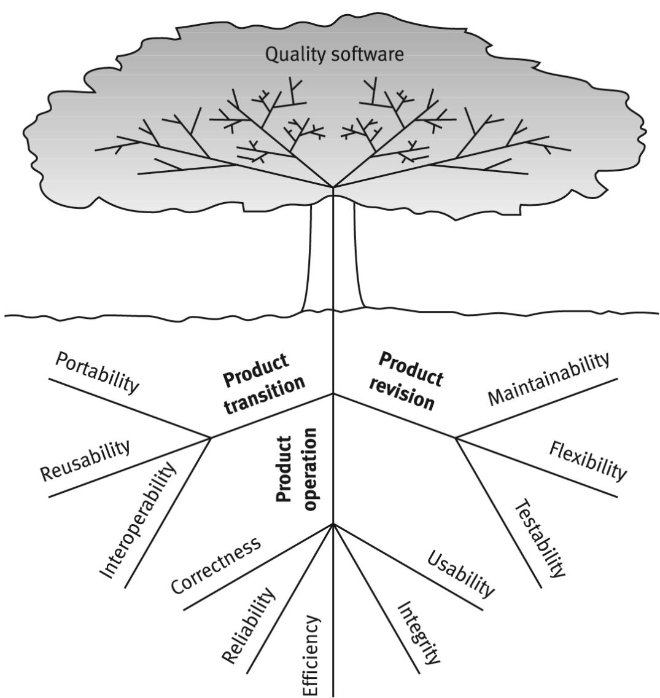  
Hình 2.1: Cây mô hình tiêu chí chất lượng phần mềm theo MCCall

Chi tiết các thuộc tính được phân tích như sau :

(1) Các yếu tố vận hành sản phẩm : Sự chính xác, độ tin cậy, tính hiệu quả, tính toàn vẹn và khả năng sử dụng được :

• Sự chính xác : Các yêu cầu về độ chính xác được xác định trong một danh sách các đầu ra cần thiết của hệ thống phần mềm, như màn hình hiển thị truy vấn số dư của khách hàng trong một hệ thống thông tin kế toán bán hàng…Các đặc tả đầu ra thường là đa chiều, một số chiều thông dụng là :

o Nhiệm vụ đầu ra (ví dụ : bản in hóa đơn bán hàng, hay đèn báo động đỏ khi nhiệt độ tăng lên trên 250 độ F)   
o Độ chính xác yêu cầu của các đầu ra này; chúng có thể bị ảnh hưởng bất lợi bởi các tính toán không chính xác hay các dữ liệu không chính xác.   
o Tính đầy đủ của thông tin đầu ra; chúng có thể bị ảnh hưởng bất lợi bởi dữ liệu không đầy đủ.   
o Up-to-dateness của thông tin (xác định bằng thời gian giữa sự kiện và việc xem xét hệ thống phần mềm.   
o Độ sẵn sàng của thông tin (thời gian đáp ứng : được định nghĩa là thời gian cần thiết để có được các thông tin yêu cầu)   
o Các chuẩn cho việc code và viết tài liệu cho hệ thống phần mềm.

Độ tin cậy : Các yêu cầu về độ tin cậy giải quyết các lỗi để cung cấp dịch vụ. Chúng xác định tỷ lệ lỗi hệ thống phần mềm tối đa cho phép, các lỗi này có thể là lỗi toàn bộ hệ thống hoặc một hay nhiều chức năng riêng biệt của nó.

Tính hiệu quả : Các yêu cầu về tính hiệu quả giải quyết vấn đề về các tài nguyên phần cứng cần thiết để thực hiện tất cả các chức năng của hệ thống phần mềm với sự phù hợp của tất cả các yêu cầu khác. Các tài nguyên phần cứng chính được xem xét ở đây là khả năng xử lý của máy tính (được đo bằng MIPS – triệu lệnh/giây; MHz – triệu chu kỳ/giây…); khả năng lưu trữ dữ liệu (dung lượng bộ nhớ, dung lượng đĩa – được đo bằng MBs, GBs, TBs…) và khả năng truyền dữ liệu (thường được đo bằng MBPS, GBPS ). Các yêu cầu này có thể bao gồm cả các giá trị tối đa tài nguyên phần cứng được sử dụng trong hệ thống phần mềm. Một yêu cầu khác về tính hiệu quả đó là thời gian giữa các lần phải sạc điện đối với các hệ thống nằm trên các máy tính xách tay hay các thiết bị di động.

Tính toàn vẹn: Các yêu cầu về tính toàn vẹn giải quyết các vấn đề về bảo mật hệ thống phần mềm, các yêu cầu này để ngăn chặn sự truy cập trái phép, để phân biệt giữa phần lớn nhân viên chỉ được phép xem thông tin với một nhóm hạn chế những người được phép thêm và thay đổi dữ liệu…

Tính khả dụng: Các yêu cầu về khả năng sử dụng được sẽ đưa ra phạm vi của tài nguyên nhân lực cần thiết để đào tạo một nhân viên mới và để vận hành hệ thống phần mềm.

(2) Các yếu tố về rà soát sản phẩm : bảo trì được, linh động và kiểm tra được :

Khả năng bảo trì được : Các yêu cầu về khả năng bảo trì được sẽ xác định người dùng và nhân viên bảo trì phải nỗ lực thế nào để xác định được nguyên nhân của các lỗi phần mềm, để sửa lỗi và để xác nhận việc sửa lỗi thành công. Các yêu cầu của yếu tố này nói tới cấu trúc modul của phần mềm, tài liệu chương trình nội bộ và hướng dẫn sử dụng của lập trình viên…

Tính linh động : Các yêu cầu về tính linh động cũng bao gồm cả các khả năng và nỗ lực cần thiết để hỗ trợ các hoạt động bảo trì. Chúng gồm các nguồn lực (man-day) cần thiết để thích nghi với một gói phần mềm, với các khách hàng trong cùng nghề, với các mức độ hoạt động khác nhau, với các loại sản phẩm khác nhau…Các yêu cầu về yếu tố này cũng hỗ trợ các hoạt động bảo trì trở nên hoàn hảo, như thay đối và bổ sung vào phần mềm để tăng dịch vụ của nó và để thích nghi với các thay đổi trong môi trường thương mại và kỹ thuật của công ty.

Khả năng test được : Các yêu cầu về khả năng kiểm tra được nói tới việc kiểm tra sự vận hành có tốt hay không của các hệ thống thông tin. Các yêu cầu về khả năng kiểm tra được liên quan tới các tính năng đặc biệt trong chương trình giúp người tester dễ dàng thực hiện công việc của mình hơn, ví dụ như đưa ra các kết quả trung gian. Các yêu cầu về khả năng kiểm tra được liên quan tới vận hành phần mềm bao gồm các chuẩn đoán tự động được thực hiện bởi hệ thống phần mềm trước khi bắt đầu hệ thống, để tìm hiểu xem có phải tất cả các thành phần của hệ thống phần mềm đều làm việc tốt hay không, và để có một bản báo cáo về các lỗi đã được phát hiện. Một loại khác của yêu cầu này là việc check các dự đoán tự động, được các kỹ thuật viên bảo trì sử dụng để phát hiện nguyên nhân gây lỗi phần mềm.

(3) Các yếu tố về chuyển giao sản phẩm : tính lưu động (khả năng thích nghi với môi trường), khả năng tái sử dụng và khả năng cộng tác được :

Tính lưu động : các yêu cầu về tính lưu động nói tới khả năng thích nghi của hệ thống phần mềm với các môi trường khác, bao gồm phần cứng khác, các hệ điều hành khác… Các yêu cầu này đòi hỏi các phần mềm cơ bản có thể tiếp tục sử dụng độc lập hoặc đồng thời trong các trường hợp đa dạng.

Khả năng tái sử dụng : Các yêu cầu về khả năng tái sử dụng nói tới việc sử dụng các modul phần mềm trong một dự án mới đang được phát triển mà các modul này ban đầu được thiết kế cho một dự án khác. Các yêu cầu này cũng cho phép các dự án tương lai có thể sử dụng một modul đã có hoặc một nhóm các modul hiện đang được phát triển. Tái sử dụng phần mềm sẽ tiết kiệm tài nguyên phát triển, rút ngắn thời gian phát triển và tạo ra các moduls chất lượng cao hơn. Chất lượng modul cao hơn là dựa trên giả định rằng hầu hết các lỗi phần mềm đều được phát hiện bởi các hoạt động đảm bảo chất lượng phần mềm thực hiện trên phần mềm ban đầu, bởi những người sử dụng phần mềm ban đầu và trong suốt những lần tái sử dụng trước của nó. Các vấn đề về tái sử dụng phần mềm đã trở thành một phần trong chuẩn công nghiệp phần mềm (IEEE,1999).

Khả năng cộng tác : Các yêu cầu về khả năng cộng tác tập trung vào việc tạo ra các giao diện với các hệ thống phần mềm khác. Các yêu cầu về khả năng cộng tác có thể xác định tên của phần mềm với giao diện bắt buộc. Chúng cũng có thể xác định cấu trúc đầu ra được chấp nhận như một tiêu chuẩn trong một ngành công nghiệp cụ thể hoặc một lĩnh vực ứng dụng.

# Các tiêu chí chất lượng ảnh hưởng tới hoạt động đảm bảo chất lượng phần mềm như nào

Những hoạt động đảm bảo chất lượng là hướng quy trình, nói cách khác, có liên kết tới sự hoàn thành của một pha dự án, sự hoàn tất một mốc dự án, và nhiều hơn nữa. Những hoạt động đảm bảo chất lượng được tích hợp vào trong kế hoạch phát triển.

Những người lên kế hoặc đảm bảo chất lượng cho một dự án cần xác định:

• Danh sách những hoạt động đảm bảo chất lượng cần thiết cho dự án.   
• Với mỗi hoạt động đảm bảo chất lượng: o Thời gian. o Loại hoạt động đảm bảo chất lượng áp dụng. o Người thực hiện hoạt động và tài nguyên yêu cầu. o Những tài nguyên yêu cầu cho việc khắc phục những nhược sai sót và những thay đổi.

Cường độ của những hoạt động đảm bảo chất lượng đã được lên kế hoạch được chỉ ra bởi số những hoạt động yêu cầu. Những yếu tố dự án và nhóm ảnh hưởng tới cường độ như sau:

Yếu tố dự án:

• Độ lớn của dự án.   
• Sự phức tạp và khó của kỹ thuật.   
• Phạm vi của những thành phần sử dụng lại.   
Hậu quả nếu dự án bị lỗi.

Yếu tố nhóm:

• Trình độ chuyên môn của những thành viên trong nhóm.   
• Sự quen thuộc của nhóm với dự án và Kinh nghiệm của nhóm trong lĩnh vực.   
• Tính sẵn sàng của những thành viên có thể trợ giúp nhóm.   
• Sự hiểu biết giữa những thành viên trong nhóm, hay nói cách khác là số thành viên mới trong nhóm.

# 2.2 CÁC HOẠT ĐỘNG ĐẢM BẢO CHẤT LƯỢNG PHẦN MỀM

# 2.2.1. Đảm bảo chất lượng đặc tả

# Chất lượng đặc tả

Đặc tả không có các hoạt động trước nó, và tất cả các hoạt động khác đều theo sau đặc tả. Vì vậy, nếu đặc tả không tốt thì phân tích, thiết kế cũng sẽ không tốt, và dẫn tới phát triển, bảo trì của 1 phần mềm kém hơn, hoặc thậm chí một phần mềm lỗi, và công sức bỏ ra để đảm bảo chất lượng thành lãng phí. Vì vậy, điều tối quan trọng là đặc tả phải đầy đủ và được định nghĩa tốt. Đặc tả thường gồm 6 nội dung sau:

• Chức năng: đặc tả các chức năng nào sẽ được phát triển   
• Phi chức năng: (a) Khả năng chịu tải: đặc tả khả năng chịu tải của hệ thống (ví dụ: 100 người cùng thao tác) (b) Intended use: đặc tả yêu cầu hoặc các yêu cầu mà sản phẩm cần thoả mãn. (c) Tính tin cậy: đặc tả thời gian mà sản phẩm có thể hoạt động tốt trước khi cần bảo trì và phù hợp với yêu cầu của người dùng. (d) Tính an toàn: đặc tả ngưỡng an toàn cho con người và đặc tính khi sử dụng phần mềm (e) Tính bảo mật: đặc tả các mối đe doạ mà sản phẩm cần chuẩn bị

Làm thế nào để đảm bảo đặc tả là đầy đủ và chính xác? Với đặc tả chức năng, người phân tích nghiệp vụ, hoặc người phân tích hệ thống có thể đảm đương nhiệm vụ này. Với đặc tả phi chức năng, cần xây dựng các chuẩn nội bộ hoặc áp dụng các chuẩn chuyên nghiệp.

# Đảm bảo chất lượng đặc tả

Trong công nghiệp phần mềm, đặc tả được xem như là đặc tả của người dùng. Nghĩa là, người dùng cuối coi đây như các yêu cầu của phần mềm mong muốn. Các tình huống sau có thể được dùng để lấy đặc tả người dùng:

Người phân tích nghiệp vụ tìm hiểu, viết báo cáo, xây dựng đặc tả. Họ cần:

• Gặp tất cả người dùng cuối để lấy các yêu cầu và lưu ý của họ   
• Gặp tất cả người đứng đầu các bộ phận để lấy yêu cầu và lưu ý của họ Gặp người quản lý để lấy yêu cầu và lưu ý của họ Tổng hợp các yêu cầu và trình bày để người dùng cuối, người đứng đầu các bộ phận và người quản lý phản hồi, nhận xét   
• Chỉnh sửa theo phản hồi, nhận xét và xây dựng bản đặc tả chuẩn

Có sẵn một bản yêu cầu người dùng như một phần của bản đề xuất

Yêu cầu tham khảo một sản phẩm tương tự và cung cấp các tuỳ chỉnh riêng cho khách hàng.

Căn cứ vào các tình huống trên, khi một đặc tả đã sẵn sàng, các hoạt động đảm bảo chất lượng sẽ được thực hiện. Nhiệm vụ của bước đảm bảo chất lượng trong giai đoạn này là đảm bảo các đặc tả đã đầy đủ và phủ hết cả các yêu cầu chức năng và yêu cầu phi chức năng.

Các công cụ có thể sử dụng để đảm bảo chất lượng cho đặc tả là:

Tài liệu quy trình: chi tiết phương pháp để lấy, phát triển, phân tích và tổng hợp đặc tả Các chuẩn (standard), hướng dẫn (guideline), các biểu mẫu (template): xác định tập tối thiểu các đặc tả cần phải xây dựng Danh sách kiểm tra (checklist): giúp phân tích để đảm bảo tính đầy đủ của đặc tả

Sử dụng các công cụ này, người phân tích có thể phát triển đặc tả đầy đủ và rõ ràng để sẵn sàng cho hoạt động tiếp theo (phân tích, thiết kế) và đảm bảo chất lượng cho đặc tả.

Các công cụ cũng có thể được dùng để đảm bảo chất lượng đặc tả là rà soát chính thức và rà soát ngang hàng.

# 2.2.2. Đảm bảo chất lượng phân tích thiết kế

# Chất lượng phân tích, thiết kế

Nếu phân tích, thiết kế không tốt, sản phẩm sẽ lỗi thậm chí cả khi đặc tả được làm tốt. Phân tích gồm xác định kiến trúc, chức năng, …, cách tiếp cận cho các yêu cầu về tính linh hoạt, tính di động, tính bảo trì được,… Thiết kế gồm thiết kế cơ sở dữ liệu, thiết kế giao diện, báo cáo… Phân tích, thiết kế gồm các thành phần sau:

1. Thiết kế chức năng   
2. Kiến trúc phần mềm   
3. Điều hướng (navigation)   
4. Thiết kế cơ sở dữ liệu   
5. Nền tảng phát triển   
6. Nền tảng triển khai   
7. Thiết kế giao diện người dùng   
8. Thiết kế báo cáo   
9. Bảo mật   
10. Khả năng chịu lỗi   
11. Khả năng chịu tải   
12. Tính tin cậy   
13. Tính bảo trì được   
14. Tính hiệu quả và tính đồng thời   
15. Kết nối   
16. Đặc tả chương trình   
17. Thiết kế kiểm thử

Ta cần người thiết kế có trình độ để đảm bảo thiết kế đúng đã được chọn và triển khai. Các chuẩn thiết kế phần mềm là cần thiết, có thể là được xây dựng nội bộ, hoặc lấy từ một tổ chức chuyên nghiệp. Các chuẩn này hỗ trợ người thiết kế để đạt được bản thiết kế tốt nhất có thể.

Thông thường, đầu pha phân tích cần lựa chọn cách thức thiết kế và quyết định các yếu tố chung như số lượng tầng, nền tảng kỹ thuật sử dụng, kết nối trong phần mềm… Bằng cách này, người thiết kế có thể đưa ra giải pháp tốt nhất có thể cho dự án. Một bản mẫu thiết kế có thể được xây dựng và đánh giá.

Ở cuối pha phân tích, cần bước đánh giá dựa trên các chuẩn sẵn có để đảm bảo phân tích đạt yêu cầu của dự án. Bản phân tích cần được rà soát ngang hàng, rà soát từ chuyên gia, từ nhà quản lý trước khi chuyển sang thiết kế chi tiết.

# Đảm bảo chất lượng phân tích, thiết kế

Pha phân tích, thiết kế nhận đầu vào là sản phẩm của pha đặc tả, từ đó xây dựng tài liệu phân tích thiết kế. Tài liệu này sẽ được lập trình viên sử dụng để lập trình ra phần mềm đặt yêu cầu.

Phân tích – còn gọi là thiết kế mức cao: đặc tả chức năng phần mềm, đặc tả yêu cầu phần mềm, kiến trúc phần mềm. Ở bước này, kiến trúc tổng thể của phần mềm, bao gồm số tầng, số module, cách tiếp cận để đạt được chức năng, thiết kế cơ sở dữ liệu, tính tin cậy, tính bảo mật, … sẽ được xác định và tài liệu hoá. Tài liệu này được sử dụng cho pha thiết kế chi tiết.

Thiết kế - còn gọi là thiết kế chi tiết: chi tiết của từng đơn vị chương trình, màn hình, báo cáo, bảng,… được xây dựng và lâp trình viên có thể sử dụng nó để lâp trình cho phần mềm.

Các công cụ để đảm bảo chất lượng phân tích, thiết kế gồm:

Tài liệu quy trình: chi tiết phương thức để thiết kế được xem xét, tiêu chí để lựa chọn các giải pháp cho dự án, cho pha phân tích   
Chuẩn, hướng dẫn, các biểu mẫu: xác định kiến trúc cùng với ưu, nhược của nó, phương thức để có danh sách các lựa chọn thay thế,…   
Danh sách kiểm tra (Checklist): giúp người thiết kế đảm bảo thiết kế là đầy đủ và chính xác

# 2.2.3. Đảm bảo chất lượng phát triển phần mềm (lâp trình)

# Chất lượng lập trình

Thông thường, pha phát triển thường có các hoạt động sau:

Tạo cơ sở dữ liệu và các bảng (table)   
Phát triển các thư viện kết nối động cho các hoạt động chung   
Phát triển giao diện   
Phát triển báo cáo   
Phát triển kế hoạch test đơn vị   
Phát triển các thành phần với các khía cạnh khác như bảo mật, tính hiệu quả, khả năng chịu lỗi,..

Chất lượng phát triển tốt đạt được bằng cách cung cấp hướng dẫn lập trình cho ngôn ngôn ngữ sử dụng. Hướng dẫn này cần chứa cách đặt tên, cấu trúc code, cách lập trình hiệu quả, cách ngăn ngừa lỗi và giúp lập trình viên viết code đáng tin cậy và không mắc lỗi. Tất nhiên, cần có các lập trình viên tốt.

# Đảm bảo chất lượng lập trình

Phát triển là bước xây dựng phần mềm tuân theo đặc tả. Trong pha này, mã nguồn được xây dựng và kết nối với các thư viện có sẵn, để hoàn thành các yêu cầu lập trình cho sản phẩm. Mã nguồn sẽ được dịch sang chương trình chạy được trên các phần cứng đã xác định trước. Đây cũng là bước cơ sở dữ liệu được xây dựng, từ đó dữ liệu có thể được nạp và sử dụng trong phần mềm.

Làm thế nào để đảm bảo chất lượng pha phát triển? Ta có thể sử dụng các chuẩn nội bộ sẵn có về chất lượng code, cũng như các hướng dẫn lập trình cho ngôn ngữ lựa chọn. Ngoài ra, những thay đổi không được kiểm soát có thể dẫn tới lỗi. Vì vậy, quản lý thay đổi và quản lý cấu hình rất quan trọng trong đảm bảo chất lượng code.

# 2.2.4. Kiểm thử phần mềm

# a. Khái niệm

Có thể định nghĩa một cách dễ hiểu như sau: Kiểm thử phần mềm là quá trình thực thi một hệ thống phần mềm để xác định xem phần mềm có đúng với đặc tả không và môi trường hoạt động có đúng yêu cầu không.

Software testing objectives

Các mục tiêu trực tiếp

• Xác định và phát hiện nhiều lỗi nhất có thể trong phần mềm được kiểm thử   
• Sau khi sửa chữa các lỗi đã xác định và kiểm tra lại, làm cho phần mềm đã được kiểm thử đến một mức độ chấp nhận được về chất lượng.   
Thực hiện các yêu cầu kiểm thử cần thiết một cách hiệu quả và có hiệu quả, trong phạm vi ngân sách và thời gian cho phép.

Các mục tiêu gián tiếp

Biên dịch một bản ghi về các lỗi phần mềm để sử dụng trong công tác phòng chống lỗi (bằng các hành động khắc phục và ngăn ngừa).

# b. Các mức độ kiểm thử

Các mức độ kiểm thử được xây dựng tương ứng với từng pha trong vòng đời phát triển phần mềm.

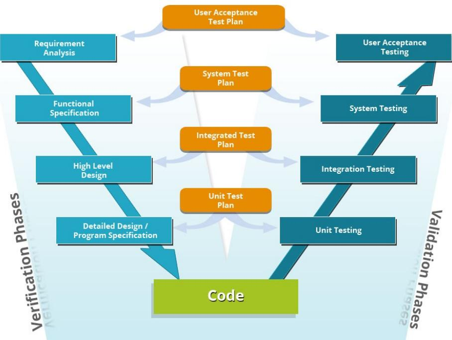  
Hình 2.2: Các mức độ kiểm thử

Kiểm thử đơn vị là hoạt động kiểm thử nhỏ nhất. Kiểm thử thực hiện trên các hàm hay thành phần riêng lẻ, cần hiểu biết về thiết kế chương trình và code. Kiểm thử đơn vị được thực hiện bởi Lập trình viên (không phải kiểm thử viên)

Mục đích: Đảm bảo thông tin được xử lý đúng và có đầu ra chính xác trong mối tương quan giữa dữ liệu nhập và chức năng của đơn vị.

Kiểm thử tích hợp: nhằm phát hiện lỗi giao tiếp xảy ra giữa các thành phần cũng như lỗi của bản thân từng thành phần (nếu có). Thành phần có thể là: các module, các ứng dụng riêng lẻ, các ứng dụng client/server trên một mạng

Kiểm thử hệ thống: là một mức của tiến trình kiểm thử phần mềm khi các module và tích hợp các module đã được test.

Mục tiêu của kiểm thử hệ thống là để đánh giá phần mềm có tuân thủ theo các yêu cầu đã đưa ra không, gồm cả yêu cầu chức năng và yêu cầu phi chức năng. Vì vậy, System Test lại gồm nhiều loại kiểm thử khác nhau, cả kiểm thử chức năng và kiểm thử phi chức năng.

Kiểm thử chấp nhận: là một cấp độ trong tiến trình kiểm thử phần mềm nhằm kiểm thử hệ thống về khả năng chấp nhận được. Mục tiêu của kiểm thử này là để đánh giá sự tuân thủ của hệ thống với các yêu cầu nghiệp vụ và thẩm định xem đã có thể chấp nhận để bàn giao chưa. Kiểm thử chấp nhận được khách hàng thực hiện (hoặc ủy quyền cho một nhóm thứ ba thực hiện).

# 2.3. CÁC KỸ THUẬT RÀ SOÁT

# 2.3.1. Mục tiêu của rà soát Mục tiêu của rà soát Định nghĩa

Định nghĩa của IEEE (1990), quá trình rà soát là:

“Một quá trình hoặc một cuộc họp mà trong đó một sản phẩm công việc hoặc một tập các sản phẩm công việc được đưa ra tới toàn thể cá nhân tham gia vào dự án, các giám đốc, người dùng, khách hàng và các bên quan tâm đến dự án nhằm lấy ý kiến phê bình và phê chuẩn”

Một số phương pháp dùng để xem xét lại tài liệu:

Xem xét lại thiết kế hình thức (Formal design reviews) Xem xét lại ngang hàng (Peer reviews) Ý kiến chuyên gia

# Mục tiêu

Mục đích được chia làm 2 loại: mục đích trực tiếp và gián tiếp.

Mục đích trực tiếp:

Phát hiện lỗi phân tích và thiết kế.   
Xác định các rủi ro mới.   
Xác định sự sai lệch so với mẫu, các kiểu thủ tục và qui ước.   
Để phê chuẩn sản phẩm của phân tích hoặc thiết kế.

Mục đích gián tiếp:

- Nơi họp mặt không chính thức để trao đổi về những kiến thức chuyên môn. Ghi lại những lỗi phân tích và thiết kế sẽ hỗ trợ một cơ sở cho những hoạt động sửa chữa lỗi trong tương lai.

# 2.3.2. Các hình thức rà soát

a. Rà soát chính thức

Ví dụ một số loại rà soát chính thức :

• DPR – Development Plan Review : Review kế hoạch phát triển • SRSR – Software Requirement Specification Review : Review đặc tả yêu cầu phần mềm

• PDR – Preliminary Design Review : Review thiết kế sơ bộ   
• DBDR- Detailed Design Review : Review thiết kế chi tiết   
• TPR – Test Plan Review : Review kế hoạch kiểm thử   
• STPR – Software Test Procedure Review : Review thủ tục kiểm thử phần mềm   
• VDR- Version Description Review : Review mô tả phiên bản   
• OMR- Operator Manual Review : Review vận hành thủ công   
• SMR- Support Manual Review :Review trợ giúp thủ công   
• TRR- Test Readiness Review : Review sự sẵn sàng kiểm thử   
• PRR- Product Release Review : Review bản phát hành sản phẩm   
• IPR-Installation Plan Review : Review kế hoạch cài đặt

# Các nhân tố ảnh hưởng tới DRs

• Những người tham gia   
• Sự chuẩn bị trước   
• Phiên DR Các hoạt động sau DR được đề xuất

# Những người tham gia rà soát thiết kế

Gồm có Review leader và review team.

# Review Leader :

• Có kiến thức và kinh nghiệm trong việc phát triển kiểu dự án được review   
• Có thâm niên ở mức độ bằng với hoặc cao hơn của project leader   
• Có mối quan hệ tốt với project leader và đội dự an   
• Có vị trí bên ngoài đội dự án

# Review team:

Phần lớn không thuộc đội dự án Kích thước từ 3-5 người Đa dạng về kinh nghiệm và phương pháp

# Sự chuẩn bị cho một phiên làm việc DR

Được hoàn thành bởi 3 thành viên: review leader, review team và development team..

# Chuẩn bị của Review leader

• Bổ nhiệm các thành viên nhóm Lập lịch các phiên review Phân chia tài liệu thiết kế cho các thành viên của nhóm

# Chuẩn bị của Review team

Xem lại tài liệu thiết kế Danh sách bình luận

# Chuẩn bị của Development team

Trình diễn ngắn tài liệu thiết kế Checklist các công việc review

# Phiên DR

Một cuộc họp phiên DR thông thường gồm có :

1. Trình diễn ngắn gọn về tài liệu thiết kế   
2. Các bình luận của các thành viên review team   
3. Kiểm tra và xác nhận thảo luận mỗi bình luận   
4. Các quyết định về tài liệu thiết kế để xác định tiến trình dự án. Các quyết định có thể có 3   
loại :

Phê duyệt đầy đủ Phê duyệt từng phần Từ chối phê duyệt

# Các hoạt động hậu review

• Báo cáo Review

• Review leader thực hiện sau phiên review

• Bao gồm :

o Tổng kết các thảo luận review o Quyết định về sự tiếp tục của dự án o Danh sách các hoạt động cần thiết phải làm o Tên thành viên chịu trách nhiệm theo sát việc hiệu chỉnh

• Tiến trình theo dõi o Review leader thực hiện o Chắc rằng việc hiệu chỉnh được thực hiện đúng đắn Việc theo dõi cần được ghi lại

# b. Rà soát ngang hàng

Mục đích chính của peer review là xác định lỗi và độ lệch dựa vào các chuẩn.

Có hai phương pháp peer reviews:

xét duyệt (inspection) kiểm tra từng bước (walkthrough).

Walkthrough phát hiện sai sót và ghi chú lên tài liệu.

Inspection phát hiện sai sót và kết hợp với nỗ lực để cải tiến.

# Những người tham gia vào peer reviews

Một đội peer review tối ưu 3-5 người tham gia.

Tất cả những người tham gia nên là những người cùng địa vị của nhà thiết kế hệ thống phần mềm.

# Một đội peer review đề cử bao gồm:

• Một leader review.   
• Một người thực thi (author).   
Các chuyên gia đặc biệt (specialized professionals).

# Phân công trách nhiệm trong đội (team assignments)

Hai trong số các thành viên sẽ là:

một người dẫn chương trình một người viết tài liệu trong cuộc thảo luận.

# Chuẩn bị cho phiên peer review

Leader:

o Xác định những đoạn trong tài liệu thiết kế sẽ đuợc review   
o Lựa chọn thành viên nhóm   
o Lập lịch cho những phiên review

o Đưa tài liệu cho các thành viên trong đội trước phiên review

• Đội peer review: yêu cầu của inspection khá tỉ mỉ, còn walkthrough chỉ yêu cầu đơn giản.

o Inspection: Đọc & liệt kê chú thích của họ o Walkth-rough : Đọc các đoạn sẽ được review

# Phiên peer review

Inspection :

o Presenter đọc một đoạn tài liệu và thêm vào nếu cần thiết. o Những người liên quan hoặc đưa ra chú thích, hoặc phản ứng với những lời chú thích trong tài liệu.

Walkthrough:

o Bắt đầu bằng sự trình bày ngắn của author (thường ko phải là presenter) hoặc tổng quan về dự án và những đoạn thiết kế sẽ được review.   
o Ghi lại vị trí, mô tả, kiểu, đặc điểm (sai sót, những phần thiếu, những phần thêm vào) của mỗi lỗi được chấp nhận.

Quy tắc thời gian: phiên không nên vượt quá 2 giờ, hoặc lập lịch không nhiều hơn 2 ngày.

Tài liệu sau mỗi phiên review:

o Báo cáo những phát hiện trong phiên inspection o Báo cáo tóm tắt của phiên inspection

Các hoạt động sau peer review (post-peer review activities)

# Inspection:

o Nhắc nhở, sửa chữa hiệu quả, làm lại tất cả các lỗi o Chuyển giao các bản báo cáo inspection tới CAB để phân tích.

# Hiệu quả của peer review (the efficency of peer reviews)

Một vài độ đo phổ biến ước lượng hiệu suất của peer review:

o Số giờ trung bình trên một lỗi.   
o Mật độ phát hiện thiếu sót (Số thiếu sót trung bình trên một trang tài liệu thiết kế).   
o Hiệu năng peer review bên trong.   
o Peer review coverage: Là tỉ lệ nhỏ của tài liệu và toàn bộ code đã từng trải qua peer view

c. Ý kiến chuyên gia

Ý kiến của chuyên ra rất hữu ích trong những trường hợp sau:

o Thiếu sự hiểu biết đầy đủ về lĩnh vực nào đó. o Tạm thời thiếu những người chuyên nghiệp để tham gia vào đội xem xét lại o Các thành viên chuyên nghiệp cao cấp trong tổ chức không thống nhất được với nhau. o Trong các tổ chức nhỏ số lượng ứng viên phù hợp cho đội xem xét lại là không đủ.

# d. So sánh rà soát chính thức và rà soát ngang hàng

Để rõ hơn những đặc điểm của các phương pháp rà soát có thể tham khảo bảng so sánh giữa ba phương pháp rà soát sau đây:

Bảng 2.1: So sánh các hình thức rà soát   

<table><tr><td colspan="1" rowspan="1">Thuc tính</td><td colspan="1" rowspan="1">Formal designreviews</td><td colspan="1" rowspan="1">Inspections</td><td colspan="1" rowspan="1">Walkthroughs</td></tr><tr><td colspan="1" rowspan="1">Muc dích chính tręctiép</td><td colspan="1" rowspan="1">Phát hin lōiXác dinh rúi ro móiPhê chuan tài liçuthiét ké</td><td colspan="1" rowspan="1">Phát hin lōiXác dinh s sai lchso vói tiêu chuân</td><td colspan="1" rowspan="1">Phát hin lōi</td></tr><tr><td colspan="1" rowspan="1">Muc dích chính giántiép</td><td colspan="1" rowspan="1">Trao dôi kién thúc</td><td colspan="1" rowspan="1">Trao doi kién thúcHō tro hoat dngsúra chūa</td><td colspan="1" rowspan="1">Trao dōi kién thúc</td></tr><tr><td colspan="1" rowspan="1">Lnh dao vic xemxét lai</td><td colspan="1" rowspan="1">Nguòi dúng dàu kynghê phàn mèmhoc là thành viêncao cáp</td><td colspan="1" rowspan="1">Nguòi dièu hành chi Nguòi tô chúcdao (ngang hàng)</td><td colspan="1" rowspan="1">Nguòi dièu hành chi Nguòi tô chúc</td></tr><tr><td colspan="1" rowspan="1">Nguòi tham gia</td><td colspan="1" rowspan="1">Các thành viên cápcao và dai din hàngkhách hàng</td><td colspan="1" rowspan="1">Nhūng nguòi ngang</td><td colspan="1" rowspan="1">Nhūng nguòi nganghàng</td></tr><tr><td colspan="1" rowspan="1">Su tham gia cua Cótruong du án</td><td colspan="1" rowspan="1"></td><td colspan="1" rowspan="1">Có</td><td colspan="1" rowspan="1">Có, thông thuòng là khibt dàu xem xét lai</td></tr><tr><td colspan="1" rowspan="1">Thành viên chuyêngia trong di</td><td colspan="1" rowspan="1"></td><td colspan="1" rowspan="1">Nguòi thiét kéLâp trình viên- Nguòi kim thü</td><td colspan="1" rowspan="1">Nguòi giám sát tiêuchuân- Chuyên gia bão trì- Dai din nguòi dùng</td></tr><tr><td colspan="4" rowspan="1">Quá trình xem xét lai</td></tr><tr><td colspan="1" rowspan="1">Hop tông quan</td><td colspan="1" rowspan="1">Không</td><td colspan="1" rowspan="1">Có</td><td colspan="1" rowspan="1">Có</td></tr><tr><td colspan="1" rowspan="1">Su chuân bi cuanhūng nguòi tham luōnggia</td><td colspan="1" rowspan="1">Có - chuân bi k</td><td colspan="1" rowspan="1">Có - chun bi k Có - chun bi tóm luocluōng</td><td colspan="1" rowspan="1">Có - chun bi k Có - chun bi tóm luoc</td></tr><tr><td colspan="1" rowspan="1">Phiên xem xét lai</td><td colspan="1" rowspan="1">Có</td><td colspan="1" rowspan="1">Có</td><td colspan="1" rowspan="1">Có</td></tr><tr><td colspan="1" rowspan="1">Bám sát vic surachūa</td><td colspan="1" rowspan="1"> Có</td><td colspan="1" rowspan="1">Có</td><td colspan="1" rowspan="1">Có</td></tr><tr><td colspan="4" rowspan="1">Co só ha tâng</td></tr><tr><td colspan="1" rowspan="1">Dào tao chính thúccho nguòi tham gia</td><td colspan="1" rowspan="1">Không</td><td colspan="1" rowspan="1">Có</td><td colspan="1" rowspan="1">Không</td></tr><tr><td colspan="1" rowspan="1">Sü dung checklist</td><td colspan="1" rowspan="1">Không</td><td colspan="1" rowspan="1">Có</td><td colspan="1" rowspan="1">Không</td></tr><tr><td colspan="1" rowspan="1">Lōi liên quan dé thuthâp dū liu</td><td colspan="1" rowspan="1">Không yêu càu hinhthúrc</td><td colspan="1" rowspan="1">Yêu càu hinh thúc</td><td colspan="1" rowspan="1">Không yeu càu hinhthúrc</td></tr><tr><td colspan="1" rowspan="1">Tài liçu hóa vicxem xét lai</td><td colspan="1" rowspan="1">Báo cáo xem xét laithiét ké hinh thúc</td><td colspan="1" rowspan="1">Báo cáo dánh giáphiên thanh traBáo cáo tông kétphiên thanh tra</td><td colspan="1" rowspan="1">Báo cáo dánh giá phiênwalkthrough</td></tr></table>

# 2.4. CÁC KỸ THUẬT KIỂM THỬ

# 2.4.1 Kỹ thuật kiểm thử hộp đen

# Khái niệm:

Black-box testing là phương pháp kiểm thử mà không cần biết cài đặt của chương trình. Kiểm thử hộp đen quan trọng trong công nghiệp

Chúng ta cần có một bản chương trình chạy được và đặc tả.

Test cases được công thức hoá là một cặp. Ví dụ, (input, output mong muốn)

Một số kỹ thuật thiết kế test: phân lớp tương đương, test biên, phân loại, kiểm thử theo cặp…

# Kỹ thuật Phân lớp tương đương:

Phân lớp tương đương là một phương pháp kiểm thử hộp đen chia miền đầu vào của chương trình thành các lớp dữ liệu, từ đó suy dẫn ra các ca kiểm thử. Lớp tương đương biểu thị cho tập các trạng thái hợp lệ hay không hợp lệ đối với điều kiện vào.

Thiết kế Test-case bằng phân lớp tương đương tiến hành theo 2 bước:

1. Xác định các lớp tương đương.

2. Xác định các ca kiểm thử.

# Kỹ thuật Phân tích giá trị biên:

Kinh nghiệm cho thấy các ca kiểm thử mà khảo sát tỷ mỷ các điều kiện biên có tỷ lệ phần trăm cao hơn các ca kiểm thử khác. Các điều kiện biên là những điều kiện mà các tình huống ngay tại, trên và dưới các cạnh của các lớp tương đương đầu vào và các lớp tương đương đầu ra. Phân tích các giá trị biên là phương pháp thiết kế ca kiểm thử bổ sung thêm cho phân lớp tương đương, nhưng khác với phân lớp tương đương ở 2 khía cạnh:

Phân tích giá trị biên không lựa chọn phần tử bất kỳ nào trong 1 lớp tương đương là điển hình, mà nó yêu cầu là 1 hay nhiều phần tử được lựa chọn như vậy mà mỗi cạnh của lớp tương đương đó chính là đối tượng kiểm tra. Ngoài việc chỉ tập trung chú ý vào các trạng thái đầu vào (không gian đầu vào), các ca kiểm thử cũng nhận được bằng việc xem xét không gian kết quả (các lớp tương đương đầu ra).

# Kỹ thuật Bảng quyết định

• Miêu tả các qui tăc nghiẹp vụ phưc tap mà phần mềm phải thực hiẹn dươi dang dê đoc và dê kiểm soát

Ví dụ 1 chưc nang nhỏ cua cong ty bảo hiểm : khuyên mai cho nhưng chu xe nêu ho thỏa ít nhất 1 trong 2 điều kiẹn: đa lâp gia đình / là sinh viên giỏi. Môi dư liẹu nhâp là 1 giá tri luân lý, nên bảng quyêt đinh chi cần có 4 cọt, miêu tả 4 luât khác nhau :

<table><tr><td rowspan=1 colspan=1></td><td rowspan=1 colspan=1>Rule 1</td><td rowspan=1 colspan=1>Rule 2</td><td rowspan=1 colspan=1>Rule 3</td><td rowspan=1 colspan=1>Rule 4</td></tr><tr><td rowspan=1 colspan=1>Conditions</td><td rowspan=1 colspan=1></td><td rowspan=1 colspan=1></td><td rowspan=1 colspan=1></td><td rowspan=1 colspan=1></td></tr><tr><td rowspan=1 colspan=1>Married?</td><td rowspan=1 colspan=1>Yes</td><td rowspan=1 colspan=1>Yes</td><td rowspan=1 colspan=1>No</td><td rowspan=1 colspan=1>No</td></tr><tr><td rowspan=1 colspan=1>Good Student?</td><td rowspan=1 colspan=1>Yes</td><td rowspan=1 colspan=1>No</td><td rowspan=1 colspan=1>Yes</td><td rowspan=1 colspan=1>No</td></tr><tr><td rowspan=2 colspan=1>ActionsDiscount ($)</td><td rowspan=2 colspan=1>60</td><td rowspan=2 colspan=1>25</td><td rowspan=1 colspan=1>50</td><td rowspan=2 colspan=1>0</td></tr><tr><td rowspan=1 colspan=1></td></tr></table>

Từ bảng quyêt đinh chuyển thành bảng các testcase trong đó môi cọt miêu tả 1 luât được chuyển thành 1 đên n cọt miêu tả các testcase tưong ưng vơi luât đó.

# Lược đồ chuyển trạng

• Là 1 công cụ rất hữu ích để đặc tả các yêu cầu phần mềm hoặc để đặc tả bảng thiết kế hệ thống phần mềm.

• Lược đồ chuyển trạng thái ghi nhận các sự kiện xảy ra, rồi được hệ thống xử lý cũng như những đáp ứng của hệ thống. Khi hệ thống phải nhớ trạng thái trước đó của mình, hay phải biết trình tự các hoạt động nào là hợp lệ, trình tự nào là không hợp lệ thì lược đồ chuyển trạng thái là rất thích hợp.

# Kiểm thử theo cặp

Thực tế cho thấy hầu hết các lỗi đều được sinh ra từ sự kết hợp giá trị của các cặp tham số đầu vào.

Để thực hiện kiểm thử theo cặp, ta cần:

• Lựa chọn tham số đầu vào và các giá trị tương ứng • Lấy tổ hợp (pairwise) của các giá trị giữa 2 tham số Xây dựng bộ test sao cho bao phủ được tất cả các cặp xác định ở trên

# 2.4.2 Kỹ thuật kiểm thử hộp trắng

# Khái niệm:

Kiểm thử hộp trắng dựa vào thuât giải cụ thể, vào cấu truc dư liẹu bên trong cua module cần kiểm thử để xác đinh module đó có thực hiẹn đung khong.   
• Do đó ngươi Kiểm thử hộp trắng phải có ky nang, kiên thưc để có thể thong hiểu chi tiêt về đoan code cần kiểm thử.   
• Thương tôn rất nhiều thơi gian và cong sưc

# Kiểm thử luồng điều khiển

Đương thi hành (Execution path) : là 1 kich bản thi hành đon vi phần mềm tưong ưng : danh sách có thư tự các lẹnh được thi hành ưng vơi 1 lần chay cụ thể cua đon vi phần mềm, băt đầu từ điểm nhâp cua đon vi phần mềm đên điểm kêt thuc cua đon vi phần mềm.

Mục tiêu cua phưong pháp kiểm thử luông điều khiển là đảm bảo moi đương thi hành cua đon vi phần mềm cần kiểm thử đều chay đung. Rất tiêc trong thực tê, cong sưc và thơi gian để đat mục tiêu trên đây là rất lơn, ngay cả trên nhưng đon vi phần mềm nhỏ.   
Ta nên kiểm thử sô test case tôi thiểu mà kêt quả đọ tin cây tôi đa. Nhưng làm sao xác đinh được sô test case tôi thiểu nào có thể đem lai kêt quả có đọ tin cây tôi đa ?   
Phu kiểm thử (Coverage) : là ti lẹ các thành phần thực sự được kiểm thử so vơi tông thể sau khi đa kiểm thử các test case được chon. Phu càng lơn thì đọ tin cây càng cao.   
Thaà nh phần liên quan có thể là lẹnh, điểm quyêt đinh, điều kiẹn con, đương thi hành hay là sự kêt hợp cua chung.

Các mức phủ kiểm thử:

• Phu cấp 0 : kiểm thử nhưng gì có thể kiểm thử được, phần con lai để ngươi dung phát hiẹn và báo lai sau. Đây là mưc đọ kiểm thử khong thực sự có trách nhiẹm. Phu cấp 1 : kiểm thử sao cho môi lẹnh được thực thi ít nhất 1 lần. Phu cấp 2 : kiểm thử sao cho môi điểm quyêt đinh đều được thực hiẹn ít nhất 1 lần cho trương hợp TRUE lân FALSE. Ta goi mưc kiểm thử này là phu các nhánh (Branch coverage). Phu các nhánh đảm bảo phu các lẹnh. Phu cấp 3 : kiểm thử sao cho môi điều kiẹn luân lý con (subcondition) cua từng điểm quyêt đinh đều được thực hiẹn ít nhất 1 lần cho trương hợp TRUE lân FALSE. Ta goi mưc kiểm thử này là phu các điều kiẹn con (subcondition coverage). Phu các điều kiẹn con chưa chăc đảm bảo phu các nhánh. Phu cấp 4 : kiểm thử sao cho môi điều kiẹn luân lý con (subcondition) cua từng điểm quyêt đinh đều được thực hiẹn ít nhất 1 lần cho trương hợp TRUE lân FALSE & điểm quyêt đinh cung được kiểm thử cho cả 2 nhánh. Ta goi mưc kiểm thử này là phu các nhánh & điều kiẹn con (branch & subcondition coverage).

# 2.5 CÂU HỎI ÔN TẬP

1. Khái niệm Đảm bảo chất lượng phần mềm?

2. Khái niệm V&V và IV&V?

3. Xác định đặc tả theo bộ tiêu chí MCCall? Lấy ví dụ minh hoạ?

4. Phân biệt các loại hoạt động review?

5. Nêu các level kiểm thử

6. Trình bày các kỹ thuật kiểm thử?

# CHƯƠNG 3: THU THẬP VÀ PHÂN TÍCH YÊU CẦU

# 3.1 THU THẬP YÊU CẦU

# 3.1.1 Tìm hiểu lĩnh vực chuyên môn

Tóm tắt các bước thực hiện:

• Bước 1: Làm việc nhóm (có thể dùng brainstorming) để liệt kê tất cả các từ khóa chuyên môn trong lĩnh vực của ứng dụng   
• Bước 2: Phân các từ tìm ra thành nhóm cho dễ theo dõi   
• Bước 3: Giải thích nghĩa của từng từ khóa và lập bảng kết quả các từ khóa (glosary list).

Áp dụng các bước trên vào bài toán quản lí đăng kí học tín chỉ của một trường đại học, gộp bước 1 và 2, có thể gom các từ khóa trong lĩnh vực quản lí đăng kí tín chỉ thành ba nhóm như sau:

# Con người

# Hoạt động của con người

#

Thành viên   
Nhân viên   
Sinh viên   
Nhân viên quản lí   
Nhân viên khảo thí   
Nhân viên giáo vụ   
Giảng viên   
Người dùng   
Đăng nhập   
Đăng xuất   
Đổi mật khẩu   
Cập nhật thông tin cá nhân   
Sinh viên đăng kí học   
Sinh viên xem lịch học   
Sinh viên sửa đăng kí   
Sinh viên xem điểm   
Giảng viên đăng kí dạy   
Giảng viên nhập điểm   
Giảng viên xem lịch dạy   
Giảng viên xem điểm   
Giáo vụ quản lí môn học   
Giáo vụ quản lí lớp học phần   
Giáo vụ quản lí thông tin sinh   
viên   
Giáo vụ quản lí thông tin học k   
Quản lí thông tin trường   
Quản lí thông tin Khoa   
Quản lí thông tin bô môn   
Quản lí thông tin giảng viên   
Xem thống kê giảng viên   
Xem thống kê sinh viên   
Xem thống kê học lực   
Xem thống kê phòng học

Vật, đối tượng Trường Khoa Ngành học Bộ môn Năm học Khóa học Học kì Môn học Lớp học phần Tuần học Ngày học trong tuần Kíp/ca học trong ngày Phòng học Tòa nhà Đầu điểm thành phần Điểm thi Điểm trung bình môn Điểm chữ Tín chỉ Tổng tín chỉ tích lũy Điểm trung bình tích lũy Học lực Loại học lực

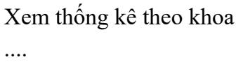

<table><tr><td colspan="4" rowspan="1">Buóc 3, lâp bång gii thích ngū ngha chi tiét cho tùng khái nim trong lnh vyc cüa úng dung:</td></tr><tr><td colspan="1" rowspan="1">TT</td><td colspan="1" rowspan="1">Tên Tiéng Vit</td><td colspan="1" rowspan="1">Tiéng Anh</td><td colspan="1" rowspan="1">Gii thích</td></tr><tr><td colspan="4" rowspan="1">Nhóm các khái nim liên quan dén con nguòi</td></tr><tr><td colspan="1" rowspan="1">1</td><td colspan="1" rowspan="1">Thành viên</td><td colspan="1" rowspan="1">Member</td><td colspan="1" rowspan="1">Nguòi có tài khon và thàm quyěn dě dng nhâpvào h thóng, thc hin các chúc nng duęc chophép. Ví du sinh viên có thé dng nhâp vào hthóng dé dng kí hoc, xem lich hoc, xem diém.Thông tin sinh viên duçc quån lí trong h thóng.Nên sinh viên là môt thành viên cúa h thóng</td></tr><tr><td colspan="1" rowspan="1">...</td><td colspan="1" rowspan="1"></td><td colspan="1" rowspan="1"></td><td colspan="1" rowspan="1"></td></tr><tr><td colspan="1" rowspan="1"></td><td colspan="3" rowspan="1">Nhóm các khái niçm liên quan dén hoat dng cúa nguòi</td></tr><tr><td colspan="1" rowspan="1">22</td><td colspan="1" rowspan="1">Dng kí hoc</td><td colspan="1" rowspan="1">Registration</td><td colspan="1" rowspan="1">Là hoat dng cúa sinh viên truóc mōi kì hoc.Theo dó, truóc mōi kì hoc, truòng s mō ché dôdng kí cho sinh viên vào dng kí trong mt thòigian nhát dinh. Trong thòi gian dó, sinh viên phidng nhâp vào h thóng, thuc hin chúc nngdng kí hρc. Chúc nng này cho phép sinh viênchąn môn hąc duęc phép dng kí trong kì hoc,chn lóp hoc phàn phù hop vói bn thân. Thuòngcó quy dinh mōi hąc kì phi hąc tói thiéu baonhiêu tín chi, tói da bao nhiêu tín chi. Sinh viênphài chçn dù só tín chi trong nguōng này mói hopl. Trong thòi gian truòng còn mō dng kí, sinhviên có quyèn vào lai h thóng thay dōi thông tindng kí cúa minh.</td></tr><tr><td colspan="1" rowspan="1">...</td><td colspan="1" rowspan="1"></td><td colspan="1" rowspan="1"></td><td colspan="1" rowspan="1"></td></tr><tr><td colspan="4" rowspan="1">Nhóm các khái nim liên quan dén vât, dói tugng xù lí</td></tr><tr><td colspan="1" rowspan="1">33</td><td colspan="1" rowspan="1">Diêm trung binhmôn</td><td colspan="1" rowspan="1">Final grade</td><td colspan="1" rowspan="1">Diêm tông két môn hąc. Tính trung binh theo cácdàu diém thành phàn cúa môn hąc.Ví du, môn Toán có 3 dàu diěm thành phàn:chuyên cân 10%, trung binh kiěm tra 10%, trungbinh bài tp lón 20%. Và diém bài thi cuói kì60%. Néu sinh viên A dat các dàu diém làn lugtlà 5, 6, 7, 8 thì diém trung binh môn dugc tính là</td></tr><tr><td colspan="1" rowspan="1"></td><td colspan="1" rowspan="1"></td><td colspan="1" rowspan="1"></td><td colspan="1" rowspan="1">5*0.1 + 6*0.1 + 7*0.2 + 8*0.6 = 7.3 h 10.Tuong úng diém chū B.Tuong úng dim h 4 là 3.0</td></tr><tr><td colspan="1" rowspan="1">...</td><td colspan="1" rowspan="1"></td><td colspan="1" rowspan="1"></td><td colspan="1" rowspan="1"></td></tr></table>

# 3.1.2 Mô tả hệ thống bằng ngôn ngữ tự nhiên

Tóm tắt các bước thực hiện:

• Bước 1: Giới thiệu mục đích hệ thống   
• Bước 2: Phạm vi hệ thống: ai được dùng phần mềm/hệ thống? Mỗi người vào vào hệ thống được phép thực hiện các chức năng nào? Bước 3: Với mỗi chức năng mà người dùng được phép thực hiện ở bước 2, mô tả chi tiết hoạt động nghiệp vụ của chức năng đấy diễn ra như thế nào? Bước 4: Các đối tượng nào được quản lí, xử lí trong hệ thống? Mỗi đối tượng cần dùng/quản lí các thuộc tính nào?   
• Bước 5: Quan hệ (số lượng) giữa các đối tượng đã nêu ở bước 4?

Áp dụng vào hệ thống quản lí đăng kí tín chỉ, các bước được tiến hành như sau:

Bước 1: Mục đích của hệ thống: Hệ thống trang web phục vụ công tác quản lí đăng kí tín chỉ của sinh viên, đăng kí giảng dạy của giảng viên, quản lí điểm các môn học của một trường đại học.

Bước 2: Phạm vi hệ thống: Những người được vào hệ thống và chức năng mỗi người được thực hiện khi vào hệ thống này được quy định như sau:

Thành viên hệ thống:   
◦ Đăng nhập   
◦ Đăng xuất   
◦ Đổi mật khẩu cá nhân

Sinh viên:

◦ Được thực hiện các chức năng như thành viên ◦ Đăng kí học, sửa thông tin đăng kí của mình ◦ Xem lịch học của mình   
◦ Xem điểm của mình

• Giảng viên:

◦ Đăng kí dạy, sửa thông tin đăng kí dạy ◦ Nhập, sửa điểm các lớp mình dạy ◦ Xem lịch dạy của mình ◦ Xem thống kê liên quan đến các lớp mình dạy

• Nhân viên giáo vụ:

◦ Quản lí thông tin sinh viên: thêm, xóa, sửa theo yêu cầu từ sinh viên   
◦ Quản lí thông tin môn học   
◦ Quản lí thông tin lớp học phần

• Nhân viên quản lí:

◦ Quản lí thông tin chung: thông tin trường, thông tin khoa, thông tin bộ môn, thông tin các toàn nhà, phòng học, thông tin năm học, kì học.   
◦ Quản lí thông tin giảng viên theo yêu cầu từ giảng viên   
◦ Xem các loại thống kê

Nhân viên khảo thí: ◦ Xuất bảng điểm theo yêu cầu của sinh viên

Những chức năng không đề cập đến thì mặc định là không thuộc phạm vi của hệ thống.

Bước 3: Hoạt động nghiệp vụ của các chức năng: Theo nguyên tắc, mỗi chức năng liệt kê trong bước 2 đều phải mô tả chi tiết. Tuy nhiên, trong phạm vi tài liệu này, chỉ có ba chức năng được mô tả chi tiết vì đây là các chức năng được dùng để minh họa cho các bước phân tích, thiết kế từ đầu đến cuối. Các chức năng còn lại coi như bài tập cho người học.

Sinh viên đăng kí học: Sinh viên đăng nhập vào hệ thống -> chọn chức năng đăng kí tín chỉ (đang trong thời gian mở đăng kí mới được chọn) -> chọn kì đăng kí + ngành học (có thể có sinh viên học đồng thời hai chuyên ngành) -> hệ thống hiện danh sách các môn học có thể đăng kí (mã, tên môn học, số tín chỉ, mô tả), các lớp học phần đã đăng kí rồi, nếu có -> Sinh viên chọn môn học -> hệ thống hiện danh sách các lớp học phần của môn học đấy (mã, tên, sĩ số tối đa, sĩ số hiện tại, phòng học, giảng viên, lịch học hàng tuần vào các ngày nào trong tuần, kíp nào trong ngày): chỉ active các nhóm mà không bị trùng lịch học với các môn đã chon trước, các nhóm bị trùng lịch thì chỉ xem, không chọn được -> Sinh viên chọn lớp học phần mình thích -> hệ thống quay lại trang bắt đầu đăng kí với lớp học phần vừa chọn được bổ sung vào danh sách các lớp học phần đã chọn. Sinh viên lặp lại các bước trên cho đến khi chọn đủ số tín chỉ trong ngưỡng cho phép -> nút lưu được active -> Sinh viên click lưu thì thông tin đăng kí mới chính thức được lưu vào hệ thống, hệ thống quay về giao diện chính của sinh viên.

Giảng viên nhập điểm: Giảng viên đăng nhập vào hệ thống -> chọn chức năng nhập điểm -> Chọn học kì đang active -> hệ thống hiện danh sách các môn học do giảng viên dạy của kì đã chọn (mã, tên, số tín chỉ, mô tả) -> Giảng viên click chọn môn học muốn nhập điểm -> Hệ thống hiện danh sách các lớp học phần do giảng viên dạy (mã, tên, sĩ số thực, phòng học, ngày học, kíp học) -> Giảng viên chọn 1 lớp học phần muốn nhập -> Hệ thống hiện danh sách các sinh viên đăng kí lớp học phần được chọn với điểm thành phần, nếu có: thứ tự, mã sinh viên, họ tên, các đầu điểm thành phần, điểm thi, cột trung bình môn và điểm chữ được tự tính sau khi nhập -> Giảng viên nhập đầu điểm muốn nhập cho tất cả sinh viên trong danh sách và click lưu -> hệ thống lưu điểm vào và quay về giao diện chính của giảng viên.

• Quản lí xem thống kê theo loại học lực: Nhân viên quản lí đăng nhập vào hệ thống -> chọn chức năng xem thống kê -> hệ thống hiện giao diện chọn thông tin thống kê -> chọn thống kê loại học lực -> Hệ thống hiện giao diện thống kê loại học lực -> Quản lí chọn học kì muốn thống kê -> Kết quả thống kê hiện lên, mỗi loại học lực trên một dòng, xếp theo thứ tự cao nhất đến thấp nhất của loại học lực trong bảng đánh giá (Ưu tú, xuất sắc, giỏi, khá, trung bình, yếu kém): thứ tự, loại học lực, tổng số sinh viên đạt loại đó, điểm trung bình sinh viên trong nhóm đạt loại đó trong học kì đã chọn -> Quản lí click vào một loại học lực -> Hệ thống hiện danh sách các sinh viên đạt loại học lực đấy lên, xếp theo thứ tự các ngành học, đến thứ tự abc của tên sinh viên: thứ tự, mã sinh viên, họ và tên, ngành học, khóa học, tổng số tín chỉ của học kì, điểm trung bình của học kì -> Quản lí click vào một sinh viên danh sách -> Hệ thống hiện lên danh sách các môn và kết quả của sinh viên đã học trong học kì đó, xếp theo thứ tự abc của tên môn học: thứ tự, tên môn học, số tín chỉ, điểm trung bình môn đó của sinh viên. Dòng cuối là tổng số tín chỉ, điểm trung bình cả học kì của sinh viên -> Quản lí click vào một môn học trong danh sách -> Hệ thống hiện lên điểm chi tiết của môn học của sinh viên: mã môn, tên môn, tổng tín chỉ, các đầu điểm thành phần dạng bảng: tên đầu điểm thành phần, tỉ lệ % tính của đầu điểm thành phần, điểm của sinh viên. Dòng cuối là điểm trung bình môn của sinh viên trong môn học đó.

# Bước 4: Thông tin các đối tượng cần xử lí, quản lí:

Nhóm các thông tin liên quan đến con người:

• Thành viên: tên đăng nhập, mật khẩu, họ tên, địa chỉ, ngày sinh, email, số điện thoại   
• Sinh viên: giống thành viên, có thêm: mã sinh viên. Theo mỗi ngành học còn có khóa học, ngành học Nhân viên: giống thành viên, có thêm: vị trí công việc. Nhân viên quản lí: giống nhân viên   
• Nhân viên giáo vụ: giống nhân viên   
• Nhân viên khảo thí: giống nhân viên   
• Giảng viên: giống nhân viên

Nhóm các thông tin liên quan đến cơ sở vật chất:

Tòa nhà: tên, mô tả Phòng học: tên, sức chứa tối đa, mô tả

Nhóm các thông tin liên quan đến đơn vị, tổ chức:

Trường: tên, địa chỉ, mô tả • Khoa: tên, mô tả • Ngành học: tên, mô tả • Bộ môn: tên, mô tả

Nhóm các thông tin liên quan đến chuyên môn, vận hành:

• Năm học: tên, mô tả Kì học: tên, mô tả Tuần học: tên, mô tả Ngày trong tuần: tên, mô tả Kíp học trong ngày: tên, mô tả Môn học: tên, số tín chỉ, mô tả Lớp học phần: tên, mô tả, sĩ số tối đa, sĩ số hiện tại, giảng viên dạy, phòng học, tuần nào học ngày nào, kíp nào.

Nhóm thông tin liên quan đến thống kê:

Thống kê theo loại học lực • Thống kê sinh viên theo kết quả học • Thống kê các môn học theo kết quả học Thống kê giảng viên theo: số giờ dạy, kết quả học Thống kê học kì theo số sinh viên

# Bước 5: Quan hệ giữa các đối tượng, thông tin:

Một trường có nhiều khoa Một khoa có nhiều bộ môn Một khoa có nhiều ngành học   
• Một bộ môn quản lí chuyên môn nhiều môn học   
• Một bộ môn có nhiều giảng viên Một năm học có nhiều học kì Một học kì liên quan đến nhiều năm học. Một năm học + một học kì tạo ra một kì học (kì học # học kì).   
Một kì học có nhiều môn học Một môn học, vào một kì học, có nhiều lớp học phần Một lớp học phần có thể học vào nhiều buổi, mỗi buổi có thể liên quan đến 1 tuần khác nhau, 1 ngày khác nhau, 1 kíp khác nhau, 1 phòng học khác nhau, 1 giảng viên khác nhau. Một giảng viên có thể dạy nhiều môn học trong mỗi kì học Một môn học, trong một kì học, giảng viên có thể dạy nhiều lớp học phần khác nhau, miễn sao không trùng lịch buổi nào. Một lớp học phần, có thể có nhiều giảng viên dạy. Nhưng mỗi buổi học chỉ có một giảng viên dạy. Một môn học có nhiều đầu điểm thành phần. Mỗi đầu điểm thành phần, đối với mỗi môn học, có tỉ lệ % tính điểm nhất định. Một tuần có thể có nhiều buổi dạy/học Một ngày có thể có nhiều buổi học/dạy

Một kíp có thể có nhiều buổi học/dạy của nhiều lớp học phần khác nhau Một phòng học có thể có nhiều lớp học phần vào học ở những buổi khác nhau. Một sinh viên có thể đăng kí học nhiều ngành khác nhau (tối đa 2 ngành đồng thời). • Với mỗi ngành, sinh viên phải học một số môn nhất định, và điểm tính theo từng ngành. Các môn trùng nhau giữa các ngành thì sinh viên chỉ phải học 1 lần, qua là được. Mỗi sinh viên, mỗi môn học, có một diểm trung bình môn.

# 3.1.3 Mô tả hệ thống bằng ngôn ngữ UML - use case

Tóm tắt các bước thực hiện để vẽ biểu đồ use case tổng quan:

• Bước 1: Đề xuất các actor. Với mỗi người dùng xác định ở bước 2 của mục 3.1.2, đề xuất thành một actor tương ứng. Nếu các actor có đặc điểm gì chung, có thể đề xuất actor trừu tượng thành actor cha của các actor tương ứng. Ngoài ra, cần xem xét cần có các actor gián tiếp tác động vào để thực hiện các chức năng hay không. Bước 2: Đề xuất use case. Với mỗi chức năng xác định của mục 3.1.2, đề xuất thành một use case tương ứng Bước 3: Mịn hóa các use case. Nếu có ít nhất 2 use case trùng nhau, cần xem xét gộp lại thành 1. Nếu gộp lại gây hiểu nhầm về số các actor tác động vào, thì có thể dùng use case trừu tượng cho các use case giống nhau, mỗi use case con liên quan đến nhóm các actor tương ứng mà thôi.

Tóm tắt các bước thực hiện để vẽ biểu đồ use case chi tiết:

• Bước 1: Trích phần use case của chức năng tương ứng từ biểu đồ use case tổng quan. Bước 2: Phân rã use case chính thành các use case con: mỗi giao diện (hoặc một số giao diện) tương tác với người dùng có thể đề xuất thành một use case con.   
• Bước 3: Xác định quan hệ của use case con với use case chính: generalization, include, hay extend.   
• Bước 4: Gộp các use case con tương tự nhau bằng cách dùng các use case trừu tượng tổng quát hơn.

Lưu ý tránh sai sót trong biểu đồ use case:

Tên use case phải là động từ chỉ hành động của actor. Không nên là động từ chỉ hành động của hệ thống. Cũng không nên là danh từ, tính từ... Mỗi use case phải có tương tác với ít nhất một actor, có thể là trực tiếp hoặc gián tiếp: phải tồn tại ít nhất một đường đi từ một actor nào đó đến use case theo hướng: quan hệ include thì theo chiều mũi tên, quan hệ extend thì ngược chiều mũi tên, quan hệ kế thừa thì gộp lại.

# a. Biểu đồ use case tổng quan

Từ bước 2 trong mục 3.1.2, ta có thể đề xuất được các actor của hệ thống: sinh viên, giảng viên, quản lí, giáo vụ, và khảo thí. Tất cả đều có chức năng giống thành viên nên kế thừa từ thành viên.

Riêng giảng viên, quản lí, giáo vụ, khảo thí còn kế thừa từ actor nhân viên của trường. Nhân viên kế thừa trực tiếp từ thành viên.

Các chức năng tương ứng với từng actor:

• Thành viên: đăng nhập, đổi mật khẩu Sinh viên: đăng kí học, xem lịch học, xem điểm. Ngoài ra có thể tham gia gián tiếp vào các chức năng: quản lí thông tin sinh viên, xuất bảng điểm cho sinh viên.   
• Giảng viên: đăng kí dạy, xem lịch dạy, nhập điểm, xem thống kê cá nhân. Ngoài ra có thể tham gia gián tiếp vào chức năng quản lí thông tin giảng viên.   
• Giáo vụ: quản lí thông tin sinh viên theo yêu cầu sinh viên, quản lí môn học, lớp học phần. Khảo thí: xuất bảng điểm theo yêu cầu sinh viên. Quản lí: quản lí thông tin chung, quản lí thông tin giảng viên theo yêu cầu giảng viên, xem các loại báo cáo thống kê.

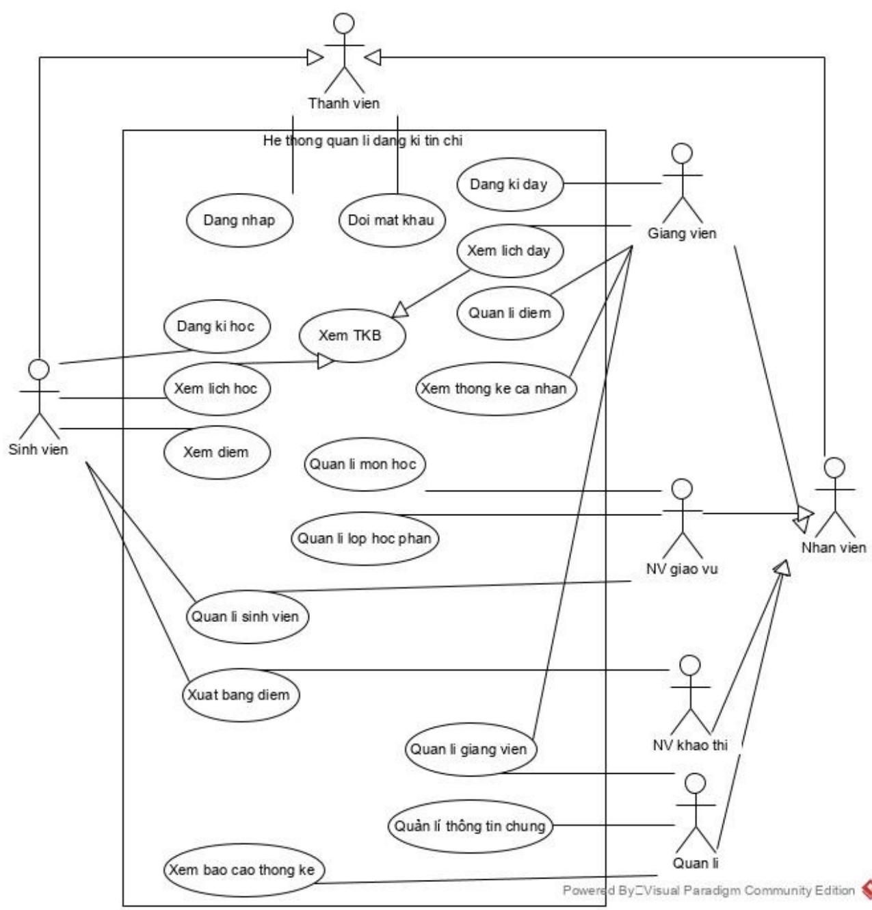  
Hình 3.1: Biểu đồ use case tổng quan

Trong số các chức năng này, việc xem lịch học của sinh viên là tương tự chức năng xem lịch dạy của giảng viên. Nên hai use case này được cho kế thừa từ use case xem TKB. Như vậy, biểu đồ use case tổng quan của hệ thống được trình bày như Hình 3.1, với mô tả các use case như sau:

• Đăng kí học: UC này cho phép sinh viên vào hệ thống đăng kí các môn học theo nguyện vọng cá nhân. • Xem lịch học: UC này cho phép sinh viên vào hệ thống xem lịch học cá nhân • Xem điểm: UC này cho phép sinh viên vào hệ thống xem kết quả các môn học của mình.

Đăng kí dạy: UC này cho phép giảng viên vào hệ thống để đăng kí lịch dạy của mình vào đầu mỗi kì học.   
• Xem lịch dạy: UC này cho phép giảng viên xem lịch dạy cá nhân Nhập điểm: UC này cho phép giảng viên nhập điểm các lớp học phần do mình dạy Xem thống kê cá nhân: UC này cho phép giảng viên xem các thống kê cá nhân Quản lí thông tin giảng viên: UC này cho phép giáo vụ quản lí thông tin giảng viên theo yêu cầu của giảng viên tương ứng. Quản lí thông tin sinh viên: UC này cho phép giáo vụ quản lí thông tin sinh viên theo yêu cầu từ sinh viên tương ứng.   
• Quản lí thông tin môn học: UC này cho phép giáo vụ quản lí thông tin các môn học   
• Quản lí thông tin lớp học phần: UC này cho phép giáo vụ quản lí thông tin các lớp học phần.   
• Xuất bảng điểm: UC này cho phép khảo thí xuất bảng điểm cho sinh viên theo yêu cầu từ sinh viên.   
• Xem thống kê: UC này cho phép nhân viên quản lí xem các loại báo cáo thống kê.

# b. Use chi tiết của đăng kí học

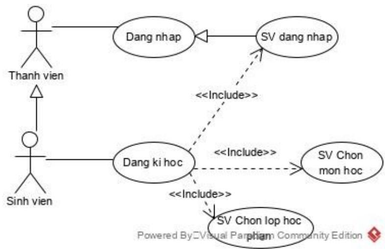  
Hình 3.2: Biểu đồ use case   
chi tiết cho modul đăng kí học

Chức năng đăng kí học có các giao diện tương tác với sinh viên:

• Đăng nhập -> đề xuất UC đăng nhập Đăng kí -> đề xuất UC đăng kí Chọn môn học -> đề xuất UC chọn môn học Chọn lớp học phần -> đề xuất UC chọn lớp học phần Đăng nhập, chọn môn học, chọn lớp học phần là bắt buộc mới hoàn thành được việc đăng kí, do đó UC đăng kí include các UC này.

Như vậy, biểu đồ UC chi tiết cho modul đăng kí học được trình bày trong Hình 3.2. Các UC được mô tả như sau:

• Chọn môn học: UC này cho phép sinh viên chọn môn học để đăng kí học • Chọn lớp học phần: UC này cho phép sinh viên chọn lớp học phần để đăng kí học.

# c. Use case chi tiết modul nhập điểm

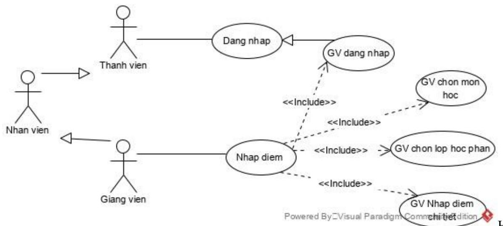  
3.3: Biểu đồ use case chi tiết cho modul nhập điểm

Hình

Trong chức năng nhập điểm, giảng viên phải tương tác với các giao diện:

• Đăng nhập -> thống nhất với UC đăng nhập Chọn kì học + môn học -> đề xuất UC chọn môn học   
• Chọn lớp học phần -> đề xuất UC chọn lớp học phần Nhập điểm chi tiết -> đề xuất UC nhập điểm chi tiết   
• Các UC trên đều bắt buộc thực hiện mới hoàn thành việc nhập điểm -> chúng đều bị chứa trong UC nhập điểm

Như vậy, biểu đồ UC chi tiết cho modul nhập điểm được trình bày trong Hình 3.3. Trong đó các UC được mô tả như sau:

• Chọn môn học: UC này cho phép giảng viên chọn môn học để nhập điểm Chọn lớp học phần: UC này cho phép giảng viên chọn lớp học phần để nhập điểm Nhập điểm chi tiết: UC cho phép giảng viên nhập/sửa điểm chi tiết từng đầu điểm thành phần của từng sinh viên trong một lớp học phần do mình dạy

d. Use case chi tiết cho modul xem thống kê loại học lực

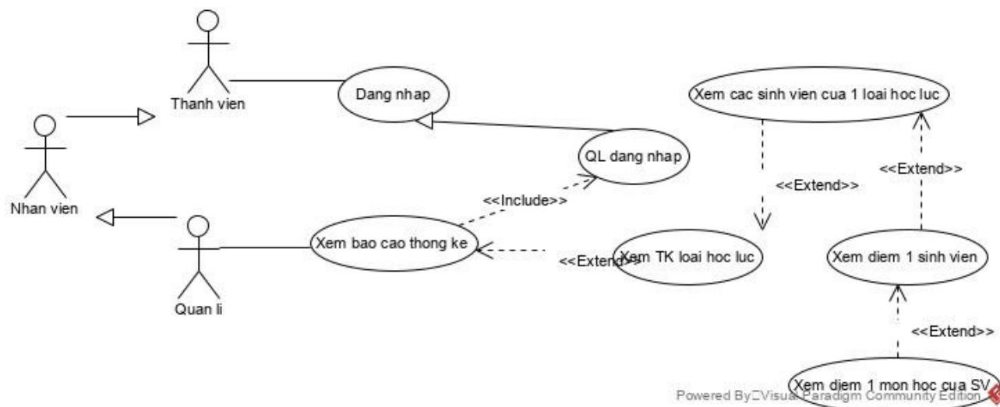  
Hình 3.4: Biểu đồ use case chi tiết cho modul xem thống kê loại học lực

Trong chức năng này, nhân viên quản lí có thể phải tương tác với các giao diện:

• Đăng nhập -> thống nhất với UC đăng nhập Xem thống kê loại học lực -> đề xuất UC xem TK loại học lực Xem thống kê các sinh viên của 1 loại học lực -> đề xuất UC xem TK sinh viên của loại học lực.   
• Xem kết quả của một sinh viên -> đề xuất UC xem điểm các môn học của sinh viên Xêm chi tiết một môn học của sinh viên -> đề xuất UC xem điểm chi tiết 1 môn học của sinh viên.   
• Các giao diện thống kê lần lượt theo dạng: giao diện sau là tùy chọn từ giao diện trước. Do đó, chúng có quan hệ mở rộng lần lượt cái sau từ cái trước.

Như vậy, biểu đồ UC chi tiết cho chức năng thống kê loại học lực được trình bày như trong Hình 3.4. Trong đó, các UC chi tiết được mô tả như sau:

• Xem TK loại học lực: UC này cho phép NVQL xem thống kê số lượng sinh viên trong mỗi loại học lực của một kì học   
• Xem TK sinh viên của một loại học lực: UC này cho phép NVQL xem TK kết quả các sinh viên của một loại học lực   
• Xem TK điểm của một sinh viên: UC này cho phép NVQL xem kết quả các môn học của một sinh viên trong một kì học Xem kết quả một một học của một sinh viên: UC này cho phép NVQL xem kết quả chi tiết một môn học của một sinh viên.

# 3.2 PHÂN TÍCH YÊU CẦU

# 3.2.1 Viết kịch bản

Lưu ý tránh sai sót trong kịch bản:

• Mỗi use case chính trong biểu đồ use case tổng quan thường có một kịch bản chuẩn và có thể có nhiều kịch bản ngoại lệ.   
• Use case có bao nhiêu actor thì kịch bản cũng có bấy nhiêu actor   
• Kịch bản càng chi tiết càng tốt: thông tin hệ thống hiện lên, thông tin người dùng nhập vào...

# a. Kịch bản cho modul đăng kí học

<table><tr><td>Use case</td><td>Dng kí hoc</td></tr><tr><td>Actor</td><td>Sinh viên</td></tr><tr><td>Tièn dièu kin</td><td>Sinh viên dã dng nhâp thành công, dang trong thòi gian sinh viên duąc phép dng kí môn hoc dàu hoc kì</td></tr><tr><td>Hâu dièu kin</td><td>Sinh viên dng kí xong môn hρc cho hρc kì</td></tr><tr><td>Kich bán chính</td><td>1. Sau khi dng nhâp, tù giao din chính, sinh viên A chçn chúc nng dng kí hoc cho hoc kì tói. 2. Giao din chon kì hoc dng kí, chon ngành hąc hin lên. Có danh sách các kì hρc dang mó dng kí. Danh sách các ngành hąc mà sinh viên dang hąc. Nút vào dng kí. 3. Sinh viên chon ngành hρc, chon kì hąc muón dng kí và click vào dng kí. 4. Giao din dng kí hoc hin lên, có ô chon kì hąc muón dng kí; bng danh sách các môn hρc/lóp hąc phàn d dng kí dang rōng; nút tiép tuc và nút luu chua dugc active. 5. Sinh viên chçn hρc kì tói trong danh sách và click vào nút tiép tuc. 6. Giao din hin lên danh sách các môn hoc mà sinh viên có thé dng kí trong hoc kì:</td></tr></table>

<table><tr><td rowspan=1 colspan=1>TT</td><td rowspan=1 colspan=1>M</td><td rowspan=1 colspan=1>Tên môn hoc</td><td rowspan=1 colspan=1>só tin chi</td><td rowspan=1 colspan=1>mô t</td><td rowspan=1 colspan=1>Chon</td></tr><tr><td rowspan=1 colspan=1>1</td><td rowspan=1 colspan=1>INT17</td><td rowspan=1 colspan=1>Toán ròi rac 1</td><td rowspan=1 colspan=1>3</td><td rowspan=1 colspan=1></td><td rowspan=1 colspan=1>chon</td></tr><tr><td rowspan=1 colspan=1>2</td><td rowspan=1 colspan=1>INT55</td><td rowspan=1 colspan=1>Co sò dū liçu</td><td rowspan=1 colspan=1>3</td><td rowspan=1 colspan=1></td><td rowspan=1 colspan=1>chon</td></tr><tr><td rowspan=1 colspan=1>3</td><td rowspan=1 colspan=1>INT68</td><td rowspan=1 colspan=1>Lâp trinh huóng dói tuong</td><td rowspan=1 colspan=1>3</td><td rowspan=1 colspan=1></td><td rowspan=1 colspan=1>chon</td></tr></table>

7. Sinh viên click chọn môn Lập trình hướng đối tượng

8. Giao diện các lớp học phần hiện ra:

<table><tr><td rowspan=8 colspan=1></td><td rowspan=1 colspan=1>TT</td><td rowspan=1 colspan=2>M</td><td rowspan=1 colspan=2>Tên</td><td rowspan=1 colspan=2>s só tói da</td><td rowspan=1 colspan=2>s só hin tai</td><td rowspan=1 colspan=2>Lich hoc</td><td rowspan=1 colspan=1>Chon</td></tr><tr><td rowspan=1 colspan=1>1</td><td rowspan=1 colspan=2>hdt1</td><td rowspan=1 colspan=2>HDT-N1</td><td rowspan=1 colspan=2>60</td><td rowspan=1 colspan=2>11</td><td rowspan=1 colspan=2>xem</td><td rowspan=1 colspan=1>chon</td></tr><tr><td rowspan=1 colspan=1>2</td><td rowspan=1 colspan=2>hdt2</td><td rowspan=1 colspan=2>HDT-N2</td><td rowspan=1 colspan=2>60</td><td rowspan=1 colspan=2>19</td><td rowspan=1 colspan=2>xem</td><td rowspan=1 colspan=1>chon</td></tr><tr><td rowspan=1 colspan=1>3</td><td rowspan=1 colspan=2>hdt3</td><td rowspan=1 colspan=2>HDT-N3</td><td rowspan=1 colspan=2>60</td><td rowspan=1 colspan=2>35</td><td rowspan=1 colspan=2>xem</td><td rowspan=1 colspan=1>chn</td></tr><tr><td rowspan=1 colspan=12>9. Sinh viên lick nhóm só 110. H thóng quay lai giao din buóc 2, bng các môn dã chon cp nhât lai:</td></tr><tr><td rowspan=1 colspan=1>TT</td><td rowspan=1 colspan=1>Mã</td><td rowspan=1 colspan=2>Tên</td><td rowspan=1 colspan=2>s só tói da</td><td rowspan=1 colspan=2>s só hin tai</td><td rowspan=1 colspan=2>Lich hoc</td><td rowspan=1 colspan=1>sùra</td><td rowspan=1 colspan=1>xóa</td></tr><tr><td rowspan=1 colspan=1>1</td><td rowspan=1 colspan=1>hdt1</td><td rowspan=1 colspan=2>HDT-N1</td><td rowspan=1 colspan=2>60</td><td rowspan=1 colspan=2>11</td><td rowspan=1 colspan=2>xem</td><td rowspan=1 colspan=1>súra</td><td rowspan=1 colspan=1>xóa</td></tr><tr><td rowspan=1 colspan=12>(Lp lai các buóc 4-10 cho dén khi dat só tín chi tói thiu, nút luu s active)11. Sinh viên click vào nút luu.12. H thóng báo thành công và quay vè giao din chính cúa sinh viên.</td></tr><tr><td rowspan=1 colspan=1>Ngoai lê</td><td rowspan=1 colspan=12>6. Không có môn nào dé dng kí8. Các lóp hoc phàn děu hét slot hoc trùng giò hoc vói các môn dã chçn truócnên không chąn dugc.</td></tr></table>

# b. Kịch bản cho modul nhập điểm

<table><tr><td rowspan=1 colspan=1>Use case</td><td rowspan=1 colspan=5>Nhâp diêm</td></tr><tr><td rowspan=1 colspan=1>Actor</td><td rowspan=1 colspan=5>Giäng viên</td></tr><tr><td rowspan=1 colspan=1>Tièn dièu kin</td><td rowspan=1 colspan=5>Ging viên dã dng nhâp thành công, dã có sinh viên dng kí vào các lóp doging viên day</td></tr><tr><td rowspan=1 colspan=1>Hâu dièu kin</td><td rowspan=1 colspan=5>Ging viên nhâp xong diém cho lóp hąc phàn</td></tr><tr><td rowspan=4 colspan=1>Kich bnchính</td><td rowspan=1 colspan=5>1. Ging viên chn chúc nng nhâp diém tùu giao din chính sau khi dng nhâp2. Giao din chn kì hoc dang hąc hin lên, có danh sách các kì hąc dang hoc(active) dé chon. Nút tiép tuc.3. Ging viên chon 1 kì hąc muón nhâp diém và click tiép tuc.4. Giao din chon môn hoc hin lên: danh sách các môn hoc do ging viên daykì tuong úng:</td></tr><tr><td rowspan=1 colspan=1>TT</td><td rowspan=1 colspan=1>Mã</td><td rowspan=1 colspan=1>Tên môn hc</td><td rowspan=1 colspan=1>só tin chimô tá</td><td rowspan=1 colspan=1></td></tr><tr><td rowspan=1 colspan=1>1</td><td rowspan=1 colspan=1>INT68</td><td rowspan=1 colspan=1>INT68 Lâp trinh huóng dói tuong</td><td rowspan=1 colspan=1>3</td><td rowspan=1 colspan=1></td></tr><tr><td rowspan=1 colspan=5>5. Giång viên click chon môn Lâp trinh huóng dói tuçng.</td></tr></table>

6. Giao diện các lớp học phần do giảng viên dạy hiện lên:

<table><tr><td rowspan=1 colspan=1>TT</td><td rowspan=1 colspan=1>M</td><td rowspan=1 colspan=1>Tên</td><td rowspan=1 colspan=1>s só hin tai</td></tr><tr><td rowspan=1 colspan=1>1</td><td rowspan=1 colspan=1>hdt1</td><td rowspan=1 colspan=1>HDT-N1</td><td rowspan=1 colspan=1>5</td></tr><tr><td rowspan=1 colspan=1>2</td><td rowspan=1 colspan=1>hdt2</td><td rowspan=1 colspan=1>HDT-N2</td><td rowspan=1 colspan=1>19</td></tr><tr><td rowspan=1 colspan=1>3</td><td rowspan=1 colspan=1>hdt3</td><td rowspan=1 colspan=1>HDT-N3</td><td rowspan=1 colspan=1>35</td></tr></table>

7. Giảng viên click vào nhóm số 1

8. Giao diện nhập điểm chi tiết cho nhóm số 1 hiện lên: có thông tin nhóm số 1, môn học lập trình hướng đối tượng, và danh sách điểm sinh viên, dưới cùng là nút lưu:

<table><tr><td rowspan=1 colspan=1>TT</td><td rowspan=1 colspan=1>Mã sv</td><td rowspan=1 colspan=1>Ho và tên</td><td rowspan=1 colspan=1>CC</td><td rowspan=1 colspan=1>TBKT</td><td rowspan=1 colspan=1>BTL</td><td rowspan=1 colspan=1>Thi</td><td rowspan=1 colspan=1>TBchung</td><td rowspan=1 colspan=1>TBch</td></tr><tr><td rowspan=1 colspan=1>1</td><td rowspan=1 colspan=1>cn11</td><td rowspan=1 colspan=1>Cao vn A</td><td rowspan=1 colspan=1>5</td><td rowspan=1 colspan=1>5</td><td rowspan=1 colspan=1>5</td><td rowspan=1 colspan=1></td><td rowspan=1 colspan=1></td><td rowspan=1 colspan=1></td></tr><tr><td rowspan=1 colspan=1>2</td><td rowspan=1 colspan=1>cn22</td><td rowspan=1 colspan=1>Lê Thi C</td><td rowspan=1 colspan=1>6</td><td rowspan=1 colspan=1>6</td><td rowspan=1 colspan=1>6</td><td rowspan=1 colspan=1></td><td rowspan=1 colspan=1></td><td rowspan=1 colspan=1></td></tr><tr><td rowspan=1 colspan=1>3</td><td rowspan=1 colspan=1>cn33</td><td rowspan=1 colspan=1>Tràn Minh D</td><td rowspan=1 colspan=1>7</td><td rowspan=1 colspan=1>7</td><td rowspan=1 colspan=1>7</td><td rowspan=1 colspan=1></td><td rowspan=1 colspan=1></td><td rowspan=1 colspan=1></td></tr><tr><td rowspan=1 colspan=1>4</td><td rowspan=1 colspan=1>cn44</td><td rowspan=1 colspan=1>Sàm Ngoc S</td><td rowspan=1 colspan=1>8</td><td rowspan=1 colspan=1>8</td><td rowspan=1 colspan=1>8</td><td rowspan=1 colspan=1></td><td rowspan=1 colspan=1></td><td rowspan=1 colspan=1></td></tr><tr><td rowspan=1 colspan=1>5</td><td rowspan=1 colspan=1>cn55</td><td rowspan=1 colspan=1>Vū Tién V</td><td rowspan=1 colspan=1>9</td><td rowspan=1 colspan=1>9</td><td rowspan=1 colspan=1>9</td><td rowspan=1 colspan=1></td><td rowspan=1 colspan=1></td><td rowspan=1 colspan=1></td></tr></table>

9. Giảng viên nhập đầu điểm thi:

A: 5, C:6, D:7, S:8, V:9 và click lưu

10. Hệ thống báo thành công và quay về giao diện chính của giảng viên.

# c. Kịch bản cho modul xem thống kê loại học lực

<table><tr><td rowspan=1 colspan=1>Use case</td><td rowspan=1 colspan=1>Xem thóng kê loai hoc luc</td></tr><tr><td rowspan=1 colspan=1>Actor</td><td rowspan=1 colspan=1>Nhân viên quán lí</td></tr><tr><td rowspan=1 colspan=1>Tièn dièu kin</td><td rowspan=1 colspan=1>Nhân viên quån lí dã dng nhâp thành công, kì hoc dã có diém cúa tát cà cácmôn hoc</td></tr><tr><td rowspan=1 colspan=1>Hâu dièu kin</td><td></td></tr></table>

Kịch bản chính

<table><tr><td>1. Qun lí A chon chúc nng xem thóng kê tù giao din chính sau khi dng nhâp 2. Giao din chçn loai thóng kê và kì hąc hin lên. Có danh sách các loai thóng kê: loai hąc lc, sinh viên, môn hąc... và anh sách các kì hρc dã két thúc. 3. Qun lí chçn chúc nng thóng kê loai hąc lc, thóng kê hąc kì 1 nm hoc</td></tr><tr><td>2019-2020 4. Giao din thóng kê loai hąc ląc, danh sách thóng kê hin lên:</td></tr></table>

<table><tr><td rowspan=1 colspan=1>TT</td><td rowspan=1 colspan=1>Loai hoc luc</td><td rowspan=1 colspan=1>Töng sinh vien</td><td rowspan=1 colspan=1>Dim trung binh</td></tr><tr><td rowspan=1 colspan=1>1</td><td rowspan=1 colspan=1>Uu tú</td><td rowspan=1 colspan=1>0</td><td rowspan=1 colspan=1></td></tr><tr><td rowspan=1 colspan=1>2</td><td rowspan=1 colspan=1>Xuát sc</td><td rowspan=1 colspan=1>2</td><td rowspan=1 colspan=1>3.6</td></tr><tr><td rowspan=1 colspan=1>3</td><td rowspan=1 colspan=1>Gioi</td><td rowspan=1 colspan=1>20</td><td rowspan=1 colspan=1>3.4</td></tr><tr><td rowspan=1 colspan=1>4</td><td rowspan=1 colspan=1>Khá</td><td rowspan=1 colspan=1>500</td><td rowspan=1 colspan=1>3.0</td></tr><tr><td rowspan=1 colspan=1>5</td><td rowspan=1 colspan=1>Trung binh</td><td rowspan=1 colspan=1>1200</td><td rowspan=1 colspan=1>2.67</td></tr><tr><td rowspan=1 colspan=1>6</td><td rowspan=1 colspan=1>Yéu kém</td><td rowspan=1 colspan=1>200</td><td rowspan=1 colspan=1>1.88</td></tr></table>

5. Quản lí click vào dòng Xuất sắc

6. Giao diện thống kê các sinh viên xuất sắc trong kì kiện lên:

<table><tr><td rowspan=1 colspan=1>TT</td><td rowspan=1 colspan=1>Ho tên</td><td rowspan=1 colspan=1>Ngành hoc</td><td rowspan=1 colspan=1>Tōng tin chi</td><td rowspan=1 colspan=1>Dim trung bình</td></tr><tr><td rowspan=1 colspan=1>1</td><td rowspan=1 colspan=1>Doàn Vn H</td><td rowspan=1 colspan=1>CNTT</td><td rowspan=1 colspan=1>18</td><td rowspan=1 colspan=1>3.6</td></tr><tr><td rowspan=1 colspan=1>2</td><td rowspan=1 colspan=1>Cao Ngoc X</td><td rowspan=1 colspan=1>CNTT</td><td rowspan=1 colspan=1>18</td><td rowspan=1 colspan=1>3.6</td></tr></table>

7. Quản lí click vào sinh viên Đoàn văn H

8. Giao diện kết quả các môn học của sinh viên Đoàn văn H hiện lên:

<table><tr><td rowspan=1 colspan=1>TT</td><td rowspan=1 colspan=1>Mã</td><td rowspan=1 colspan=1>Môn hc</td><td rowspan=1 colspan=1>Só TC</td><td rowspan=1 colspan=1>Diem</td></tr><tr><td rowspan=1 colspan=1>1</td><td rowspan=1 colspan=1>INT17</td><td rowspan=1 colspan=1>Toán ròi rac 1</td><td rowspan=1 colspan=1>3</td><td rowspan=1 colspan=1>A+</td></tr><tr><td rowspan=1 colspan=1>2</td><td rowspan=1 colspan=1>INT55</td><td rowspan=1 colspan=1>Co só dū liu</td><td rowspan=1 colspan=1>3</td><td rowspan=1 colspan=1>A+</td></tr><tr><td rowspan=1 colspan=1>3</td><td rowspan=1 colspan=1>INT68</td><td rowspan=1 colspan=1>Lâp trinh huóng dói tuong</td><td rowspan=1 colspan=1>3</td><td rowspan=1 colspan=1>A+</td></tr><tr><td rowspan=1 colspan=1>4</td><td rowspan=1 colspan=1>INT25</td><td rowspan=1 colspan=1>K thuât dò hoa</td><td rowspan=1 colspan=1>3</td><td rowspan=1 colspan=1>A+</td></tr><tr><td rowspan=1 colspan=1>5</td><td rowspan=1 colspan=1>BAS15</td><td rowspan=1 colspan=1>Kinh té chính tri Mác Lê Nin</td><td rowspan=1 colspan=1>3</td><td rowspan=1 colspan=1>A+</td></tr><tr><td rowspan=1 colspan=1>6</td><td rowspan=1 colspan=1>BAS44</td><td rowspan=1 colspan=1>Phuong pháp nghiên cúu khoa hąc</td><td rowspan=1 colspan=1>:3</td><td rowspan=1 colspan=1>A+</td></tr></table>

9. Quản lí click vào môn Lập trình hướng đối tượng   
10. Giao diện kết quả môn Lập trình hướng đối tượng của Đoàn Văn H hiện lên:

<table><tr><td rowspan=8 colspan=1></td><td rowspan=1 colspan=1>Môn hoc</td><td rowspan=1 colspan=1>Lâp trinh huóng dói tugng</td></tr><tr><td rowspan=1 colspan=1>Diém chuyên càn (10%)</td><td rowspan=1 colspan=1>10</td></tr><tr><td rowspan=1 colspan=1>Diem TBKT (10%)</td><td rowspan=1 colspan=1>9</td></tr><tr><td rowspan=1 colspan=1>Diêm BTL (20%)</td><td rowspan=1 colspan=1>9.5</td></tr><tr><td rowspan=1 colspan=1>Diém thi (60%)</td><td rowspan=1 colspan=1>9</td></tr><tr><td rowspan=1 colspan=1>Trung binh môn</td><td rowspan=1 colspan=1>9.2</td></tr><tr><td rowspan=1 colspan=1>Diêm ch</td><td rowspan=1 colspan=1>A+</td></tr><tr><td rowspan=1 colspan=1>Diêm h 4</td><td rowspan=1 colspan=1>3.6</td></tr><tr><td rowspan=1 colspan=1>Ngoai lê</td><td rowspan=1 colspan=2>4. Các loai hoc ląc dèu có 0 sinh viên</td></tr></table>

# 3.2.2 Trích lớp thực thể

Tóm tắt các bước trong phương pháp trích danh từ để trích lớp thực thể cho hệ thống:

• Bước 1: Mô tả ngắn gọn nhưng phải đầy đủ hệ thống trong một đoạn văn. Có thể mô tả lần lượt các chức năng của hệ thống theo từng người dùng để tránh bị sót. Có thể thay thế bước này bằng cách tổng hợp tất cả các kịch bản (bao gồm kịch bản chuẩn và kịch bản ngoại lệ) của tất cả các use case của hệ thống.

• Bước 2: Trích các danh từ xuất hiện trong đoạn văn của bước 1. Mỗi danh từ xuất hiện chỉ cần tính một lần.

Bước 3: Đánh giá các danh từ.

◦ Một là đề xuất danh từ thành một lớp thực thể.   
◦ Hai là đề xuất danh từ thành thuộc tính của lớp nào đó.   
◦ Ba là loại bỏ danh từ đó vì quá chung chung, trừu tượng, hoặc ngoài pham vi quản lí của hệ thống.

• Bước 4: Xác định quan hệ số lượng giữa các thực thể.

◦ Nếu quan hệ 1-1 thì có thể giữ nguyên hoặc gộp lại.   
◦ Nếu quan hệ 1-n thì giữ nguyên.   
◦ Nếu quan hệ là n-n thì phải đề xuất các lớp thực thể trung gian để tách thành ít nhất 2 quan hệ 1-n.

• Bước 5: Xác định quan hệ đối tượng giữa các thực thể: quan hệ kế thừa, hợp thành (aggregation), gắn chặt (composition), liên kết (association), phụ thuộc (dependence)...

Lưu ý khi vẽ biểu đồ lớp thực thể pha phân tích:

• Tên lớp, tên thuộc tính có thể dùng ngôn ngữ tự nhiên vẫn được, tuy nhiên, nên đặt tên theo chuẩn code convention để vào pha thiết kế đỡ phải thay đổi.   
• Thuộc tính chưa cần kiểu dữ liệu

• Các lớp thực thể chưa cần thuộc tính id trong pha phân tích. Áp dụng cho hệ thống quản lí đăng kí tín chỉ, các bước được thực hiện như sau:

# Bước 1: Mô tả hệ thống trong một đoạn văn

Hệ thống là một trang web hỗ trợ quản lí đăng kí tín chỉ và điểm của sinh viên trong một trường đại học. Trong đó, sinh viên được phép đăng kí các môn học, lớp học phần theo lịch học cá nhân vào đầu mỗi học kì; xem lịch học hàng ngày với đầy đủ thông tin về kíp học, ngày học, tuần học, phòng học, tòa nhà; xem kết quả học chi tiết với từng môn học, từng đầu điểm thành phần của môn học, cũng như điểm trung bình tích lũy các kì học của từng năm học hay từ đầu khóa học theo ngành học của sinh viên. Giảng viên được phép đăng kí dạy các môn học, các lớp học phần theo nguyện vọng cá nhân, sau đó sẽ được bộ môn quản lí duyệt và phân công chính thức; nhập hay sửa điểm của các sinh viên trong các lớp học phần do mình dạy; xem lịch dạy hàng tuần; và có thể xem các thống kê cá nhân về tỉ lệ sinh viên qua môn, điểm trung bình của sinh viên theo các môn học hay lớp học phần do mình dạy. Nhân viên giáo vụ có thể quản lí thông tin liên quan đến các môn học; lên lịch hay điều chỉnh lịch học cho các lớp học phần; quản lí thông tin sinh viên theo yêu cầu của sinh viên. Nhân viên khảo thí có thể xuất bảng điểm toàn khóa theo yêu cầu của sinh viên. Nhân viên quản lí có thể quản lí thông tin giảng viên theo yêu cầu của giảng viên; xem các loại thống kê: thống kê loại học lực, thống kê sinh viên theo kết quả học, theo ngành học, theo khoa, theo năm học, hay học kì; thống kê giảng viên theo khối lượng giảng dạy, theo kết quả sinh viên, theo khoa hay bộ môn.

# Bước 2: Trích các danh từ xuất hiện trong đoạn văn

• Các danh từ liên quan đến người: sinh viên, nhân viên, giảng viên, nhân viên giáo vụ, nhân viên khảo thí, nhân viên quản lí • Các danh từ liên quan đến vật: trường đại học, toà nhà, phòng học, bảng điểm • Các danh từ liên quan đến thông tin: Khoa, ngành học, bộ môn, năm học, học kì, môn học, lớp học phần, điểm thành phần, điểm tích lũy, điểm trung bình môn, tín chỉ, học lực, khóa học, lịch học, thời khóa biểu, tuần học, ngày học, kíp học, báo cáo thống kê, thống kê học lực, thống kê sinh viên, thống kê giảng viên, thống kê môn học, thống kê học kì.

# ước 3: Đánh giá và lựa chọn các danh từ làm lớp thực thể hoặc thuộc tính

• Các danh từ trừu tượng: hệ thống, trang web, báo cáo thống kê, thông tin -> loại.

• Các danh từ liên quan đến người:

◦ Thành viên hệ thống -> Thanhvien (trừu tượng): tên, tên đăng nhập, mật khẩu, ngày sinh, địa chỉ, email, điện thoại, vai trò, ghi chú.   
◦ Sinh viên -> lớp Sinhvien: kế thừa lớp Thành viên, thêm thuộc tính: mã sinh viên.   
◦ Nhân viên -> lớp Nhanvien (trừu tượng): kế thừa lớp Thành viên, thêm thuộc tính: vị trí.   
◦ Giảng viên -> lớp Giangvien: kế thừa Thanhvien

◦ Nhân viên giáo vụ -> lớp Giaovu: Kế thừa Thanhvien ◦ Nhân viên khảo thí -> lớp NVKhaothi: kế thừa Thanhvien ◦ Nhân viên quản lí -> lớp NVQuanli: Kế thừa Thanhvien • Các danh từ liên quan đến vật:

◦ Trường đại học -> lớp Truong: tên, địa chỉ, mô tả   
◦ Tòa nhà -> lớp Toanha: Tên, mô tả   
◦ Phòng học -> lớp Phonghoc: Tên, sức chứa, mô tả   
◦ Bảng điểm, là số nhiều của một điểm của một môn học nên không đề xuất lớp.

• Các danh từ thông tin:

◦ Khoa + ngành -> lớp Khoa: Tên, mô tả   
◦ Bộ môn -> lớp Bomon: Tên, mô tả   
◦ Năm học -> lớp Namhoc: Tên, mô tả   
◦ Học kì -> lớp Hocki: Tên, mô tả   
◦ Môn học -> lớp Monhoc: Tên, số tín chỉ, mô tả   
◦ Lớp học phần -> lớp Lophocphan: Tên   
◦ Đầu điểm thành phần -> Daudiem: tên, mô tả   
◦ Điểm tích lũy, điểm trung mình môn là thông tin dẫn xuất nên đề xuất là thuộc tính của một lớp nào đó, quyết định sau.   
◦ Tín chỉ là thuộc tính của môn học   
◦ Học lực -> lớp Loaihocluc: tên, mô tả   
◦ Khóa học là thuộc tính của sinh viên học một ngành học.   
◦ Lịch học -> lớp Lichhoc: liên quan đến tuần học, ngày học, kíp học, phòng học, giảng viên.   
◦ Thời khóa biểu là số nhiều của lịch học.   
◦ Tuần học -> lớp Tuanhoc: tên, mô tả   
◦ Ngày học -> lớp Ngayhoc: tên thứ ngày trong tuần, mô tả   
◦ Kíp học -> lớp Kip: tên, mô tả   
◦ Thống kê loại học lực -> lớp TKLoaihocluc   
◦ Thống kê môn học -> lớp TKMonhoc   
◦ Thống kê giảng viên -> lớp TKGiangvien   
◦ Thống kê sinh viên -> TKSinhvien   
◦ Thống kê học kì -> TKHocki

# Bước 4: Xác định quan hệ số lượng giữa các thực thể

Trường có nhiều khoa/ngành -> quan hệ giữa Truong và Khoa là 1-n • Khoa có nhiều bộ môn -> Khoa - Bomon là 1-n • Bộ môn có nhiều giảng viên -> Bomon - Giangvien là 1-n

Trường có nhiều tòa nhà -> Truong - Toanha là 1-n Tòa nhà có nhiều phòng học -> Toanha - Phonghoc là 1-n Một năm học có nhiều học kì, một học kì có thể nằm trong nhiều năm học -> Namhoc - Hocki là n-n -> đề xuất lớp Kihoc kết nối giữa 1 năm học và 1 học kì (Kihoc # Hocki). Một kì học có nhiều môn học, một môn học có thể học trong nhiều kì học -> Kihoc - Monhoc là n-n -> đề xuất lớp MonhocKihoc xác định duy nhất một môn học dạy trong một kì học. Một môn học có một số môn học tiên quyết. Một môn học, trong một kì học, có nhiều lớp học phần -> MonhocKihoc - Lophocphan là 1-n. Một môn học có nhiều đầu điểm thành phần, một đầu điểm thành phần có thể xuất hiện trong nhiều môn học -> Monhoc - Daudiem là n-n -> đề xuất lớp MonhocDaudiem xác định duy nhất một đầu điểm trong một môn học. Một sinh viên có thể học nhiều ngành học/khoa, một ngành/khoa có thể có nhiều sinh viên -> Sinhvien - Khoa là n-n -> đề xuất lớp SinhvienKhoa xác định duy nhất một sinh viên học một ngành/khoa nhất định. Một sinh viên, đối với một ngành học, có thể học nhiều lớp học phần của nhiều môn học (mỗi môn học 1 lớp), mỗi lớp học phần có thể có nhiều sinh viên -> SinhvienKhoa - Lophocphan là n-n -> đề xuất lớp Dangkihoc xác định duy nhất một sinh viên đăng kí vào một lớp học phần của một môn học nhất định. Một Dangkihoc có nhiều MonhocDaudiem, 1 MonhocDaudiem có nhiều Dangkihoc, nên đề xuất lớp Ketqua xác định duy nhất đầu điểm thành phần của sinh viên đã học môn học xác định. Một lớp học phần có nhiều buổi học (lịch học) khác nhau -> Lophocphan - Lichhoc là 1- n.   
• Tương tự, các quan hệ Giangvien - Lichhoc, Phonghoc - Lichhoc, Tuanhoc - Lichhoc, Ngayhoc - Lichhoc, Kiphoc - Lichhoc đều là 1-n.   
Ngoài ra, thông tin Họ và tên có thể tách thành một lớp thực thể riêng. Thông tin địa chỉ cũng có thể tách thành một lớp thực thể riêng.

# Bước 5: Xác định quan hệ đối tượng giữa các thực thể

• Khoa là thành phần của Trường • Bộ môn là thành phần của Khoa. • Giảng viên là thành phần của Bộ môn • Môn học là thành phần của Bộ môn • Tòa nhà là thành phần của Trường • Phòng học là thành phần của tòa nhà Năm học và Học kì liên kết tạo ra Kì học duy nhất

• Sinh viên và ngành học liên kết tạo ra SinhvienKhoa duy nhất.   
• Môn học và đầu điểm liên kết tạo ra MonhocDaudiem duy nhất   
• Sinh viên và lớp học phần liên kết tạo ra Dangkihoc duy nhất Đăng kí học và MonhocDaudiem liên kết tạo ra điểm thành phần duy nhất cho sinh viên đối với môn học. Thông tin môn học nằm trong thông tin lớp học phần   
• Thông tin lớp học phần, giảng viên, phòng học, tuần học, ngày học, kíp học nằm trong thông tin lịch học. Thông tin địa chỉ nằm trong thông tin về thành viên, trường Thông tin họ và tên nằm trong thông tin thành viên. Các lớp thống kê kế thừa từ các thực thể tương ứng.

Kết quả thu được biểu đồ lớp thực thể pha phân tích toàn hệ thống như trong Hình 3.5.

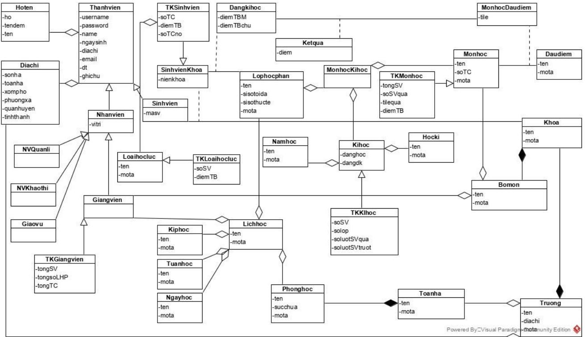  
Hình 3.5: Biểu đồ lớp thực thể pha phân tích của hệ thống

# 3.2.3 Trích các lớp biên và điều khiển

Tóm tắt các bước thực hiện để vẽ biểu đồ lớp pha phân tích:

• Bước 1: Mỗi giao diện xuất hiện có thể đề xuất thành một lớp biên. Bước 2: Với mỗi giao diện, xem xét cần các thành phần nào để nhận dữ liệu vào, hiện dữ liệu lên, hay submit dữ liệu vào hệ thống. Mỗi thành phần như vậy đề xuất thành một thuộc tính của giao diện, đặt tên với các tiền tố tương ứng: ◦ in: tiền tố của tên thuộc tính nhận dữ liệu vào (ô text, ô chọn....)

◦ out: tiền tố của tên thuộc tính hiện dữ liệu lên (bảng biểu, thông báo...) ◦ sub: tiền tố của tên thuộc tính để submit dữ liệu (nút nhấn, liên kết...)

• Bước 3: Với mỗi chức năng phải thực hiện tầng dưới tầng giao diện, thực hiện đề xuất phương thức:

◦ Đề xuất tên phương thức (có thể đặt tên gợi nhớ, và tuân thủ code convention)   
◦ Xác định tham số đầu vào là gì, tham số đầu ra là gì.   
◦ Đề xuất gán hành động tương ứng với chức năng này cho lớp thực thể nào. Theo nguyên tắc:

▪ Nếu tham số đầu ra liên quan lớp thực thể nào thì gán phương thức này cho lớp đó Nếu không, xét tham số đầu vào. Nếu tham số đầu vào chỉ liên quan đến 1 thực thể thì gán phương thức này cho thực thể đó. Nếu tham số vào liên quan đến hai hay nhiều thực thể, thì tìm thực thể nào nhỏ nhất mà chứa được càng nhiều càng tốt các tham số đầu vào, gán phương thức này cho lớp thực thể đó.

• Vẽ biểu đồ lớp pha phân tích cho từng modul.

Lưu ý khi vẽ biểu đồ lớp pha phân tích:

• Tên lớp, tên thuộc tính có thể dùng ngôn ngữ tự nhiên vẫn được, tuy nhiên, nên đặt tên theo chuẩn code convention để vào pha thiết kế đỡ phải thay đổi.   
Thuộc tính chưa cần kiểu dữ liệu   
Quan hệ giữa các lớp thực thể phải thống nhất, đồng bộ với quan hệ giữa chúng trong biểu đồ lớp thực thể đã vẽ ở bước trước.

# a. Phân tích tĩnh modul đăng kí học

• Ban đầu, giao diện chính của sinh viên -> đề xuất lớp GDChinhSV, cần các thành phần: ◦ chọn đăng kí học: kiểu submit

• Bước 2, giao diện chọn kì học, ngành học -> đề xuất lớp GDChonnganh, cần có các thành phần:

◦ Chọn ngành học để đăng kí: vừa input, vừa output ◦ Chọn kì học: vừa input, vừa output ◦ Nút chọn tiếp tục: kiểu submit

• Để có danh sách ngành học để chọn ở bước 2, cần xử lí dưới hệ thống:

◦ Tìm các ngành học của sinh viên   
◦ input: sinh viên   
◦ output: danh sách Khoa   
◦ đề xuất phương thức getKhoacuaSV(), gán cho lớp Khoa.

• Để có danh sách kì học đang mở đăng kí, cần xử lí bên dưới hệ thống: ◦ Tìm các kì học đang mở đăng kí ◦ input: không có

◦ output: danh sách Kihoc ◦ đề xuất phương thức getKihocDangki(), gán vào lớp Kihoc • Bước 4, giao diện đăng kí -> đề xuất lớp GDDangki, cần có các thành phần: ◦ Bảng danh sách các môn học: vừa output, vừa submit ◦ Nút tiếp tục, nút lưu: kiểu submit

• Để có danh sách các đăng kí đã có, cần xử lí bên dưới hệ thống:

◦ Tìm các môn học/lớp học phần đã đăng của sinh viên ở kì học đã chọn   
◦ input: học kì, sinh viên   
◦ output: danh sách Dangkihoc   
◦ đề xuất phương thức getDangkicuaSV(), gán vào lớp Dangkihoc

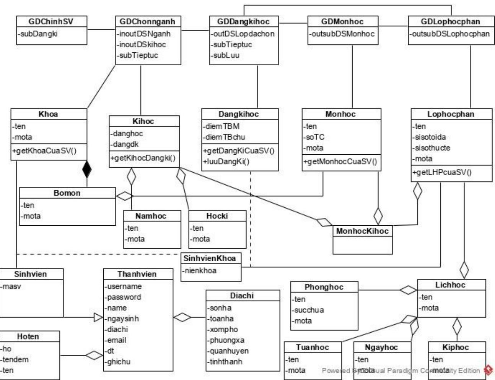  
Hình 3.6: Biểu đồ lớp phân tích modul đăng kí hoc

• Bước 6, giao diện chọn môn học -> đề xuất lớp GDMonhoc, cần các thành phần: ◦ bảng danh sách các môn học có thể đăng kí: vừa output, vừa submit • Để hiển thị được danh sách các môn học, cần xử lí trước dưới hệ thống:

◦ Tìm các môn học có thể dăng kí của sinh viên   
◦ input: sinh viên, kì học   
◦ output: danh sách Monhoc   
◦ đề xuất phướng thức getMonhoccuaSV(), gán cho lớp Monhoc.   
Bước 8, giao diện lớp học phần -> đề xuất lớp GDLophocphan, cần có: ◦ bảng danh sách lớp học phần: vừa output, vừa submit   
Để hiển thị danh sách lớp học phần, cần xử lí trước từ dưới hệ thống: ◦ Tìm các lớp học phần của môn học ◦ input: monhoc, kì học ◦ output: danh sách Lophocphan ◦ đề xuất phương thức getLHPcuaMH(), gán cho lớp Lophocphan.

Kết quả thu được biểu đồ lớp cho modul đăng kí học như trong Hình 3.6.

# b. Phân tích tĩnh cho modul nhập điểm

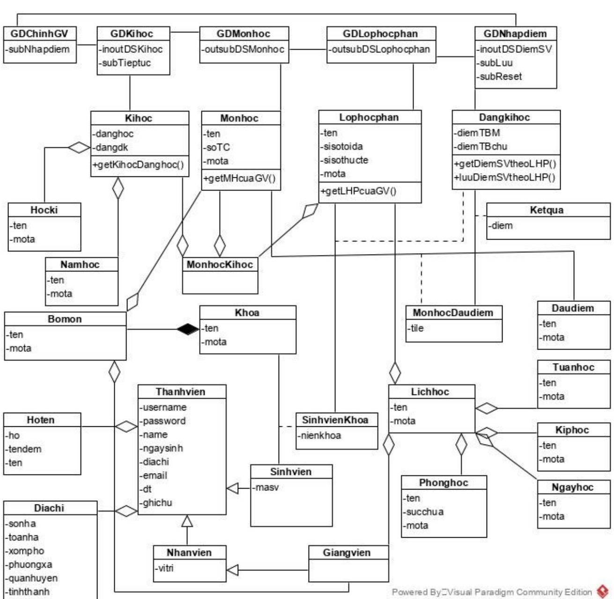  
Hình 3.7: Biểu đồ lớp phân tích modul nhập điểm

• Ban đầu, giao diện chính của giảng viên -> đề xuất lớp GDChinhGV, cần có: ◦ chọn nhập/sửa điểm: kiểu submit Bước 2, giao diện chọn kì học -> đề xuất GDKihoc, cần có: ◦ danh sách kì học: vừa input, vừa output ◦ nút tiếp tục: kiểu submit   
• Để có danh sách kì học đang học, cần xử lí dưới hệ thống: ◦ Tìm các kì học đnag học ◦ input: không có

◦ output: danh sách các Kihoc ◦ đề xuất phương thức getKihocDanghoc(), gán cho lớp Kihoc.

• Bước 4, giao diện chọn môn học -> đề xuất GDMonhoc, cần có: ◦ danh sách các môn học: vừa output, vừa submit

• Sau khi chọn kì học, cần xử lí dưới hệ thống để lấy danh sách môn học:

◦ Tìm các môn học của giảng viên đang dạy   
◦ input: giảng viên, kì học   
◦ output: danh sách các MonhocDaudiem   
◦ đề xuất phương thức getMHcuaGV(), gán cho lớp Monhoc.

• Bước 6, giao diện chọn lớp học phần -> đề xuất lớp GDLophocphan, cần có: ◦ bảng danh sách lớp học phần: vừa output, vừa submit

• Để có danh sách lớp học phần, cần xử lí trước từ dưới hệ thống:

◦ Lấy danh sách các lớp học phần của môn học do giảng viên dạy ◦ input: môn học, giảng viên   
◦ output: danh sách Lophocphan   
◦ đề xuất phương thức getLHPcuaGV(), gán cho lớp Lophocphan

• Bước 8, giao diện nhập điểm -> đề xuất lớp GDNhapdiem, cần có: ◦ Danh sách sinh viên + các đầu điểm: vừa output, vừa input ◦ Nút lưu, nút reset: kiểu submit

• Để có danh sách sinh viên, cần xử lí trước từ dưới hệ thống:

◦ lấy danh sách sinh viên + các đầu điểm đã có lên   
◦ input: lớp học phần   
◦ output: thông tin sinh viên + các đầu điểm thành phần của môn học (Dangkihoc) ◦ đề xuất phương thức getDiemSVtheoLHP(), gán cho lớp Dangkihoc.

• Sau khi click lưu điểm, cần xử lí dưới hệ thống:

◦ lưu danh sách sinh viên + các đầu điểm vào   
◦ input: thông tin sinh viên + các đầu điểm thành phần của môn học (Dangkihoc) ◦ output: thành công hay không   
◦ đề xuất phương thức luuDiemSVtheoLHP(), gán cho lớp Dangkihoc.

Kết quả thu được biểu đồ lớp phân tích modul nhập điểm như trong Hình 3.7.

# c. Phân tích tĩnh cho modul xem thống kê loại học lực

Ban đầu, giao diện chính của quản lí -> đề xuất lớp GDChinhQL, cần có ◦ chọn xem thống kê: kiểu submit   
Bước 2, giao diện chọn loại thống kê và kì học -> đề xuất lớp GDChonTK, cần có: ◦ danh sách loại thống kê: vừa input, vừa output ◦ danh sách kì học đã kết thúc: vừa input, vừa output

◦ nút xem: kiểu submit

• Đề có danh sách kì học đã kết thúc, cần xử lí trước từ dưới hệ thống:

lấy danh sách kì học đã kết thúc   
C input: không có   
◦ output: tất cả kì học đã kết thúc   
◦ đề xuất phương thức getKihocDaxong(), gán cho lớp Kihoc

• Bước 4+6, giao diện thống kê loại học lực -> đề xuất lớp GDTKLoaihocluc, cần có: ◦ danh sách thống kê loại học lực: output, submit

• Để có dữ liệu thống kê, cần xử lí từ dưới hệ thống:

◦ lấy dữ liệu thống kê loại học lực của học kì đã chọn ◦ input: học kì ◦ output: danh sách TKLoaihocluc ◦ đề xuất phương thức getTKHocluc(), gán cho lớp TK • Bước 8, giao diện các sinh viên của loại học lực -> GDSVLoaihocluc, cần có: ◦ Danh sách các sinh viên + điểm: kiểu output, submit

• Để có danh sách các sinh viên và điểm tổng kết, cần xử lí:

• Bước 10, giao diện danh sách điểm các môn học của sinh viên -> lớp GDDiemSV, cần: ◦ danh sách điểm các môn học của sinh viên: output, submit

• Để có danh sách điểm các môn học của sinh viên, cần xử lí: ◦ lấy danh sách điểm các môn học của sinh viên ◦ input: sinh viên, học kì ◦ output: danh sách các điểm sinh viên (Dangkihoc) ◦ đề xuất phương thức getDSDiemSV(), gán cho lớp Dangkihoc • Bước 12, giao diện điểm chi tiết môn học -> lớp GDDiemMHcuaSV, cần có: ◦ thông tin môn học: output ◦ danh sách các đầu điểm và điểm: output

• Để có thông tin điểm chi tiết, cần xử lí: ◦ lấy điểm chi tiết môn học của sinh viên ◦ input: môn học, sinh viên ◦ output: điểm chi tiết của môn học (Dangkihoc) ◦ đề xuất phương thức getDiemMHcuaSV(), gán cho lớp Dangkihoc.

Kết quả thu được biểu đồ lớp phân tích modul xem thống kê loại học lực như trong Hình 3.8.

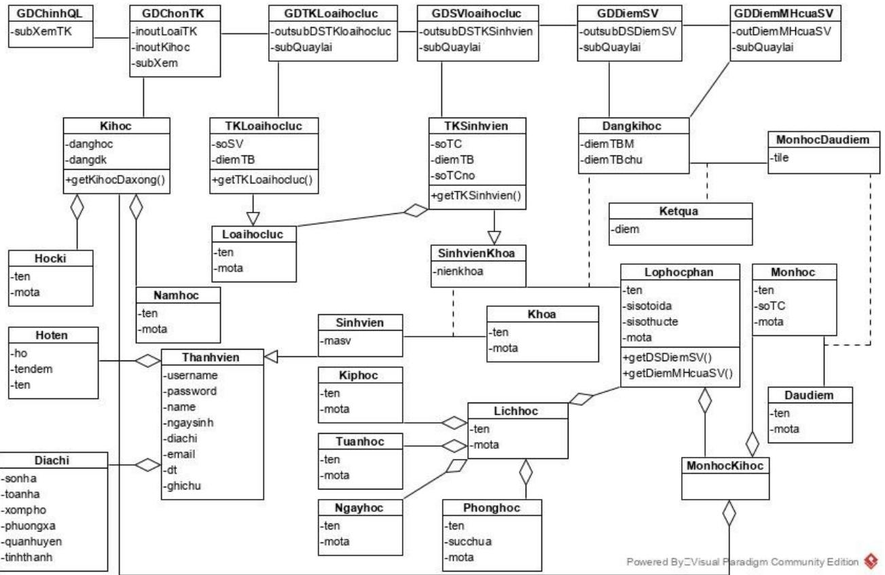  
Hình 3.8: Biểu đồ lớp phân tích modul xem thống kê theo loại học lực

# 3.2.4 Phân tích hoạt động

Tóm tắt các bước thực hiện để vẽ biểu đồ trạng thái của một modul/chức năng:

• Bước 1: Mỗi trạng thái chờ tương ứng với mỗi lần hệ thống hiển thị 1 giao diện để chờ tương tác của người dùng Bước 2: Điều kiện chuyển trạng thái tương ứng với hành động của người dùng trên giao diện tương ứng.

Tóm tắt các bước thực hiện để vẽ biểu đồ tuần tự/giao tiếp pha phân tích:

• Bước 1: Viết kịch bản phiên bản 2 từ biểu đồ lớp của modul: Mỗi bước là một hành động của một lớp nào đó trong biểu đồ lớp, hoặc là của tác nhân. Bước 2: Vẽ biểu đồ giao tiếp cho kịch bản chuẩn: các bước tương ứng với các bước trong kịch bản phiên bản 2. Quan hệ giữa các lớp phải thống nhất với quan hệ giữa chúng trong biểu đồ lớp của modul. Bước 3: chuyển hóa biểu đồ giao tiếp thành biểu đồ tuần tự cho kịch bản chuẩn. Kiểm tra lại các bước đúng tuần tự và logic nghiệp vụ.

# a. Modul đăng kí học

Biểu đồ trạng thái mô tả hoạt động của modul như biểu diễn trong Hình 3.9:

Từ giao diện chính của sinh viên, nếu chức năng đăng kí được chọn thì chuyển sang giao diện chọn ngành học,   
• Từ giao diện chọn ngành học, khi ngành được chọn, hệ thống chuyển sang giao diện đăng kí học. Tại giao diện đăng kí, nếu click tiếp tục thì chuyển sang giao diện chọn môn học. Nếu chọn một lớn đã đăng kí thì chuyển sang giao diện chọn lớp học phần để chọn lại. Nếu chọn lưu thì lưu và kết thúc.   
• Tại giao diện chọn môn học, nếu môn học được chọn thì chuyển sang giao diện chọn lớp học phần.   
Tại giao diện chọn lớp học phần, sau khi chọn lớp học phần thì quay về giao diện đăng kí.

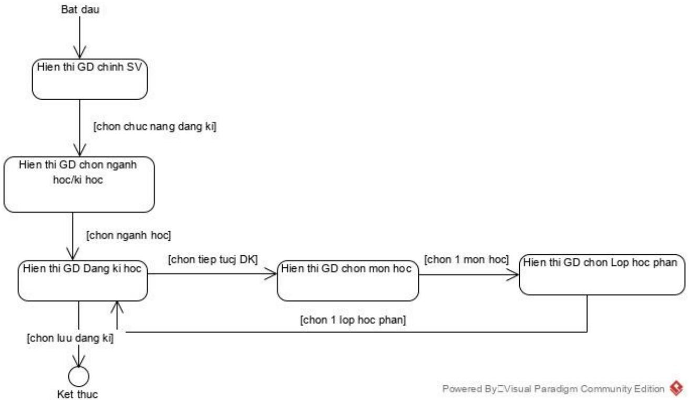  
Hình 3.9: Biểu đồ chuyển trạng thái của modul đăng kí học

Kịch bản v.2 cho modul đăng kí môn học như sau (Hình 3.10):

1. Tại giao diện chính của sinh viên sau khi đăng nhập, sinh viên click chọn đăng kí.   
2. Lớp GDChinhSV gọi lớp GDChonnganh   
3. GDChonnganh gọi lớp Kihoc yêu cầu tìm danh sách các kì học đnag mở đăng kí   
4. Lớp Kihoc tìm các kì học đang mở đăng kí   
5. Lớp Kihoc trả kết quả lại cho lớp GDChonnganh   
6. GDChonnganh gọi lớp Khoa yêu cầu tìm danh sách ngành   
7. Lớp Khoa tìm các ngành học của sinh viên   
8. Lớp Khoa trả kết quả lại cho lớp GDChonnganh   
9. Lớp GDChonnganh hiển thị cho sinh viên   
10. Sinh viên click 1 ngành của mình học   
11. Lớp GDChonnganh gọi lớp GDDangki   
12. Lớp GDDangki gọi lớp Dangkihoc yêu cầu tìm thông tin đã đăng kí   
13. Lớp Dangkihoc lấy thông tin đã đăng kí của sinh viên   
14. Lớp Dangkihoc trả kết quả lại cho lớp GDDangki.   
15. Lớp GDDangki hiển thị cho sinh viên.   
16. Sinh viên chọn tiếp tục đăng kí   
17. Lớp GDDangki gọi GDMonhoc   
18. Lớp GDMonhoc gọi lớp Monhoc yêu cầu tìm các môn học được đăng kí   
19. Lớp Monhoc tìm các môn học mà sinh viên được đăng kí   
20. Lớp Monhoc trả kết quả lại cho lớp GDMonhoc   
21. Lớp GDMonhoc hiển thị cho sinh viên   
22. Sinh viên click chọn 1 môn học   
23. Lớp GDMonhoc gọi lớp GDLophocphan   
24. Lớp GDLophocphan gọi lớp Lophocphan yếu cầu tìm các lớp học phần của môn học   
25. Lớp Lophocphan tìm các lớp học phần của môn học   
26. Lớp Lophocphan trả kết quả cho lớp GDLophocphan   
27. Lớp GDLophocphan hiển thị cho sinh viên   
28. Sinh viên click 1 lớp lớp học phần   
29. GDLophocphan gọi lại lớp GDDangki   
30. GDDangki lại hiển thị (Lặp các bước từ 12 đến 27 đến khi đủ số tín chỉ)   
31. Sinh viên click lưu   
32. Lớp GDDangki gọi lớp Dangkihoc yêu cầu lưu   
33. Lớp Dangkihoc lưu thông tin đăng kí   
34. Lớp Dangkihoc trả kết quả lại cho lớp GDDangki   
35. Lớp GDDangki báo đăng kí thành công.

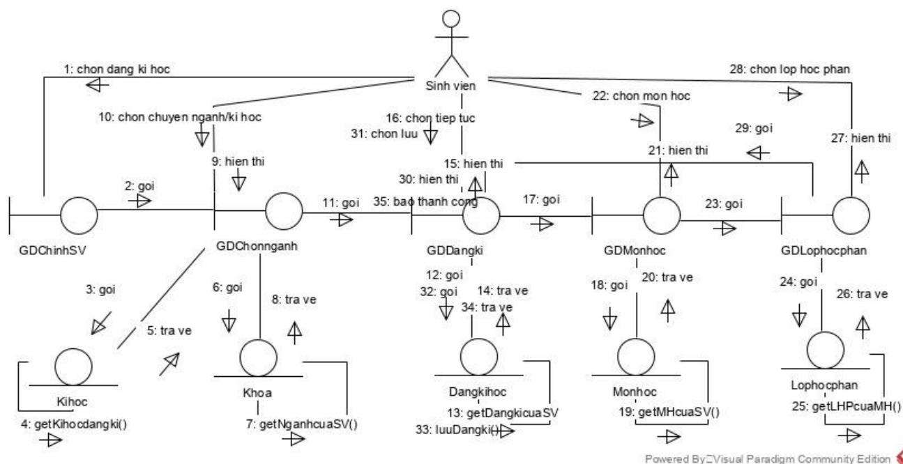  
Hình 3.10: Biểu đồ giao tiếp của modul đăng kí học

# b. Modul nhập điểm

Biểu đồ trạng thái của modul được trình bày trong Hình 3.11:

• Tại giao diện chính của giảng viên, hệ thống chuyển sang giao diện chọn môn học khi chức năng chọn môn học được chọn.   
• Tại giao diện chọn môn học, khi giảng viên chọn 1 môn học, hệ thống sẽ chuyển sang giao diện chọn lớp học phần.   
• Tại giao diện chọn lớp học phần, khi giảng viên chọn 1 lớp học phần, hệ thống sẽ chuyển sang giao diện nhập điểm. Tại giao diện nhập điểm, sau khi nhập nhập và chọn lưu, hệ thống lưu điểm vào và kết thúc.

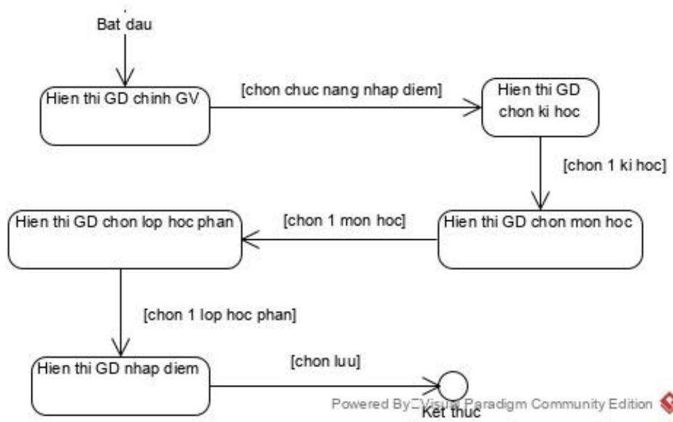  
Hình 3.11: Biểu đồ   
chuyển trạng thái của modul nhập điểm

Kịch bản v.2 của modul diễn ra như sau (Hình 3.12):

1. Tại giao diện chính của giảng viên, sau khi đăng nhập, giảng viên chọn chức năng n   
điểm.   
2. Lớp GDChinhGV gọi GDKihoc   
3. Lớp GDKihoc goi lớp Kihoc yêu cầu tìm kì học đang học   
4. Lớp Kihoc tìm các kì học đang học   
5. Lớp Kihoc trả kết quả cho lớp GDKihoc   
6. Lớp GDKihoc hiển thị cho giảng viên   
7. Giảng viên chọn 1 kì học.   
8. Lớp GDKihoc gọi GDMonhoc.   
9. Lớp GDMonhoc gọi lớp Monhoc yêu cầu tìm các môn do giảng viên dạy   
10. Lớp Monhoc tìm các môn học do giảng viên dang dạy   
11. Lớp Monhoc trả kết quả lại cho lớp GDMonhoc.   
12. Lớp GDMonhoc hiển thị cho giảng viên   
13. Giảng viên chọn 1 môn học trong danh sách   
14. Lớp GDMonhoc gọi lớp GDLophocphan   
15. Lớp GDLophocphan gọi lớp Lophocphan yêu cầu tìm lớp học phần của giảng viên   
16. Lớp Lophocphan tìm các lớp học phần do giảng viên dạy, của môn học đã chọn   
17. Lớp Lophocphan trả kết quả lại cho lớp GDLophocphan   
18. Lớp GDLophocphan hiển thị cho giảng viên.   
19. Giảng viên chọn 1 lớp học phần trong danh sách   
20. Lớp GDLophocphan gọi lớp GDNhapdiem   
21. Lớp GDNhapdiem gọi lớp Dangkihoc yêu cầu tìm thông tin điểm đã có   
22. Lớp Dangkihoc tìm sinh viên và các đầu điểm đã có của lớp học phần   
23. Lớp Dangkihoc trả kết quả lại cho lớp GDNhapdiem   
24. Lớp GDNhapdiem hiển kết quả cho giảng viên.   
25. Giảng viên nhập thêm đầu điểm và click lưu   
26. Lớp GDNhapdiem gọi lớp Dangkihoc yêu cầu cập nhật   
27. Lớp Dangkihoc lưu thông tin điểm của lớp học phần   
28. Lớp Dangkihoc trả kết quả lại cho lớp GDNhapdiem   
29. Lớp GDNhapdiem thông báo thành công.

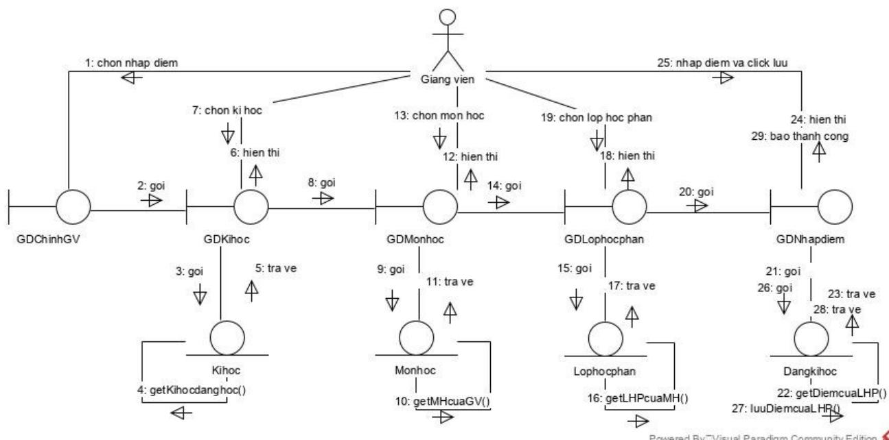  
Hình 3.12: Biểu đồ giao tiếp của modul nhập điểm

# c. Modul xem thống kê loại học lực

Hoạt động của biểu đồ trạng thái của modul được biểu diễn trong Hình 1.13:

Tại giao diện chính của nhân viên quản lí, khi chọn chức năng xem thống kê, hệ thống sẽ chuyển sang giao diện chọn kiểu thống kê • Tại giao diện chọn kiểu thống kê, chọn loại thống kê loại học lực, hệ thống chuyển snag giao diện thống kê loại học lực Tại giao diện thống kê loại học lực, khi chọn vào 1 loại học lực, hệ thống chuyển snag giao diện thống kê các sinh viên của loại học lực đã chọn Tại giao diện thống kê sinh viên, chọn một sinh viên, hệ thống chuyển sang giao diện liệt kê điểm các môn học của sinh viên đã chọn Tại giao diện điểm các môn học, chọn 1 môn học, hệ thống sẽ chuyển snag giao diện thông tin điểm chi tiết của môn học của sinh viên đã chọn. • Tại tất cả các giao diện, nếu chọn quay lại, hệ thống sẽ quay lại giao diện trước đấy.

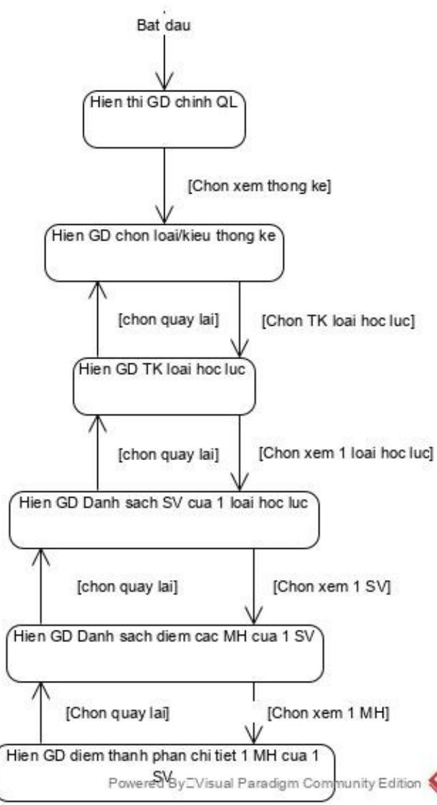  
Hình 3.13: Biểu đồ chuyển trạng thái của modul xem thống kê loại học lực

Kịch bản v.2 của modul diễn ra như sau (Hình 3.14):

1. Tại giao diện chính của nhân viên quản lí, sau khi đăng nhập, quản lí chọn xem thống kê.   
2. Lớp GDChinhQL gọi lớp GDChonTK.   
3. Lớp GDChonTK gọi lớp Kihoc yêu cầu tìm các kì học đã kết thúc   
4. Lớp Kihoc tìm các kì học đã kết thúc   
5. Lớp Kihoc trả kết quả lại cho lớp GDChonTK.   
6. Lớp GDChonTK hiển thị cho QL   
7. QL chọn thống kê loại học lực   
8. Lớp GDChonTK gọi lớp GDTKHocluc   
9. Lớp GDTKHocluc hiển thị cho QL   
10. QL chọn học kì muốn thống kê   
11. Lớp GDTKHocluc gọi lớp TKLoaihocluc yêu cầu lấy dữ liệu   
12. Lớp TKLoaihocluc lấy dữ liệu thống kê   
13. Lớp TKLoaihocluc trả kết quả cho lớp GDTKHocluc   
14. Lớp GDTKHocluc hiển thị cho QL   
15. QL chọn 1 loại học lực   
16. Lớp GDTKHocluc gọi lớp GDSVLoaihocluc   
17. Lớp GDSVLoaihocluc gọi lớp TKSinhvien yêu cầu lấy dữ liệu   
18. Lớp TKSinhvien lấy dữ liệu thống kê sinh viên của loại học lực   
19. Lớp TKSinhvien trả kết quả lại cho lớp GDSVLoaihocluc   
20. Lớp GDSVLoaihocluc hiển thị cho QL   
21. QL click 1 sinh viên   
22. Lớp GDSVLoaihocluc gọi lớp GDDiemSV   
23. Lớp GDDiemSV gọi lớp Dangkihoc yêu cầu lấy dữ liệu điểm   
24. Lớp Dangkihoc lấy điểm các môn học của sinh viên   
25. Lớp Dangkihoc trả kết quả cho lớp GDDiemSV   
26. Lớp GDDiemSV hiển thị cho QL   
27. QL chọn 1 môn học   
28. Lớp GDDiemSV gọi lớp GDDiemMHcuaSV   
29. Lớp GDDiemMHcuaSV gọi lớp Dangkihoc yêu cầu lấy điểm chi tiết   
30. Lớp Dangkihoc lấy thông tin điểm chi tiết của 1 môn học của sinh viên.   
31. Lớp Dangkihoc trả kết quả ;ại cho lớp GDDiemMHcuaSV   
32. Lớp GDDiemMHcuaSV hiển thị cho QL

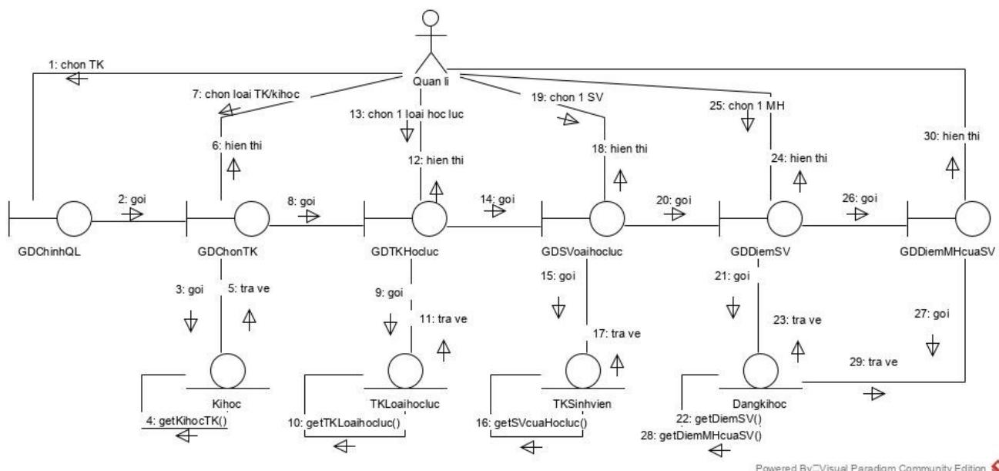  
Hình 3.14: Biểu đồ giao tiếp của modul thống kê theo loại học lực

# 3.3 BÀI TẬP

1. Lập danh sách glossary list cho ứng dụng của nhóm.   
2. Mô tả hệ thống bằng ngôn ngữ tự nhiên.   
3. Vẽ biểu đồ use case toàn hệ thống   
4. Vẽ biểu đồ use case cho modul cá nhân   
5. Viết kịch bản cho modul cá nhân   
6. Trích lớp thực thể và vẽ biểu đồ lớp thực thể cho toàn hệ thống   
7. Trích và vẽ biểu đồ lớp cho modul   
8. Vẽ biểu đồ trạng thái cho modul   
9. Viết kịch bản v.2 và vẽ biểu đồ giao tiếp cho modul.

# CHƯƠNG 4: THIẾT KẾ

# 4.1 THIẾT KẾ LỚP THỰC THỂ

# 4.1.1 Quy trình thực hiện

Đầu vào là biểu đồ lớp thực thể pha phân tích, tiến hành các bước như sau:

• Bước 1: Bổ sung thuộc tính id cho các lớp không kế thừa từ lớp khác   
• Bước 2: Bổ sung kiểu dữ liệu cho các thuộc tính. Kiểu dữ liệu phải tương ứng với kiểu dữ liệu của ngôn ngữ lập trình đã chọn.   
• Bước 3: Chuyển đổi các quan hệ association sang các dạng aggregation/composition, nếu có: Nếu hai lớp A và B liên kết (asociation) tạo ra lớp C thì có thể chuyển thành: ◦ A chứa C, C chứa B; ◦ hoặc B chứa C, C chứa A; ◦ hoặc C chứa A và B. Bước 4: Bổ sung thuộc tính đối tượng của các lớp thực thể, nếu có ◦ Giữa hai lớp có quan hệ aggregation/composition thì lớp chứa lớp còn lại nên khai báo tường minh thuộc tính có kiểu là lớp còn lại ◦ Số lượng (số ít/số nhiều) của thuộc tính phụ thuộc vào quan hệ số lượng giữa hai thực thể.

• Vẽ biểu đồ thực thể pha thiết kế

Lưu ý khi vẽ biểu đồ lớp thực thể pha thiết kế:

Tên lớp, tên thuộc tính nên đặt tên theo chuẩn code convention: Tên lớp nên bắt đầu bằng chữ hoa, tên thuộc tính nên bắt đầu bằng chữ thường. Có thể đặt tên gợi nhớ theo Tiếng Anh hoặc Tiếng Việt. Nếu Tiếng Việt thì không được có dấu, không được có dấu cách. Trong tên lớp/thuộc tính không được có các kí tự đặc biệt.   
• Thuộc tính cần khai báo tường minh kiểu dữ liệu.

# 4.1.2 Áp dụng

Bước 1

Các lớp được bổ sung thuộc tính id: trừ các lớp TK, Sinhvien, Thanhvien, Giaovu, Giangvien, NVQuanli, NVKhaothi.

# Bước 2

Thuộc tính của các lớp được bổ sung thuộc tính theo kiểu của ngôn ngữ lập trình Java.

Bước 3

• Quan hệ Sinhvien - Khoa -> SinhvienKhoa chuyển thành SinhvienKhoa chứa Sinhvien và Khoa.   
• Quan hệ Monhoc - Daudiem -> MonhocDaudiem chuyển thành MonhocDaudiem chứa Monhoc và Daudiem.   
• Quan hệ Namhoc - Hocki -> Kihoc chuyển thành Kihoc chứa Namhoc và Hocki   
• Quan hệ Monhoc - Kihoc -> MonhocKihoc chuyển thành MonhocKihoc chứa Monhoc và Kihoc.   
• Quan hệ SinhvienKhoa - Lophocphan -> Dangkihoc chuyển thành Dangkihoc chứa SinhvienKhoa và Lophocphan.   
• Quan hệ Dangkihoc - MonhocDaudiem -> Ketqua chuyển thành Dangkihoc chứa Ketqua, Ketqua chứa MonhocDaudiem.

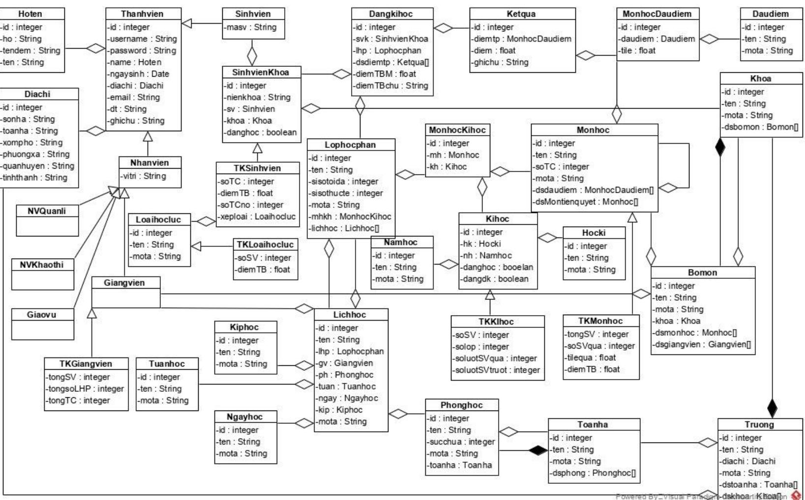  
Hình 4.1: Biểu đồ thiết kế lớp thực thể

Bổ sung các thuộc tính thành phần của quan hệ hợp thành/gắn chặt, ta thu được biểu đồ lớp thực thể pha thiết kế như trong Hình 4.1.

# 4.2 THIẾT KẾ CSDL

# 4.2.1 Quy trình thực hiện

Đầu vào là biểu đồ lớp thực thể pha thiết kế, tiến hành các bước như sau:

Bước 1: Với mỗi lớp thực thể, đề xuất một bảng dữ liệu tương ứng. Nên đặt tên bảng theo cách gợi nhớ tương ứng. Ví dụ, nếu lớp thực thể là Student, thì có thể đặt tên bảng tương ứng là tblStudent. • Bước 2: Với mỗi lớp thực thể, bỏ qua các thuộc tính kiểu đối tượng, lấy các thuộc tính kiểu cơ bản đưa sang làm thuộc tính của bảng tương ứng, và chuyển kiểu dữ liệu theo hệ quản trị cơ sở dữ liệu tương ứng. Bước 3: Xét quan hệ số lượng giữa các lớp thực thể, quan hệ số lượng giữa hai lớp thực thể cũng là quan hệ số lượng giữa hai bảng tương ứng với hai lớp đấy. Khi đó: ◦ Nếu hai bảng có quan hệ là 1-1 thì nên gộp lại, tuy nhiên, trong một số trường hợp đặc biệt thì có thể giữ nguyên. ◦ Nếu hai bảng có quan hệ 1-n thì giữ nguyên. ◦ Nếu hai bảng có quan hệ n-n thì nên bổ sung ít nhất một bảng trung gian để tách thành một số quan hệ 1-n. Thực tế, nếu đến thời điểm này vẫn còn quan hệ n-n giữa các bảng thì chứng tỏ trong biểu đồ lớp thực thể, vẫn còn quan hệ n-n, cho nên tốt nhất là nên quay lại sửa từ biểu đồ lớp thực thể pha phân tích.

• Bước 4: Bổ sung khóa cho các bảng: ◦ Khóa chính (Primary key - PK): Bảng nào có thuộc tính id thì thiết lập thuộc tính đó làm khóa chính cho bảng. ◦ Khóa ngoại (Foreinger key - FK): Nếu hai bảng tblA và tblB có quan hệ 1-n (1 tblA có n tblB), thì trong bảng tblB phải có khóa ngoài tham chiếu đến khóa chính của bảng tblA. Khó ngoại có thể đặt tên là aId hoặc idA.

• Bước 5: Loại bỏ các thuộc tính gây dư thừa dữ liệu. Có hai loại thuộc tính gây dư thừa dữ liệu:

◦ Thuộc tính bị trùng lặp: thường là thuộc tính của cùng một đối tượng, không phải thuộc tính khóa, nhưng xuất hiện ở hai bảng khác nhau.   
◦ Thuộc tính dẫn xuất: là thuộc tính có thể tính toán cơ học từ các thuộc tính khác trong CSDL. Ví dụ một số thuộc tính xuất thân từ các lớp thực thể thống kê thì thường là thuộc tính dẫn xuất. Sau khi loại bỏ các thuộc tính dư thừa, nếu xuất hiện bảng nào không còn thuộc tính nào nữa ngoài 1 khóa ngoại thì có thể loại bỏ luôn bảng đấy.

# 4.2.2 Áp dụng

# Bước 1

Mỗi lớp thực thể đề xuất bảng tương ứng:

Lớp Truong -> bảng tblTruong • Lớp Khoa -> bảng tblKhoa • Lớp Toanha -> bảng tblToanha

# Bước 2

Đưa thuộc tính không phải đối tượng của lớp thực thể thành thuộc tính của bảng tương ứng:

tblTruong có các thuộc tính: id, tên, mô tả • tblKhoa: id, tên, mô tả • tblToanha: id, tên, mô tả

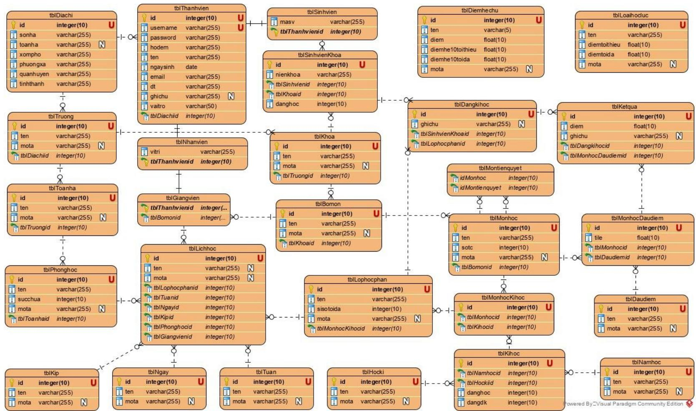  
Hình 4.2: Biểu đồ thiết kế CSDL

# Bước 3

Chuyến quan hệ số lượng giữa các lớp thực thể thành quan hệ số lượng giữa các bảng:

1 tblTruong - n tblKhoa • 1 tblTruong - n tblToanha • 1 tblToanha - n tblPhonghoc •

# Bước 4

Bổ sung các thuộc tính khóa. Khóa chính được thiết lập với thuộc tính id của các bảng tương ứng: trừ các bảng tblTK, tblSinhvien, tblThanhvien, tblGiangvien, tblNVQuanli, tblNVKhaothi, tblGiaovu.

Khóa ngoại được thiết lập cho các bảng:

• 1 tblTruong - n tblKhoa -> bảng tblKhoa có khóa ngoại tblTruongid • 1 tblTruong - n tblToanha -> bảng tblToanha có khóa ngoại tblTruongid • 1 tblToanha - n tblPhonghoc -> bảng tblPhonghoc có khóa ngoại tblToanhaid • ...

# Bước 5

Các thuộc tính dẫn xuất:

• điểm TBM, điểm TB chữ trong bảng tblDangkihoc • Các thuộc tính của các lớp thống kê -> loại bỏ hết các bảng thống kê.

Kết quả thu được CSDL toàn hệ thống được trình bày trong Hình 4.2.

# 4.3 THIẾT KẾ CHI TIẾT CHO MODUL

# 4.3.1 Thiết kế tĩnh

Đầu vào là biểu đồ lớp pha phân tích, tiến hành các bước như sau:

• Bước 1: Thiết kế giao diện cho các giao diện xuất hiện trong biểu đồ.   
• Bước 2: Đề xuất các lớp giao diện tương ứng với ngôn ngữ lập trình và nền tảng hệ thống. Ví dụ hệ thống chạy trên ứng dụng máy bàn, hệ thống chạy trên nền web, hệ thống chạy trên nền tảng thiết bị di động. ◦ Đề xuất tên lớp tương ứng. Có thể tách, gộp các lớp giao diện so với pha phân tích ◦ Thiết kế các thuộc tính đã liệt kê trong pha phân tích. ◦ Bổ sung các thuộc tính ẩn để chứa thông tin cần thiết để xử lí và trao đổi qua lại giữa các lớp giao diện.   
Bước 3: Đề xuất các lớp truy xuất dữ liệu (DAO), nếu có. ◦ Nên thiết kế dạng Interface hoặc kế thừa từ lớp trừu tượng để có thể dùng chung kết nối vào CSDL cho toàn hệ thống để tiết kiệm tài nguyên.   
◦ Thường, nếu lớp thực thể trong pha phân tích cần phương thức, hành động nào thì nên đề xuất lớp DAO cho lớp thực thể tương ứng, và gán phương thức đang xem xét cho lớp vùa đề xuất.   
◦ Với mỗi phương thức của lớp DAO, cần lưu ý thiết kế tên gợi nhớ, các tham số đầu vào, các tham số đầu ra.

• Bước 4: Bổ sung các lướp thực thể liên quan đến modul. Giữ nguyên quan hệ giữa các thực thể như các quan hệ giữa chúng trong biểu đồ lớp thực thể.

# a. Thiết kế tĩnh modul đăng kí học

Các giao diện cho chức năng này được thiết kế như trong Hình 4.3. Biểu đồ lớp thiết kế tương ứng trong Hình 4.4:

• Tầng giao diện có các trang jsp: gdChinhSV, gdChonnganh, gdDangki, gdChonMH, gdChonLHP, và doLuuDK. Tầng thao tác với dữ liệu có các lớp DAO, KihocDAO, SinhvienKhoaDAO, MonhocKihocDAO, LophocphanDAO, DangkihocDAO.

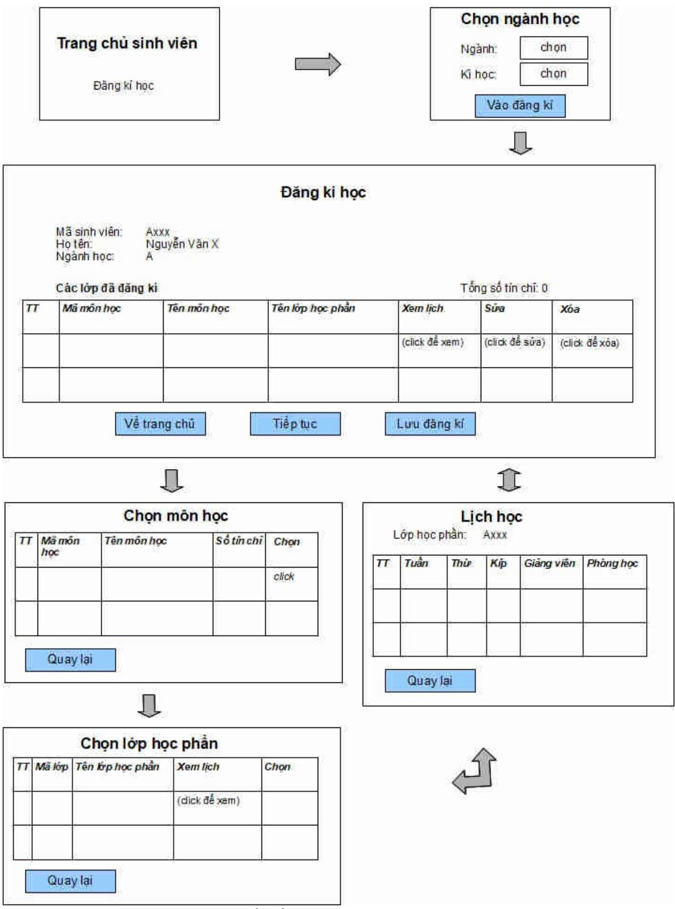  
Hình 4.3: Thiết kế giao diện cho modul đăng kí học

• Tầng thực thể gồm tất cả các thực thể liên quan.

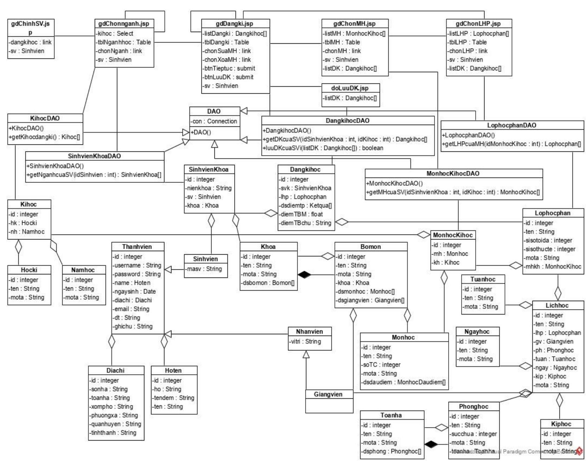  
Hình 4.4: Biểu đố lớp thiết kế modul đăng kí học

# b. Thiết kế tĩnh modul nhập điểm

Các giao diện cho chức năng nhập điểm được thiết kế như trong Hình 4.5. Biểu đồ lớp của modul được thiết kế như trong Hình 4.6:

• Các lớp giao diện là các trang jsp: gdChinhGV, gdMonhoc, gdLophocphan, gdDiem, doLuudiem. Các lớp tầng truy cập dữ liệu DAO: DAO, KihocDAO, MonhocKihocDAO, LophocphanDAO, DangkihocDAO.

• Các lớp thực thể liên quan

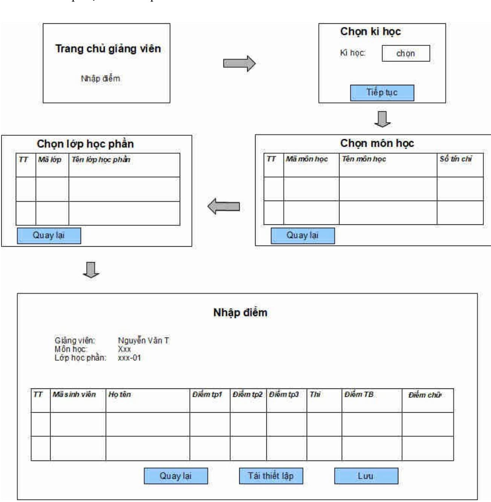  
Hình 4.5: Thiết kế giao diện modul nhập điểm

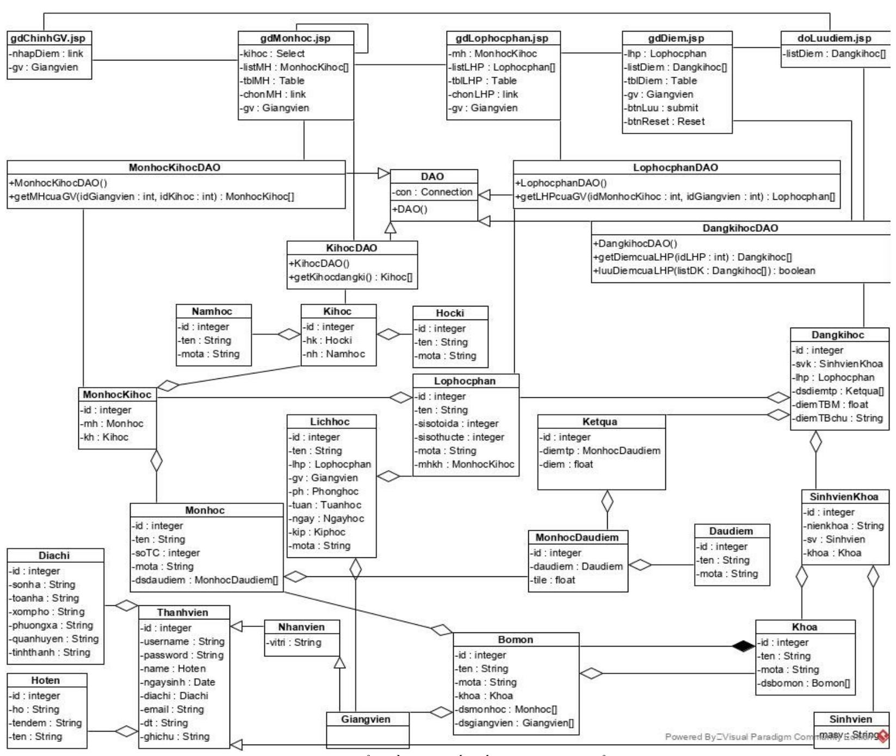  
Hình 4.6: Biểu đồ lớp thiết kế modul nhập điểm

# c. Thiết kế tĩnh modul xem thống kê loại học lực

Giao diện cho modul được thiết kế như trong Hình 4.7. Thiết kế biểu đồ lớp cho modul được trình bày trong Hình 4.8:

• Tầng giao diện gồm các trang jsp: gdChinhQL, gdChonTK, gdTKHocluc, gdTKHLSinhvien, gdTKDiemSV, gdDiemMHSV. Tầng xử lí truy cập dữ liệu: DAO, KihocDAO, TKHoclucDAO, TKSinhvienDAO, DangkihocDAO.

• Các lớp thực thể liên quan.

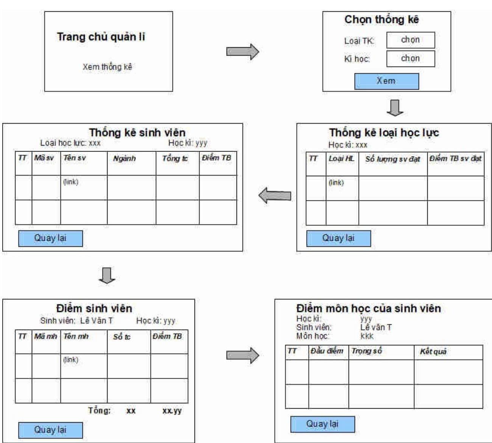  
Hình 4.7: Thiết kế giao diện cho modul xem thống kê loại học lực

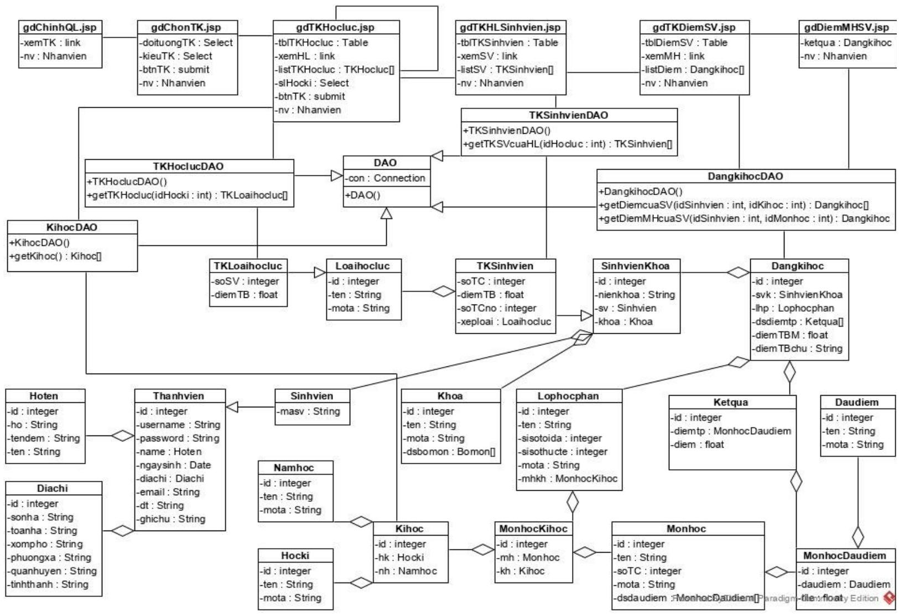  
Hình 4.8: Biểu đồ lớp thiết kế modul thống kê loại học lực

# 4.3.2 Thiết kế hoạt động

Quy trình tiến hành các bước như sau:

Bước 1: Vẽ biểu đồ hoạt động của modul: Mỗi hành động tương ứng một phương thức đã thiết kế trong biểu đồ lớp. Bước 2: Viết kịch bản phiên bản 3 và vẽ biểu đồ tuần tự cho modul. Những lưu ý về yêu cầu khác biệt của biểu đồ tuần tự pha thiết kế so với biểu đồ tuần tự pha phân tích: ◦ Tên các hành động của các lớp phải tương ứng với các phương thức đã thiết kế trong biểu đồ lớp thiết kế ◦ Biểu diễn được phạm vi và khoảng thởi gian hoạt động của từng phương thức trong biểu đồ.

Lưu ý là trong các kịch bản thiết kế cho tiết ở mục này, các bước đóng gói thuộc tính con của lớp thực thể đã được lược bỏ đi cho gọn.

# a. Thiết kế động modul đăng kí học

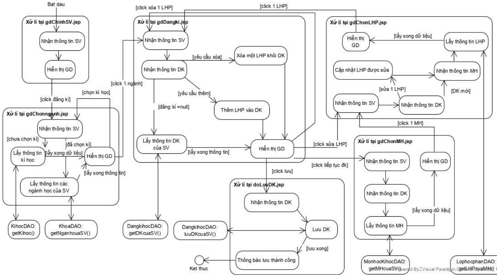  
Hình 4.9: Biểu đồ thiết kế hoạt động modul đăng kí học

Biểu đồ hoạt động của modul được trình bày trong Hình 4.9. Biểu đồ tuần tự được trình bày trong Hình 4.10, với kịch bản cụ thể như sau:

1. Tại giao diện chính của sinh viên, sau khi đăng nhập, sinh viên click chọn chức năng đăng   
kí học.   
2. Trang gdChinhSV.jsp gọi trang gdChonnganh.jsp.   
3. Trang gdChonnganh.jsp gọi lớp KhoaDAO yêu cầu tìm danh sách ngành học của sinh   
viên.   
4. Lớp KhoaDAO gọi hàm getNganhhoccuaSV()   
5. Hàm getNganhhoccuaSV() gọi lớp Khoa để đóng gói thông tin   
6. Lớp Khoa đóng gói thông tin thực thể   
7. Lớp Khoa trả kết quả về cho hàm getNganhhoccuaSV()   
8. Hàm getNganhhoccuaSV() trả kết quả cho trang gdChonnganh,jsp   
9. Trang gdChonnganh.jsp hiển thị cho sinh viên   
10. Sinh viên chọn 1 ngành học để đăng kí   
11. Trang gdChonnganh.jsp gọi trang gdDangki.jsp   
12. Trang gdDangki.jsp gọi lớp DangkihocDAO yêu cầu lấy thông tin đăng kí đã có của sinh   
viên   
13. Lớp DangkihocDAO gọi hàm getDangkicuaSV()   
14. Hàm getDangkicuaSV() gọi lớp Dangkihoc để đóng gói thông tin   
15. Lớp Dangkihoc đóng gói thông tin thực thể   
16. Lớp Dangkihoc trả kết quả lại cho hàm getDangkicuaSV()   
17. Hàm getDangkicuaSV() trả kết quả lại cho trang gdDangki.jsp   
18. Trang gdDangki.jsp hiển thị cho sinh viên.   
19. Sinh viên click tiếp tục để đăng kí.   
20. Trang gdDangki.jsp gọi trang gdChonMH.jsp   
21. Trang gdChonMH.jsp gọi lớp MonhocKihocDAO yêu cầu lấy danh sách môn học mà   
sinh viên được đăng kí   
22. Lớp MonhocKihocDAO gọi hàm getMonhoccuaSV()   
23. Hàm getMonhoccuaSV() thực hiện và gọi lớp MonhocKihoc để đóng gói   
24. Lớp MonhocKihoc đóng gói thông tin thực thể   
25. Lớp MonhocKihoc trả kết quả lại cho hàm getMonhoccuaSV()   
26. Hàm getMonhoccuaSV() trả kết quả lại cho trang gdChonMH.jsp   
27. Trang gdChonMH.jsp hiển thị cho sinh viên.   
28. Sinh viên click chọn 1 môn học   
29. Trang gdChonMH.jsp gọi trang gdChonLHP.jsp   
30. Trang gdChonLHP.jsp gọi lớp LophocphanDAO yêu cầu tìm danh sách lớp học phần của   
môn học đã chọn.   
31. Lớp LophocphanDAO gọi hàm getLHPcuaMH()   
32. Hàm getLHPcuaMH() thực hiện và gọi lớp Lophocphan   
33. Lớp Lophocphan đóng gói thông tin thực thể   
34. Lớp Lophocphan trả lại kết quả cho hàm getLHPcuaMH()   
35. Hàm getLHPcuaMH() trả kết quả cho trang gdChonLHP.jsp   
36. Trang gdChonLHP.jsp hiển thị cho sinh viên   
37. Sinh viên chọn 1 lớp học phần để đăng kí   
38. Trang gdChonLHP.jsp gọi lại trang gdDangki.jsp   
39. Trang gdDangki.jsp hiển thị cho sinh viên. (có thể lặp lại các bước 18 đến 38 cho đến khi   
đủ số tín chỉ tối thiểu)   
40. Sinh viên click chọn lưu đăng kí   
41. Trang gdDangki.jsp gọi trang doLuuDK.jsp   
42. Trang doLuuDK.jsp gọi lớp DangkihocDAO yêu cầu lưu   
43. Lớp DangkihocDAO gọi hàm luuDKcuaSV()   
44. Lớp DangkihocDAO trả lại lớp doLuuDK.jsp   
45. Lớp doLuuDK.jsp thông báo thành công   
46. Sinh viên click OK của thông báo   
47. Trang doLuuDK.jsp gọi lại trang gdChinhSV.jsp   
48. Trang gdChinhSV.jsp hiển thị.

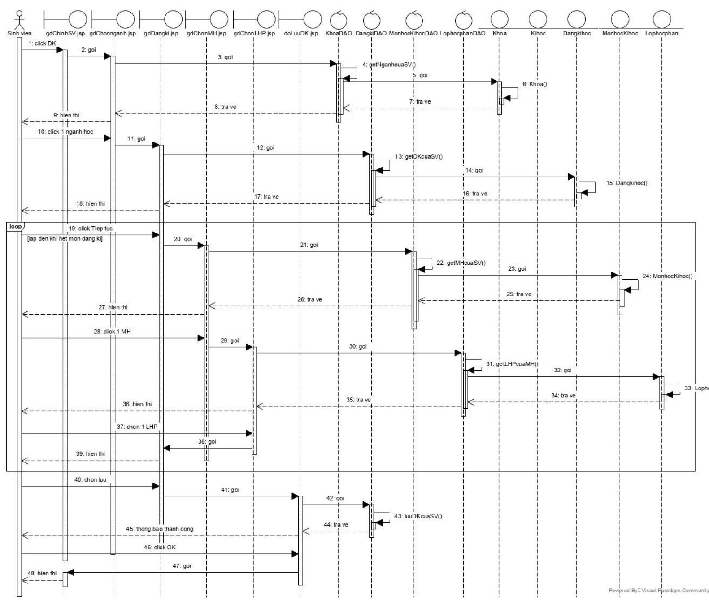  
Hình 4.10: Biểu đồ tuần tự thiết kế modul đăng kí học

# b. Thiết kế động modul nhập điểm

Biểu đồ hoạt động của modul nhập điểm được trình bày trong Hình 4.11. Tương ứng với biểu đồ tuần tự được trình bày trong Hình 4.12, kịch bản các hoạt động diễn ra như sau:

1. Tại trang gdChinhGV.jsp, sau khi đăng nhập, giảng viên chọn chức năng nhập điểm   
2. Trang gdChinhGV.jsp gọi trang gdMonhoc.jsp   
3. Trang gdMonhoc.jsp gọi lớp KihocDAO yêu cầu lấy thông tin các học kì đang học.   
4. Lớp KihocDAO gọi hàm getKihoc()   
5. Hàm getKihoc() thục hiện và gọi lớp Kihoc đóng gói thông tin   
6. Lớp Kihoc đóng gói thông tin thực thể   
7. Lớp Kihoc trả kết quả cho hàm getKihoc()   
8. Hàm getKihoc() trả kết quả cho trang gdMonhoc.jsp   
9. Trang gdMonhoc.jsp hiển thị cho giảng viên   
10. Giảng viên chọn 1 kì học   
11. Trang gdMonhoc.jsp submit gọi chính nó xử lí   
12. Trang gdMonhoc.jsp gọi lớp MonhocKihocDAO yêu cầu lấy danh sách môn học do giảng   
viên dạy trong kì được chọn.   
13. Lớp MonhocKihocDAO gọi hàm getMHcuaGV()   
14. Hàm getMHcuaGV() thực hiện và gọi lớp MonhocKihoc để đóng gói thông tin   
15. Lớp MonhocKihoc đóng gói thông tin thực thể   
16. Lớp MonhocKihoc trả kết quả lại cho hàm getMHcuaGV()   
17. Hàm getMHcuaGV() trả kết quả lại cho trang gdMonhoc.jsp   
18. Trang gdMonhoc.jsp hiển thị cho giảng viên   
19. Giảng viên click chọn 1 môn học   
20. Trang gdMonhoc.jsp gọi trang gdLophocphan.jsp   
21. Trang gdLophocphan.jsp gọi lớp LophocphanDAO yêu cầu lấy danh sách các lớp học   
phần của môn học đã chọn, do giảng viên đó giảng dạy   
22. Lớp LophocphanDAO gọi hàm getLHPcuaGV()   
23. Hàm getLHPcuaGV() thực hiện và gọi lớp Lophocphan để đóng gói thông tin   
24. Lớp Lophocphan đóng gói thông tin thực thể   
25. Lớp Lophocphan trả kết quả lại cho hàm getLHPcuaGV()   
26. Hàm getLHPcuaGV() trả kết quả lại cho trang gdLophocphan.jsp

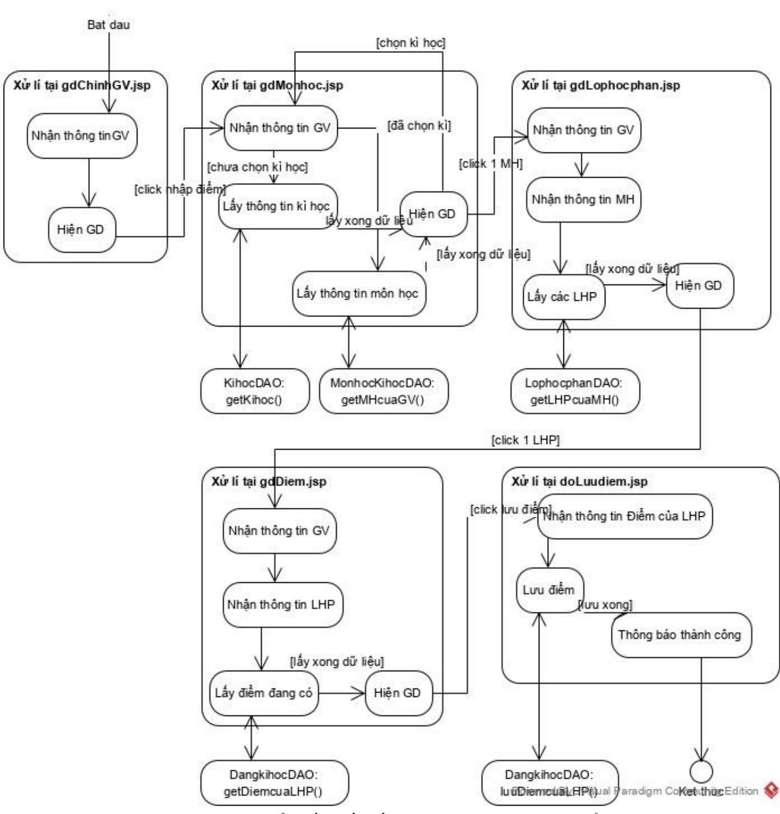  
Hình 4.11: Biểu đồ thiết kế hoạt động modul nhập điểm

# 27. Trang gdLophocphan.jsp hiển thị cho giảng viên

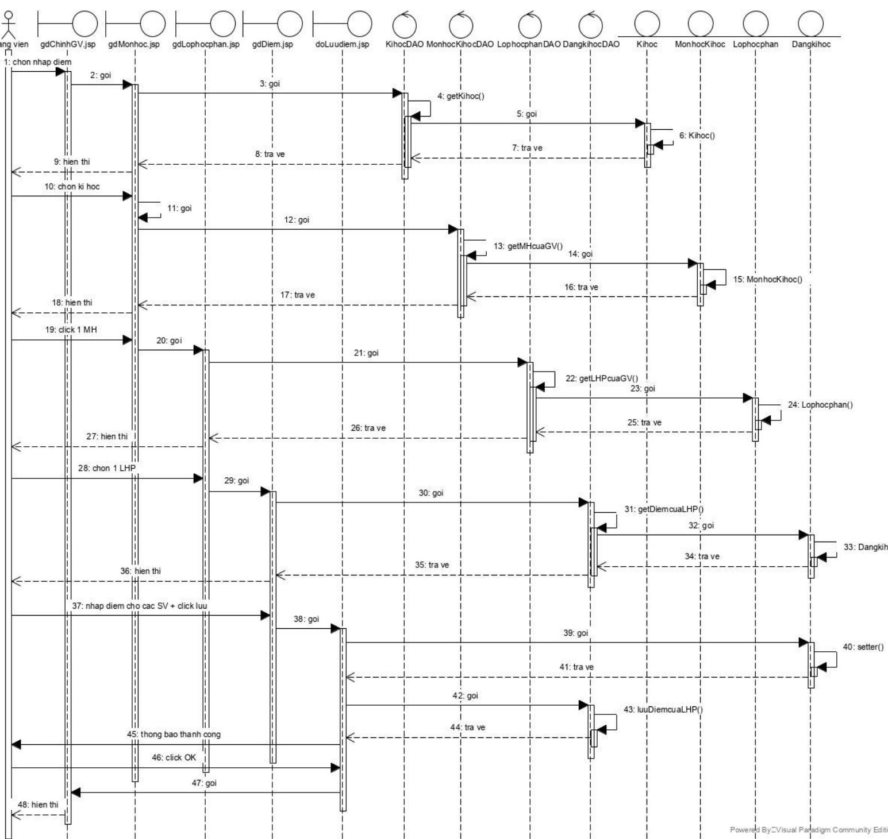  
Hình 4.12: Biểu đồ tuần tự thiết kế modul nhập điểm

28. Giảng viên click chọn 1 lớp học phần.

29. Trang gdLophocphan.jsp gọi trang gdDiem.jsp   
30. Trang gdDiem.jsp gọi lớp DangkihocDAO yêu cầu lấy danh sách sinh viên đăng kí và kết quả đã có của lớp học phần đã chọn

31. Lớp DangkihocDAO gọi hàm getDiemcuaLHP()   
32. Hàm getDiemcuaLHP() thực hiện và gọi lớp Dangkihoc để đóng gói thông tin   
33. Lớp Dangkihoc đóng gói thông tin thực thể   
34. Lớp Dangkihoc trả kết quả cho hàm getDiemcuaLHP()   
35. Hàm getDiemcuaLHP() trả kết quả cho trang gdDiem.jsp   
36. Trang gdDiem.jsp hiển thị cho giảng viên   
37. Giảng viên nhập các đầu điểm cho sinh viên và click lưu   
38. Trang gdDiem.jsp gọi doLuudiem.jsp   
39. Trang doLuudiem.jsp gọi lớp Dangkihoc yêu cầu set lại accs thuộc tính điểm mới nhập.   
40. Lớp Dangkihoc gọi các hàm set thuộc tính điểm tương ứng   
41. Lớp Dangkihoc trả đối tượng về cho trang doLuudiem.jsp   
42. Trang doLuudiem.jsp gọi lớp DangkihocDAO yêu cầu lưu điểm cho lớp học phần   
43. Lớp DangkihocDAO gọi hàm luuDiemcuaLHP()   
44. Lớp DangkihocDAO trả kết quả lại cho trang doLuudiem.jsp   
45. Trang doLuudiem.jsp hiện thống báo lưu thành công   
46. Giảng viên click vào OK của thông báo   
47. Trang doLuudiem.jsp gọi trang gdChinhGV.jsp   
48. Trang gdChinhGV.jsp hiển thị

# c. Thiết kế động cho modul xem thống kê loại học lực

Biểu đồ hoạt động của modul xem thống kê loại học lực được trình bày trong Hình 4.13. Tương ứng với biểu đồ tuần tự được trình bày trong Hình 4.14, kịch bản các hoạt động diễn ra như sau:

1. Tại trang gdChinhQL.jsp, sau khi đăng nhập, nhân viên quản lí chọn chức năn   
thống kê   
2. Trang gdChinhQL.jsp gọi trang gdChonTK.jsp   
3. Trang gdChonTK.jsp hiển thị cho NV quản lí   
4. NV quản lí click xem thống kê loại học lực   
5. Trang gdChonTK.jsp gọi trang gdTKHocluc.jsp   
6. Trang gdTKHocluc.jsp gọi lớp KihocDAO yêu cầu lấy danh sách các kì đã học   
7. Lớp KihocDAO gọi hàm getKihoc()   
8. Hàm getKihoc() thực hiện và gọi lớp Kihoc đóng gói thông tin   
9. Lớp Kihoc đóng gói thông tin thực thể.   
10. Lớp Kihoc trả kết quả về cho hàm getKihoc()   
11. Hàm getKihoc() trả kết quả về cho trang gdTKHocluc.jsp   
12. Trang gdTKHocluc.jsp hiển thị cho NV quản lí   
13. NV quản lí click chọn 1 kì học để xem thống kê   
14. Trang gdTKHocluc.jsp submit vào chính nó để xử lí   
15. Trang gdTKHocluc.jsp gọi lớp TKLoaihoclucDAO yêu cầu lấy thông tin thống kê   
16. Lớp TKLoaihoclucDAO gọi hàm getTKHocluc()   
17. Hàm getTKHocluc() thực hiện và gọi lớp TKLoaihocluc đóng gói thông tin   
18. Lớp TKLoaihocluc đóng gói thông tin thực thể   
19. Lớp TKLoaihocluc trả kết quả cho hàm getTKHocluc()   
20. Hàm getTKHocluc() trả kết quả cho trang gdTKHocluc.jsp   
21. Trang gdTKHocluc.jsp hiển thị cho NV quản lí   
22. NV quản lí click chọn 1 loại học lực   
23. Trang gdTKHocluc.jsp gọi trang gdTKHLSinhvien.jsp   
24. Trang gdTKHLSinhvien.jsp gọi lớp TKSinhvienDAO yêu cầu lấy thông tin thống kê   
25. Lớp TKSinhvienDAO gọi hàm getTKSVcuaHL()   
26. Hàm getTKSVcuaHL() thwucj hiện và gọi lớp TKSinhvien đóng gói thông tin   
27. Lớp TKSinhvien đóng gói thông tin thực thể   
28. Lớp TKSinhvien trả kết quả lại cho hàm getTKSVcuaHL()   
29. Hàm getTKSVcuaHL() trả kết quả lại cho trang gdTKHLSinhvien.jsp   
30. Trang gdTKHLSinhvien.jsp hiển thị cho NV quản lí   
31. NV quản lí click 1 sinh viên   
32. Trang gdTKHLSinhvien.jsp gọi trang gdTKDiemSV.jsp   
33. Trang gdTKDiemSV.jsp gọi lớp DangkihocDAO yêu cầu lấy thông tin điểm các môn học   
của sinh viên   
34. Lớp DangkihocDAO gọi hàm getDiemcuaSV()   
35. Hàm getDiemcuaSV thực hiện và gọi lớp Dangkihoc đóng gói thông tin   
36. Lớp Dangkihoc đóng gói thông tin thực thể   
37. Lớp Dangkihoc trả kết quả cho hàm getDiemcuaSV()   
38. Hàm getDiemcuaSV() trả kết quả lại cho trang gdTKDiemSV.jsp   
39. Trang gdTKDiemSV.jsp hiển thị cho NV quản lí   
40. NV quản lí click vào một môn học   
41. Trang gdTKDiemSV.jsp gọi trang gdDiemMHSV.jsp   
42. Trang gdDiemMHSV.jsp gọi lớp DangkihocDAO yêu cầu lấy thông tin điểm chi tiết của   
môn học   
43. Lớp DangkihocDAO gọi hàm getDiemMHcuaSV()   
44. Hàm getDiemMHcuaSV() thực hiện và gọi lớp Dangkihoc đóng gói thông tin   
45. Lớp Dangkihoc đóng gói thông tin thực thể   
46. Lớp Dangkihoc trả lại cho hàm getDiemMHcuaSV()   
47. Hàm getDiemMHcuaSV() trả kết quả cho trang gdDiemMHSV.jsp   
48. Trang gdDiemMHSV.jsp hiển thị cho NV quản lí

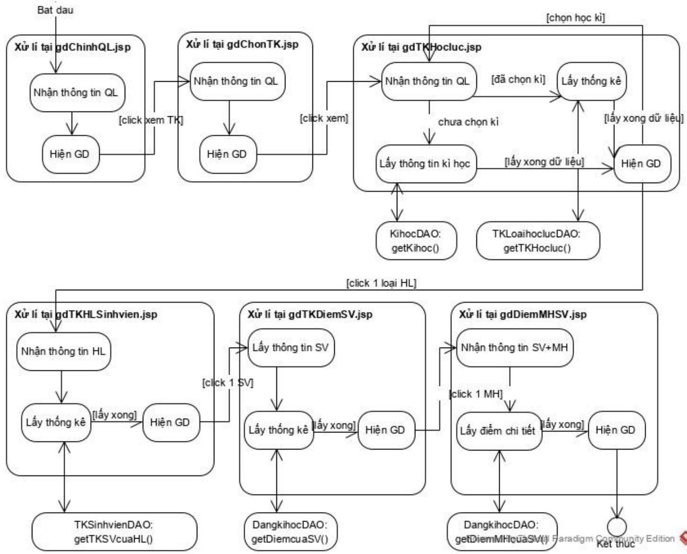  
Hình 4.13: Biểu đồ thiết kế hoạt động modul xem thống kê loại học lực

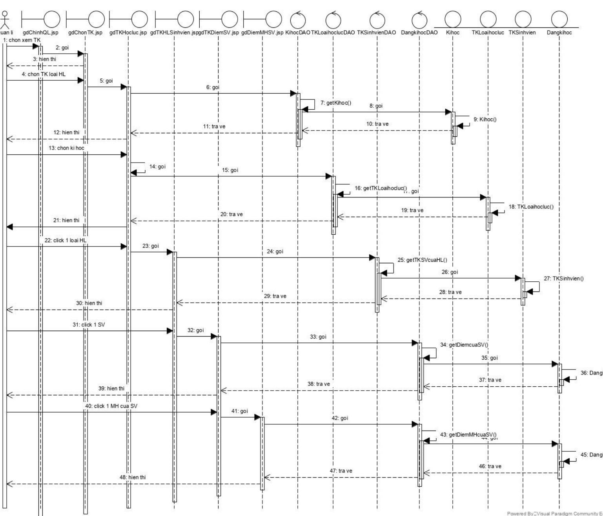  
Hình 4.14: Biểu đồ tuần tự thiết kế modul xem thống kê loại học lực

# 4.3.3 Thiết kế triển khai

Quy trình tiến hành các bước như sau:

• Bước 1: Vẽ biểu đồ triển khai của hệ thống: Các máy sẽ cài đặt hệ thống. Mỗi máy đặt các modul hay package nào. Các modul/package tương tác với nhau thế nào.

Áp dụng cho hệ thống, các package được thiết kế theo cấu trúc trong Hình 4.15:

Các lớp thực thể đặt chung trong gói model   
• Các lớp DAO đặt chung trong gói dao. Các trang jsp để trong gói view. Gói view được chia nhỏ thành các gói nhỏ hơn tương ứng với các giao diện cho các người dùng khác nhau: ◦ Các trang thao tác cho đăng nhập, quản lí mật khẩu đặt trong gói thanhvien. ◦ Các trang cho chức năng liên quan đến giảng viên đặt trong gói giangvien ◦ Các trang cho chức năng liên quan đến nhân viên quản lí đặt trong gói quanli ◦ Các trang cho chức năng liên quan đến sinh viên đặt trong gói sinhvien

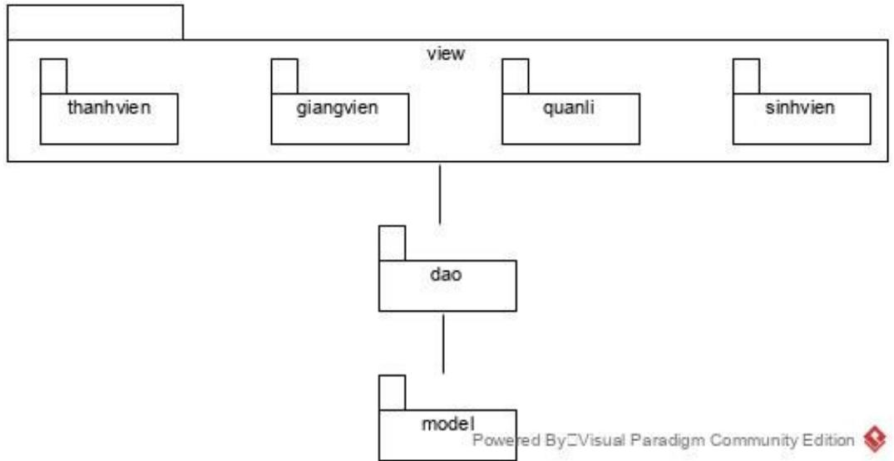  
Hình 4.15: Biểu đồ thiết kế gói của hệ thống

# 4.4 CÂU HỎI ÔN TẬP

1. Thiết kế thực thể cho toàn hệ thống   
2. Thiết kế CSDL cho toàn hệ thống   
3. Thiết kế giao diện liên quan cho modul   
4. Thiết kế biểu đồ lớp cho modul   
5. Thiết kế biểu đồ hoạt động cho modul   
6. Thiết kế biểu đồ tuần tự cho modul   
7. Thiết kế biểu đồ gói cho toàn hệ thống

# CHƯƠNG 5: CÀI ĐẶT HỆ THỐNG

# 5.1 TỔ CHỨC DỰ ÁN

Dự án trong Eclipse được tổ chức như Hình 5.1:

Các lớp thực thể và điều khiển để trong thư mục \java resources, chia nhỏ thành các package con tương ứng: model, dao.   
• Các trang jsp để trong thư mục \Web content, phần xử lí đăng nhập để ở thu mục chung này, các phần xử lí riêng có thể để vào các thư mục con. Ví dụ, phần xử lí các chức năng của sinh viên thì để vào thư mục con \sv   
• Các thư viện (file .jar) của kết nối CSDL, Junit thì add vào phần libraries của java resources, đồng thời copy vào thư mục \Web content\WEB-INF\lib

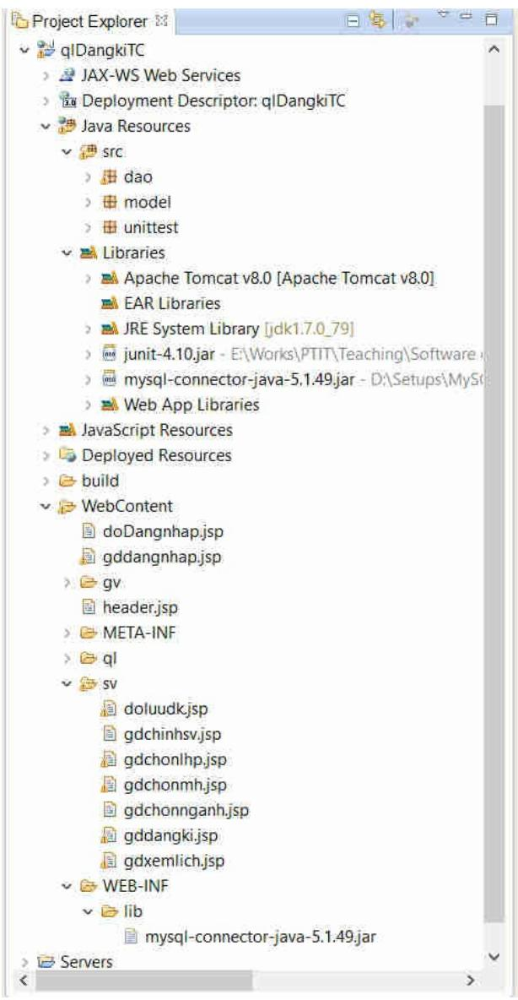  
Hình 5.1: Tổ chức thư mục dự án web trong Eclipse

# 5.2 CÀI ĐẶT CÁC MODUL

Nội dung phần này sẽ trình bày cài đặt 3 chức năng: sinh viên đăng kí, giảng viên nhập điểm LHP, và quản lí xem thống kê loại học lực. Tuy nhiên:

Phần thực thể không trình bày code ở đây và coi như bài tập đơn giản cho người đọc. Chức năng nhập điểm và xem thống kê chỉ được cài đặt phần DAO, phần JSP cũng coi như là bài tập cho người đọc. Riêng chức năng sinh viên đăng kí được trình bày đầy đủ DAO và các trang JSP. Phần JSP chỉ sử dụng JSP đơn giản nhất mà chưa áp dụng framwork nào vào với mục đích chính là minh họa nghiệp vụ. Cho nên cũng chưa có xử lí html/css. Người đọc có thể áp dụng thêm vào để tăng tính thẩm mỹ của phần giao diện. Người đọc cần chỉnh sửa thông tin kết nối vào CSDL (dbUrl và dbClass, username, password) trong lớp DAO cho phù hợp với cấu hình CSDL trên máy mình Nếu người đọc đổi tên bảng/tên cột trong CSDL thì phải cập nhật tương ứng trong các câu lệnh SQL. Các lớp DAO có sử dụng store procedure thì ngay sau code của lớp sẽ là code của các Store Procedure tương ứng được gọi trong lớp đó.

# 5.2.1 Chức năng đăng kí học

# Lớp DAO.java

package dao;   
import java.sql.Connection;   
import java.sql.DriverManager;   
public class DAO {   
public static Connection con; public DAO(){ if(con == null){ String dbUrl = "jdbc:mysql://localhost:3307/qldktc? autoReconnect=true&useSSL=false"; String dbClass = "com.mysql.jdbc.Driver"; try { Class.forName(dbClass); con = DriverManager.getConnection (dbUrl, "root", "Cnpm@2020?"); }catch(Exception e) { e.printStackTrace(); } }

<table><tr><td>&gt; }</td></tr></table>

# Lớp ThanhvienDAO.java

package dao;   
import java.sql.CallableStatement;   
import java.sql.ResultSet;   
import model.Hoten;   
import model.Thanhvien;

public class ThanhvienDAO extends DAO{ public ThanhvienDAO() { super(); // TODO Auto-generated constructor stub }

public boolean kiemtraDangnhap(Thanhvien tv){ boolean kq = false; if(tv.getUsername().contains("true") || tv.getUsername().contains("=")|| tv.getPassword().contains("true") || tv.getPassword().contains("=")) return false; String sql = "{call kiemtraDN(?,?)}"; //su dung stored procedure try{ CallableStatement cs = con.prepareCall(sql); cs.setString(1,tv.getUsername()); cs.setString(2,tv.getPassword()); ResultSet rs = cs.executeQuery(); if(rs.next()){ tv.setId(rs.getInt("id")); tv.setVaitro(rs.getString("vaitro")); //hoten Hoten ht = new Hoten(); ht.setHodem(rs.getString("hodem")); ht.setTen(rs.getString("ten")); tv.setHoten(ht); kq = true; } }catch(Exception e){ e.printStackTrace(); kq = false; } return kq; } }

CREATE DEFINER=\`root\`@\`localhost\` PROCEDURE \`kiemtraDN\`(IN usr VARCHAR(255), IN pwd   
VARCHAR(255))   
BEGIN SELECT \* FROM tblthanhvien WHERE username = usr AND password = pwd;   
END

# Lớp KihocDAO.java

package dao;   
import java.sql.CallableStatement;   
import java.sql.ResultSet;   
import java.util.ArrayList;   
import model.Hocki;   
import model.Kihoc;   
import model.Namhoc;   
public class KihocDAO extends DAO{ public KihocDAO() { super(); // TODO Auto-generated constructor stub } /\*\* \* Lay danh sach cac hoc ki dang mo cho sinh vien chon dang ki hoc \* @return danh sach ki hoc dang mo dang ki \*/ public ArrayList<Kihoc> getKihocdangki(){ ArrayList<Kihoc> kq=null; String sql = "{call kiDangDK()}"; //su dung stored procedure try{ CallableStatement cs = con.prepareCall(sql); ResultSet rs = cs.executeQuery(); while(rs.next()){ if(kq == null) kq = new ArrayList<Kihoc>(); Kihoc kh = new Kihoc(); kh.setId(rs.getInt("idkihoc")); //nam hoc Namhoc nh = new Namhoc(); nh.setId(rs.getInt("idnamhoc")); nh.setTen(rs.getString("namhoc")); kh.setNamhoc(nh); //hoc ki Hocki hk = new Hocki();

hk.setId(rs.getInt("idhocki")); hk.setTen(rs.getString("hocki")); kh.setHocki(hk); kq.add(kh); } }catch(Exception e){ e.printStackTrace(); kq = null; } return kq; } } CREATE DEFINER=\`root\`@\`localhost\` PROCEDURE \`kiDangDK\`() BEGIN SELECT a.id as idnamhoc, a.ten as namhoc, b.id as idhocki, b.ten as hocki, c.id as idkihoc FROM tblnamhoc a, tblhocki b, tblkihoc c WHERE c.idnamhoc = a.id AND c.idhocki = b.id AND c.dangdk = 1; END

# Lớp SinhvienKhoaDAO.java

package dao;   
import java.sql.CallableStatement;   
import java.sql.ResultSet;   
import java.util.ArrayList;   
import model.Hoten;   
import model.Khoa;   
import model.Sinhvien;   
import model.SinhvienKhoa;   
public class SinhvienKhoaDAO extends DAO{ public SinhvienKhoaDAO() { super(); // TODO Auto-generated constructor stub } /\*\* \* lay danh sach cac khoa/nganh ma sinh vien dang hoc de chon dang ki hoc \* @param idSV: id cua sinh vien \* @return danh sach cacs doi tuong SinhvienKhoa \*/ public ArrayList<SinhvienKhoa> getNganhcuaSV(int idSV){ ArrayList<SinhvienKhoa> kq = null; String sql = "{call nganhcuaSV(?)}";// su dung stored procedure try{ CallableStatement cs = con.prepareCall(sql);

<table><tr><td colspan="2">ResultSet rs = cs.executeQuery(); while(rs.next()){ if(kq == null) kq = new ArrayList&lt;SinhvienKhoa&gt;(); SinhvienKhoa svk = new SinhvienKhoa(); svk.setId(rs.getInt(&quot;idsvk&quot;)); // sinh vien Sinhvien sv = new Sinhvien(); sv.setId(rs.getInt(&quot;id&quot;)); sv.setMasv(rs.getString(&quot;masv&quot;)); //hoten Hoten ht = new Hoten(); ht.setHodem(rs.getString(&quot;hodem&quot;));</td></tr><tr><td colspan="2">ht.setTen(rs.getString(&quot;ten&quot;)); sv.setHoten(ht); svk.setSinhvien(sv); //khoa Khoa k = new Khoa(); k.setId(rs.getInt(&quot;idkhoa&quot;)); k.setTen(rs.getString(&quot;tenkhoa&quot;)); svk.setKhoa(k); kq.add(svk); } }catch(Exception e){ e.printStackTrace(); kq = null; } return kq; } } CREATE DEFINER= root @ localhost PROCEDURE *nganhcuaSV (IN idSV INT)</td></tr><tr><td colspan="2">BEGIN SELECT a.id as idkhoa, a.ten as tenkhoa, b.id as idsvk, c.masv, d.* FROM tblkhoa a, tblsinhvienkhoa b, tblsinhvien c, tblthanhvien d WHERE b.idsinhvien = idSV AND b.idkhoa = a.id AND b.danghoc = 1 AND c.idthanhvien =idSV AND d.id = idSV;</td></tr></table>

# Lớp MonhocKihocDAO.java

package dao;   
import java.sql.CallableStatement;   
import java.sql.ResultSet;   
import java.util.ArrayList;   
import model.Kihoc;   
import model.Monhoc;   
import model.MonhocKihoc;   
public class MonhocKihocDAO extends DAO{ public MonhocKihocDAO() { super(); // TODO Auto-generated constructor stub } /\*\* \* Lay danh sach cac mon hoc duoc day trong hoc ki @idKihoc \* @param idSVK: id cua sinh vien theo khoa/nganh hoc \* @param idKihoc: id cua ki hoc dang chon \* @return danh sach cac mon hoc duoc phep \*/ public ArrayList<MonhocKihoc> getMHcuaSV(int idSVK, int idKihoc){ ArrayList<MonhocKihoc> kq = null; String sql = "{call MHmaSVduocDK(?,?)}";// su dung stored procedure try{ CallableStatement cs = con.prepareCall(sql); cs.setInt(1, idSVK); cs.setInt(2, idKihoc); ResultSet rs = cs.executeQuery(); while(rs.next()){ if(kq == null) kq = new ArrayList<MonhocKihoc>(); MonhocKihoc mhkh = new MonhocKihoc(); mhkh.setId(rs.getInt("idmhkh")); //mon hoc Monhoc mh = new Monhoc(); mh.setId(rs.getInt("idmh")); mh.setTen(rs.getString("tenmh")); mh.setSoTC(rs.getInt("sotc")); mhkh.setMonhoc(mh); //ki hoc Kihoc kh = new Kihoc(); kh.setId(idKihoc); mhkh.setKihoc(kh); kq.add(mhkh); } }catch(Exception e){ e.printStackTrace(); kq = null; } return kq; }

<table><tr><td>}</td></tr><tr><td>CREATE DEFINER=root @ localhost PROCEDURE MHmaSVduocDK (IN idSVK INT, IN idKihoc INT) BEGIN</td></tr></table>

# Lớp LophocphanDAO.java

<table><tr><td>package dao;</td><td></td></tr><tr><td></td><td>import java.sql.CallableStatement;</td></tr><tr><td>import java.sql.ResultSet;</td><td></td></tr><tr><td>import java.util.ArrayList;</td><td></td></tr><tr><td>import model.Kihoc;</td><td></td></tr><tr><td>import model.Lophocphan;</td><td></td></tr><tr><td>import model.Monhoc;</td><td></td></tr><tr><td>import model.MonhocKihoc;</td><td></td></tr><tr><td>public class LophocphanDAO extends DAO{</td><td></td></tr><tr><td>public LophocphanDAO() {</td><td></td></tr><tr><td></td><td></td></tr><tr><td></td><td>super();</td></tr><tr><td>}</td><td>// ToDo Auto-generated constructor stub</td></tr></table>

<table><tr><td>/** * lay danh sach cac lop hoc phan cua @idmHKH ma sinh vien @idsvK * @param idmHKH: id cua mon hoc ki hoc * @param idsvK: id cua sinh vien khoa * @return: danh sach lop hoc phan con co the dang ki duoc */ public ArrayList&lt;Lophocphan&gt; getLHPchoSVdangki(int idSVK, int idMHKH){ ArrayList&lt;Lophocphan&gt; kq = null; String sql = &quot;{call LHPchoSVdangki(?,?)}&quot;;// su dung stored procedure try{ CallableStatement cs = con.prepareCall(sql); cs.setInt(1, idsvK); cs.setInt(2, idmHKH); ResultSet rs = cs.executeQuery(); while(rs.next()){ if(kq == null) kq = new ArrayList&lt;Lophocphan&gt;(); Lophocphan 1hp = new Lophocphan(); 1hp.setId(rs.getInt(&quot;id&quot;)); 1hp.setTen(rs.getString(&quot;ten&quot;)); Ihp.setSisotoida(rs.getInt(&quot;sisotoida&quot;)); 1hp.setSisothucte(rs.getInt(&quot;sisothuc&quot;)); //monhockihoc MonhocKihoc mhkh = new MonhocKihoc(); mhkh.setId(idMHKH); //monhoc Monhoc mh = new Monhoc();</td></tr></table>

int)   
BEGIN DECLARE idKH INT; SELECT idkihoc INTO idKH FROM tblmonhockihoc WHERE id = idMHKH; DROP TEMPORARY TABLE IF EXISTS slotdadangki; CREATE TEMPORARY TABLE slotdadangki AS SELECT a.idtuan, a.idngay, a.idkip FROM tbllichhoc a, tbllophocphan b, tbldangkihoc c, tblmonhockihoc d WHERE d.idkihoc = idKH AND b.idmonhockihoc = d.id AND a.idlophocphan = b.id AND c.idlophocphan = b.id AND c.idsinhvienkhoa = idSVK; DROP TEMPORARY TABLE IF EXISTS lhpchuaday; CREATE TEMPORARY TABLE lhpchuaday AS SELECT a.id, a.ten, a.sisotoida, a.idmonhockihoc, COUNT(e.id) as sisothuc FROM tbllophocphan a LEFT JOIN tbldangkihoc e ON e.idlophocphan = a.id WHERE a.idmonhockihoc = idMHKH GROUP BY a.id HAVING a.sisotoida > sisothuc; SELECT a.\*, b.idkihoc, d.id as idmh, d.ten as tenmh, d.sotc FROM lhpchuaday a, tblmonhockihoc b, tblmonhoc d WHERE a.id NOT IN (SELECT b.id FROM tbllichhoc b, slotdadangki c WHERE b.idtuan = c.idtuan AND b.idngay = c.idngay AND b.idkip = c.idkip) AND b.id = a.idmonhockihoc AND d.id = b.idmonhoc;   
END

# Lớp LichhocDAO.java

package dao;   
import java.sql.CallableStatement;   
import java.sql.ResultSet;   
import java.util.ArrayList;   
import model.Giangvien;   
import model.Hoten;   
import model.Kiphoc;   
import model.Lichhoc;   
import model.Lophocphan;   
import model.Ngayhoc;   
import model.Phonghoc;   
import model.Tuanhoc;

<table><tr><td>public class LichhocDAO extends DAO{</td></tr><tr><td>public LichhocDAO() { super();</td></tr><tr><td>// ToDo Auto-generated constructor stub }</td></tr><tr><td>/**</td></tr><tr><td colspan="2">Ngayhoc ng = new Ngayhoc(); ng.setId(rs.getInt("idngay")); ng.setTen(rs.getString("tenngay")); 1h.setNgayhoc(ng); //Kip hoc Kiphoc ki = new Kiphoc(); ki.setId(rs.getInt("idkip")); ki.setTen(rs.getString("tenkip")); 1h.setKiphoc(ki); kq.add(1h); } }catch(Exception e){ e.printStackTrace(); kq = null; } return kq; }</td></tr><tr><td colspan="2">} CREATE DEFINER=root @ localhost PROCEDURE LichLHP (IN idLHP int) BEGIN SELECT a.*, b.ten as tengv, b.hodem as hodemgv, c.ten as tenphong, d.ten as tentuan, e.ten as tenngay, f.ten as tenkip FRoM tbllichhoc a, tblthanhvien b, tblphonghoc c, tbltuan d, tblngay e, tblkip f WHERE a.idlophocphan = idLHP AND b.id = a.idgiangvien AND c.id = a.idphonghoc AND d.id = a.idtuan</td></tr></table>

# Lớp DangkihocDAO.java

<table><tr><td>package dao;</td><td></td></tr><tr><td></td><td>import java.sql.CallableStatement;</td></tr><tr><td></td><td>import java.sql.PreparedStatement;</td></tr><tr><td>import java.sql.ResultSet;</td><td></td></tr><tr><td>import java.util.ArrayList;</td><td></td></tr><tr><td>import n</td><td>model.Dangkihoc;</td></tr><tr><td>import model.Daudiem;</td><td></td></tr><tr><td>import n</td><td>model.Hoten;</td></tr><tr><td>import</td><td>model.Ketqua;</td></tr><tr><td>import</td><td>model.Khoa;</td></tr><tr><td>import n</td><td>model.Kihoc;</td></tr><tr><td>import model.Lophocphan; import n</td><td></td></tr><tr><td>import model.MonhocDaudiem;</td><td>model.Monhoc;</td></tr><tr><td>import model.MonhocKihoc;</td><td></td></tr><tr><td>import model.Sinhvien;</td><td></td></tr><tr><td></td><td></td></tr><tr><td>import model.SinhvienKhoa;</td><td></td></tr><tr><td>public class DangkihocDAO extends DAO{</td><td></td></tr><tr><td>public DangkihocDAO() {</td><td></td></tr><tr><td>super();</td><td></td></tr><tr><td>// ToDo Auto-generated constructor stub }</td><td></td></tr><tr><td></td><td></td></tr><tr><td>/**</td><td></td></tr><tr><td>* lay danh sach cac lop hoc phan ma @idsvk da dang ki trong hoc ki @idkihoc</td><td></td></tr><tr><td>* @param idsvk: id sinh vien khoa * @param idKihoc: id ki hoc</td><td></td></tr><tr><td>* @return dang sach dang ki hoc</td><td></td></tr><tr><td>*/</td><td></td></tr><tr><td></td><td></td></tr><tr><td>ArrayList&lt;Dangkihoc&gt; kq = null;</td><td>public ArrayList&lt;Dangkihoc&gt; getDKcuaSV(int idSVK, int idKihoc){</td></tr><tr><td></td><td></td></tr><tr><td></td><td>String sql = "{call DKcuaSVtheoKi(?,?)}";// su dung stored procedure</td></tr><tr><td></td><td>LichhocDAO 1d = new LichhocDAO();</td></tr><tr><td>try{</td><td></td></tr><tr><td>cs.setInt(1, idsvK);</td><td>CallableStatement cs = con.prepareCall(sql);</td></tr><tr><td>cs.setInt(2, idKihoc);</td><td></td></tr><tr><td></td><td>ResultSet rs = cs.executeQuery();</td></tr><tr><td></td><td></td></tr><tr><td>while(rs.next()){</td><td></td></tr><tr><td></td><td>if(kq == null) kq = new ArrayList&lt;Dangkihoc&gt;();</td></tr><tr><td></td><td>Dangkihoc dk = new Dangkihoc();</td></tr><tr><td></td><td>dk.setId(rs.getInt("id"));</td></tr><tr><td></td><td>//lop hoc phan</td></tr><tr><td></td><td>Lophocphan 1hp = new Lophocphan(); 1hp.setId(rs.getInt("idlhp"));</td></tr><tr><td></td><td>1hp.setTen(rs.getString("tenlhp"));</td></tr><tr><td></td><td>1hp.setDsLichhoc(1d.getLHcuaLHP(1hp.getId()));//get lich</td></tr><tr><td></td><td>//monhockihoc</td></tr><tr><td></td><td>MonhocKihoc mhkh = new MonhocKihoc(); mhkh.setId(rs.getInt("idmhkh"));</td></tr><tr><td></td><td>//monhoc</td></tr><tr><td></td><td>Monhoc mh = new Monhoc();</td></tr><tr><td></td><td>mh.setId(rs.getInt("idmh"));</td></tr><tr><td></td><td>mh.setTen(rs.getString("tenmh"));</td></tr><tr><td></td><td>mh.setSotC(rs.getInt("sotc"));</td></tr><tr><td></td><td>mhkh.setMonhoc(mh);</td></tr><tr><td></td><td></td></tr><tr><td></td><td>//kihoc</td></tr><tr><td></td><td>Kihoc kh = new Kihoc();</td></tr><tr><td></td><td>kh.setId(idKihoc);</td></tr><tr><td></td><td>mhkh.setKihoc(kh);</td></tr><tr><td></td><td>Ihp.setMonhocKihoc(mhkh);</td></tr></table>

dk.setLophocphan(lhp); //sinhvienkhoa SinhvienKhoa svk = new SinhvienKhoa(); svk.setId(idSVK); //sinh vien Sinhvien sv = new Sinhvien(); sv.setId(rs.getInt("idsinhvien")); svk.setSinhvien(sv); //khoa Khoa k = new Khoa(); k.setId(rs.getInt("idkhoa")); svk.setKhoa(k); dk.setSinhvienKhoa(svk); kq.add(dk); } }catch(Exception e){ e.printStackTrace(); kq = null; } return kq; }

public boolean luuDKcuaSV(ArrayList<Dangkihoc> listDK){ if((listDK == null)|| (listDK.size() ==0)) return false; boolean kq = false; String sqlXoa = "DELETE FROM tbldangkihoc WHERE idsinhvienkhoa=? AND idlophocphan IN " + "(SELECT a.id FROM tbllophocphan a, tblmonhockihoc b WHERE b.idkihoc = ? AND a.idmonhockihoc=b.id)"; String sqlThem = "INSERT INTO tbldangkihoc(idsinhvienkhoa, idlophocphan) VALUES(?,?)"; try{ this.con.setAutoCommit(false); //xoa het dang ki cu int idSVK = listDK.get(0).getSinhvienKhoa().getId(); int idKihoc = listDK.get(0).getLophocphan(). getMonhocKihoc().getKihoc().getId(); PreparedStatement psXoa = con.prepareStatement(sqlXoa); psXoa.setInt(1, idSVK); psXoa.setInt(2, idKihoc); psXoa.executeUpdate();

//them lai dang ki nhu dang ki moi   
for(Dangkihoc dk : listDK){ PreparedStatement psThem = con.prepareStatement(sqlThem); psThem.setInt(1, dk.getSinhvienKhoa().getId());

<table><tr><td>psThem.setInt(2, dk.getLophocphan().getId()); psThem.executeUpdate(); } this.con.commit();//cmt dong nay ney chay che do JUnit test kq=true; }catch(Exception e){ try{ this.con.rollback();//cmt dong nay ney chay che do JUnit test }catch(Exception ee){</td></tr><tr><td>}finally{ try{ this.con.setAutoCommit(true);//cmt dong nay neu chay che do JUnit test }catch(Exception e){ kq=false; e.printStackTrace(); } } return kq; }</td></tr><tr><td>} CREATE DEFINER=root @ localhost PROCEDURE DKcuaSVtheoKi(IN idSVK int, IN idKihoc int) BEGIN SELECT a.*, c.id as idmhkh, d.id as idmh, d.ten as tenmh, d.sotc, b.id as idlhp, b.ten as tenlhp, e.idkhoa, e.nienkhoa, e.idsinhvien, f.masv, g.hodem, g.ten as tensv FROM tbldangkihoc a, tbllophocphan b, tblmonhockihoc c, tblmonhoc d, tblsinhvienkhoa e, tblsinhvien f, tblthanhvien g, tblkhoa h WHERE a.idsinhvienkhoa = idSVK AND b.id = a.idlophocphan AND c.id = b.idmonhockihoc AND c.idkihoc = idKihoc AND d.id = c.idmonhoc AND e.id=a.idsinhvienkhoa AND f.idthanhvien = e.idsinhvien AND g.id=e.idsinhvien AND h.id = e.idkhoa;</td></tr></table>

# Trang gddangnhap.jsp

@ page language="java" contentType="text/html; charset=UTF-8" pageEncoding="UTF-8" import="java.util.ArrayList,dao.\*,model.\*"%>

<!DOCTYPE html PUBLIC "-//W3C//DTD HTML 4.01 Transitional//EN"   
"http://www.w3.org/TR/html4/loose.dtd">   
<html>   
<head>   
<meta http-equiv="Content-Type" content="text/html; charset=UTF-8">   
<title>Dang nhap</title>   
</head>   
<body>   
<% if(request.getParameter("err") !=null &&   
request.getParameter("err").equalsIgnoreCase("timeout")){ %> <h4>Hết phiên làm việc. Làm ơn đăng nhập lại!</h4><% }else if(request.getParameter("err") !=null &&   
request.getParameter("err").equalsIgnoreCase("fail")){ %> <h4 color="red">Sai tên đăng nhập/mật khẩu!</h4><% } %>   
<h2> Đăng nhập </h2> <form name="dangnhap" action="doDangnhap.jsp" method="post"> <table border="0"> <tr> <td>Tên đăng nhập:</td> <td><input type="text" name="username" id="username"   
required /></td> </tr> <tr> <td>Mật khẩu:</td> <td><input type="password" name="password" id="password" required /></td> </tr> <tr> <td></td> <td><input type="submit" value="Đăng nhập" /></td> </tr> </table> </form>   
</body>   
</html>

# Trang doDangnhap.jsp

page language="java" contentType="text/html; charset=UTF-8" pageEncoding="UTF-8" import="java.util.ArrayList,dao.\*,model.\*"%>

String username = (String)request.getParameter("username");   
String password = (String)request.getParameter("password");   
Thanhvien tv = new Thanhvien();   
tv.setUsername(username);   
tv.setPassword(password);   
ThanhvienDAO dao = new ThanhvienDAO();   
boolean kq = dao.kiemtraDangnhap(tv);   
if(kq && (tv.getVaitro().equalsIgnoreCase("sinhvien"))){ session.setAttribute("sinhvien", tv); response.sendRedirect("sv\\gdchinhsv.jsp");   
}else if(kq &&(tv.getVaitro().equalsIgnoreCase("giangvien"))){ session.setAttribute("giangvien", tv); response.sendRedirect("gv\\gdchinhgv.jsp");   
}else{ response.sendRedirect("gddangnhap.jsp?err=fail");   
}

# Trang gdChinhSV.jsp

<%@ page language="java" contentType="text/html; charset=UTF-8" pageEncoding="UTF-8" import="model.\*"%>   
<!DOCTYPE html PUBLIC "-//W3C//DTD HTML 4.01 Transitional//EN"   
"http://www.w3.org/TR/html4/loose.dtd">   
<html>   
<head>   
<meta http-equiv="Content-Type" content="text/html; charset=UTF-8">   
<%@include file ="../header.jsp" %>   
<title>Trang chu sinh vien</title>   
</head>   
<body>   
<%   
Thanhvien sv = (Thanhvien)session.getAttribute("sinhvien"); if(sv==null){ response.sendRedirect("dangnhap.jsp?err=timeout"); } %>   
<h2> Trang chủ sinh viên </h2>   
<button onclick="openPage('gdchonnganh.jsp')">Đăng kí học</button>   
</body>   
</html>

# Trang gdChonnganh.jsp

<%@ page language="java" contentType="text/html; charset=UTF-8" pageEncoding="UTF-8" import="java.util.\*,dao.\*,model.\*"%>   
<!DOCTYPE html PUBLIC "-//W3C//DTD HTML 4.01 Transitional//EN"   
"http://www.w3.org/TR/html4/loose.dtd">   
<html>

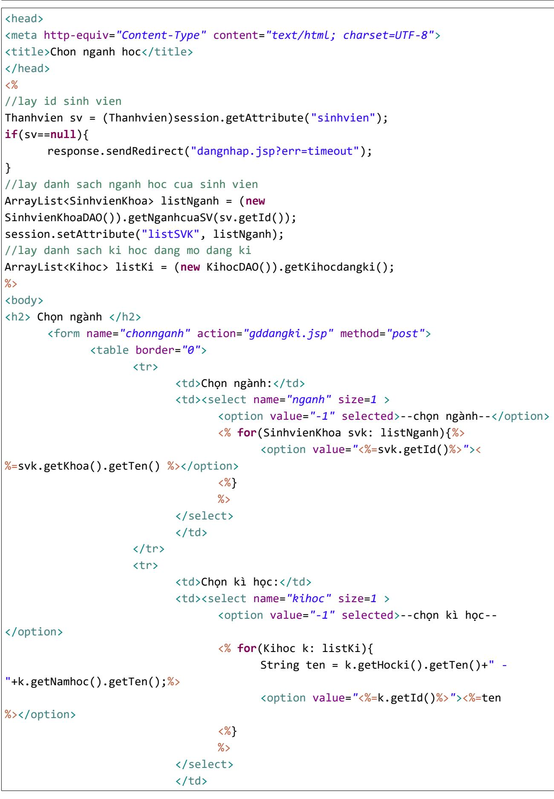

</tr> <tr> <td></td> <td><input type="submit" value="Vào đăng kí" /></td> </tr> </table> </form> </body> </html>

# Trang gdDangki.jsp

<%@ page language="java" contentType="text/html; charset=UTF-8" pageEncoding="UTF-8" import="java.util.\*,dao.\*,model.\*"%>   
<!DOCTYPE html PUBLIC "-//W3C//DTD HTML 4.01 Transitional//EN"   
"http://www.w3.org/TR/html4/loose.dtd">   
<html>   
<head>   
<meta http-equiv="Content-Type" content="text/html; charset=UTF-8">   
<%@include file ="../header.jsp" %>   
<title>Dang ki hoc</title>   
</head>   
<% //lay id sinh vien   
Thanhvien sv = (Thanhvien)session.getAttribute("sinhvien");   
if(sv==null){ response.sendRedirect("dangnhap.jsp?err=timeout");   
}   
ArrayList<Dangkihoc> listDK = null;   
SinhvienKhoa svk = null;   
//kiem tra cach trang nay bi goi   
String action = request.getParameter("action");   
if ((action == null)||(action.trim().length() ==0)) {//goi tu trang chon nganh //lay du lieu nganh hoc va ki hoc int idSVK = Integer.parseInt(request.getParameter("nganh")); int idKihoc = Integer.parseInt(request.getParameter("kihoc")); session.setAttribute("idSVK", idSVK); session.setAttribute("idKihoc", idKihoc); //lay thong tin sinh vien + nganh hoc ArrayList<SinhvienKhoa> listSVK =   
(ArrayList<SinhvienKhoa>)session.getAttribute("listSVK"); for(SinhvienKhoa tmp:listSVK) if(tmp.getId() == idSVK){ svk = tmp; } //lay danh sach dang ki cua sinh vien, neu co listDK = (new DangkihocDAO()).getDKcuaSV(idSVK, idKihoc);

else if (action.equalsIgnoreCase("them")) {// goi tu trang chon lop hoc phan listDK = (ArrayList<Dangkihoc>)session.getAttribute("dangkihoc"); if(listDK == null) listDK = new ArrayList<Dangkihoc>(); svk = (SinhvienKhoa)session.getAttribute("sinhvienkhoa"); ArrayList<Lophocphan> listLHP = (ArrayList<Lophocphan>)session.getAttribute("listLHP"); int idLHP = Integer.parseInt(request.getParameter("idlhp")); boolean daTontaiLHP = false; for(Dangkihoc dk:listDK){ if(dk.getLophocphan().getId() == idLHP){ daTontaiLHP = true; break; } } if(!daTontaiLHP){ //tao dang ki moi Dangkihoc dkMoi = null; for (Lophocphan lhp : listLHP) if (lhp.getId() == idLHP) { dkMoi = new Dangkihoc(); dkMoi.setLophocphan(lhp); dkMoi.setSinhvienKhoa(svk); } //kiem tra co phai sua dang ki cu khong boolean daTontaiMHKH = false; int index = 0; for (Dangkihoc dk : listDK) { if (dk.getLophocphan().getMonhocKihoc().getId() == dkMoi .getLophocphan().getMonhocKihoc().getId()) { listDK.remove(dk); break; } index++; } //them dang ki moi vao danh sach listDK.add(index, dkMoi); } } else if (action.equalsIgnoreCase("xoa")) {// goi tu trang dang ki, de xoa listDK = (ArrayList<Dangkihoc>)session.getAttribute("dangkihoc"); if (listDK == null) listDK = new ArrayList<Dangkihoc>(); svk = (SinhvienKhoa)session.getAttribute("sinhvienkhoa"); int idLHP = Integer.parseInt(request.getParameter("idlhp")); for (Dangkihoc dk : listDK) if (dk.getLophocphan().getId() == idLHP) { listDK.remove(dk);

break; } } session.setAttribute("sinhvienkhoa", svk); session.setAttribute("dangkihoc", listDK); %> <body> <h2> Đăng kí học </h2> <table border="0"> <tr> <td> <%if(svk != null){ %> 
Họ tên: <%=svk.getSinhvien().getHoten().getHodem() %> < %=svk.getSinhvien().getHoten().getTen() %> 
Mã: <%=svk.getSinhvien().getMasv() %> 
Ngành: <%=svk.getKhoa().getTen() %> <%} %> </td> </tr> <tr><td> <h3> Các môn đã đăng kí: </h3> </td> </tr> <tr> <td> <table style="border: 1px solid black;border-collapse: collapse;" > <thead><td style="border: 1px solid black; padding:0 15px 0 15px;">T.T</td> <td style="border: 1px solid black; padding:0 15px 0 15px;">Mã môn học</td> <td style="border: 1px solid black; padding:0 15px 0 15px;">Tên môn học</td> <td style="border: 1px solid black; padding:0 15px 0 15px;">Tên lớp học phần</td> <td style="border: 1px solid black; padding:0 15px 0 15px;">Xem lịch</td> <td style="border: 1px solid black; padding:0 15px 0 15px;">Sửa</td> <td style="border: 1px solid black;padding:0 15px 0 15px;">Xóa</td> </thead> <% int soTC =0; if(listDK != null) for(int i=0; i<listDK.size(); i++){ soTC += listDK.get(i).getLophocphan().getMonhocKihoc().getMonhoc().getSoTC(); %> <tr> <td style="text-align:center; padding:0 15px 0 15px;"><%=(i+1) %></td> <td style="text-align:center; padding:0 15px 0 15px;">< %=listDK.get(i).getLophocphan().getMonhocKihoc().getMonhoc().getId() %></td> <td style="padding:0 15px 0 15px;">< %=listDK.get(i).getLophocphan().getMonhocKihoc().getMonhoc().getTen() %></td> <td style="padding:0 15px 0 15px;"><%=listDK.get(i).getLophocphan().getTen() %></t <td style="text-align:center; padding:0 15px 0 15px;"> <a href="gdxemlich.jsp?idlhp=<%=listDK.get(i).getLophocphan().getId()%>">Xem lịch</a></td> <td style="text-align:center; padding:0 15px 0 15px;">

<a href="gdchonlhp.jsp?idmhkh=<   
%=listDK.get(i).getLophocphan().getMonhocKihoc().getId()%>">Sửa</a></td>   
<td style="text-align:center; padding:0 15px 0 15px;">   
<a href="gddangki.jsp?action=xoa&&idlhp=<%=listDK.get(i).getLophocphan().getId()%>"   
onclick="return confirm('Bạn muốn xóa lớp học phần khỏi danh sách đăng   
kí?');">Xóa</a></td>   
</tr>   
<%} %>   
</table>   

Tổng số tín chỉ: <%=soTC%>   
</td>   
</tr>   
<tr>   
<td>   
<button onclick="openPage('gdchinhsv.jsp')">Về trang chính</button>   
<button onclick="openPage('gdchonmh.jsp')">Chọn tiếp</button>   
<button onclick="openPage('doluudk.jsp')">Lưu đăng kí</button>   
</td>   
</tr>   
</table>   
</body>   
</html>

# Trang gdChonMH.jsp

<%@ page language="java" contentType="text/html; charset=UTF-8"   
pageEncoding="UTF-8" import="java.util.\*,dao.\*,model.\*"%>   
<!DOCTYPE html PUBLIC "-//W3C//DTD HTML 4.01 Transitional//EN"   
"http://www.w3.org/TR/html4/loose.dtd">   
<html>   
<head>   
<meta http-equiv="Content-Type" content="text/html; charset=UTF-8">   
<title>Chon mon hoc</title>   
</head>   
<%   
//lay id sinh vien   
Thanhvien sv = (Thanhvien)session.getAttribute("sinhvien");   
if(sv==null){   
response.sendRedirect("dangnhap.jsp?err=timeout");   
}   
//lay du lieu nganh hoc va ki hoc   
int idSVK = (int)session.getAttribute("idSVK");   
int idKihoc = (int)session.getAttribute("idKihoc");   
//lay danh sach mon hoc duoc dang ki   
ArrayList<MonhocKihoc> listMHKH = (new MonhocKihocDAO()).getMHcuaSV(idSVK, idKihoc); //loai bo cac mon hoc da dang ki   
ArrayList<Dangkihoc> listDK =   
(ArrayList<Dangkihoc>)session.getAttribute("dangkihoc");   
if(listDK != null)   
for(int i=0; i<listMHKH.size(); i++){ boolean daDK = false; for(Dangkihoc dk:listDK) if(dk.getLophocphan().getMonhocKihoc().getId() ==   
listMHKH.get(i).getId()){ daDK = true; break; } if(daDK){ listMHKH.remove(i); //if(i>0) i--; }   
}   
session.setAttribute("listMHKH", listMHKH);   
%>   
<body>   
<h2> Chọn môn học </h2>   
<table style="border: 1px solid black;border-collapse: collapse;">   
<thead><td style="border: 1px solid black; padding:0 15px 0 15px;">T.T</td>   
<td style="border: 1px solid black; padding:0 15px 0 15px;">Mã môn học</td>   
<td style="border: 1px solid black; padding:0 15px 0 15px;">Tên môn học</td>   
<td style="border: 1px solid black; padding:0 15px 0 15px;">Số tín chỉ</td>   
<td style="border: 1px solid black; padding:0 15px 0 15px;">Chọn</td>   
</thead>   
<%   
if(listMHKH != null)   
for(int i=0; i<listMHKH.size(); i++){   
%>   
<tr>   
<td style="text-align:center; padding:0 15px 0 15px;"><%=(i+1) %></td>   
<td style="text-align:center; padding:0 15px 0 15px;"><   
%=listMHKH.get(i).getMonhoc().getId() %></td>   
<td style="padding:0 15px 0 15px;"><%=listMHKH.get(i).getMonhoc().getTen() %></td>   
<td style="text-align:center; padding:0 15px 0 15px;"><   
%=listMHKH.get(i).getMonhoc().getSoTC() %></td>   
<td style="text-align:center; padding:0 15px 0 15px;">   
<a href="gdchonlhp.jsp?idmhkh=<%=listMHKH.get(i).getId()%>">Chọn</a></td>   
</tr>   
<%} %>   
</table>   
    
<button type="button" name="back" onclick="history.back()">Quay lại</button>   
</body>

# Trang gdChonLHP.jsp

<%@ page language="java" contentType="text/html; charset=UTF-8" pageEncoding="UTF-8" import="java.util.\*,dao.\*,model.\*"%>   
<!DOCTYPE html PUBLIC "-//W3C//DTD HTML 4.01 Transitional//EN"   
"http://www.w3.org/TR/html4/loose.dtd">   
<html>   
<head>   
<meta http-equiv="Content-Type" content="text/html; charset=UTF-8">   
<title>Chon lop hoc phan</title>   
</head>   
<%   
//lay id sinh vien   
Thanhvien sv = (Thanhvien)session.getAttribute("sinhvien");   
if(sv==null){ response.sendRedirect("dangnhap.jsp?err=timeout");   
}   
//lay du lieu nganh hoc va ki hoc   
int idSVK = (int)session.getAttribute("idSVK");   
int idMHKH = Integer.parseInt(request.getParameter("idmhkh"));   
//lay danh sach mon hoc duoc dang ki   
ArrayList<Lophocphan> listLHP = (new LophocphanDAO()).getLHPchoSVdangki(idSVK,   
idMHKH);   
//loai cac LHP trung lich voi cac lop da hoc   
ArrayList<Dangkihoc> listDK =   
(ArrayList<Dangkihoc>)session.getAttribute("dangkihoc");   
if((listDK !=null) && (listLHP !=null)){ ArrayList<Lichhoc> lichdachon = new ArrayList<Lichhoc>(); LichhocDAO lhdao = new LichhocDAO(); for(Dangkihoc dk:listDK){ lichdachon.addAll(lhdao.getLHcuaLHP(dk.getLophocphan().getId())); } for(int i=0; i<listLHP.size(); i++){ ArrayList<Lichhoc> listLH = lhdao.getLHcuaLHP(listLHP.get(i).getId()); boolean ok = true; for(Lichhoc lhmoi:listLH){ for(Lichhoc lhdk:lichdachon) if(lhmoi.getTuanhoc().equals(lhdk.getTuanhoc()) && lhmoi.getNgayhoc().equals(lhdk.getNgayhoc())   
&& lhmoi.getKiphoc().equals(lhdk.getKiphoc())){ ok = false; break; } if(!ok) break;

} if(!ok){ listLHP.remove(i); i--; } } } session.setAttribute("listLHP", listLHP); %> <body> <%if(listLHP != null){ %> <h2> Chọn lớp học phần </h2> <table style="border: 1px solid black;border-collapse: collapse;"> <thead><td style="border: 1px solid black; padding:0 15px 0 15px;">T.T</td> <td style="border: 1px solid black; padding:0 15px 0 15px;">Mã lớp học phần</td> <td style="border: 1px solid black; padding:0 15px 0 15px;">Tên lớp học phần</td> <td style="border: 1px solid black; padding:0 15px 0 15px;">Sĩ số tối đa</td> <td style="border: 1px solid black; padding:0 15px 0 15px;">Sĩ số thực</td> <td style="border: 1px solid black; padding:0 15px 0 15px;">Lịch học</td> <td style="border: 1px solid black; padding:0 15px 0 15px;">Chọn</td> </thead> <% for(int i=0; i<listLHP.size(); i++){ %> <tr> <td style="text-align:center; padding:0 15px 0 15px;"><%=(i+1) %></td> <td style="text-align:center; padding:0 15px 0 15px;"><%=listLHP.get(i).getId() %></td> <td style="padding:0 15px 0 15px;"><%=listLHP.get(i).getTen() %></td> <td style="text-align:center; padding:0 15px 0 15px;">< %=listLHP.get(i).getSisotoida() %></td> <td style="text-align:center; padding:0 15px 0 15px;">< %=listLHP.get(i).getSisothucte() %></td> <td style="text-align:center; padding:0 15px 0 15px;"> <a href="gdxemlich.jsp?idlhp=<%=listLHP.get(i).getId()%>">Xem lịch</a></td> <td style="text-align:center; padding:0 15px 0 15px;"> <a href="gddangki.jsp?action=them&&idlhp=<%=listLHP.get(i).getId()%>">Chọn</a></td> </tr> <%} %> </table> <% }else %>

    
<button type="button" name="back" onclick="history.back()">Quay lại</button>   
</body>   
</html>

# Trang gdxemlich.jsp

<%@ page language="java" contentType="text/html; charset=UTF-8"   
pageEncoding="UTF-8" import="java.util.\*,dao.\*,model.\*"%>   
<!DOCTYPE html PUBLIC "-//W3C//DTD HTML 4.01 Transitional//EN"   
"http://www.w3.org/TR/html4/loose.dtd">   
<html>   
<head>   
<meta http-equiv="Content-Type" content="text/html; charset=UTF-8">   
<title>Xem lich hoc</title>   
</head>   
<%   
//lay id sinh vien   
Thanhvien sv = (Thanhvien)session.getAttribute("sinhvien");   
if(sv==null){   
response.sendRedirect("dangnhap.jsp?err=timeout");   
}   
int idLHP = Integer.parseInt(request.getParameter("idlhp"));   
//lay danh sach mon hoc duoc dang ki   
ArrayList<Lichhoc> listLH = (new LichhocDAO()).getLHcuaLHP(idLHP);   
%>   
<body>   
<h2> Lịch học </h2>   
<table style="border: 1px solid black;border-collapse: collapse;">   
<thead><td style="border: 1px solid black; padding:0 15px 0 15px;">T.T</td> <td style="border: 1px solid black; padding:0 15px 0 15px;">Tuần</td> <td style="border: 1px solid black; padding:0 15px 0 15px;">Thứ</td> <td style="border: 1px solid black; padding:0 15px 0 15px;">Kip</td> <td style="border: 1px solid black; padding:0 15px 0 15px;">Phòng học</td> <td style="border: 1px solid black; padding:0 15px 0 15px;">Giảng viên</td> </thead>   
<%   
if(listLH != null)   
for(int i=0; i<listLH.size(); i++){   
%>   
<tr>   
<td style="text-align:center; padding:0 15px 0 15px;"><%=(i+1) %></td> <td style="text-align:center; padding:0 15px 0 15px;"><   
%=listLH.get(i).getTuanhoc().getTen() %></td>   
<td style="text-align:center; padding:0 15px 0 15px;"><   
%=listLH.get(i).getNgayhoc().getTen() %></td>   
<td style="text-align:center; padding:0 15px 0 15px;"><   
%=listLH.get(i).getKiphoc().getTen() %></td>   
<td style="text-align:center; padding:0 15px 0 15px;"><   
%=listLH.get(i).getPhonghoc().getTen() %></td>   
<td style="text-align:center; padding:0 15px 0 15px;"><   
%=(listLH.get(i).getGiangvien().getHoten().getHodem()+" "+ listLH.get(i).getGiangvien().getHoten().getTen()) %></td>   
</tr>   
<%} %>   
</table>   
    
<button type="button" name="back" onclick="history.back()">Quay lại</button>   
</body>   
</html>

# Trang doluudk.jsp

<%@ page language="java" contentType="text/html; charset=UTF-8" pageEncoding="UTF-8" import="java.util.\*,dao.\*,model.\*"%>   
<!DOCTYPE html PUBLIC "-//W3C//DTD HTML 4.01 Transitional//EN"   
"http://www.w3.org/TR/html4/loose.dtd">   
<html>   
<head>   
<meta http-equiv="Content-Type" content="text/html; charset=UTF-8">   
//lay id sinh vien   
Thanhvien sv = (Thanhvien)session.getAttribute("sinhvien");   
if(sv==null){   
response.sendRedirect("dangnhap.jsp?err=timeout");   
}   
//lay thong tin dang ki va luu   
ArrayList<Dangkihoc> listDK =   
(ArrayList<Dangkihoc>)session.getAttribute("dangkihoc");   
if((new DangkihocDAO()).luuDKcuaSV(listDK)){   
%>    
<% response.sendRedirect("gdchinhsv.jsp");   
}else{   
%>    
<%   
}%>

# 5.2.2 Chức năng nhập điểm

# Lớp KihocDAO.java

package dao;   
import java.sql.CallableStatement;   
import java.sql.ResultSet;   
import java.util.ArrayList;   
import model.Hocki;   
import model.Kihoc;   
import model.Namhoc;   
public class KihocDAO extends DAO{ public KihocDAO() { super(); // TODO Auto-generated constructor stub } /\*\* \* Lay danh sach cac hoc ki dang hoc \* @return danh sach ki hoc dang hoc \*/ public ArrayList<Kihoc> getKidanghoc(){ ArrayList<Kihoc> kq=null; String sql = "{call kiDanghoc()}"; //su dung stored procedure try{ CallableStatement cs = con.prepareCall(sql); ResultSet rs = cs.executeQuery(); while(rs.next()){ if(kq == null) kq = new ArrayList<Kihoc>(); Kihoc kh = new Kihoc(); kh.setId(rs.getInt("idkihoc")); //nam hoc Namhoc nh = new Namhoc(); nh.setId(rs.getInt("idnamhoc")); nh.setTen(rs.getString("namhoc")); kh.setNamhoc(nh); //hoc ki Hocki hk = new Hocki(); hk.setId(rs.getInt("idhocki")); hk.setTen(rs.getString("hocki")); kh.setHocki(hk); kq.add(kh); }

<table><tr><td colspan="2">}catch(Exception e){ e.printStackTrace(); kq = null; } return kq;</td></tr><tr><td colspan="2">} } CREATE DEFINER= root @ localhost PROCEDURE kiDanghoc()</td></tr><tr><td colspan="2">BEGIN SELECT a.id as idnamhoc, a.ten as namhoc, b.id as idhocki, b.ten as hocki, c.id as idkihoc FROM tblnamhoc a, tblhocki b, tblkihoc c WHERE c.idnamhoc = a.id AND c.idhocki = b.id AND c.danghoc = 1;</td></tr></table>

# Lớp MonhocKihocDAO.java

package dao;   
import java.sql.CallableStatement;   
import java.sql.ResultSet;   
import java.util.ArrayList;   
import model.Kihoc;   
import model.Monhoc;   
import model.MonhocKihoc;   
public class MonhocKihocDAO extends DAO{ public MonhocKihocDAO() { super(); // TODO Auto-generated constructor stub } /\*\* \* lay danh sach cac mon hoc ma giang vien @idGV da dang ki day \* @param idGV: id giang vien \* @param idKihoc: id ki hoc \* @return danh sach monhockihoc \*/ public ArrayList<MonhocKihoc> getMHcuaGV(int idGV, int idKihoc){ ArrayList<MonhocKihoc> kq = null; String sql = "{call MHmaGVday(?,?)}";// su dung stored procedure try{ CallableStatement cs = con.prepareCall(sql); cs.setInt(1, idGV); cs.setInt(2, idKihoc); ResultSet rs = cs.executeQuery(); while(rs.next()){

<table><tr><td>if(kq == null) kq = new ArrayList&lt;MonhocKihoc&gt;(); MonhocKihoc mhkh = new MonhocKihoc(); mhkh.setId(rs.getInt(&quot;idmhkh&quot;)); //mon hoc Monhoc mh = new Monhoc(); mh.setId(rs.getInt(&quot;idmh&quot;)); mh.setTen(rs.getString(&quot;tenmh&quot;)); mh.setSoTC(rs.getInt(&quot;sotc&quot;)); mhkh.setMonhoc(mh); //ki hoc Kihoc kh = new Kihoc(); kh.setId(idKihoc); mhkh.setKihoc(kh); kq.add(mhkh); } }catch(Exception e){ e.printStackTrace(); kq = null; } return kq; }</td></tr><tr><td>} CREATE DEFINER=root @ localhost PROCEDURE MHmaGVday(IN idGV int, IN idKihoc int) BEGIN SELECT distinctrow a.id as idmh, a.ten as tenmh, a.sotc, b.id as idmhkh FRoM tblmonhoc a, tblmonhockihoc b, tbllophocphan c, tbllichhoc d WHERE b.idKihoc = idKihoc AND a.id = b.idmonhoc AND c.idmonhockihoc = b.id AND d.idlophocphan = c.id AND d.idgiangvien = idGV; END</td></tr></table>

# Lớp LophocphanDAO.java

<table><tr><td>package dao;</td></tr><tr><td>import java.sql.CallableStatement;</td></tr><tr><td>import java.sql.ResultSet;</td></tr><tr><td>import java.util.ArrayList;</td></tr><tr><td>import n model.Kihoc;</td></tr><tr><td>import model.Lophocphan;</td></tr><tr><td>import model.Monhoc;</td></tr><tr><td>import model.MonhocKihoc;</td></tr><tr><td></td></tr><tr><td>public class LophocphanDAO extends DAO{</td></tr><tr><td>public LophocphanDAO() {</td></tr><tr><td>super();</td></tr><tr><td>// ToDo Auto-generated constructor stub }</td></tr></table>

/\*\* \* lay danh sach lop hoc phan ma giang vien @idGV day cua mon hoc @idMHKH \* @param idMHKH id cua monhoc kihoc \* @param idGV id cua giang vien \* @return dang sach lop hoc phan \*/ public ArrayList<Lophocphan> getLHPmaGVday(int idGV, int idMHKH){ ArrayList<Lophocphan> kq = null; String sql = "{call LHPmaGVday(?,?)}";// su dung stored procedure try{ CallableStatement cs = con.prepareCall(sql); cs.setInt(1, idGV); cs.setInt(2, idMHKH); ResultSet rs = cs.executeQuery(); while(rs.next()){ if(kq == null) kq = new ArrayList<Lophocphan>(); Lophocphan lhp = new Lophocphan(); lhp.setId(rs.getInt("id")); lhp.setTen(rs.getString("ten")); lhp.setSisotoida(rs.getInt("sisotoida")); //monhockihoc MonhocKihoc mhkh = new MonhocKihoc(); mhkh.setId(idMHKH); lhp.setMonhocKihoc(mhkh); kq.add(lhp); } }catch(Exception e){ e.printStackTrace(); kq = null; } return kq; } } CREATE DEFINER=\`root\`@\`localhost\` PROCEDURE \`LHPmaGVday\`(IN idGV int, IN idMHKH int) BEGIN SELECT distinctrow a.\* FROM tbllophocphan a, tbllichhoc b WHERE a.idmonhockihoc = idMHKH AND b.idlophocphan = a.id AND b.idgiangvien = idGV; END

# Lớp DangkihocDAO.java

package dao;   
import java.sql.CallableStatement;   
import java.sql.PreparedStatement;   
import java.sql.ResultSet;   
import java.util.ArrayList;   
import model.Dangkihoc;   
import model.Daudiem;   
import model.Hoten;   
import model.Ketqua;   
import model.Khoa;   
import model.Kihoc;   
import model.Lophocphan;   
import model.Monhoc;   
import model.MonhocDaudiem;   
import model.MonhocKihoc;   
import model.Sinhvien;   
import model.SinhvienKhoa;   
public class DangkihocDAO extends DAO{ public DangkihocDAO() { super(); // TODO Auto-generated constructor stub } /\*\* \* lay danh sach diem cua cac sinh vien da dang ki vao lop hoc phan @idLHP \* @param idLHP id cua lop hoc phan \* @return danh sach cac doi tuong dang ki hoc, trong co cac dau diem \*/ public ArrayList<Dangkihoc> getDiemcuaLHP(int idLHP){ ArrayList<Dangkihoc> kq = null; String sqlDK = "{call DKcuaLHP(?)}";// su dung stored procedure String sqlDiem = "{call DiemcuaDK(?)}";// su dung stored procedure LichhocDAO ld = new LichhocDAO(); try{ CallableStatement cs = con.prepareCall(sqlDK); cs.setInt(1, idLHP); ResultSet rs = cs.executeQuery(); while(rs.next()){ if(kq == null) kq = new ArrayList<Dangkihoc>(); Dangkihoc dk = new Dangkihoc(); dk.setId(rs.getInt("id")); //lop hoc phan Lophocphan lhp = new Lophocphan(); lhp.setId(idLHP); dk.setLophocphan(lhp); //sinhvien SinhvienKhoa sv = new SinhvienKhoa(); sv.setId(rs.getInt("idsinhvienkhoa")); dk.setSinhvienKhoa(sv); //diem CallableStatement csDiem = con.prepareCall(sqlDiem); cs.setInt(1, dk.getId()); ResultSet rsDiem = csDiem.executeQuery(); while(rsDiem.next()){ Ketqua diem = new Ketqua(); if(rsDiem.getObject("idkq")==null){//chua co diem diem.setId(-1); diem.setDiem(0); }else{ diem.setId(rsDiem.getInt("idkq")); diem.setDiem(rsDiem.getFloat("diem")); } //monhoc dau diem MonhocDaudiem mhdd = new MonhocDaudiem(); mhdd.setId(rsDiem.getInt("id")); mhdd.setTiLe(rsDiem.getFloat("tile")); //Daudiem Daudiem dd = new Daudiem(); dd.setId(rsDiem.getInt("iddd")); dd.setTen(rsDiem.getString("tendd")); mhdd.setDauDiem(dd); diem.setDiemTP(mhdd); dk.getDsDiemTP().add(diem); } kq.add(dk); } }catch(Exception e){ e.printStackTrace(); kq = null; } return kq;   
}   
/\*\*   
\* luu hoac cap nhat diem cua cac sinh vien trong lop hoc phan   
\* @param listDiem danh sach diem cua sinh vien trong lop hoc phan   
\* @return thanh cong hay co loi   
\*/   
public boolean luuDiemcuaLHP(ArrayList<Dangkihoc> listDiem){ boolean kq = false; String sqlKiemtra = "SELECT id FROM tblKetqua WHERE iddangkihoc = ? AND idmonhocdaudiem =?"; String sqlThem = "INSERT INTO tblKetqua(diem, ghichu, iddangkihoc, idmonhocdaudiem) VALUES(?,?,?,?)";

String sqlSua = "UPDATE tblKetqua SET diem=?, ghichu=? WHERE id=?"; try{ this.con.setAutoCommit(false); for(Dangkihoc dk:listDiem){ for(Ketqua diem: dk.getDsDiemTP()){ PreparedStatement ps = eStatement(sqlKiemtra); ps.setInt(1, dk.getId()); ps.setInt(2, diem.getDiemTP().getId()); ResultSet rs = ps.executeQuery(); if(rs.next()){// da ton tai, nen chi cap nhat PreparedStatement psSua = con.prepareStatement(sqlSua); psSua.setFloat(1, diem.getDiem()); psSua.setString(2, diem.getGhichu()); psSua.setInt(3, rs.getInt("id")); psSua.executeUpdate(); }else{// chua ton tai nen them moi PreparedStatement psThem = con.prepareStatement(sqlThem); psThem.setFloat(1, diem.getDiem()); psThem.setString(2, diem.getGhichu()); psThem.setInt(3, dk.getId()); psThem.setInt(4, diem.getDiemTP().getId()); psThem.executeUpdate(); } } } this.con.commit(); kq=true; }catch(Exception e){ try{ this.con.rollback(); }catch(Exception ex){ kq=false; ex.printStackTrace(); } kq=false; e.printStackTrace(); }finally{ try{ this.con.setAutoCommit(true); }catch(Exception ex){ kq=false; ex.printStackTrace(); } }

<table><tr><td>return kq; } }</td></tr><tr><td>CREATE DEFINER= root @ localhost PROCEDURE DKcuaLHP (IN idLHP int) BEGIN SELECT * FROM tbldangkihoc WHERE idlophocphan = idLHP; END</td></tr><tr><td>CREATE DEFINER= root @ localhost PROCEDURE DiemcuaDK (IN idDK int) BEGIN SELECT a.id, a.tile, b.id as iddd, b.ten, (SELECT c.id FROM tblKetqua c</td></tr><tr><td>WHERE c.iddangkihoc = idDK AND c.idmonhocdaudiem = a.id) as idkq, (SELECT c.diem FROM tblKetqua c WHERE c.iddangkihoc = idDK AND c.idmonhocdaudiem = a.id) as diem FROM tblmonhocdaudiem a, tbldaudiem b, tblmonhockihoc e, tbllophocphan f, tbldangkihoc g</td></tr></table>

# 5.2.3 Chức năng xem thống kê

# Lớp KihocDAO.java

package dao;   
import java.sql.CallableStatement;   
import java.sql.ResultSet;   
import java.util.ArrayList;   
import model.Hocki;   
import model.Kihoc;   
import model.Namhoc;   
public class KihocDAO extends DAO{ public KihocDAO() { super(); // TODO Auto-generated constructor stub } /\*\* \* lay tat ca cac ki da hoc va dang hoc de chon xem thong ke \* @return danh sach cacs doi tuong kihoc \*/ public ArrayList<Kihoc> getTatcaKihoc(){ ArrayList<Kihoc> kq=null; String sql = "{call tatcaKihoc()}"; //su dung stored procedure

<table><tr><td>try{ CallableStatement cs = con.prepareCall(sql); ResultSet rs = cs.executeQuery(); while(rs.next()){ if(kq == null) kq = new ArrayList&lt;Kihoc&gt;(); Kihoc kh = new Kihoc(); kh.setId(rs.getInt(&quot;idkihoc&quot;)); //nam hoc Namhoc nh = new Namhoc(); nh.setId(rs.getInt(&quot;idnamhoc&quot;)); nh.setTen(rs.getString(&quot;namhoc&quot;)); kh.setNamhoc(nh); //hoc ki Hocki hk = new Hocki(); hk.setId(rs.getInt(&quot;idhocki&quot;)); hk.setTen(rs.getString(&quot;hocki&quot;)); kh.setHocki(hk); kq.add(kh); } }catch(Exception e){ e.printStackTrace(); kq = null; }</td></tr><tr><td>BEGIN SELECT a.id as idnamhoc, a.ten as namhoc, b.id as idhocki, b.ten as hocki, c.id as idkihoc</td></tr></table>

# Lớp TKHoclucDAO.java

package dao;   
import java.sql.CallableStatement;   
import java.sql.ResultSet;   
import java.util.ArrayList;   
import model.TKLoaihocluc;   
public class TKHoclucDAO extends DAO{ public TKHoclucDAO() { super(); -- chuyen diem tu he 10 sang he 4   
DROP TEMPORARY TABLE IF EXISTS diemsvmhhe4; CREATE TEMPORARY TABLE diemsvmhhe4 AS SELECT \*,   
(SELECT diem FROM tblDiemhechu   
WHERE tbmon >= diemhe10toithieu   
AND tbmon < diemhe10toida) as tbmonhe4   
FROM diemsvmh;

<table><tr><td>// ToDo Auto-generated constructor stub } /** * thong ke moi loai hoc luc trong hoc ki @idKihoc * @param idKihoc id cua ki hoc duoc chon * @return danh sach doi tuong TKLoaihocluc */ public ArrayList&lt;TKLoaihocluc&gt; getTKHocluc(int idKihoc){ ArrayList&lt;TKLoaihocluc&gt; kq = null; String sql = &quot;{call TKHocluc(?)}&quot;; //su dung stored procedure try{ CallableStatement cs = con.prepareCall(sql); cs.setInt(1,idKihoc); ResultSet rs = cs.executeQuery(); while(rs.next()){ if(kq == null) kq = new ArrayList&lt;TKLoaihocluc&gt;(); TKLoaihocluc tkhl = new TKLoaihocluc(); tkhl.setId(rs.getInt(&quot;id&quot;)); tkhl.setTen(rs.getString(&quot;ten&quot;)); tkhl.setSosV(rs.getInt(&quot;soluong&quot;)); tkhl.setDiemTB(rs.getFloat(&quot;tb&quot;)); kq.add(tkhl); } }catch(Exception e){ e.printStackTrace(); kq = null; } return kq; } } CREATE DEFINER= root @ localhost PROCEDURE TKHocluc(IN idKihoc int) BEGIN -- bang tam tinh diem tung mon hoc cua sinh vien DROP TEMPORARY TABLE IF EXISTS diemSVmh; CREATE TEMPORARY TABLE dieMSVMh AS SELECT a.idsinhvienkhoa, e.id as idmonhoc, e.sotc,</td><td></td></tr></table>

-- bang tam tinh diem trung binh ca hoc ki cua sinh vien DROP TEMPORARY TABLE IF EXISTS diemsvhk;

CREATE TEMPORARY TABLE diemsvhk AS SELECT idsinhvienkhoa, SUM(sotc) as tongtc, SUM(sotc\*tbmonhe4)/SUM(sotc) as tbki FROM diemsvmhhe4 GROUP BY idsinhvienkhoa;

-- tinh so luong DROP TEMPORARY TABLE IF EXISTS tksoluong;

-- tinh diem trung binh DROP TEMPORARY TABLE IF EXISTS tkdiemtb;

CREATE TEMPORARY TABLE tkdiemtb AS SELECT a.id, (SELECT AVG(tbki) FROM diemsvhk WHERE tbki>=a.diemtoithieu AND tbki < a.diemtoida) as tb FROM tblloaihocluc a;

-- tlay ket qua day du SELECT a.\*, b.soluong, c.tb FROM tblloaihocluc a, tksoluong b, tkdiemtb c WHERE b.id=a.id AND c.id=a.id;

# Lớp TKSinhvienDAO.java

package dao;   
import java.sql.CallableStatement;   
import java.sql.ResultSet;   
import java.util.ArrayList;   
import model.Hoten;   
import model.Khoa;   
import model.Sinhvien;   
import model.TKSinhvien;

<table><tr><td>Chuong 5. Cài dt hê thó</td></tr><tr><td></td></tr><tr><td>public class TKSinhvienDAO extends DAO{</td></tr><tr><td>public TKSinhvienDAO() {</td></tr><tr><td>super(); // ToDo Auto-generated constructor stub</td></tr><tr><td>}</td></tr><tr><td></td></tr><tr><td>/** * thong ke ket qua cua cac sinh vien cos hoc luc @idLoaiHL, trong ki hoc</td></tr><tr><td>* @param idLoaiHL id loai hoc luc</td></tr><tr><td>* @param idKihoc id ki hoc</td></tr><tr><td>* @return danh sach doi tuong TKSinhvien</td></tr><tr><td>*/ public ArrayList&lt;TKSinhvien&gt; getTKSVcuaHL(int idLoaiHL, int idKihoc){</td></tr><tr><td>ArrayList&lt;TKSinhvien&gt; kq = null;</td></tr><tr><td>String sql = "{call TKSVtheoHL(?,?)}"; //su dung stored procedure</td></tr><tr><td>try{ CallableStatement cs = con.prepareCall(sql);</td></tr><tr><td>cs.setInt(1,idLoaiHL);</td></tr><tr><td>cs.setInt(2,idKihoc);</td></tr><tr><td>ResultSet rs = cs.executeQuery();</td></tr><tr><td></td></tr><tr><td>while(rs.next()){</td></tr><tr><td>if(kq == null) kq = new ArrayList&lt;TKSinhvien&gt;(); TKSinhvien tksv = new TKSinhvien();</td></tr><tr><td>tksv.setId(rs.getInt("idsinhvienkhoa")); tksv.setDiemTB(rs.getFloat("tbki"));</td></tr><tr><td></td></tr><tr><td></td></tr><tr><td>tksv.setSotC(rs.getInt("tongtc"));</td></tr><tr><td>//khoa-nganh Khoa k = new Khoa();</td></tr><tr><td>k.setTen(rs.getString("tennganh"));</td></tr><tr><td>tksv.setKhoa(k);</td></tr><tr><td>//sinhvien</td></tr><tr><td>Sinhvien sv = new Sinhvien();</td></tr><tr><td>sv.setId(rs.getInt("id")); sv.setMasv(rs.getString("masv"));</td></tr><tr><td>//hoten</td></tr><tr><td>Hoten ht = new Hoten();</td></tr><tr><td>ht.setHodem(rs.getString("hodem"));</td></tr><tr><td>ht.setTen(rs.getString("ten"));</td></tr><tr><td>sv.setHoten(ht);</td></tr><tr><td>tksv.setSinhvien(sv);</td></tr><tr><td></td></tr><tr><td>kq.add(tksv);</td></tr><tr><td>}</td></tr><tr><td>}catch(Exception e){</td></tr><tr><td colspan="2">e.printStackTrace(); kq = null;</td></tr><tr><td>} return kq; }</td></tr><tr><td>EATE DEFINER=root @ localhost PROCEDURE TKSVtheoHL"(IN idLoaiHL int, IN idKihoc t) GIN</td></tr><tr><td>DECLARE minHL float default 0; DECLARE maxHL float default 0;</td></tr><tr><td>SELECT diemtoithieu, diemtoida INTO minHL, maxHL FROM tblloaihocluc WHERE id = idLoaiHL;</td></tr><tr><td>-- bang tam tinh diem tung mon hoc cua sinh vien DROP TEMPORARY TABLE IF EXISTS dieMSVmh;</td></tr><tr><td>CREATE TEMPORARY TABLE dieMSVmh AS SELECT a.idsinhvienkhoa, e.id as idmonhoc, e.sotc, SUM(f.tile*b.diem) as tbmon</td></tr><tr><td>FRoM tbldangkihoc a, tblketqua b, tbllophocphan c, tblmonhockihoc d, tblmonhoc e, tblmonhocdaudiem f WHERE d.idkihoc = idKihoc AND c.idmonhockihoc = e.id AND a.idlophocphan = c.id AND b.iddangkihoc = a.id</td></tr><tr><td></td></tr><tr><td>AND e.id = d.idmonhoc AND f.idmonhoc =e.id AND b.idmonhocdaudiem = f.id GROUP BY a.idsinhvienkhoa, idmonhoc, e.sotc;</td></tr></table>

tblKhoa d, diemsvhk e WHERE c.id = e.idsinhvienkhoa AND a.id = c.idsinhvien AND b.idthanhvien = a.id AND d.id= c.idkhoa; END

# Lớp DangkihocDAO.java

package dao;   
import java.sql.CallableStatement;   
import java.sql.PreparedStatement;   
import java.sql.ResultSet;   
import java.util.ArrayList;   
import model.Dangkihoc;   
import model.Daudiem;   
import model.Hoten;   
import model.Ketqua;   
import model.Khoa;   
import model.Kihoc;   
import model.Lophocphan;   
import model.Monhoc;   
import model.MonhocDaudiem;   
import model.MonhocKihoc;   
import model.Sinhvien;   
import model.SinhvienKhoa;   
public class DangkihocDAO extends DAO{ public DangkihocDAO() { super(); // TODO Auto-generated constructor stub } /\*\* \* lay diem trung binh cua tat ca cac mon cua sinh vien @idSVK trong hoc ki \* @param idSVK ma sinh vien khoa \* @param idKihoc ma ki hoc \* @return danh sach doi tuong Dangkihoc \*/ public ArrayList<Dangkihoc> getDiemSVtheoHK(int idSVK, int idKihoc){ ArrayList<Dangkihoc> kq = null; String sqlDK = "{call DKcuaSVtheoKi(?,?)}";// su dung stored procedure String sqlDiem = "{call DiemcuaDK(?)}";// su dung stored procedure LichhocDAO ld = new LichhocDAO(); try{ CallableStatement cs = con.prepareCall(sqlDK); cs.setInt(1, idSVK); cs.setInt(2, idKihoc); ResultSet rs = cs.executeQuery();

while(rs.next()){ if(kq == null) kq = new ArrayList<Dangkihoc>(); Dangkihoc dk = new Dangkihoc(); dk.setId(rs.getInt("id")); //lop hoc phan Lophocphan lhp = new Lophocphan(); lhp.setId(rs.getInt("idlhp")); dk.setLophocphan(lhp); //sinhvienkhoa SinhvienKhoa svk = new SinhvienKhoa(); svk.setId(rs.getInt("idsinhvienkhoa")); svk.setNienkhoa(rs.getString("nienkhoa")); //sinhvien Sinhvien sv = new Sinhvien(); sv.setId(rs.getInt("idsinhvien")); sv.setMasv(rs.getString("masv")); //Hoten Hoten hoten = new Hoten(); hoten.setHodem(rs.getString("hodem")); hoten.setTen(rs.getString("tensv")); sv.setHoten(hoten); svk.setSinhvien(sv); dk.setSinhvienKhoa(svk);

# //diem

CallableStatement csDiem = con.prepareCall(sqlDiem);   
cs.setInt(1, dk.getId());   
ResultSet rsDiem = csDiem.executeQuery();   
while(rsDiem.next()){ Ketqua diem = new Ketqua(); if(rsDiem.getObject("idkq")==null){//chua co diem diem.setId(-1); diem.setDiem(0); }else{ diem.setId(rsDiem.getInt("idkq")); diem.setDiem(rsDiem.getFloat("diem")); } //monhoc dau diem MonhocDaudiem mhdd = new MonhocDaudiem(); mhdd.setId(rsDiem.getInt("id")); mhdd.setTiLe(rsDiem.getFloat("tile")); //Daudiem Daudiem dd = new Daudiem(); dd.setId(rsDiem.getInt("iddd")); dd.setTen(rsDiem.getString("tendd")); mhdd.setDauDiem(dd); diem.setDiemTP(mhdd);

<table><tr><td>dk.getDsDiemTP().add(diem); } kq.add(dk); } }catch(Exception e){ e.printStackTrace(); kq = null; } return kq; }</td></tr><tr><td>} CREATE DEFINER= root @ localhost PROCEDURE DKcuaSVtheoKi(IN idSVK int, IN idKihoc int) BEGIN SELECT a.*, c.id as idmhkh, d.id as idmh, d.ten as tenmh, d.sotc, b.id as idlhp, b.ten as tenlhp, e.idkhoa, e.nienkhoa, e.idsinhvien, f.masv, g.hodem, g.ten as tensv FRoM tbldangkihoc a, tbllophocphan b, tblmonhockihoc c, tblmonhoc d, tblsinhvienkhoa e, tblsinhvien f, tblthanhvien g,</td></tr><tr><td>AND d.id = c.idmonhoc AND e.id=a.idsinhvienkhoa AND f.idthanhvien = e.idsinhvien AND g.id=e.idsinhvien AND h.id = e.idkhoa; END CREATE DEFINER= root @ localhost PROCEDURE DiemcuaDK (IN idDK int) BEGIN SELECT a.id, a.tile, b.id as iddd, b.ten, (SELECT c.id FROM tblKetqua c WHERE c.iddangkihoc = idDK AND c.idmonhocdaudiem = a.id) as idkq, (SELECT c.diem FROM tblKetqua c</td></tr></table>

# 5.3 KIỂM THỬ ĐƠN VỊ

Nội dung phần này sẽ trình bày kế hoạch kiểm thử đơn vị, các ca kiểm thử đơn vị cho lớp DangkihocDAO. Kế hoạch kiểm thử và các ca kiểm thử cho các lớp DAO còn lại coi như là bài tập cho người đọc.

# 5.3.Xây dựng bộ test case cho kiểm thử đơn vị

Bộ test case cho kiểm thử đơn vị được xây dựng theo bảng sau:

<table><tr><td rowspan=1 colspan=1>TT</td><td rowspan=1 colspan=1>Chúc nng/use case</td><td rowspan=1 colspan=1>Lóp dièu khin</td><td rowspan=1 colspan=1>Phurong thúrc</td><td rowspan=1 colspan=1>Truròng hop test</td></tr><tr><td rowspan=18 colspan=1>1</td><td rowspan=18 colspan=1>iDng kí hoc</td><td rowspan=14 colspan=1>DangkihocDAO</td><td rowspan=6 colspan=1>getDKcuaSV()</td><td rowspan=1 colspan=1>SV dã dng kí 1 LHP</td></tr><tr><td rowspan=1 colspan=1>SV dã dng kí &gt;1 LHP</td></tr><tr><td rowspan=1 colspan=1>Kì hoc tōn tai, SV không tōn tai</td></tr><tr><td rowspan=1 colspan=1>Ki hoc không tōn tai, SV tòn tai</td></tr><tr><td rowspan=1 colspan=1>Ki hoc không tòn tai, SV khôngton tai.</td></tr><tr><td rowspan=1 colspan=1>SV có dng kí δ kì hoc khác,không có dng kí δ kì hoc này</td></tr><tr><td rowspan=8 colspan=1>luuDKcuaSVO</td><td rowspan=1 colspan=1>DK 1 LHP, chua có DK c</td></tr><tr><td rowspan=1 colspan=1>DK &gt;1 LHP, chua có DK cū</td></tr><tr><td rowspan=1 colspan=1>DK 1 LHP, cùng môn hρc vóiDK cū, DK c cūng chi có 1LHP</td></tr><tr><td rowspan=1 colspan=1>DK 1 LHP, khác môn hoc vóiDK cū, DK c cūng chi có 1LHP</td></tr><tr><td rowspan=1 colspan=1>DK &gt;1 LHP, DK c có ít LHPhon</td></tr><tr><td rowspan=1 colspan=1>DK &gt;1 LHP, DK c có nhièuLHP hon</td></tr><tr><td rowspan=1 colspan=1>DK mói trùng hoàn toàn vói DKc</td></tr><tr><td rowspan=1 colspan=1>DK mói không có LHP nào</td></tr><tr><td rowspan=1 colspan=1>KihocDAO</td><td rowspan=1 colspan=1>...</td><td rowspan=1 colspan=1>...</td></tr><tr><td rowspan=1 colspan=1>MonhocKihocDAO</td><td rowspan=1 colspan=1>...</td><td rowspan=1 colspan=1>...</td></tr><tr><td rowspan=1 colspan=1>LophocphanDAO</td><td rowspan=1 colspan=1>...</td><td rowspan=1 colspan=1>...</td></tr><tr><td rowspan=1 colspan=1>LichhocDAO</td><td rowspan=1 colspan=1>...</td><td rowspan=1 colspan=1>...</td></tr><tr><td rowspan=1 colspan=1>2</td><td rowspan=1 colspan=1>Nhâp diêm</td><td rowspan=1 colspan=1>...</td><td rowspan=1 colspan=1>...</td><td rowspan=1 colspan=1>...</td></tr><tr><td rowspan=1 colspan=1>3</td><td rowspan=1 colspan=1>Thóng kê hoc</td><td rowspan=1 colspan=1>...</td><td rowspan=1 colspan=1>...</td><td rowspan=1 colspan=1>...</td></tr></table>

<table><tr><td rowspan=1 colspan=1>luc</td></tr><tr><td rowspan=1 colspan=1>..</td></tr></table>

# 5.3.2 Cài đặt kiểm thử đơn vị

Việc thực hiện test đơn vị sẽ sử dụng Junit. Ngoại trừ các class interface, các class còn lại cần được thực hiện unit test. Mục tiêu của unit test là để đảm bảo từng unit (method, class) thực hiện đúng như trong thiết kế.

Quy trình tiến hành các bước như sau:

Bước 1: Với mỗi method/class, xây dựng test cases với lưu ý lựa chọn các input sao cho đạt mức phủ cấp 2 (phủ hết các nhánh trong source code), expected output thì cần căn cứ vào thiết kế, đặc tả để xác định, không căn cứ vào source code.   
Bước 2: Viết script Junit ◦ Với mỗi test cases, khai báo biến để lưu input/expected result ◦ Gọi method cần test với test input ở trên. ◦ Kiểm tra kết quả thực method với expected output ◦ Kiểm tra DB xem đã thay đổi như mong muốn chưa?

• Bước 3: Báo cáo kết quả test, số lượng pass/false và mô tả chi tiết trường hợp false.

Lưu ý là cần thực hiện chuẩn bị môi trường (kết nối DB, dữ liệu mẫu) và cần Rollback sau khi thực hiện test để đảm bảo việc thực hiện các test cases khác, và sau này test lại sẽ không bi lỗi. .

# Lớp TestDangkihocDAO.java

package unittest;   
import java.util.ArrayList;   
import junit.framework.Assert;   
import model.Dangkihoc;   
import model.Kihoc;   
import model.Lophocphan;   
import model.MonhocKihoc;   
import model.SinhvienKhoa;   
import org.junit.Test;   
import dao.DAO;   
import dao.DangkihocDAO;   
public void getDKcuaSV_testChuan1(){ // sinh vien da dang ki dung 1 LHP int idSVK = 2; int idKihoc = 4; ArrayList<Dangkihoc> listDK = dkhdao.getDKcuaSV(idSVK, idKihoc); Assert.assertNotNull(listDK); Assert.assertEquals(1, listDK.size()); Assert.assertEquals(idSVK, listDK.get(0).getSinhvienKhoa().getId()); Assert.assertEquals(idKihoc, listDK.get(0).getLophocphan().getMonhocKihoc().getKihoc().getId());   
}   
@Test   
public void getDKcuaSV_testChuan2(){ // sinh vien dang ki nhieu hon 1 LHP int idSVK = 1; int idKihoc = 4; ArrayList<Dangkihoc> listDK = dkhdao.getDKcuaSV(idSVK, idKihoc); Assert.assertNotNull(listDK); Assert.assertEquals(3, listDK.size()); for(int i=0; i<listDK.size(); i++){ Assert.assertEquals(idSVK, listDK.get(i).getSinhvienKhoa().getId()); Assert.assertEquals(idKihoc, listDK.get(i).getLophocphan().getMonhocKihoc().getKihoc().getId()); }   
}   
@Test   
public void getDKcuaSV_testNgoaile1(){ //ki hoc ton tai, SV khong ton tai int idSVK = 1000; int idKihoc = 4; ArrayList<Dangkihoc> listDK = dkhdao.getDKcuaSV(idSVK, idKihoc); Assert.assertNull(listDK);   
}   
@Test   
public void getDKcuaSV_testNgoaile2(){ //ki hoc khong ton tai, SV ton tai int idSVK = 1; int idKihoc = 1000; ArrayList<Dangkihoc> listDK = dkhdao.getDKcuaSV(idSVK, idKihoc); Assert.assertNull(listDK);   
}   
@Test   
public void getDKcuaSV_testNgoaile3(){ //ki hoc khong ton tai, SV khong ton tai int idSVK = 1000; int idKihoc = 1000; ArrayList<Dangkihoc> listDK = dkhdao.getDKcuaSV(idSVK, idKihoc); Assert.assertNull(listDK);   
}   
@Test   
public void getDKcuaSV_testNgoaile4(){ //SV co dang ki o ki hoc khac, khong co dang ki o ki hoc nay int idSVK = 1; int idKihoc = 5; ArrayList<Dangkihoc> listDK = dkhdao.getDKcuaSV(idSVK, idKihoc); Assert.assertNull(listDK);   
}   
@Test   
public void luuDKcuaSV_testChuan1(){ //dang ki 1LHP, chua co dang ki cu ArrayList<Dangkihoc> listDK = new ArrayList<Dangkihoc>(); //tao dang ki hoc thu nhat SinhvienKhoa svk = new SinhvienKhoa(); svk.setId(3); Kihoc kh = new Kihoc(); kh.setId(4); MonhocKihoc mhkh = new MonhocKihoc(); mhkh.setId(1); mhkh.setKihoc(kh); Lophocphan lhp = new Lophocphan(); lhp.setId(3); lhp.setMonhocKihoc(mhkh); Dangkihoc dk = new Dangkihoc(); dk.setSinhvienKhoa(svk); dk.setLophocphan(lhp); listDK.add(dk); try{ DAO.con.setAutoCommit(false); boolean ok = dkhdao.luuDKcuaSV(listDK); Assert.assertTrue(ok); //lay ra kiem tra ArrayList<Dangkihoc> listDKnew = dkhdao.getDKcuaSV(svk.getId(), kh.getId()); Assert.assertNotNull(listDKnew); Assert.assertEquals(1, listDKnew.size());

Assert.assertEquals(svk.getId(), listDKnew.get(0).getSinhvienKhoa().getId()); Assert.assertEquals(lhp.getId(), listDKnew.get(0).getLophocphan().getId()); }catch(Exception e){ e.printStackTrace(); }finally{ try{ DAO.con.rollback(); DAO.con.setAutoCommit(true); }catch(Exception ex){ ex.printStackTrace(); } } }

@Test   
public void luuDKcuaSV_testChuan2(){ //dang ki nhieu LHP, chua co dang ki cu ArrayList<Dangkihoc> listDK = new ArrayList<Dangkihoc>(); //tao dang ki hoc thu nhat SinhvienKhoa svk = new SinhvienKhoa(); svk.setId(3); Kihoc kh = new Kihoc(); kh.setId(4); MonhocKihoc mhkh = new MonhocKihoc(); mhkh.setId(1); mhkh.setKihoc(kh); Lophocphan lhp = new Lophocphan(); lhp.setId(3); lhp.setMonhocKihoc(mhkh); Dangkihoc dk = new Dangkihoc(); dk.setSinhvienKhoa(svk); dk.setLophocphan(lhp); listDK.add(dk); //tao dang ki hoc thu hai MonhocKihoc mhkh2 = new MonhocKihoc();   
mhkh2.setId(2);   
mhkh2.setKihoc(kh);   
Lophocphan lhp2 = new Lophocphan();   
lhp2.setId(9);   
lhp2.setMonhocKihoc(mhkh2);   
Dangkihoc dk2 = new Dangkihoc();   
dk2.setSinhvienKhoa(svk);   
dk2.setLophocphan(lhp2);   
listDK.add(dk2);

try{ DAO.con.setAutoCommit(false); boolean ok = dkhdao.luuDKcuaSV(listDK); Assert.assertTrue(ok);

//lay ra kiem tra ArrayList<Dangkihoc> listDKnew = dkhdao.getDKcuaSV(svk.getId(), kh.getId()); Assert.assertNotNull(listDKnew); Assert.assertEquals(2, listDKnew.size()); Assert.assertEquals(svk.getId(), listDKnew.get(0).getSinhvienKhoa().getId()); Assert.assertEquals(lhp.getId(), listDKnew.get(0).getLophocphan().getId()); Assert.assertEquals(svk.getId(), listDKnew.get(1).getSinhvienKhoa().getId()); Assert.assertEquals(lhp2.getId(), listDKnew.get(1).getLophocphan().getId()); }catch(Exception e){ e.printStackTrace(); }finally{ try{ DAO.con.rollback(); DAO.con.setAutoCommit(true); }catch(Exception ex){ ex.printStackTrace(); } } }

@Test   
public void luuDKcuaSV_testChuan3(){ // dang ki 1LHP, cung MH voi dang ki cu, dang ki cu cung chi co 1LHP ArrayList<Dangkihoc> listDK = new ArrayList<Dangkihoc>(); //tao dang ki hoc thu nhat SinhvienKhoa svk = new SinhvienKhoa(); svk.setId(2); Kihoc kh = new Kihoc(); kh.setId(4); MonhocKihoc mhkh = new MonhocKihoc(); mhkh.setId(4); mhkh.setKihoc(kh); Lophocphan lhp = new Lophocphan(); lhp.setId(27); lhp.setMonhocKihoc(mhkh); Dangkihoc dk = new Dangkihoc(); dk.setSinhvienKhoa(svk);   
dk.setLophocphan(lhp);   
listDK.add(dk);

try{ DAO.con.setAutoCommit(false); boolean ok = dkhdao.luuDKcuaSV(listDK); Assert.assertTrue(ok);

//lay ra kiem tra ArrayList<Dangkihoc> listDKnew = dkhdao.getDKcuaSV(svk.getId(), kh.getId()); Assert.assertNotNull(listDKnew); Assert.assertEquals(1, listDKnew.size()); Assert.assertEquals(svk.getId(), listDKnew.get(0).getSinhvienKhoa().getId()); Assert.assertEquals(lhp.getId(), listDKnew.get(0).getLophocphan().getId()); }catch(Exception e){ e.printStackTrace(); }finally{ try{ DAO.con.rollback(); DAO.con.setAutoCommit(true); }catch(Exception ex){ ex.printStackTrace(); } } }

@Test   
public void luuDKcuaSV_testChuan4(){ // dang ki 1LHP, khac MH voi dang ki cu, dang ki cu cung chi co 1LHP ArrayList<Dangkihoc> listDK = new ArrayList<Dangkihoc>(); //tao dang ki hoc thu nhat SinhvienKhoa svk = new SinhvienKhoa(); svk.setId(2); Kihoc kh = new Kihoc(); kh.setId(4); MonhocKihoc mhkh = new MonhocKihoc(); mhkh.setId(2); mhkh.setKihoc(kh); Lophocphan lhp = new Lophocphan(); lhp.setId(10); lhp.setMonhocKihoc(mhkh); Dangkihoc dk = new Dangkihoc(); dk.setSinhvienKhoa(svk); dk.setLophocphan(lhp);   
listDK.add(dk);

# try{

//lay ra kiem tra ArrayList<Dangkihoc> listDKnew = dkhdao.getDKcuaSV(svk.getId(), kh.getId()); Assert.assertNotNull(listDKnew); Assert.assertEquals(1, listDKnew.size()); Assert.assertEquals(svk.getId(), listDKnew.get(0).getSinhvienKhoa().getId()); Assert.assertEquals(lhp.getId(), listDKnew.get(0).getLophocphan().getId()); }catch(Exception e){ e.printStackTrace(); }finally{ try{ DAO.con.rollback(); DAO.con.setAutoCommit(true); }catch(Exception ex){ ex.printStackTrace(); } } }

@Test   
public void luuDKcuaSV_testChuan5(){ // dang ki > 1LHP, dang ki cu it LHP hon ArrayList<Dangkihoc> listDK = new ArrayList<Dangkihoc>(); //tao dang ki hoc thu nhat SinhvienKhoa svk = new SinhvienKhoa(); svk.setId(2); Kihoc kh = new Kihoc(); kh.setId(4); MonhocKihoc mhkh = new MonhocKihoc(); mhkh.setId(1); mhkh.setKihoc(kh); Lophocphan lhp = new Lophocphan(); lhp.setId(3); lhp.setMonhocKihoc(mhkh); Dangkihoc dk = new Dangkihoc(); dk.setSinhvienKhoa(svk); dk.setLophocphan(lhp);

listDK.add(dk);

//tao dang ki hoc thu hai MonhocKihoc mhkh2 = new MonhocKihoc();   
mhkh2.setId(2);   
mhkh2.setKihoc(kh);   
Lophocphan lhp2 = new Lophocphan();   
lhp2.setId(9);   
lhp2.setMonhocKihoc(mhkh2);   
Dangkihoc dk2 = new Dangkihoc();   
dk2.setSinhvienKhoa(svk);   
dk2.setLophocphan(lhp2);   
listDK.add(dk2);

# try{

//lay ra kiem tra ArrayList<Dangkihoc> listDKnew = dkhdao.getDKcuaSV(svk.getId(), kh.getId()); Assert.assertNotNull(listDKnew); Assert.assertEquals(2, listDKnew.size()); Assert.assertEquals(svk.getId(), listDKnew.get(0).getSinhvienKhoa().getId()); Assert.assertEquals(lhp.getId(), listDKnew.get(0).getLophocphan().getId()); Assert.assertEquals(svk.getId(), listDKnew.get(1).getSinhvienKhoa().getId()); Assert.assertEquals(lhp2.getId(), listDKnew.get(1).getLophocphan().getId()); }catch(Exception e){ e.printStackTrace(); }finally{ try{ DAO.con.rollback(); DAO.con.setAutoCommit(true); }catch(Exception ex){ ex.printStackTrace(); } } }

@Test public void luuDKcuaSV_testChuan6(){ // dang ki > 1LHP, dang ki cu nhieu LHP hon

ArrayList<Dangkihoc> listDK = new ArrayList<Dangkihoc>();

//tao dang ki hoc thu nhat SinhvienKhoa svk = new SinhvienKhoa();   
svk.setId(1);   
Kihoc kh = new Kihoc();   
kh.setId(4);   
MonhocKihoc mhkh = new MonhocKihoc();   
mhkh.setId(1);   
mhkh.setKihoc(kh);   
Lophocphan lhp = new Lophocphan();   
lhp.setId(3);   
lhp.setMonhocKihoc(mhkh);   
Dangkihoc dk = new Dangkihoc();   
dk.setSinhvienKhoa(svk);   
dk.setLophocphan(lhp);   
listDK.add(dk); //tao dang ki hoc thu hai MonhocKihoc mhkh2 = new MonhocKihoc();   
mhkh2.setId(2);   
mhkh2.setKihoc(kh);   
Lophocphan lhp2 = new Lophocphan();   
lhp2.setId(9);   
lhp2.setMonhocKihoc(mhkh2);   
Dangkihoc dk2 = new Dangkihoc();   
dk2.setSinhvienKhoa(svk);   
dk2.setLophocphan(lhp2);   
listDK.add(dk2);

# try{

DAO.con.setAutoCommit(false);   
boolean ok = dkhdao.luuDKcuaSV(listDK);   
Assert.assertTrue(ok);

//lay ra kiem tra ArrayList<Dangkihoc> listDKnew = dkhdao.getDKcuaSV(svk.getId(), kh.getId()); Assert.assertNotNull(listDKnew); Assert.assertEquals(2, listDKnew.size()); Assert.assertEquals(svk.getId(), listDKnew.get(0).getSinhvienKhoa().getId()); Assert.assertEquals(lhp.getId(), listDKnew.get(0).getLophocphan().getId()); Assert.assertEquals(svk.getId(), listDKnew.get(1).getSinhvienKhoa().getId()); Assert.assertEquals(lhp2.getId(), listDKnew.get(1).getLophocphan().getId());

}catch(Exception e){ e.printStackTrace();   
}finally{ try{ DAO.con.rollback(); DAO.con.setAutoCommit(true); }catch(Exception ex){ ex.printStackTrace(); }   
}   
@Test   
public void luuDKcuaSV_testNgoaile1(){ //dang ki moi trung hoan toan voi dang ki cu ArrayList<Dangkihoc> listDK = new ArrayList<Dangkihoc>(); //tao dang ki hoc thu nhat SinhvienKhoa svk = new SinhvienKhoa(); svk.setId(2); Kihoc kh = new Kihoc(); kh.setId(4); MonhocKihoc mhkh = new MonhocKihoc(); mhkh.setId(4); mhkh.setKihoc(kh); Lophocphan lhp = new Lophocphan(); lhp.setId(28); lhp.setMonhocKihoc(mhkh); Dangkihoc dk = new Dangkihoc(); dk.setSinhvienKhoa(svk); dk.setLophocphan(lhp); listDK.add(dk);

# try{

DAO.con.setAutoCommit(false);   
boolean ok = dkhdao.luuDKcuaSV(listDK);   
Assert.assertTrue(ok);

//lay ra kiem tra ArrayList<Dangkihoc> listDKnew = dkhdao.getDKcuaSV(svk.getId(), kh.getId()); Assert.assertNotNull(listDKnew); Assert.assertEquals(1, listDKnew.size()); Assert.assertEquals(svk.getId(), listDKnew.get(0).getSinhvienKhoa().getId()); Assert.assertEquals(lhp.getId(), listDKnew.get(0).getLophocphan().getId()); }catch(Exception e){

e.printStackTrace(); }finally{ try{ DAO.con.rollback(); DAO.con.setAutoCommit(true); }catch(Exception ex){ ex.printStackTrace(); } } } @Test public void luuDKcuaSV_testNgoaile2(){ //dang ki moi khong co LHP nao ArrayList<Dangkihoc> listDK = null; try{ DAO.con.setAutoCommit(false); boolean ok = dkhdao.luuDKcuaSV(listDK); Assert.assertFalse(ok); //test 2 listDK = new ArrayList<Dangkihoc>(); ok = dkhdao.luuDKcuaSV(listDK); Assert.assertFalse(ok); }catch(Exception e){ e.printStackTrace(); }finally{ try{ DAO.con.rollback(); DAO.con.setAutoCommit(true); }catch(Exception ex){ ex.printStackTrace(); } } } }

# 5.4 CÂU HỎI ÔN TẬP

1. Hoàn thiện các phần giao diện cho 2 modul còn lại   
2. Bổ sung các modul chức năng khác vào hệ thống

# CHƯƠNG 6: RÀ SOÁT VÀ KIỂM THỬ HỆ THỐNG

# 6.1 THỰC HIỆN CÁC HOẠT ĐỘNG RÀ SOÁT

Việc thực hiện rà soát sẽ đảm bảo các tài liệu (đặc tả, phân tích, thiết kế…) không bị sai sót.   
Thông thường, chúng ta sẽ rà soát dựa trên các checklist tương ứng.

Quy trình tiến hành các bước như sau:

• Bước 1: Lựa chọn và xây dựng checklist phù hợp với loại rà soát.   
• Bước 2: Thực hiện rà soát theo các câu hỏi trong checklist, trường hợp có lỗi, có vấn đề cần mô tả rõ lỗi và yêu cầu chỉnh sửa.

Các phần tiếp theo giới thiệu các checklist tiêu biểu cho đặc tả, phân tích, thiết kế.

Một lưu ý khác là phần tài liệu đặc tả, phân tích, thiết kế về case study Hệ thống quản lí đăng kí tín chỉ tập trung vào các yêu cầu chức năng, kĩ thuật của hệ thống mà chưa đề cập tới các yêu cầu phi chức năng, thủ tục… vì vậy việc rà soát cũng sẽ tạm bỏ qua yêu cầu phi chức năng. Bên cạnh đó, nhằm cung cấp cho người học các checklist thông dụng và áp dụng được cho nhiều dự án, vì vậy có một số câu hỏi sẽ không cần thiết hoặc không liên quan tới Hệ thống quản lí đăng kí tín chỉ. Do vậy, một số câu hỏi trong checklist sẽ có trả lời là NA.

Lưu ý cột Y/N/NA là kết quả rà soát tương ứng với Y (không có lỗi), N (có lỗi), NA (không liên quan tới hệ thống hoặc không xác định).

# 6.1.1 Rà soát đặc tả

Để rà soát đặc tả, ta sử dụng checklist sau.

Bảng 6.2: Checklist để rà soát đặc tả yêu cầu của người dùng   

<table><tr><td rowspan=1 colspan=1>Mã</td><td rowspan=1 colspan=1>Muc</td><td rowspan=1 colspan=1>Y/N/NA Ghi chú</td><td rowspan=1 colspan=1>Y/N/NA Ghi chú</td></tr><tr><td rowspan=1 colspan=1>1</td><td rowspan=1 colspan=1>Các yêu càu có dúng theo hop dōng?</td><td rowspan=1 colspan=1></td><td rowspan=1 colspan=1></td></tr><tr><td rowspan=1 colspan=1>2</td><td rowspan=1 colspan=1>Tát cà các yêu câu dã duçc lit kê chua?</td><td rowspan=1 colspan=1></td><td rowspan=1 colspan=1></td></tr><tr><td rowspan=1 colspan=1>3</td><td rowspan=1 colspan=1>Các yêu câu dêu rō ràng?</td><td rowspan=1 colspan=1></td><td rowspan=1 colspan=1></td></tr><tr><td rowspan=1 colspan=1>4</td><td rowspan=1 colspan=1>Mōi yêu câu dã duoc mô tà dày dú chua?</td><td rowspan=1 colspan=1></td><td rowspan=1 colspan=1></td></tr><tr><td rowspan=1 colspan=1>5</td><td rowspan=1 colspan=1>Các yêu càu dã duçc xác dinh thóng nhát xuyên suôt tài liçuchua?</td><td rowspan=1 colspan=1></td><td rowspan=1 colspan=1></td></tr><tr><td rowspan=1 colspan=1>6</td><td rowspan=1 colspan=1>Các yêu cu dã duoc xác nhân chua?</td><td rowspan=1 colspan=1></td><td rowspan=1 colspan=1></td></tr><tr><td rowspan=1 colspan=1>7</td><td rowspan=1 colspan=1>Có các yêu càu chúc nng duęc thêm vào ngoài pham vi hopdòng hay không?</td><td rowspan=1 colspan=1></td><td rowspan=1 colspan=1></td></tr><tr><td rowspan=1 colspan=1>8</td><td rowspan=1 colspan=1>Các yêu càu vè quán lý du án dã dugc thêm vào chua?</td><td rowspan=1 colspan=1></td><td rowspan=1 colspan=1></td></tr></table>

<table><tr><td rowspan=1 colspan=1>9</td><td rowspan=1 colspan=1>Lý do cho các yêu câu phát sinh có thóa dáng hay không?</td></tr><tr><td rowspan=1 colspan=1>10</td><td rowspan=1 colspan=1>Các interfaces vói bên ngoài có tuong thích không?</td></tr><tr><td rowspan=1 colspan=1>11</td><td rowspan=1 colspan=1>Các yêu câu giao din nguòi dùng dã hoàn thin chua?</td></tr><tr><td rowspan=1 colspan=1>12</td><td rowspan=1 colspan=1>Các yêu càu có thé duęc kiém thū? Các yêu càu có thé dugcsù dung tręc tiép dé thâm dinh trong quá trình kiém thú chápnhân?</td></tr><tr><td rowspan=1 colspan=1>13</td><td rowspan=1 colspan=1>Các yêu càu hiu nng dày dú và khá thi không?</td></tr><tr><td rowspan=1 colspan=1>14</td><td rowspan=1 colspan=1>Các yêu càu bo mât dã dugc xác dinh chua?</td></tr><tr><td rowspan=1 colspan=1>15</td><td rowspan=1 colspan=1>Không có bât ky yêu câu nào xung dt hoc trùng lp các yêucàu khác?</td></tr><tr><td rowspan=1 colspan=1>16</td><td rowspan=1 colspan=1>Mōi yêu càu dã duoc viét rō ràng, súc tích, không mo hô?</td></tr><tr><td rowspan=1 colspan=1>17</td><td rowspan=1 colspan=1>Mōi yêu càu dã duçc chinh súa tât cà các lōi ni dung và ngūpháp?</td></tr><tr><td rowspan=1 colspan=1>18</td><td rowspan=1 colspan=1>Các chúc nng cân luu ý vê thòi gian có duçc xác dinh vàtiêu chí thòi gian cho chúng dã duoc chi dinh?</td></tr><tr><td rowspan=1 colspan=1>19</td><td rowspan=1 colspan=1>Các vân dè quôc té hóa dã duoc giài quyét thóa dáng?</td></tr><tr><td rowspan=1 colspan=1>20</td><td rowspan=1 colspan=1>Dinh dang dã phù hop dinh dang cúa quy trình cúa tó chúckhông?</td></tr><tr><td rowspan=1 colspan=1>21</td><td rowspan=1 colspan=1>Tát cà các tham chiéu chéo ni bô tói các yêu càu khác cóchính xác?</td></tr><tr><td rowspan=1 colspan=1>22</td><td rowspan=1 colspan=1>Các yêu câu có cung câp mt co só dày dú cho phân tích phànmèm không?</td></tr><tr><td rowspan=1 colspan=1>23</td><td rowspan=1 colspan=1>Các thuât toán ni tai cho các yêu cau chúc nng dã duęcdinh ngha?</td></tr><tr><td rowspan=1 colspan=1>24</td><td rowspan=1 colspan=1>Môi yêu càu dèu trong pham vi du án?</td></tr><tr><td rowspan=1 colspan=1>25</td><td rowspan=1 colspan=1>Tât cà các cnh báo vê an ninh và an toàn duçc xác dinh?</td></tr></table>

Bên cạnh đó, một số vấn đề và câu hỏi chi tiết liên quan tới chức năng của hệ thống cần trao đổi như sau:

1. Tổng số tín chỉ được đăng kí có ngưỡng giá trị tối đa/tối thiểu là bao nhiêu? Có cần thiết lập không?

2. Các môn học đã học ở kỳ trước, các môn có thể cải thiện, các môn phải học lại...có được chú thích hay không?

3. Một sinh viên học 2 khoa, có một số môn học trùng thì bảng đăng kí hiển thị như nào? Đã xử lý chưa?

4. Việc thực hiện mở chế độ đăng ký cho sinh viên vào đăng ký như nào? Có cần chức năng riêng không?

5. Có yêu cầu về thiết kế giao diện ( màu nền, bố cục, phông chữ, cỡ chữ...) không?

# 6.1.2 Rà soát phân tích

Phần này giới thiệu một checklist mẫu có thể dùng để rà soát tài liệu phân tích.

Bảng 6.3: Checklist rà soát phân tích phần mềm   

<table><tr><td rowspan=1 colspan=1>Mã</td><td rowspan=1 colspan=1>Muc</td><td rowspan=1 colspan=1>Y/N/NA</td><td rowspan=1 colspan=1>Ghi chú</td></tr><tr><td rowspan=1 colspan=1>1</td><td rowspan=1 colspan=1>Các tài liu phân tích phàn mèm có tuân theo các tiêu chuán vàhuóng dn nêu trong ké hoach du án không?</td><td rowspan=1 colspan=1></td><td rowspan=1 colspan=1></td></tr><tr><td rowspan=1 colspan=1>2</td><td rowspan=1 colspan=1>Kién trúc phàn mêm có tói uu cho nèn táng duçc sú dung chovic trién khai?</td><td rowspan=1 colspan=1></td><td rowspan=1 colspan=1></td></tr><tr><td rowspan=4 colspan=1>3</td><td rowspan=1 colspan=1>Trong truòng hop là san phâm, nhūng muc sau day dã duęckiêm tra:</td><td rowspan=1 colspan=1></td><td rowspan=1 colspan=1></td></tr><tr><td rowspan=1 colspan=1>a. H thóng có tính khá chuyên dén các máy khác?</td><td rowspan=1 colspan=1></td><td rowspan=1 colspan=1></td></tr><tr><td rowspan=1 colspan=1>b. Interface vói các files dã có.</td><td rowspan=1 colspan=1></td><td rowspan=1 colspan=1></td></tr><tr><td rowspan=1 colspan=1>c. Interface vói phàn mèm và phàn cúng hiên có?</td><td rowspan=1 colspan=1></td><td rowspan=1 colspan=1></td></tr><tr><td rowspan=9 colspan=1>4</td><td rowspan=1 colspan=1>Thiét kê cúa têp hoc co sō dū liu có tính dên các vân dè saudây (bát cú noi nào áp dung):</td><td rowspan=1 colspan=1></td><td rowspan=1 colspan=1></td></tr><tr><td rowspan=1 colspan=1>a. Dô lón và tô chúc?</td><td rowspan=1 colspan=1></td><td rowspan=1 colspan=1></td></tr><tr><td rowspan=1 colspan=1>b. Phuong pháp truy câp (dói vói h thóng tâp tin phng)?</td><td rowspan=1 colspan=1></td><td rowspan=1 colspan=1></td></tr><tr><td rowspan=1 colspan=1>c. Néu dugc lâp chi muc, chi muc là duy nhát / thay thé / thúcáp?</td><td rowspan=1 colspan=1></td><td rowspan=1 colspan=1></td></tr><tr><td rowspan=1 colspan=1>d. Ghi lai bó cuc?</td><td rowspan=1 colspan=1></td><td rowspan=1 colspan=1></td></tr><tr><td rowspan=1 colspan=1>e. Kiém tra tính toàn vęn?</td><td rowspan=1 colspan=1></td><td rowspan=1 colspan=1></td></tr><tr><td rowspan=1 colspan=1>f. Mièn dū liu (loai, kích thuóc, pham vi)?</td><td rowspan=1 colspan=1></td><td rowspan=1 colspan=1></td></tr><tr><td rowspan=1 colspan=1>g. Bão mât?</td><td rowspan=1 colspan=1></td><td rowspan=1 colspan=1></td></tr><tr><td rowspan=1 colspan=1>h. Chuan hóa?</td><td rowspan=1 colspan=1></td><td rowspan=1 colspan=1></td></tr><tr><td rowspan=4 colspan=1>5</td><td rowspan=1 colspan=1>Tài liu có xác dinh các thành phàn sau không:</td><td rowspan=1 colspan=1></td><td rowspan=1 colspan=1></td></tr><tr><td rowspan=1 colspan=1>a. Các báo cáo?</td><td rowspan=1 colspan=1></td><td rowspan=1 colspan=1></td></tr><tr><td rowspan=1 colspan=1>b. Các màn hinh?</td><td rowspan=1 colspan=1></td><td rowspan=1 colspan=1></td></tr><tr><td rowspan=1 colspan=1>c. Các thành phân cúa chuong trình và mã nguôn?</td><td rowspan=1 colspan=1></td><td rowspan=1 colspan=1></td></tr><tr><td rowspan=1 colspan=1>6</td><td rowspan=1 colspan=1>Tài liu có mô tà dày dú và chính xác vè các phu thuc vói bênngoài?</td><td rowspan=1 colspan=1></td><td rowspan=1 colspan=1></td></tr><tr><td rowspan=1 colspan=1>7</td><td rowspan=1 colspan=1>Thiét ké có dú linh hoat dé dáp úng yêu câu trong tuong lai?</td><td rowspan=1 colspan=1></td><td rowspan=1 colspan=1></td></tr><tr><td rowspan=1 colspan=1>8</td><td rowspan=1 colspan=1>Thiét ké cúa giao din và két nói giūa các mô-dun có chínhxác? Các két nói dua trên dū liu hay dua trên thú tuc?</td><td rowspan=1 colspan=1></td><td rowspan=1 colspan=1></td></tr><tr><td rowspan=5 colspan=1>910</td><td rowspan=1 colspan=1>Trong thiét ké màn hình, nhūng dièu sau day dã dugc kiém tra :</td><td rowspan=1 colspan=1></td><td rowspan=1 colspan=1></td></tr><tr><td rowspan=1 colspan=1>a. Tát cà các truòng dâu vào dã bó trí trên màn hinh?</td><td rowspan=1 colspan=1></td><td rowspan=1 colspan=1></td></tr><tr><td rowspan=1 colspan=1>b. Dū liu xuát ra dugc ghi lai trên màn hinh?</td><td rowspan=1 colspan=1></td><td rowspan=1 colspan=1></td></tr><tr><td rowspan=1 colspan=1>c. Bó cuc có tuong thích vói các tài liu dc tà không?</td><td rowspan=1 colspan=1></td><td rowspan=1 colspan=1></td></tr><tr><td rowspan=1 colspan=1>d. Các truòng thuc tính duçc chi dinh cho màn hình có phùhop vói loai truòng và chièu dài tuong úng duoc chi dinh trong</td><td rowspan=1 colspan=1></td><td rowspan=1 colspan=1></td></tr></table>

<table><tr><td rowspan=5 colspan=1></td><td rowspan=1 colspan=1>dc tà?</td></tr><tr><td rowspan=1 colspan=1>e. Có sú dung các tính nng dc bit cúa thiét ké màn hinhphàn mèm?</td></tr><tr><td rowspan=1 colspan=1>f. Có tooltip không?</td></tr><tr><td rowspan=1 colspan=1>g. Thiét kê màn hinh có kêt hop xác thuc dū liu cho truòngdàu vào không?</td></tr><tr><td rowspan=1 colspan=1>h. Dièu huóng màn hình có theo tiêu chuân giao din dò hρanguòi dùng cúa tó chúc không?</td></tr><tr><td rowspan=1 colspan=1></td><td rowspan=1 colspan=1>Tat cà các xác thyc duçc dc tà trong yêu càu nguòi dùng dãduoc thêm vào?</td></tr><tr><td rowspan=1 colspan=1>11</td><td rowspan=1 colspan=1>Thông báo lōi, cánh báo và thông báo thông tin dày dú?</td></tr><tr><td rowspan=1 colspan=1>12</td><td rowspan=1 colspan=1>Tài liu phân tích có bao gôm lya chon thiét ké hop lý?</td></tr><tr><td rowspan=1 colspan=1>13</td><td rowspan=1 colspan=1>Môi truòng hoat dông tiêu chuân dã duoc dè câp?</td></tr><tr><td rowspan=1 colspan=1>14</td><td rowspan=1 colspan=1>Dã bao gôm các quy trinh hoat dng phân mêm hoc thamchiéu dén chúng?</td></tr><tr><td rowspan=1 colspan=1>15</td><td rowspan=1 colspan=1>Tài liu phân tích dã gōm các phân tích rúi ro</td></tr><tr><td rowspan=1 colspan=1>16</td><td rowspan=1 colspan=1>Dói vói các báo cáo, nhūng dièu sau day dã dugc kiêm tra:</td></tr><tr><td rowspan=4 colspan=1>17</td><td rowspan=1 colspan=1>a. Các truòng duçc chi dinh trong báo cáo tōn tai trong co sódū liu, hoc có thé dã duoc tính toán?</td></tr><tr><td rowspan=1 colspan=1>b. Chúc nng dugc chi dinh trong các dc tà yêu cau nguòidùng dã duçc dè câp trong báo cáo?</td></tr><tr><td rowspan=1 colspan=1>c. Các tham só báo cáo dã dugc chi dinh?</td></tr><tr><td rowspan=1 colspan=1>d. Thú tu sáp xép báo cáo dã dugc chi dinh?</td></tr><tr><td rowspan=1 colspan=1></td><td rowspan=1 colspan=1>Tài liu phân tích bao gôm các quy trình vè an ninh không?</td></tr><tr><td rowspan=1 colspan=1>18</td><td rowspan=1 colspan=1>Có bao gôm các thú tuc kiém toán (audit)?</td></tr><tr><td rowspan=1 colspan=1>19</td><td rowspan=1 colspan=1>Có bao gôm các thú tuc cho du phòng (fallback)?</td></tr><tr><td rowspan=1 colspan=1>20</td><td rowspan=1 colspan=1>Có bao gôm các thú tuc dê sao luu(backup)?</td></tr><tr><td rowspan=1 colspan=1>21</td><td rowspan=1 colspan=1>Có bao gōm các thú tuc dé khôi phuc dū liu tù bn sao luu?</td></tr><tr><td rowspan=1 colspan=1>22</td><td rowspan=1 colspan=1>Có bao gôm các thú tuc thú công cân thiét?</td></tr><tr><td rowspan=1 colspan=1>23</td><td rowspan=1 colspan=1>Có bao gôm các chính sách luu trū?</td></tr><tr><td rowspan=1 colspan=1>24</td><td rowspan=1 colspan=1>Dã bao gōm quy trình xú ly dinh ky (ví du: hàng ngày, hàngtháng)?</td></tr><tr><td rowspan=1 colspan=1>25</td><td rowspan=1 colspan=1>Tât cà các giao tiép giūa các thành phân dã duoc xác dinh?</td></tr><tr><td rowspan=1 colspan=1>26</td><td rowspan=1 colspan=1>Các giao din duçc cung cap dê sú dung và nhát quán vè dinhdang?</td></tr><tr><td rowspan=1 colspan=1>27</td><td rowspan=1 colspan=1>Tài liu này có dú dé có thé tién hành thiét ké phàn mèm?</td></tr><tr><td rowspan=1 colspan=1>28</td><td rowspan=1 colspan=1>Không có bât ky chúc nng bô sung nào duçc thêm vào (vugtquá pham vi cúa hop dong)?</td></tr><tr><td rowspan=1 colspan=1>29</td><td rowspan=1 colspan=1>Có phái tât cà các yêu câu trong dc tà yêu câu duçc bao gômtrong tài liu này?</td></tr><tr><td rowspan=1 colspan=1>30</td><td rowspan=1 colspan=1>Không có bât ky thông tin cân thiét bi thiéu tù các yêu càu?</td></tr></table>

<table><tr><td>31</td><td>Hành vi du kién dugc ghi vào tài liu cho tât cà các dièu kin lōi có thê xy ra?</td><td></td></tr></table>

Việc rà soát cần thực hiện với toàn tài liệu phân tích, 2 ví dụ dưới đây minh hoạ cách rà soát và phát hiện các vấn đề trong pha phân tích.

# Ví dụ 1: với kịch bản cho modul đăng ký học được viết như sau:

<table><tr><td rowspan=1 colspan=1>Use case</td><td rowspan=1 colspan=5>Dng ki hoc</td></tr><tr><td rowspan=1 colspan=1>Actor</td><td rowspan=1 colspan=5>Sinh viên</td></tr><tr><td rowspan=1 colspan=1>Tièn dièu kin</td><td rowspan=1 colspan=5>Sinh viên dã dng nhâp thành công, dang trong thòi gian sinh viên dugc phépdng kí môn hąc dàu hρc kì</td></tr><tr><td rowspan=1 colspan=1>Hâu dièu kin</td><td rowspan=1 colspan=5>Sinh viên dng kí xong môn hąc cho hąc kì</td></tr><tr><td rowspan=6 colspan=1>Kich      bncid)chinh</td><td rowspan=1 colspan=5>1. Sau khi dng nhâp, tù giao din chính, sinh viên A chn chúc nng dng kíhoc cho hoc kì tói.2. Giao din dng kí hρc hin lên, có ô chon kì hąc muón dng kí; bng danhsách các môn hoc/lóp hąc phån dã dng kí dang rông; nút tiép tuc và nútluu chua duçc active.3. Sinh viên chon hρc kì tói trong danh sách và click vào nút tiép tuc.4. Giao din hin lên danh sách các môn hąc mà sinh viên có thé dng kí tronghoc kì:</td></tr><tr><td rowspan=1 colspan=1>TT</td><td rowspan=1 colspan=1>M</td><td rowspan=1 colspan=1>Tên môn hąc</td><td rowspan=1 colspan=1>só tín chímô tá</td><td rowspan=1 colspan=1></td></tr><tr><td rowspan=1 colspan=1>1</td><td rowspan=1 colspan=1>INT17</td><td rowspan=1 colspan=1>Toán ròi rac 1</td><td rowspan=1 colspan=1>3</td><td rowspan=1 colspan=1></td></tr><tr><td rowspan=1 colspan=1>2</td><td rowspan=1 colspan=1>INT55</td><td rowspan=1 colspan=1>Co só dū liçu</td><td rowspan=1 colspan=1>3</td><td rowspan=1 colspan=1></td></tr><tr><td rowspan=1 colspan=1>3</td><td rowspan=1 colspan=1>INT68</td><td rowspan=1 colspan=1>Lâp trinh huóng dói tugng</td><td rowspan=1 colspan=1>3</td><td rowspan=1 colspan=1></td></tr><tr><td rowspan=1 colspan=5>5. Sinh viên click chon môn Lâp trình huóng dói tugng</td></tr></table>

6. Giao diện các lớp học phần hiện ra:

<table><tr><td rowspan=1 colspan=1>TT</td><td rowspan=1 colspan=1>Mã</td><td rowspan=1 colspan=1>Tên</td><td rowspan=1 colspan=1>s só stói daci</td><td rowspan=1 colspan=1>sóihin tai</td><td rowspan=1 colspan=1>Ging viên1</td><td rowspan=1 colspan=1>Phòng</td><td rowspan=1 colspan=1>ngày</td><td rowspan=1 colspan=1></td></tr><tr><td rowspan=1 colspan=1>i)</td><td rowspan=1 colspan=1>hdt1</td><td rowspan=1 colspan=1>HDT-N1</td><td rowspan=1 colspan=1>60</td><td rowspan=1 colspan=1>11</td><td rowspan=1 colspan=1>Lê Thi C</td><td rowspan=1 colspan=1>201A3</td><td rowspan=1 colspan=1>thú</td><td rowspan=1 colspan=1>d  (t1-115)+ 3(t1-7)</td></tr><tr><td rowspan=1 colspan=1>2</td><td rowspan=1 colspan=1>hdt2</td><td rowspan=1 colspan=1>HDT-N2</td><td rowspan=1 colspan=1>60</td><td rowspan=1 colspan=1>19</td><td rowspan=1 colspan=1>Trân Vn X </td><td rowspan=1 colspan=1>201A3</td><td rowspan=1 colspan=1>thi3</td><td rowspan=1 colspan=1>4 t1-15))+ 6(t1-7)</td></tr></table>

<table><tr><td rowspan=5 colspan=1></td><td rowspan=1 colspan=1>3</td><td rowspan=1 colspan=1>hdt3</td><td rowspan=1 colspan=1>HDT-N3</td><td rowspan=1 colspan=1>60</td><td rowspan=1 colspan=1>35</td><td rowspan=1 colspan=1>Cao Vn K</td><td rowspan=1 colspan=1>201A3</td><td rowspan=1 colspan=1>th5</td><td rowspan=1 colspan=1>i2  (t115)+ 3(t1-7)</td></tr><tr><td rowspan=1 colspan=9>7. Sinh viên lick nhóm só 18. H thóng quay lai giao din buóc 2, báng các môn dã chçn câp nhât lai:</td></tr><tr><td rowspan=1 colspan=1>T</td><td rowspan=1 colspan=1>Mã</td><td rowspan=1 colspan=1>Tên</td><td rowspan=1 colspan=1>ssótói dacid)</td><td rowspan=1 colspan=1>sóhin tai</td><td rowspan=1 colspan=1>Ging viên</td><td rowspan=1 colspan=1>Phòng</td><td rowspan=1 colspan=1>ngàyi:)</td><td rowspan=1 colspan=1>ckip</td></tr><tr><td rowspan=1 colspan=1>1</td><td rowspan=1 colspan=1>hdt1</td><td rowspan=1 colspan=1>HDT-N1</td><td rowspan=1 colspan=1>60</td><td rowspan=1 colspan=1>11</td><td rowspan=1 colspan=1>Lê Thi C</td><td rowspan=1 colspan=1>201A3</td><td rowspan=1 colspan=1>th2</td><td rowspan=1 colspan=1>d1 d1155)+ 3(t1-7)</td></tr><tr><td rowspan=1 colspan=9>(Lp lai các buóc 2-8 cho dén khi dat só tín chi tói thiéu, nút luu sě active)9. Sinh viên click vào nút luu.10. H thóng báo thành công và quay vê giao din chính cúa sinh viên.</td></tr><tr><td rowspan=1 colspan=1>goai lê</td><td rowspan=1 colspan=9>4. Không có môn nào dé dng kí6. Các lóp hoc phân děu hét slot hoc trùng giò hąc vói các môn dã chn truócnên không chąn dugc.</td></tr></table>

Với kịch bản như trên, một số vấn đề và câu hỏi chi tiết liên quan tới chức năng của hệ thống cần trao đổi như sau:

- chưa thực hiện chọn ngành học (nhất là trường hợp học 2 ngành) ,   
cần bổ sung các ngoại lệ liên quan tới học nhiều ngành, đăng kí ít/nhiều hơn số tín chỉ cho phép, học lại, học nâng điểm trường hợp 1 lớp học phần học vào nhiều buổi, mỗi buổi liên quan đến 1 tuần khác nhau, 1 ngày khác nhau, 1 kíp khác nhau, 1 phòng khác nhau, 1 giảng viên khác nhau thì hiển thị giao diện Chọn lớp học phần hiển thị thế nào?

Ví dụ 2: với kịch bản cho modul nhập điểm được viết như sau:   

<table><tr><td rowspan=1 colspan=1>Use case</td><td rowspan=1 colspan=1>Nhâp diém</td></tr><tr><td rowspan=1 colspan=1>Actor</td><td rowspan=1 colspan=1>Ging viên</td></tr><tr><td rowspan=1 colspan=1>Tièn dièu kin</td><td rowspan=1 colspan=1>Ging viên dã dng nhâp thành công, dã có sinh viên dng kí vào các lóp dogiáng viên day</td></tr><tr><td rowspan=1 colspan=1>Hâu dièu kin</td><td rowspan=1 colspan=1>Giång viên nhâp xong diém cho lóp hoc phån</td></tr></table>

Kịch chính bản

2. Giao diện chọn môn học hiện lên: có ô chọn kì học đang active nhưng chưa chọn kì nào, danh sách các môn học do giảng viện dạy trong kì tương ứng đang trống.

3. Giàng viên chọn kì 2, năm học 2020-2021

4. Vẫn giao diện chọn môn học: danh sách các môn học do giảng viên dạy kì tương ứng được cập nhật:

<table><tr><td>TT</td><td>M</td><td>Tên môn hąc</td><td>só tin chímô tá</td><td></td></tr><tr><td></td><td>INT68</td><td>Lâp trinh huóng dói tuong</td><td>3</td><td></td></tr></table>

5. Giảng viên click chọn môn Lập trình hướng đối tượng.

6. Giao diện các lớp học phần do giảng viên dạy hiện lên:

<table><tr><td rowspan=1 colspan=1>TT</td><td rowspan=1 colspan=1>M</td><td rowspan=1 colspan=1>Tên</td><td rowspan=1 colspan=1>s só hin tai</td><td rowspan=1 colspan=1>Phòng</td></tr><tr><td rowspan=1 colspan=1>1</td><td rowspan=1 colspan=1>hdt</td><td rowspan=1 colspan=1>HDT-N1</td><td rowspan=1 colspan=1>5</td><td rowspan=1 colspan=1>201A3</td></tr><tr><td rowspan=1 colspan=1>2</td><td rowspan=1 colspan=1>hdt2</td><td rowspan=1 colspan=1>HDT-N2</td><td rowspan=1 colspan=1>19</td><td rowspan=1 colspan=1>201A3</td></tr><tr><td rowspan=1 colspan=1>3</td><td rowspan=1 colspan=1>hdt3</td><td rowspan=1 colspan=1>HDT-N3</td><td rowspan=1 colspan=1>35</td><td rowspan=1 colspan=1>201A3</td></tr></table>

7. Giảng viên click vào nhóm số 1   
8. Giao diện nhập điểm chi tiết cho nhóm số 1 hiện lên: có thông tin nhóm số 1, môn học lập trình hướng đối tượng, và danh sách điểm sinh viên, dưới cùng là nút lưu:   
9. Giảng viên nhập đầu điểm thi: A: 5, C:6, D:7, S:8, V:9 và click lưu   
10. Hệ thống báo thành công và quay về giao diện chính của giảng viên.

<table><tr><td rowspan=1 colspan=1>TT cid:)</td><td rowspan=1 colspan=1>Mã sv</td><td rowspan=1 colspan=1>Ho và tên</td><td rowspan=1 colspan=1>CC</td><td rowspan=1 colspan=1>TBKT</td><td rowspan=1 colspan=1>BTL</td><td rowspan=1 colspan=1>Thi</td><td rowspan=1 colspan=1>TBchung</td><td rowspan=1 colspan=1>TBch</td></tr><tr><td rowspan=1 colspan=1>1</td><td rowspan=1 colspan=1>cn11</td><td rowspan=1 colspan=1>Cao vn A</td><td rowspan=1 colspan=1>5</td><td rowspan=1 colspan=1>5</td><td rowspan=1 colspan=1>5</td><td rowspan=1 colspan=1></td><td rowspan=1 colspan=1></td><td rowspan=1 colspan=1></td></tr><tr><td rowspan=1 colspan=1>2</td><td rowspan=1 colspan=1>cn22</td><td rowspan=1 colspan=1>Lê Thi C</td><td rowspan=1 colspan=1>6</td><td rowspan=1 colspan=1>6</td><td rowspan=1 colspan=1>6</td><td rowspan=1 colspan=1></td><td rowspan=1 colspan=1></td><td rowspan=1 colspan=1></td></tr><tr><td rowspan=1 colspan=1>33</td><td rowspan=1 colspan=1>cn33</td><td rowspan=1 colspan=1>Trân Minh D</td><td rowspan=1 colspan=1>7</td><td rowspan=1 colspan=1>7</td><td rowspan=1 colspan=1>7</td><td rowspan=1 colspan=1></td><td rowspan=1 colspan=1></td><td rowspan=1 colspan=1></td></tr><tr><td rowspan=1 colspan=1>4</td><td rowspan=1 colspan=1>cn44</td><td rowspan=1 colspan=1>Sâm Ngoc S</td><td rowspan=1 colspan=1>8</td><td rowspan=1 colspan=1>8</td><td rowspan=1 colspan=1>8</td><td rowspan=1 colspan=1></td><td rowspan=1 colspan=1></td><td rowspan=1 colspan=1></td></tr><tr><td rowspan=1 colspan=1>5</td><td rowspan=1 colspan=1>cn55</td><td rowspan=1 colspan=1>V Tién V</td><td rowspan=1 colspan=1>9</td><td rowspan=1 colspan=1>9</td><td rowspan=1 colspan=1>9</td><td rowspan=1 colspan=1></td><td rowspan=1 colspan=1></td><td rowspan=1 colspan=1></td></tr></table>

<table><tr><td>Ngoai lê</td><td>4. Chρn hρc kì xong, không có môn hąc nào hin lên</td></tr><tr><td></td><td>6. Chon môn hąc xong, không có lóp hąc phån nào hin lên 8. Chon lóp xong, không có sinh viên nào hin lên.</td></tr></table>

Với kịch bản như trên, một số vấn đề và câu hỏi chi tiết liên quan tới chức năng của hệ thống cần trao đổi như sau:

trường hợp có 2 giáo viên cùng dạy 1 môn, có cần kiểm soát ai là người nhập điểm không?   
Bổ sung ngoại lệ liên quan tới việc nhập điểm chưa hết danh sách lớp, nhập điểm sai định dạng (<0, >10, nhập chữ…), 2 giáo viên cùng dạy, trường hợp xin hoãn học.   
trường hợp 1 lớp học phần học vào nhiều buổi, mỗi buổi liên quan đến 1 tuần khác nhau, 1 ngày khác nhau, 1 kíp khác nhau, 1 phòng khác nhau, 1 giảng viên khác nhau thì hiển thị giao diện Chọn Lớp học phần hiển thị như thế nào?   
Nên bổ sung chức năng confirm cho nhập điểm hoặc giới hạn thời gian nhập điểm để đảm bảo giáo viên không chỉnh sửa điểm của các môn ở kì trước.

# 6.1.3 Rà soát thiết kế

Để rà soát tài liệu thiết kế, chúng ta sử dụng checklist sau

Bảng 6.4: Checklist rà soát thiết kế phần mềm   

<table><tr><td colspan="1" rowspan="1">Mã</td><td colspan="1" rowspan="1">Muc</td><td colspan="1" rowspan="1">Y/N/NA</td><td colspan="1" rowspan="1">Ghi chú</td></tr><tr><td colspan="1" rowspan="1">1</td><td colspan="1" rowspan="1">Các functions chung và chia sé dã dugc xác dinh?</td><td colspan="1" rowspan="1"></td><td colspan="1" rowspan="1"></td></tr><tr><td colspan="1" rowspan="1">2</td><td colspan="1" rowspan="1">Tùng mô-dun cúa phân tích phân mêm duoc mô tá?</td><td colspan="1" rowspan="1"></td><td colspan="1" rowspan="1"></td></tr><tr><td colspan="1" rowspan="1">3</td><td colspan="1" rowspan="1">Tát cà các dièu kin ngoai l dã dugc xú lý?</td><td colspan="1" rowspan="1"></td><td colspan="1" rowspan="1"></td></tr><tr><td colspan="1" rowspan="1">4</td><td colspan="1" rowspan="1">Liu thiét ké có phù hop vói phuong pháp huóng dói tuong?</td><td colspan="1" rowspan="1"></td><td colspan="1" rowspan="1"></td></tr><tr><td colspan="1" rowspan="1">5</td><td colspan="1" rowspan="1">Có các bin pháp bão v chóng data overflow?</td><td colspan="1" rowspan="1"></td><td colspan="1" rowspan="1"></td></tr><tr><td colspan="1" rowspan="1">6</td><td colspan="1" rowspan="1">Mô tà chuong trinh có thê dê dàng dugc lâp trình?</td><td colspan="1" rowspan="1"></td><td colspan="1" rowspan="1"></td></tr><tr><td colspan="1" rowspan="1">7</td><td colspan="1" rowspan="1">Các dièu kin két thúc vòng lp dã dugc quan tâm?</td><td colspan="1" rowspan="1"></td><td colspan="1" rowspan="1"></td></tr><tr><td colspan="1" rowspan="1">8</td><td colspan="1" rowspan="1">Các dièu kin lòng nhau có phù hop vói tiêu chuân?</td><td colspan="1" rowspan="1"></td><td colspan="1" rowspan="1"></td></tr><tr><td colspan="1" rowspan="1">9</td><td colspan="1" rowspan="1">Các mô-dun dôc lâp ln nhau?</td><td colspan="1" rowspan="1"></td><td colspan="1" rowspan="1"></td></tr><tr><td colspan="1" rowspan="1">10</td><td colspan="1" rowspan="1">Bó cuc màn hinh, báo cáo, và vic sú dung báng, file trong tàitài liu thiét ké có gióng vói mô tà trong tài liu phân tích?</td><td colspan="1" rowspan="1"></td><td colspan="1" rowspan="1"></td></tr><tr><td colspan="1" rowspan="1">12</td><td colspan="1" rowspan="1">Các thông báo lōi dã dugc xác dinh?</td><td colspan="1" rowspan="1"></td><td colspan="1" rowspan="1"></td></tr><tr><td colspan="1" rowspan="1">13</td><td colspan="1" rowspan="1">Các mô tà chuong trình có phù hop vói logic trong tài liu phântích?</td><td colspan="1" rowspan="1"></td><td colspan="1" rowspan="1"></td></tr><tr><td colspan="3" rowspan="1">Rà soát thiét ké co so dū liu: Phàn này cung câp rà soát cho thiêt kê co so dliçu dé dm bo rng thiét ké co so dū liu phù hgp vói tiêu chuân</td><td colspan="1" rowspan="1"></td></tr><tr><td colspan="1" rowspan="1">14</td><td colspan="1" rowspan="1">Có phai mōi thuc thê chuyén thành môt bng?</td></tr><tr><td colspan="1" rowspan="1">15</td><td colspan="1" rowspan="1">Có phai mōi thuc tính dã duęc ánh xa tói môt truòng trongbng co so dū liu cúa thuc thé?</td></tr><tr><td colspan="1" rowspan="1">16</td><td colspan="1" rowspan="1">Có phi mōi truòng khóa dã dugc ánh xa tói môt chí muc?</td></tr><tr><td colspan="1" rowspan="1">17</td><td colspan="1" rowspan="1">Có tát cà các khóa ngoai duoc chi dinh NOT NULL (néu có)?</td></tr><tr><td colspan="1" rowspan="1">18</td><td colspan="1" rowspan="1">Các quy tc toàn vęn dū liçu không vi pham quy tc toàn vęntham chiéu cúa h thóng quán lý co sò dū liu quan h?</td></tr><tr><td colspan="1" rowspan="1">19</td><td colspan="1" rowspan="1">Các triggers, events, objects nhu các thú tuc luu trū và các hàmvà hành dng dã dugc dinh ngha trong DBMS?</td></tr><tr><td colspan="1" rowspan="1">20</td><td colspan="1" rowspan="1">Có các tham só free space dugc dt tùy thuc vào kích thuóccúa bång và muc dích sú dung bng? Có xác dinh dú freespace?</td></tr><tr><td colspan="1" rowspan="1">21</td><td colspan="1" rowspan="1">Tát cà các truy vân dã dugc phân tích dé xác dinh các ct duęcsù dung thuòng xuyên nhát trong các mnh dè DISTINCT,GROUP BY, ORDER BY, và WHERE?</td></tr><tr><td colspan="1" rowspan="1">22</td><td colspan="1" rowspan="1">Tât cà các chi muc duoc tao dã duoc sú dung?</td></tr><tr><td colspan="1" rowspan="1">23</td><td colspan="1" rowspan="1">Không có vuóng mác trong vic dáp úng các yêu câu vê hiunng?</td></tr><tr><td colspan="1" rowspan="1">24</td><td colspan="1" rowspan="1">Co só dū liu cung câp ngâm dich vu khóa?</td></tr><tr><td colspan="1" rowspan="1">25</td><td colspan="1" rowspan="1">Timeout cho khóa và phiên dugc tói uu hóa?</td></tr><tr><td colspan="1" rowspan="1">26</td><td colspan="1" rowspan="1">Các phân quyen và schemas dã duçc xác dinh day dú dé giiquyét ván dè an ninh?</td></tr><tr><td colspan="1" rowspan="1">27</td><td colspan="1" rowspan="1">Dc quyěn và quyěn han, kiém soát truy cp dū liçu, v.v. dãduoc thuc hin?</td></tr></table>

Việc rà soát cần thực hiện với toàn tài liệu thiết kế, 2 ví dụ dưới đây minh hoạ cách rà soát và phát hiện các vấn đề trong pha thiết kế.

Ví dụ 1: trường hợp giao diện cho module đăng ký học được thiết kế như dưới đây

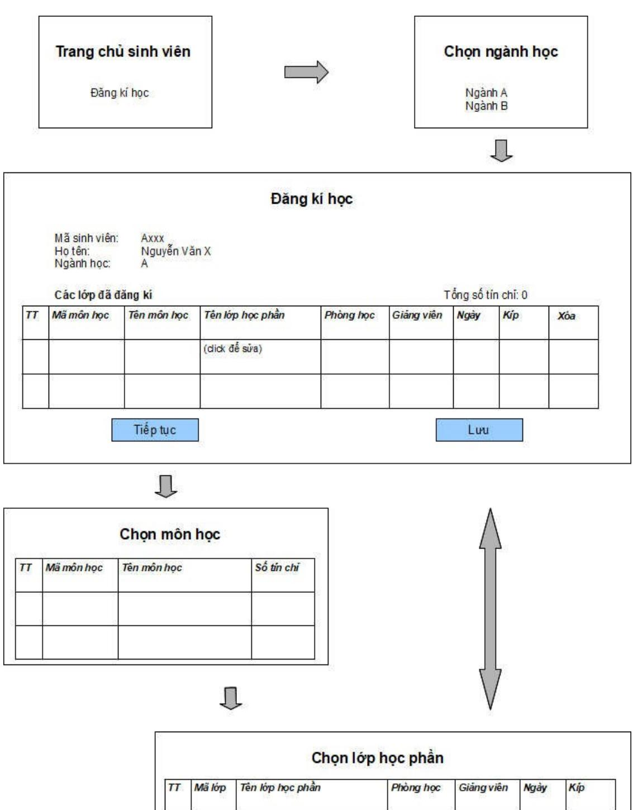  
Hình 6.1: Ví dụ về thiết kế giao diện module đăng ký học có lỗi

<table><tr><td rowspan=1 colspan=9>Chρn lóp hρc phån</td></tr><tr><td></td><td rowspan=1 colspan=1></td><td rowspan=1 colspan=1>Mã lop</td><td rowspan=1 colspan=1>TTM lóp Tên lóp hoc phn</td><td rowspan=1 colspan=1>Phöng hoc</td><td rowspan=1 colspan=1>Giang vien</td><td rowspan=1 colspan=1>Ngày</td><td rowspan=1 colspan=1></td><td rowspan=1 colspan=1></td></tr><tr><td></td><td rowspan=1 colspan=1></td><td rowspan=1 colspan=1></td><td rowspan=1 colspan=1></td><td rowspan=1 colspan=1></td><td rowspan=1 colspan=1></td><td rowspan=1 colspan=1></td><td rowspan=1 colspan=1></td><td rowspan=1 colspan=1></td></tr><tr><td></td><td rowspan=1 colspan=1></td><td rowspan=1 colspan=1></td><td rowspan=1 colspan=1></td><td rowspan=1 colspan=1></td><td rowspan=1 colspan=1></td><td rowspan=1 colspan=1></td><td rowspan=1 colspan=1></td><td rowspan=1 colspan=1></td></tr></table>

Một số vấn đề và câu hỏi chi tiết cần trao đổi như sau:

1. Thiết kế giao diện Đăng kí học: So với đặc tả, thiếu: chọn thông tin kì học muốn đăng kí, cột sĩ số tối đa, cột sĩ số hiện tại. Nên bổ sung button đóng màn hình hoặc quay về màn hình chính.   
2. Thiết kế giao diện Chọn môn học: So với đặc tả, thiếu cột mô tả. Nên bổ sung button đóng màn hình hoặc quay về màn hình chính.   
3. Thiết kế Giao diện Chọn lớp học phần: So với đặc tả, thiếu cột sĩ số tôi đa, sĩ số hiện tại. Nên bổ sung button đóng màn hình hoặc quay về màn hình chính.   
4. Thiết kế giao diện Chọn môn học: so với đặc tả, thiếu thông tin chọn học kì, thiếu cột mô tả. Nên bổ sung button đóng màn hình hoặc quay về màn hình chính.   
5. Thiết kế giao diện Chọn lớp học phần: so với đặc tả, thiếu cột sĩ số thực, phòng học, ngày học, kíp học. Nên bổ sung button đóng màn hình hoặc quay về màn hình chính, bổ sung thông tin về môn học.

Ví dụ 2: trường hợp giao diện modul nhập điểm được thiết kế như dưới đây

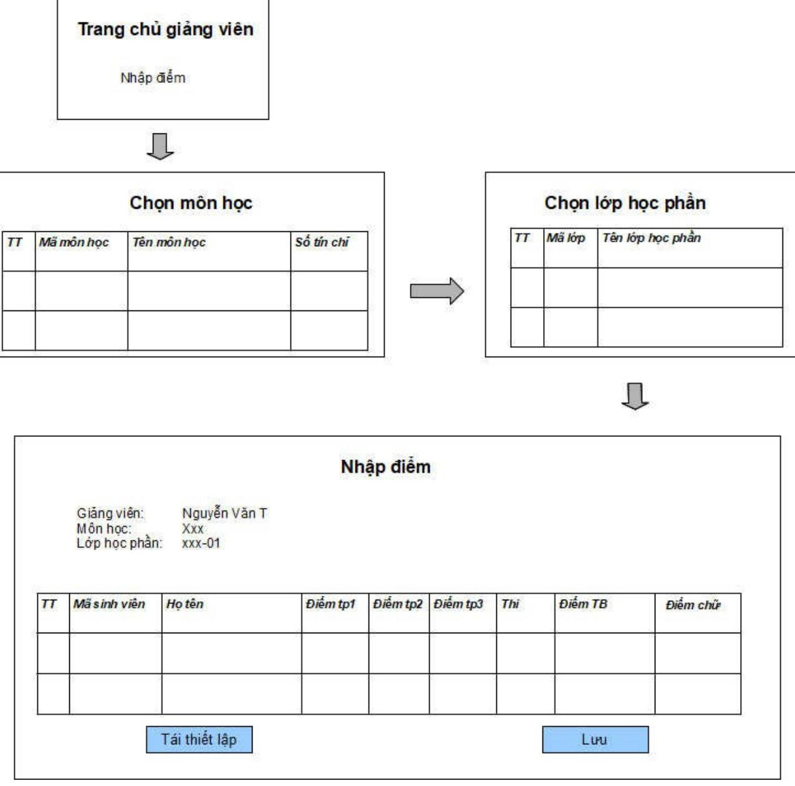  
Hình 6.2: Ví dụ về thiết kế giao diện modul nhập điểm lỗi

Với thiết kế như trên, một số vấn đề cần trao đổi như sau:

1. Thiết kế giao diện Nhập điểm: o Nên bổ sung button đóng màn hình hoặc quay về màn hình chính, bổ sung thông tin học kì. o Nút “Tái thiết lập” chưa được mô tả về chức năng, tái thiết lập lại toàn bộ về chưa nhập hay chỉ những sinh viên vừa nhập ở lần này?

2. Thiết kế giao diện Điểm môn học của sinh viên: so với phân tích, thiếu dòng TB Môn, Điểm chữ, Điểm hệ 4.

# 6.1.4 Rà soát code

Bảng dưới là một Checklist code mẫu sử dụng khi rà soát code.

Bảng 6.5: Checklist cho rà soát code   

<table><tr><td rowspan=1 colspan=1>Mã</td><td rowspan=1 colspan=1>Câu hói</td><td rowspan=1 colspan=1>Y/N/NA</td><td rowspan=1 colspan=1>Ghi chú</td></tr><tr><td rowspan=1 colspan=1>1</td><td rowspan=1 colspan=1>Dã có coding guide chua?</td><td rowspan=1 colspan=1></td><td rowspan=1 colspan=1></td></tr><tr><td rowspan=1 colspan=1>2</td><td rowspan=1 colspan=1>Code có thê ty tài liu không? (inline document)</td><td rowspan=1 colspan=1></td><td rowspan=1 colspan=1></td></tr><tr><td rowspan=1 colspan=1>3</td><td rowspan=1 colspan=1>Các quy uóc dt tên có phù hop vói ké hoach quán lý cáu hinhkhông?</td><td rowspan=1 colspan=1></td><td rowspan=1 colspan=1></td></tr><tr><td rowspan=1 colspan=1>4</td><td rowspan=1 colspan=1>Code dã dugc dinh dang dúng chua?</td><td rowspan=1 colspan=1></td><td rowspan=1 colspan=1></td></tr><tr><td rowspan=1 colspan=1>5</td><td rowspan=1 colspan=1>Có mt tâp hop các hàm chung dugc viét mà dê tránh viéttrùng hàm?</td><td rowspan=1 colspan=1></td><td rowspan=1 colspan=1></td></tr><tr><td rowspan=1 colspan=1>6</td><td rowspan=1 colspan=1>Có bát ky code du thùa hoc rác?</td><td rowspan=1 colspan=1></td><td rowspan=1 colspan=1></td></tr><tr><td rowspan=1 colspan=1>7</td><td rowspan=1 colspan=1>Có bát ky lable nào không dugc tham chiéu?</td><td rowspan=1 colspan=1></td><td rowspan=1 colspan=1></td></tr><tr><td rowspan=1 colspan=1>8</td><td rowspan=1 colspan=1>Con tro dã duoc dt thành NULL nêu cân thiét?</td><td rowspan=1 colspan=1></td><td rowspan=1 colspan=1></td></tr><tr><td rowspan=1 colspan=1>9</td><td rowspan=1 colspan=1>Con trò không trò tói vùng ngoài pham vi b nhó?</td><td rowspan=1 colspan=1></td><td rowspan=1 colspan=1></td></tr><tr><td rowspan=1 colspan=1>10</td><td rowspan=1 colspan=1>Có phái tát cà các chi só máng nàm trong giói han?</td><td rowspan=1 colspan=1></td><td rowspan=1 colspan=1></td></tr><tr><td rowspan=1 colspan=1>11</td><td rowspan=1 colspan=1>Có phái tát cà các chí só mng dugc khói tao chính xác?</td><td rowspan=1 colspan=1></td><td rowspan=1 colspan=1></td></tr><tr><td rowspan=1 colspan=1>12</td><td rowspan=1 colspan=1>Có phái tát cà các dièu kin r nhánh chính xác?</td><td rowspan=1 colspan=1></td><td rowspan=1 colspan=1></td></tr><tr><td rowspan=1 colspan=1>13</td><td rowspan=1 colspan=1>Tát cà các vòng lp có thé két thúc?</td><td rowspan=1 colspan=1></td><td rowspan=1 colspan=1></td></tr><tr><td rowspan=1 colspan=1>14</td><td rowspan=1 colspan=1>Dieu kin dé châm dút môt vòng lp có thuc té?</td><td rowspan=1 colspan=1></td><td rowspan=1 colspan=1></td></tr><tr><td rowspan=1 colspan=1>15</td><td rowspan=1 colspan=1>Không có mãu só bng O trong phép chia?</td><td rowspan=1 colspan=1></td><td rowspan=1 colspan=1></td></tr><tr><td rowspan=1 colspan=1>16</td><td rowspan=1 colspan=1>Có bát ky câu lnh nào dugc dt bên trong mt vòng lp cóthé duoc dt bên ngoài?</td><td rowspan=1 colspan=1></td><td rowspan=1 colspan=1></td></tr><tr><td rowspan=1 colspan=1>17</td><td rowspan=1 colspan=1>Có phàn nào trong code mà luông thyc hin không bao giòchay tói?</td><td rowspan=1 colspan=1></td><td rowspan=1 colspan=1></td></tr><tr><td rowspan=1 colspan=1>18</td><td rowspan=1 colspan=1>Có nhièu hon 3 câu lênh if lòng nhau?</td><td rowspan=1 colspan=1></td><td rowspan=1 colspan=1></td></tr><tr><td rowspan=1 colspan=1>19</td><td rowspan=1 colspan=1>Các tham só khai báo và khi cài dt cúa interface có gióngnhau?</td><td rowspan=1 colspan=1></td><td rowspan=1 colspan=1></td></tr><tr><td rowspan=1 colspan=1>20</td><td rowspan=1 colspan=1>Có bién nào khai báo mà không dugc sú dung?</td><td rowspan=1 colspan=1></td><td rowspan=1 colspan=1></td></tr><tr><td rowspan=1 colspan=1>21</td><td rowspan=1 colspan=1>Bô nhó duoc khói tao chính xác?</td><td rowspan=1 colspan=1></td><td rowspan=1 colspan=1></td></tr><tr><td rowspan=1 colspan=1>22</td><td rowspan=1 colspan=1>Bô nhó dng dã duoc câp phát duoc gii phóng khi két thúc?</td><td rowspan=1 colspan=1></td><td rowspan=1 colspan=1></td></tr><tr><td rowspan=1 colspan=1>23</td><td rowspan=1 colspan=1>Các truy vân trên table có thyc thi bng vic sú dung cácindex ?</td><td rowspan=1 colspan=1></td><td rowspan=1 colspan=1></td></tr><tr><td rowspan=1 colspan=1>24</td><td rowspan=1 colspan=1>Trang thái lōi dugc kiém tra sau mõi câu truy ván SQL?</td><td rowspan=1 colspan=1></td><td rowspan=1 colspan=1></td></tr><tr><td rowspan=1 colspan=1>25</td><td rowspan=1 colspan=1>Khóa dugc thyc hin truóc khi update khi cân thiét?</td><td rowspan=1 colspan=1></td><td rowspan=1 colspan=1></td></tr></table>

<table><tr><td rowspan=3 colspan=1>26</td><td rowspan=1 colspan=1>Các dièu kin sau dây dã dugc kiém tra trong biêu thúc:</td></tr><tr><td rowspan=1 colspan=1>a. Làm tròn só?</td></tr><tr><td rowspan=1 colspan=1>b. Có phép chia cho 0?</td></tr><tr><td rowspan=1 colspan=1>27</td><td rowspan=1 colspan=1>Các yêu cau vê thòi gian phán hôi s duoc dáp úng?</td></tr><tr><td rowspan=1 colspan=1>28</td><td rowspan=1 colspan=1>Có môt su thay thé tôt hon dê cai thin thòi gian phån hôi?</td></tr><tr><td rowspan=3 colspan=1>29</td><td rowspan=1 colspan=1>Có các kiêm tra sau day dã duoc thuc hin:</td></tr><tr><td rowspan=1 colspan=1>a. Kiêm tra báng và file trông?</td></tr><tr><td rowspan=1 colspan=1>b. Kiêm tra lōi IO?</td></tr><tr><td rowspan=1 colspan=1>30</td><td rowspan=1 colspan=1>Các thông báo lōi có rō ràng không? Các thông báo lōi có dàydü không?</td></tr><tr><td rowspan=1 colspan=1>31</td><td rowspan=1 colspan=1>Tát cà các dièu kin lδi duoc bt và xù 1y?</td></tr><tr><td rowspan=7 colspan=1>32</td><td rowspan=1 colspan=1>Trong các biêu thúc só hoc, có vân dê sau dã dugc xác dinh:</td></tr><tr><td rowspan=1 colspan=1>a. Thú ty xú lý không rō ràng?</td></tr><tr><td rowspan=1 colspan=1>b. Có cân cuôn ngang dé doc toàn bô biéu thúc không?</td></tr><tr><td rowspan=1 colspan=1>c. Tà các dáu ngoc don dã dóng dúng? Có dam bão dúngtrình ty xù ly không?</td></tr><tr><td rowspan=1 colspan=1>d. Làm tròn só duçc thyc hin cùng vói các biéu thúc?</td></tr><tr><td rowspan=1 colspan=1>e. Phép chia thuc hin cùng vói biéu thúc khác?</td></tr><tr><td rowspan=1 colspan=1>f. Có các biêu thúc sú dung tryc tiép các truòng trong bång otrong bieu thúc?</td></tr><tr><td rowspan=5 colspan=1>33</td><td rowspan=1 colspan=1>Trong biéu thúc quan h, các vân dè sau càn dugc xác dinh:</td></tr><tr><td rowspan=1 colspan=1>a. So sánh cùng kiêu dū liu?</td></tr><tr><td rowspan=1 colspan=1>b. Có nhièu hon môt kêt quà cho môt biéu thúc?</td></tr><tr><td rowspan=1 colspan=1>c. Biéu thúc có phuc vu cho muc dích mà nó duoc sú dung?</td></tr><tr><td rowspan=1 colspan=1>d. Có cân thanh cuôn ngang dé doc toàn bô biéu thúc?</td></tr><tr><td rowspan=6 colspan=1>34</td><td rowspan=1 colspan=1>Trong biéu thúc logic, các vân dè sau cân dugc xác dinh:</td></tr><tr><td rowspan=1 colspan=1>a. Biéu thúc logic có phuc vu cho mc dích mà nó duęc súdung?</td></tr><tr><td rowspan=1 colspan=1>b. Mōi biêu thúc quan h sù dung kêt quá là true hoc false?</td></tr><tr><td rowspan=1 colspan=1>c. Mōi biéu thúc quan h dugc dt bên trong ngoc don?</td></tr><tr><td rowspan=1 colspan=1>d. Tai bât ky thòi diém nào chi có hai biu thúc quan h dugcso sánh?</td></tr><tr><td rowspan=1 colspan=1>e. Có càn thanh cun ngang dé xem dugc toàn bô biéu thúc?</td></tr><tr><td rowspan=3 colspan=1>35</td><td rowspan=1 colspan=1>Trong các hàm sú dung file và table, các vân dè sau cân duęcxác dinh:</td></tr><tr><td rowspan=1 colspan=1>a. Có table hay file nào duoc mó sóm hon so vói yêu cãu?</td></tr><tr><td rowspan=1 colspan=1>b. Có báng hay file nào vn mó khi két thúc hàm?</td></tr><tr><td rowspan=4 colspan=1>36</td><td rowspan=1 colspan=1>Trong khai báo bién, các vân dè sau càn dugc xác dinh:</td></tr><tr><td rowspan=1 colspan=1>a. Tát các các bién duęc khai báo là toàn cuc hoc tnh cóthuc su càn phài là toàn cuc hoc tinh không?</td></tr><tr><td rowspan=1 colspan=1>b. Có bién nào không cân thiét dugc khai báo không?</td></tr><tr><td rowspan=1 colspan=1>c. Có tên bién nào bi xung dôt vói tù khóa cúa ngôn ngū lâp</td></tr></table>

<table><tr><td rowspan="2"></td><td>trình duąc sú dung không?</td><td></td><td></td></tr><tr><td>d. Có bát kì hard coding nào trong code không?</td><td></td><td></td></tr></table>

# 6.2. THỰC HIỆN TEST CHỨC NĂNG

Việc thực hiện test chức năng nhằm đảm bảo các chức năng của hệ thống hoạt động theo đúng yêu cầu của đặc tả.

Quy trình tiến hành các bước như sau:

• Bước 1: Xây dựng checklist các nội dung cần test cho từng chức năng (tuỳ chọn).   
• Bước 2: Thực hiện viết test cases ◦ GUI (giao diện) ◦ chức năng ◦ luồng, nghiệp vụ ◦ khác   
• Bước 3: Thực hiện chuẩn bị data test (nếu cần)   
Bước 4: thực hiện test và ghi nhận kết quả pass/false. Trường hợp false cần mô tả rõ lỗi và trao đổi với Lập trình viên để sửa.

Ta áp dụng với hệ thống Quản lí đăng kí tín chỉ với các bước 1,2,3. Riêng Bước 4, ta cần có hệ thống chạy được thì mới thực hiện được.

Bước 1: xây dựng checklist chung   
Bảng 6.6: Checklist test case chức năng   

<table><tr><td colspan="1" rowspan="1"></td><td colspan="1" rowspan="1">Question</td></tr><tr><td colspan="1" rowspan="9">Chung</td><td colspan="1" rowspan="1">Giao din nguòi dùng có dúng vói prototype không?</td></tr><tr><td colspan="1" rowspan="1">Danh sách menu và màn hình có thóng nhát không?</td></tr><tr><td colspan="1" rowspan="1">Các link html có hoat dng không?</td></tr><tr><td colspan="1" rowspan="1">Tát cà các cúa sò dèu có thé truy câp tù toolbar?</td></tr><tr><td colspan="1" rowspan="1">Tát cà các trang web/cúa sô dèu có thê truy câp tù menu?</td></tr><tr><td colspan="1" rowspan="1">Các màn hình dugc goi tù button có hién thi dúng không?</td></tr><tr><td colspan="1" rowspan="1">Các label, textbox, combobox, etc có dúng font chū, cō chū, màu chūtheo yêu câu không?</td></tr><tr><td colspan="1" rowspan="1">Cn lè, dô rông, khoáng cách có dông bô và dúng theo yêu càu không?</td></tr><tr><td colspan="1" rowspan="1">Dū liu kiéu chū cn lè trái?</td></tr><tr><td colspan="1" rowspan="19"></td><td colspan="1" rowspan="1">Dū liu kiêu sô cn lê phái?</td></tr><tr><td colspan="1" rowspan="1">Các form có duąc bô trí hop lý và dê sù dung không?</td></tr><tr><td colspan="1" rowspan="1">Nêu các phím tt duçc sù dung, các phím tát duçc gán có hoat dngdúng không?</td></tr><tr><td colspan="1" rowspan="1">Màn hinh KHÔNG có lōi chính tà, câu trúc câu, ngū pháp?</td></tr><tr><td colspan="1" rowspan="1">Néu các chū viét tát dugc sù dung, nó có thông nhât trong tát cà cácgiao din không? Nguòi dùng có hiéu duoc không?</td></tr><tr><td colspan="1" rowspan="1">Dinh dang só, ngày tháng, thòi gian có nhát quán không?</td></tr><tr><td colspan="1" rowspan="1">Có hién thi mô tà khi di chuyén chut vào tooltip không?</td></tr><tr><td colspan="1" rowspan="1">Néu có tooltip, nó có ý nghãa hoc có hūu ích không?</td></tr><tr><td colspan="1" rowspan="1">Có mt button hoc check box dugc xét mc dinh chua?</td></tr><tr><td colspan="1" rowspan="1">Con tró di chuyén làn luçt theo thú ty: tù trái qua phi, tù trên xuóngduói khi nhán Tab liên tuc?</td></tr><tr><td colspan="1" rowspan="1">Con trò di chuyen làn lugt theo thú ty: tù duói lên trên, tù phi qua tráikhi nhán Shift-Tab ?</td></tr><tr><td colspan="1" rowspan="1">Néu chut không focus vào button nào thì dã thyc hin chúc nng cúabutton chính khi nhán Enter chua?</td></tr><tr><td colspan="1" rowspan="1">Néu dang focus vào 1 button thì dã thyc hin chúc nng cúa button khinhán Enter chua?</td></tr><tr><td colspan="1" rowspan="1">Màn hinh thu nho, phóng to tuong úng và không bi vō giao din khinhán Ctrl - và Ctrl + không?</td></tr><tr><td colspan="1" rowspan="1">Các truòng bát buc có dau * chua?</td></tr><tr><td colspan="1" rowspan="1">Thông tin bån ghi hién thi trên giao din có dúng vói thông tin bán ghidugc luu trong Database không?</td></tr><tr><td colspan="1" rowspan="1">Kiém tra thay doi ngôn ngū, ngôn ngū thay doi có dúng ni dungkhông?</td></tr><tr><td colspan="1" rowspan="1">Mã captcha có hoat dng hay không?</td></tr><tr><td colspan="1" rowspan="1">Các truòng KHÔNG cho phép nhâp dū liu dã cùng màu theo dúng yêucàu chura?</td></tr><tr><td colspan="1" rowspan="7">Validatecáctruòng dū liu</td><td colspan="1" rowspan="1">Dói vói các kiu dū liu kiêu text, string, etc:</td></tr><tr><td colspan="1" rowspan="1">Kiém tra max length có dúng yêu càu không?</td></tr><tr><td colspan="1" rowspan="1">Néu truòng dū liu có phân bit chū hoa và chū thuòng, dū liu nhpvào dã thoá mãn chua?</td></tr><tr><td colspan="1" rowspan="1">Néu truòng dū liu KHÔNG phân bit chū hoa và chū thuòng, dū liunhâp vào dã thoá mãn chua?</td></tr><tr><td colspan="1" rowspan="1">Néu truòng dū liu cho phép null, dã thoá mãn chua?</td></tr><tr><td colspan="1" rowspan="1">Néu truòng dū liu KHÔNG cho phép null, dã thoá mãn chua?</td></tr><tr><td colspan="1" rowspan="1">Néu truòng dū liu cho phép các ký ty dc bit, dū liu nhp vào dãthoá mãn chua?</td></tr></table>

<table><tr><td rowspan=1 colspan=1>Néu truòng dū liu KHNG cho phép các ký tu dc bit, dū liu nhâpvào dã thoá mn chua?</td></tr><tr><td rowspan=1 colspan=1>Dói vói các kiu dū liu integer, float, double, etc:</td></tr><tr><td rowspan=1 colspan=1>Kiém tra max length có dúng yêu càu không?</td></tr><tr><td rowspan=1 colspan=1>Kiém tra các giá tri biên có dúng yêu càu không?</td></tr><tr><td rowspan=1 colspan=1>Néu truòng dū liu cho phép các ký ty dc bit, dū liu nhâp vào dãthoà mãn chua?</td></tr><tr><td rowspan=1 colspan=1>Néu truòng dū liu KHÔNG cho phép các ký tu dc bit, dū liu nhâpvào dã thoà mãn chua?</td></tr><tr><td rowspan=1 colspan=1>Néu truòng dū liu cho phép null, dã thoà mãn chua?</td></tr><tr><td rowspan=1 colspan=1>Néu truòng dū liu KHÔNG cho phép null, dã thoà mn chua?</td></tr><tr><td rowspan=1 colspan=1>Néu truòng dū liu cho phép nhp ký ty chū, dū liu nhap vào dã thomãn chura?</td></tr><tr><td rowspan=1 colspan=1>Néu truòng dū liu KHÔNG cho phép nhp dū liu chū, dū liu nhâpvào dã thoá mãn chua?</td></tr><tr><td rowspan=1 colspan=1>Kiém tra lōi chia cho 0?</td></tr><tr><td rowspan=1 colspan=1>Dói vói kiêu d liu time, date:</td></tr><tr><td rowspan=1 colspan=1>Kiém tra max length có dúng yêu càu không?</td></tr><tr><td rowspan=1 colspan=1>Kiém tra ngày, tháng, nm, giò, phút, giay có hop l không?</td></tr><tr><td rowspan=1 colspan=1>Néu truòng dū liu cho phép các ky tu dc bit, dū liu nhp vào dãthoá mãn chua?</td></tr><tr><td rowspan=1 colspan=1>Néu truòng dū liu KHNG cho phép các ky ty dc bit, dū liu nhâpvào dã thoá mãn chua?</td></tr><tr><td rowspan=1 colspan=1>Néu truòng dū liu cho phép null, dã thoà mãn chua?</td></tr><tr><td rowspan=1 colspan=1>Néu truòng dū liu KHÔNG cho phép null, dã thoà mãn chua?</td></tr><tr><td rowspan=1 colspan=1>Néu truòng dū liu cho phép nhap ký ty chū, dū liu nhâp vào dã thoàmãn chua?</td></tr><tr><td rowspan=1 colspan=1>Có cho phép nguòi dùng kích chon ngày không?</td></tr><tr><td rowspan=1 colspan=1>Có cho phép nguòi dùng nhâp ngày không?</td></tr><tr><td rowspan=1 colspan=1>Néu truòng dū liu KHÔNG cho phép nhâp dū liu chū, dū liu nhâpvào dã thoá mãn chua?</td></tr><tr><td rowspan=1 colspan=1>Kiém tra format có dúng yêu càu không?</td></tr><tr><td rowspan=1 colspan=1>Dói vói kiu dū liu file:</td></tr><tr><td rowspan=1 colspan=1>Dám bão giói han tói thiéu file không?</td></tr><tr><td rowspan=1 colspan=1>Dám bà giói han tói da file không?</td></tr><tr><td rowspan=1 colspan=1>Cho phép upload nhièu file môt lúc không?</td></tr><tr><td rowspan=1 colspan=1>Có cho phép null không?</td></tr><tr><td rowspan=1 colspan=1>Có yêu càu loai file nào duoc phép upload không?</td></tr><tr><td rowspan=1 colspan=1>Thông báo lōi chung cúa cà du án có thóng nhát không?</td></tr><tr><td rowspan=1 colspan=1>Thông báo lōi dã báo lōi dúng chua?</td></tr></table>

<table><tr><td rowspan=6 colspan=1></td><td rowspan=1 colspan=1>Thông báo lōi viét bng ngôn ngū ty nhiên, d hiêu cho nguòi dùngchua?</td></tr><tr><td rowspan=1 colspan=1>Thông báo lōi không dô lōi cho nguòi dùng và ggi ý cách sùa lōi?</td></tr><tr><td rowspan=1 colspan=1>Khi có mt hành dng nh huöng dén h thông (sùa, xoá) dugc thuchin, nguòi dùng có duoc hoi lai dé xác nhân không?</td></tr><tr><td rowspan=1 colspan=1>Thông báo cho ngoai lê cúa các dièu kin</td></tr><tr><td rowspan=1 colspan=1>Thông báo cho dàu vào không hop lê</td></tr><tr><td rowspan=1 colspan=1>Thông báo cho dièu kin biên</td></tr><tr><td rowspan=2 colspan=1>Các trang thái</td><td rowspan=1 colspan=1>Các trang thái có hién thi dúng không?</td></tr><tr><td rowspan=1 colspan=1>Màu trang thái có khác nhau dé nguòi dùng d phân bit không?</td></tr><tr><td rowspan=1 colspan=2>Database</td></tr><tr><td rowspan=4 colspan=1>Thêm mói</td><td rowspan=1 colspan=1>Khi thêm mói thành công mt bn ghi thì nó hin thi duói danh sáchbån ghi không?</td></tr><tr><td rowspan=1 colspan=1>Khi thêm mói mt ban ghi bi thiéu nhūng truòng bt buc thì có cnhbáo dén nguòi dùng không ?</td></tr><tr><td rowspan=1 colspan=1>Khi thêm mói không thành công, bån ghi s không dugc luu vào DB?</td></tr><tr><td rowspan=1 colspan=1>Khi thêm mói thành công, bn ghi s dugc luu vào DB ?</td></tr><tr><td rowspan=3 colspan=1>Xóa</td><td rowspan=1 colspan=1>Truóc khi thyc hin mt thao tác nh huöng tói h thông (ví du xóa mtbån ghi), nguòi dùng có duoc yêu càu xác nhân không?</td></tr><tr><td rowspan=1 colspan=1>Khi xóa mt bàn ghi có liên quan dén mt bán ghi cúa mt bng khácthì dū liu tai bån ghi có liên quan có duoc câp nhât không?</td></tr><tr><td rowspan=1 colspan=1>Khi xóa thành công, bån ghi không bi xóa khöi DB mà chi thay dôitrang thái?</td></tr><tr><td rowspan=4 colspan=1>Súa</td><td rowspan=1 colspan=1>Khi bån ghi dugc süa bi duplicate vói bån ghi khác dã có trong hthóng thì có cånh báo cho nguòi dùng không?</td></tr><tr><td rowspan=1 colspan=1>Khi bån ghi dugc süa thành công có hién thi thông báo dén nguòi dùngkhông?</td></tr><tr><td rowspan=1 colspan=1>Khi súa mt bn ghi có liên quan dén mt bn ghi tai mt bng khác thìdū liu tai bn ghi có liên quan có duçc câp nhât không?</td></tr><tr><td rowspan=1 colspan=1>Khi bån ghi súa thành công, dū liu dugc update trong DB ?</td></tr><tr><td rowspan=4 colspan=1>Chung</td><td rowspan=1 colspan=1>Dã có co ché xù ly truy câp dōng thòi tói 1 bn ghi dé update?</td></tr><tr><td rowspan=1 colspan=1>Dã Rollback dū liu khi 1 giao dich không thành công?</td></tr><tr><td rowspan=1 colspan=1>Dã thyc hin trim space δ dau và cuôi truòng dū liu khi luu vào DBkhi nhâp giá tri text có giá tri space δ dàu và cuói ?</td></tr><tr><td rowspan=1 colspan=1>Các giá tri combobox có duoc luu duói dang id: 0, 1, 2..</td></tr><tr><td rowspan=1 colspan=2>Nghip vu</td></tr><tr><td rowspan=1 colspan=1></td><td rowspan=1 colspan=1>Dã phú hét các kich bån valids theo dc t?</td></tr><tr><td rowspan=1 colspan=1></td><td rowspan=1 colspan=1>Dã phú hét các kich bån invalids theo dc t?</td></tr><tr><td rowspan=1 colspan=1></td><td rowspan=1 colspan=1>Quy trình thuc hin dã tói uu só thao tác?</td></tr><tr><td rowspan=1 colspan=1></td><td rowspan=1 colspan=1>Quy trinh thuc hin có d hiéu, d dùng?</td></tr></table>

Bước 2: Thực hiện viết test cases   

<table><tr><td></td><td>Chúc nng/giao din có d chinh súa trong truòng hop nguòi dùng có nhu càu thay dōi/thêm mói?</td></tr></table>

Các nội dung chính của Test case bao gồm mô tả input (mục đích kiểm thử, các bước thực hiện, test data) và kết quả mong muốn.

Một lưu ý là một số test cases bên dưới không yêu data test (ví dụ: test giao diện, test hành động…), nhưng một số test case cần có data test (ví dụ: test case về chức năng…). Bản test case bên dưới đã mô tả các ràng buộc về data test ở cột Các bước thực hiện (Bảng 6.7…). Trong phạm vi case study ở tài liệu này, các ràng buộc khá đơn giản, việc xây dựng test data cụ thể có thể dễ dàng thực hiện theo mô tả ở Cột các bước thực hiện. Vì vậy, bảng Test case bên dưới sẽ không trình bày chi tiết test data, dành cho người học tự thực hiện.

# Module Đăng kí tín chỉ:

Bảng 6. 7: Hướng dẫn xây dựng Test case chức năng cho module Đăng kí tín chỉ

<table><tr><td colspan="1" rowspan="1">Mãtruònghop kiémthú</td><td colspan="1" rowspan="1">Muc    díchkiêm thü</td><td colspan="1" rowspan="1">Các buóc thyc hin</td><td colspan="1" rowspan="1">Kêt quá mong muôn</td></tr><tr><td colspan="1" rowspan="7">DKH_1</td><td></td><td></td><td></td></tr><tr><td colspan="3" rowspan="1">Chúc nng Dng ky hoc1.1</td></tr><tr><td colspan="3" rowspan="1">Precond: Sinh viên dã dng nhâp thành công, dang trong thòi gian sinh viên dugcphép        dng        kí        môn        hoc        dàu        hoc        kìChon Dng ký --&gt; Hién thi màn hinh Dng ký</td></tr><tr><td colspan="3" rowspan="1">Giao din (Phân này viét các truòng hgp kim thú cho giao din chung và cácgiao din cho các control)</td></tr><tr><td colspan="3" rowspan="1">Giaodinchung</td></tr><tr><td colspan="3" rowspan="1">Giao dinChρn ngànhhoc</td></tr><tr><td colspan="1" rowspan="1">Kiêm tra tôngthè giao dinmàn hinh</td><td colspan="1" rowspan="1">Kiêm tra vè bô cuc, font chū,chính tà, màu chū</td><td colspan="1" rowspan="1">Các label, textbox cùng font chūcō chū, cn lè trái, có dô dài,rng và khoång cách bng nhau,không          xô          lch.- Không có lōi vè chính tà, cáutrúc câu, ngū pháp trên màn hinh</td></tr><tr><td colspan="1" rowspan="7">DKH_2DKH_3DKH_4DKH_5DKH_6</td><td colspan="1" rowspan="1"></td><td colspan="1" rowspan="1"></td><td colspan="1" rowspan="1">- Form duęc bó trí hop lý và dsu dung</td></tr><tr><td colspan="1" rowspan="1">Kiém tra bócuc giao din</td><td colspan="1" rowspan="1">1. Kiém tra title cúa màn hinh2. Kiém tra focus cúa chuôt3. Kiêm tra hiën thi thông tincác truòng và button trên mànhinh</td><td colspan="1" rowspan="1">1. Hién thi title cüa chúc nng:Chon          ngành          hoc2. Focus dugc set vào truòngdàu tiên có thê edit3. Hién thi dày dú các truòng :+ Ngành hoc: Dropdownlist+ Ky hoc: Dropdownlist4.                              Button:+ Vào dng ký</td></tr><tr><td colspan="1" rowspan="1">Kiém tra giaodin khi thunhó, phóng to</td><td colspan="1" rowspan="1">1. Nhân phimCtrl2. Nhán phim Ctrl +</td><td colspan="1" rowspan="1">Màn hinh thu nho, phóng totuong úng và không bi vō giaodiên</td></tr><tr><td colspan="1" rowspan="1">Kiém tra thúty di chuyêntró trên mànhinh khi nhánphím Tab</td><td colspan="1" rowspan="1">Forcus vào màn hinh. NhánTab liên tuc</td><td colspan="1" rowspan="1">Con trò di chuyén làn luçt theothú ty: Tù phi qua trái, tù trênxuóng duói.</td></tr><tr><td colspan="1" rowspan="1">Kim tra thúty con trò dichuyênnguoc lai trênmàn hinh khinhân Shift-Tab</td><td colspan="1" rowspan="1">Forcus vào màn hinh. Nhánphím Shift-Tab liên tuc</td><td colspan="1" rowspan="1">Con tró di chuyên làn luçt theothú ty: tù duói lên trên, tù phiqua trái.</td></tr><tr><td colspan="1" rowspan="1">Kiém tra thuchin    chúcnng chínhcúa màn hinhkhi     nhánEnter</td><td colspan="1" rowspan="1">Nhán phím Enter</td><td colspan="1" rowspan="1">1. Néu chuôc ko focus vàobutton nào thì Thyc hin chúcnng cua button chính2. Néu dang focus vào 1 buttonthì s thyc hin chúc nng cúabutton</td></tr><tr><td colspan="3" rowspan="1">Giao   dinDng kí hoc</td></tr><tr><td colspan="1" rowspan="4">DKH_7DKH_8DKH_9DKH_10</td><td colspan="1" rowspan="1">Kiem tra tongthê giao dinmàn hinh</td><td colspan="1" rowspan="1">Kiem tra ve bo cuc, font chu,chính tà, màu ch</td><td colspan="1" rowspan="1">Cac label, textbox cung font chucō chū, cn lè trái, có dô dài,rng và khoång cách bng nhau,không           xô           lch.- Không có lōi vè chính tà, cáutrúc câu, ngū pháp trên màn hinh- Form duęc bó trí hop lý và dsú dung</td></tr><tr><td colspan="1" rowspan="1">Kiém tra bócuc giao din</td><td colspan="1" rowspan="1">1. Kiém tra title cúa màn hình2. Kiém tra focus cúa chuôt3. Kiém tra hién thi thông tincác truòng và button trên mànhinh</td><td colspan="1" rowspan="1">1. Hién thi title cúa chúc nng:Dng kí hoc2. Focus dugc set vào truòngdàu tiên có thé edit3. Hin thi dày dú các truòng :+ Mã SV: textview+ Ho tên: textview+ Ngành hoc: Textview+ Tông só tín chi: textview+ Các lóp dã dng ký: table++ TT, Mã môn hoc, Tên mônhoc, Tên lóp hoc phàn, Xemlich, Sa, Xoá4. Button:+ Table: Súa+ Table: Xoá+ Vè trang chú+ Tiép tuc+ Luu dng kí5. Hyperlink+ Tên lóp hoc phàn+ Xem lich</td></tr><tr><td colspan="1" rowspan="1">Kiém tra giaodin khi thunhó, phóng to</td><td colspan="1" rowspan="1">Nhan phim Ctrl2. Nhán phim Ctrl +</td><td colspan="1" rowspan="1">Màn hinh thu nhò, phóng totuong úng và không bi vō giaodin</td></tr><tr><td colspan="1" rowspan="1">Kiém tra thútu di chuyêntrò trên mànhinh khi nhánphím Tab</td><td colspan="1" rowspan="1">Forcus vào màn hinh. NhánTab liên tuc</td><td colspan="1" rowspan="1">Con trò di chuyen lan lugt theothú ty: Tù phi qua trái, tù trênxuóng duói.</td></tr><tr><td colspan="1" rowspan="5">DKH_11DKH_12DKH_13DKH_14</td><td colspan="1" rowspan="1">Kiém tra thúty con trò dichuyênngugc lai trênmàn hinh khinhán Shift-Tab</td><td colspan="1" rowspan="1">Forcus vào màn hình. Nhánphím Shift-Tab liên tuc</td><td colspan="1" rowspan="1">Con trò di chuyên làn lugt theothú ty: tù duói lên trên, tù phiqua trái.</td></tr><tr><td colspan="1" rowspan="1">Kiêm tra thuchin    chúcnng chínhcúa màn hinhkhi     nhánEnter</td><td colspan="1" rowspan="1">Nhân phím Enter</td><td colspan="1" rowspan="1">1. Néu chuôc ko focus vàobutton nào thì Thyc hin chúcnng   cúa   button   chính2. Néu dang focus vào 1 buttonthì s thyc hin chúc nng cuabutton</td></tr><tr><td colspan="3" rowspan="1">Giao  din:Chρn  mônhoc</td></tr><tr><td colspan="1" rowspan="1">Kiêm tra tôngthè giao dinmàn hinh</td><td colspan="1" rowspan="1">Kiém tra vè bô cuc, font chū,chính tá, màu chū</td><td colspan="1" rowspan="1">Các label, textbox cùng font chūcō chū, cn lè trái, có dô dài,rng và khoång cách bng nhau,không          xô          lch.- Không có lōi vè chính tà, cáutrúc câu, ngū pháp trên màn hinh- Form duęc bó trí hop lý và dsú dung</td></tr><tr><td colspan="1" rowspan="1">Kiêm tra bócuc giao din</td><td colspan="1" rowspan="1">1. Kiém tra title cúa màn hinh2. Kiěm tra focus cúa chuôt3. Kièm tra hiën thi thông tincác truòng và button trên mànhinh</td><td colspan="1" rowspan="1">1. Hién thi title cua chúc nng:Chon           môn          hoc2. Focus duçc set vào truòngdàu tiên có thé edit: Chon mônhoc3. Hin thi dày dú các truòng :+Table: TT, Mã Môn hąc, Tênmôn hoc, Só tín chi, Chon4.                              Button+      Chçn:     Tick     TT+             Quay             lai5.                          Hyperlink+ Mã môn hoc</td></tr></table>

<table><tr><td>DKH_15</td><td colspan="2">Kiêm tra giao din khi thu</td><td>Nhân phím Ctrl 2. Nhán phim Ctrl + din</td><td>Màn hinh thu nhó, phóng to tuong úng và không bi vō giao</td></tr><tr><td></td><td colspan="2">nhò, phóng to Kiém tra thú tu di chuyên</td><td>Forcus vào màn hinh. Nhán Tab liên tuc</td><td>Con trò di chuyên làn luot theo thú ty: Tù phai qua trái, tù trên xuóng durói.</td></tr><tr><td>DKH_16</td><td colspan="2">tró trên màn hinh khi nhán phím Tab Kiêm tra thú tu con trò di chuyên</td><td>Forcus vào màn hinh. Nhán phím Shift-Tab liên tuc</td><td>Con tró di chuyên làn luot theo thú ty: tù duói lên trên, tù phài qua trái.</td></tr><tr><td>DKH_17 DKH_18</td><td colspan="2">nguc lai trên màn hinh khi nhán Shift- Tab Kiêm tra thuc hin chúc nng chinh</td><td>Nhán phím Enter</td><td>1. Néu chuôc ko focus vào button nào thì Thyc hin chúc nng cüa buttonchinh</td></tr><tr><td rowspan="3"></td><td colspan="2">cúa màn hinh khi nhán Enter Giao din:</td><td colspan="2">2. Néu dang focus vào 1 button thì s thyc hin chúc nng cua button</td></tr><tr><td colspan="2">Chon lóp hoc phân Kiêm tra tông thè giao din</td><td>Kiêm tra vè bô cuc, font chū, Các label, textbox cùng font chū cō ch, cn lè trái, có dô dài,</td></tr><tr><td colspan="2">màn hinh DKH_19</td><td>chính tà, màu chū rng và khoång cách bng nhau, không</td></tr><tr><td rowspan="2">DKH_20</td><td rowspan="2">Kiêm tra bô cuc giao din các truòng và button trên màn hinh</td><td rowspan="2">1. Kiém tra title cúa màn hinh 2. Kiém tra focus cúa chut 3. Kiém tra hin thi thông tin</td><td rowspan="2">- Không có lōi vè chính tà, cáu trúc câu, ngū pháp trên màn hinh - Form dugc bó trí hop lý và d sür dung 1. Hién thi title cúa chúc nng: phàn</td></tr><tr><td>Chon lóp hoc 2. Hién thi dày dú các truòng : +Table: TT, Mã lóp, Tên lóp hąc</td></tr></table>

<table><tr><td></td><td colspan="2"></td><td>+ Chon môn hoc: Tick TT + Quay lai</td></tr><tr><td>DKH_21</td><td>Kiêm tra giao din khi thu nhó, phóng to Kiêm tra thú tu di chuyen</td><td>1. Nhân phím Ctrl 2. Nhán phim Ctrl + Forcus vào màn hinh. Nhán</td><td>Màn hinh thu nho, phóng to tuong úng và không bi vō giao diên Con tro di chuyen làn lugt theo thú ty: Tù phi qua trái, tù trên</td></tr><tr><td>DKH_22</td><td>trò trên màn hinh khi nhán phím Tab Kiém tra thú</td><td>Tab liên tuc Forcus vào màn hinh. Nhán</td><td>xuóng duói. Con trò di chuyen làn lugt theo</td></tr><tr><td>DKH_23</td><td>tu con trò di chuyên ngugc lai trên màn hinh khi nhán Shift- Tab</td><td>phím Shift-Tab liên tuc</td><td>thú ty: tù duói lên trên, tù phài qua trái.</td></tr><tr><td rowspan="3">DKH_24</td><td>Kiém tra thuc hin chúc nng chính cúa màn hinh khi nhán</td><td>Nhân phím Enter</td><td>1. Néu chuôc ko focus vào button nào thì Thyc hin chúc nng cúa button chính 2. Néu dang focus vào 1 button thì s thyc hin chúc nng cua</td></tr><tr><td>Enter Giao din: Lich hoc Kiêm tra tông</td><td>Kiém tra vè bó cuc, font chū,</td><td>button Các label, textbox cùng font chū</td></tr><tr><td>thè giao din màn hinh</td><td>chính tà, màu ch</td><td>cō ch, cn lè trái, có dô dài, rng và khoång cách bng nhau, không xô lch. - Không có lōi vè chính tà, cáu trúc câu, ngū pháp trên màn hinh - Form dugc bó trí hop ly và d sur dung</td></tr><tr><td colspan="1" rowspan="9">DKH_26DKH_27DKH_28DKH_29DKH_30DKH_31DKH_32</td><td colspan="1" rowspan="1">Kiem"tra"bocuc giao din</td><td colspan="1" rowspan="1">. Kiem tra titie cua man hinh2. Kièm tra focus cúa chut3. Kim tra hiěn thi thông tincác truòng và button trên mànhinh</td><td colspan="1" rowspan="1">1. Hien thi title cua chuc nang:Lich                               hoc2. Hin thi dày dù các truòng :+Lóp     hçc    phàn+ Table: TT, Tuàn, Thú, Kíp,Giäng   viên,Phòng hoc4.                              Button+ Quay lai</td></tr><tr><td colspan="1" rowspan="1">Kim tra giaodin khi thunhó, phóng to</td><td colspan="1" rowspan="1">1.Nhán phim Ctrl2. Nhán phim Ctrl +</td><td colspan="1" rowspan="1">Màn hinh thu nhö, phóng totuong úng và không bi vō giaodiên</td></tr><tr><td colspan="1" rowspan="1">Kiêm tra thútu di chuyêntró trên mànhinh khi nhánphím Tab</td><td colspan="1" rowspan="1">Forcus vào màn hinh. NhánTab liên tuc</td><td colspan="1" rowspan="1">Con trò di chuyen làn luot theothú ty: Tù phai qua trái, tù trênxuóng durói.</td></tr><tr><td colspan="1" rowspan="1">Kiém tra thúty con trô dichuyênnguoc lai trênmàn hinh khinhánShift-Tab</td><td colspan="1" rowspan="1">Forcus vào màn hinh. Nhánphím Shift-Tab liên tuc</td><td colspan="1" rowspan="1">Con trò di chuyên làn lugt theothú ty: tù duói lên trên, tù phiqua trái.</td></tr><tr><td colspan="1" rowspan="1">Kiêm tra thychin   chúrcnng chinhcúa màn hinhkhi    nhánEnter</td><td colspan="1" rowspan="1">Nhân phím Enter</td><td colspan="1" rowspan="1">1. Néu chuc ko focus vàobutton nào thì Thyc hin chúcnng cua button chinh2. Néu dang focus vào 1 buttonthì s thyc hin chúc nng cuabutton</td></tr><tr><td colspan="3" rowspan="1">Validate               các               truròng               thông                tinChú ś: Khi validate thông tin môt truòng, tát c các truòng khác hop lê</td></tr><tr><td colspan="3" rowspan="1">Truròng Ngành hąc, Dropdownlist</td></tr><tr><td colspan="1" rowspan="1">Kiém tra giátri mc dinh</td><td colspan="1" rowspan="1">1. Trên màn hinh Dng ký2. Kim tra giá tri mãc dinhcúa truòng: Ngành hoc</td><td colspan="1" rowspan="1">Giá tri mc dinh cúa Ngành: détróng</td></tr><tr><td colspan="1" rowspan="1">Kiêm     tradanh  sáchngành hoc</td><td colspan="1" rowspan="1">1. Focus chut vào dropdownlist ngành hoc</td><td colspan="1" rowspan="1">H thóng hiên thi danh sách cácngành hoc</td></tr></table>

<table><tr><td rowspan="2">DKH_33</td><td colspan="4">Truòng Hąc kì, Dropdown list</td></tr><tr><td>Kiém tra giá tri mc dinh</td><td></td><td>1. Trên màn hinh Dng ký 2. Kim tra giá tri mc dinh cúa truòng: Hoc kì</td><td>Giá tr mc dinh ca hoc kì: Hρc kì hin tai</td></tr><tr><td>DKH_34</td><td>Kiêm danh hoc kì</td><td>tra sách</td><td>1. Focus chut vào dropdown list ngành hoc</td><td>H thóng hiěn thi danh sách các hoc kì</td></tr><tr><td>Kiêm</td><td colspan="2">Kiém tra button, link tra Kiêm</td><td>tra cho phép click</td><td>Luôn cho phép click button Vào</td></tr><tr><td>DKH_35</td><td>button dng ký Kiêm button</td><td>Vào tra Luu</td><td>button Vào dng ký Truòng hop chua có môn hoc durgc dng kí</td><td>dng ky Không cho phép click nút Luu môn hoc</td></tr><tr><td>DKH_36</td><td>dng kí Kiêm</td><td>tra</td><td>Kiém tra cho phép click button Luu môn hoc Truòng hop dã chon dugc</td><td>Cho phép click nút Luu môn hoc</td></tr><tr><td>DKH_37</td><td>button dng kí Kiém</td><td>Luu môn tra</td><td>hoc Kiêm tra cho phép click button Luu môn hoc Truòng hop chua có môn hoc</td><td>Không cho phép click nút</td></tr><tr><td>DKH_38</td><td>button Süa/Xóa Kiêm</td><td>durgc tra</td><td>dng kí Kiêm tra cho phép click button Sa/Xóa Truòng hop dã chon duoc</td><td>Sūa/Xóa Cho phép click nút Sa/Xóa</td></tr><tr><td>DKH_39</td><td>button Süa/Xóa Kiém</td><td></td><td>môn hoc Kim tra cho phép click button Sa/Xóa Click vào link Dng kí hoc tai</td><td>H thông chuyên huóng dén</td></tr><tr><td>DKH_40</td><td>click Dng kí hoc Kiém</td><td>tra Link tra</td><td>tab menu Truòng hop</td><td>màn hinh dng kí môn hoc Cho phép click nút Chon môn</td></tr><tr><td>DKH_41</td><td>button Chn môn hoc</td><td>khác</td><td>- Trong thòi gian dng kí - Môn hoc mong muón ko trùng thòi gian vói môn hoc -CL &gt; 0</td><td>hoc</td></tr><tr><td>DKH_42</td><td>Kiêm button</td><td>tra Chon dng kí</td><td>Truòng hop ngoài thòi gian</td><td>H thóng hién thi ngoài thòi gian dng ky</td></tr></table>

<table><tr><td colspan="1" rowspan="6">DKH_43DKH_44DKH_45</td><td colspan="1" rowspan="1">môn hoc</td><td colspan="1" rowspan="1"></td><td colspan="1" rowspan="1">Không cho phép click chn mônhoc</td></tr><tr><td colspan="1" rowspan="1">Kiêm     trabutton Chonmôn hoc</td><td colspan="1" rowspan="1">Truòng hop môn hoc mongmuón chon có tiét bát dàu vàsó luong tiét trùng vóikhoång thòi gian cüa mônhoc khác</td><td colspan="1" rowspan="1">Không cho phép click chon mônhoc</td></tr><tr><td colspan="1" rowspan="1">Kiêm     trabutton  Chonmôn hoc</td><td colspan="1" rowspan="1">Truòng hop môn hąc còn lai:CL = Hét</td><td colspan="1" rowspan="1">Không cho phép click chon mônhoc</td></tr><tr><td colspan="1" rowspan="2">Kiêm tra bóchon   mônhoc</td><td colspan="1" rowspan="2">Truòng hop môn hρc dã duęcchn</td><td colspan="1" rowspan="1">Cho phép bó chn môn hoc</td></tr><tr><td colspan="1" rowspan="1"></td></tr><tr><td colspan="3" rowspan="1">Chúc nng</td></tr><tr><td colspan="1" rowspan="1"></td><td colspan="1" rowspan="1">Màn  hìnhDng kí hoc</td><td colspan="2" rowspan="1"></td></tr><tr><td colspan="1" rowspan="1">DKH_46</td><td colspan="1" rowspan="1">Kiém tra hiênthi     dúngthông tin -truòng hopchura dng kí</td><td colspan="1" rowspan="1">1. Nhán vào button [Dng kíhoc] tai màn 'Trang chú sinhviên'2. Chon ngành hąc M tai màn'Chon      ngành      hoc'3. Chon hoc ky N tù danhsách</td><td colspan="1" rowspan="1">Hién thi dúng thông tin sinh viênHiěn thi dúng thông tin ngànhhocTông só tín chi = 0Danh sách lóp dng kí là tróng</td></tr><tr><td colspan="1" rowspan="1">DKH_47</td><td colspan="1" rowspan="1">Kiêm tra hiénthi     dúngthông tin -truòng hopda dng kí</td><td colspan="1" rowspan="1">1. Nhán vào button [Dng kíhąc] tai màn 'Trang chú sinhviên'2. Chn ngành hoc M tai màn'Chon      ngành      hoc'3. Chon hąc ky N tù danhsách</td><td colspan="1" rowspan="1">Hin thi dúng thông tin sinh viênHien thi dúng thông tin ngànhhcTöng só tín chi = tông só tín chidanh sách lóp bên duóiDanh sách lóp dng kí tuongúng vói các ban ghi trongtblDangKiHoc</td></tr><tr><td colspan="1" rowspan="1"></td><td colspan="3" rowspan="1">Màn  hinhChon  mônhoc</td></tr><tr><td colspan="1" rowspan="1">DKH_48</td><td colspan="1" rowspan="1">Kiêm tra hiênthi      dúngthông tin-truòng hopkhông    cómôn hoc</td><td colspan="1" rowspan="1">1. Nhán vào button [Dng kíhoc] tai màn 'Trang chú sinhviên'2. Chon ngành hąc M tai màn'Chon       ngành      hoc'3. Chon hoc ky N tù danhsách4. Nhán button [Tiép tuc] dchuyn sang màn hinh Chonmôn hoc</td><td colspan="1" rowspan="1">Không hiên th môn hoc não</td></tr><tr><td colspan="1" rowspan="1">DKH_49</td><td colspan="1" rowspan="1">Kiém tra hiênthi     dúngthông tin -truòng hopcó danh sáchmôn hoc</td><td colspan="1" rowspan="1">1. Nhán vào button [Dng kíhoc] tai màn 'Trang chú sinhviên'2. Chon ngành hąc M tai màn'Chon       ngành      hoc'3. Chon hoc ky N tù danhsách4. Nhán button [Tiép tuc] dchuyěn sang màn hinh Chonmôn hoc</td><td colspan="1" rowspan="1">Hien thi dúng thông danh sáchmôn hoc tuongúng vóitblMonHocKiHoc</td></tr><tr><td colspan="1" rowspan="1"></td><td colspan="3" rowspan="1">Màn   hìnhChon lóphoc phân</td></tr><tr><td colspan="1" rowspan="1">DKH_50</td><td colspan="1" rowspan="1">Kiêm tra hiênthi     dúngthôngtintruòng hopkhông    cómôn hoc</td><td colspan="1" rowspan="1">1. Nhán vào button [Dng kíhoc] tai màn 'Trang chú sinhviên'2. Chn ngành hoc M tai màn'Chon       ngành      hoc'3. Chon hoc ky N tù danhsách4. Nhán button [Tiép tuc] dchuyěn sang màn hinh Chnmôn            hoc5. Tai màn hinh Chąn mônhoc, chon 1 môn hoc (mà</td><td colspan="1" rowspan="1">Màn hinh Chąn lóp hoc phàntrong</td></tr><tr><td colspan="1" rowspan="1"></td><td colspan="1" rowspan="1"></td><td colspan="1" rowspan="1">không có lóp hoc phàn)</td><td colspan="1" rowspan="1"></td></tr><tr><td colspan="1" rowspan="1">DKH_51</td><td colspan="1" rowspan="1">Kiêm tra hiênthi     dúngthông tin -truònghopcó danh sáchmôn hoc</td><td colspan="1" rowspan="1">1. Nhán vào button [Dng kíhoc] tai màn 'Trang chú sinhviên'2. Chon ngành hoc M tai màn'Chon       ngành      hoc'3. Chąn hąc ky N tù danhsách</td><td colspan="1" rowspan="1">Màn hinh Chon lóp hoc phànhin thi dúng danh sách lóptuong úng vói tblLopHocPhan</td></tr><tr><td colspan="1" rowspan="1"></td><td colspan="3" rowspan="1">Luông Dngki hoc</td></tr><tr><td colspan="1" rowspan="1">DKH_52</td><td colspan="1" rowspan="1">Kiêm tra thuchin thao tác[Lu]  khidanh sách lóphoc da dngki tôong</td><td colspan="1" rowspan="1">1. Nhán vào button [Dng kíhoc] tai màn 'Trang chú sinhviên'2. Chon ngành hc M tai màn'Chon      ngành      hoc'3. Chon hoc ky N tù danhsách4. Nhán chuôt vào button[Luu dng kí]</td><td colspan="1" rowspan="1">Dng ký hoc không thành công</td></tr><tr><td colspan="1" rowspan="6">DKH_53</td><td colspan="1" rowspan="1">Kiêm     tra</td><td colspan="1" rowspan="5">1. Nhán vào button [Dng kíhoc] tai màn 'Trang chú sinhviên'2. Chon ngành hoc M tai màn'Chon      ngành   hc'</td><td colspan="1" rowspan="6">Thông báo dng ky hoc thànhcông. Màn hinh Dng kí hochin thi dúng danh sách các môndã      dng       kí.Si só hin tai cúa các lóp hocphàn tuong úng tng1Tông só tin chi dúngtblDangKiHoc bô sung các bánghi tuong úng</td></tr><tr><td colspan="1" rowspan="1">dng ki hockhi só tín chi</td></tr><tr><td colspan="1" rowspan="1">dü dièu kin,</td></tr><tr><td colspan="1" rowspan="1">các môn và</td></tr><tr><td colspan="1" rowspan="1">lóp hoc phàn</td></tr><tr><td colspan="1" rowspan="2">dúng yêu càu</td><td colspan="1" rowspan="2">3. Chon hoc ky N tù danhsách4. Nhán chuôt vào button[Tiép tuc] tai màn Dng kíhoc'5. Chon môn hoc thuctruòng Tên môn hoc tai màn'Chon       môn       hoc'6. Chon lóp hąc phàn thuctruòng Tên lóp hoc phàn taimàn Chon lóp hoc phàn'7. Lp lai các buóc tù 4 dén 6dé chon các lóp hoc phàn cònlai sao cho dú só X tín chi8. Nhán chuôt vào button[Luu dng kí] tai màn 'Dngkí hoc'</td></tr><tr><td colspan="1" rowspan="1">DKH_54</td><td colspan="1" rowspan="1">Thông báo dng ký hoc thànhcông. Màn hinh Dng kí hochiěn thi dúng danh sách các môndã       dng       kí.Si só hin tai cúa các lóp hocphàn tuong úng tng  1Töng só tin chi dúngtblDangKiHoc bô sung các bnghi tuong úng</td></tr><tr><td colspan="1" rowspan="1">DKH_55</td><td colspan="1" rowspan="1">Kiêm     tradng ky hocvói só tín chivugt nguōngcho phép</td><td colspan="1" rowspan="1"></td><td colspan="1" rowspan="1">Thông báo dng ký không thànhcông, só tín chi quá só lugng quidinhtblDangKiHoc không thay doi</td></tr><tr><td colspan="1" rowspan="1">DKH_56</td><td colspan="1" rowspan="1">Kiêm     tradng ky hocvói só tín chichua dat yêucàu</td><td colspan="1" rowspan="1"></td><td colspan="1" rowspan="1">Thông báo dng ký không thànhcông, só tín chi chua dat múc quidinhtblDangKiHoc không thay dōi</td></tr><tr><td colspan="1" rowspan="1">DKH_57</td><td colspan="1" rowspan="1">Kiêm     trachon   mônhoc dã cótrongdanhsách các mônhoc dã dngky</td><td colspan="1" rowspan="1">1. Nhán vào button [Dng kíhoc] tai màn 'Trang chú sinhviên'2. Chon ngành hoc M tai màn'Chon       ngành     hoc'3. Chon hoc ky N tù danhsách4. Nhán chuôt vào button[Tiép tuc] tai màn Dng kíhoc'5. Chon 1 môn hoc trùng vóimôn hoc có trong danh sáchcác môn dã dng ký truóc dótai màn 'Chon môn hoc'</td><td colspan="1" rowspan="1">Dng ký không thành công, thaotác chon bi huy</td></tr><tr><td colspan="1" rowspan="1">DKH_58</td><td colspan="1" rowspan="1">Kiêm tra victhao tác chonmôn hoc khidanh   sáchmôn hoc rōng</td><td colspan="1" rowspan="1">1. Nhán vào button [Dng kíhoc] tai màn 'Trang chú sinhviên'2. Chn ngành hąc M tai màn'Chn       ngành       hoc'3. Chon hoc ky N tù danhsách4. Nhán chuôt vào button[Tiép tuc] tai màn 'Dng kíhoc'</td><td colspan="1" rowspan="1">Dng ký không thành công, giaodin tró lai màn 'Dng kí hąc'</td></tr><tr><td>DKH_59</td><td>Kiém tra vic chon lóp hc phàn khi s só tói da bng s só hin tai Kiêm tra khi</td><td>1. Nhán vào button [Dng kí hoc] tai màn Trang chú sinh viên' 2. Chon ngành hoc M tai màn 'Chon ngành hoc' 3. Chon hoc ky N tù danh sách 4. Nhán chuôt vào button [Tiép tuc] tai màn Dng kí hoc' 5. Chon môn hoc thuôc truòng Tên môn hoc tai màn 'Chon môn hoc' 6. Chon lóp hoc phàn ( có s só tói da bng s só hin tai ) tai màn 'Chon lóp hoc phàn'</td><td>Dng ký không thành công, thao tác chn bi húy</td></tr><tr><td>DKH_60</td><td>chon hoc phàn dã trùng lich hoc, kíp hoc vói hoc phàn dã dng ky truóc dó</td><td>1. Nhán vào button [Dng kí hc] tai màn Trang chú sinh viên' 2. Chn ngành hc M tai màn 'Chn ngành hoc' 3. Chon hoc ky N tù danh sách 4. Nhán chuôt vào button [Tiép tuc] tai màn 'Dng kí hoc' 5. Chon môn hoc thuc truòng Tên môn hąc tai màn 'Chon môn hoc' 6. Chn lóp hąc phàn ( trùng lich hoc vói lich hoc cúa các lóp hoc phàn d dng kí) tai màn 'Chon lóp hoc phàn'</td><td>Dng ký không thành công, thao tác chon bi húy</td></tr><tr><td colspan="1" rowspan="1">DKH_61</td><td colspan="1" rowspan="1">Khi    chuanhán luu thaotác dng ky,tài khon bidng  xuáthoc  thurchin load laitrang, dū liucó duoc luulai?</td><td colspan="1" rowspan="1">1. Nhán vào button [Dng kíhoc] tai màn Trang chú sinhviên'2. Chon ngành hoc M tai màn'Chon      ngành      hoc'3. Chon hoc ky N tù danhsách4. Nhán chuôt vào button[Tiép tuc] tai màn Dng kíhoc'5. Chon môn hoc thuctruòng Tên môn hoc tai màn'Chon        môn        hoc'6. Chon lóp hoc phàn thuctruòng Tên lóp hoc phàn taimàn 'Chon lóp hoc phàn'7. Lp lai các buóc tù 4 dén 6dé chon các lóp hoc phàn cònlai sao cho dú só tín chi8. Nhán phim f5 trên bànphím</td><td colspan="1" rowspan="1">tblDangKiHoc không thay doi ,màn hinh tro vè trang thái mcdinh</td></tr><tr><td colspan="1" rowspan="1">DKH_62</td><td colspan="1" rowspan="1">Kiêm     tradng kí hockhi s só tóida bàng si sóhin tai</td><td colspan="1" rowspan="1">1. Nhán vào button [Dng kíhoc] tai màn 'Trang chú sinhviên'2. Chon ngành hoc M tai màn'Chon      ngànhhoc3. Chon hoc ky N tù danhsách4. Nhán chuôt vào button[Tiép tuc] tai màn Dng kíhoc'5. Chon môn hoc thuctruòng Tên môn hoc tai màn'Chçn        môn        hoc'6. Chon lóp hoc phàn thuôc</td><td colspan="1" rowspan="1">Dng ky không thành công,thông báo lóp hoc phàn dã dú sólugng</td></tr><tr><td></td><td>Kiêm tra</td><td>truòng Tên lóp hoc phàn tai màn 'Chon lóp hoc phàn' 7. Lp lai các buóc tù 4 dén 6 dé chon các lóp hoc phàn còn lai sao cho dú só tín chi 8. Nhán chuôt vào button [Luu] tai màn 'Dng kí hąc' Sú dung 2 trình duyêt và 2 tài</td><td>Chi có 1 sinh viên dng kí thành công</td></tr><tr><td>DKH_63</td><td>dng kí hoc khi có 2 nguòi cùng dng kí 1 lóp hoc phàn, lóp hoc phàn chi còn dng kí thêm dúng 1 SV</td><td>khoån sinh vien thyc hin dng kí hoc cùng 1 lóp hoc phàn. Các thao tác sau tuàn ty thyc hin cùng lúc: Cà 2 cùng thc hin các thao tác nhu sau theo trình ty thòi gian 1. Nhán vào button [Dng kí hoc] tai màn 'Trang chú sinh viên' 2. Chn ngành hoc M tai màn 'Chon ngành hoc' 3. Chon hoc ky N tù danh sách 4. Nhán chuôt vào button [Tiép tuc] tai màn 'Dng kí hoc' 5. Chon môn hoc thuôc truòng Tên môn hoc tai màn 'Chon môn hoc' 6. Chon lóp hoc phàn thuôc truòng Tên lóp hoc phàn tai</td><td>Sinh viên còn lai nhn thông báo lóp dã dú sinh viên, không dng kí duęc nūa.</td></tr><tr><td colspan="1" rowspan="1"></td><td colspan="1" rowspan="1"></td><td colspan="1" rowspan="1">màn 'Chon lóp hoc phàn'7. Nhán chuôt vào button[Luu] tai màn 'Dng kí hoc'</td><td colspan="1" rowspan="1"></td></tr><tr><td colspan="1" rowspan="1"></td><td colspan="3" rowspan="1">Súa môn hρcdã dng ki</td></tr><tr><td colspan="1" rowspan="1">DKH_64</td><td colspan="1" rowspan="1">Thuc hinsua nhungchua luu</td><td colspan="1" rowspan="1">1: Nhán chuôt vào button[Dng kí hąc] tù màn Trangchù         sinh         viên'2: Chon ngành hąc M tù màn'Chon       ngành      hoc'3: Nhán vào button [Sūa] saulóp hoc phàn muón sura4. Không click button [Luu],thoát ra ròi dng nhâp lai, vàolai màn hinh Dng kí hoc</td><td colspan="1" rowspan="1">không thyc hin sūa bn ghitrong  tuong úngtrongtblDangKiHocmàn hinh dng kí hąc hiěn thi dúdanh sách môn hρc, ké cà môndã thyc hin súa tù truóc</td></tr><tr><td colspan="1" rowspan="1">DKH_64</td><td colspan="1" rowspan="1">Süa   thànhcong</td><td colspan="1" rowspan="1">1: Nhán chuôt vào button[Dng kí hoc] tù màn 'Trangchú         sinh        viên'2: Chn ngành hąc M tù màn'Chon       ngành     hoc'3: Nhán vào button [Sūa] saulóp hoc phàn muón súa, thyc</td><td colspan="1" rowspan="1">Thông báo câp nhât thành công.Màn hinh Dng kí hąc hin thidúng danh sách các môn dã dngkí, vói lóp hoc phàn vùa sua.tblDangKiHoc süra bn ghituong úng</td></tr><tr><td colspan="1" rowspan="1"></td><td colspan="1" rowspan="1"></td><td colspan="1" rowspan="1">hin súa sang 1 lóp hoc phânkhác4: Nhán vào button Luu]</td><td colspan="1" rowspan="1"></td></tr><tr><td colspan="1" rowspan="1"></td><td colspan="3" rowspan="1">Xóa môn hącdã dng kí</td></tr><tr><td colspan="1" rowspan="1">DKH_66</td><td colspan="1" rowspan="1">Kiêm     trathông   báonguòi dùngkhi thyc hinthao tác xóa</td><td colspan="1" rowspan="1">1: Nhán chuôt vào button[Dng kí hoc] tù màn 'Trangchú         sinh         viên'2: Chn ngành hoc M tù màn'Chn       ngành      hoc'3: Nhán vào button [Xóa] saulóp hoc phàn muón xóa</td><td colspan="1" rowspan="1">Thông báo cho nguòi dùng cóchác chán muón xóa hay không.</td></tr><tr><td colspan="1" rowspan="1">DKH_67</td><td colspan="1" rowspan="1">Kiêm    trathông tin cüa"lóp hoc hocmuón xóa"trên giao dinnguòi dùngsau khi thychin thao tácxóa</td><td colspan="1" rowspan="1">1: Nhán chuôt vào button[Dng kí hoc] tù màn 'Trangchú         sinh         viên'2: Chon ngành hąc M tù màn'Chon       ngành       hoc'3: Nhán vào button [Xóa] saulóp hoc phàn muón xóa4. Kim tra thông tin cúa "lóphoc phàn vurà xóa" trên giaodin nguòi dùng</td><td colspan="1" rowspan="1">Thông tin cúa "lóp hoc muónxóa" không hin trên listbox Cáclóp dã dng kí, thao tác xóathành công</td></tr><tr><td colspan="1" rowspan="1">DKH_68</td><td colspan="1" rowspan="1">Thuc   hinxoá nhungchua luu</td><td colspan="1" rowspan="1">1: Nhán chuôt vào button[Dng kí hoc] tù màn Trangchú         sinh         viên'2: Chn ngành hoc M tù màn'Chon       ngành      hoc'3: Nhán vào button [Xóa] saulóp hoc phàn muón xóa4. Không click button [Luu],thoát ra ròi dng nhâp lai, vàolai màn hình Dng kí hoc</td><td colspan="1" rowspan="1">không thyrc hin xoá bn ghitrong   tuong  úng trongtblDangKiHocmàn hinh dng kí hoc hiěn thi dudanh sách môn hoc, kê cà môndã thc hin xoá tù truóc</td></tr><tr><td colspan="1" rowspan="1">DKH_69</td><td colspan="1" rowspan="1">Xoá   thànhcông</td><td colspan="1" rowspan="1">1: Nhán chuôt vào button[Dng kí hoc] tù màn 'Trangchú         sinh         viên'2: Chon ngành hąc M tù màn'Chon      ngành      hoc'3: Nhán vào button [Xóa] sau tblDangKiHoc xoá bn ghilóp hoc phàn muón xóa tuong úng4: Nhán vào button [Luu]</td><td colspan="1" rowspan="1">Thông báo câp nhât thành công.Màn hinh Dng kí hoc hién thidúng danh sách các môn dã dngkí, trù môn vùa xoá.Tông só tín chi giàm dúng3: Nhán vào button [Xóa] sau tblDangKiHoc xoá bn ghi</td></tr><tr><td colspan="1" rowspan="1">DKH_70</td><td colspan="1" rowspan="1">Khi xóa hρcphàn dã dngky có dngky duęc cáchoc  phàntrùng lich hoctrùng mônhoc vói hocphàn dó haykhông?</td><td colspan="1" rowspan="1">1: Nhán chuôt vào button[Dng kí hąc] tù màn 'Trangchú         sinh         viên'2: Chn ngành hc M tù màn'Chn       ngành       hoc'3: Nhán vào button [Xóa] saulóp hoc phàn muón xóa4. Thuc hin các thao tácdng ký lai hoc phàn vùa xóa( lóp hoc phàn dú diéu kindê dng ky )</td><td colspan="1" rowspan="1">Thông báo câp nhât thành công.Màn hinh Dng kí hąc hin thidúng danh sách các môn dã câpnhât.Töng só tín chi câp nhât dúngtblDangKiHoc xoá bån ghituong úng vói lóp dã xoá vàthêm bån ghi tuong úng vói lópdã dng kí bô sung</td></tr><tr><td colspan="1" rowspan="1">DKH_71</td><td colspan="1" rowspan="1">Xoá khôngthành công</td><td colspan="1" rowspan="1">1: Nhán chuôt vào button[Dng kí hoc] tù màn Trangchù         sinh         viên'2: Chon ngành hąc M tù màn'Chon      ngành      hoc'3: Nhán vào button [Xóa] saulóp hoc phàn muón xóa4: Nhán vào button [Luudng kí]</td><td colspan="1" rowspan="1">Thông báo tông só tín chi &lt; sótín chi tói thiéu, không thyc hincâp              nhât.tblDangKiHoc không thay döi.</td></tr></table>

# Module Nhập điểm

Bảng 6.8: Hướng dẫn xây dựng Test case chức năng cho module Nhập điểm   

<table><tr><td colspan="1" rowspan="1">Mãtrurònghopkiêmthür</td><td colspan="1" rowspan="1">Muc     díchkiêm thú</td><td colspan="1" rowspan="1">Các buróc thyc hin</td><td colspan="1" rowspan="1">Kêt quá mong muôn</td></tr><tr><td colspan="1" rowspan="8">ND_1ND_2ND_3</td><td colspan="3" rowspan="1">Chúrc nng Ging viên nhâp diém1.1</td></tr><tr><td colspan="3" rowspan="1">Precond:        Giáng       dã       dng        nhâp        thành        côngChρn Nhâp Diěm -&gt; Hin thi màn hinh Nhp dim</td></tr><tr><td colspan="3" rowspan="1">Giao din (Phân này viêt các truòng hgp kiem thú cho giao din chung và cácgiao din cho các control)</td></tr><tr><td colspan="3" rowspan="1">Giao    dinchung</td></tr><tr><td colspan="3" rowspan="1">Giao    dinChon kì hoc</td></tr><tr><td colspan="1" rowspan="1">Kiêm tra tôngthè giao dinmàn hinh</td><td colspan="1" rowspan="1">Kiêm tra vè bô cuc, fontchū, chính tà, màu chū</td><td colspan="1" rowspan="1">Các label, textbox cùng font chūcō chū, cn lè trái, có dô dài, rngvà khoång cách bng nhau, khôngxô                                  lch.- Không có lōi vè chính tà, cáutrúc câu, ng pháp trên màn hinh- Form duęc bó trí hop lý và d súdung</td></tr><tr><td colspan="1" rowspan="1">Kiêm tra bócuc giao din</td><td colspan="1" rowspan="1">1. Kiém tra title cúa mànhình2. Kiěm tra focus cúa chut3. Kim tra hin thi thôngtin các truòng và button trênmàn hinh</td><td colspan="1" rowspan="1">1. Hién thi title cüa chúc nng:Choc             kì             hoc2. Focus dugc set vào truòng dàutiên       có      thê      edit3. Hin thi dày dú các truòng :+ Ki hoc: Dropdownlist4.                               Button:+ Tiép tuc</td></tr><tr><td colspan="1" rowspan="1">Kiém tra giaodin khi thunhó, phóng to</td><td colspan="1" rowspan="1">1. Nhân phim Ctrl2. Nhán phim Ctrl +</td><td colspan="1" rowspan="1">Màn hinh thu nhó, phóng to tuongúng và không bi vō giao din</td></tr><tr><td colspan="1" rowspan="6">ND_4ND_5ND_6ND_7ND_8</td><td colspan="1" rowspan="1">Kiém tra thútu di chuyéntrô trên mànhinh khi nhánphím Tab</td><td colspan="1" rowspan="1">Forcus vào màn hinh. NhánTab liên tuc</td><td colspan="1" rowspan="1">Con trò di chuyén làn luot theothú ty: Tù phai qua trái, tù trênxuóng duói.</td></tr><tr><td colspan="1" rowspan="1">Kiém tra thúty con trò dichuyén nguęclai trên mànhinh khi nhánShift-Tab</td><td colspan="1" rowspan="1">Forcus vào màn hinh. Nhánphím Shift-Tab liên tuc</td><td colspan="1" rowspan="1">Con tro di chuyen làn lugt theothú ty: tù duói lên trên, tù phàiqua trái.</td></tr><tr><td colspan="1" rowspan="1">Kiêm tra thychin    chúcnngchnhcúa màn hinhkhi     nhânEnter</td><td colspan="1" rowspan="1">Nhán phím Enter</td><td colspan="1" rowspan="1">1. Nêu chuôt không focus vàobutton nào thì Thyc hin chúcnng    cúa   button chính2. Néu dang focus vào 1 button thìs thyc hin chúc nng cúa button</td></tr><tr><td colspan="3" rowspan="1">Giao   dinChon   mônhoc</td></tr><tr><td colspan="1" rowspan="1">Kiêm tra tôngthè giao dinmàn hinh</td><td colspan="1" rowspan="1">Kiêm tra vè bô cuc, fontchū, chính tà, màu chū</td><td colspan="1" rowspan="1">Các label, textbox cùng font chūcō chū, cn lè trái, có d dài, rngvà khoäng cách bàng nhau, khôngxô                                 lch.- Không có lōi vè chính tà, cáutrúc câu, ngū pháp trên màn hinh- Form dugc bó trí hop lý và d súdung</td></tr><tr><td colspan="1" rowspan="1">Kiêm tra bócuc giao din</td><td colspan="1" rowspan="1">1. Kiém tra title cúa mànhinh2. Kiěm tra focus cúa chut3. Kim tra hiên thi thôngtin các truòng và button trênmàn hinh</td><td colspan="1" rowspan="1">1. Hién thi title cua chúc nng:Choc           môn           hoc2. Focus duoc set vào truòng dàutiên      có      thê      edit3. Hin thi dày dú các truòng :+ Table: TT, Mã môn hoc, Tênmôn  ocSótínchi4.                               Button:+      Quay     lai5.                           Hyperlink:</td></tr><tr><td colspan="1" rowspan="7">ND_9ND_10ND_11ND_12ND_13</td><td colspan="1" rowspan="1"></td><td colspan="1" rowspan="1"></td><td colspan="1" rowspan="1">+ Mã môn hρc</td></tr><tr><td colspan="1" rowspan="1">Kiém tra giaodin khi thunhó, phóng to</td><td colspan="1" rowspan="1">1. Nhan phim Ctrl -2. Nhán phim Ctrl +</td><td colspan="1" rowspan="1">Màn hinh thu nhò, phóng to tuongúng và không bi vō giao din</td></tr><tr><td colspan="1" rowspan="1">Kiém tra thúty di chuyêntrô trên mànhinh khi nhánphím Tab</td><td colspan="1" rowspan="1">Forcus vào màn hinh. NhánTab liên tuc</td><td colspan="1" rowspan="1">Con trò di chuyên lan lugt theothú ty: Tù phi qua trái, tù trênxuóng duói.</td></tr><tr><td colspan="1" rowspan="1">Kiém tra thúty con tro dichuyên ngugclai trên mànhinh khi nhánShift-Tab</td><td colspan="1" rowspan="1">Forcus vào màn hinh. Nhánphím Shift-Tab liên tuc</td><td colspan="1" rowspan="1">Con trò di chuyen làn lugt theothú ty: tù duói lên trên, tù phàiqua trái.</td></tr><tr><td colspan="1" rowspan="1">Kiém tra thuchin    chúcnng   chínhcúa màn hinhkhi      nhánEnter</td><td colspan="1" rowspan="1">Nhân phím Enter</td><td colspan="1" rowspan="1">1. Nêu chuôt không focus vàobutton nào thì Thyc hin chúcnng    cúa   button   chính2. Néu dang focus vào 1 button thìs thc hin chúc nng cúa button</td></tr><tr><td colspan="3" rowspan="1">Giao   din:Chçn lóp hρcphân</td></tr><tr><td colspan="1" rowspan="1">Kiêm tra tôngthé giao dinmàn hinh</td><td colspan="1" rowspan="1">Kiém tra vè bô cuc, fontchū, chính t, màu chū</td><td colspan="1" rowspan="1">Các label, textbox cùng font chūcō chū, cn lè trái, có d dài, rngvà khong cách bng nhau, khôngxô                                  lch.- Không có lōi vè chính tà, cáutrúc câu, ngū pháp trên màn hinh- Form dugc bó trí hop lý và d súdung</td></tr><tr><td colspan="1" rowspan="7">ND_14ND_15ND_16ND_17ND_18ND_19</td><td colspan="1" rowspan="1">Kiêm tra bócuc giao din</td><td colspan="1" rowspan="1">1. Kiém tra title cúa mànhinh2. Kiém tra focus cúa chuôt3. Kim tra hin thi thôngtin các truòng và button trênmàn hinh</td><td colspan="1" rowspan="1">1. Hién thi title cüa chúc nng:Choc     lóp     hocphàn2. Focus duçc set vào truòng dàutiên       có      thê      edit3. Hién thi dày dú các truòng :+ Table: TT, Mã lóp, Tên lóp hącphàn4.                               Button:+              Quay              lai5.                           Hyperlink:+ Mã lóp</td></tr><tr><td colspan="1" rowspan="1">Kiêm tra giaodin khi thunhó, phóng to</td><td colspan="1" rowspan="1">1. Nhân phimCtrl2. Nhán phim Ctrl +</td><td colspan="1" rowspan="1">Màn hinh thu nhó, phóng to tuongúng và không bi vō giao din</td></tr><tr><td colspan="1" rowspan="1">Kiém tra thútu di chuyêntró trên mànhinh khi nhánphím Tab</td><td colspan="1" rowspan="1">Forcus vào màn hinh. NhánTab liên tuc</td><td colspan="1" rowspan="1">Con trò di chuyên làn luot theothú ty: Tù phài qua trái, tù trênxuóng duói.</td></tr><tr><td colspan="1" rowspan="1">Kiém tra thúty con trò dichuyěn nguęclai trên mànhinh khi nhánShift-Tab</td><td colspan="1" rowspan="1">Forcus vào màn hinh. Nhánphím Shift-Tab lien tuc</td><td colspan="1" rowspan="1">Con trò di chuyen làn lugt theothú ty: tù duói lên trên, tù phiqua trái.</td></tr><tr><td colspan="1" rowspan="1">Kiêm tra thychin   chúcnng chinhcua màn hinhkhi     nhánEnter</td><td colspan="1" rowspan="1">Nhán phím Enter</td><td colspan="1" rowspan="1">1. Néu chuôt không focus vàobutton nào thì Thyc hin chúcnng cua button chinh2. Néu dang focus vào 1 button thìs thyc hin chúc nng cúa button</td></tr><tr><td colspan="3" rowspan="1">Giao din:Nhâp diêm</td></tr><tr><td colspan="1" rowspan="1">Kiêm tra tôngthê giao dinmàn hinh</td><td colspan="1" rowspan="1">Kiêm tra vè bô cuc, fontchū, chính tà, màu chū</td><td colspan="1" rowspan="1">Các label, textbox cùng font chūcō chū, cn 1è trái, có d dài, rôngvà khoäng cách bàng nhau, khôngxô                                  lch.- Không có lōi vè chính tà, cáu</td></tr><tr><td colspan="1" rowspan="6">ND_20ND_21ND_22ND_23ND_24</td><td colspan="1" rowspan="1"></td><td colspan="1" rowspan="1"></td><td colspan="1" rowspan="1">trúc câu, ngū pháp trên màn hinh- Form duęc bó trí hop lý và d sùdung</td></tr><tr><td colspan="1" rowspan="1">Kiêm tra bócuc giao din</td><td colspan="1" rowspan="1">1. Kiém tra title cúa mànhinh2. Kiém tra focus cúa chuôt3. Kim tra hiën thi thôngtin các truòng và button trênmàn hinh</td><td colspan="1" rowspan="1">1. Hién thi title cüa chúc nng:Nhâp                              diêm2. Hin thi dày dú các truòng :+ Giäng viên: Tên ging viên+ Môn hoc: Tên môn hoc+ Lóp hoc phàn: Mã lóp hoc phàn+ Table: TT, Mã sinh viên, Hotên, Dièm tp1, Diém tp2, Diêmtp3, Dim thi, Dim TB, Diěmch3.                                Button+              Quay              lai+       Tái       thiét       lâp+ Luu</td></tr><tr><td colspan="1" rowspan="1">Kiém tra giaodin khi thunhó, phóng to</td><td colspan="1" rowspan="1">1. Nhân phim Ctrl  -2. Nhán phim Ctrl +</td><td colspan="1" rowspan="1">Màn hinh thu nhò, phóng to tuongúng và không bi vō giao din</td></tr><tr><td colspan="1" rowspan="1">Kiém tra thútu di chuyentro trên mànhinh khi nhánphím Tab</td><td colspan="1" rowspan="1">Forcus vào màn hinh. NhánTab liên tuc</td><td colspan="1" rowspan="1">Con tro di chuyên làn lugt theothú ty: Tù phi qua trái, tù trênxuóng duói.</td></tr><tr><td colspan="1" rowspan="1">Kiém tra thúty con tró dichuyén nguęclai trên mànhinh khi nhánShift-Tab</td><td colspan="1" rowspan="1">Forcus vào màn hinh. Nhánphím Shift-Tab liên tuc</td><td colspan="1" rowspan="1">Con trò di chuyen làn luot theothú ty: tù duói lên trên, tù phàiqua trái.</td></tr><tr><td colspan="1" rowspan="1">Kiém tra thuchin    chúcnngchínhcua màn hinhkhi      nhán</td><td colspan="1" rowspan="1">Nhân phím Enter</td><td colspan="1" rowspan="1">1. Néu chuôt không focus vàobutton nào thì Thyc hin chúcnng  cua  button chinh2. Néu dang focus vào 1 button thìs thyc hin chúc nng cúa button</td></tr><tr><td colspan="1" rowspan="11">ND_25ND_26ND_27ND_28ND_29ND_30ND_31</td><td colspan="1" rowspan="1">Enter</td><td colspan="1" rowspan="1"></td><td colspan="1" rowspan="1"></td></tr><tr><td colspan="3" rowspan="1">Validate               các               truròng               thông                tinChú ś: Khi validate thông tin môt truòng, tát c các truòng khác hop lê</td></tr><tr><td colspan="3" rowspan="1">Trròng Hąc kì, Dropdown list - màn hinhChon hoc kì</td></tr><tr><td colspan="1" rowspan="1">Kiêm tra giátri mc dinh</td><td colspan="1" rowspan="1">1. Trên màn hình Chon mônhoc2. Kiěm tra giá tri mc dinhcúa truòng: Chon hoc kì</td><td colspan="1" rowspan="1">Giá tri mc dinh cúa hąc kì: Hockì 1, nm hoc 2019-2020</td></tr><tr><td colspan="1" rowspan="1">Kiém tra danhsách hoc kì</td><td colspan="1" rowspan="1">1.   Focus  chut  vàodropdown list Hρc ky</td><td colspan="1" rowspan="1">H thóng hién thi danh sách cáchρc kì trong nm</td></tr><tr><td colspan="2" rowspan="1">Kiém tra button, link</td><td colspan="1" rowspan="1"></td></tr><tr><td colspan="1" rowspan="1">Kiém      trabuttonLuu/màn hinhNhâp diêm</td><td colspan="1" rowspan="1">Truòng hop chon hoc kyActiveKiěm tra cho phép clickbutton Luu diém</td><td colspan="1" rowspan="1">Cho phép click nút Luu</td></tr><tr><td colspan="1" rowspan="1">Kiem      trabuttonLuu/Màn hinhNhâp diêm</td><td colspan="1" rowspan="1">Truòng hop chąn hoc kyInActiveKiêm tra cho phép clickbutton Luu diêm</td><td colspan="1" rowspan="1">Không cho phép click nút Luu</td></tr><tr><td colspan="1" rowspan="1">Kiêm      trabutton   Tithiét lâp/Mànhinh    nhâpdiêm</td><td colspan="1" rowspan="1">Truòng hop chon hoc kyActiveKim tra cho phép clickbutton Tái thiét lâp</td><td colspan="1" rowspan="1">Cho phép click nút Tái thiét lâp</td></tr><tr><td colspan="1" rowspan="1">Kiêm      trabutton   Táithiét lâp/Mànhinh    nhâpdiêm</td><td colspan="1" rowspan="1">Truòng hop chçn hoc kyInActiveKim tra cho phép clickbutton Tái thiét lâp</td><td colspan="1" rowspan="1">Không cho phép click nút Táithiét lâp</td></tr><tr><td colspan="1" rowspan="1">Checkhyperlink Mmôn hoc/Mànhinh  Chonmôn hoc</td><td colspan="1" rowspan="1">Kiém tra cho phép clickhyperlink Mã Môn Hρc</td><td colspan="1" rowspan="1">H thóng cho phép click hyperlinkMã Môn Høc, h thóng hin danhsách các lóp hoc phàn</td></tr><tr><td colspan="1" rowspan="8">ND_32ND_33ND_34ND_35ND_36ND_37ND_38</td><td colspan="1" rowspan="1">Checkhyperlink Mãlóp/Màn hinhChon lóp hocphàn</td><td colspan="1" rowspan="1">Kiém tra cho phép clickhyperlink Mã Lóp</td><td colspan="1" rowspan="1">Hê thóng cho phép click hyperMã Lóp, h thóng hin giao dinnhâp diém cho sinh viên</td></tr><tr><td colspan="2" rowspan="1">Truòng Diêm thành phân, textbox - mànhinh Nhâp diêm</td><td colspan="1" rowspan="1"></td></tr><tr><td colspan="1" rowspan="1">Kiêm tra giátri mc dinh</td><td colspan="1" rowspan="1">1. Trên màn hinh Nhâpdiêm2. Kiêm tra giá tri mc dinhcua các truòng Diém thànhphàn</td><td colspan="1" rowspan="1">Giá tri mc dinh là trông</td></tr><tr><td colspan="1" rowspan="1">Kiêm tra bôtrông trurongnhp</td><td colspan="1" rowspan="1">1. Trên màn hinh Nhâpdiêm2. Không nhâp dū liu vàotruòng diem thành phàn3. Click Button [Luu]</td><td colspan="1" rowspan="1">1. Hién thi thông báo bát bucnhâp diem thành phàn2. Set focus vào truòng lōi</td></tr><tr><td colspan="1" rowspan="1">Kiém tra khithyc    hinCTRL+V dpaste ni dungō noi khácvào textbox</td><td colspan="1" rowspan="1">1.Thhc hin CTRL+V dpaste ni dung o noi khácvào truòng Diém thànhphàn2. Click button [Luu]</td><td colspan="1" rowspan="1">Cho phép Copy/paste và thóa mãndièu kin nhu khi nhp dū liu</td></tr><tr><td colspan="1" rowspan="1">Kiém tra trimdáu space</td><td colspan="1" rowspan="1">1. Nhâp diêm có space odàu         và         cuôi2. Các thông tin khác dugcnhâp         hop         lê3. Ân button [Luu]</td><td colspan="1" rowspan="1">1. Thyrc hin thành công2. Thyc hin trim space δ dàu vàcuói truòng dū liu</td></tr><tr><td colspan="1" rowspan="1">Kiêm tra nhâpgiá tri khônghop lê</td><td colspan="1" rowspan="1">1. Nhâp diêm không hop lê(là ch, só &lt;0, &gt;10)2. Các thông tin khác dugcnhâp         hop         lê3. Ân button [Luu]</td><td colspan="1" rowspan="1">1. Hién thi thông báo nhap sai,yêu      càu      nhp      lai2. Set focus vào truòng lōi</td></tr><tr><td colspan="1" rowspan="1">Kiêm tra nhâpgiá tr hop lê</td><td colspan="1" rowspan="1">1. Nhâp diem hop lê taibiên (0, 10) và trong biên(tù  0  dn 10)2. Các thông tin khác dugcnhâp         hop         lê</td><td colspan="1" rowspan="1">1. Thyc hin thành công</td></tr><tr><td colspan="1" rowspan="7">ND_39ND_40ND_41</td><td colspan="1" rowspan="1"></td><td colspan="1" rowspan="1">3. Ân button [Luu]</td><td colspan="1" rowspan="1"></td></tr><tr><td colspan="3" rowspan="1">Chúc nng (Phân này viét các truòng hgp kiêm thù cho các chúc nng trongmodule Nhâp dim)</td></tr><tr><td colspan="3" rowspan="1">Màn hình: Chgn môn hρc</td></tr><tr><td colspan="1" rowspan="1">Kiém tra hiénthi dúng thôngtin - truònghop chon hocky Active</td><td colspan="1" rowspan="1">1. Tù màn hinh Trang chúging viên, click button[Nhp                    diêm]2. Tai màn hinh Chon mônhρc, nhán vào Dropdownlist[Chon hoc kγ], chρn hąc kyactive</td><td colspan="1" rowspan="1">Danh sách môn hąc tuong úng vóiCSDL: các môn hąc (tblMonHoc)trong hoc kì (tblMonHocKiHoc)có lóp hąc phàn (tblLopHocPhan)mà ging viên (tblGiangVien) cólich day (tblLichHoc)</td></tr><tr><td colspan="1" rowspan="1">Kiém tra hiénthi không cóthông tin -truòng hopchon hoc kyActive, nhunggiáo vienkhông daymôn nào</td><td colspan="1" rowspan="1">1. Tù màn hinh Trang chúging viên, click buttonNhp                   diêm]2. Tai màn hinh Chon mônhoc, nhán vào Dropdownlist[Chn hąc ky], chn hoc kyactive nhung giáo viên dókhông day môn nào</td><td colspan="1" rowspan="1">Hién thi danh sách rōng</td></tr><tr><td colspan="1" rowspan="1">Kiém tra hiénthi không cóthông tin -truòng hopchon hoc kyInActive</td><td colspan="1" rowspan="1">1. Tù màn hinh Trang chúgiång viên, click button[hp                    diêm]2. Tai màn hinh Chn mônhρc, nhán vào Dropdownlist[Chn hąc ky], chn hρc kyin active</td><td colspan="1" rowspan="1">Hién thi thông báo "Hoc kì khônghiu luc, không thé nhp dim!"và không cho chn môn hc.</td></tr><tr><td colspan="3" rowspan="1">Màn hình: Chon lóp hoc phàn</td></tr><tr><td colspan="1" rowspan="4">ND_42ND_43ND_44</td><td colspan="1" rowspan="1">Kiém tra hienthi dúng thôngtin</td><td colspan="1" rowspan="1">1. Tù màn hinh Trang chúgiång viên, click button[Nhâp                    diêm]2. Tai màn hinh Chn mônhoc, nhán vào Dropdownlist[Chon hąc ky], chon hoc kyactive3. Chon 1 môn hoc</td><td colspan="1" rowspan="1">Danh sách lóp hoc phân tuongúng vói CsDL: lóp hoc phàn(tblLopHocPhan) mà giång viên(tblGiangVien) có lich day(tblLichHoc) cua môn hoc(tblMonHoc)</td></tr><tr><td colspan="2" rowspan="1">Màn hinh: Nhâp diém</td><td colspan="1" rowspan="1"></td></tr><tr><td colspan="1" rowspan="1">Kiém tra hiénthi dúng thôngtin - sinh viênchua có diêm.</td><td colspan="1" rowspan="1">1. Tù màn hinh Trang chúgiång viên, click button[Nhp                    dim]2. Tai màn hinh Chn mônhoc, nhán vào Dropdownlist[Chn hρc ky], chn hoc kyactive3. Chon 1 môn hoc3. Tai màn hinh Lóp hocphàn hién thi ra, chon lóphoc phàn muón nhap diém4. Tai màn hinh nhâp diém,kièm tra thông tin sinh vienhiên thi ra</td><td colspan="1" rowspan="1">H thóng hiën thi dúng tên giängviên, tên môn hoc, mã lóp hocphàn      vùra      chn.H thóng hin thi dúng mã sinhviên, tên sinh viên (tblSinhVien,tblThanhVien, tblHoTen) cúa lóphoc phàn (tblLopHocPhan) màsinh viên d dng ky hoc(tblSinhVienKhoa,tblDangkihoc); các truòng diémrōng</td></tr><tr><td colspan="1" rowspan="1">Kiêm tra hiênthi dúng thôngtin - sinh viêndã có diêm.</td><td colspan="1" rowspan="1">1. Tù màn hinh Trang chúgiäng viên, click button[Nhâp                   diêm]2. Tai màn hinh Chąn mônhoc, nhán vào Dropdownlist[Chon hąc ky], chon hoc kyactive3. Chon 1 môn hoc3. Tai màn hinh Lóp hocphàn hin thi ra, chon lóphoc phàn muón nhp diém4. Tai màn hinh nhâp dim,</td><td colspan="1" rowspan="1">H thóng hiěn thi dúng diém cuatùng sinh viên trong danh sáchtuong úng vói tblKetQuaCôt diém trung binh và diém chūdugc tính dúng.</td></tr><tr><td colspan="1" rowspan="2">ND_45</td><td colspan="1" rowspan="1"></td><td colspan="1" rowspan="1">kiém tra thông tin sinh viênhiên thi ra</td><td colspan="1" rowspan="1"></td></tr><tr><td colspan="1" rowspan="1">Nhâp diêmthànhcong- Chua códiêm    sinhviên- Nhâp dàudiêm cho tátcà sinh viên</td><td colspan="1" rowspan="1">1. Tù màn hinh Trang chúgiång viên, click button[Nhap                   diêm]2. Tai màn hinh Chon mônhoc, nhán vào Dropdownlist[Chn hc ky], chon hąc ky  sinh viênactive3. Chon 1 môn hoc3. Tai màn hinh Lóp hocphàn hin thi ra, chon lóphoc phàn muón nhâp diém4. Tai màn hinh nhâp diém,Ging viên nhâp diém hopl cho dàu dim muón nhâpcho tát cà sinh viên trongdanh                       sách5. Click nút Luu</td><td colspan="1" rowspan="1">Côt diém trung binh và diem chūduęc       tính      dúng.H thóng luu dièm và quay vègiao din chính cúa ging viên.Diêm duoc luu vào CSDLtblKetQua tuong úng vói tùng</td></tr></table>

<table><tr><td rowspan=4 colspan=1>ND_46ND_47</td><td rowspan=1 colspan=2>Nhâp   diêmthành  công- Dã có dimsinh     viên</td><td rowspan=1 colspan=2>1. Tù màn hinh Trang chúgiäng viên, click button[Nhâp                   dim]</td><td rowspan=2 colspan=1>Côt diem trung binh và diêm chduoc câp nhât dúng.H thóng luu diém và quay vègiao din chính cúa ging viênDiém dugc luu vào CsDLtblKetQua tuong úng vói tùngsinh viên</td></tr><tr><td rowspan=1 colspan=2>- Nhâp dàudiém cho tátcà sinh viên</td><td rowspan=1 colspan=2>2. Tai màn hinh Chon mônhoc, nhán vào Dropdownlist[Chn hc kγ], chn hoc kyactive3. Chon 1 môn hoc3. Tai màn hinh Lóp hocphàn hin thi ra, chon lóphoc phàn muón nhap diém4. Tai màn hinh nhp diém,Giäng viên nhâp diém hoplê cho dàu diêm muón nhâpcho tát cà sinh viên trongdanh                       sách5. Click nút Luu</td></tr><tr><td rowspan=2 colspan=2>Nhâp   diêmthành  công- Chua códiêm    sinhviên- Nhâp dàudiêm cho tátcà sinh viênsao cho có dúloai diém chA, B, C, D, E,F</td><td rowspan=2 colspan=2>1. Tù màn hinh Trang chúgiång viên, click button[Nhâp                   diêm]2. Tai màn hinh Chon mônhoc, nhán vào Dropdownlist[Chon hoc ky], chn hąc kyactive3. Chon 1 môn hoc3. Tai màn hinh Lóp hocphàn hin thi ra, chon lóphoc phàn muón nhp diém4. Tai màn hinh nhâp dim,Giäng viên nhap dièm hoplê cho dàu diém muón nhâpcho tát cà sinh viên trongdanh sách sao cho có dú loaidim chū A, B, C, D, E, Ftai biên và trong biên</td><td rowspan=2 colspan=1>Côt diém trung binh và diém chūdugc câp nhât dúng.H thóng luu diem và quay vègiao din chính cúa ging viênDiêm dugc luu vào CSDLtblKetQua tuong úng vói tùngsinh viên</td></tr><tr><td rowspan=1 colspan=1>3. Tai màn hinh Lóp hoc</td></tr></table>

<table><tr><td rowspan=2 colspan=1>ND_48</td><td rowspan=1 colspan=1></td><td rowspan=1 colspan=1>5. Click nút Luu</td><td rowspan=1 colspan=1></td></tr><tr><td rowspan=1 colspan=1>Nhpdiémthành công- Dã có diémsinh   viên- Nhâp dàudiém cho môtsó sinh viên</td><td rowspan=1 colspan=1>1. Tù màn hinh Trang chúgiång vin, click button[Nhâp                    dim]2. Tai màn hinh Chon mônhoc, nhán vào Dropdownlist[Chon hoc ky], chon hoc kyactive3. Chon 1 môn hoc3. Tai màn hinh Lóp hocphàn hin thi ra, chon lóphoc phàn muón nhap diém4. Tai màn hinh nhp dim,Ging viên nhâp diém hoplê cho dàu diém muón nhâpcho môt só sinh viên trongdanh                       sách5. Click nút Luu</td><td rowspan=1 colspan=1>Côt diém trung binh và diém chūdugc câp nhât dúng.H thóng luu diém mói và quayvè giao din chính cúa giång viênDiêm dugc luu vào CSDLtblKetQua tuong úng vói các sinhviên dã câp nhât</td></tr></table>

<table><tr><td rowspan=4 colspan=1>ND_49ND_50</td><td rowspan=2 colspan=2>Nhâp   diémkhông thànhcongChua có</td><td rowspan=3 colspan=1>1. Tù màn hinh Trang chúgiång viên, click button[Nhâp                    diêm]2. Tai màn hinh Chon mônhoc, nhán vào Dropdownlist[Chon hąc kγ], chon hoc kyactive3. Chon 1 môn hoc3. Tai màn hinh Lóp hocphàn hién thi ra, chon lóphoc phàn muón nhâp dim4. Tai màn hinh nhâp diém,Giäng viên nhap diemKHÔNG HQP LÊ cho dàudiêm muón nhp cho môt sósinh viên trong danh sách5. Click nút Luu</td><td rowspan=3 colspan=1>Afer step 1: hê thông hien thidanh sách các môn hąc do giángviên day cúa kì dã chon ( Mã,Tên, Só tín chi, Mô tà)After step 2: H thóng hien thidanh sách các lóp hoc phàn dogiàng viên day ( Mã, tên, s sóthyc, phòng hoc , ngày hoc, kíphoc)After step 3: H thóng hin thidanh sách các sinh viên dng kýlóp hoc phàn: Thú ty, Mã sinhviên, Ho tên, Các dàu diém thànphàn, diém thi, côt trung binhmôn, diém chū dugc ty tính saukhi                                 nhâpAfter step 5: H thóng không luudiém cúa sinh viên</td></tr><tr><td rowspan=1 colspan=1></td><td rowspan=1 colspan=1>Chua có</td></tr><tr><td rowspan=1 colspan=2>diêm    sinhviên- Nhâp dàudiêm cho môtsó sinh viên</td></tr><tr><td rowspan=1 colspan=2>Nhâp   diêmthành  công- Dã có diêmsinh     viên- Nhâp dàudiêm cho môtsó sinh viên</td><td rowspan=1 colspan=1>1. Tai màn hinh nhp diém,giäng viên chon hoc kìActive2. Ging viên tim kiém mônhoc và chon môn hoc3. Ging viên chçn lóp hocphàn muón nhâp diém4. Ging viên nhâpdiém hopl cho dàu diém muón nhâpcho tát cà sinh viên trongdanh                       sách5. Không click nút Luudiêm</td><td rowspan=1 colspan=1>Afer step 1: h thóng hien thidanh sách các môn hąc do giángviên day cúa kì dã chon ( Mã,Tên, Só tín chi, Mô tà)After step 2: H thóng hién thidanh sách các lóp hoc phàn doging viên day ( Mã, tên, s sóthc, phòng hoc , ngày hąc, kíphoc)After step 3: H thóng hin thidanh sách các sinh viên dng kýlóp hoc phàn, và diêm néu code( δ ché d Xem) : Thú ty, Mã sinhviên, Ho tên, Các dàu diém thànphàn, diém thi, côt trung binhmôn, dim chū dugc ty tính saukhi                                 nhâpAfter step 5: H thóng không luudiém cho sinh viên</td></tr></table>

<table><tr><td rowspan=8 colspan=1>ND_51ND_52</td><td rowspan=5 colspan=4>Nhâp   diêmthành   công- Chuacódiêm    sinhviênNhâp dàudiêm cho môtsó sinh viên</td><td rowspan=1 colspan=3>1. Tai màn hinh nhâp diêm,ging viên chon hoc kì</td><td rowspan=7 colspan=1>Afer step 1: hê thông hien thidanh sách các môn hąc do gingviên day cúa kì dã chon ( M,Tên, Só tín chi, Mô tà)After step 2: H thóng hin thidanh sách các lóp hoc phàn doging viên day ( Mã, tên, s sóthyc, phòng hąc , ngày hoc, kíphρc)After step 3: H thóng hiën thidanh sách các sinh viên dng kýlóp hoc phàn: Thú tu, Mã sinhviên, Ho tên, Các dàu diém thànphàn, diém thi, côt trung binhmôn, diém chū dugc ty tính saukhi                                 nhâpAfter step 5: H thóng hin thithông báo: Ban chua nhap diémcho tát cà sinh viênAfter step 6: H thóng dóngpopup message, và o lai trangnhâp diêm</td></tr><tr><td rowspan=1 colspan=3>Active</td><td rowspan=1 colspan=1>V</td></tr><tr><td rowspan=1 colspan=3>2. Giång viên tim kiém môn</td></tr><tr><td rowspan=1 colspan=3>hoc và chon môn hoc</td></tr><tr><td rowspan=1 colspan=3>3. Ging viên chon lóp hocphàn muón nhâp diém4. Ging viên nhâpdiém hopl cho dàu diém muón nhâpcho môt só sinh viên trong</td></tr><tr><td rowspan=2 colspan=4></td><td rowspan=1 colspan=1></td><td rowspan=1 colspan=1></td><td rowspan=1 colspan=3>danh                        sách5.   Clicknút   Luu</td></tr><tr><td rowspan=1 colspan=3>5.   Clicknút   Luu6 Click Nút Hüy</td></tr><tr><td rowspan=1 colspan=4>Nhâp   diêmthànhcông- Dã có diêmsinh     viên- Nhâp dàudiêm cho môtsó sinh viên</td><td rowspan=1 colspan=3>1. Tai màn hinh nhâp diém,ging viên chon hoc kìActive2. Giång viên tim kiém mônhoc và chon môn hoc3. Ging viên chon lóp hocphàn muón nhâp diém4. Giång viên nhâpdiém hopl cho dàu diém muón nhâpcho môt só sinh viên trongdanh                       sách5.   Click   nút   Luu6 Click nút Hüy</td><td rowspan=1 colspan=1>Afer step 1: hê thóng hien thidanh sách các môn hoc do gingviên day cúa kì d chon ( Mã,Tên, Só tín chi, Mô tà)After step 2: H thóng hiěn thidanh sách các lóp hąc phàn doging viên day ( Mã, tên, s sóthuc, phòng hąc , ngày hoc, kíphoc)After step 3: H thóng hin thidanh sách các sinh viên dng kýlóp hoc phàn, và diém néu code( δ ché d Xem) : Thú ty, Mã sinhviên, Ho tên, Các dàu dim thànphàn, dièm thi, côt trung binh</td></tr></table>

<table><tr><td rowspan="2">ND_53 ND_54</td><td>Nhâp dim</td><td>1. Tai màn hinh nhap diém,</td><td>môn, diem chū duoc tu tính sau khi After step 5: H thóng hin thi thông báo: Ban chua nhâp dim cho tát cà sinh viên After step 6: H thóng không chua luu diém cúa sinh viên và vn o trang nhâp diém</td></tr><tr><td>không hop lê</td><td>giäng viên chon hoc kì Active 2. Ging viên tim kiém môn hoc và chon môn hoc 3. Ging viên chn lóp hoc phàn muón nhâp diém 4. Ging viên nhâp diém có kí ty dc bit (khác kí tu .)</td><td>H thóng ty dng chuyen kí tu dc bit thành tróng</td></tr><tr><td rowspan="2">ND_52</td><td>Nhâp diêm không hop lê</td><td>1. Tai màn hinh nhâp diém, giäng viên chon hoc kì Active 2. Ging viên tim kiém môn hoc và chon môn hoc 3. Ging viên chon lóp hoc phàn muón nhap diém 4. Ging viên nhap diêm &gt;10</td><td>H thông ty dông chuyên thành trông</td></tr><tr><td>Nhâp diém không hop l</td><td>1. Tai màn hinh nhp diém, giång viên chon hoc kì Active 2. Ging viên tim kiém môn hoc và chon môn hoc 3. Ging viên chn lóp hoc phàn muón nhâp diém 4. Ging viên nhâp diêm có</td><td>H thóng ty dng làm tròn theo quy tác lên xuóng theo format A.C ( C có 1 chū só)</td></tr><tr><td></td><td></td><td>dang A.B( B&gt; 1 chū só)</td><td></td></tr></table>

# Module Thống kê theo loại học lực

# Bảng 6.9: Hướng dẫn xây dựng Test case chức năng cho module thống kê theo học lực

<table><tr><td rowspan=1 colspan=1>Mãtrurònghgpkiêmthür</td><td rowspan=1 colspan=1>Muc dích kiêmthü</td><td rowspan=1 colspan=1>Các buóc thyrc hin</td><td rowspan=1 colspan=1>Kêt quå mong muón</td></tr><tr><td rowspan=6 colspan=1>TK_1</td><td rowspan=1 colspan=3>Quán ly xem thông kê theoChúc nng 1.3hoc lurc</td></tr><tr><td rowspan=1 colspan=3>Precond:        Quán        1y$        dng     nhâp       thành        côngChon Xem thóng kê -&gt; Hin thi màn hinh Thóng kê-&gt; Chn thóng kê Loai høcluc</td></tr><tr><td rowspan=1 colspan=3>Giao din (Phân này viét các truòng hop kim thý cho giao din chung và cácgiao din cho các control)</td></tr><tr><td rowspan=1 colspan=3>Giao      dinchung</td></tr><tr><td rowspan=1 colspan=3>Giao      dinTrang     chúQuán ly</td></tr><tr><td rowspan=1 colspan=1>Kim tra tongKthê giao dinmàn hinh</td><td rowspan=1 colspan=1>Kim tra vè bó cuc, font chū,chính tà, màu chū</td><td rowspan=1 colspan=1>Các label, textbox cùng fontchū cō chū, cn lè trái, có dôdài, rng và khoång cách bngnhau, không xô lch.- Không có lōi vè chính tà, cáutrúc câu, ngū pháp trên mànhinh- Form duęc bó trí hop ly vàdê sù dung</td></tr></table>

<table><tr><td rowspan="2">TK_2</td><td rowspan="2">Kiêm tra bó cuc giao din</td><td rowspan="2">1. Kiém tra title cúa màn hinh 2. Kiêm tra focus cúa chut 3. Kiém tra hiěn thi thông tin các truòng và button trên màn hinh</td><td rowspan="2">1. Hién thi title cúa chúc nng 2. Focus dugc set vào truòng dàu + Mã NV: + Tên</td></tr><tr><td>tiên có thê edit 3. Hin thi dày dù các truòng : textview NV: Textview 4. Button + Xem thóng kê</td></tr><tr><td>TK_3</td><td>Kiêm tra giao din khi thu nhò, phóng to Kiém tra thú ty</td><td>1. Nhân phim Ctrl - 2. Nhán phim Ctrl +</td><td>Màn hinh thu nho, phóng to tuong úng và không bi vō giao din</td></tr><tr><td>TK_4</td><td>di chuyen trò trên màn hinh khi nhán phím Tab Kiêm tra thú tu</td><td>Forcus vào màn hinh. Nhán Tab liên tuc</td><td>Con trò di chuyěn làn lugt theo thú ty: Tù phi qua trái, tù trên xuóng duói.</td></tr><tr><td>TK_5</td><td>con trò di chuyén nguęc lai trên màn hinh khi nhán Shift-Tab Kim tra thyc</td><td>Forcus vào màn hinh. Nhán phím Shift-Tab liên tuc</td><td>Con trò di chuyén làn luçt theo thú ty: tù duói lên trên, tù phi qua trái. 1. Néu chuôc ko focus vào</td></tr><tr><td rowspan="3">TK_6 TK_7</td><td>hin chúc nng chính cua màn hinh khi nhân Enter</td><td>Nhán phím Enter</td><td>button nào thì Thuc hiên chúc nng cua button chính 2. Néu dang focus vào 1 button thì s thyc hin chúc nng cúa</td></tr><tr><td>Giao din Chon thóng kê</td><td></td><td>button</td></tr><tr><td>Kim tra tông thê giao din màn hinh</td><td>Kim tra vè bó cuc, font chū, chính tà, màu chū</td><td>Các label, textbox cùng font chū cō chū, cn 1è trái, có dô dài, rng và khoång cách bng nhau, không xô lch. - Không có lōi vè chính tà, cáu trúc câu, ngū pháp trên màn hinh</td></tr><tr><td colspan="2"></td><td></td><td></td><td>d su dung 1. Hién thi title cüa chúc nng</td></tr><tr><td>TK_8</td><td colspan="2">Kiêm tra bó cuc giao din</td><td>1. Kiém tra title cúa màn hinh 2. Kim tra focus cüa chut 3. Kim tra hiën thi thông tin các truòng và button trên màn hinh</td><td>2. Focus dugc set vào truòng dàu tiên có thé edit 3. Hin thi dày dú các truòng : + Chon Thóng kê: Dropdown list: TK Loai hoc lyc, TK sinh viên, TK môn hoc + Chon hąc kì: Dropdownlist 4. Button + Xem</td></tr><tr><td>TK_9</td><td>din khi thu nhó, phóng to Kiêm tra thú ty</td><td>Kiém tra giao</td><td>1. Nhân phim Ctrl 2. Nhán phim Ctrl +</td><td>Màn hinh thu nho, phóng to tuong úng và không bi vō giao diên</td></tr><tr><td>TK_10</td><td>di chuyen tro trên màn hinh khi nhán phím Tab Kiêm tra thú ty</td><td>Tab liên tuc</td><td>Forcus vào màn hinh. Nhán</td><td>Con tró di chuyěn làn lugt theo thú ty: Tù phi qua trái, tù trên xuóng durói.</td></tr><tr><td>TK_11</td><td>con tro di chuyen ngugc lai trên màn hinh khi nhán Shift-Tab</td><td></td><td>Forcus vào màn hinh. Nhán phím Shift-Tab liên tuc</td><td>Con tró di chuyěn làn luçt theo thú tu: tù duói lên trên, tù phi qua trái.</td></tr><tr><td rowspan="2">TK_12</td><td>Kiêm tra thyc hin chúc nng chính cua màn hinh khi nhán Enter</td><td></td><td>Nhán phím Enter</td><td>1. Néu chuôc ko focus vào button nào thì Thyc hin chúc nng ca button chính 2. Néu dang focus vào 1 button thì s thyc hin chúc nng cúa</td></tr><tr><td>Giao din Thóng kê loai hoc lurc</td><td></td><td>button</td><td></td></tr><tr><td colspan="1" rowspan="5">TK_13TK_14TK_15TK_16TK_17</td><td colspan="1" rowspan="1">Kiêm tra tôngthê giao dinmàn hinh</td><td colspan="1" rowspan="1">Kièm tra vè bó cuc, font chū,chính t, màu chū</td><td colspan="1" rowspan="1">Các label, textbox cùng fontch cō chū, cn lè trái, có dôdài, rông và khoäng cách bngnhau, không xô lch.- Không có lōi vè chính tà, cáutrúc câu, ngū pháp trên mànhinh- Form dugc bó trí hop ly vàd sù dung</td></tr><tr><td colspan="1" rowspan="1">Kiêm tra bó cucgiao din</td><td colspan="1" rowspan="1">1. Kiém tra title cúa màn hinh2. Kim tra focus cua chut3. Kim tra hin thi thông tincác truòng và button trên mànhinh</td><td colspan="1" rowspan="1">1. Hién thi title cúa chúc nng2. Focus dugc set vào truòngdàu tiên có thé edit:3. Hin thi dày dú các truòng :+    Hoc kì: Textview+ Table: TT, Loai HL, Sólugng SV dat, Dièm TB sinhviên                              dat4.             Button+            Quay            lai5.                       Hyperlink+ Loai HL</td></tr><tr><td colspan="1" rowspan="1">Kiém tra giaodin khi thunhó, phóng to</td><td colspan="1" rowspan="1">1. Nhán phím Ctrl -2. Nhán phim Ctrl +</td><td colspan="1" rowspan="1">Màn hinh thu nhó, phóng totuong úng và không bi vō giaodiên</td></tr><tr><td colspan="1" rowspan="1">Kiêm tra thú tydi chuyên trótrên màn hinhkhi nhán phimTab</td><td colspan="1" rowspan="1">Forcus vào màn hinh. NhánTab liên tuc</td><td colspan="1" rowspan="1">Con trò di chuyén làn luçt theothú ty: Tù phi qua trái, tù trênxuóng duói.</td></tr><tr><td colspan="1" rowspan="1">Kiém tra thú tucon trò dichuyn nguęclai trên mànhinh khi nhánShift-Tab</td><td colspan="1" rowspan="1">Forcus vào màn hinh. Nhánphím Shift-Tab liên tuc</td><td colspan="1" rowspan="1">Con tró di chuyén làn luęt theothú ty: tù duói lên trên, tù phiqua trái.</td></tr><tr><td colspan="1" rowspan="6">TK_18TK_19TK_20TK_21TK_22</td><td colspan="1" rowspan="1">Kim tra thuchin chúc nngchính cúa mànhinh khi nhánEnter</td><td colspan="1" rowspan="1">Nhán phím Enter</td><td colspan="1" rowspan="1">1. Néu chuôc ko focus vàobutton nào thì Thyc hin chúcnng cua button chinh2. Néu dang focus vào 1 buttonthì s thyc hin chúc nng cuabutton</td></tr><tr><td colspan="3" rowspan="1">Giao      dinThóng kê sinhviên</td></tr><tr><td colspan="1" rowspan="1">Kiém tra tôngthê giao dinmàn hinh</td><td colspan="1" rowspan="1">Kiêm tra vè bó cuc, font chū,chính tà, màu chū</td><td colspan="1" rowspan="1">Các label, textbox cùng fontchū cō chū, cn lè trái, có dôdài, rng và khoäng cách bnghaukhông xô lch.- Không có lōi vè chính tà, cáutrúc câu, ngū pháp trên mànhinh- Form dugc bó trí hop ly vàd sú dung</td></tr><tr><td colspan="1" rowspan="1">Kiêm tra bó cucgiao din</td><td colspan="1" rowspan="1">1. Kiém tra title cúa màn hinh2. Kiém tra focus cüa chut3. Kim tra hiën thi thông tincác truòng và button trên mànhinh</td><td colspan="1" rowspan="1">1. Hién thi title cüa chúc nng2. Hin thi dày dú các truòng :+ Loai hoc luc: Textview+    Hockì: Textview+ Table: TT, Mã sv, Tên sv,Ngành, Töng tc, Diém TB3.                       Hyperlink+             Tên            SV4.                            Button+ Quay lai</td></tr><tr><td colspan="1" rowspan="1">Kiêm tra giaodin khi thunhó, phóng to</td><td colspan="1" rowspan="1">1.Nhán phím Ctrl2. Nhán phim Ctrl +</td><td colspan="1" rowspan="1">Màn hinh thu nhó, phóng totuong úng và không bi vō giaodin</td></tr><tr><td colspan="1" rowspan="1">Kiêm tra thú tydi chuyên tròtrên màn hinhkhi nhán phimTab</td><td colspan="1" rowspan="1">Forcus vào màn hinh. NhánTab liên tuc</td><td colspan="1" rowspan="1">Con trò di chuyěn làn lugt theothú ty: Tù phai qua trái, tù trênxuóng duói.</td></tr><tr><td colspan="1" rowspan="6">TK_23TK_24TK_25TK_26TK_27</td><td colspan="1" rowspan="1">Kiém tra thú tycon trò dichuyên ngugclai trên mànhinh khi nhánShift-Tab</td><td colspan="1" rowspan="1">Forcus vào màn hinh. Nhánphím Shift-Tab liên tuc</td><td colspan="1" rowspan="1">Con trò di chuyěn làn lugt theothú ty: tù duói lên trên, tù phiqua trái.</td></tr><tr><td colspan="1" rowspan="1">Kim tra thuchin chúc nngchính cúa mànhinh khi nhânEnter</td><td colspan="1" rowspan="1">Nhán phím Enter</td><td colspan="1" rowspan="1">1. Nêu chuôc ko focus vàobutton nào thì Thyc hin chúcnng cüa button chính2. Néu dang focus vào 1 buttonthì s thyc hin chúc nng cúabutton</td></tr><tr><td colspan="1" rowspan="1">Giao      dinDiém sinh viên</td><td colspan="2" rowspan="1"></td></tr><tr><td colspan="1" rowspan="1">Kim tra tôngthê giao dinmàn hinh</td><td colspan="1" rowspan="1">Kim tra vè bó cuc, font ch,chính tà, màu chū</td><td colspan="1" rowspan="1">Các label, textbox cùng fontchū cō chū, cn lè trái, có dôdài, rng và khoang cách bàngnhau, không xô lêch.- Không có lōi vè chính tà, cáutrúc câu, ngū pháp trên mànhinh- Form dugc bó trí hop lý vàd su dung</td></tr><tr><td colspan="1" rowspan="1">Kiêm tra bó cucgiao din</td><td colspan="1" rowspan="1">1. Kim tra title cúa màn hinh2. Kim tra focus cúa chuôt3. Kim tra hin thi thông tincác truòng và button trên mànhinh</td><td colspan="1" rowspan="1">1. Hién thi title cúa chúc nng:Diêm        sinh         viên2. Hin thi dày dú các truòng :+ Tên Sinh viên: Textview+Hoc ki: Textview+ Table: TT, Mã MH, TênMH, Só tc, Dim TB++dòng cuói cua table là :Tông só tc, diêm tb Tông3.                       Hyperlink+            Mã            MH4.Button+ Quay lai</td></tr><tr><td colspan="1" rowspan="1">Kiêm tra giaodiên khi thu</td><td colspan="1" rowspan="1">1. Nhán phím Ctrl2. Nhán phim Ctrl +</td><td colspan="1" rowspan="1">Màn hinh thu nho, phóng totuong úng và không bi vō giao</td></tr><tr><td colspan="1" rowspan="6">TK_28TK_29TK_30TK_31</td><td colspan="1" rowspan="1">nhó, phóng to</td><td colspan="1" rowspan="1"></td><td colspan="1" rowspan="1">din</td></tr><tr><td colspan="1" rowspan="1">Kiêm tra thú tydi chuyên trótrên màn hinhkhi nhán phímTab</td><td colspan="1" rowspan="1">Forcus vào màn hinh. NhánTab liên tuc</td><td colspan="1" rowspan="1">Con tró di chuyên làn lugt theothú ty: Tù phi qua trái, tù trênxuóng duói.</td></tr><tr><td colspan="1" rowspan="1">Kiém tra thú tycon trò dichuyén nguoclai trên mànhinh khi nhánShift-Tab</td><td colspan="1" rowspan="1">Forcus vào màn hinh. Nhánphím Shift-Tab liên tuc</td><td colspan="1" rowspan="1">Con trò di chuyén làn lugt theothú ty: tù duói lên trên, tù phiqua trái.</td></tr><tr><td colspan="1" rowspan="1">Kiem tra thychin chúc nngchính cúa mànhinh khi nhánEnter</td><td colspan="1" rowspan="1">Nhán phím Enter</td><td colspan="1" rowspan="1">1. Néu chuôc ko focus vàobutton nào thì Thc hin chúcnng cua button chinh2. Néu dang focus vào 1 buttonthì s thyc hin chúc nng cúabutton</td></tr><tr><td colspan="3" rowspan="1">Giao      dinDiém môn hρccúa sinh viên</td></tr><tr><td colspan="1" rowspan="1">th giao din chính tà, màu chūmàn hinh</td><td colspan="1" rowspan="1">Kiêm tra tông Kiêm tra vè bó cuc, font ch,th giao din chính tà, màu chū</td><td colspan="1" rowspan="1">Các label, textbox cùng fontchū cō chū, cn lè trái, có dôdài, rông và khoång cách bngnhau, không xô lch.- Không có lōi vè chính tà, cáutrúc câu, ngū pháp trên mànhinh- Form duęc bó trí hop ly vàd sú dung</td></tr><tr><td colspan="1" rowspan="8">TK_32TK_33TK_34TK_35TK_36TK_37</td><td colspan="1" rowspan="1">Kim tra bó cucgiao din</td><td colspan="1" rowspan="1">1. Kiém tra title cúa màn hinh2. Kiêm tra focus cúa chuôt3. Kim tra hiěn thi thông tincác truòng và button trên mànhinh</td><td colspan="1" rowspan="1">1. Hién thi title cúa chúc nng:Diém môn hoc cúa sinh viên2. Hin thi dày dú các truòng :+    Hoc kì: Textview+ Tên Sinh viên: Textview+   Môn hoc: Textview+ Table: TT, Dàu diěm ,Trongsó, Két quà, 3 dòng cuói là TBMôn, Diém chū, Dim h 43.                            Button+                              Print+ Xuát file Excel</td></tr><tr><td colspan="1" rowspan="1">Kiém tra giaodin khi thunhó, phóng to</td><td colspan="1" rowspan="1">1. Nhân phim Ctrl.2. Nhán phim Ctrl +</td><td colspan="1" rowspan="1">Màn hinh thu nhö, phóng totuong úng và không bi vō giaodin</td></tr><tr><td colspan="1" rowspan="1">Kiêm tra thú tudi chuyên tròtrên màn hinhkhi nhán phímTab</td><td colspan="1" rowspan="1">Forcus vào màn hinh. NhánTab liên tuc</td><td colspan="1" rowspan="1">Con trò di chuyěn làn lugt theothú ty: Tù phi qua trái, tù trênxuóng durói.</td></tr><tr><td colspan="1" rowspan="1">Kiém tra thú tucon trô dichuyen nguoclai trên mànhinh khi nhánShift-Tab</td><td colspan="1" rowspan="1">Forcus vào màn hinh. Nhánphím Shift-Tab liên tuc</td><td colspan="1" rowspan="1">Con trò di chuyén làn lugt theothú ty: tù duói lên trên, tù phàiqua trái.</td></tr><tr><td colspan="1" rowspan="1">Kiém tra thuchin chúc nngchính cúa mànhinh khi nhánEnter</td><td colspan="1" rowspan="1">Nhán phím Enter</td><td colspan="1" rowspan="1">1. Néu chuôc ko focus vàobutton nào thì Thc hin chúcnng cüa button chính2. Néu dang focus vào 1 buttonthì s thyc hin chúc nng cúabutton</td></tr><tr><td colspan="3" rowspan="1">Validate                các               truòng               thông               tinChú ś: Khi validate thông tin mt truòng, tát c các truòng khác hop lê</td></tr><tr><td colspan="3" rowspan="1">Truòng Chçn thóng kê, Dropdown list</td></tr><tr><td colspan="1" rowspan="1">Kiém tra giá trimc dinh</td><td colspan="1" rowspan="1">1. Trên màn hinh Xem thóngkê2. Kiěm tra giá tri mc dinh</td><td colspan="1" rowspan="1">Giá tri mc dinh cúa Chonthóng kê: TK loai hąc luc</td></tr></table>

<table><tr><td colspan="1" rowspan="15">TK_38TK_39TK_40TK_41TK_42TK_43TK_44TK_45</td><td colspan="1" rowspan="1"></td><td colspan="1" rowspan="1">cúa truòng: Chon thóng kê</td><td colspan="1" rowspan="1"></td><td></td></tr><tr><td colspan="1" rowspan="1">Kiém tra danhsách các loaithóng kê</td><td colspan="1" rowspan="1">1. Focus chuôt vào dropdownlist Chon thóng kê</td><td colspan="1" rowspan="1">H thóng hin thi danh sáchcác loai Thóng kê</td><td></td></tr><tr><td colspan="3" rowspan="1">Truròng Chρn Hąc kì, Dropdownlist</td><td></td></tr><tr><td colspan="1" rowspan="1">Kiém tra giá trimc dinh</td><td colspan="1" rowspan="1">1. Trên màn hinh Xem thóngkê2. Kim tra giá tr mc dinhcúa truòng: Chon thóng kê</td><td colspan="1" rowspan="1">Giá tri mc dinh cüa Chonthóng kê: TK loai hąc luc</td><td></td></tr><tr><td colspan="1" rowspan="1">Kiém tra danhsách các loaithóng kê</td><td colspan="1" rowspan="1">1. Focus chut vào dropdownlist Chon thóng kê</td><td colspan="1" rowspan="1">H thóng hin thi danh sáchcác loai Thóng kê</td><td></td></tr><tr><td colspan="3" rowspan="1">Kiém tra button, link</td><td></td></tr><tr><td colspan="1" rowspan="1">Kiêm tra buttonTim kiém</td><td colspan="1" rowspan="1">Kiém tra cho phép clickbutton Tim kiém</td><td colspan="1" rowspan="1">Luôn cho phép click buttontim kiém</td><td></td></tr><tr><td colspan="1" rowspan="1">Checkhyperlink LoaiHoc luc</td><td colspan="1" rowspan="1">Kiêm tra cho phép clickhyperlink Loai hoc luc</td><td colspan="1" rowspan="1">H thông cho phép click hyperLoai hoc luc trên dòng, hthóng hin danh sách các lsinhviên theo hoc luc dã chon</td><td colspan="1" rowspan="1">(cid:)</td></tr><tr><td colspan="1" rowspan="1">Checkhyperlink Msinh viên</td><td colspan="1" rowspan="1">Kiem tra cho phép clickhyperlink Mã sinh viên</td><td colspan="1" rowspan="1">H thóng cho phép click hyperMã sinh vien trên dòng, hthóng hin danh sách diémsinh viên</td><td colspan="1" rowspan="1">(cid:)</td></tr><tr><td colspan="1" rowspan="1">Checkhyperlink Mãmôn hoc</td><td colspan="1" rowspan="1">Kiém tra cho phép clickhyperlink Mã môn hoc</td><td colspan="1" rowspan="1">H thóng cho phép click hyperMã môn hoc, h thóng hinDiêm môn hoc cúa sinh viên</td><td colspan="1" rowspan="1">(cid:)</td></tr><tr><td></td><td></td><td></td><td colspan="1" rowspan="3"></td></tr><tr><td colspan="3" rowspan="1">Chúc nng (Phân này viét các truòng hgp kim thú cho các chúc nng trongmodule Thóng kê)</td></tr><tr><td colspan="2" rowspan="1">Chúng nng: Thóng kê theo loai hąc lurc</td><td colspan="1" rowspan="1"></td></tr><tr><td colspan="3" rowspan="1">Chúng nng: Thóng kê loai hoc lurc</td><td colspan="1" rowspan="1">|</td></tr><tr><td colspan="1" rowspan="1">Nhâp chính xáchoc           kì- D có diémtrung binh cüahoc kì</td><td colspan="1" rowspan="1">1. Tai màn hinh thóng kê loaihąc luc, nhâp chính xác tênhoc kì vào truòng: Hoc kì2. Click nút Tim kiém</td><td colspan="1" rowspan="1">H thông hien thi danh sáchThóng kê loai hoc lyc theo hockì dã chon, mōi loai hoc lucdugc xép trên môt dòng, xéptheo thú ty cao nhát dén thápnhát cüa loai hoc lurc trong</td><td></td></tr><tr><td>TK_46</td><td>Nhâp chính xác</td><td>1. Tai màn hinh thóng kê loai</td><td>bang dánh giá, Uu tú, Xuát sác, Gioi, Khá, Trung binh, Yéu kém: TT, Loai hoc luc, tóng só sinh viên dat loai dó, dim trung binh sinh viên dat</td></tr><tr><td></td><td>hoc kì - Hoc kì dang hoc không</td><td>hoc lyc, nhâp chính xác tên hoc kì vào truòng: Hoc kì 2. Click nút Tim kiém 1. Tai màn hinh thóng kê loai hoc lyc, nhp không chinh</td><td>H thóng hin thi danh sách trông</td></tr><tr><td>TK_47</td><td>Nhâp chính xác tên hoc kì</td><td>xác tên hoc kì vào truòng: Hoc kì 2. Click nút Tim kiém 1. Tai màn hinh thóng kê loai</td><td>H thóng hin thi danh sách trong</td></tr><tr><td rowspan="3">TK_48</td><td>Click bât kì môt loai hoc luc</td><td>hoc luc, nhp chính xác tên hoc kì dã có dū liu hąc luc vào truòng: Hρc kì 2. Click bát kì hyperlink hoc</td><td>H thóng chuyen huóng hin thi giao din: Thóng kê sinh viên</td></tr><tr><td>Chúng nng: Thóng kê sinh viên</td><td>luc mong muón 1. Tai màn hinh thóng kê loai</td><td>Sau buóc 2: H thóng hin thi danh sách các sinh viên dat</td></tr><tr><td>Thóng kê sinh viên - Có sinh viên theo hoc luc d chn</td><td>hoc lyc, nhâp chính xác tên hoc kì dã có d liu hoc luc vào truòng: Hoc kì 2. Click bât kì hyperlink hoc luc mong muón có só luçng sinh viên &gt; 0</td><td>loai hoc luc dã chon, xép theo thú ty các ngành hoc, dén thú ty abc cüa sinh viên: Thú tu, mã sinh viên, ho và tên, ngành hoc, khóa hoc, tông só tín chi cüa hoc kì, diém trung binh cúa hoc kì</td></tr><tr><td>TK_50</td><td>Thóng kê sinh viên - Không có sinh viên theo hoc lurc dã chon</td><td>1. Tai màn hinh thóng kê loai hoc luc, nhâp chính xác tên hoc kì dã có dū liu hoc luc vào truòng: Hoc kì 2. Click bát kì hyperlink hoc luc mong muón có só luçng sinh viên = 0</td><td>Sau buóc 2: H thóng hiên thi danh sách tróng các sinh viên dat loai hoc luc dã chon durói danh sách luói: Thú ty, mã sinh viên, ho và tên, ngành hoc, khóa hoc, tông só tín chi cua hoc kì, dièm trung binh</td></tr><tr><td colspan="1" rowspan="7">TK_51TK_52TK_53TK_54</td><td colspan="1" rowspan="1"></td><td colspan="1" rowspan="1"></td><td colspan="1" rowspan="1">cua hoc kì</td></tr><tr><td colspan="1" rowspan="1">Click bát kì môttên sinh viên</td><td colspan="1" rowspan="1">Tai màn hinh thông kê sinhviên, click bât kì môt tên sinhviên</td><td colspan="1" rowspan="1">H thóng chuyén huóng déngiao diên diêm sinh vien</td></tr><tr><td colspan="3" rowspan="1">Chúng nng: Xem diêm sinh viên</td></tr><tr><td colspan="1" rowspan="1">Thóng kê diêmsinh vien</td><td colspan="1" rowspan="1">1. Tai màn hinh thóng kê loaihρc luc, nhp chính xác tênhoc kì dã có dū liu hoc lucvàotruòng:  Hoc  kì2. Click bát kì hyperlink hocluc mong muón có só luongsinh     viên      &gt;      03. Tai màn hinh Thóng kêsinh viên, click bat kìhyperlink Tên sinh viên trêndòng.</td><td colspan="1" rowspan="1">Sau buóc 3: H thóng hin thilên danh sách các môn và kétquà cüa sinh viên dã hoc tronghρc kì dó, xép theo thú ty abccúa tên môn hąc: Thú ty, Tênmôn hoc, Só tín chi, diémtrung binh môn dó cúa sinhviên.Dòng cuói cùng là Tông só tínchi, dim trung binh cüa càhoc kì</td></tr><tr><td colspan="1" rowspan="1">Click bât kì môtMã môn hoc</td><td colspan="1" rowspan="1">Tai màn hinh Diém sinh viên,Click bát kì môt mã môn hoc</td><td colspan="1" rowspan="1">H thông chuyen huóng dengiao diên diém sinh viên</td></tr><tr><td colspan="3" rowspan="1">Chúng nng: Xem diém môn høc cúa sinhviên</td></tr><tr><td colspan="1" rowspan="1">Thóng kê diêmsinh viên</td><td colspan="1" rowspan="1">1. Tai màn hinh thóng kê loaihoc luc, nhp chính xác tênhoc kì dã có dū liu hoc lucvàotruòng:  Hρcì2. Click bát kì hyperlink hocluc mong muón có só luongsinh     viên     &gt;      03. Tai màn hinh Thóng kêsinh viên, click bát kìhyperlink Tên sinh viên trêndòng.4. Tai màn hinh dim sinh</td><td colspan="1" rowspan="1">Sau buóc 4: H thóng hin lênchi tiét dim môn hoc cúa sinhviên:Mã            mônTên     môn     hocTông      tín     chi- Các dàu dim thành phàndang           báng:+TT:          Thú          tu+Dàu diêm: Tên dàu diêmthành                         phàn+ Trong só: Ti 1 % cua dàudiêm        thành       phàn</td></tr><tr><td></td><td>hoc</td><td>viên, click bát kì môt tên môn</td><td>+ Két quà: Dim cúa sinh viên</td></tr></table>

# Yêu cầu xây dựng test data cho chức năng thông kê:

Do chức năng thống kê cần có dữ liệu đầy đủ trong các bảng thì mới thống kê được, do vậy việc xây dựng test data cho chức năng thống kê là quan trọng và cần thiết để phủ hết các tình huống xảy ra. Ví dụ về yêu cầu xây dựng test data cho chức năng thống kê:

<table><tr><td rowspan=1 colspan=1>STT</td><td rowspan=1 colspan=1>Muc</td><td rowspan=1 colspan=1>Yêu câu dû liu</td></tr><tr><td rowspan=1 colspan=1>1</td><td rowspan=1 colspan=1>Loai sinh viên</td><td rowspan=1 colspan=1>Dù    các    loai:- U&#x27;u tú,- Xuât sc,- Giòi,- Khá,- Trung bình,- Yêu kém</td></tr><tr><td rowspan=1 colspan=1>2</td><td rowspan=1 colspan=1>Sô luong hąc ky</td><td rowspan=1 colspan=1>&gt;=2 hρc ky có diêm</td></tr><tr><td rowspan=1 colspan=1>3</td><td rowspan=1 colspan=1>Sō luçng sinh viên thuc mōi loai cúamōi hoc ky là 0</td><td rowspan=1 colspan=1>= 0</td></tr><tr><td rowspan=1 colspan=1>4</td><td rowspan=1 colspan=1>Sō luçng sinh viên thuc mōi loai cúamōi hoc ky là ít</td><td rowspan=1 colspan=1>Trong khoäng 1-10</td></tr><tr><td rowspan=1 colspan=1>5</td><td rowspan=1 colspan=1>Sδ luçng sinh viên thuc mõi loai cùamōi hąc ky là trung bình</td><td rowspan=1 colspan=1>&gt;100</td></tr><tr><td rowspan=1 colspan=1>6</td><td rowspan=1 colspan=1>Sō luçng sinh viên thuc mõi loai cùamōi hąc ky là nhiu</td><td rowspan=1 colspan=1>&gt;1000</td></tr></table>

# 6.3 CÂU HỎI ÔN TẬP

1. Thực hiện các hoạt động rà soát cho module   
2. Thực hiện test chức năng cho module

# BÀI TẬP DỰ ÁN

HỆ THỐNG QUẢN LÍ