# HỌC VIỆN CÔNG NGHỆ BƯU CHÍNH VIỄN THÔNG

# BÀI GIẢNG MÔN HỌC

# XỬ LÝ ẢNH

Người soạn : PGS. TS. ĐỖ NĂNG TOÀN

# LỜI NÓI ĐẦU

Khoảng hơn mười năm trở lại đây, phần cứng máy tính và các thiết bị liên quan đã có sự tiến bộ vượt bậc về tốc độ tính toán, dung lượng chứa, khả năng xử lý v.v.. và giá cả đã giảm đến mức máy tính và các thiết bị liên quan đến xử lý ảnh đã không còn là thiết bị chuyên dụng nữa. Khái niệm ảnh số đã trở nên thông dụng với hầu hết mọi người trong xã hội và việc thu nhận ảnh số bằng các thiết bị cá nhân hay chuyên dụng cùng với việc đưa vào máy tính xử lý đã trở nên đơn giản.

Trong hoàn cảnh đó, xử lý ảnh là một lĩnh vực đang được quan tâm và đã trở thành môn học chuyên ngành của sinh viên ngành công nghệ thông tin trong nhiều trường đại học trên cả nước. Tuy nhiên, tài liệu giáo trình còn là một điều khó khăn. Hiện tại chỉ có một số ít tài liệu bằng tiếng Anh hoặc tiếng Pháp, tài liệu bằng tiếng Việt thì rất hiếm. Với mong muốn đóng góp vào sự nghiệp đào tạo và nghiên cứu trong lĩnh vực này, chúng tôi biên soạn cuốn giáo trình Xử lý ảnh dựa trên đề cương môn học đã được duyệt. Cuốn sách tập trung vào các vấn đề cơ bản của xử lý ảnh nhằm cung cấp một nền tảng kiến thức đầy đủ và chọn lọc nhằm giúp người đọc có thể tự tìm hiểu và xây dựng các chương trình ứng dụng liên quan đến xử lý ảnh.

Giáo trình được chia làm 7 chươn g: Chương 1, t rình bày Tổng quan về xử lý ảnh, các khái niệm cơ bản, sơ đồ tổng quát của một hệ thống xử lý ảnh và các vấn đề cơ bản trong xử lý ảnh. Chương 2, trình bày các vấn đề liên quan đến thu nhận ảnh, bao gồm các thiết bị thu nhận ảnh cơ bản, quá trình lấy mẫu và lượng tử hóa, một số phương pháp biểu diễn ảnh, cũng như một số định dạng ảnh phổ dụng. Chương 3, trình bày các kỹ thuật nâng cao chất lượng ảnh dựa vào các thao tác với điểm ảnh, nâng cao chất lượng ảnh thông qua việc xử lý các điểm ảnh trong lân cận điểm ảnh đang xét. Chương này cũng trình bày các kỹ thuật nâng cao chất lượng ảnh nhờ vào việc lọc nhiễu. Chương 4, trình bày các kỹ thuật cơ bản trong việc phát hiện biên của các đối tượng ảnh theo cả hai khuynh hướng: Phát hiện biên trực tiếp và phát hiện biên gián tiếp. Chương 5 thể hiện các kỹ thuật phân vùng ảnh, đây là khâu quan trọng hỗ trợ cho việc trích chọn các thuộc tính của ảnh để tiến tới hiểu ảnh. Chương 6, trình bày các vấn đề và kỹ thuật liên quan đến nhận dạng ảnh, theo tiếp cận không gian, tiếp cận cấu trúc và tiếp cận mạng nơron. Và cuối cùng là Chương 7 với các kỹ thuật nén ảnh, đây là vấn đề luôn được quan tâm trong xử lý ảnh.

Giáo trình được biên soạn dựa trên kinh nghiệm giảng dạy của tác giả trong nhiều năm tại các khóa đại học và cao học của ĐH Công nghệ - ĐHQG Hà Nội, ĐH Khoa học tự nhiên – ĐHQG Hà Nội, Khoa Công nghệ thông tin – ĐH Thái Nguyên, Khoa Công nghệ thông tin – Học viện Công nghệ BCVT v.v.. Cuốn sách có thể làm tài liệu tham khảo cho sinh viên các hệ kỹ sư, cử nhân và các bạn quan tâm đến vấn đề nhận dạng và xử lý ảnh.

Các tác giả bày tỏ lòng biết ơn chân thành tới các bạn đồng nghiệp trong Viện Công nghệ thông tin, Khoa Công nghệ thông tin – Học viện Công nghệ BCVT, Khoa Công nghệ thông tin - ĐH Thái Nguyên, Khoa Công nghệ thông tin - ĐH Công nghệ - ĐHQG Hà Nội, Khoa Toán – Cơ – Tin, ĐH Khoa học tự nhiên, ĐHQG Hà Nội đã động viên, góp ý và giúp đỡ để hoàn chỉnh nội dung cuốn sách này. Xin cám ơn Lãnh đạo Khoa Công nghệ thông tin – Học viện Công nghệ BCVT, Ban Giám đốc Học viện Công nghệ BCVT đã hỗ trợ và tạo điều kiện để cho ra đời giáo trình này.

Mặc dù rất cố gắng nhưng tài liệu này chắc chắn không tránh khỏi những sai sót. Chúng tôi xin trân trọng tiếp thu tất cả những ý kiến đóng góp của bạn đọc cũng như các bạn đồng nghiệp để có chỉnh lý kịp thời.

Thư góp ý xin gửi về: Đỗ Năng Toàn, Viện Công nghệ thông tin. 18 Hoàng Quốc Việt, Cầu Giấy, Hà Nội   
Điện thoại: 04.3.7567935 Email: dntoan@ioit.ac.vn

Hà Nội, ngày 28 tháng 06 năm 2010 TÁC GIẢ

# MỤC LỤC

# LỜI NÓI ĐẦU..

# Chương 1: NHẬP MÔN XỬ LÝ ẢNH.

1.1. TỔNG QUAN VỀ HỆ THỐNG XỬ LÝ ẢNH. 7

1.2. NHỮNG VẤN ĐỀ CƠ BẢN TRONG XỬ LÝ ẢNH. ..8   
1.2.1. Một số khái niệm cơ bản. ..8   
1.2.2. Nắn chỉnh biến dạng.. ..8   
1.2.3. Khử nhiễu . ...8   
1.2.4. Chỉnh số mức xám. ...9   
1.2.5. Phân tích ảnh . ...9   
1.2.6. Nhận dạng và phân loại ảnh.. ...9   
1.2.7. Nén ảnh.. .10

# Chương 2: THU NHẬN ẢNH .. 11

# 2.1. CÁC THIẾT BỊ THU NHẬN ẢNH . .11

2.2. LẤY MẪU VÀ LƯỢNG TỬ HOÁ. .11   
2.2.1. Giai đoạn lấy mẫu. ................ .11   
2.2.2. Lượng tử hóa . .12   
2.3. MỘT SỐ PHƯƠNG PHÁP BIỂU DIỄN ẢNH.. .12   
2.3.1. Mô hình Raster.. .12   
2.3.2. Mô hình Vector.. .13

# 2.4. CÁC ĐỊNH DẠNG ẢNH CƠ BẢN.. ..... .13

2.4.1. Định dạng ảnh IMG. .13   
2.4.2. Định dạng ảnh PC .14   
2.4.3. Định dạng ảnh TIFF. .15   
2.4.4. Định dạng file ảnh BITMAP. .16

2.5. KỸ THUẬT TÁI NHẬN ẢNH. ..17

2.5.1 Kỹ thuật chụp ảnh.. .17   
2.5.2 Kỹ thuật in ảnh . ..18

2.6. KHÁI NIỆM ẢNH ĐEN TRẮNG, ẢNH MÀU.. ..20

2.6.1. Phân loại ảnh số.. .20   
2.6.2. Màu sắc.. ..21

2.7. CÂU HỎI ÔN TẬP CHƯƠNG. ..28

# Chương 3: XỬ LÝ NÂNG CAO CHẤT LƯỢNG ẢNH. ..29

.1. CẢI THIỆN ẢNH SỬ DỤNG CÁC TOÁN TỬ ĐIỂM. ..29   
3.1.1. Giới thiệu .. ..29   
3.1.2. Tăng giảm độ sáng . ..29   
3.1.3. Tách ngưỡng. ..29   
3.1.4. Cân bằng histogram. ..30   
3.1.5. Kỹ thuật tìm tách ngưỡng tự động . ..31

3.1.6. Biến đổi cấp xám tổng thể . .32

3.2. CẢI THIỆN ẢNH SỬ DỤNG CÁC TOÁN TỬ KHÔNG GIAN . ..32

3.2.1. Phép cửa sổ di chuyển.. ..32   
3.2.2. Phép nhân chập và mẫu .33   
3.2.3. Lọc trung vị .. ..35   
3.2.4. Lọc trung bình . ..37   
3.2.5. Lọc trung bình theo k giá trị gần nhất . ..38

3.3. KHÔI PHỤC ẢNH.. ..39

3.3.1. Nhiễu và mô hình nhiễu.. ..39   
3.3.2. Các loại nhiễu .. ..39   
3.3.3. Các kỹ thuật lọc nhiễu . ..40

# 3.4. CÂU HỎI ÔN TẬP CHƯƠNG.. ..42

# Chương 4: CÁC PHƯƠNG PHÁP PHÁT HIỆN BIÊN . ..43

# 4.1. KHÁI QUÁT VỀ BIÊN VÀ PHÂN LOẠI CÁC KỸ THUẬT DÒ BIÊN CƠ BẢN.....43

4.1.1. Giới thiệu . ..43   
4.1.2. Kỹ thuật phát hiện biên Gradient. ..43   
4.1.3. Kỹ thuật phát hiện biên Laplace.. ..47   
4.1.4. Kỹ thuật Canny. ..47

4.2. PHƯƠNG PHÁP PHÁT HIỆN BIÊN CỤC BỘ..... ..49

4.2.1. Biên và độ biến đổi về mức xám... ..49   
4.2.2. Phát hiện biên dựa vào trung bình cục bộ.. .50

4.3. DÒ BIÊN THEO QUY HOẠCH ĐỘNG.. .53

4.3.1. Một số khái niệm cơ bản ..53   
4.3.2. Chu tuyến của một đối tượng ảnh.. .54   
4.3.3. Thuật toán dò biên tổng quát... ..55

# 4.4.CÁC PHƯƠNG PHÁP KHÁC .58

4.4.1. Các phép toán hình thái cơ bản . ..58   
4.4.2. Một số tính chất của phép toán hình thái.. ..59   
4.4.3. Xấp xỉ trên và xấp xỉ dưới đối tượng ảnh . ..62   
4.4.4. Thuật toán phát hiện biên dựa vào phép toán hình thái . ..64

4.5. CÂU HỎI ÔN TẬP CHƯƠNG.. ..65

# Chương 5: PHÂN VÙNG ẢNH.. ..66

5.1. GIỚI THIỆU .. ..66

# 5.2. PHÂN VÙNG ẢNH THEO NGƯỠNG BIÊN ĐỘ ..67

5.2.1. Thuật toán đẳng liệu.. ..68   
5.2.2. Thuật toán đối xứng nền. ..69   
5.2.3. Thuật toán tam giác . ..70   
5.2.3. Chọn ngưỡng đối với Bimodal Histogram.. ..70

5.3. PHÂN VÙNG THEO MIỀN ĐỒNG NHẤT. ..71

5.3.1. Giới thiệu . ..71

5.3.2. Phương pháp tách cây tứ phân (quad tree).. ..72

5.3.3. Các phương pháp phân vùng bởi hợp. ..75

5.3.4. Phương pháp tách hợp (split-merge). ..76

5.4. PHÂN VÙNG DỰA THEO ĐƯỜNG BIÊN. ..77

5.4.1. Phát hiện biên. ..77   
5.4.2. Làm mảnh biên ..78   
5.4.3. Nhị phân hóa đường biên . ..78   
5.4.4. Miêu tả đường biên.. ..78

5.5. PHÂN VÙNG THEO KẾT CẤU BỀ MẶT.. ..79

5.4.1. Phương pháp thống kê ..79   
5.4.2. Phương pháp cấu trúc.. ..81   
5.4.3. Tiếp cận theo tính kết cấu ..81   
5.6. CÂU HỎI ÔN TẬP CHƯƠNG. ..82

# Chương 6: NHẬN DẠNG ẢNH.. ..83

6.1. GIỚI THIỆU. ..83

# 6.2. NHẬN DẠNG DỰA THEO MIỀN KHÔNG GIAN.. ..84

6.2.1. Phân hoạch không gian . ..84   
6.2.2. Hàm phân lớp hay hàm ra quyết định ..84   
6.2.3. Nhận dạng thống kê. ..85   
6.2.4. Một số thuật toán nhận dạng t u biểu trong t học. ..86   
6.3. NHẬN DẠNG DỰA THEO CẤU TRÚ .88   
6.3.1. Biểu diễn định tính. .88   
6.3.2. Phương pháp ra quyết định ựa vào cấu trúc. ..88   
6.4. NHẬN DẠNG DỰA THEO MẠNG ƠRON... ..90   
6.4.1. Mạng Hopfiel ..90   
6.4.2. Mạng Kohonen. ..92

# Chương 7: NÉN DỮ LIỆU ẢNH ..95

7.1. GIỚI THIỆU. ..95

7.2. CÁC PHƯƠNG PHÁP NÉN THẾ HỆ THỨ NHẤT. ..96

7.2.1. Phương pháp mã hóa loạt dài . ..96   
7.2.2. Phương pháp mã hóa Huffman. ..96   
7.2.3. Phương pháp LZW.. ..98   
7.2.4. Phương pháp mã hóa khối.. .. 102   
7.2.5. Phương pháp thích nghi. .. 103   
7.2.6. Biến đổi Cosin và chuẩn nén JPEG. .. 104   
7.3. CÁC PHƯƠNG PHÁP NÉN THẾ HỆ THỨ HAI. .. 109   
7.3.1. Phương pháp Kim tự tháp Laplace (Pyramide Laplace). ..109   
7.3.2. Phương pháp mã hóa dựa vào biểu diễn ảnh. .. 110

7.4. CÂU HỎI ÔN TẬP CHƯƠNG.. .. 112

TÀI LIỆU THAM KHẢO. .113

Chương 1:

# NHẬP MÔN XỬ LÝ ẢNH

# 1.1. TỔNG QUAN VỀ HỆ THỐNG XỬ LÝ ẢNH

Con người thu nhận thông tin qua các giác quan, trong đó thị giác đóng vai trò quan trọng nhất. Những năm trở lại đây với sự phát triển của phần cứng máy tính, xử lý ảnh và đồ hoạ đó phát triển một cách mạnh mẽ và có nhiều ứng dụng trong cuộc sống. Xử lý ảnh và đồ hoạ đóng một vai trò quan trọng trong tương tác người máy.

Quá trình xử lý ảnh được xem như là quá trình thao tác ảnh đầu vào nhằm cho ra kết quả mong muốn. Kết quả đầu ra của một quá trình xử lý ảnh có thể là một ảnh “tốt hơn” hoặc một kết luận.

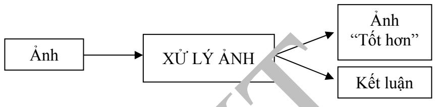  
Hình 1.1. Quá trình xử lý ảnhI

Ảnh có thể xem là tập hợp các điểm ảnh v mỗi điểm ảnh được xem như là đặc trưng cường độ sáng hay một dấu hiệu nào đó tại một vị trí nào đó của đối tượng trong khôngT gian và nó có thể xem như t hàm n b ến P(c1, c2,..., cn). Do đó, ảnh trong xử lý ảnh có thể xem như ảnh n chiề

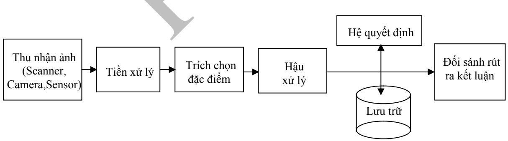  
Hình 1.2. Các bước cơ bản trong một hệ thống xử lý ảnh

Hình 1.2 biểu diễn sơ đồ tổng quát của một hệ thống xử lý ảnh:

Khối thu nhận ảnh: có nhiệm vụ tiếp nhận ảnh đầu vào. Khối tiền xử lý: có nhiệm vụ xử lý nâng cao chất lượng ảnh như giảm nhiễu, phân vùng, tìm biên v.v..   
 Khối trich chọn đặc điểm: có nhiệm vụ trích chọn các đặc trưng quan trọng của các bức ảnh đã được tiền xử lý để sử dụng trong hệ quyết định   
 Khối hậu xử lý: có nhiệm vụ xử lý các đặc điểm đã trích chọn, có thể lược bỏ hoặc biến đổi các đặc điểm này để phù hợp với các kỹ thuật cụ thể sử dụng trong hệ quyết định Khối hệ quyết định và lưu trữ: có nhiệm vụ đưa ra quyết định (phân loại) dựa trên dự liệu đã học lưu trong khối lưu trữ   
Khối kết luận: đưa ra kết luận dựa vào quyết định của khối quyết định

# 1.2. NHỮNG VẤN ĐỀ CƠ BẢN TRONG XỬ LÝ ẢNH

# 1.2.1. Một số khái niệm cơ bản

\* Ảnh và điểm ảnh:

Điểm ảnh được xem như là dấu hiệu hay cường độ sáng tại một vị trí nào đó của đối tượng trong không gian và ảnh được xem như là một tập hợp các điểm ảnh.

# \* Mức xám, màu

Là số các giá trị có thể có của các điểm ảnh của ảnh

# 1.2.2. Nắn chỉnh biến dạng

Ảnh thu nhận thường bị biến dạng do các thiết bị quang học và điện tử.

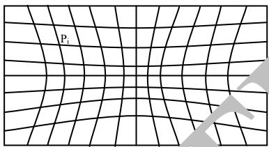  
Ảnh thu nhận

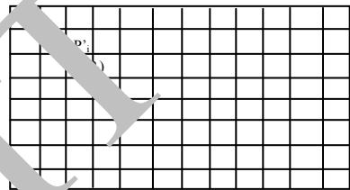  
Ảnh mong muốn

# Hình 1.3. Ảnh thu nhận và ảnh mong muốn

Để khắc phục người ta sử dụng các phép chiếu được xây dựng trên tập các điểm điều khiển. Giả sử có hai ảnh I và tương ứng với ảnh thu nhận được và ảnh mong muốn. Pi là một điểm thuộc I tương ứng với một điểm Pi' trên I', ta có n các cặp điểm điều khiển như vậy.

Nắn chỉnh biến dạng là tìm hàm : P → () sao cho

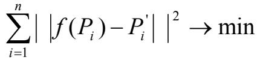

Thông thường các điểm điều khiển được lấy bằng cách chụp những ảnh có cấu trúc định sẵn như là ảnh lưới giống như ảnh mong muốn trên Hình 1.3.

# 1.2.3. Khử nhiễu

Có 2 loại nhiễu cơ bản trong quá trình thu nhận ảnh mà chúng ta cần loại bỏ:

 Nhiễu hệ thống: là nhiễu có quy luật có thể khử bằng các phép biến đổi

 Nhiễu ngẫu nhiên: vết bẩn không rõ nguyên nhân có thể khắc phục bằng các phép lọc

# 1.2.4. Chỉnh số mức xám

Chỉnh số mức xám là nhằm khắc phục tính không đồng đều của hệ thống xử lý ảnh, thông thường có 2 hướng tiếp cận:

Giảm số mức xám: Thực hiện bằng cách nhóm các mức xám gần nhau thành một bó. Trường hợp giảm xuống 2 mức xám thì chính là chuyển về ảnh đen trắng. Tăng số mức xám: Thực hiện nội suy ra các mức xám trung gian bằng kỹ thuật nội suy. Kỹ thuật này nhằm tăng cường độ mịn cho ảnh.

# 1.2.5. Phân tích ảnh

Là khâu quan trọng trong quá trình xử lý ảnh để tiến tới hiểu ảnh. Trong phân tích ảnh việc trích chọn đặc điểm là một bước quan trọng. Các đặc điểm của đối tượng được trích chọn tuỳ theo mục đích nhận dạng trong quá trình xử lý ảnh. Có thể nêu ra một số đặc điểm của ảnh sau đây:

Đặc điểm không gian: Phân bố mức xám, phân bố xác suất, biên độ, điểm uốn v.v.. Đặc điểm biến đổi: Các đặc điểm loại này được trích chọn bằng việc thực hiện lọc vùng (zonal filtering). Các bộ vùng được gọi là “mặt nạ đặc điểm” (feature mask) thường là các khe hẹp với hình dạng khác nhau (chữ nhật, tam giác, cung tròn v.v..) Đặc điểm biên và đường biê : Đặc trưng cho đường biên của đối tượng và do vậy rất hữu ích trong việc trích trọ n các thuộc tính bất biến được dùng khi nhận dạng đối tượng (Ví dụ đặc điểm góc, cạnh v.v..). Các đặc điểm này có thể được trích chọn thông qua ảnh iên. Để thu được ảnh biên ta có thể sử dụng toán tử gradient, toán tử l àn, toán tử Laplace v.v..

Việc trích chọn hiệu quả các đặc điểm giúp cho việc nhận dạng các đối tượng ảnh chính xác, với tốc độ tính toán cao và giảm thiểu dung lượng lưu trữ.

# 1.2.6. Nhận dạng và phân loạ nh

Nhận dạng tự động (automatic recognition), mô tả đối tượng, phân loại và phân nhóm các mẫu là những vấn đề quan trọng trong thị giác máy, được ứng dụng trong nhiều ngành khoa học khác nhau. Tuy nhiên, một câu hỏi đặt ra là: mẫu (pattern) là gì? Watanabe, một trong những người đi đầu trong lĩnh vực này đã định nghĩa: “Ngược lại với hỗn loạn (chaos), mẫu là một thực thể (entity), được xác định một cách ang áng (vaguely defined) và có thể gán cho nó một tên gọi nào đó”. Ví dụ mẫu có thể là ảnh của vân tay, ảnh của một vật nào đó được chụp, một chữ viết, khuôn mặt người hoặc một ký đồ tín hiệu tiếng nói. Khi biết một mẫu nào đó, để nhận dạng hoặc phân loại mẫu đó có thể sử dụng hai cách chính:

Phân loại có mẫu (supervised classification): ví dụ phân tích phân biệt (discriminant analyis), trong đó mẫu đầu vào được định danh thành một phần của một lớp đã xác định.  Phân loại không có mẫu (unsupervised classification hay clustering): Các mẫu được gán vào các lớp khác nhau dựa trên một tiêu chuẩn đồng dạng nào đó. Các lớp này cho đến thời điểm phân loại vẫn chưa biết hay chưa được định danh.

Có nhiều cách tiếp cận khác nhau trong lý thuyết nhận dạng trong đó có: Đối sánh mẫu dựa trên các đặc trưng được trích chọn, phân loại thống kê, đối sánh cấu trúc, phân loại dựa trên mạng nơ-ron nhân tạo...

Hệ thống nhận dạng tự động bao gồm ba khâu tương ứng với ba giai đoạn chủ yếu sau đây:

1. Thu nhận dữ liệu và tiền xử lý.   
2. Biểu diễn dữ liệu.   
3. Nhận dạng, ra quyết định.

Trong ứng dụng thực tiễn, không thể chỉ dùng có một cách tiếp cận đơn lẻ để phân loại “tối ưu” vì vậy các phương thức phân loại tổ hợp thường được sử dụng khi nhận dạng. Cho đến nay các hệ thống lai (hybrid system) sử dụng nhiều phương pháp và cách tiếp cận khác nhau đã cho những kết quả nhiều triển vọng.

# 1.2.7. Nén ảnh

Nén ảnh là kỹ thuật nhằm giảm thiểu không gian lưu trữ. Có hai hướng tiếp cận chính là nén có bảo toàn và không bảo toàn thông tin. Nén không bảo toàn thì thường có khả năng nén cao hơn nhưng không phục hồi được ảnh gốc, ngược lại nén có bảo toàn cho phép khôi phục hoàn toàn ảnh gốc. Nén ảnh nói chung có 4 cách tiếp cận cơ bản:

Nén ảnh thống kê: Kỹ thuật nén này dựa vào việc thống kê tần xuất xuất hiện của giá trị các điểm ảnh, trên cơ sở đó mà có chiến lược mã hóa thích hợp. Một ví dụ điển hình cho kỹ thuật mã hóa này là \*.TIF   
Nén ảnh không gian: thuật này dựa vào vị trí không gian của các điểm ảnh để tiến hành mã hóa. Kỹ thuật lợi dụng sự giống nhau của các điểm ảnh trong các vùng gần nhau. Ví dụ cho kỹ thuật này là mã nén \*.PCX   
Nén ảnh sử dụng phép biến đổi: Đây là kỹ thuật tiếp cận theo hướng nén không bảo toàn và do vậy tỉ lệ nén tương đối cao. \*.JPG chính là tiếp cận theo kỹ thuật nén này. Nén ảnh Fractal: Sử dụng tính chất Fractal của các đối tượng ảnh. Tính chất Fractal của ảnh thể hiện sự lặp lại của các chi tiết tại nhiều vị trí khác nhau với kích thước và hướng khác nhau. Kỹ thuật nén sẽ tính toán để chỉ cần lưu trữ phần gốc ảnh và quy luật sinh ra ảnh theo nguyên lý Fractal.

# THU NHẬN ẢNH

# 2.1. CÁC THIẾT BỊ THU NHẬN ẢNH

Các thiết bị thu nhận ảnh có hai loại chính ứng với hai loại ảnh thông dụng Raster, Vector và có thể cho ảnh đen trắng hoặc ảnh màu.

Các thiết bị thu nhận ảnh Raster thông thường là camera, scanner. Còn các thiết bị thu nhận ảnh Vector thông thường là sensor hoặc bàn số hoá digitalizer hoặc được chuyển đổi từ ảnh Raster.

Các hệ thống thu nhận ảnh sử dụng chung một quá trình thu nhận:

 Cảm biến: biến đổi năng lượng quang học thành năng lượng điện (giai đoạn lấy mẫu)  Tổng hợp năng lượng điện thành ảnh (giai đoạn lượng tử hóa)

# 2.2. LẤY MẪU VÀ LƯỢNG TỬ HOÁ

# 2.2.1. Giai đoạn lấy mẫu

Người ta sử dụng bộ cảm biến hoặc máy quét để biến tín hiệu quang của ảnh thành tín hiệu điện liên tục. Phương pháp sử dụng máy quét phổ biến hơn. Máy quét sẽ quét theo chiều ngang để tạo ra tín hiệu điện của ảnh, k quả cho ra một tín hiệu điện hai chiều I(x,y) liên tục.

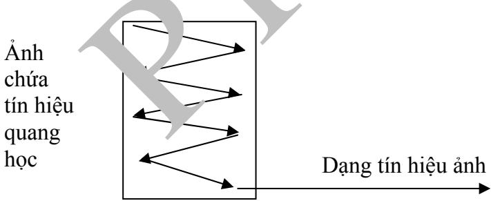

Xét ảnh liên tục được biểu diễn bởi hàm I(x, y), gọi x là khoảng cách giữa hai điểm được giữ lại theo trục x, gọi y là khoảng cách giữa hai điểm được giữ lại theo trục y. y , x được gọi là chu kỳ lấy mẫu theo trục x và y.

Giai đoạn lấy mẫu sẽ biến hàm liên tục I(x,y) thành hàm rời rạc I(n x , m y ). Với m,n là nguyên.

Theo SHANON để đảm bảo không xảy ra hiện tượng chồng phổ, cho phép tái tạo lại ảnh gốc từ ảnh đã số hóa thì tần số lấy mẫu phải ít nhất phải lớn hơn hoặc bằng hai tần số cao nhất của tín hiệu ảnh. Gọi fxmax, fymax là tần số cao nhất của tín hiệu theo trục x, y thì:

 fx  2fxmax với fx = 1 là tần số lấy mẫu theo trục x.  fy  2fymax với fy = 1 là tần số lấy mẫu theo trục y. y

# 2.2.2. Lượng tử hóa

Ảnh sau khi lấy mẫu sẽ có dạng I(m,n) với m, n là nguyên nhưng giá trị I(m, n) vẫn là giá trị vật lý liên tục. Quá trình biến đổi giá trị I(m,n) thành một số nguyên thích hợp để lưu trữ gọi là lượng tử hoá. Đây là quá trình ánh xạ một biến liên tục u vào biến rời rạc u\* thuộc tập hữu hạn [u1, u2,..uL] xác định trước, L là mức lượng tử hoá được tạo ra.

Ví dụ:

 Với ảnh đa cấp xám thì L=256, f(m,n) = g  0, 255  Với ảnh 24 bit thì L=224, f(m, n) = g 0, 2 1 24  

# 2.3. MỘT SỐ PHƯƠNG PHÁP BIỂU DIỄN ẢNH

Ảnh trên máy tính là kết quả thu nhận theo các phương pháp số hoá được nhúng trong các thiết bị kỹ thuật khác nhau. Cấu trúc dữ liệu để lưu trữ thông tin ảnh trong bộ nhớ có ảnh hưởng rất lớn đến việc hiển thị, in ấn và xử lý. Quá trình lưu trữ ảnh nhằm biểu diễn ảnh dưới dạng lưu trữ được với hai tiêu chí chính:

Tiết kiệm bộ nhớ  Giảm thời gian xử lý

Ảnh được biểu diễn theo hai mô hình cơ bản, ảnh Raster và ảnh Vector.

# 2.3.1. Mô hình Raster

Đây là cách biểu diễn ảnh thông dụng nhất hiện nay, ảnh được biểu diễn dưới dạng ma trận các điểm (điểm ảnh). Thường thu nhận qua các thiết bị như camera, scanner. Tuỳ theo yêu cầu thực thế mà mỗi điểm ảnh được biểu diễn qua 1 hay nhiều bít. Mật độ điểm ảnh trên một đơn vị kích thước vật lý được gọi là độ phân giải. Ảnh có độ phân giải cao thì càng đẹp, càng mịn và càng thể hiện rõ chi tiết. Việc lựa chọn độ phân giải thích hợp tuỳ thuộc vào nhu cầu sử dụng và đặc trưng của mỗi ảnh cụ thể.

Mô hình Raster thuận lợi cho hiển thị và in ấn. Ngày nay công nghệ phần cứng cung cấp những thiết bị thu nhận ảnh Raster phù hợp với tốc độ nhanh và chất lượng cao cho cả đầu vào và đầu ra. Một thuận lợi cho việc hiển thị trong môi trường Windows là Microsoft đưa ra khuôn dạng ảnh DIB (Device Independent Bitmap) làm trung gian. Hình 2.1 thể hình quy trình chung để hiển thị ảnh Raster thông qua DIB.

Một trong những hướng nghiên cứu cơ bản trên mô hình biểu diễn này là kỹ thuật nén ảnh bao gồm cả nén bảo toàn và không bảo toàn. Hiện nay trên thế giới có trên 50 khuôn dạng ảnh thông dụng (BMP, TIF, GIF, PCX v.v..) bao gồm cả trong đó các kỹ thuật nén có khả năng phục hồi dữ liệu 100% và nén có khả năng phục hồi với độ sai số nhất định.

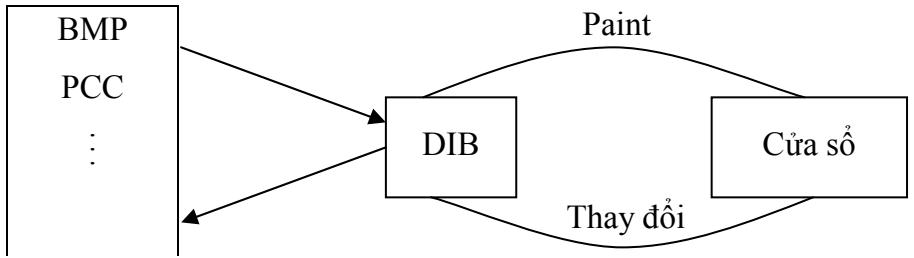  
Hình 2.1. Quá trình hiển thị và chỉnh sửa, lưu trữ ảnh thông qua DIB

# 2.3.2. Mô hình Vector

Biểu diễn ảnh ngoài tiêu chí tiết kiệm không gian lưu trữ, dễ dàng cho hiển thị và in ấn còn cần đảm bảo dễ dàng trong lựa chọn, sao chép, di chuyển và tìm kiếm v.v.. Theo những yêu cầu này kỹ thuật biểu diễn Vector tỏ ra ưu việt hơn.

Trong mô hình vector người ta sử dụng hướng giữa các vector của điểm ảnh lân cận để mã hoá và tái tạo hình ảnh ban đầu ảnh vector được thu nhận trực tiếp từ các thiết bị số hoá như Digital hoặc được chuyển đổi từ ảnh Raster thông qua các chương trình số hoá

Công nghệ phần cứng cung cấp những thiết bị xử lý với tốc độ nhanh và chất lượng cho cả đầu vào và ra nhưng lại chỉ hỗ trợ cho ảnh Raster. Do vậy, những nghiên cứu về biểu diễn Vector đều tập trung vào việc chuyển đổi ảnh từ mô hình Raster.

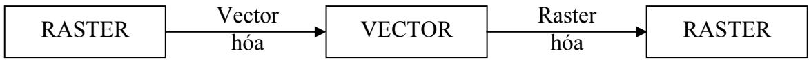

# Hình 2.2. Sự chuyển đổi giữa các mô hình biểu diễn ảnh

# 2.4. CÁC ĐỊNH DẠNG ẢNH CƠ BẢN

Hiện nay trên thế giới có trên 50 khuôn dạng ảnh thông dụng. Sau đây là một số định dạng ảnh hay dùng trong quá trình xử lý ảnh hiện ay.

# 2.4.1. Định dạng ảnh IMG

Ảnh IMG là ảnh đen trắng, phần đầu của ảnh IMG có 16 byte chứa các thông tin:

 6 byte đầu: dùng để đá nh dấu định ng ảnh. Giá trị của 6 byte này viết dưới dạng Hexa: 0x0001 0x0008 0x0001 2 byte tiếp theo: chứa độ dài mẫu tin. Đó là độ dài của dãy các byte kề liền nhau mà dóy này sẽ được lặp lại một số lần nào đó. Số lần lặp này sẽ được lưu trong byte đếm. Nhiều dãy giống nhau được lưu trong một byte. 4 byte tiếp: mô tả kích cỡ pixel.   
2 byte tiếp: số pixel trên một dòng ảnh.   
 2 byte cuối: số dòng ảnh trong ảnh.

Ảnh IMG được nén theo từng dòng, mỗi dòng bao gồm các gói (pack). Các dòng giống nhau cũng được nén thành một gói. Có 4 loại gói sau:

 Loại 1: Gói các dòng giống nhau. Quy cách gói tin này như sau: 0x00 0x00 0xFF Count. Ba byte đầu tiên cho biết số các dãy giống nhau, byte cuối cho biết số các dòng giống nhau.   
 Loại 2: Gói các dãy giống nhau. Quy cách gói tin này như sau: 0x00 Count. Byte thứ hai cho biết số các dãy giống nhau được nén trong gói. Độ dài của dãy ghi ở đầu tệp. Loại 3: Dãy các Pixel không giống nhau, không lặp lại và không nén được. Quy cách gói tin này như sau: 0x80 Count. Byte thứ hai cho biết độ dài dãy các pixel không giống nhau không nén được.

Loại 4: Dãy các Pixel giống nhau. Tuỳ theo các bít cao của byte đầu tiên được bật hay tắt. Nếu bít cao được bật (giá trị 1) thì đây là gói nén các byte chỉ gồm bít 0, số các byte được nén được tính bởi 7 bít thấp còn lại. Nếu bớt cao tắt (giá trị 0) thì đây là gói nén các byte gồm toán bít 1. Số các byte được nén được tính bởi 7 bít còn lại.

Các gói tin của file IMG rất đa dạng do ảnh IMG là ảnh đen trắng, do vậy chỉ cần 1 bít cho 1 pixel thay vì 4 hoặc 8 như đã nói ở trên. Toàn bộ ảnh chỉ có những điểm sáng và tối tương ứng với giá trị 1 hoặc 0. Tỷ lệ nén của kiểu định dạng này là khá cao.

# 2.4.2. Định dạng ảnh PCX

Định dạng ảnh PCX là một trong những định dạng ảnh cổ điển. Nó sử dụng phương pháp mã hoá loạt dài RLE (Run – Length – Encoded) để nén dữ liệu ảnh. Quá trình nén và giải nén được thực hiện trên từng dạng ảnh. Thực tế, phương pháp giải nén PCX kém hiệu quả hơn so với kiểu IMG. Tệp PCX gồm 3 phần: đầu tệp (header), dữ liệu ảnh (Image data) và bảng màu mở rộng.

Header của tệp PCX có kích thước cố định gồm 128 byte và được phân bố như sau:

 1 byte: chỉ ra kiểu định dạng.Nếu là PCX/PCC thì nó luôn có giá trị là 0Ah.   
 1 byte: chỉ ra version sử dụng để nén ảnh, có thể có các giá trị sau:  0: version 2.5.  2: version 2.8 với bảng mà  3: version 2.8 hay 3.0 không có bảng màu.  5: version 3.0 cố bảng màu.   
a 1 byte: chỉ ra phươ g pháp mã hoá. Nếu là 0 thì mã hoá theo phương pháp BYTE PACKED, ngược lại à phương pháp RLE.   
 1 byte: Số bít cho một điểm ảnh phẳng (plane).   
 1 word: toạ độ góc tr của ảnh. Với kiểu PCX nó có giá trị là (0,0), cũn PCC thì khác (0,0).   
 1 word: toạ độ góc phải dưới.   
 1 word: kích thước bề rộng và bề cao của ảnh.   
 1 word: số điểm ảnh.   
 1 word: độ phân giải màn hình.   
 1 word. 48 byte: chia nó thành 16 nhóm, mỗi nhóm 3 byte. Mỗi nhóm này chứa thông tin về một thanh ghi màu. Như vậy ta có 16 thanh ghi màu. 1 byte: không dùng đến và luôn đặt là 0. 1 byte: số bớt plane mà ảnh sử dụng. Với ảnh 16 màu, giá trị này là 4, với ảnh 256 mầu (1pixel/8bits) thì số bít plane lại là 1. 1 byte: số bytes cho một dòng quét ảnh.   
 1 word: kiểu bảng màu.   
 58 byte: không dùng.

Định dạng ảnh PCX thường được dùng để lưu trữ ảnh và thao tác đơn giản, cho phép nén và giải nén nhanh. Tuy nhiên, vì cấu trúc của nó cố định, nên trong một số trường hợp làm tăng kích thước lưu trữ. Cũng vì nhược điểm này mà một số ứng dụng sử dụng một kiểu định dạng khác mềm dẻo hơn: định dạng TIFF (Targed Image File Format) sẽ mô tả dưới đây.

# 2.4.3. Định dạng ảnh TIFF

Kiểu định dạng TIFF được thiết kế để làm nhẹ bớt các vấn đề liên quan đến việc mở rộng file ảnh cố định. Về cấu trúc, nó cũng gồm 3 phần chính:

 Phần Header (IFH): có trong tất cả các tệp TIFF và gồm 8 byte:

 1 word: chỉ ra kiểu tạo tệp trên máy tính PC hay máy Macintosh. Hai loại này khác nhau rất lớn ở thứ tự các byte lưu trữ trong các số dài 2 hay 4 byte. Nếu trường này có giá trị là 4D4Dh thì đó là ảnh cho máy Macintosh, nếu là 4949h là của máy PC.   
 1 word: version. từ này luôn có giá trị là 42. đây là đặc trưng của file TIFF và không thay đổi.   
 2 word: giá trị Offset theo byte tính từ đầu tới cấu trúc IFD là cấu trúc thứ hai của file. Thứ tự các byte này phụ thuộc vào dấu hiệu trường đầu tiên.

 Phần thứ 2 (IFD): Không ở ngay sau cấu trúc IFH mà vị trí được xác định bởi trường Offset trong đầu tệp. Có thể có một hay nhiều IFD cùng tồn tại trong một file. Một IFD bao gồm:

 2 byte: chứa các DE (Directory E   
 12 byte là các DE xếp liên tiếp, mỗi DE chiếm 12 byte.   
 4 byte: chứa Offset trỏ tới IFD tiếp theo. Nếu đây là IFD cuối cùng thì trường này có giá trị 0.

 Phần thứ 3: các DE: các DE có dộ dài cố định gồm 12 byte và chia làm 4 phần:  2 byte: chỉ ra dấu hiệu mà file ảnh đó được xây dựng.  2 byte: kiểu dữ liệu của tham số ảnh. Có 5 kiểu tham số cơ bản: 1: BYTE (1 byte) 2: ASCII (1 byte) 3: SHORT (2 byte). 4: LONG (4 byte) 5: RATIONAL (8 byte)

 4 byte: trường độ dài chưa số lượng chỉ mục của kiểu dữ liệu đó chỉ ra. Nó không phải là tổng số byte cần thiết để lưu trữ. Để có số liệu này ta cần nhân số chỉ mục với kiểu dữ liệu đã dùng.

 4 byte: đó là Offset tới điểm bắt đầu dữ liệu liên quan tới dấu hiệu, tức là liên quan với DE không phải lưu trữ vật lý cùng với nó nằm ở một vị trí nào đó trong file.

Dữ liệu chứa trong tệp thường được tổ chức thành các nhóm dòng (cột) quét của dữ liệu ảnh. Cách tổ chức này làm giảm bộ nhớ cần thiết cho việc đọc tệp. Việc giải nén được thực hiện theo 4 kiểu khác nhau được lưu trữ trong byte dấu hiệu nén.

# 2.4.4. Định dạng file ảnh BITMAP

Mỗi file BITMAP gồm đầu file chứa các thông tin chung về file, đầu thông tin chứa các thông tin về ảnh, một bảng màu và một mảng dữ liệu ảnh. Khuôn dạng được cho như sau:

BITMAPFILEHEADER bmfh;  
BITMAPINFOHEADER bmih;  
RGBQUAD aColors[];  
BYTE aBitmapBits[];

Trong đó, các cấu trúc được định nghĩa như sau: typedef struct tagBITMAPFILEHEADER { /\* bmfh \*/

UINT bfType; DWORD bfSize; UINT bfReserved1; UINT bfReserved2; DWORD bfOffBits; } BITMAPFILEHEADER typedef struct tagBITMAPINFOHEADER { /\* bmih \*/

DWORD biSize; LONG bi Width; LONG biHeig ht; WORD biPlanes; WORD biBitCount; DWORD biCompression; DWORD biSizeImage; LONG biXPelsPerMeter; LONG biYPelsPerMeter; DWORD biClrUsed; DWORD biClrImportant; } BITMAPINFOHEADER, \*LPBITMAPINFOHEADER;

Với biến chi tiết như sau

<table><tr><td rowspan=1 colspan=1>biSize</td><td rowspan=1 colspan=1>kích thuóc cúa BITMAPINFOHEADER</td></tr><tr><td rowspan=1 colspan=1>biWidth</td><td rowspan=1 colspan=1>Chièu rng cüa nh, tính bng só diém nh</td></tr><tr><td rowspan=1 colspan=1>biHeight</td><td rowspan=1 colspan=1>Chièu cao cúa nh, tính bng só diém anh</td></tr><tr><td rowspan=1 colspan=1>biPlanes</td><td rowspan=1 colspan=1>Só plane cúa thiét bi, phi bng 1</td></tr><tr><td rowspan=1 colspan=1>biBitCount</td><td rowspan=1 colspan=1>Só bit cho mt diém ành</td></tr><tr><td rowspan=1 colspan=1>biCompression</td><td rowspan=1 colspan=1>Kieu nén</td></tr><tr><td rowspan=1 colspan=1>biSizeImage</td><td rowspan=1 colspan=1>Kích thuóc cúa nh tính bng byte</td></tr><tr><td rowspan=1 colspan=1>biXPelsPerMeter</td><td rowspan=1 colspan=1>dô phân gii ngang cüa thiét bi, tính bng diém änh trên met</td></tr><tr><td rowspan=1 colspan=1>biYPelsPerMeter </td><td rowspan=1 colspan=1>d phân gii dąc cua thiét bi, tính bng diém nh trên met</td></tr><tr><td rowspan=1 colspan=1>biClrUsed</td><td rowspan=1 colspan=1>Só luęng các màu thyc su duęc sù dung</td></tr><tr><td rowspan=1 colspan=1>biClrImportant</td><td rowspan=1 colspan=1>Só lugng các màu càn thiét cho vic hién thi, bng 0 néu tát càcác màu dèu càn dê hiéun!</td></tr></table>

Nếu bmih.biBitCount > 8 thì mảng màu rgbq[] trống, ngược lại thì mảng màu có 2<< bmih.biBitCount phần tử.

typedef struct tagRGBQUAD { /\* rgbq BYTE rgbBlu (, BYTE rgbGr n; BYTE bRed; BYTE rgbR e served;   
} RGBQUAD;

typedef struct tagBITMAPINFO { BITMAPINFOHEADER bmiHeader; RGBQUAD bmiColors[1]; } BITMAPINFO, \*PBITMAPINFO;

# 2.5. KỸ THUẬT TÁI NHẬN ẢNH

# 2.5.1 Kỹ thuật chụp ảnh

Phương pháp sao chụp ảnh là phương pháp đơn giản, giá thành thấp, chất lượng cao. Sau bước chụp là kỹ thuật phòng tối nhằm tăng cường ảnh như mong muốn. Ví dụ kỹ thuật phòng tối như: phóng đại ảnh, thu nhỏ ảnh…, tùy theo ứng dụng. Kỹ thuật chụp ảnh màn hình màu khá đơn giản. Nó bao gồm các bước sau:

 Đặt camera trong phòng tối, cách màn hình khoảng 10 feet (1feet=0,3048m)  Mở ống kính để phẳng mặt cong màn hình, do vậy ảnh sẽ dàn đều hơn

 Tắt phím sang tối (Brightness) và phím tương phản (Contrast) của màn hình để tạo độ rõ cho ảnh. Các màu chói, cường độ cao trên ảnh sẽ giảm đi.  Đặt tốc độ ống kính từ 1/8 đến 1/2 giây.

# 2.5.2 Kỹ thuật in ảnh

Người ta dùng kỹ thuật nửa cường độ để thể hiện ảnh trên sách báo, tạp chí. Theo kỹ thuật này, một ảnh tạo nên bởi một chuỗi các điểm in trên giấy. Thực chất, mỗi điểm ảnh có thể được coi là một hình vuông trắng bao quanh một chấm đen. Do vậy, nếu chấm đen càng lớn điểm ảnh sẽ càng xẫm màu. Màu xám có thể coi như chấm đen chiếm nửa vùng trắng. Vùng trắng là vùng gồm một chùm các điểm ảnh có rất ít hoặc không có chấm đen.

Từ đặc điểm cảm nhận của mắt người, sự thay đổi cường độ chấm đen trong các phần tử ảnh trắng tạo nên mô phỏng của một ảnh liên tục. Như vậy, mắt người cảm nhận từ một ảnh mà màu biến đổi từ đen qua xám rồi đến trắng. Tổng số cường độ duy nhất hiện diện sẽ xác định các kích thước khác nhau của chấm đen. Thông thường, báo ảnh tạo ảnh nửa cường độ với độ phân giải từ 60 đến 80 DPI(dot per inchs: số điểm ảnh trên một inch), sách có thể in đến 150 DPI.

Tuy nhiên, các máy in ghép nối với máy tính không có khả năng sắp xếp các chấm đen có kích thước khác nhau của ảnh, vì vậy chúng ta cần các kỹ thuật nửa cường độ kỹ thuật số (Digital Halftoning): phân ngưỡng, chọn mẫu (Patterning), Dithering hoặc khuếch tán lỗi (Error Diffusion).

# a) Phân ngưỡng

Kỹ thuật này đặt ngưỡng để hiển thị các tông màu liên tục. Các điểm trong ảnh được so sánh với ngưỡng định trước. Giá trị của ngưỡng sẽ quyết định điểm có được hiển thị hay không. Do vậy ảnh kết uả sẽ mất đi một số chi tiết. Có nhiều kỹ thuật chọn ngưỡng áp dụng cho các đối tượng khác nhau:

Hiển thị 2 màu: chỉ dùng ảnh đen trắng có 256 mức xám. Bản chất của phương pháp này là chọn ngưỡng dựa trên lược đồ mức xám của ảnh. Để đơn giản có thể lấy ngưỡng với giá trị là 127. Như vậy nghĩa là các điểm có giá trị điểm ảnh lớn hơn 127 sẽ là 1, ngược lại là 0.

Hiển thị 4 màu: sử dụng 4 màu để khắc phục nhược điểm của kỹ thuật hiển thị 2 màu. Một ví dụ của Bảng mã 4 mầu được cho ở Bảng 2.1.

Bảng 2.1 Bảng mã 4 mầu   

<table><tr><td rowspan=1 colspan=1>Mãmàu</td><td rowspan=1 colspan=1>Màn hinh monochrome (don sc)</td><td rowspan=1 colspan=1>Màn hình màu</td></tr><tr><td rowspan=1 colspan=1>0</td><td rowspan=1 colspan=1>Den</td><td rowspan=1 colspan=1>Den</td></tr><tr><td rowspan=1 colspan=1>b</td><td rowspan=1 colspan=1>Xám dâm</td><td rowspan=1 colspan=1>Dó</td></tr><tr><td rowspan=1 colspan=1>2</td><td rowspan=1 colspan=1>Xám nhat</td><td rowspan=1 colspan=1>Xanh</td></tr><tr><td rowspan=1 colspan=1>3</td><td rowspan=1 colspan=1>Tráng</td><td rowspan=1 colspan=1>Vàng</td></tr></table>

# b) Kỹ thuật chọn theo mẫu (Patterning)

Kỹ thuật này sử dụng một nhóm các phần tử trên thiết bị ra (máy in chẳng hạn) để biểu diễn một pixel trên ảnh nguồn. Các phần tử của nhóm quyết định độ sáng tối của cả nhóm. Các phần tử này mô phỏng các chấm đen trong kỹ thuật nửa cường độ. Nhóm thường được chọn có dạng ma trận vuông. Nhóm nn phần tử sẽ tạo nên n2 +1 mức sáng. Ma trận mẫu thường được chọn là ma trận Rylander. Ma trận Rylander cấp 4 có dạng như Bảng 2.2.

<table><tr><td rowspan=1 colspan=1>0</td><td rowspan=1 colspan=1>8</td><td rowspan=1 colspan=1>2</td><td rowspan=1 colspan=1>10</td></tr><tr><td rowspan=1 colspan=1>4</td><td rowspan=1 colspan=1>12</td><td rowspan=1 colspan=1>6</td><td rowspan=1 colspan=1>14</td></tr><tr><td rowspan=1 colspan=1>3</td><td rowspan=1 colspan=1>11</td><td rowspan=1 colspan=1></td><td rowspan=1 colspan=1>9</td></tr><tr><td rowspan=1 colspan=1>7</td><td rowspan=1 colspan=1>15</td><td rowspan=1 colspan=1>5</td><td rowspan=1 colspan=1>cid:1:3</td></tr></table>

Việc chọn kích thước của nhóm như vậy sẽ làm giảm độ mịn của ảnh. Vì vậy kỹ thuật này chỉ áp dụng trong trường hợp mà độ phân giải của thiết bị ra lớn hơn độ phân giải của ảnh nguồn.

Ví dụ: thiết bị ra có độ phân giải 640480 khi sử dụng nhóm có kích thước 44 sẽ chỉ còn 160120.

# c) Kỹ thuật Dithering

Dithering là việc biế ổi một ản đa cấp xám (nhiều mức sáng tối) sang ảnh nhị phân (hai mức sáng tối) Kỹ thuật Dithering đựợc áp dụng để tạo ra ảnh đa cấp sáng khi độ phân giải nguồn và đích là như nhau. Kỹ thuật này sử dụng một ma trận mẫu gọi là ma trận Dither. Ma trận này gần giống như ma trận Rylander.

Để tạo ảnh, mỗi phần tử của ảnh gốc sẽ được so sánh với phần tử tương ứng của ma trận Dither. Nếu lớn hơn, phần tử ở đầu ra sẽ sáng và ngược lại.

# d) Kỹ thuật khuếch tán lỗi (Error diffusion)

Khuếch tán lỗi cho phép giảm thiểu mức độ mất chi tiết của ảnh khi tách ngưỡng bằng cách phân tán lỗi do lượng tử hóa ra các điểm ảnh xung quanh. Bằng cách này tổng giá trị điểm ảnh của một vùng nhỏ được giữ tương đối gần với giá trị trên ảnh gốc.

Khuếch tán lỗi có hai dạng, khuếch tán lỗi một chiều và khuếch tán lỗi hai chiều. Khuếch tán lỗi một chiều chỉ phân tán lỗi sang điểm ảnh lân cận trên cùng một dòng trong khi đó khuếch tán lỗi hai chiều phân tán lỗi sang các điểm ảnh lân cận theo một tỷ lệ xác định bởi một ma trận khuếch tán lỗi.

# Kỹ thuật khuếch tán lỗi một chiều:

o Ảnh được duyệt từ trái qua phải, từ trên xuống dưới.   
o Tại mỗi điểm ảnh, giá trị điểm ảnh được tách theo ngưỡng có sẵn.   
o Phần dư do lượng tử hóa được được chuyến sang điểm ảnh tiếp theo trên cùng dòng.

o Các bước được lặp lại cho đến hết dòng, phần dư của điểm ảnh cuối cùng sẽ được loại bỏ.

Kỹ thuật khuếch tán lỗi hai chiều:

o Các bước được thực hiện như khuếch tán lỗi một chiều, tuy nhiên lỗi do lượng tử hóa sẽ đươc phân tán ra các điểm xung quanh theo tỷ lệ xác định bởi ma trận khuếch tán

o Có hai ma trận phổ biến (Hình 2.3):

Ma trận của Floyd và Steinberg.

 Ma trận của J F Jarvis, C N Judice, và W H Ninke tại phòng thí nghiệm Bell.

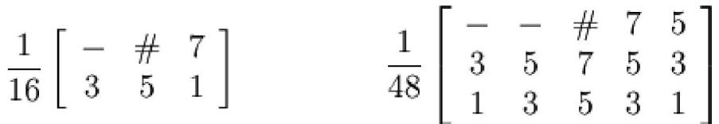

Floyd và Steinberg

Phòng thí nghiệm Bell

"#" chỉ điểm đang xét và "" chỉ các điểm đã xét, các con số chỉ tỷ lệ lỗi được phântán từ điểm hiện tại

# 2.6. KHÁI NIỆM ẢNH ĐEN TRẮNG, ẢNH MÀU

Ảnh trong thực tế là một ảnh liên tục về không gian và giá trị cường độ sáng. Để có thể xử lý ảnh bằng máy tính người ta cần thiết phải số hóa ảnh. Trong quá trình số hóa, ta biến đổi tín hiệu liên tục sa tín hiệu rời rạc thông qua quá trình lấy mẫu (rời rạc hóa về không gian) và lượng hóa thành phần giá trị mà về nguyên tắc bằng mắt thường không phân biệt được hai điểm kề nhau. Một ảnh sẽ là một tập hợp các phần tử ảnh (Picture element) hay còn được gọi là Pixel.

Như vậy, ảnh số là một tập hợp các điểm ảnh. Khi được số hóa, nó thường được biểu diễn bởi một mảng hai chiều I(n,p) với n là số dòng và p là số cột. Ta nói ảnh gồm np pixels. Người ta thường ký hiệu I(x,y) để chỉ một pixel I chính là giá trị cường độ sáng của ảnh tại pixel đó. Ảnh có thể được biểu diễn với các độ phân giải khác nhau. Một pixel có thể được lưu trữ trên 1, 4, 8 hay 24 bit tùy thuộc vào các mức cường độ sáng cần phân biệt của ảnh và số lượng thành phần mầu cơ bản chứa trong ảnh đó.

# 2.6.1. Phân loại ảnh số

Người ta thường chia ảnh số ra làm ba loại chính là:

 Ảnh đen trắng: Mỗi phần tử ảnh nhận một trong hai giá trị tương ứng với hai mức sáng đen và trắng (còn gọi là ảnh nhị phân) Ảnh đa mức xám (Grayscale): Các phần tử ảnh chứa thông số về cường độ sáng đã được mã hoá thành N mức (8, 256 hoặc nhiều hơn) tương ứng với 3 bít, 8 bít hoặc hơn nữa, ảnh xám có một đặc trưng là lược đồ xám (histogram). Ảnh mầu: Mỗi phần tử ảnh được lưu trữ trong ảnh dưới dạng một cấu trúc có 3 trường chứa thông tin về 3 màu cơ bản là đỏ, xanh, lơ (red, blue, green). Màu của ảnh sẽ là tổng hợp của 3 giá trị trên. Mỗi trường biểu diễn giá trị màu có thể dùng 8 bít, 16 bít hược 24 bit để mã hoá.

Như vậy ảnh màu là ảnh mang thông tin về đối tượng đầy đủ nhất so với ảnh đen trắng và ảnh đa cấp xám. Tuy nhiên, tất cả cách biểu diễn này đều chỉ là sự mô phỏng hệ màu trong tự nhiên. Thực tế thì một màu được phân biệt qua 3 thuộc tính là độ chói (Itensity), sắc thái màu (Hue) và độ bão hoà (Saturation). Tuy nhiên với khả năng cảm nhận của mắt người thì cách biểu diễn ảnh dưới dạng cấu trúc 3 màu RGB chất lượng ảnh thu được là có thể chấp nhận được.

# 2.6.2. Màu sắc

Màu sắc được tạo ra bởi các ánh sáng với các bước sóng khác nhau, mắt người bao gồm ba loại tế bào cảm nhận mầu có thể nhìn được bảy triệu màu nhưng thực chất chúng ta chỉ có thể cảm nhận sự khác biệt vài ngàn màu. Một màu có thể được biểu diễn bởi ba thuộc tính: Sắc thái màu (Hue), độ bão hòa (Saturation), và độ chói (Itensity).

Trong xử lý ảnh và đồ họa, mô hình màu là một chỉ số kỹ thuật của một hệ tọa độ màu 3 chiều có thể dùng để biểu diễn tất cả các màu. Ví dụ như mô hình màu RGB (Red, Green, Blue): là một đơn vị tập các màu thành phần sắp xếp theo hình lập phương của hệ trục tọa độ Đề các.

Mục đích của mô hình màu là cho phép biểu diễn một phần các mầu nhìn thấy được bằng các chỉ số kỹ thuật quy ước. Sau đây, ta xem xét một số mô hình hay được sử dụng nhất.

# 2.6.2.1. Mô hình màu RGB (Red, Green, Bule

Màu đỏ, lục – xanh lá ây, l xanh da trời (RGB) được sử dụng phổ biến nhất trong hiển thị. Các mầu gốc ày được t hợp với nhau theo một tỷ lệ để tái tạo mầu sắc, hệ mầu này sử dụng phối màu cộn . Tập hợp các mầu được sắp xếp theo khối lập phương đơn vị. Đường chéo chính của khối lập phương thể hiện các mầu được phối bởi ba mầu gốc với tỷ lệ tương đương nhau ứng với các mức độ xám từ đen là (0,0,0) t trắng (1,1,1).

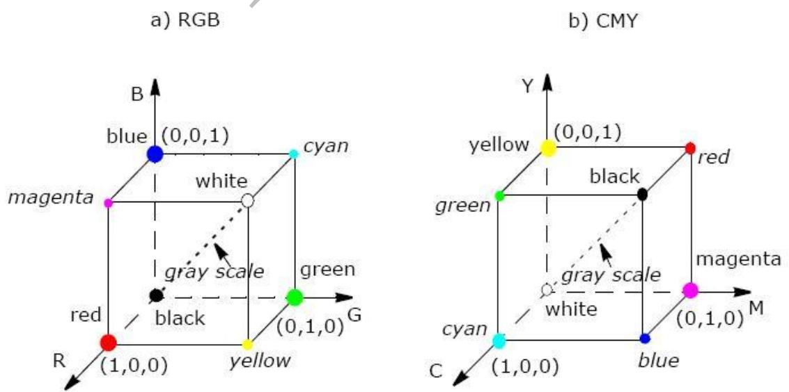  
Hình 2.4. Mô hình màu RGB và CMY

# 2.6.2.2. Mô hình màu CMY (Cyan, Magenta, Yellow)

Xanh nhạt (Cyan), vàng (Yellow) và tím (Magenta) là các phần bù tương ứng cho các màu đỏ, lục và lam. Chúng có thể được sử dụng để lọc loại trừ các màu này từ ánh sáng trắng. Vì vậy CMY còn được gọi là các phần bù loại trừ của màu gốc. Các mầu trong hệ mầu CMY cũng được biểu diễn trong hệ tọa độ Đề-các nhưng phương pháp phối màu sử dụng là phối màu trừ. Các màu được tạo thành bằng cách loại bỏ hoặc được bù từ ánh sáng trắng thay vì là được thêm vào vùng tối.

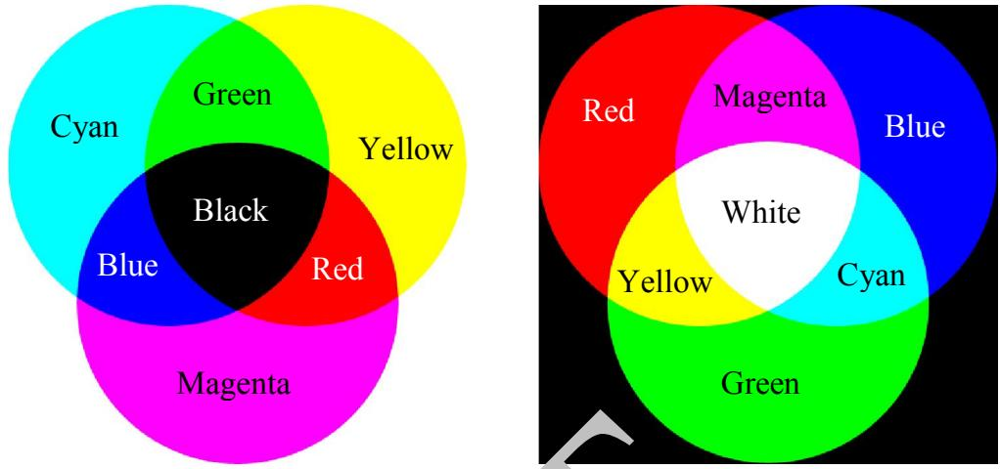  
Hình 2.5.Trộn màu cộng và trộn màu trừ

Khi bề mặt được bao phủ bởi lớp mực màu xanh tím, sẽ không có tia màu đỏ phản chiếu từ bề mặt đó. Màu xanh tím đã loại bỏ phần màu đỏ phản xạ khi có tia sáng trắng, mà bản chất là tổng của 3 màu đỏ, lục, lam. Vì thế ta có thể coi màu Cyan là màu trắng trừ đi màu đỏ và đó cũng là mà lam cộng màu lục. Tương tự như vậy ta có màu đỏ thẫm (magenta) hấp thụ màu lục, v thế nó tương đương với màu đỏ cộng màu lam. Và cuối cùng màu vàng (yellow) h thụ màu lam, nó sẽ bằng màu đỏ cộng với lục.

Khi bề mặt của thực thể được bao phủ bởi xanh tím và vàng, chúng sẽ hấp thụ hết các phần màu đỏ và xanh lam của bề mặt. Khi đó chỉ tồn tại duy nhất màu lục bị phản xạ từ sự chiếu sáng của ánh sáng trắng. Trong trường hợp khi bề mặt được bao phủ bởi cả 3 màu xanh tím, vàng, đỏ thẫm, hiện tượng hấp thụ xảy ra trên cả 3 màu đỏ, lục và lam. Do đó, màu đen sẽ màu của bề mặt. Những mối liên hệ này có thể được miêu tả bởi:

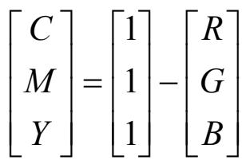

# Hình 2.6. Sự biến đổi từ RGB thành CMY

# 2.6.2.3. Mô hình màu HSV (Hue, Saturation, Value)

Các mô hình màu RGB, CMY có thể hiển thị được tất cả các mầu cần thiết, tuy vậy rất khó khắn để con người có thể phối mầu trên hai hệ màu này. Để phối mầu dễ dàng hơn Smith định nghĩa mô hình màu HSV của hay HSB với B là Brightness (độ sáng) hướng người sử dụng dựa trên cơ sở nền tảng trực giác về tông màu, sắc độ và sắc thái mỹ thuật.

Hệ thống tọa độ có dạng hệ hình trụ và tập màu thành phần của không gian bần của không gian bên trong mô hình màu được xác định lợc là hình nón như trong hình 2.7.

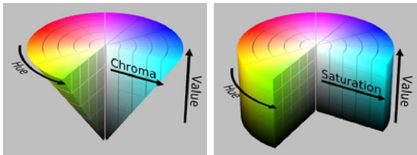  
Hình 2.7. Mô hình màu HSV

Sắc màu (hue) hoặc H đặc được đo bởi góc quanh trục đứng với mục màu đỏ là 0o , màu lục là 120o , màu lam là 240o . Các màu bù nằm ở vị trí đối diện với những mững màu gốc. S lấy giá trị từ 0 trên đường trục tâm (trục V) đến 1 trờng trên các mặt bên tại của hình chóp sáu cình cạnh. Sự bão hòa được hiểu là mức độ tức tươi của mầu, các mầu xám từ đen tới trắng có Sủa trắng có  là 0. Giá trị V được hiểu là độ sáng của mộ màu, V là 0 thì là màu đen, V là 1 thì là mầu có độ sáng tối đa.ầu có độ sáng

# Giả mã chuyển đổi từ RGB sang HSVển

Hàm RGB_HSV_Conversion   
H: Sắc độ màu [0àu [0-360] với màu đỏ tại iểm 0   
S: Độ bão hòa [0ão [0-1] đại   
Min: Hàm lấy giá trị nhỏ nấy t   
{ //Xác định giịnh tr ccường độ sáng V= Max(R,G,B) //Xác định độ bịnh bão òa Temp= Min(R,G,B) If V=0 than S= 0 Else S= (V-Temp)/VTemp)/V End //Xác định sắc mịnh màu IF s=0 THEN H= Undefined Else Cr= (V-R)/(VR)/(V-Temp); Cg= (V-G)/(VG)/(V-Temp); Cb= (V-B)/(VB)/(V-Temp); // Màu nằm trong khoảng giữa vằm vàng (Yelloàng If R=V then H= Cb-CgCg   
// Màu nằm trong khoảng giữa xanh tím (cyan) và vàng (yellow)   
If G= V then H= 2+Cr-Cb   
// Màu nằm trong khoảng giữa đỏ tươi (magenta) và xanh (cyan)   
If B=V then H= 4+ Cg – Cr   
H= 60\*H // Chuyển sang độ   
//Loại các giá trị âm   
If H < 0 then H= H+360

# Giả mã chuyển đổi từ HSV sang RGB

Hàm HSV_RGB_Conversion()

H: Sắc độ màu [0-360] với màu đỏ tại điểm 0   
S: Độ bão hòa [0-1]   
V: Giá trị cường độ sáng [0-1]   
{ //Kiểm tra trường hợ ánh màu If S=0 then H=Undefined thenR= VG= V Endif Else If H=36 e H= 0 Else H= H/60 endif I= Floor(H) F= H-I M= V\*(1-S) N= V\*(1-S\*F) K= V\*(1-S\*(1-F)) //(R,G,B)=(V,K,M)  R= V; C= K; B= M If I=0 then (R,G,B)=(V,K,M); If I=1 then (R,G,B)=(N,V,M); If I=2 then (R,G,B)=(M,V,K);

If I=3 then (R,G,B)=(M,N,V); If I=4 then (R,G,B)=(K,M,V); If I=5 then (R,G,B)=(V,M,N); }

# 2.6.2.4. Mô hình màu HS.2.4. HSL

Mô hình màu HSLL tương tự như mô hình HSV nhưng thay vì biì biểu diễn tập hợp màu hình nón sáu như mô hư hình HSV thì HSL biểu diễn các tập hợp màu hình chóp àu đôi dưới dạng không gian hình trụ. Sắc mụ. màu H (hue) vẫn là góc quanh trục đứng với mục màu đỏ tại góc 0o . Chúng ta có thể xem hệ mầu HSL như một sự biến dạng của hệ HSVHSV.

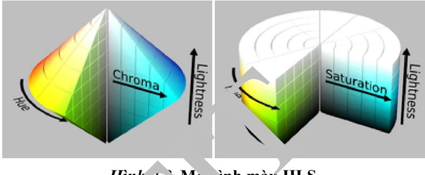  
Hình 2.8. Mô hình màu HLS

# Giả mã chuyển đổi từ RGB sang Hển HSL

Hàm RGB_HLS_Conversion()

H: Sắc độ màu [0àu [0 360] với màu đỏ tại điểm 0   
S: Độ bão hòa [0ão [0-1]   
V: Giá trị cường độ sáng [0ờng [0-1]   
Max: Hàm lấy giá trị cực đạiấy   
Min: Hàm lấy giá trị nhỏ nhấtấy   
{ //Xác định độ sángịnh M1= Max(R,G,B) M2= Min(R,G,B) L= (M1+M2) //Xác định độ bịnh bão hòa If M1=M2 //Trư//Trường hợp không màu S= 0 H= Undefined Else If L <= 0.5 then //Trư//Trường hợp màu S= (M1-M2)/(M1+M2)M2)/(M1+M2) Else S= (M1-M2)/(2M2)/(2-M1-M2)

#

Endif //Xác định sắc độ Cr= (M1-R)/(M1-M2) Cg= (M1-G)/(M1-M2) Cb= (M1-B)/(M1-M2) if R=M1 then H= Cb-Cg If G=M1 then H= 2+Cr-Cb If B=M1 then H= 4+Cg-Cr H= H\*60 if H<0 then H= H+360 endif }

# Giả mã chuyển đổi từ HSL sang RGB

Hàm HLS_RGB_Conversion() đi 0   
S: Độ bão hòa [0-1]   
V: Giá trị cường độ   
{ If L <= 0.5 t M2= L\*(1+ Else M2= L+S-L\*S Endif M1= 2\*L-M2 //Kiểm tra độ bão hòa = 0 If S=0 then If H=Undefined R=L G=L B=L Else //Error: Dữ liệu nhập sai Endif Else //Xác định giá trị của RGB RGB(H+120, M1,M2,Value) R= Value RGB(H, M1,M2,Value) G= Value RGB(H-120, M1,M2,Value) B= Value

Endif } //Hàm điều chỉnh giá trị của H cho phù hợp khoảng xác định Hàm RGB(H, M1, M2, Value) { If H < 0 then H= H+360 If H < 60 then Value= M1+(M2-M1)\*H/60 If H >=60 and H < 180 then Value= M2 If H>= 180 and H < 240 then Value = M1+(M2-M1)\*(240-H)/60 If H > 240 and H <= 360 then Value= M1 Return }

# 2.7. CÂU HỎI ÔN TẬP CHƯƠNG

Câu 1: Thế nào là mô hình Raster và Vector? Trình bày sự giống và khác nhau của hai mô hình này.

Câu 2: Nêu các định dạng ảnh phổ biến. Trình bày cách nén ảnh của định dạng anh BITMAP.

Câu 3: Kỹ thuật khuếch tán lỗi (Error diffusion) là gì? Thực hiện khuếch tán lỗi một chiều với ảnh sau, được biết ngưỡng là 127.

Câu 4: Kỹ thuật khuếch tán lỗi hai chiều khác gì với một chiều. Thực hiện khuếch tán lỗi hai chiều với ảnh ở câu 3 sử dụng ma trận khuếch tán lỗi Floyd và Steinberg, được biết ngưỡng là 127.

Câu 5: Hệ mầu HSL và HSV được phát triển vì mục đích gì? Dựa theo giả mã đã trình bày ở trên, hãy viết một phần mềm nhỏ có thể chuyển ảnh giữa các hệ mầu RGB, CMY, HSV và HSV.

# Chương 3:

# XỬ LÝ NÂNG CAO CHẤT LƯỢNG ẢNH

# 3.1. CẢI THIỆN ẢNH SỬ DỤNG CÁC TOÁN TỬ ĐIỂM

# 3.1.1. Giới thiệu

Các phép toán không phụ thuộc không gian là các phép toán không phục thuộc vị trí của điểm ảnh. Ví dụ: Phép tăng giảm độ sáng, phép thống kê tần suất, biến đổi tần suất v.v..

Một trong những khái niệm quan trọng trong xử lý ảnh là biểu đồ tần suất (Histogram): Biểu đồ tần suất của mức xám g của ảnh I là số điểm ảnh có giá trị g của ảnh I. Ký hiệu là h(g)

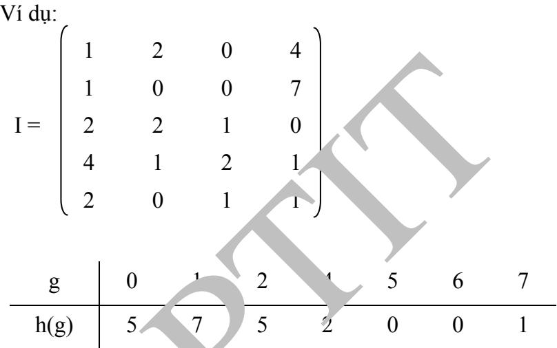

# 3.1.2. Tăng giảm độ sáng

Giả sử ta có ảnh I \~ kích thước m  n và số nguyên c Khi đó, kỹ thuật tăng, giảm độ sáng được thể hiện

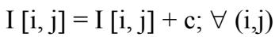

Nếu c > 0 thì ảnh sáng lên và c < 0 thì ảnh tối đi

# 3.1.3. Tách ngưỡng

Giả sử ta có ảnh I \~ kích thước m  n, hai số Min, Max và ngưỡng  Khi đó, kỹ thuật tách ngưỡng được thể hiện

I i, j = I i, j > = ? Max: Min;  (i,j) Nếu Min = 0, Max = 1 thì ảnh thu được sau tách ngưỡng là ảnh đen trắng.

# 3.1.4. Cân bằng tần suất

Ảnh I được gọi là cân bằng "lý tưởng" nếu với mọi mức xám g, g’ ta có h(g) = h(g’) Giả sử, ta có:

I \~ kích thước m  n new_level \~ số mức xám mới của ảnh sau cân bằng, thông thường giá trị này có thể bằng đúng số mức xám của ảnh gốc TB  m n  \~ số điểm ảnh trung bình của mỗi mức xám của ảnh đã cân bằng new level_ g t g h i( ) ( ) \~ số điểm ảnh có mức xám  g trên ảnh gốc i 0

Cần xác định hàm f: g  f(g) sao cho:

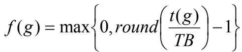

Ví dụ: Cân bằng ảnh sau với new_level = 4

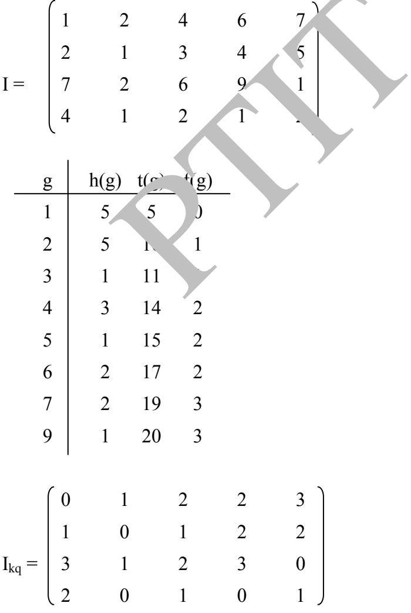

Ảnh sau khi thực hiện cân bằng chưa chắc đã là cân bằng "lý tưởng ", tuy nhiên chúng ta có thể thấy biểu đồ tần suất của anh sau cân bằng đồng đều hơn rất nhiều so ảnh gốc.

# 3.1.5. Kỹ thuật tìm tách ngưỡng tự động

Ngưỡng  trong kỹ thuật tách ngưỡng thường được cung cấp bởi người sử dụng. Kỹ thuật tìm tách ngưỡng tự động xác định ngưỡng  một cách tự động dựa vào histogram theo một nguyên lý trong vật lý là vật thể có thể tách làm 2 phần nếu tổng độ lệnh trong từng phần là tối thiểu.

Giả sử, ta có ảnh

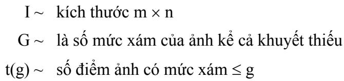

 g i h im g . ( ) 1 ( ) \~ mômen quán tính TB có mức xám  g

Hàm f: g  f (g ) được định nghĩa là:

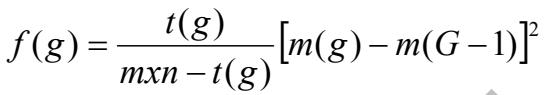

Ngưỡng  được xác định sao cho:

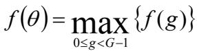

Ví dụ: Tìm ngưỡng tự động của ảnh sau

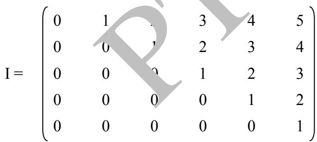

<table><tr><td>g </td><td>h(g) t(g)</td><td>g.h(g)</td><td>∑ ih(i) i=0</td><td>m(g)</td><td>f(g)</td></tr><tr><td>0</td><td>15 15</td><td>0</td><td>0</td><td>0</td><td>1.35</td></tr><tr><td>1</td><td>5 20</td><td>5</td><td>5</td><td>0,25</td><td>1.66</td></tr><tr><td>2</td><td>4 24</td><td>8</td><td>13</td><td>0,54</td><td>1.54</td></tr><tr><td>3</td><td>3 27</td><td>9</td><td>22</td><td>0,81</td><td>1.10</td></tr><tr><td>4</td><td>2 29</td><td>8</td><td>30</td><td>1,03</td><td>0.49</td></tr><tr><td>5</td><td>1 30</td><td>5</td><td>35</td><td>1,16</td><td>0</td></tr></table>

Ngưỡng tìm được  = 1 ứng với f() = 1.66.

# 3.1.6. Biến đổi cấp xám tổng thể

Nếu biết ảnh và hàm biến đổi thì ta có thể tính được ảnh kết quả và do đó ta sẽ có được histogram của ảnh biến đổi. Nhưng thực tế nhiều khi ta chỉ biết histogram của ảnh gốc và hàm biến đổi, câu hỏi đặt ra là liệu ta có thể có được histogram của ảnh biến đổi. Nếu có như vậy ta có thể hiệu chỉnh hàm biến đổi để thu được ảnh kết quả có phân bố histogram như mong muốn.

Bài toán đặt ra là biết histogram của ảnh, biết hàm biến đổi hãy vẽ histogram của   
ảnh mới. Giả sử ta có ảnh gốc I với các mức xám g và biểu đồ tần suất h(g). Phép biến đổi   
f(g) biến ảnh I thành I' với các mức xám q như vậy q  f (g) . Biểu đồ tần suất h(q) có thể   
được tính bằng ( ) ( )h q h i .   ( ) 1i f q

Ví dụ:

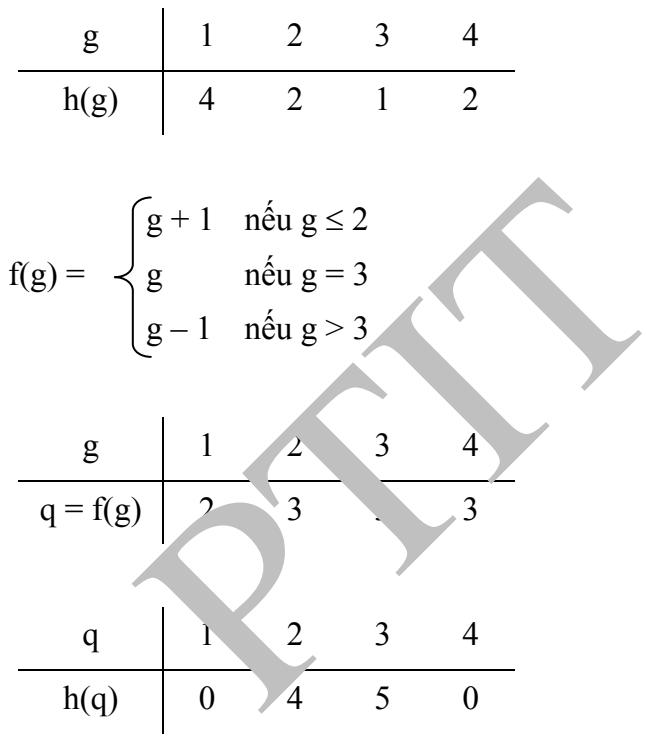

# 3.2. CẢI THIỆN ẢNH SỬ DỤNG CÁC TOÁN TỬ KHÔNG GIAN 3.2.1. Phép cửa sổ di chuyển (Moving Window)

Hầu hết các phương pháp xử lý ảnh sử dụng toán tử không gian là phương pháp cửa sổ di chuyển. Về cơ bản phương pháp cửa sổ di chuyển thực hiện biến đổi trên một điểm dựa vào giá trị điểm ảnh nằm trong một cửa sổ bao trùm các điểm ảnh lân cận.

Gọi I và J là ảnh sao cho J = T[J]. T[X] là một phép biến đổi sao cho

Đây là phép biến đổi cửa sổ di chuyển với kích thước (s+1) x (d+1) và giá trị được biến đổi nằm ở góc trên bên trái cửa sổ.

# 3.2.2. Phép nhân chập và mẫu

Nhân chập là một phép cửa sổ di chuyển, phép biến đổi được định nghĩa thông qua một ma trận (mẫu). Giả sử ta có ảnh I kích thước M  N, mẫu T có kích thước m  n khi đó, ảnh I nhân chập theo mẫu T được xác định bởi công thức.

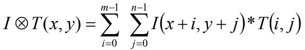

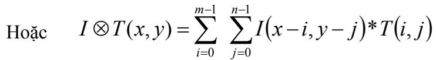

Theo công thức (3.1) thì giá trị được biến đổi nằm ở góc trên bên trái cửa sổ, trong khi đó theo công thức (3.2) thì giá trị được biến đổi nằm ở góc dưới bên phải cửa sổ.

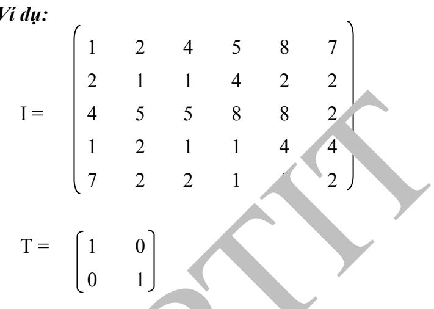

Tính theo công thức (3.1)

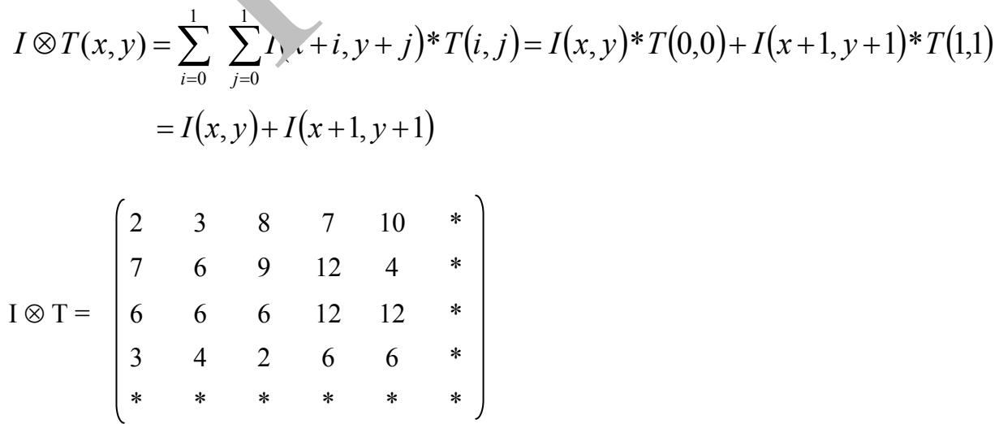

Tính theo công thức (3.2)

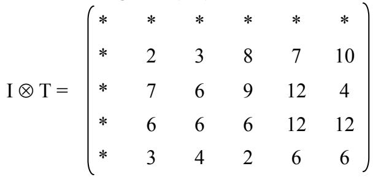

Trong quá trình thực hiện phép nhân chập có một số thao tác ra ngoài ảnh, ảnh không được xác định tại những vị trí đó dẫn đến ảnh thu được có kích thước nhỏ hơn.

Ảnh thực hiện theo công thức 3.1 và 3.2 chỉ sai khác nhau 1 phép dịch chuyển để đơn giản ta sẽ hiểu phép nhân chập là theo công thức 3.1

# Một số mẫu nhân chập thông dụng

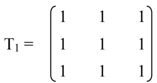

Dùng để khử nhiễu  Các điểm có tần số cao

Ví dụ 1:

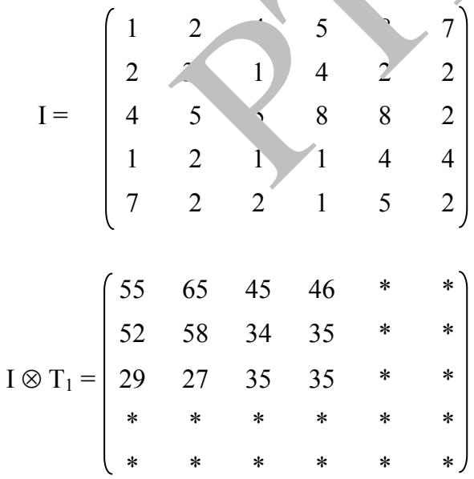

Áp dụng kỹ thuật cộng hằng số với c = -27, ta có:

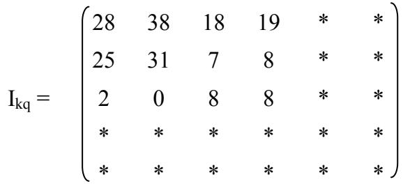

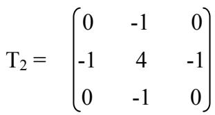

Dùng để phát hiện các điểm có tần số cao

Ví dụ 2:

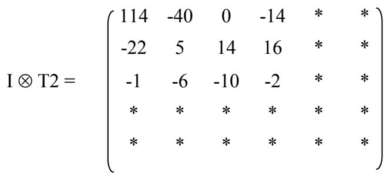

# 3.2.3. Lọc trung vị

\* Định nghĩa 3.1 (Trung vị)

Cho dãy x1; x2...; xn đơn điệu tăng (giả m). Khi đó trung vị của dãy ký hiệu là Med(xn), được định nghĩa:

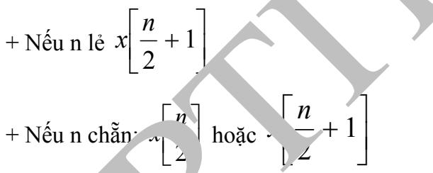

\* Mệnh đề 3.1

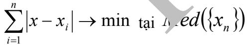

# \*Chứng minh mệnh đề 3.1

Xét trường hợp n chẵn

Ta có:

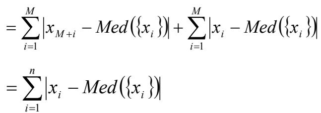

Nếu n lẻ:

Bổ sung thêm phần tử   iMed x vào dãy. Theo trường hợp n chẵn ta có:

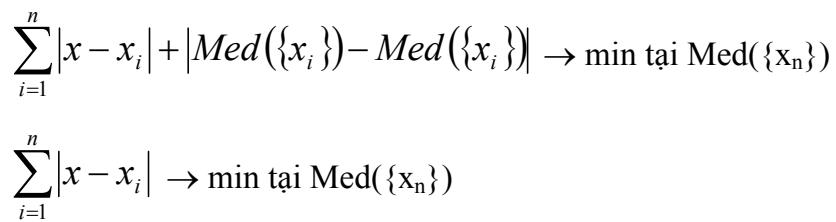

# \* Kỹ thuật lọc trung vị

Giả sử ta có ảnh I ngưỡng  cửa sổ W(P) và điểm ảnh P Khi đó kỹ thuật lọc trung vị phụ thuộc không gian bao gồm các bước cơ bản sau:

+ Bước 1: Tìm trung vị

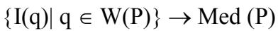

+ Bước 2: Gán giá trị

Ví dụ:

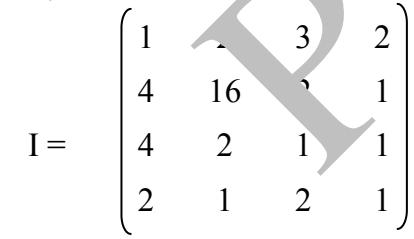

với cửa sổ W(3  3) và  = 2

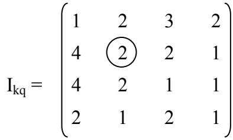

Giá trị 16, sau phép lọc có giá trị 2, các giá trị còn lại không thay đổi.

# 3.2.4. Lọc trung bình

# \* Định nghĩa 3.2 (Trung bình)

Cho dãy x1, x2…, xn khi đó trung bình của dãy ký hiệu AV(xn) được định nghĩa:

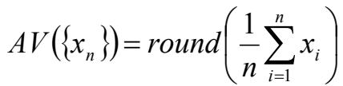

\* Mệnh đề 3.2

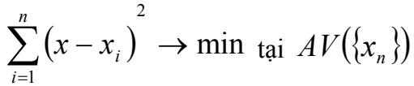

# \* Chứng minh mệnh đề 3.2

Đặt:      i x x x 2 ( ) i 1

Ta có:

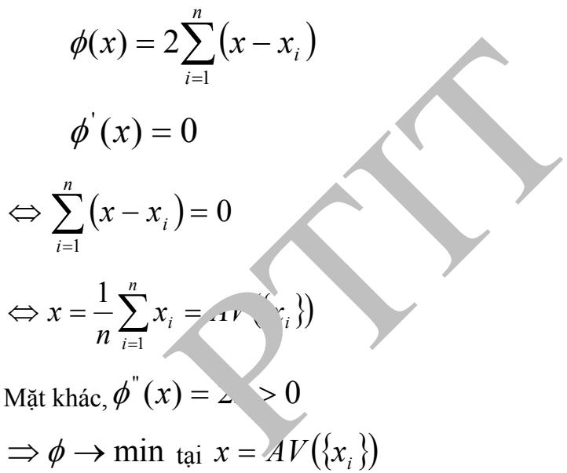

# Kỹ thuật lọc trung bình

Giả sử ta có ảnh I, điểm ảnh P, cửa sổ W(P) và ngưỡng . Khi đó kỹ thuật lọc trung bình phụ thuộc không gian bao gồm các bước cơ bản sau:

+ Bước 1: Tìm trung bình

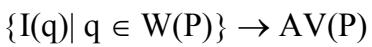

+ Bước 2: Gán giá trị

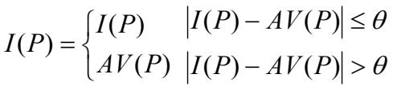

Ví dụ:

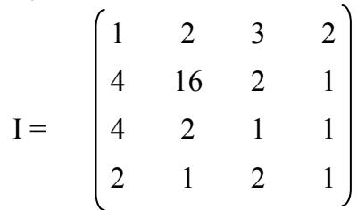

với cửa sổ W(3  3) và  = 2

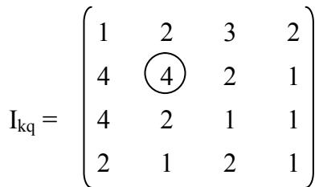

Giá trị 16 sau phép lọc trung bình có giá trị 4, các giá trị còn lại giữ nguyên sau phép lọc.

# 3.2.5. Lọc trung bình theo k giá trị gần nhất

Giả sử ta có ảnh I, điểm ảnh P, cửa sổ W(P), ngưỡng  và số k. Khi đó, lọc trung bình theo k giá trị gần nhất bao gồm các bước sau:

+ Bước 1: Tìm K giá trị gần nhất

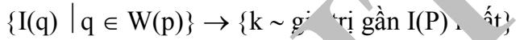

+ Bước 2: Tính trung bình

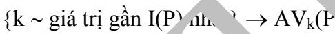

+ Bước 3: Gán giá trị

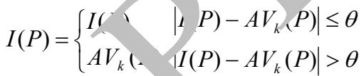

Ví dụ:

với cửa sổ W(3  3),  = 2 và k = 3

Nếu k lớn hơn kích thước cửa sổ thì kỹ thuật chính là kỹ thuật lọc trung bình, nếu k là 1 thì ảnh kết quả không thay đổi. Vậy nên chất lượng của kỹ thuật phụ thuộc vào số phân tử lựa chọn k.

# 3.3. KHÔI PHỤC ẢNH

# 3.3.1. Nhiễu và mô hình nhiễu

Ảnh được coi là một miền đồng nhất về mức xám, tức là các điểm ảnh lân cận có sự biến đổi liên tục về mức xám. Như vậy sau quá trình số hoá thì trong mỗi cửa sổ đang xét các điểm ảnh đều có giá trị gần bằng như nhau. Thực tế quan sát có những điểm ảnh có giá trị khác hơn nhiều so với các điểm ảnh xung quanh. Đó chính là nhiễu. Như vậy, nhiễu trong ảnh số được xem như là sự dịch chuyển đột ngột của tín hiệu ảnh trên một khoảng cách nhỏ.

# Mô hình liên tục

Hệ thống thu nhận ảnh chuyển các hình ảnh thực của môi trường xung quanh g(x,y) thành dạng tín hiệu ảnh g’(x,y). Tuy nhiên trong quá trình chuyển đổi có nhiều yếu tố tác động tạo thành nhiễu. Do đó tín hiệu g’(x,y) có thể chứa các thành phần nhiễu trong đó. Quá trình thu nhận ảnh có nhiễu có thể mô tả một cách trực quan như sau:

  
ình 3.1. Mô hình nhiễu

# Mô hình rời rạc:

Trên cơ sở mô hình nhiễu liên tục, ta có thể xây dựng một mô hình nhiễu rời rạc tương ứng với ảnh số. Khi đó g(x,y) sẽ chuyển thành ảnh rời rạc g[m,n], ảnh liên tục g’(x,y) sẽ chuyển thành ma trận điểm ảnh g’[m,n] và nhiễu cũng phân bố rời rạc tại các điểm ảnh [m,n]. Giả sử H là hàm tuyến tính bất biến trong phạm vi MN (kích thước ảnh) thì ta có:

Đối với xử lý số ảnh thì ta chỉ sử dụng mô hình nhiễu rời rạc.

# 3.3.2.Các loại nhiễu

Các tín hiệu nhiễu thường được chia thành các loại chính như sau:

 Nhiễu do thiết bị thu nhận ảnh: là loại nhiễu gây ra do giới hạn nhiễu xạ và quang sai của thấu kính, nhiễu do bộ phận cảm quang, ảnh mờ nhòe do ống kính, nhiễu do rung động thiết bị trong quá trình thu nhận.

 Nhiễu nhẫu nhiên độc lập: là các loại nhiễu gây ra do ảnh hưởng của môi trường xung quanh, do ảnh hưởng của khí quyển.

 Nhiễu do vật quan sát: là nhiễu gây ra do bề mặt của bản thân vật có độ nhám gồ ghề. Chính nhiễu này gây hiện tượng tán xạ của các tia đơn sắc và sinh ra hiện tượng nhiễu lốm đốm.

Thường người ta xấp xỉ các loại nhiễu bằng các quá trình tuyến tính bất biến vì có nhiều công cụ tuyến tính có thể giải quyết vấn đề khôi phục ảnh hơn là các công cụ phi tuyến. Việc xử lý nhiễu bằng cách xấp xỉ tuyến tính cũng giúp cho công việc dễ dàng hơn trong trường hợp dùng cách biến đổi phi tuyến.

# 3.3.3.Các kỹ thuật lọc nhiễu

Trong phần này ta sẽ xét hai kỹ thuật lọc tuyến tính hay sử dụng là lọc đảo và lọc giả đảo.

# Lọc đảo (inverse filter):

Nguyên lý của lọc đảo là sử dụng hàm ngược của đáp ứng xung h[m,n] để khôi phục lại một ảnh xấp xỉ ảnh nguyên gốc g[m,n] từ ảnh g’[m,n] đã biết nguyên lý này được biễu diễn mô tả theo sơ đồ sau:

# Hình 3.2. Lọc đảo khôi phục ảnh nguyên

Như vậy ảnh khôi phục g\*[m,n] sẽ được tính theo công thức:

g\*[m,n]= g’[m,n]\* h-1 [m,n]

Trong đó h-1 [m,n] chính là hàm của bộ lọc đảo. Vì H-1 (H(x)) = x nên ta có giá trị đầu ra là g\*[m,n] cũng bằng giá trị đầu vào g[m,n]. Như vậy ta đã khôi phục được ảnh g[m,n] nhờ dùng hàm ngược của đáp ứng xung h[m,n]. Nếu dùng biến đổi Fourier ta có:

Qua đó ta thấy, đáp ứng ần số của bộ lọc đảo là nghịch đảo của đáp ứng tần số của hệ thu nhận ảnh. Nếu đánh giá được mức nhiễu ta có thể xấp xỉ gần hơn với ảnh nguyên gốc:

[ , ][ , ] [ , ] ' N u vG u v G u v   với N[u,v] là nhiễu ước lượng [ , ][ , ] H u vH u v

Nếu H[u,v] bằng 0 hoặc khá nhỏ thì hệ thống khôi phục sẽ không ổn định (hàm HT [u,v] không xác định). Đây chính là nhược điểm của phương pháp lọc đảo. Tuy bộ lọc đảo có khả năng ngăn nhiễu do hệ thống nhận ảnh gây ra khá tốt nhưng việc thiết kế bộ lọc này lại là khá phức tạp.

# Lọc giả đảo (Pseudoinverse filter):

Kỹ thuật lọc này khắc phục được nhược điểm của kỹ thuật lọc đảo là làm cho hàm HT [u,v] luôn xác định:

Với  là một giá trị cho trước.

Trong trường hợp ảnh nguyên gốc g[m,n] chuyển động tịnh tiến theo phương x và y sinh ra hiện tượng nhoè ảnh thì HT [u,v] sẽ được xác định theo các thông số chuyển động, và lọc giả đảo có khả năng khôi phục được ảnh nhoè này.

# Lọc nhiễu lốm đốm:

Ta đã biết nhiễu lốm đốm gây ra do tính chất gồ ghề của bề mặt vật thể gây ra hiện tượng tán xạ các tia đơn sắc. Phần này ta sẽ nghiên cứu một kỹ thuật lọc nhiễu lốm đốm là kỹ thuật trung bình thống kê sử dụng bộ lọc đồng cầu.

Kỹ thuật lọc nhiễu trung bình thống kê tiến hành thống kê các cường độ sáng của đối tượng ảnh bị nhiễu lốm đốm bằng N lần thu nhận độc lập và lấy trung bình các cường độ đó.

Ta giả thiết hệ thống chỉ có nhiễu lốm đốm và nhiễu này có thể coi như là tổng vô số hạn các pha độc lập và đồng nhất. Ta có thể biễu diễn nhiễu lốm đốm như sau:

a[m,n]=aR[m,n]+j.aL[m,n]

Với aR và aL là các biến ngẫu nhiên độc lập phân bố theo Gaussian, ứng với mỗi toạ độ [m,n] có trung bình bằng 0 và phương sai  2 . Ta có cường độ S:

S[m,n] =  a[m,n]  = aR 2 +

Như vậy ảnh thu được trong lần nhận thứ i (1,...,N) sẽ là:

gi’[m,n]=g[m,n].si[m,n]

Trị trung bình thống kê của N lần thu nhận ảnh sẽ là:

Trong đó sN[m,n] là trị trung bình thống kê của trường cường độ nhiễu lốm đốm

# Lọc đồng cầu (Homomorphic filter):

Nếu lấy logarit 2 vế của biểu thức 3.10 ta thu được:

log g’N[m,n]= log g[m,n]+ log sN[m,n]

Đặt wN[m,n]= log g’N[m,n], z[m,n]= log g[m,n],N[m,n]= log sN[m,n]

Ta có mô hình quan sát có nhiễu lốm đốm như sau:

wN[m,n]= z[m,n] +N[m,n]

Từ công thức 3.12 ta thấy có thể tìm ra z[m,n] từ wN[m,n] và N[m,n]. Như vậy là có thể tách nhiễu lốm đốm và khôi phục lại ảnh ban đầu.

Trong công thức 3.12 thì N[m,n] là nhiễu trắng dừng. Với N≥2 thì N[m,n] có thể mô tả gắn với nhiễu ngẫu nhiên Gauusian với mật độ phổ được định nghĩa như sau:

# 3.4. CÂU HỎI ÔN TẬP CHƯƠNG

Câu 1: Biểu đồ tần suất là gì? Hãy tìm biểu đồ tần suất h(g) cho ảnh I sau, được biết các điểm ảnh có giá trị từ 0 đến 9:

Câu 2: Thực hiện các phép biến đổi sau với ảnh I ở câu 1.

Tăng sáng với c = 4.   
 Tách ngưỡng với θ = 3.   
 Cân bằng tần suất với ảnh kết quả có cùng số mức xám với ảnh gốc. Tìm ngưỡng tự động và tách ngưỡng.

Lưu ý: Các điểm ảnh chỉ nhận giá trị từ 0 đến 9.

Câu 3: Từ biểu đồ tần suất h(g) tính được ở câu 1 hãy tính biểu đồ tần suất h'(g) của ảnh I' sau khi được biến đổi từ ảnh I sử dụng biểu thức:

Câu 4: Thực hiện nhân chập ảnh I với ma trận nhân chập H:

Câu 5: Thực hiện lọc với cửa sổ 3x3 và θ = 3 sử dụng các phương pháp sau với ảnh I ở câu 1:

 Lọc trung vị với.   
 Lọc trung bình.   
 Lọc trung bình k giá trị gần nhất với k = 4.

# Chương 4:

# CÁC PHƯƠNG PHÁP PHÁT HIỆN BIÊN

# 4.1. KHÁI QUÁT VỀ BIÊN VÀ PHÂN LOẠI CÁC KỸ THUẬT DÒ BIÊN CƠ BẢN

# 4.1.1. Giới thiệu

Biên là vấn đề quan trọng trong trích chọn đặc điểm nhằm tiến tới hiểu ảnh. Cho đến nay chưa có định nghĩa chính xác về biên, trong mỗi ứng dụng người ta đưa ra các độ đo khác nhau về biên, một trong các độ đo đó là độ đo về sự thay đổi đột ngột về cấp xám. Ví dụ: Đối với ảnh đen trắng, một điểm được gọi là điểm biên nếu nó là điểm đen có ít nhất một điểm trắng bên cạnh. Tập hợp các điểm biên tạo nên biên hay đường bao của đối tượng. Xuất phát từ cơ sở này người ta thường sử dụng hai phương pháp phát hiện biên cơ bản:

Phát hiện biên trực tiếp: Phương pháp này làm nổi biên dựa vào sự biến thiên mức xám của ảnh. Kỹ thuật chủ yếu dùng để phát hiện biên ở đây là kỹ thuật lấy đạo hàm. Nếu lấy đạo hàm bậc nhất của ảnh ta có các kỹ thuật Gradient, nếu lấy đạo hàm bậc hai của ảnh ta có kỹ thuật Laplace. Ngoài ra còn có một số các tiếp cận khác Phát hiện biên gián tiếp: Nếu bằng cách nào đó ta phân được ảnh thành các vùng thì ranh giới giữa các vùng đó gọi là biên. Kỹ thuật dò biên và phân vùng ảnh là hai bài toán đối ngẫu nhau vì dò biên để thực hiện phân lớp đối tượng mà khi đã phân lớp xong nghĩa là đã phân vùng được ảnh và ngược lại, khi đã phân vùng ảnh đã được phân lớp thành các đối tượng, do đó có thể phát hiện được biên.

Phương pháp phát hiện biên trực tiếp tỏ ra khá hiệu quả và ít chịu ảnh hưởng của nhiễu, song nếu sự biến thiên độ sáng không đột ngột, phương pháp tỏ ra kém hiệu quả, phương pháp phát hiện biên gián tiếp tuy khó cài đặt, song lại áp dụng khá tốt trong trường hợp này. Sự khác biệt cơ bản giữa hai phương pháp này là: Phương pháp phát hiện biên trực tiếp cho ta kết quả là ảnh biên, còn phương pháp phát hiện biên gián tiếp cho ta kết quả là đường biên.

# 4.1.2. Kỹ thuật phát hiện biên Gradient

Theo định nghĩa, gradient là một véctơ có các thành phần biểu thị tốc độ thay đổi giá trị của điểm ảnh, ta có:

Trong đó, dx, dy là khoảng cách (tính bằng số điểm) theo hướng x và y.

Tuy ta nói là lấy đạo hàm nhưng thực chất chỉ là mô phỏng và xấp xỉ đạo hàm bằng các kỹ thuật nhân chập vì ảnh số là tín hiệu rời rạc nên đạo hàm không tồn tại.

Giả sử với dx và dy nhỏ nhất là 1, ta có:

Do đó, mặt nạ nhân chập theo hướng x là A= 1 1

Ví dụ:

# 4.1.2.1. Kỹ thuật Prewitt

Kỹ thuật sử dụng 2 mặt nạ nhập chập xấp xỉ đạo hàm theo 2 hướng x và y là:

Các bước tính toán của kỹ thuật Prewitt

+ Bước 1: Tính I  Hx và I  Hy

+ Bước 2: Tính I  Hx + I  Hy

+ Bước 3: Phân ngưỡng theo θ để có ảnh biên

Ví dụ:

# 4.1.2.2. Kỹ thuật Sobel

Tương tự như kỹ thuật Prewitt kỹ thuật Sobel sử dụng 2 mặt nạ nhân chập theo 2 hướng x, y là:

Các bước tính toán tương tự Prewitt

+ Bước 1: Tính I  Hx và I  Hy + Bước 2: Tính I  Hx + I  Hy + Bước 3: Phân ngưỡng theo θ để có ảnh biên

# 4.1.2.3. Kỹ thuật la bàn

Kỹ thuật sử dụng 8 mặt nạ nhân chập eo 8 hướng 00 , 450 , 900 , 1350 , 1800 , 2250 , 2700 , 3150

Các bước tính toán thuật toán La bàn

# 4.1.3. Kỹ thuật phát hiện biên Laplace

Các phương pháp đánh giá gradient ở trên làm việc khá tốt khi mà độ sáng thay đổi rõ nét. Khi mức xám thay đổi chậm, miền chuyển tiếp trải rộng, phương pháp cho hiệu quả hơn đó là phương pháp sử dụng đạo hàm bậc hai Laplace.

Toán tử Laplace được định nghĩa như sau:

Ta có:

Tương tự,

Vậy: 2 f= f(x+1,y) + f(x,y+1) - 4f(x,y) + f(x-1,y) + f(x,y-1)

Dẫn tới:

Trong thực tế, người ta thường dùng nhiều kiểu mặt nạ khác nhau để xấp xỉ rời rạc đạo hàm bậc hai Laplace. Dưới đây là ba kiểu mặt nạ thường dùng:

# 4.1.4. Kỹ thuật Canny

Đây là một thuật toán được phát triển khá sớm nhưng cho đến nay vẫn là một trong những kỹ thuật được sử dụng rộng rãi, cho các kết quả tương đối tốt, có khả năng đưa ra đường biên mảnh, phân biệt được điểm biên với điểm nhiễu.

# Hình 4.1. Kết quả tìm biên của Canny

# Thuật toán Canny gồm năm bật bước:

+ Bước 1: Làm trơn  ảnh. Chúng ta sử dụng

Tính I  H, với:

Gọi G là kết quả lọc nhiễu: Gết  = I  H

+Bước 2: Tính gradient ccủa ản bằng mặt nạ PreWitt (hoặc các mặc ma trận phát hiện biên khác như Roberts, SobeSobe , kết quả đặt vào Gx,Gy.

Gx = G  Hx, Gy = G   Hy

+ Bước3: Tính độộ lớn và hướng của gradient tại mỗi điểm (i,j) cm của ảnh. Độ lớn G(i,j) tại điểm (i,j) được tính dc dựa vào định lý Pitago:

Ngoài ra hướng củủa véc tơ gradient được tính với công thức:

với atan2 là hàm  arctan với hai biến nhằm nhận thêm thông tin hưêm thông hướng và xác định góc trong khoảng 360˚, hàm , atan2 có thể được định nghĩa như sau:

Sau đó hướng gradient được làm tròn thành bốn góc 0˚, 45˚, 90˚ và 135˚ đại diện cho chiều dọc, ngang và hai chiều chéo.

+ Bước 4: Bước này loại bỏ những điểm không phải là cực đại địa phương để xóa bỏ những điểm không thực sự là biên, bước này sẽ giúp biên mỏng hơn. Xét (i,j), (i,j) là hướng gradient tại (i,j). I1, I2 là hai điểm lân cận của (i,j) theo hướng . Theo định nghĩa điểm biên cục bộ thì (i,j) là biên nếu I(i,j) cực đại địa phương theo hướng gradient nghĩa là nếu I(i,j) > I1 và I(i,j) > I2 thì mới giữ lại I(i,j) để xét tiếp trong bước sau.

+ Bước 5: Tại bước này, Canny sử dụng hai ngưỡng cao và thấp. Đầu tiên, Canny lọc các điểm được giữ lại sử dụng ngưỡng cao, chỉ những điểm có độ lớn gradient cao hơn ngưỡng này mới được chọn. Từ những điểm được chọn Canny dò theo biên sử dụng hướng của gradient tại các điểm. Khi thực hiện việc dò theo biên, Canny sử dụng ngưỡng thấp để xác định điểm dừng của biên (nếu giá trị điểm tiếp theo thấp hơn ngưỡng này, việc dò theo biên này sẽ kết thúc)

Các kỹ thuật thông thường để có được ảnh biên thường sử dụng một ngưỡng, điểm ảnh có độ lớn gradien lớn hơn ngưỡng này sẽ được chọn làm biên. Tuy nhiên các kỹ thuật sử dụng một ngưỡng không thể vừa chọn biên chính xác và mảnh như Canny, và thông thường sẽ có quá nhiều biên giả hoặc xác định thiếu biên. Đây chính là một trong những điều khiến Canny vẫn là kỹ thuật dò biên tốt nhất hiện nay.

# 4.2. PHƯƠNG PHÁP PHÁT HIỆN BIÊN CỤC BỘ

# 4.2.1. Biên và độ biến đổi về mức xám

Như đã trình bày ở trên trong thực tế người ta thường dùng hai phương pháp phát hiện biên cơ bản là: Phát hiện biên trực tiếp và gián tiếp. Phần này đề cập đến kỹ thuật dựa vào trung bình cục bộ trên cơ sở đánh giá độ chênh lệch về giá trị mức xám của điểm ảnh so với các điểm lân cận do đó kết hợp được ưu điểm của cả hai khuynh hướng trực tiếp và gián tiếp.

Đối với các ảnh màu theo mô hình nào đó đều có thể chuyển sang mô hình gồm 3 thành phần mầu R, G, B. Sau đó dễ dàng chuyển các ảnh màu sang dạng ảnh đa cấp xám. Giá trị xám của điểm ảnh có thể được tính là trung bình cộng của ba thành phân màu R,G và B. Việc xử lý, thao tác trên các ảnh xám có một ưu điểm là dễ xử lý hơn các ảnh màu mà vẫn giữ được các đặc tính của ảnh. Các ảnh trắng đen tuy dễ xử lý nhất nhưng sẽ bị mất nhiều chi tiết sau khi chuyển đổi.

Một cách lý tưởng đồ thị biến thiên mức xám của điểm ảnh khi qua biên phải có dạng:

Trong thực tế dạng đồ thị này chỉ gặp trong các ảnh trắng đen (ảnh xám có hai màu), còn với các ảnh thực thì đồ thị của nó có dạng:

Khó khăn cho việc phân tích các ảnh trên thực tế là ở chỗ sự biến thiên về mức xám của điểm ảnh không phải chỉ được thể hiện theo một hướng duy nhất mà phải xét theo cả tám hướng của các điểm ảnh láng giềng, tại các vùng biên và lân cận biên sự biến thiên mức xám của các điểm ảnh thường không đột ngột mà trải qua một khoảng biến thiên không đều nhưng có tốc độ biến thiên nhanh.

Chúng ta có thể xác định được các đường biên như thế này bằng kỹ thuật Laplace nhưng như ở trên đã nói kỹ thuật này rất nhạy cảm với nhiễu mà nhiễu hầu như lại là vấn đề mà ở trong bức ảnh nào cũng có. Ngoài ra, trong thực tế khi dò biên cho các ảnh xám tùy theo mục đích xử lý sau này mà người ta có thể muốn lấy biên của tất cả các đối tượng trong ảnh hoặc chỉ một số đối t ư ợng chính trong ảnh. Các kỹ thuật đạo hàm do sử dụng các mặt nạ là các ma trận nhân chập nên khó điều chỉnh độ chi tiết của ảnh biên thu được.

Muốn làm được điều này lại phải tính toán lại các giá trị của các phần tử trong ma trận theo các công thức nhất định, rất phức tạp và tốn kém. Không những thế ảnh thu được sau khi lọc không làm mất đi được tất cả các điểm không thuộc đường biên mà chỉ làm nổi lên các điểm nằm trên biên và muốn nhận dạng được các đối tượng thì ta còn phải xử lý thêm một vài bước nữa thì mới thu được ảnh biên thực sự. Có thể nhận thấy là các thuật toán dò biên truyền thống mà chúng ta hay dùng vẫn chưa đạt được sự hoàn thiện như mong muốn.

# 4.2.2. Phát hiện biên dựa vào trung bình cục bộ

Ý tưởng chính của thuật toán được đề xuất là: Xác định tất cả các điểm nằm trên biên không theo hướng tìm kiếm và sử dụng các ma trận lọc, thông qua việc so sánh độ chênh lệch về mức xám của nó so với mức xám chung của các điểm ảnh lân cận (mức xám nền). Trước hết giá trị xám trung bình của các điểm ảnh nằm trong phạm vi của ma trận 3×3 hoặc 5×5 có tâm là điểm ảnh đang xét sẽ được tính toán. Nếu như độ chênh lệch mức xám giữa điểm đang xét với giá trị xám trung bình thỏa mãn lớn hơn một mức tối thiểu δ1 nào đó (PTB+ δ1< P) thì chúng ta sẽ coi nó là điểm biên và ghi nhận lại, còn các điểm không thỏa mãn điều kiện trên sẽ được coi là điểm nền.

a) Ma trận điểm ảnh trước khi lọc b) Ma trận điểm ảnh sau khi lọc

# Hình 4.2. Ma trận điểm ảnh trước và sau lọc

# Thuật toán có thể được mô tả như sau:

for (i=0; i< biHeight; i++){ for (j=0; j< biWidth; j++){ tt_GrayScale=0; for (ii=i-1; ii<=i+1; ii++) for (jj=j-1; jj<=j+1; j++) tt_GrayScale+=GetPoint pOrgImg,ii,jj); } } if (tt_GrayScal e>9\*GetP int(pOrgImg,i,j)+δ ){ SetPoint(pBdImg ,i,j,BLACK); } }

Trong đó:

 biWidth, biHeight: là chiều rộng và chiều cao của ảnh tính theo đơn vị Pixel.   
 pOrgImg, pBdImg: lần lượt là các con trỏ trỏ đến các vùng dữ liệu của ảnh gốc và ảnh biên.   
 tt_GrayScale: là tổng giá trị độ xám của các điểm ảnh thuộc ma trận 3×3 có tâm là điểm ảnh đang xét.   
 δ1: là độ chênh lệch mức xám của điểm ảnh đang xét so với giá trị xám trung bình của ma trận.   
 SetPoint() và GetPoint(): là các hàm đọc, ghi giá trị điểm ảnh.

Chúng ta có thể so sánh được hiệu quả của thuật toán phát hiện biên này so với các thuật toán phát hiện biên truyền thống thông qua các hình minh họa dưới đây. Hình 4.3a là ảnh gốc, Hình 4.3b là ảnh biên qua lọc Sobel Hx, Hình 4.3c là ảnh biên qua lọc Sobel Hy, Hình 4.3d là ảnh biên qua lọc Kirsh, Hình 4.2e là ảnh biên qua lọc Laplace. Hình 4.3 là các ảnh biên thu được khi sử dụng thuật toán phát hiện biên đề xuất dựa vào trung bình cục bộ với giá trị δ1 khác nhau. Hình 4.3a là ảnh biên thu được với δ1= 25, Hình 4.3b là ảnh biên thu được với δ1= 250.

Hình 4.3. Các ảnh biên theo các thuật toán phát hiện biên truyền thống

  
a) Ảnh biên thu được với δ1= 25 b) Ảnh biên thu được với δ1= 250   
Hình 4.4. Các ảnh biên kết quả thu được theo thuật toán đề xuất

Chúng ta có nhận xét là ảnh gốc sử dụng trong chương trình có mầu nền khá tối và có rất nhiều nhiễu. Các bộ lọc sử dụng trong minh họa trên đều mắc phải vấn đề này. Thuật toán dò biên sử dụng trong chương trình tuy đã hạn chế được nhiều nhiễu so với việc sử dụng các bộ lọc và làm nổi rõ các đường biên nhưng vẫn không loại bỏ được hầu hết các nhiễu. Khi áp dụng thuật toán trên chúng ta vẫn có thể làm giảm bớt nhiễu đi nhiều hơn nữa bằng cách tăng giá trị của hệ số δ1 lên. Nhưng khi đó các đường biên thu được cũng bị đứt đoạn và mờ đi nhiều.

Thuật toán có độ phức tạp tỷ lệ với kích thước ảnh và kích thước cửa sổ. Độ phức tạp của thuật toán là O(n2 ) nên nó thực hiện việc tìm biên khá nhanh, ảnh biên thu được chỉ gồm các điểm ảnh và điểm biên nên dễ xử lý, bản thân thuật toán này cũng ít chịu ảnh hưởng của nhiễu hơn là kỹ thuật Sobel mặc dù nó có khả năng phát hiện khá tốt các vùng biên nhiễu. Nhưng cũng giống các phương pháp phát hiện biên trực tiếp khác là nó cho kết quả đường biên có độ dày không đều.

# 4.3. DÒ BIÊN THEO QUY HOẠCH ĐỘNG

# 4.3.1. Một số khái niệm cơ bản \*Ảnh và điểm ảnh

Ảnh số là một mảng số thực 2 chiều (Iij) có kích thước (MN), trong đó mỗi phần tử Iij(i = 1,...,M; j = 1,...,N) biểu thị mức xám của ảnh tại (i,j) tương ứng.

Ảnh được gọi là ảnh nhị phân nếu các giá trị Iij chỉ nhận giá trị 0 hoặc 1.

Ở đây ta chỉ xét tới ảnh nhị phân vì ảnh bất kỳ có thể đưa về dạng nhị phân bằng kỹ thuật phân ngưỡng. Ta ký hiệu  là tập các điểm vùng (điểm đen) và  là tập các điểm nền (điểm trắng).

# \*Các điểm 4 và 8-láng giềng

Giả sử (i,j) là một điểm ảnh, các điểm 4-láng giềng là các điểm kề trên, dưới, trái, phải của (i,j):

và những điểm 8-láng giềng gồm:

Trong Hình 3.1 biểu diễn ma trận 8 láng giềng kề nhau, các điểm P0, P2, P4, P6 là các 4-láng giềng của điểm P, còn các điểm P0, P1, P 2, P3, P4, P5, P6, P7 là các 8-láng giềng của P.

  
Hình 4.5. Ma trận 8-láng giềng kề nhau

# \*Đối tượng ảnh

Hai điểm Ps, Pe  E, E   hoặc  được gọi là 8-liên thông (hoặc 4-liên thông) trong E nếu tồn tại tập các điểm được gọi là đường đi (io,jo)...(in,jn) sao cho (io,jo)= Ps, (in,jn)= Pe, (ir,jr)  E và (ir,jr) là 8-láng giềng (hoặc 4-láng giềng tương ứng) của (ir-1,jr-1) với r = 1,2,...,n

Quan hệ k-liên thông trong E (k=4,8) là một quan hệ phản xạ, đối xứng và bắc cầu. Bởi vậy đó là một quan hệ tương đương. Mỗi lớp tương đương được gọi là một thành phần k-liên thông của ảnh. Về sau ta sẽ gọi mỗi thành phần k-liên thông của ảnh là một đối tượng ảnh.

# 4.3.2. Chu tuyến của một đối tượng ảnh Định nghĩa 4.1: [Chu tuyến]

Chu tuyến của một đối tượng ảnh là dãy các điểm của đối tượng ảnh P1,,Pn sao cho Pi và Pi+1 là các 8-láng giềng của nhau (i=1,...,n-1) và P1 là 8-láng giềng của Pn, i Q không thuộc đối tượng ảnh và Q là 4-láng giềng của Pi. Kí hiệu <P1P2..Pn>.

Tổng các khoảng cách giữa hai điểm kế tiếp của chu tuyến là độ dài của chu tuyến và kí hiệu Len(C) và hướng PiPi+1 là hướng chẵn nếu Pi và Pi+1 là các 4 – láng giềng (trường hợp còn lại thì PiPi+1 là hướng lẻ). Hình 4.6 dưới đây biểu diễn chu tuyến của ảnh, trong đó, P là điểm khởi đầu chu tuyến.

# Hình 4.6. Ví dụ về chu tuyến của đối tượng ảnh

# Định nghĩa 4.2 [Chu tuyến đối ngẫu]

Hai chu tuyến C= <P1P2..Pn> và C = <Q1Q2..Qm> được gọi là đối ngẫu của nhau nếu và chỉ nếu i j sao cho:

(i) Pi và Qj là 4-láng giềng của nhau.   
(ii) Các điểm Pi là vùng thì j là nền và ngược lại.

# Định nghĩa 4.3 [Chu tuyến ngoài]

Chu tuyến C được gọi là chu tuyến ngoài (Hình 4.7a) nếu và chỉ nếu

(i) Chu tuyến đối ngẫu C là chu tuyến của các điểm nền (ii) Độ dài của C nhỏ hơn độ dài C

# Định nghĩa 4.4 [Chu tuyến trong]

Chu tuyến C được gọi là chu tuyến trong (Hình 4.7b) nếu và chỉ nếu:

(i) Chu tuyến đối ngẫu C là chu tuyến của các điểm nền (ii) Độ dài của C lớn hơn độ dài C

  
b) Chu tuyến trong

  
a) Chu tuyến ngoài   
Hình 4.7. Chu tuyến trong, chu tuyến ngoài

# Định nghĩa 4.5 [Điểm trong và điểm ngoài chu tuyến]

Giả sử C= <P1P2..Pn> là chu tuyến của một đối tượng ảnh và P là một điểm ảnh. Khi đó:

(i) Nếu nửa đường thẳng xuất phát từ P sẽ cắt chu tuyến C tại số lẻ lần, thì P được gọi là điểm trong chu tuyến C và kí hiệu in(P,C)   
(ii) Nếu PC và P không phải là điểm trong của C, thì P được gọi là điểm ngoài chu tuyến C và kí hiệu out(P,C).

# Bổ đề 4.1 [Chu tuyến đối ngẫu]

Giả sử E   là một đối tượng ảnh và C= < P1P2..Pn> là chu tuyến của E, C =<Q1Q2..Qm> là chu tuyến đối ngẫu tương ứng. Khi đó:

(i) Nếu C là chu tuyến trong thì in(Qi,C) i (i=1,....,m) (ii) Nếu C là chu tuyến ngoài thì in(Pi,C ) i (i=1,...,n)

# Bổ đề 4.2 [Phần trong/ngoài của chu tuyến]

Giả sử E   là một đối tượng ảnh và C là chu tuyến của E. Khi đó:

(i) Nếu C là chu tuyến ngoài thì x  E sao cho xC, ta có in(x,C) (ii) Nếu C là chu tuyến trong thì x  E sao cho xC, ta có out(x,C)

# Định lý 4.1 [Tính duy nhất của chu tuyến ngoài]

Giả sử E   là một đối tượng ảnh và CE là chu tuyến ngoài của E. Khi đó CE là duy nhất.

# 4.3.3. Thuật toán dò biên tổng quát

Biểu diễn đối tượng ảnh heo chu tuyến thường dựa trên các kỹ thuật dò biên. Có hai kỹ thuật dò biên cơ bản. Kỹ thuật thứ nhất xét ảnh biên thu được từ ảnh vùng sau một lần duyệt như một đồ thị, sau đó áp dụng các thuật toán duyệt cạnh đồ thị. Kỹ thuật thứ hai dựa trên ảnh vùng, kết hợp đồng th quá trình dò biên và tách biên. Ở đây ta quan tâm cách tiếp cận thứ hai.

Trước hết, giả sử ảnh được xét chỉ bao gồm một vùng ảnh 8-liên thông , được bao bọc bởi một vành đai các điểm nền. Dễ thấy  là một vùng 4-liên thông chỉ là một trường riêng của trường hợp trên.

Về cơ bản, các thuật toán dò biên trên một vùng đều bao gồm các bước sau:

 Xác định điểm biên xuất phát  Dự báo và xác định điểm biên tiếp theo  Lặp bước 2 cho đến khi gặp điểm xuất phát

Do xuất phát từ những tiêu chuẩn và định nghĩa khác nhau về điểm biên, và quan hệ liên thông, các thuật toán dò biên cho ta các đường biên mang các sắc thái rất khác nhau.

Kết quả tác động của toán tử dò biên lên một điểm biên ri là điểm biên ri+1 (8-láng giềng của ri). Thông thường các toán tử này được xây dựng như một hàm đại số Boolean trên các 8-láng giềng của ri. Mỗi cách xây dựng các toán tử đều phụ thuộc vào định nghĩa quan hệ liên thông và điểm biên. Do đó sẽ gây khó khăn cho việc khảo sát các tính chất của đường biên. Ngoài ra, vì mỗi bước dò biên đều phải kiểm tra tất cả các 8-láng giềng của mỗi điểm nên thuật toán thường kém hiệu quả. Để khắc phục các hạn chế trên, thay vì sử dụng một điểm biên ta sử dụng cặp điểm biên (một thuộc , một thuộc ), các cặp điểm này tạo nên tập nền vùng, kí hiệu là NV và phân tích toán tử dò biên thành 2 bước:

Xác định cặp điểm nền vùng tiếp theo.  Lựa chọn điểm biên

Trong đó bước thứ nhất thực hiện chức năng của một ánh xạ trên tập NV lên NV và bước thứ hai thực hiện chức năng chọn điểm biên.

# Thuật toán dò biên tổng quát

Bước 1: Xác định cặp nền-vùng xuất phát   
Bước 2: Xác định cặp nền-vùng tiếp theo   
Bước 3: Lựa chọn điểm biên vùng   
Bước 4: Nếu gặp lại cặp xuất phát thì dừng, nếu không quay lại bước 2

Việc xác định cặp nền-vùng xuất phát được thực hiện bằng cách duyệt ảnh lần lượt từ trên xuống dưới và từ trái qua phải rồi kiểm tra điều kiện lựa chọn cặp nền-vùng. Do việc chọn điểm biên chỉ mang tính chất quy ước, nên ta gọi ánh xạ xác định cặp nền-vùng tiếp theo là toán tử dò biên.

# Định nghĩa 4.6 [Toán tử dò biên]

Giả sử T là một ánh xạ như sau NV  NV

Gọi T là một toán tử dò biên cơ sở nếu nó thoả mãn điều kiện: b’,r’ là các 8-láng giềng của r.

Giả sử (b,r)  NV; gọi K(b,r) là hàm chọn điểm biên. Biên của một dạng  có thể định nghĩa theo một trong ba cách:

 Tập những điểm thuộc  có mặt trên NV, tức là K(b,r)= r   
 Tập những điểm thuộc  có trên NV, tức là K(b,r)= b Tập những điểm ảo nằm giữa cặp nền-vùng, tức là K(b,r) là những điểm nằm giữa hai điểm b và r.

Cách định nghĩa thứ ba tương ứng mỗi cặp nền-vùng với một điểm biên. Còn đối với cách định nghĩa thứ nhất và thứ hai một số cặp nền-vùng có thể có chung một điểm biên. Bởi vậy, quá trình chọn điểm biên được thực hiện như sau:

i:= 1; (bi,ri):= (bo,ro); While K(bi,ri)<>K(bn,rn) and i8 do Begin (bi+1,ri+1)= T(bi,ri); i:= i+1; End; Điều kiện dừng: Cặp nền-vùng thứ n trùng với cặp nền vùng xuất phát: (bn,rn)= (bo,ro)

# \* Xác định cặp nền – vùng xuất phát

Cặp nền vùng xuất phát được xác định bằng cách duyệt ảnh lần lượt từ trên xuống dưới và từ trái sang phải điểm đem đầu tiên gặp được cùng với điểm trắng trước đó (theo hướng 4) để tạo nên cặp nền vùng xuất phát.

# \* Xác định cặp nền vùng tiếp theo

Đầu vào: pt, dir   
Ví dụ: (3, 2) 4   
Point orient []= (1,0);(1;-1);(0;-1);(-1;-1);(-1;0);(-1,1);(0,1);(1,1);   
//Hàm tìm hướng có điểm đen gần nhất   
BYTE GextNextDir(POINT pt, BYTE dir)   
{ BYTE pdir= (dir + 7)%8; do{ if(getpixel(pt. x+orient pdir. x,pt.y+orient pdir. y))==BLACK) return pdir; pdir = (pdir + 7) %8; }while(pdir ! = dir); return. ERR; //Điểm cô lập   
}   
pdir = GetNextDir(pt, dir);   
if(pdir==ERR) //Kiểm tra return. ERR; //Điểm cô   
pt. x = pt. x + orient pdir. x;   
pt. y = pt. y + o rient pdir. y;

Để tính giá trị cho hướng tiếp theo ta lập bảng dựa trên giá trị pdir đã tính được trước đó theo các khả năng có thể xảy ra:

<table><tr><td>pdir</td><td>Diêm tráng truóc dó</td><td>Trng so vói den mói</td></tr><tr><td>0</td><td>1</td><td>2</td></tr><tr><td>1</td><td>2</td><td>4</td></tr><tr><td>2</td><td>3</td><td>4</td></tr><tr><td>3</td><td>4</td><td>6</td></tr><tr><td>4</td><td>5</td><td>6</td></tr><tr><td>5</td><td>6</td><td>0</td></tr><tr><td>6</td><td>7</td><td>0</td></tr><tr><td>7</td><td>0</td><td>2</td></tr></table>

 Do đó công thức để tính hướng tiếp theo sẽ là:

# 4.4.CÁC PHƯƠNG PHÁP KHÁC

# 4.4.1. Các phép toán hình thái c1. cơ bản

Hình thái là thuật ngữ chỉ sự nghiật nghiên cứu về cấu trúc hay hình hình học topo của đối tượng trong ảnh. Phần lớn các pphép toán của "Hình thái" được định nghĩa từ hai phép toán cợc nghĩa hai cơ bản là phép "giãn nở" (Dilation) vở" và phép "co" (Erosion).

Các phép toán này đưđược định nghĩa như sau: Giả thiết ta có đối tả thiết tượng X và phần tử cấu trúc (mẫu) B trong không gian Euclide hai chiều. Kấu Kí hiệu Bx là ddịch chuyển của B tới vị trí x.

# Định nghĩa 4.7 (DILATION)

Phép "giãn nở" của X theo mẫu B lở" là hợp của tất cả các Bx vớiới x thuộc X. Ta có:

# Định nghĩa 4.7 (EROSION)

Phép "co" của X theo B lủa là tập hợp tất cả các điểm x sao cho Bm x Bx nằm trong X. Ta có:

# Đình nghĩa 4.9 (OPEN)

Phép toán mở (OPEN) của X theo cấu trúc B lở là tập hợp cácập các điểm của ảnh X sau khi đểm đã co và giãn nở liên liếp theo B. Ta có:

Ví dụ: Với tập X và B trong ví ddụ trên ta có

# Định nghĩa 4.10 (CLOSECLOSE)

Phép toán đóng (CLOSE) ccủa X theo cấu trúc B là tập hợp các điểm của ảnh X sau ập các ảnh khi đã giãn nở và co liên tià tiếp theo B. Ta có:

CLOSE(X,B) = (X   B)  B

Theo ví dụ trên ta có:

# 4.4.2. Một số tính chất của phép toán hột hình thái \* Mệnh đề 4.1 [Tính gia tăngtăng]:

(i) X  X’  X  B  X’  B B X  B  X’  B B (ii) B  B'  X  B  X B' X X  B  X  B’ X Chứng minh:

#

(i) X  B =  B  B x  x   B' xX x X ' X  B =  x / Bx = X’  B  x / Bx  X '   
(ii) X  B =  B  x   B' X B'  x x

Theo định nghĩa:

# \*Mệnh đề 4.2 [Tính phân phTính phối với phép ]:

(i) X  (B  B') = (X   B)  (X  B') (ii) X (B  B') = (X   B)  (X B')

# Chứng minh:

(i) X  (B  B’) = (X  B)  (X  B’) Ta có: B  B’  B X  (B  B’)  X  B (tính gia tăng)

Tương tự:

Mặt khác,

(ii) X  (B  B’) = (X  B)  (X  B’)

Ta có: B  B’  B  X  (B  B’)  X  (tính gia g) Tương tự: X  (B  B’)  X  B’  X  (B  B’)  (X  B)  (X  B’)

Mặt khác,

\* Ý nghĩa:

Ta có thể phân tích các mẫu phức tạp trở thành các mẫu đơn giản thuận tiện cho việc cài đặt.

\* Mệnh đề 4.3 [Tính phân phối với phép ]:

# Chứng minh:

Ta có, X  Y  X  (X  Y)  B  X  B Tương tự: (X  Y)  B  Y  B

Mặt khác,

\* Mệnh đề 4.4 [Tính kết hợp]

(i) (X  B)  B' = X  (B  B') (ii) (X  B)  B' = X  (B  B')

# Chứng minh:

(i) (X  B)  B' = X  (B'  B)

(i) (X  B)  B' = X  (B  B')

Trước hết ta đi chứng minh: ' Bx  X  B  B B x( ) '   X

Thật vậy, do ' Bx  X  B nên y ' Bx  yX  B

Mặt khác, B B x( ) '   X  ( ' Bx  B)  X

Do đó, ' B  X  B

# \* Định lý 4.2 [X bị chặn bởi các cận OPEN và CLOSE]

Giả sử, X là một đối tượng ảnh, B là mẫu, khi đó, X sẽ bị chặn trên bởi tập CLOSE của X theo B và bị chặn dưới bởi tập OPEN của X theo B.

Tức là:

(X  B)  B  X  (X  B)  B

# Chứng minh:

Mặt khác,

Suy ra: X  (X  B)  B

Từ (4.7) và (4.8) Ta có: (X  B)  B  X  (X  B)  B.

# \*Hệ quả 4.1 [Tính bất biến]:

(i) ((X  B) B)  B = X  B (ii) ((X  B)  B)  B = XB

# Chứng minh:

(i) Thật vậy, từ định lý 4.2 ta có X  (X  B) Ө B  X  B  ((X  B) B)  B (do tính chất gia tăng)

Mặt khác, cũng từ định lý 4.2 ta có (X  B)  B  X X

Do đó, thay X bởi X  B ta có, ((X  B) B)  B  X  B

Từ (4.9) và (4.10) Ta có: ((X  B) B)  B = X  B

(ii) Thật vậy, từ định lý 4.2 ta có (X  B)  B  X

Mặt khác, cũng từ định lý 4.2 ta có X  (X  B) Ө B X

Do đó, thay X bởi X  B ta có, XB  ((X  B)  B)  B

Từ (4.11) và (4.12) Ta có: ((X  B)  B)  B = XB (đpcm).

# 4.4.3. Xấp xỉ trên và xấp xỉ dưới đối tượng ảnh

Biên là vấn đề quan trọng trong xử lý ảnh và nhận dạng, vì các đặc điểm trích chọn trong quá trình nhận dạng chủ yếu dựa vào biên. Trong thực tế người ta thường dùng hai phương pháp pháp hiện biên cơ bản là: Phát hiện biên trực tiếp và gián tiếp. Phần này đề cập đến một tiếp cận mới trong phát hiện biên dựa vào các phép toán hình thái thông qua các kỹ thuật xấp xỉ trên và xấp xỉ dưới đối tượng.

Cũng đã có một vài tác giả đề cập đến kỹ thuật phát hiện biên dựa vào phép toán hình thái. Nhưng các kỹ thuật phát hiện biên trực tiếp, gián tiếp và dựa vào các phép toán hình thái kể trên đều xuất phát từ quan điểm biên của đối tượng là một tập hợp con của đối tượng. Trong thực tế chúng ta thường hiểu đường biên là khu vực ranh giới bao gồm cả hai phần thuộc đối tượng và không thuộc đối tượng. Ở phần dưới đây, chúng tôi đề xuất một kỹ thuật phát hiện biên dựa vào phép toán hình thái theo quan niệm này, xuất phát từ cơ sở định lý 4.2 đã được chứng minh ở trên.

Biên (hay đường biên) có thể hiểu đơn giản là các đường bao của các đối tượng trong ảnh chính là ranh giới giữa đối tượng và nền. Việc xem ranh giới là phần được tạo lập bởi các điểm thuộc đối tượng và thuộc nền cho phép ta xác định biên dựa trên các phép toán hình thái.

Theo định lý 4.2 ta có: (XB)B  X B

Như vậy, tập CLOSE(X,B) = (XB)B có thể được xem như là xấp xỉ trên của tập X theo mẫu B (Hình 4.8).

# Hình 4.8. Xấp xỉ trên và dưới theo mẫu B của X

Cũng theo định lý 4.2 ta có, (XB)B  X B

Do vậy, tập OPEN(X,B) = (XB)B có thể được xem như là xấp xỉ dưới của tập X theo mẫu B.

Từ đó, tập CLOSE(X,B)\ OPEN(X,B) có thể được xem như là xấp xỉ biên của tập X theo mẫu và quá trình xấp xỉ biên của X theo mẫu B kí hiệu là X B.

Để tăng độ chính xác, người ta thường xem B là dãy các phần tử cấu trúc.

B = {Bi, 1 i  n }

Và xấp xỉ biên của X theo tập cấu trúc B được xác định:

# 4.4.4. Thuật toán phát hiện biên dựa vào phép toán hình thái

Vào : Ảnh X và dãy mẫu B= {Bi, 1 i  n }; Ra : Biên của đối tượng theo mẫu B

Phương pháp:

Bước 1: Tính X  Bi i=1,n

Bước 2: Tính

Trong Hình 4.9a dưới đây là ảnh gốc với 256 mức xám, Hình 4.9b là ảnh biên thu được qua phát hiện biên bằng Sobel, Hình 4.9c là ảnh biên thu được qua phát hiện biên bằng Laplace. Hình 4.9d là ảnh biên kết quả thực hiện bởi thuật toán phát hiện biên bằng các phép toán hình thái với ngưỡng tách  = 128 và các mẫu tách biên Bi là:

  
a) Ảnh gốc đa cấp xám

  
b) Ảnh biên thu được qua Sobel

  
c) Ảnh biên thu được qua Laplace

  
d) Ảnh biên kết quả dựa vào phép toán hình thái

Hình 4.9. Phát hiện biên bởi thuật toán dựa vào phép toán hình thái

# 4.5. CÂU HỎI ÔN TẬP CHƯƠNG

Câu 1: Điểm biên được định nghĩa như thế nào? Kỹ thuật phổ biến nhất để phát hiện biên là gì?

Câu 2: Thực hiện cài đặt phương pháp tách biên Canny. Đầu vào của hệ thống là một ma trận ảnh đa cấp xám (0-255)và đầu ra là ảnh với chỉ hai loại điểm ảnh, điểm nền có giá trị là 0 và điểm biên có giá trị là 255.

Câu 3: Thực hiện phép co và dãn hình X với một phần tử cấu trúc B sau để được hai hình X1 và X2. Thực hiên phép trừ để tìm ảnh biên. Được biết tâm của B là ở chính giữa.

Câu 4: Thực hiện phép đóng và mở hình X với một phần tử cấu trúc B ở câu 3 để T được hai hình X1 và X2. Thực hiên phép trừ để tìm ảnh biên. Được biết tâm của B là ở chính giữa.

# Chương 5:

# PHÂN VÙNG ẢNH

# 5.1. GIỚI THIỆU

Xử lý ảnh bao gồm các bước: thu nhận ảnh, tiền xử lý, phân đoạn ảnh, biểu diễn và giải thích, nhận dạng và mô tả (tuy nhiên không phải ứng dụng xử lý ảnh nào cũng phải có đầy đủ tất cả các bước trên). Trong các bước đó, bước phân đoạn ảnh là bước quan trọng nhất nhưng và cũng khó khăn nhất. Mặt khác, có nhiều ứng dụng quan trọng cần đến kỹ thuật phân đoạn: ảnh màu hoặc đa mức xám thì cần phải phân ngưỡng; muốn nhận dạng được các đối tượng thì trước hết cần phải phân ảnh thành các vùng khác nhau chứa các đối tượng trong ảnh: tách ra vùng là chữ, số trên bì thư hoặc fax trong phân loại thư, fax tự động; tách ra các vùng là chữ, hình ảnh, bảng biểu … trong các ứng dụng nhập dữ liệu tự động; tách ra vùng bị bỏng để đánh giá phần trăm diện tích bỏng trên da; tách ra vùng rừng bị cháy trong ảnh chụp từ máy bay, vệ tinh để phát hiện cháy rừng; tách ra ao, hồ, cây xanh từ ảnh chụp thành phố từ vệ tinh để đánh giá tỷ lệ ao hồ, cây xanh, nhà cửa của thành phố v.v..

Hình dáng của một đối tượng có thể được miê u tả hoặc bởi các tham số của đường biên hoặc các tham số của vùng mà nó chiếm giữ. Sự miêu tả hình dáng dựa trên thông tin đường biên yêu cầu việc phát hiện biên. Sự mô tả hình dáng dựa vào vùng đòi hỏi việc phân đoạn ảnh thành một số vùng đồng nhất. Như vậy, phát hiện biên và phân vùng là hai cách tiếp cận đối ngẫu trong việc phân tích ảnh. Các vùng ảnh yêu cầu phải có các đặc tính đồng nhất (ví dụ như: cường độ, kết cấu) giúp phân biệt được từng vùng. Các đặc tính này tạo nên các vectơ đặc trưng (feature vectors) để phân biệt một vùng với các vùng khác. Các đặc trưng được sử dụng tron suốt quá trình phân đoạn theo các nguyên tắc kiểm tra tính đồng nhất của vùng.

Chúng ta hãy giả sử rằng một miền ảnh X phải được phân đoạn thành N vùng khác nhau: R1, …, RN và nguyên tắc phân đoạn là một vị từ của công thức P(R). Cả miền ảnh X và các vùng của nó R1, …, RN có thể được miêu tả một cách tiện lợi bởi các tập con của plane ảnh (image plane) Z2. Việc phân đoạn ảnh chia tập X thành các tập con Ri, i = 1..N có những tính chất sau:

Những vùng Ri, i=1..N phải lấp kín hoàn toàn ảnh, nó được thể hiện trong tính chất (5.1). Tính chất (5.2) đảm bảo rằng hai vùng khác nhau là những tập hợp rời nhau. Vị từ P(Ri) phải là TRUE trên mỗi vùng Ri để bảo đảm tính đồng nhất của vùng, có thể được thấy ở 5.3. Cuối cùng, vị từ P(RiRj) (i  j) phải là FALSE, bởi vì RiRj, i  j tương ứng với một vùng ảnh không đồng nhất.

Công thức của vị từ phân đoạn P và những đặc trưng mà nó sử dụng đóng vai trò quan trọng trong kết quả phân đoạn. P thường là một vị từ của công thức P(R,x,t), trong đó x là vectơ đặc trưng gắn với một điểm ảnh và t là một tập hợp các tham số (thường là các ngưỡng). Các đặc trưng cấu trúc thường được chứa trong vectơ đặc trưng. Trong trường hợp đơn giản nhất, vectơ đặc trưng x chỉ có cường độ ảnh f(k,l) và vectơ ngưỡng chỉ gồm một ngưỡng T. Một nguyên tắc phân đoạn đơn giản có công thức:

P(R): f(k,l) < T

Trong trường hợp các ảnh màu, vectơ đặc trưng x có thể là ba thành phần ảnh RGB [fR(k,l), fG(k,l), fB(k,l)]T. Một nguyên tắc phân đoạn ảnh đơn giản có thể có công thức:

Trong nhiều ứng dụng, sự liên thông của vùng đóng vai trò quan trọng trong việc phân đoạn ảnh. Một vùng R được gọi là liên thông nếu bất kỳ hai điểm (xA,yA) và (xB,yB) thuộc vào R có thể được nối bởi một đường (xA,yA)... (xi-1,yi-1), (xi,yi), (xi+1,yi+1)... (xB,yB), mà các điểm (xi,yi) thuộc vào R và bất kỳ điểm (xi,yi) nào đều kề sát với điểm trước (xi-1,yi1) và điểm tiếp theo (xi+1,yi+1) trên đường đó. Một điểm (xk,yk) được gọi là kề với điểm (xl,yl) nếu (xl,yl) thuộc vào láng giềng trực tiếp của (xk,yk). Chúng ta có thể định nghĩa hai loại láng giềng. 4-láng giềng của một điểm (x,y) là một tập hợp bao gồm láng giềng dọc và láng giềng ngang của nó:

8-láng giềng của (x,y) là một tập cha của 4-láng giềng và bao gồm láng giềng ngang, dọc và chéo:

Các đường được xác định bằng cách sử dụng 4-láng giềng gồm có các vệt dọc và ngang với x = y = 1. Những đường sử dụng 8-láng giềng có thêm các vệt chéo với khoảng cách 2 .

Các kỹ thuật phân đoạn có thể chia thành ba lớp khác nhau. Các kỹ thuật cục bộ (Local techniques) dựa vào các thuộc tính cục bộ của các điểm và láng giềng của nó. Các kỹ thuật toàn thể (global) phân ảnh dựa trên thông tin chung của toàn bộ ảnh (ví dụ bằng cách sử dụng lược đồ xám của ảnh – image histogram). Các kỹ thuật tách (split), hợp (merge) và growing sử dụng cả khái niệm đồng nhất và gần về hình học. Hai vùng có thể được hợp lại nếu chúng giống nhau (nếu P(RiRj) = TRUE) và kề nhau. Một vùng không đồng nhất có thể bị chia thành những vùng nhỏ hơn. Một vùng có thể mở rộng bằng cách thêm các điểm sao cho nó vẫn đồng nhất, P(Ri) = TRUE. Các chương tiếp theo sẽ trình bày một số phương pháp phân đoạn ảnh cụ thể.

# 5.2. PHÂN VÙNG ẢNH THEO NGƯỠNG BIÊN ĐỘ

Trong hầu hết các trường hợp, ngưỡng được chọn từ lược đồ độ sáng của vùng hay ảnh cần phân đoạn. Có rất nhiều kỹ thuật chọn ngưỡng tự động xuất phát từ lược đồ xám {h[b] | b = 0, 1,..., B-1} đã được đưa ra, B là số mức xám của ảnh, với ảnh grayscale

B=256. Những kỹ thuật phổ biến sẽ được trình bày dưới đây. Những kỹ thuật này có thể tận dụng những lợi thế do sự làm trơn dữ liệu lược đồ ban đầu mang lại nhằm loại bỏ những dao động nhỏ về độ sáng. Tuy nhiên các thuật toán làm trơn cần phải cẩn thận, không được làm dịch chuyển các vị trí đỉnh của lược đồ. Nhận xét này dẫn đến thuật toán làm trơn dưới đây:

Trong đó,

 W thường được chọn là số lẻ (3 hoặc 5).  hsmooth[b] là giá trị tần xuất của độ sáng b sau khi làm trơn  hraw[b] là giá trị tần xuất của độ sáng b gốc

# 5.2.1. Thuật toán đẳng liệu

Đây là kỹ thuật chọn ngưỡng theo kiểu lặp do Ridler và Calvard đưa ra.

Trước hết, lược đồ sẽ được phân đoạn thành hai phần bằng một giá trị ngưỡng khởi động với 0 = B/2 tức là bằng phân nửa thang độ xám động của ảnh.   
Sau đó, các trung bình mẫu (mf,0) của những điểm ảnh thuộc đối tượng và (mb,0) của những điểm ảnh nền sẽ được tính toán. Một giá trị ngưỡng mới 1 sẽ được tính kế đó bằng cách lấy giá trị trung bình của hai trung bình mẫu n i trê Quá trình này cứ ế sẽ được tiếp tục với ngưỡng mới cho đến khi nào giá trị ngưỡng không thay đổi nữa thì dừng lại.

Nếu biểu diễn dưới dạng công thức toán học, chúng ta có:

với

mf,k+1 thì Bmin = 0 và Bmax = θk  mb,k+1 thì Bmin = θk và Bmax = B - 1

Thực hiện cho tới khi  = 

# 5.2.2. Thuật toán đối xứng nền

Kỹ thuật này dựa trên sự giả định là tồn tại hai đỉnh phân biệt trong lược đồ nằm đối xứng nhau qua đỉnh có giá trị lớn nhất trong phần lược đồ thuộc về các điểm ảnh nền. Kỹ thuật này có thể tận dụng ưu điểm của việc làm trơn được mô tả trong phương trình (5.9). Đỉnh cực đại maxp tìm được nhờ tiến hành tìm giá trị cực đại trong lược đồ. Sau đó thuật toán sẽ được áp dụng ở phía không phải là điểm ảnh thuộc đối tượng ứng với giá trị cực đại đó nhằm tìm ra giá trị độ sáng a ứng với giá trị phần trăm p% mà: P(a) = p%, trong đó P(a) là hàm phân phối xác suất về độ sáng.

# Định nghĩa: [Hàm phân phối xác suất về độ sáng]

Hàm phân phối xác suất P(a) thể hiện xác suất chọn được một giá trị độ sáng từ một vùng ảnh cho trước, sao cho giá trị này không vượt quá một giá trị sáng cho trước a. Khi a biến thiên từ - đến +, P(a) sẽ nhận các giá trị từ 0 đến 1. P(a) là hàm đơn điệu không giảm theo a, do vậy   ≥ 0.

# Hình 5.1 Minh hoạ thuật toán đối xứng nền

Ở đây ta đang giả thiết là ảnh có các đối tượng tối trên nền sáng. Giả sử độ chắc chắn P là 95%, thì có nghĩa là ta phải ở bên phải đỉnh maxp một giá trị a sao cho P(a)=95%. Do tính đối xứng đã giả định ở trên, chúng ta lấy đối xứng qua maxp để có được ngưỡng T:

Kỹ thuật này thực hiện ngược lại với tình huống ảnh có các đối tượng sáng trên một nền tối.

# 5.2.3. Thuật toán tam giác

Thuật toán này do Zack đề xuất. Hình 5.2 minh hoạ thuật toán này. Các bước của thuật toán như sau: Nối đường thẳng  từ điểm Hmax của lược đồ (điểm có histogram lớn nhất, có mức xám bmax) đến điểm Hmin của lược đồ (điểm ứng với độ sáng nhỏ nhất bmin). Với mỗi độ sáng b trong khoảng [bmax, bmin], chúng ta đi tính khoảng cách d từ điểm Hb của lược đồ (ứng với giá trị độ sáng b) đến . Giá trị b0 ứng với khoảng cách d lớn nhất sẽ được chọn làm giá trị ngưỡng T. Kỹ thuật này đặc biệt hiệu quả khi các điểm ảnh thuộc đối tượng tạo nên một đỉnh yếu trong lược đồ ảnh.

  
Hình 5.2. Minh hoạ thuật toán tam giác

# 5.2.4. Chọn ngưỡng đối với Bimodal Histogram

Nếu ảnh chứa một đối tượng và một nền có cường độ đồng nhất, nó thường có một histogram hai mốt (bimodal histogram) như một trường hợp trình bày trong hình 5.3.

Ngưỡng T được chọn ở tại vị trí cực tiểu địa phương của histogram nằm giữa hai đỉnh của histogram. Điểm cực đại địa phương của histogram có thể dễ dàng được phát hiện bằng cách sử dụng biến đổi chóp mũ (top hat) do Meyer đưa ra: Phụ thuộc vào tình huống chúng ta đang phải làm việc là với nhưng đối tượng sáng trên nền tối hay đối tượng tối trên nền sáng mà phép biến đổi top hat sẽ có một trong hai dạng sau:

a) Các đối tượng sáng:

b) Các đối tượng tối:

Việc tính toán giá trị cực tiểu địa phương của histogram thì khó nếu histogram nhiễu. Do đó, trong trường hợp này nên làm trơn histogram, ví dụ sử dụng thuật toán (5.9).

Trong một số ứng dụng nhất định, cường độ của đối tượng hay nền thay đổi khá chậm. Trong trường hợp này, histogram ảnh có thể không chứa hai thuỳ phân biệt rõ ràng, vì vậy có thể phải dùng ngưỡng thay đổi theo không gian. Hình ảnh được chia thành những khối hình vuông, histogram và ngưỡng được tính cho mỗi khối tương ứng. Nếu histogram cục bộ không phải là bimodal histogram thì ngưỡng được tính bằng cách nội suy ngưỡng của các khối láng giềng. Khi ngưỡng cục bộ đã có thì áp dụng thuật toán phân ngưỡng ở hình 5.3 cho khối này.

# 5.3. PHÂN VÙNG THEO MIỀN ĐỒNG NHẤT

# 5.3.1. Giới thiệu

Kỹ thuật phân đoạn ảnh thành các miền đồng nhất dựa vào các thuộc tính quan trọng nào đó của miền. Mỗi một thuộc tính khi sử dụng thì có một tiêu chuẩn phân đoạn tương ứng. Một số thuộc tính tiêu biểu là: mức xám, màu sắc (đối với ảnh màu), kết cấu sợi...

Ta có thể dùng logic vị từ để làm tiêu chuẩn đánh giá phân đoạn. Giả sử ảnh X phải phân thành n vùng khác nhau: Z1, Z2,..., Zn và lôgic vị từ có dạng P(Z). Việc phân vùng phải thoả mãn các tính chất sau:

Kết quả của việc phân đoạn ảnh phụ thuộc vào dạng của vị từ P và các đặc tính biểu diễn bởi vectơ đặc tính. hường vị từ P có dạng P(Z, X, t), với X là véc tơ đặc tính, t là ngưỡng. Trường hợp đơn giản nhất, véc tơ đặc tính chỉ chứa giá trị mức xám của ảnh I(k, t) và ngưỡng chỉ đơn thuần là giá trị T.

P(Z): I (k, I) <T.

Với ảnh màu, véc tơ đặc tính X có thể là thành phần ba màu R, G, B và IR(k,l), IG(k,l), IB(k, l) là các thành phần tương ứng. Lúc đó luật phân ngưỡng có dạng:

Có ba cách tiếp cận chủ yếu trong phân vùng ảnh theo miền đồng nhất và độc lập với tiêu chuẩn lựa chọn tính đồng nhất:

Phương pháp phân tách – cây tứ phân (split – quad trees)  Phương pháp hợp (merge). Phương pháp tách - hợp (split – merge).

Mức độ hiệu quả của các phương pháp là phụ thuộc vào việc lựa chọn tiêu chuẩn đánh giá độ thuần nhất. Trên thực tế người ta hay sử dụng trung bình số học, và độ lệch chuẩn i cho vùng Zi có n điểm:

Hai vùng Zi và Zj có thể hợp nhất nếu | mi-mj | < ki.

Hoặc có thể dựa vào mức xám để xét tiêu chuẩn miền đồng nhất. Giả sử max và min là giá trị mức xám lớn nhất và nhỏ nhất trong miền đang xét. Khi đó, tiêu chuẩn để miền đang xét là đồng nhất có thể là:

| max-min | <θ   
với θ là một ngưỡng   
hoặc tiêu chuẩn là độ lệch bình phương trung bình nhỏ hơn θ

̅ là giá trị trung bình trong vùng ảnh đang

# 5.3.2. Phương pháp tách cây tứ phân (quad tree)

Về nguyên tắc phương pháp này kiểm tra tính hợp thức của tiêu chuẩn đồng nhất một cách tổng thể trên miền lớn. Nếu tiê chuẩn được thoả việc phân đoạn coi như kết thúc. Trong trường hợp ngược l chia miề đang xét thành 4 miền nhỏ hơn, ta lại áp dụng đệ quy bằng phương pháp trên ch o mỗi miền nhỏ hơn cho đến khi tất cả các miền đều thoả mãn. Phương pháp này có mô tả bằng thuật toán sau:

Procedure PhanDoan( e Mi n)   
Begin If miền đang xét không thoả Then Begin Chia miền đang xét thành 4 miền: Z1, Z2, Z3, Z4 For i=1 to 4 Do PhanDoan(Zi) End Else Exit

End;

Nếu miền đang xét không thoả mãn tiêu chuẩn thì không phải là miền đồng nhất và sẽ được chia thành 4 phần.

# Thuật toán kiểm tra tiêu chuẩn theo (5.19) có thể được viết:

Fuction Examin_Criteria(I,N1,M1,N2, M2, T)

/\* Giả sử là ảnh có tối đa 255 mức xám.

(N1,M1), (N2, M2) là toạ độ điểm đầu và điểm cuối của miền, T là ngưỡng. \*/ Begin

1. Max = 0; Min = 255;

2. For i = N1 to N2 do For j = N1 to N2 do If I(i,j) < Min Then Min = I(i,j); If I(i,j) >Max Then Max = I(i,j);

3. If ABS(max - min) < T Then Examin_Criteria = 0

Else Examin_Criteria = 1;

End

# Thuật toán kiểm tra tiêu chuẩn theo (5.20) được viết:

Fuction Examin_Criteria(I,N1,M1,N2, M2, T)

/\* Giả sử là ảnh có tối đa 255 mức xám.

(N1,M1),(N2, M2) là toạ độ điểm đầu điểm cuối của miền, T là ngưỡng.\*/ Begin

1. xtb = 0; e=0; n = (N2-N1)\*(M2-M1)

2. For i = N1 to N2 do For j = N1 to do xtb = xtb + ,j)/n

3. For i = N1 t do

4. If e < T Then Examin_Criteria = 0 Else Examin_Criteria = 1;

End

Nếu hàm trả về giá trị 0, có nghĩa vùng đang xét là đồng nhất, trường hợp ngược lại nghĩa là mức không đồng nhất. Trong giải thuật trên, khi miền là đồng nhất cần tính lại giá trị trung bình và cập nhật lại ảnh đầu ra. Giá trị trung bình được tính bởi:

Tổng giá trị mức xám/ tổng số điểm.

Thuật toán này tạo nên một cây mà mỗi nút cha có 4 nút con ở mọi mức, trừ mức ngoài cùng. Vì thế cây này có tên là cây tứ phân.

Một vùng thoả tiêu chuẩn tạo nên một nút lá, nếu không sẽ tạo nên một nút trong và 4 nút con tương ứng của việc chia làm 4 vùng. Mỗi nút lá của cây biểu diễn một vùng đã phân chia theo tiêu chuẩn.

Hình 5.4 a-e minh họa thuật toán tách cây tứ phân: ảnh gốc (a) được chia thành 4 phần được kết quả phân mức 1 (b), tiếp tục thực hiện đối với các phần nhỏ, ta được phân mức 2, 3.

  
c) Phân mức 2

  
d) Phân mức 3

  
Hình 5.4. Phương pháp tách cây tứ phân

Tiêu chuẩn phân vùng ở đây là màu sắc. Nếu mọi điểm của vùng là màu trắng sẽ tạo nên một nút lá trắng và tương tự như vậy với nút lá đen. Nút màu ghi có nghĩa là vùng không thuần nhất và phải tiếp tục chia.

# 5.3.3. Các phương pháp phân vùng bởi hợp

Ý tưởng của phương pháp này là xem xét ảnh từ các miền nhỏ nhất rồi hợp chúng lại nếu thoả mãn tiêu chuẩn để được một miền đồng nhất lớn hơn. Ta lại tiếp tục với miền thu được cho đến khi không thể hợp được nữa. Số miền còn lại cho ta kết quả phân đoạn ảnh. Miền nhỏ nhất của bước xuất phát là điểm ảnh. Việc hợp 2 vùng được thực hiện theo nguyên tắc sau:

 Hai vùng phải đáp ứng tiêu chuẩn, như cùng màu hay cùng mức xám.  Chúng phải kế cận nhau

Trong xử lý ảnh người ta dùng khái niệm liên thông để xác định kế cận. Với 4 liên thông một điểm ảnh I (x,y) sẽ có 4 kế cận theo hướng x, y. Trong khi đó với 8 liên thông, điểm ảnh I(x, y) sẽ có 4 liên thông theo hai hướng x và y và 4 liên thông khác theo hướng chéo 45˚.

Giả sử chúng ta sử dụng độ lệch tiêu chuẩn làm tiêu chí đánh giá tính đồng nhất. Lớp Ri có n điểm có giá trị trung bình mi và độ lệch tiêu chuẩn

Hai vùng R1 và R2 có thể hợp nếu | m1 - m2 | < T và điểm I(k, l) hợp với vùng Ri nếu nếu| I(k,l) - mi | < T, với T là một ngưỡng. Đầu tiên chúng ta cố gắng hợp điểm (k, l) với một trong các vùng lân cận Ri. Nếu việc hợp không thành công thì ta hợp với các vùng khác đã có. Nếu vẫn không thành công hoặc không có vùng lân cận tồn tại thì điểm này được coi là một vùng mới.

Nếu hợp R  (k, l) là thành công, cập nhật lại giá trị trung bình và độ lệch tiêu chuẩn:

Nếu có nhiều hơn một vùng lân cận thoả mãn thì hợp điểm với vùng Ri có sự khác biệt | I(k,l) - mi | nhỏ nhất.

# 5.3.4. Phương pháp tách hợp (split-merge)

Hai phương pháp vừa xét ở trên có một số nhược điểm.

Phương pháp tách tạo nên một cấu trúc phân cấp và thiết lập mối quan hệ giữa các vùng. Tuy nhiên nó thực hiện việc chia quá chi tiết. Phương pháp hợp cho phép làm giảm số miền liên thông xuống tối thiểu nhưng cấu trúc hàng ngang dàn trải, không cho ta thấy mối liên hệ giữa các vùng.

Chính vì nhược điểm này mà ta nghĩ đến phương pháp phối hợp cả 2 phương pháp. Trước tiên dùng phương pháp tách để tạo nên cây tứ phân, phân đoạn theo hướng từ gốc đến lá. Tiếp theo tiến hành duyệt cây theo chiều ngược lại và hợp các vùng có cùng tiêu chuẩn. Với phương pháp này ta thu được miêu tả cấu trúc của ảnh với các miền liên thông có kích thước tối đa.

# Giải thuật trên gồm một số bước sau:

1. Kiểm tra tiêu chuẩn đồng nhất

i. Nếu không thoả và số điểm trong vùng lớn hơn một điểm, tách làm 4 vùng (trên, dưới, trái, phải) bằng cách gọi đệ quy. Nếu kết quả tách xong và không tách được nữa chuyển sang bước ii.   
ii. Nếu tiêu chuẩn đồng nhất là thoả thì tiến hành hợp vùng và cập nhật giá trị trung bình cho vùng.

2. Hợp vùng Cần kiểm tra 4 lân cận đã nêu trên. Có thể có nhiều vùng thoả mãn khi đó ta chọn vùng tối ưu rồi tiến hành hợp.

Phương pháp này thu được kết quả số vùng là nhỏ hơn phương pháp tách và ảnh được làm trơn hơn.

# 5.4. PHÂN VÙNG DỰA THEO ĐƯỜNG BIÊN

Việc phân đoạn ảnh dựa vào biên được tiến hành qua một số bước:

 Phát hiện biên và làm nổi biên  Làm mảnh biên  Nhị phân hoá đường biên  Miêu tả đường biên

# 5.4.1. Phát hiện biên

Về mặt toán học, người ta coi điểm biên của ảnh là điểm có sự biến đổi đột ngột về độ xám, như trong hình 5.5 sau đây:

  
Hình 5.5. Đường biên của ảnh

Có nhiều định nghĩa về đường biên, điển hình có ba loại đường biên chính:

 Đường biên lý tưởng (Hình 5.5 a) được định nghĩa là sự thay đổi giá trị cấp xám tại một vị trí xác định. Vị trí của đường biên chính là vị trí thay đổi cấp xám.   
 Đường biên bặc thang (Hình 5.5 b) xuất hiện khi sự thay đổi cấp xám trải rộng qua nhiều điểm ảnh. Vị trí của đường biên được xem như vị trí chính giữa của đường nối giữa cấp xám thấp và cấp xám cao. Đường biên thực (Hình 5.5 c): Đó là sự thay đổi cấp xám tại nhiều điểm nhưng không trơn.

Định nghĩa toán học của biên ở trên là cơ sở cho các kỹ thuật phát hiện biên. Điểm quan trọng là biến thiên giữa các điểm ảnh thường là nhỏ, trong khi đó biến thiên độ sáng của điểm biên (khi qua biên) lại khá lớn.

# 5.4.2. Làm mảnh biên

Làm mảnh biên là việc làm nổi biên với độ rộng chỉ 1 pixel. Trong phần trên, ta thấy, kỹ thuật Laplace dùng trong việc phát hiện biên cho kết quả trực tiếp biên ảnh với độ rộng 1 pixel. Còn với các kỹ thuật khác, ví dụ như kỹ thuật Gradient thì không như vậy, ta phải có bước làm mảnh biên để thu được biên với độ rộng 1 pixel.

Khi thực hiện đạo hàm một ảnh, ta thu được những điểm cực trị cục bộ. Theo kỹ thuật Gradient, những điểm cực trị cục bộ có thể coi n ư biên. Do vậy cần tách biệt những điểm cực trị đó để xác định chính xác biên ảnh và để giảm độ rộng biên ảnh. Một trong những phương pháp hay dùng đó là phương pháp “Loại bỏ các điểm không cực đại”.

# 5.4.3. Nhị phân hóa đường biên

Nhị phân hóa đường biên là giai đoạn then chốt trong quá trình trích chọn vì nó xác định đường bao nào thực sự cần và đường bao nào có thể loại bỏ. Nói chung, người ta thường nhị phân hóa đường biên theo cách thức làm giảm nhiễu hoặc tránh hiện tượng kéo sợi trên ảnh. Điều này cũng giải thích tại sao phân đoạn dựa theo biên có hiệu quả khi ảnh có độ tương phản tốt. Trong trường hợp ngược lại, có thể sẽ bị mất một phần đường bao hay đường bao có chân, không khép kín, v.v.., do đó sẽ bất lợi cho biểu diễn sau này. Một phương pháp hay được dùng là chọn ngưỡng thích nghi. Với cách chọn này, ngưỡng sẽ phụ thuộc vào hướng của gradient nhằm làm giảm sự xoắn của biên. Đầu tiên, người ta định ra một ngưỡng nào đó và sau đó sử dụng một hệ số sinh thích nghi thông qua lời giải toán tử đạo hàm theo hướng tìm được để tinh chỉnh.

# 5.4.4. Miêu tả đường biên

Khi đã có bản đồ biên ảnh, ta cần phải biểu diễn nó dưới dạng thích hợp phục vụ cho việc phân tích và làm giảm lượng thông tin dùng để miêu tả, lưu trữ đối tượng. Người ta thường thực hiện theo nguyên tắc: tách riêng từng biên và gán cho mỗi biên một mã.

Có nhiều phương pháp miêu tả đường biên khác nhau, mỗi phương pháp thích hợp với một loại ứng dụng. Việc tách các đường bao có thể phải bổ xung thêm các điều kiện nhằm loại bỏ các đường bao không khép kín, hoặc bỏ đi các chân rết bám theo các đường bao kín.

Có nhiều cách mã hóa đường bao, có thể biểu diễn chính xác đường bao hay xấp xỉ nhờ nội suy. Một số cấu trúc cơ sở mã hóa đường bao thường dùng là: điểm, đoạn thẳng, cung, đường cong. Có một số phương pháp mã hóa đường bao hay dùng như: mã hóa theo tọa độ Đề các, mã hóa Freeman, xấp xỉ bởi đoạn thẳng, xấp xỉ đa thức.

# 5.5. PHÂN VÙNG THEO KẾT CẤU BỀ MẶT

Kết cấu thường được nhận biết trên bề mặt của các đối tượng như gỗ, cát, vải vóc…Kết cấu là thuật ngữ phản ánh sự lặp lại của các phần tử sợi (texel) cơ bản. Sự lặp lại này có thể ngẫu nhiên hay có tính chu kì hoặc gần chu kì. Một texel chứa rất nhiều điểm ảnh. Trong phân tích ảnh, kết cấu được chia làm hai loại chính là: loại thống kê và loại cấu trúc.

# 5.4.1. Phương pháp thống kê

Tính kết cấu ngẫu nhiên rất phù hợp với các đặc trưng thống kê. Vì vậy, người ta có thể dùng các đặc trưng ngẫu nhiên để đo nó như: Hàm tự tương quan (AutoCorrelation Function- ACF), các biến đổi mật độ gờ, ma trận tương tranh,…

Theo cách tiếp cận bằng hàm tự tương quan, độ thô của kết cấu sợi tỉ lệ với độ rộng của ACF, được biểu diễn bởi khoảng cách x0, yo sao cho r(x0,0) = r(0, y0) = 1. Người ta cũng dùng cách đo nhánh của ACF nhờ hàm khởi nh moment:

Các đặc trưng của kế cấu sợi như đ ộ thô, độ mịn hay hướng có thể ước lượng nhờ các biến đổi ảnh bằng kỹ thuậ lọc tuyến tính. Một mô hình đơn giản trong trường hợp ngẫu nhiên cho việc phân tính kết cấu đựoc mô tả trong hình dưới đây:

# Hình 5.6. Phân tích kết cấu sợi bằng dải tương quan

Trong mô hình này, trường kết cấu sợi trước tiên được giải chập bởi bộ lọc lấy từ đầu ra của ACF. Như vậy, nếu r(m,n) là ACF thì:

là trường ngẫu nhiên không tương quan.

Lưu ý rằng, bộ lọc là không duy nhất, có thể là nhân quả, bán nhân quả hay không nhân quả. Các ACF hay dùng như M(0,2), M(2,0), M(1,1), M(2,2). Các đặc trưng của lược

đồ bậc một của ε (m,n) chẳng hạn như trung bình m1, độ phân tán 2 μ cũng hay được sử dụng.

Ngoài các đặc trưng trên, có thể đưa thêm một số khái niệm và định nghĩa các đại lượng dựa trên đó như: lược đồ mức xám (Histogram Grey Level Difference), ma trận xuất hiện mức xám (Grey Level Occurrence Matrices).

# Lược đồ hiệu mức xám:

Lược đồ hiệu mức xám dùng để mô tả các thông tin mang tính không gian và được định nghĩa như sau. Cho d=(d1, d2) là vecto dịch chuyển giữa 2 điểm ảnh và g(d) là hiệu mức xám với khoảng cách d:

với hàm f(k, l) cho giá trị mức xám tại tọa độ (k, l). Gọi hg(g, d) là lược đồ của hiệu mức xám khoảng cách d. Với mỗi khoảng cách d ta có một lược đồ mức xám riêng.

Với một miền ảnh có kết cấu thô, lược đồ hg(g, d) có khuynh hướng tập trung xung quanh g=0 với khoảng cách d nhỏ. Trái lại, với một miền ảnh có kết cấu mịn, hg(g, d) sẽ phân nhánh dù với vecto dịch chuyển d khá nhỏ. Dựa trên lược đồ này, người ta định nghĩa lại một số đại lượng:

 Trung bình:

 Phương sai:

c .)  Độ tương phản:

Phương sai đo độ tản mát của hiệu mức xám tại một khoảng cách d nào đấy. Kết cấu tất định thường có phươ g sai d σ tương đối nhỏ. Độ tương phản cd chính là mômen của lược đồ hg(g,d) xung quanh g=0 và đo độ tương phản của hiệu mức xám.

Người ta sử dụng entropy để đo độ đồng nhất của lược đồ hg:

Ưu điểm cơ bản của lược đồ hiệu mức xám là tính toán đơn giản. Ngoài ra còn có khả năng cho ta tổ chức kết cấu không gian.

# Ma trận xuất hiện liên hiệp mức xám

Giả sử P(k,l,d) là xác suất liên hiệp của hai điểm ảnh fk và f1 với các mức xám k,l tương ứng cách nhau một khoảng d. Xác suất này dễ dàng tính được nhờ việc tính số lần xuất hiện nk,l của cặp điểm ảnh (fk, f1) có mức xám k và l với khoảng cách d. Gọi n là tổng số cặp liên hiệp có thể với khoảng cách d trong ảnh. Các phần tử ck,l của ma trận xuất hiện liên hiệp mức xám cd được tính như sau: cd = (ck,l)

Ma trận xuất hiện liên hiệp mức xám Cd là ma trận vuông NN phần tử (N là số mức xám của ảnh). Ma trận này chứa các thông tin hữu ích về tổ chức kết cấu không gian. Nếu

kết cấu tương đối thô thì các phần tử của ma trận tập trung xung quanh đường chéo chính.   
Ngược lại, nếu kết cấu bề mặt mịn, giá trị các phần tử của cd sẽ phân rải tương đối rõ.

Dựa trên khái niệm này người ta định nghĩa về một số độ đo:

 Xác suất cực đại:

 Entropy:

Dễ dàng thấy được entropy cực đại khi xác suất liên hiệp P(k,l,d) có phân phối đều.

Mô men bậc m:

Id cực tiểu khi các phân tử của ma trận C tập trung trên đường chéo chính vì khoảng cách |k-l|m rất nhỏ, Id nhỏ có nghĩa là kết cấu khá thô. Người ta cũng còn đưa vào một số độ đo khác như hàm tự tương quan, phổ năng lượng.

Để áp dụng cách tiếp cận này, cần cài đặt các giải thuật tính các đại lượng đo trên.

# 5.4.2. Phương pháp cấu trúc

Kết cấu sợi có cấu trúc thuần nhất là những texels xác định, mà sự xuất hiện lặp đi lặp lại tuân theo một luật tất định hay ngẫu nhiên nào đấy. Một texel về thực tế là một nhóm các điểm ảnh có cùng một số tính chất bất biến lặp trên ảnh. Một texel cũng có định nghĩa theo mức xám, theo bề mặt hay tính đồng nhất đối với một số các tính chất như kích thước, hướng, lược đồ bậc hai (ma trận tương tranh).

Với các texel được phân bố ngẫu nhiên, tính kết cấu sợi tương ứng của nó được coi là yếu (Weak) ngược với luật phân bố tất định gọi là khỏe (Strong). Khi tính kết cấu sợi là yếu, luật phân bố có thể đo bởi:

 Mật độ gờ   
 Các loạt dài của các xel liên thông tối đa   
 Mật độ cực trị tương đối; số pixel trên một đơn vị diện tích có mức xám cực trị địa phương so với các lân cận.

Ngoài hai cách tiếp cận trên, người ta còn dùng cách tiếp cận khác bằng cách lấy tổ hợp 2 cách trên và gọi là kỹ thuật mosaic. Mô hình này biểu diễn các quá trình học ngẫu nhiên, ví dụ như khảm ngẫu nhiên hay đều của một mặt phẳng vào các đường cong lồi sẽ làm nổi lên tính kết cấu tế bào.

# 5.4.3. Tiếp cận theo tính kết cấu

Khi đối tượng xuất hiện trên một nền có tính kết cấu cao, việc phân đoạn dựa vào tính kết cấu trở nên quan trọng. Nguyên nhân là kết cấu sợi thường chứa mật độ cao các gờ (edge) làm cho phân đoạn theo biên kém hiệu quả, trừ phi ta loại tính kết cấu. Việc phân đoạn dựa vào miền đồng nhất cũng có thể áp dụng cho các đặc trưng kết cấu và có thể dùng để phân đoạn các miền có tính kết cấu.

Nhìn chung, việc phân loại và phân vùng dựa vào kết cấu là một vấn đề phức tạp. Ở đây, tài liệu chỉ mang tính chất giới thiệu. Có thể giải quyết vấn đề này trong thực tế nếu ta biết trước các loại kết cấu (dựa vào quy luật hay các phân bố của nó).

# 5.6. CÂU HỎI ÔN TẬP CHƯƠNG

Câu 1: Thuật toán đối xứng nền là thuật toán gì? Thuật toán đối xứng nền cho kết quả tốt nhất khi nào?

Câu 2: Thực hiện tìm ngưỡng phân vùng với thuật toán đối xứng nền với biều đồ tần suất sau. Được biết độ chính xác cần tính là 88%.

<table><tr><td>g</td><td>0</td><td>1</td><td>2</td><td>3</td><td>4</td><td>5</td><td>6</td><td>7</td><td>8</td><td>9</td></tr><tr><td>h(g)2</td><td></td><td>3</td><td>4</td><td>5</td><td>7</td><td>8</td><td>12</td><td>47</td><td>10</td><td>2</td></tr></table>

Câu 3: Thực hiện tìm ngưỡng tự động với thuật toán đẳng liệu cho bức ảnh I có biểu đồ tần suất sau:

<table><tr><td>g</td><td>0</td><td>1</td><td>2</td><td>3</td><td>4</td><td>5</td><td>6</td><td>7</td><td>8</td><td>9</td></tr><tr><td>h(g)2</td><td></td><td>3</td><td>4</td><td>5</td><td>7</td><td>8</td><td>12</td><td>47</td><td>10</td><td>2</td></tr></table>

Mô tả từng bước cho đến khi tìm được ngưỡng mong muốn. Được biết ảnh có 10 mức xám.

# Chương 6:

# NHẬN DẠNG ẢNH

# 6.1. GIỚI THIỆU

Nhận dạng là quá trình phân loại các đối tượng biểu diễn theo một mô hình nào đó và gán chúng vào một lớp (gán cho đối tượng một tên gọi) dựa theo những guy luật và các mẫu chuẩn. Quá trình nhận dạng dựa vào những mẫu học biết trước gọi là nhận dạng có thầy hay Học có giám sát; trong trường hợp ngược lại gọi là Học không giám sát.

Quá trình nhận dạng gồm 3 giai đoạn chính:

 Lựa chọn mô hình biểu diễn đối tượng.   
 Lựa chọn luật ra quyết định (phương pháp nhận dạng) và suy diễn quá trình học.   
 Học nhận dạng.

Khi mô hình biểu diễn đối tượng đã được xác định, có thể là định lượng (mô hình tham số) hay định tính (mô hình cấu trúc), quá trình nhận dạng chuyển sang giai đoạn học. Học là giai đoạn rất quan trọng. Thao tác học nhằm cải thiện, điều chỉnh việc phân hoạch tập đối tượng thành các lớp.

Việc nhận dạng chính là tìm ra quy luật và các thuật toán để có thể gán đối tượng vào một lớp hay nói một cách khác gán cho đối tượng một tên.

# Học có giám sát (supervised learning

Kỹ thuật phân loại nh kiến thức biết trước gọi là Học có giám sát. Đặc điểm cơ bản của kỹ thuật này là người ta có một thư viện các mẫu chuẩn. Mẫu cần nhận dạng sẽ được đem sánh với mẫu chuẩn để xem nó thuộc loại nào. Ví dụ như trong một ảnh viễn thám, người ta muốn phân biệt một cánh đồng lúa, một cánh rừng hay một vùng đất hoang mà đã có các miêu tả về các đối tượng đó. Vấn đề chủ yếu là thiết kế một hệ thống để có thể đối sánh đối tượng trong ảnh với mẫu chuẩn và quyết định gán cho chúng vào một lớp. Việc đối sánh nhờ vào các thủ tục ra quyết định dựa trên một công cụ gọi là hàm phân lớp hay hàm ra quyết định.

# Học không giám sát (unsupervised learning)

Kỹ thuật học này phải tự định ra các lớp khác nhau và xác định các tham số đặc trưng cho từng lớp. Học không giám sát đương nhiên là khó khăn hơn. Một mặt, do số lớp không được biết trước, mặt khác những đặc trưng của các lớp cũng không biết trước. Kỹ thuật này nhằm tiến hành mọi cách gộp nhóm có thể và chọn lựa cách tốt nhất. Bắt đầu từ tập dữ liệu, nhiều thủ tục xử lý khác nhau nhằm phân lớp và nâng cấp dần để đạt được một phương án phân loại.

Nhìn chung, dù là mô hình nào và kỹ thuật nhận dạng ra sao, một hệ thống nhận dạng có thể tóm tắt theo sơ đồ sau:

  
Hình 6.1. Sơ đồ tổng quát một hệ nhận dạng.

# 6.2. NHẬN DẠNG DỰA THEO MIỀN KHÔNG GIAN

Trong kỹ thuật này, các đối tượng nhận dạng là các đối tượng định lượng. Mỗi đối tượng được biểu diễn bởi một véctơ nhiều chiều. Trước tiên, ta xem xét một số khái niệm như: phân hoạch không gian, hàm phân biệt sau đó sẽ đi vào một số kỹ thuật cụ thể.

# 6.2.1. Phân hoạch không gian

Giả sử không gian đối tượng X được định nghĩa: X = {Xi, i=1, 2,...,m}, Xi là một véctơ. Người ta nói P là một phân hoạch của không gian X thành các lớp Ci, Ci  X nếu:

Nói chung, đây là trường hợp lý tưởng: tập X tách được hoàn toàn. Trong thực tế, thường gặp không gian biểu diễn tách được từng phần. Như vậy phân loại là dựa vào việc xây dựng một ánh xạ f: X  P

# 6.2.2. Hàm phân lớp hay hàm ra quyết định

Để phân đối tượng vào các lớp, ta phải xác định số lớp và ranh giới giữa các lớp đó. Hàm phân lớp hay hàm phân biệt là một công cụ rất quan trọng. Gọi {gi} là lớp các hàm phân lớp. Lớp hàm này được định nghĩa như sau:

nếu  i  k, gk(X) > gi(X) thì ta quyết định X  lớp k.

Như vậy để phân biệt k lớp, ta cần k-1 hàm phân biệt. Hàm phân biệt g của một lớp nào đó thường dùng là hàm tuyến tính, có nghĩa là:

trong đó:

Wi là các trọng số gán cho các thành phần Xi.  W0 là trọng số để viết cho gọn.

Trong trường hợp g là tuyến tính, người ta nói là việc phân lớp là tuyến tính hay siêu phẳng (Hyperplane).

Các hàm phân biệt thường được xây dựng dựa trên khái niệm khoảng cách hay dựa vào xác suất có điều kiện.

Lẽ tự nhiên, khoảng cách là một công cụ rất tốt để xác định xem đối tượng có "gần nhau" hay không. Nếu khoảng cách nhỏ hơn một ngưỡng  nào đấy ta coi 2 đối tượng là giống nhau và gộp chúng vào một lớp. Ngược lại, nếu khoảng cách lớn hơn ngưỡng, có nghĩa là chúng khác nhau và ta tách thành 2 lớp.

Trong một số trường hợp, người ta dựa vào xác suất có điều kiện để phân lớp cho đối tượng. Lý thuyết xác suất có điều kiện được Bayes nghiên cứu khá kỹ và chúng ta có thể áp dụng lý thuyết này để phân biệt đối tượng.

Gọi: P(X/Ci) là xác suất để có X biết rằng có xuất hiện lớp Ci

P(Ci /X) là xác suất có điều kiện để X thuộc lớp Ci.

với X là đối tượng nhận dạng, Ci là các lớp đối tượng.

Quá trình học cho phép ta xác định P(X/Ci) và nhờ công thức Bayes về sác xuất có điều kiện áp dụng trong điều kiện nhiều biến, chúng ta sẽ tính được P(Ci/X) theo công

( / ) ( )( / ) ( ) P X C P CP X C P C i ii i thức: P(Ci /X) = ( / ) ( )n P C X P Ci i ( )P X 1i

Nếu P(Ci /X) > P(Ck /X) với i # k thì X  Ci. Tuỳ theo các phương pháp nhận dạng khác nhau, hàm phân biệt sẽ có các dạng khác nhau.

# 6.2.3. Nhận dạng thống kê

Nếu các đối tượng nhận dạng tuân theo luật phân bố Gauss, mà hàm mật độ sác suất cho bởi:

Người ta có dùng phương pháp ra quyết định dựa vào lý thuyết Bayes. Lý thuyết Bayes thuộc loại lý thuyết thống kê nên phương pháp nhận dạng.dựa trên lý thuyết Bayes có tên là phương pháp thống kê.

# Quy tắc Bayes

- Cho không gian đối tượng X = {Xl, l=1, 2,..., L}, với Xl= {x1, x2,..., xp} - Cho không gian diễn dịch  = { C1, C2,..., Cr}, r là số lớp

Quy tắc Bayes phát biểu như sau:

: X   sao cho X  Ck nếu P(Ck /X) > P(Cl /X) l <> k, l=1, 2,...,r.

Trường hợp lý tưởng là nhận dạng luôn đúng, có nghĩa là không có sai số. Thực tế, luôn tồn tại sai số  trong quá trình nhận dạng. Vấn đề ở đây là xây dựng quy tắc nhận dạng với sai số  là nhỏ nhất.

# Phương pháp ra quyết định với  tối thiểu

Ta xác định X  Ck nhờ xác suất P(Ck/X). Vậy nếu có sai số, sai số sẽ được tính bởi 1 - P(Ck/X). Để đánh giá sai số trung bình, người ta xây dựng một ma trận L(r,r) giả thiết là có n lớp.

Ma trận L được định nghĩa như sau:

Như vậy, sai số trung bình của sự phân lớp sẽ là:

Để sai số là nhỏ nhất ta cần có rk là min. Từ công thức 6.2 và 6.4 ta có:

Vậy, quy tắc ra quyết định dựa trên lý thuyết Bayes có tính đến sai số được phát biểu như sau:

với  k là rk(X).

Trường hợp đặc biệt với 2 lớp C1 và C2, ta dễ dàng có:

X  C1 nếu P(X/C1) > ( / )( ) 212 22 2 P X CP Cl l ( )21 111 P Cl l

Giả sử thêm rằng xác suất phân bố là đều (P(C1) = P(C2), sai số là như nhau ta có:

# 6.2.4. Một số thuật toán nhận dạng tiêu biểu trong tự học

Thực tế có nhiều thuật toán nhận dạng Học không giám sát. Ở đây, chúng ta xem xét 3 thuật toán hay được sử dụng: Thuật toán nhận dạng dựa vào khoảng cách lớn nhất, thuật toán K- trung bình (K mean) và thuật toán ISODATA. Chúng ta lần lượt xem xét các thuật toán này vì chúng có bước tiếp nối, cải tiến từ thuật toán này qua thuật toán khác.

# 6.2.4.1. Thuật toán dựa vào khoảng cách lớn nhất a) Nguyên tắc

Cho một tập gồm m đối tượng. Ta xác định khoảng cách giữa các đối tượng và khoảng cách lớn nhất ứng với phần tử xa nhất tạo nên lớp mới. Sự phân lớp được hình thành dần dần dựa vào việc xác định khoảng cách giữa các đối tượng và các lớp.

# b) Thuật toán

# Bước 1

 Chọn hạt nhân ban đầu: giả sử X1  C1 gọi là lớp g1. Gọi Z1 là phần tử trung tâm của g1.   
 Tính tất cả các khoảng cách Dj1 = D(Xj,Z1) với j =1, 2,..., m   
 Tìm Dk1= maxj Dj1. Xk là phần tử xa nhất của nhóm g1. Như vậy Xk là phần tử trung tâm của lớp mới g2, kí hiệu Z2.   
 Tính d1 = D12 = D(Z1,Z2).

# Bước 2

Tính các khoảng cách Dj1, Dj2.

# Nguyên tắc chọn

 Nếu Dk (2) <  d1 kết thúc thuật toán. Phân lớp xong.   
 Nếu không, sẽ tạo nên nhóm thứ ba. Gọi Xk là phần tử trung tâm của g3, kí hiệu Z3. o Tính d3 = (D12 + D13 + D23)/3 với  là ngưỡng cho trước và D13 = D(Z1,Z3), D23 = D(Z2,Z3).

Quá trình cứ lặp lại như vậy cho đến khi phân xong. Kết quả là ta thu được các lớp với các đại diện là Z1, Z2,..., Zm.

# 6.2.4.2. Thuật toán K trung bình (giả sử có K lớp) a) Nguyên tắc

Khác với thuật toán trên, ta xét K phần tử đầu tiên trong không gian đối tượng, hay nói một cách khác ta cố định K lớp. Hàm để đánh giá là hàm khoảng cách Euclide:

Jk là hàm chỉ tiêu với lớp Ck. Việc phân vùng cho k hạt nhân đầu tiên được tiến hành theo nguyên tắc khoảng cách cực tiểu. Ở đây, ta dùng phương pháp đạo hàm để tính cực tiểu.

Xét  0 kJ với Zk là biến. Ta dễ dàng có (6.9) min khi:

Công thức 6.10 là giá trị trung bình của lớp Ck và điều này lý giải tên của phương pháp.

# b)Thuật toán

 Chọn Nc phần tử (giả thiết có Nc lớp) của tập T. Gọi các phần tử trung tâm của các lớp đó là: X1, X2,..., XNc và ký hiệu là Z1, Z2,..., ZNc.   
• Thực hiện phân lớp X  Ck nếu D(X,Zk) = Min D(X,Zj) (1), j =1,..., Nc. (1) là lần lặp thứ nhất. Tính tất cả Zk theo công thức 6.10. Tiếp tục như vậy cho đến bước q. X  Gk(q-1) nếu D(X,Zk(q-1)) = min l D(X,Zl(q-1)). Nếu Zk (q-1) = Zk (q) thuật toán kết thúc, nếu không ta tiếp tục thực hiện phân lớp.

# 6.2.4.3. Thuật toán ISODATA

ISODATA là viết tắt của từ Iteractive Self Organizing Data Analysis. Nó là thuật toán khá mềm dẻo, không cần cố định các lớp trước. Các bước của thuật toán được mô tả như sau:

Lựa chọn một phân hoạch ban đầu dựa trên các tâm bất kỳ. Thực nghiệm đã chứng minh kết quả nhận dạng không phụ thuộc vào phân lớp ban đầu.   
Phân vùng bằng cách sắp các điểm vào tâm gần nhất dựa vàp khoảng cách Euclide.   
 Tách đôi lớp ban đầu nếu khoảng cách lớn hơn ngưỡng t1.   
 Xác định phân hoạch mới trên cơ sở các tâm vừa xác định lại và tiếp tục xác định tâm mới.   
 Tính tất cả các khoảng cách đến tâm mới.   
 Nhóm các vùng với tâm theo ngưỡng t2.   
 Lặp các thao tác tác trên cho đến khi thoả tiêu chuẩn phân hoạch.

# 6.3. NHẬN DẠNG DỰA THEO CẤU TRÚC

# 6.3.1. Biểu diễn định tính

Ngoài cách biễn diễn theo định lượng như đã mô tả ở trên, tồn tại nhiều kiểu đối tượng mang tính định tính. Trong cách biểu diễn này, người ta quan tâm đến các dạng và mối quan hệ giữa chúng. Giả thiết rằng mỗi đối tượng được biểu diễn bởi một dãy ký tự. Các đặc tính biểu diễn bởi cùng một số ký tự. Phương pháp nhận dạng ở đây là nhận dạng lô gíc, dựa và hàm phân biệt là hàm Bool. Cách nhận dạng là nhận dạng các từ có cùng độ dài.

Giả sử hàm phân biệt cho mọi ký hiệu là ga(x), gb(x),..., tương ứng với các ký hiệu a, b,.... Để dễ dàng hình dung, ta giả sử có từ "abc" được biểu diễn bởi một dãy ký tự X = {x1, x2, x3, x4}. Tính các hàm tương ứng với 4 ký tự và có:

Các phép cộng ở đây chỉ phép toán OR. Trên cơ sở tính giá trị cực đại của hàm phân biệt, ta quyết định X có thuộc lớp các từ "abc" hay không. Trong cách tiếp cận này, đối tượng tương đương với câu.

# 6.3.2. Phương pháp ra quyết định dựa vào cấu trúc 6.3.2.1. Một số khái niệm

Thủ tục phân loại và nhận dạng ở đây gồm 2 giai đoạn: Giai đoạn đầu là giai đoạn xác định các quy tắc xây dựng, tương đương với việc nghiên cứu một văn phạm trong một ngôn ngữ chính thống. Giai đoạn tiếp theo khi đã có văn phạm là xem xét tập các dạng có được sinh ra từ các dạng đó không? Nếu nó thuộc tập đó coi như ta đã phân loại xong. Tuy nhiên, văn phạm là một vấn đề lớn. Trong nhận dạng cấu trúc, ta mới chỉ sử dụng được một phần rất nhỏ mà thôi.

Như trên đã nói, mô hình cấu trúc tương đương một văn phạm G:G = {Vn, Vt, P, S}. Có rất nhiều kiểu văn phạm khác nhau từ chính tắc, phi ngữ cảnh,... Ở đây, xin giới thiệu một ngôn ngữ có thể được áp dụng trong nhận dạng cấu trúc: đó là ngôn ngữ PLD (Picture Language Description).

Ví dụ: Ngôn ngữ PLD

Trong ngôn ngữ này, các từ vựng là các vạch có hướng. Có 4 từ vựng cơ bản:

Các từ vựng trên các quan hệ được định nghĩa như sau:

Văn phạm sinh ra các mô tả trong ngôn ngữ được định nghĩa bởi:

với Vn = {A, B, C, D, E} và VT = {a, b, c, . S là ký hiệu bắt đầu và P là tập luật sản xuất. Ngôn ngữ này thường dùng nhận dạng các mạch điện.

# 6.3.2.2. Phương pháp nhận dạng

Các đối tượng cần nhận dạng theo phương pháp này được biểu diễn bởi một câu trong ngôn ngữ L(G). Khi đó thao tác phân lớp chính là xem xét một đối tượng có thuộc văn phạm L(G) không? Nói c ch khác nó có được sinh ra bởi các luật của văn phạm G không? Như vậy sự phân l ớp là theo cách tiếp cận cấu trúc đòi hỏi phải xác định:

 Tập Vt chung cho mọi đối tượng.   
 Các quy tắc sinh P để sản sinh ra một câu và chúng khác nhau đối với mỗi lớp.   
 Quá trình học với các câu biểu diễn các đối tượng mẫu l nhằm xác định văn phạm G.   
 Quá trình ra quyết định: xác định một đối tượng X được biểu diễn bởi một câu lx. Nếu lx nhận biết bởi ngôn ngữ L(Gx) thì ta nói rằng X Ck.

Nói cách khác, việc ra quyết định phân lớp là dựa vào phân tích câu Gk biểu diễn lớp Ck. pháp của văn phạm. Cũng như trong phân tích cú pháp ngôn ngữ, có phân tích trên xuống, dưới lên, việc nhận dạng theo cấu trúc cũng có thể thực hiện theo cách tương tự.

# 6.4. NHẬN DẠNG DỰA THEO MẠNG NƠRON

Mạng nơ ron là hệ thống bao gồm nhiều phần tử xử lý đơn giản (nơ ron) hoạt động song song. Tính năng của hệ thống này tuỳ thuộc vào cấu trúc của hệ, các trọng số liên kết nơ ron và quá trình tính toán tại các nơ ron đơn lẻ. Mạng nơ ron có thể học từ dữ liệu mẫu và tổng quát hóa dựa trên các dữ liệu mẫu học.Trong mạng nơ ron, các nơ ron đón nhận tín hiệu vào gọi là nơ ron vào và các nơ ron đưa thông tin ra gọi là nơ ron ra.

# 6.4.1. Mạng Hopfield

Năm 1982 nhà vật lý người Mỹ J.J. Hopfield đã đề xuất mô hình mạng nơ ron một lớp NN cho phép tạo ánh xạ dữ liệu từ tín hiệu vào sang tín hiệu ra theo kiểu tự kết hợp (auto-association) tức là nếu tín hiệu vào là X thuộc miền giá trị D nào đó thì ra kết quả Y cũng thuộc vào miền D đó.

Nhờ vậy, một vectơ tín hiệu vào X bị thiếu thông tin hoặc biến dạng có thể được phục hồi dạng nguyên bản của mình.

Trong ứng dụng, mạng Hopfield đã mô phỏng được khả năng tự kết hợp (hồi tưởng) của bộ não người, nhận ra người quen sau khi nhận thấy những nét quen thuộc trên khuôn mặt. Ngoài ra, với một số cải biên mạng Hopfield còn được dùng để giải quyết các bài toán tối ưu, bài toán xử lý dữ liệu trong điều khiển tự ộng.

# a) Kiến trúc mạng

Mạng Hopfield có một lớp ra, với số nơ ron bằng số tín hiệu vào. Các liên kết nơ ron là đầy đủ.

  
Hình 6.2. Mạng Hopfield

Nếu có m tín hiệu vào thì ma trận trọng số W sẽ có kích cỡ m x m: W=(wij) trong đó wij là trọng số liên kết nơ ron thứ j ở lớp vào sang nơ ron thứ i ở lớp ra (Các hàng tương ứng với nơ ron ra, các cột tương ứng với nơ ron vào).

Mạng nơ ron Hopfield yêu cầu các tín hiệu vào có giá trị lưỡng cực -1 và 1. Trường hợp đầu vào x nhị phân có thể dùng hàm biến đổi x'=2x-1.

Hàm kích hoạt được dùng tại các nơ ron là hàm dấu.

# b) Huấn luyện mạng

Mạng Hopfield HF học dựa trên nguyên tắc có giám sát. Giả sử có p mẫu học tương ứng với các vectơ tín hiệu vào Xs, s=1,p. Mạng sẽ xác định bộ trọng số W sao cho

Ta xây dựng ma trận trọng số W như sau: W = (w ij) với

ở đây Xs = (xs1,...,xsm).

Một cách trực quan, trọng số liên kết ji sẽ tăng thêm một lượng là 1 (tương ứng với số hạng xsj.xsi) nếu cả hai thành phần thứ i và thứ j của mẫu học Xs bằng nhau. Khi có mẫu học mới Xp+1 ta chỉ cần xét các thành phần thứ i và thứ j của nó để cập nhật giá trị cho wji (6.13). Có thể chứng minh được với ma trận W được xác định như trong (6.12), ta sẽ có được (6.11). Nói cách khác, mạng đã "học thuộc" các ví dụ mẫu {Xs}.

# c) Sử dụng mạng

Giả sử đưa vào mạng vectơ tín hiệu X. Sử dụng mạng để tính đầu ra tương ứng với tín hiệu vào X là quá trình lặp bao gồm các bước:

 Ban đầu, đặt X(0) = X. Gọi Y(t) l vectơ tín hiệu ra tương ứng với một lần cho X(t) lan truyền trong mạng. Y(t) = out(t) = Tinh (HF, X   
Nếu Y(t)  X(t) thì tiếp tục bước lặp với t=t+1 và X(t+1) = Y(t) = out(t) Nếu Y(t) = X(t) thì dừng và khi đó X(t) được coi là kết quả xử lý của mạng khi có

tín hiệu vào X.

Điểm chú ý quan trọng là ma trận W không thay đổi trong quá trình sử dụng mạng.

# Một vài tình huống nảy sinh

1. Mạng không hội tụ. Mạng có thể đưa ra luân phiên một vài mẫu học (hoặc ảnh ngược của chúng).

2. Mạng hội tụ và X(t) = X. Vectơ X đã được đoán nhận đúng dựa trên mẫu học {Xs} hay nói cách khác, X có thể suy ra từ mẫu học.

3. Mạng hội tụ và X(t) = Xs với Xs là mẫu nào đó đã học. Mạng đã phục hồi dạng nguyên bản Xs của X.

4. Mạng hội tụ với X(t)  Xs với mọi mẫu học Xs. chỉ ra một vectơ mới, có thể xem là mẫu học và sẽ được dùng để cập nhật ma trận trọng số.

5. Mạng hội tụ với X(t) nào đó như trong mục 2, 3, 4. nhưng là ảnh ngược (1 thành - 1 và ngược lại).

# 6.4.2. Mạng Kohonen

Cách xử lý thông tin trong các mạng ở trên thường chỉ quan tâm tới giá trị và dấu của các thông tin đầu vào, mà chưa quan tâm khai thác các mối liên hệ có tính chất cấu trúc trong lân cận của các vùng dữ liệu mẫu hay toàn thể không gian mẫu.

Chẳng hạn, với 2 thành phần: 1 tam giác, 1 hình chữ nhật,

ta có thể tạo thành hình ngôi nhà khi chúng được phân bố kề giáp với nhau theo một trật tự nhất định.

Teuvo Kohonen (1989) đã đề xuất một ý tưởng rất đáng chú ý về ánh xạ các đặc trưng topo tự tổ chức (theo nghĩa không cần có mẫu học) nhằm bảo toàn trật tự sắp xếp các mẫu trong không gian biểu diễn nhiều chiều sang một không gian mới các mảng nơ ron (một hoặc hai chiều). Trong mạng Kohonen, các vectơ tín hiệu vào gần nhau sẽ được ánh xạ sang các nơ ron trong mạng lân cận nhau.

# a) Cấu trúc mạng

Mạng Kohonen rất gần gũi với kiểu cấu trúc mạng nơ ron sinh học cả về cấu tạo lẫn cơ chế học. Mạng Kohonen thuộc vào nhóm mạng một lớp các nơ ron được phân bố trong mặt phẳng hai chiều theo kiểu lưới vuông, hay lưới lục giác.

Phân bố này phải thoả mãn yêu cầu; Mỗi nơ ron có cùng số nơ ron trong từng lớp láng giềng. ý tưởng cơ bản của Kohonen là các đầu vào tương tự nhau sẽ kích hoạt các nơ ron gần nhau về khoảng không gian. Mối quan hệ tương tự (theo khoảng cách) có thể tổng quát hoá cho một lớp tương đối rộng các quan hệ tương tự giữa các tín hiệu đầu vào.

Một cách trực quan, có thể xem thuật giải huấn luyện mạng Kohonen nhằm biến đổi không gian tín hiệu vào sang mạng nơ ron giống như các thủ tục kiểu như "làm trơn" hay "tạo hình" dữ liệu.

Để đáp ứng yêu cầu các nơ ron có cùng số nơ ron lân cận trong mỗi lớp láng giềng, người ta thường dùng các phép cuộn chỉ số để đạt được hiệu ứng cái săm xe. Chẳng hạn, toạ độ (xi, yi) của các nơ ron thuộc lớp láng giềng thứ k của nơ ron có toạ độ (x, y) trong mảng nơ ron 2 chiều có kích thước pq được cho trong thủ tục sau:

  
Hình 6.3. Lưới các nơ ron trong mặt phẳng hai chiều

for i:=-k to k do   
for j:=-k to k do begin xi:=mod(x+i+p-1,p) + 1; yi:=mod(y+j+q-1,q) + 1; if (i=k) or (j=k) then nơ ron (xi, yi) thuộc vào lớp láng giềng thứ k else nơ ron (xi, yi) thuộc vào lớp láng giềng thứ r r<k; r được xác định bởi max(xi,yi) end;

Trường hợp lớp nơron Kohonen là một dãy, cách cuộn tròn mảng nơ ron tạo thành một đường tròn.

Tất cả các nơ ron ở lớp kích hoạt có liên kết đầy đủ với lớp vào. Điểm quan trọng nhất trong mạng Kohonen là với một vectơ tín hiệu vào, nó chỉ cho phép các phản hồi mang tính chất địa phương nghĩa là đầu ra của mỗi nơ ron không được nối với tất cả các nơ ron khác mà chỉ với một số nơ ron lân cận. Sự phản hồi mang tính địa phương của những điều chỉnh (nếu có) tạo ra hiệu ứng là các nơ ron gần nhau về vị trí sẽ có hành vi tương tự khi có những tín hiệu giống nhau được đưa vào.

# b) Huấn luyện mạng

Quá trình học được sử dụng trong mạng Kohonen dựa trên kỹ thuật cạnh tranh, không cần có tập mẫu học. Khác với trường hợp học có giám sát, các tín hiệu đầu ra có thể không biết được một cách chính xác. Tại mỗi thời điểm chỉ có một nơ ron duy nhất C trong lớp kích hoạt được lựa chọn sau khi đã đưa vào mạng các tín hiệu Xs. Nơ ron này được chọn theo một trong hai nguyên tắc sau:

Nguyên tắc 1 Nơ ron c có tín hiệu ra cực đại outc  max(outj) = max ((xsi wji)

Nguyên tắc 2 Vectơ trọng số của nơ ron c gần với tín hiệu vào nhất errc  min(errj) = min ((xsi - wji) 2 )

Sau khi xác định được nơ ron c, các trọng số wci được hiệu chỉnh nhằm làm cho đầu ra của nó lớn hơn hoặc gần hơn giá trị trọng số mong muốn. Do vậy, nếu tín hiệu vào xsi với trọng số wci tạo kết qủa ra quá lớn thì phải giảm trọng số và ngược lại. Các trọng số của các nơron láng giềng j cũng phải được hiệu chỉnh giảm, tuỳ thuộc vào khoảng cách tính từ c. Ta đưa vào hàm tỷ lệ a(.) = a(dcj), ở đây dcj là khoảng cách topo giữa nơ ron trung tâm c và nơ ron j đang xét. Trên thực tế hàm a(.) có thể là hằng số, hàm tỷ lệ nghịch hoặc hàm có điểm uốn. Để đảm bảo yêu cầu, do có nhiều mẫu tham gia quá trình huấn luyện, ta đưa vào hệ số  (t):

Tuỳ thuộc vào nơ ron trung tâm c được lựa chọn theo nguyên tắc 1 hoặc nguyên tắc 2 ta có cách hiệu chỉnh các trọng số wji tương ứng:

n Sau đó, chuẩn hoá các trọng số sao cho: 2 w ji 1 1i

Theo kinh nghiệm, cần phải tạo ra phân bố ngẫu nhiên các trọng số trong khoảng - 0.1 đến 0.1 hoặc -1/m đến 1/m, ở đây m là số trọng số của mạng và chuẩn hoá dữ liệu vào, ra bằng -1 hoặc 1.

Tuy nhiên cũng phải chú ý một điều là việc lựa chọn tiêu chuẩn chuẩn hoá, định cỡ dữ liệu phụ thuộc rất nhiều vào bản chất bài toán.

# c) Sử dụng mạng

Giả sử đã huấn luyệ ạng để nhận được ma trận trọng số W. Khi đưa vào mạng một vector X, toàn bộ ma trận W lại được cập nhật theo các công thức (6.17) hoặc (6.18) tuỳ thuộc vào sử dụng ngu tắc 1 hay nguyên tắc 2.P

Như vậy, mạng Kohone cho chúng ta biết được sự phân bố và quan hệ tương đối về mặt "địa lý" giữa các mẫu trong không gian biểu diễn.

# Chương 7:

# NÉN DỮ LIỆU ẢNH

# 7.1. GIỚI THIỆU

Nén dữ liệu nhằm làm giảm lượng thông tin “dư thừa” trong dữ liệu gốc và do vậy, lượng thông tin thu được sau khi nén thường nhỏ hơn dữ liệu gốc rất nhiều. Với dữ liệu ảnh, kết quả thường là 10:1. Một số phương pháp còn cho kết quả cao hơn. Theo kết quả nghiên cứu được công bố gần đây tại Viện Kỹ thuật Georfie, kỹ thuật nén fratal cho tỉ số nén là 30:1. Ngoài thuật ngữ “nén dữ liệu”, do bản chất của kỹ thuật này nó còn có một số tên gọi khác như: giảm độ dư thừa, mã hóa ảnh gốc.

Từ hơn hai thập kỷ nay, có rất nhiều kỹ thuật nén đã được công bố trên các tài liệu về nén và các phần mềm nén dữ liệu đã xuất hiện ngày càng nhiều trên thương trường. Tuy nhiên, chưa có phương pháp nén nào được coi là phương pháp vạn năng (Universal) vì nó phụ thuộc vào nhiều yếu tố và bản chất của dữ liệu gốc. Trong bài tập này, chúng ta không thể hy vọng xem xét tất cả các phương pháp nén. Hơn thế nữa, các kỹ thuật nén dữ liệu chung đã được trình bày trong nhiều tài liệu chuyên ngành. Ở đây, chúng ta chỉ đề cập các phương pháp nén có đặc thù riêng cho dữ liệu ảnh.

Có nhiều cách phân loại các phương pháp nén khác nhau. Cách thứ nhất dựa vào nguyên lý nén. Cách này phân các phương pháp én thành hai họ lớn:

 Nén chính xác hay nén không mất thông tin: họ này bao gồm các phương pháp nén mà sau khi giải n n ta thu được chính xác dữ liệu gốc. Nén có mất thông tin: họ này bao gồm các phương pháp mà sau khi giải nén ta không thu được dữ liệu như bản gốc. Phương pháp này lợi dụng tính chất của mắt người, chấp nhận một số vặn xoắn trong ảnh khi khôi phục lại. Tất nhiên, các phương pháp này chỉ có hiệu quả khi mà độ vặn xoắn chấp nhận được bằng mắt thường hay với dung sai nào đấy.

Cách phân loại thứ hai dựa vào cách thức thực hiện nén. Theo cách này, người ta cũng phân thành hai họ:

Phương pháp không gian (Spatial Data Compression): Các phương pháp thuộc họ này thực hiện nén bằng các tác động trực tiếp lên việc lấy mẫu của ảnh trong miền không gian.  Phương pháp sử dụng biến đổi (Transform Coding): gồm các phương pháp tác động lên sự biến đổi của ảnh gốc mà không tác động trực tiếp như họ trên.

Có một cách phân loại khác nữa, cách phân loại thứ ba, dựa vào triết lý của sự mã hóa. Cách này cũng phân các phương pháp nén thành hai họ:

Các phương pháp nén thế hệ thứ nhất: Gồm các phương pháp mà mức độ tính toán là đơn giản, ví dụ việc lấy mẫu, gán từ mã,.v.v.

 Các phương pháp nén thế hệ thứ hai: dựa vào độ bão hòa của tỷ lệ nén.

# 7.2. CÁC PHƯƠNG PHÁP NÉN THẾ HỆ THỨ NHẤT

# 7.2.1. Phương pháp mã hóa loạt dài

Phương pháp mã hóa loạt dài lúc đầu được phát triển dành cho ảnh số 2 mức: mức đen (1), và mức trắng (0) như các văn bản trên nền trắng, trang in, các bản vẽ kỹ thuật.

Nguyên tắc của phương pháp là phát hiện một loạt các bít lặp lại, ví dụ như một loạt các bít 0 nằm giữa hai bít 1, hay ngược lại, một loạt bít 1 nằm giữa hai bít 0. Phương pháp này chỉ có hiệu quả khi chiều dài dãy lặp lớn hơn một ngưỡng nào đó. Dãy các bít lặp gọi là loạt hay mạch (run). Tiếp theo, thay thế chuỗi đó bởi một chuỗi mới gồm 2 thông tin: chiều dài chuỗi và bít lặp (ký tự lặp). Như vậy, chuỗi thay thế sẽ có chiều dài ngắn hơn chuỗi cần thay.

Cần lưu ý rằng, đối với ảnh, chiều dài của chuỗi lặp có thể lớn hơn 255. Nếu ta dùng 1 byte để mã hóa thí sẽ không đủ. Giải pháp được dùng là tách các chuỗi đó thành hai chuỗi: một chuỗi có chiều dài 255, chuỗi kia là số bít còn lại.

Phương pháp RLC được sử dụng trong việc mã hóa lưu trữ các ảnh Bitmap theo dạng PCX, BMP.

Phương pháp RLC có thể chia thành 2 phương pháp nhỏ: phương pháp dùng chiều dài tứ mã cố định và phương pháp thích nghi như kiểu mã Huffman. Giả sử các mạch gồm M bits. Để tiện trình bày, đặt M = 2m – 1. Như vậy mạch cũ được thay bởi mạch mới gồm m bits.

Với cách thức này, mọi mạch đều được mã hóa bởi từ mã có cùng độ dài. Người ta cũng tính được, với M = 15, p = 0,9, ta sẽ có m và tỷ số nén là 1,95.

Với chiều dài cố định, việc cài đặt thuật toán là đơn giản. Tuy nhiên, tỷ lệ nén sẽ không tốt bằng chiều dài biến đổi hay gọi là mã RLC thích nghi.

# 7.2.2. Phương pháp mã hóa Huffman

Phương pháp mã hóa Huffman là phương pháp dựa vào mô hình thông kê. Dựa vào dữ liệu gốc, người ta tính tần suất xuất hiện của các ký tự. Việc tính tần suất được thực hiện bởi cách duyệt tuần tự tệp gốc từ đầu đến cuối. Việc xử lý ở đây tính theo bit. Trong phương pháp này người ta gán cho các ký tự có tần suất cao một từ mã ngắn, các ký tự có tần suất thấp từ mã dài.

Nói một cách khác, các ký tự có tần suất càng cao được gán mã càng ngắn và ngược lại. Rõ ràng với cách thức này, ta đã làm giảm chiều dài trung bình của từ mã hóa bằng cách dùng chiều dài biến đổi. Tuy nhiên, trong một số tình huống khi tần suất là rất thấp, ta có thể không được lợi một chút nào, thậm chí còn bị thiệt một ít bit.

# Thuật toán

Thuật toán bao gồm 2 bước chính:

#  Giai đoạn thứ nhất:

o Tính tần suất của các ký tự trong dữ liệu gốc: duyệt tệp gốc một cách tuần tự từ đầu đến cuối để xây dựng bảng mã. o Tiếp sau đó là sắp xếp lại bảng mã theo thứ tự tần suất giảm dần.

#  Giai đoạn thứ hai: mã hóa:

o Duyệt bảng tần suất từ cuối lên đầu để thực hiện ghép 2 phần tử có tần suất xuất hiện thấp nhất thành một phần tử duy nhất. Phần tử này có tần suất bằng tổng 2 tần suất thành phần.   
o Tiến hành cập nhật lại bảng và đương nhiên loại bỏ 2 phần tử đã xét. Quá trình được lặp lại cho đến khi bảng chỉ có một phần tử.   
o Quá trình này gọi là quá trình tạo cây mã Huffman vì việc tập hợp được tiến hành nhờ một cây nhị phân 2 nhánh. Phần tử có tần suất thấp ở bên phải, phần tử kia ở bên trái. Với cách tạo cây này, tất cả các bit dữ liệu/ký tự là nút lá; các nút trong là các nút tổng hợp.   
o Sau khi cây đã tạo xong, người ta tiến hành gán mã cho các nút lá. Việc mã hóa rất đơn giản: mỗi lần xuống bên phải ta thêm 1 bit “1” vào từ mã; mỗi lần xuống bên trái ta thêm một bit “0”. Tất nhiên có thể làm ngược lại, chỉ có giá trên mã thay đổi còn tổng chiều dài là không đổi. Cũng chính do lý do này mà cây có tên gọi là cây mã Huffman như trên đã gọi.

Quá trình giải nén tiến hành theo chiều ngược lại khá đơn giản. Người ta cũng phải dựa vào bảng mã tạo ra trong giai đoạn nén (bảng này được giữ lại trong cấu trúc của tệp nén cùng với dữ liệu nén). Ví dụ, với một tệp dữ liệu mà tần suất các ký tự cho bởi.

Bảng tần suất   

<table><tr><td rowspan=1 colspan=1>Ký ty</td><td rowspan=1 colspan=1>Tàn suât</td></tr><tr><td rowspan=1 colspan=1>“1</td><td rowspan=1 colspan=1>152</td></tr><tr><td rowspan=1 colspan=1>“2&quot;</td><td rowspan=1 colspan=1>323</td></tr><tr><td rowspan=1 colspan=1>“3</td><td rowspan=1 colspan=1>412</td></tr><tr><td rowspan=1 colspan=1>“4&quot;</td><td rowspan=1 colspan=1>226</td></tr><tr><td rowspan=1 colspan=1>“5&quot;</td><td rowspan=1 colspan=1>385</td></tr><tr><td rowspan=1 colspan=1>“</td><td rowspan=1 colspan=1>602</td></tr><tr><td rowspan=1 colspan=1>7</td><td rowspan=1 colspan=1>92</td></tr><tr><td rowspan=1 colspan=1>“8&quot;</td><td rowspan=1 colspan=1>112</td></tr><tr><td rowspan=1 colspan=1>“</td><td rowspan=1 colspan=1>87</td></tr><tr><td rowspan=1 colspan=1>“</td><td rowspan=1 colspan=1>1532</td></tr><tr><td rowspan=1 colspan=1>“,′i</td><td rowspan=1 colspan=1>536</td></tr><tr><td rowspan=1 colspan=1>“+</td><td rowspan=1 colspan=1>220</td></tr><tr><td rowspan=1 colspan=1>“&quot;</td><td rowspan=1 colspan=1>315</td></tr><tr><td rowspan=1 colspan=1>“ ”</td><td rowspan=1 colspan=1>535</td></tr></table>

Bảng tần suất theo thứ tự giảm dần   

<table><tr><td rowspan=1 colspan=1>Ky tur</td><td rowspan=1 colspan=1>Tàn suát</td><td rowspan=1 colspan=1>Xác suát</td></tr><tr><td rowspan=1 colspan=1></td><td rowspan=1 colspan=1>1532</td><td rowspan=1 colspan=1>0.2770</td></tr><tr><td rowspan=1 colspan=1>&quot;6</td><td rowspan=1 colspan=1>602</td><td rowspan=1 colspan=1>0.1088</td></tr><tr><td rowspan=1 colspan=1></td><td rowspan=1 colspan=1>536</td><td rowspan=1 colspan=1>0.0969</td></tr><tr><td rowspan=1 colspan=1>“&quot;</td><td rowspan=1 colspan=1>535</td><td rowspan=1 colspan=1>0.0967</td></tr><tr><td rowspan=1 colspan=1>“3</td><td rowspan=1 colspan=1>112</td><td rowspan=1 colspan=1>0.0746</td></tr><tr><td rowspan=1 colspan=1>“5</td><td rowspan=1 colspan=1>385</td><td rowspan=1 colspan=1>0.0696</td></tr><tr><td rowspan=1 colspan=1>“2</td><td rowspan=1 colspan=1>323</td><td rowspan=1 colspan=1>0.0585</td></tr><tr><td rowspan=1 colspan=1>“</td><td rowspan=1 colspan=1>315</td><td rowspan=1 colspan=1>0.0569</td></tr><tr><td rowspan=1 colspan=1>“4&quot;</td><td rowspan=1 colspan=1>226</td><td rowspan=1 colspan=1>0.0409</td></tr><tr><td rowspan=1 colspan=1>(+</td><td rowspan=1 colspan=1>220</td><td rowspan=1 colspan=1>0.0396</td></tr><tr><td rowspan=1 colspan=1>“1</td><td rowspan=1 colspan=1>152</td><td rowspan=1 colspan=1>0.0275</td></tr><tr><td rowspan=1 colspan=1>8</td><td rowspan=1 colspan=1>112</td><td rowspan=1 colspan=1>0.0203</td></tr><tr><td rowspan=1 colspan=1>“7</td><td rowspan=1 colspan=1>92</td><td rowspan=1 colspan=1>0.0167</td></tr><tr><td rowspan=1 colspan=1>“9”</td><td rowspan=1 colspan=1>87</td><td rowspan=1 colspan=1>0.0158</td></tr></table>

Lưu ý rằng, trong phương pháp Huffman, mã của ký tự là duy nhất và không mã nào là phần bắt đầu của mã khác. Vì vậy, khi đọc tệp nén từng bit từ đầu đến cuối ta có thể duyệt cây mã cho đến một lá, tức là ký tự đã được giải nén.

Bảng từ mã gán cho các kí tự bởi mã Huffman   

<table><tr><td rowspan=1 colspan=1></td><td rowspan=1 colspan=1>10</td><td rowspan=1 colspan=1>“</td><td rowspan=1 colspan=1>0110</td></tr><tr><td rowspan=1 colspan=1>“</td><td rowspan=1 colspan=1>010</td><td rowspan=1 colspan=1>“4&quot;</td><td rowspan=1 colspan=1>11110</td></tr><tr><td rowspan=1 colspan=1></td><td rowspan=1 colspan=1>001</td><td rowspan=1 colspan=1>“+</td><td rowspan=1 colspan=1>11011</td></tr><tr><td rowspan=1 colspan=1>“ 2</td><td rowspan=1 colspan=1>000</td><td rowspan=1 colspan=1>“1</td><td rowspan=1 colspan=1>111111</td></tr><tr><td rowspan=1 colspan=1>“3</td><td rowspan=1 colspan=1>1110</td><td rowspan=1 colspan=1>8</td><td rowspan=1 colspan=1>111110</td></tr><tr><td rowspan=1 colspan=1>“5&quot;</td><td rowspan=1 colspan=1>1100</td><td rowspan=1 colspan=1>7</td><td rowspan=1 colspan=1>110101</td></tr><tr><td rowspan=1 colspan=1>“2&quot;</td><td rowspan=1 colspan=1>0111</td><td rowspan=1 colspan=1>“9&quot;</td><td rowspan=1 colspan=1>110100</td></tr></table>

# 7.2.3. Phương pháp LZW

Khái niệm nén từ điển được Jacob Lempel và Abraham Ziv đưa ra lần đầu tiên vào năm 1997, sau đó phát triển thành một họ giải thuật nén từ điển LZ. Năm 1984, Terry Welch đã cải tiến giải thuật LZ thành một giải thuật mới hiệu quả hơn và đặt tên là LZW. Phương pháp nén từ điển dựa trên việc xây dựng từ điển lưu các chuỗi ký tự có tần suất lặp lại cao và thay thế bằng từ mã tương ứng mỗi khi gặp lại chúng. Giải thuật LZW hay hơn các giải thuật trước nó ở kỹ thuật chức từ điển cho phép nâng cao tỉ lệ nén.

Giải thuật nén LZW được sử dụng cho tất cả các loại file nhị phân. Nó thường được dùng để nén các loại văn bản, nh đen trắng, ảnh màu, ảnh đa mức xám… và là chuẩn nén cho các dạng ảnh GIF và TIFF. Mức độ hiệu quả của LZW không phụ thuộc vào số bít màu của ảnh.

# Phương pháp

Giải thuật nén LZW xây dựng một từ điển lưu các mẫu có tần suất xuất hiện cao trong ảnh. Từ điển là tập hợp những cặp từ vựng và nghĩa của nó. Trong đó, từ vựng sẽ là các từ mã được sắp xếp theo thứ tự nhất định. Nghĩa là một chuỗi con trong dữ liệu ảnh.

<table><tr><td></td><td>0</td><td></td></tr><tr><td>0</td><td>1</td><td rowspan="9">(Clear Code) (End Of Information)</td></tr><tr><td>1</td><td></td></tr><tr><td>.</td><td></td></tr><tr><td>.…</td><td>255</td></tr><tr><td>255 256</td><td>256</td></tr><tr><td>257</td><td>257</td></tr><tr><td>258</td><td>Chuōi</td></tr><tr><td>259</td><td>Chuōi</td></tr><tr><td>..</td><td></td></tr><tr><td>.…</td><td></td></tr><tr><td rowspan="2">4095</td><td>..</td></tr><tr><td>Chuōi</td></tr></table>

Từ điển được xây dựng đồng thời với quá trình đọc dữ liệu. Sự có mặt của một chuỗi con trong từ điển khẳng định rằng chuỗi đó đã từng xuất hiện trong phần dữ liệu đã đọc. Thuật toán liên tục “tra cứu” và cập nhật từ điển sau mỗi lần đọc một ký tự ở dữ liệu đầu vào.

Do kích thước bộ nhớ không phải vô hạn và để đảm bảo tốc độ tìm kiếm, từ điển chỉ giới hạn 4096 ở phần tử dùng để lưu lớn nhất là 4096 giá trị của các từ mã. Như vậy độ dài lớn nhất của từ mã là 12 bits (4096 = 212). Cấu trúc từ điển như sau:

256 từ mã đầu tiên theo thứ tự từ 0…255 chữa các số nguyên từ 0…255. Đây là mã của 256 kí tự cơ bản trong bảng mã ASCII.   
 Từ mã thứ 256 chứa một mã đặc biệt là “mã xóa” (CC – Clear Code). Mục đích việc dùng mã xóa nhằm khắc phục tình trạng số mẫu lặp trong ảnh lớn hơn 4096. Khi đó một ảnh được quan niệm là nhiều mảnh ảnh, và từ điển là một bộ từ điển gồm nhiều từ điển con. Cứ hết một mảnh ảnh người ta lại gửi một mã xóa để báo hiệu kết thúc mảnh ảnh cũ, bắt đầu mảnh ảnh mới đồng thời khởi tạo lại từ điển cho mảnh ảnh mới. Mã xóa có giá trị là 256.   
 Từ mã thứ 257 chứa mã kết thúc thông tin (EOI – End Of Information). Mã này có giá trị là 257. Như chúng ta đã biết, một file ảnh GIF có thể chứa nhiểu ảnh. Mỗi một ảnh sẽ được mã hóa riêng. Chương trình giải mã sẽ lặp đi lặp lại thao tác giải mã từng ảnh cho đến khi gặp mã kết thúc thông tin thì dừng lại.   
 Các từ mã còn lại (từ 258 đến 4095) chứa các mẫu thương lặp lại trong ảnh. 512 phần tử đầu tiên của từ điển biểu diễn bằng 9 bit. Các từ mã từ 512 đến 1023 biểu diễn bởi 10 bit, từ 1024 đến 2047 biểu diễn bởi 11 bit và từ 2048 đến 4095 biểu diễn bởi 12 bit.

# Thuật toán nén LZW:

w = null;   
while ( đọc ký tự k ) { if k là EOI hoặc EOF in ra mã của w; }elseif wk tồn tại trong từ điển { w = wk; }else{ thêm wk vào từ điển; in ra mã của w; w = k; }   
}

Tư tưởng của thuật toán trên có thể hiểu như sau: nếu còn dữ liệu đầu vào thì tiếp tục đọc. Một chuỗi mới sẽ được tạo ra từ chuỗi cũ (chuỗi này ban đầu trống, chuỗi này phải là chuỗi đã tồn tại trong từ điển) và kí tự vừa đọc vào. Sau đó kiểm tra xem chuỗi mới đã có trong từ điển chưa. Mục đích của công việc này là hi vọng kiểm tra xem chuỗi có số kí tự lớn nhất đã tồn tại trong từ điển. Nếu tồn tại ta lại tiếp tục đọc một kí tự tiếp theo và lặp lại công việc. Nếu chưa có trong từ điển, thì gửi chuỗi cũ ra ngoài và thêm chuỗi mới vào từ điển. Có thể xem lại phần ví dụ để hiểu rõ hơn.

Ví dụ minh họa cơ chế nén của LZW. Cho chuỗi đầu vào là “ABCBCABCABCD” (Mã ASCII của A là 65, B là 66, C là 67) Từ điển ban đầu gồm 256 kí tự cơ bản và hai mã CC và EOI.

<table><tr><td rowspan=1 colspan=1>W</td><td rowspan=1 colspan=1>k</td><td rowspan=1 colspan=1>Dâu ra</td><td rowspan=1 colspan=1>Mã</td><td rowspan=1 colspan=1>Chuōi</td></tr><tr><td rowspan=1 colspan=1>null</td><td rowspan=1 colspan=1>A</td><td rowspan=1 colspan=1></td><td rowspan=1 colspan=1></td><td rowspan=1 colspan=1></td></tr><tr><td rowspan=1 colspan=1>A</td><td rowspan=1 colspan=1>B</td><td rowspan=1 colspan=1>A</td><td rowspan=1 colspan=1>258</td><td rowspan=1 colspan=1>AB</td></tr><tr><td rowspan=1 colspan=1>B</td><td rowspan=1 colspan=1>C</td><td rowspan=1 colspan=1>B</td><td rowspan=1 colspan=1>259</td><td rowspan=1 colspan=1>BC</td></tr><tr><td rowspan=1 colspan=1>C</td><td rowspan=1 colspan=1>B</td><td rowspan=1 colspan=1></td><td rowspan=1 colspan=1>260</td><td rowspan=1 colspan=1>CB</td></tr><tr><td rowspan=1 colspan=1>B</td><td rowspan=1 colspan=1>C</td><td rowspan=1 colspan=1></td><td rowspan=1 colspan=1></td><td rowspan=1 colspan=1></td></tr><tr><td rowspan=1 colspan=1>BC</td><td rowspan=1 colspan=1>A</td><td rowspan=1 colspan=1>59</td><td rowspan=1 colspan=1>261</td><td rowspan=1 colspan=1>BCA</td></tr><tr><td rowspan=1 colspan=1>A</td><td rowspan=1 colspan=1>B</td><td rowspan=1 colspan=1></td><td rowspan=1 colspan=1></td><td rowspan=1 colspan=1></td></tr><tr><td rowspan=1 colspan=1>AB</td><td rowspan=1 colspan=1></td><td rowspan=1 colspan=1>258</td><td rowspan=1 colspan=1>262</td><td rowspan=1 colspan=1>ABC</td></tr><tr><td rowspan=1 colspan=1>C</td><td rowspan=1 colspan=1></td><td rowspan=1 colspan=1>C</td><td rowspan=1 colspan=1>263</td><td rowspan=1 colspan=1>CA</td></tr><tr><td rowspan=1 colspan=1>A</td><td rowspan=1 colspan=1></td><td rowspan=1 colspan=1></td><td rowspan=1 colspan=1></td><td rowspan=1 colspan=1></td></tr><tr><td rowspan=1 colspan=1>AB</td><td rowspan=1 colspan=1>C</td><td rowspan=1 colspan=1></td><td rowspan=1 colspan=1></td><td rowspan=1 colspan=1></td></tr><tr><td rowspan=1 colspan=1>ABC</td><td rowspan=1 colspan=1>D</td><td rowspan=1 colspan=1>262</td><td rowspan=1 colspan=1>264</td><td rowspan=1 colspan=1>ABCD</td></tr><tr><td rowspan=1 colspan=1>D</td><td rowspan=1 colspan=1>EOF</td><td rowspan=1 colspan=1>D</td><td rowspan=1 colspan=1></td><td rowspan=1 colspan=1></td></tr></table>

Chuỗi đầu ra sẽ là 65 – 66 – 667 – 259 – 258 – 67 – 262

Đầu vào có kích thước: 12x8 = 96 bít (Mỗi ký tự ASCII cần 8 bít). Đầu ra có kích thước là: 7x9 = 63 bít (Mỗi ký tự cần 9 bít để mã hóa, từ điển ban đầu đã có 258 ký tự). Tỉ lệ nén là 96: 63 ≅ 1,52

# Giải nén dữ liệu nén bằng LZW

Giải thuật giải nén gần như ngược lại với giải thuật nén. Với giải thuật nén, một từ mã ứng với một chuỗi sẽ được ghi ra tệp khi chuỗi ghép bởi chuỗi trên với kí tự vùa đọc chưa có mặt trong từ điển. Người ta cũng cập nhật ngay vào từ điển từ mã ứng với chuỗi tạo bởi chuỗi cũ với kí tự vừa đọc. Kí tự này đồng thời là kí tự đầu tiên trong chuỗi tương ứng với từ mã sẽ được ghi ra tiếp theo. Đây là điểm mấu chốt cho phép xây dựng thuật toán giải nén. Thuật toán được mô tả như sau:

Đọc ký tự k;   
in k;   
w = k;   
while (đọc ký tự k )   
/\*k có thể là ký tự hoặc mã\*/   
{ entry = ý nghĩa của k; in entry; thêm w + entry[0] vào từ điển; w = entry;   
}

Ví dụ minh họa cơ chế giải nén của LZW với dữ liệu đã được nén ở trên 65 – 66 – 667 – 259 – 258 – 67 – 262.

<table><tr><td rowspan=1 colspan=1>W</td><td rowspan=1 colspan=1>k</td><td rowspan=1 colspan=1></td><td rowspan=1 colspan=1>Mã</td><td rowspan=1 colspan=1>Chuōi</td></tr><tr><td rowspan=1 colspan=1></td><td rowspan=1 colspan=1>A</td><td rowspan=1 colspan=1>7</td><td rowspan=1 colspan=1></td><td rowspan=1 colspan=1></td></tr><tr><td rowspan=1 colspan=1>A</td><td rowspan=1 colspan=1>B</td><td rowspan=1 colspan=1>B</td><td rowspan=1 colspan=1>258</td><td rowspan=1 colspan=1>AB</td></tr><tr><td rowspan=1 colspan=1>B</td><td rowspan=1 colspan=1></td><td rowspan=1 colspan=1>C</td><td rowspan=1 colspan=1>259</td><td rowspan=1 colspan=1>BC</td></tr><tr><td rowspan=1 colspan=1>C</td><td rowspan=1 colspan=1>59</td><td rowspan=1 colspan=1>BC</td><td rowspan=1 colspan=1>260</td><td rowspan=1 colspan=1>CB</td></tr><tr><td rowspan=1 colspan=1>BC</td><td rowspan=1 colspan=1>250</td><td rowspan=1 colspan=1>AB</td><td rowspan=1 colspan=1>261</td><td rowspan=1 colspan=1>BCA</td></tr><tr><td rowspan=1 colspan=1>AB</td><td rowspan=1 colspan=1>C</td><td rowspan=1 colspan=1>C</td><td rowspan=1 colspan=1>262</td><td rowspan=1 colspan=1>ABC</td></tr><tr><td rowspan=1 colspan=1>C</td><td rowspan=1 colspan=1>262</td><td rowspan=1 colspan=1>ABC</td><td rowspan=1 colspan=1>263</td><td rowspan=1 colspan=1>CA</td></tr><tr><td rowspan=1 colspan=1>ABC</td><td rowspan=1 colspan=1>D</td><td rowspan=1 colspan=1>D</td><td rowspan=1 colspan=1>264</td><td rowspan=1 colspan=1>ABCD</td></tr><tr><td rowspan=1 colspan=1></td><td rowspan=1 colspan=1>EOF</td><td rowspan=1 colspan=1></td><td rowspan=1 colspan=1></td><td rowspan=1 colspan=1></td></tr></table>

# Trường hợp ngoại lệ và cách xử lý

Đối với giải thuật LZW tồn tại một trường hợp được sinh ra nhưng chương trình giải nén có thể không giải mã được. Giả sử c là một ký tự, S là một chuỗi có độ dài lớn hơn 0. Nếu mã k của từ điển chứa giá trị là cS. Ngay sau đó k’ được dùng thay thế cho cSc. Trong chương trình giải nén, k’ sẽ xuất hiện trước khi nó được định nghĩa. Rất may là từ mã vừa đọc trong trường hợp này bao giờ cũng có nội dung trùng với tổ hợp của từ mã cũ với kí tự đầu tiên của nó. Điều này giúp cho quá trình cài đặt chương trình khắc phục được trường hợp ngoại lệ một cách dễ dàng.

# 7.2.4. Phương pháp mã hóa khối

Phương pháp này lúc đầu được phát triển cho ảnh số 2 mức xám, sau đó hoàn thiện thêm bởi các phương pháp thích nghi và mở rộng cho ảnh số đa cấp xám.

Cho một ảnh số I(x, y) kích thước MxN. Người ta chia nhỏ ảnh số thành các khối hình chữ nhật kích thước kx1, (k, 1) là rất nhỏ so với M, N. Như vậy ảnh gốc coi như gồm các khối con xếp cạnh nhau và có N x M/(k x 1) khối con.

Ta có thể dùng phương pháp mã hóa Huffman cho từng khối của ảnh gốc, nghĩa là gán cho mỗi từ khối một từ mã nhị phân như ở phần trên. Một khó khăn gặp phải khi dùng mã hóa tới ưu Huffman đó là số lượng khối quá lớn. Giải pháp ở đây là dùng mã hóa gần tối ưu, đơn giản hơn để thực hiện mã hóa.

Giả thiết các khối là độc lập nhau và số cấu hình là 2kl. Gọi p(I, k, l) là xác suất xuất hiện cấu hình I, entropy tương ứng là:

Giá trị H(k,l) có thể được diễn giải là số bit / khối.

Các từ mã gán cho các khối kl được tạo bởi các điểm trắng (cấu hình trội) là “0”.

Các từ mã gán cho các khối k x l khác gồm kl màu (“1” cho đen, “0” cho trắng) đi tiếp sau bit 1 tiền tố “1”.

Việc mã hóa theo số khối cũng được sử dụng nhiều trong các phương pháp khác như phương pháp dùng biến đổi sẽ trình bày trong mục 8.3 để giảm bớt không gian lưu trữ.

# Thuật toán

Giả sử p(0, k, x) là xác suất của khối chỉ tạo bởi các điểm trắng đã biết, tỷ số nén có thể tính được dễ dàng. Xác suất này có thể được thiết lập bởi mô hình lý thuyết cho một khối đặc biệt. Do vậy, ta chia khối làm hai loại: khối một chiều và khối hai chiều.

Khối một chiều: Xác suất P(0, k, l) tính được nhờ vào mô hình của quá trình Markov bậc một. Quá trình này được biểu diễn nhiều ma trận dịch chuyển trạng thái Π:

Với:

 p(t/t) là xác suất có điền kiện trắng sang trắng.   
 p(d/d) là xác suất có điều kiện đen sang đen. Các xác suất khác có ý nghĩa tương tự.

Điều này có thể giải thích như sau: xác suất xuất hiện một khối k x 1 chỉ gồm các điểm trắng bằng xác suất xuất hiện một điểm trắng tiếp theo k - 1 dịch chuyển trắng sang trắng.

Dựa vào các quan hệ trên, ta tính được tỉ số nén Cr.

# Khối hai chiều:

Xác suất p(0, k, l) của các khối toàn trắng cũng tính được một cách tương tự như trên:

Mối quan hệ này tương đương:

Và tỷ số nén sẽ cho bởi công thức:

Thực tế, khi cài đặt người ta hay chọn khối vuông và giá trị thích hợp k từ 4 đến 5

# 7.2.5. Phương pháp thích nghi

Thuật ngữ “thích nghi” thường dùng để chỉ sự thích hợp của các từ mã theo một nghĩa nào đấy. Như trong phương pháp RLC ở trên, thay vì dùng chiều dài từ mã cố định m bít, người ta dùng chiều dài biến đổi và trên cơ sở đó có phương pháp RLC thích hợp.

Trong phương pháp mã hóa khối, người ta sử dụng chiều dài khối cố định gồm k x l điểm ảnh. Tuy nhiên, với ảnh không t uần nhất, phương pháp mã hóa này bộc lộ nhiều nhược điểm. Vì rằng, với ảnh không đồng nhất, chính sự không thuần nhất của ảnh quyết định sự thích nghi với điều kiện cục bộ.

Một cải tiến cho vấn đề này là cố định một kích thước của khối, còn kích thước kia coi như là hàm của một tác động trung bình theo hàng (với l = 1) hay theo một nhóm hàng (l > 1). Tác động được quan tâm cũng giống như các phương pháp là sự dịch chuyển các điểm trắng sang đen trên hàng.

Một cách lý thuyết người ta cũng tính được giá trị tối ưu của k(kotp):

N là số điểm ảnh trên hàng.

Trên cơ sở này, người ta áp dụng mã hóa khối tự động thích nghi cho một số ứng dụng

 Mã đoạn hay khối k1 tự động thích nghi với tác động cục bộ.   
 Mã đoạn hay khối k1 tự động thích nghi 1 chiều.   
 Mã khối k1 tự động thích nghi 2 chiều.

# 7.2.6. Biến đổi Cosin và chuẩn nén JPEG

JPEG là viết tắt của Joint Photographic Expert Group (nhóm các chuyên gia phát triển ảnh này). Chuẩn JPEG được công nhận là chuẩn ảnh quốc tế năm 1990 phục vụ các ứng dụng truyền ảnh cho các lĩnh vực như y học, khoa học, kỹ thuật, ảnh nghệ thuật…

Chuẩn JPEG được sử dụng để mã hóa ảnh đa mức xám, ảnh màu. Nó không cho kết quả ổn định lắm với ảnh đen trắng. Chuẩn JPEG cung cấp giải thuật cho cả hai loại nén là nén không mất mát thông tin và nén mất mát thông tin. Trong phần dưới đây, chúng tôi trình bày chi tiết về một trong các dạng nén biến đổi chấp nhận mất mát thông tin dùng biến đổi Cosin của chuẩn JPEG: Biến đổi Cosin tuần tự (Sequential DTC - based). Biến đổi Cosin tuần tự là kỹ thuật đơn giản nhất nhưng được dùng phổ biến nhất và nó đáp ứng được hầu hết các đặc tính cần thiết cho hần lớn các ứng dụng.

Mã hóa JPEG bao gồm nhiều công đoạn, sơ đồ thuật toán nén và giải nén được mô tả dưới đây:

Quá trình giải nén sẽ được làm ngược lại, người ta giải mã từng phần ảnh nén tương ứng với phương pháp nén đã sử dụng trong phần nén nhờ các thông tin liên quan ghi trong phần Header của file nén. Kết quả thu được là hệ số đã lượng tử. Các hệ số này được khôi phục về giá trị trước khi lượng tử hóa bằng bộ tương tự hóa. Tiếp đó đem biến đổi Cosin ngược ta được ảnh ban đầu với độ trung thực nhất định.

# Sơ đồ thuật toán giải nén JPEG

Bảng mã và bảng lượng tử trong sơ đồ giải nén được dựng lên nhờ những thông tin ghi trong phần cấu trúc đầu tệp (Header) của file ảnh nén. Quá trình nén chịu trách nhiệm tạo ra và ghi lại những thông tin này. Phần tiếp theo sẽ phân tích tác dụng của từng khối trong sơ đồ.

# Phần khối

Chuẩn nén JPEG phân ảnh ra các khối o Công đoạn biến đổi nhanh Cosin hai chiều cho các khối 8x8 tỏ ra hiệu quả hơn. Biến đổi Cosin cho các khối có cùng kích thước có thể giảm được một phần tính toán chung như việc tính hệ số C i j cho 3 tầng (8 = 23 ), số các hệ số là: 4 +2 + √:)

Nếu với một ảnh 1024 x 1024, phép biến đổi nhanh Cosin một chiều theo hàng ngang hoặc hàng dọc ta phải qu 10 tầng (1024 = 210). Số các hệ số C i j là: 512 + 256 + 128 + 64 + 8 + 4 + 2 + 1 = 1021. Thời gian tính toán các hệ số C i j với toàn bộ ảnh 1024 x 1024 lớn gấp 150 lần so với thời gian tính toán các hệ số này cho các khối.

Biến đổi Cosin đối với các khối có kích thước nhỏ sẽ làm tăng độ chính xác khi tính toán với số dấu phẩy tĩnh, giảm thiểu sai số do làm tròn sinh ra.

Do điểm ảnh hàng xóm có độ tương quan cao hơn, do đó phép biến đổi Cosin cho từng khối nhỏ sẽ tập trung năng lượng hơn và một số ít các hệ số biến đổi. Việc loại bớt một số hệ số năng lượng thấp trong các khối chỉ tạo ra mất mát thông tin cục bộ giúp nâng cao chất lượng ảnh.

Ảnh sẽ được chia làm B khối:

Các khối được xác định bởi bộ số (m,n) với m = [0…MB-1] và n = [0…NB-1], ở đây m chỉ thứ tự của khối theo chiều rộng, n chỉ thứ tự của khối theo chiều dài. Phân tích khối thực chất là xác định tương quan giữa tọa độ riêng trong khối với tọa độ thực của điểm ảnh

trong ảnh ban đầu. Nếu ảnh ban đầu kí hiệu Image[i,j] thì ma trận biểu diễn khối (m,n) là x[u, v] được tính:

# Biến đổi Cosin

Biến đổi là một trong những công đoạn lớn trong các phương pháp nén sử dụng phép biến đổi. Nhiệm vụ của công đoạn biến đổi là tập trung năng lượng vào một số ít các hệ số biến đổi.

Công thức biến đổi cho mỗi khối là:

Trong đó:

Thuật toán biến đổi nhanh Cosin hai chiều cho mỗi khối trong trường hợp này sẽ bao gồm 16 phép biến đổi nhanh Cosin một chiều. Đầu tiên, người ta biến đổi nhanh Cosin một chiều cho các dãy điểm ảnh trên mỗi hàng. Lầ lượt thực hiện cho 8 hàng. Sau đó đem biến đổi nhanh Cosin một chiều theo từng cột của ma trận vừa thu được sau 8 phép biến đổi trên. Cũng lần lượt thực hi ện cho 8 c Ma trận cuối cùng sẽ là ma trận hệ số biến đổi của khối tương ứng.

Trong sơ đồ giải nén ta phải dùng phép biến đổi Cosin ngược. Công thức biến đổi ngược cho khối 88:

trong đó:

# Lượng tử hóa

Khối lượng tử hóa trong sơ đồ nén đóng vai trò quan trong và quyết định tỉ lệ nén của chuẩn nén j. Đầu vào của khối lượng tử hóa là các ma trận hệ số biến đổi Cosin của các khối điểm ảnh.

Để giảm số bộ lượng tử, người ta tìm cách quy các hệ số ở các khối về cùng một khoảng phân bố. Chuẩn nén j chỉ sử dụng một bộ lượng tử hóa. Giả sử rằng các hệ số đều có hàm tính xác suất xuất hiện như nhau.

Chúng ta sẽ căn chỉnh lại hệ số yj bằng phép gán:

Với μj là trung bình cộng của hệ số thứ j σj là độ lệch cơ bản của hệ số thư j.

Như vậy chúng ta sẽ đồng nhất được mức quyết định và mức tạo lại cho tất cả các hệ số. Do đó, các hệ số được biểu diễn cùng bằng một số lượng bit. Có nhiều cách tiếp cận để tính được các mức quyết định và mức tạo lại. Lloyd – Max đưa ra giải thuật sau:

Buóc 1: Chçn giá tr khōi tao:

N là múc luong tir

Buóc 2: Cho i bién thiên tù i dêr -1 thu. hiên các công vic sau:

a. Tính di theo công thúx.

b. Tính r; theo công thúc:

Buóc 3: Tính

Buóc 4: Néu rη-1 ≠ r’ diu chinh lai ro và lp lai tù buóc 2 dén buróc 4.

Trong quá trình cài đặt tạo ra một bộ lượng tử hóa, Lloyd và Max đã có nhiều cải tiến để tính toán dễ dàng hơn. Xác định d1 bằng công thức trong bước 2a được tiến hành theo phương pháp Newton-Raphson. Sau đây là các bước mô tả toàn bộ công việc của khối lượng từ hóa tác động lên các hệ số biến đổi Cosin:

Buóc 1: Tính trung binh cng μ và ∂ lêch co bån σ cho tùng h só δ mōi vi trí trong khói

Vói yj là h só thú j, n là só khói.

Buóc 2: Lua chon ti l só h só giù lai trong môt khói.

Buóc 3: Giū lai các h só có ∂ lch co bn lón hon

Buróc 4: Lâp ma trân I sao cho: Tij =1 néu h só (i,j) dugc giū lai.

Buóc 5: Cn chinh lai gi tr ca các h só xoay chiu duęc gi lai δ các khói:

Buróc 6: Tính phân bó cùa các giá tri xoay c’ iêu dã cn chinh.

Buóc 7: Tinh do lech co bån  cua cic phân b ira tnh.

Buróc 8: Luong tir hóa cac h só x ay c. u bng c.ch si dung bô lugng tùr LloydMax sau khi dã dieu chinh múc -uyét dinh mýc tao lai cùa nó theo cách sau:

Thành phần một chiều sẽ không lượng tử hóa. Đến đây, ta chuyển sang bước nén.

# Nén dữ liệu

Đầu vào của khối nén gồm hai thành phần: thành phần các hệ số một chiều và thành phần các hệ số xoay chiều.

Thành phần các hệ số một chiều Ci(0, 0) với i = 0,1,…,63 chứa phần lớn năng lượng tín hiệu hình ảnh. Người ta không nén trực tiếp các giá trị Ci(0, 0) mà xác định độ lệch của Ci(0, 0): di = Ci+1(0, 0) – Ci(0, 0) di có giá trị nhở hơn nhiều so với Ci nên trong biểu diễn dấu phẩy động theo chuẩn IEE754 thường chưa nhiều chuỗi bit 0 nên có thể cho hiệu suất nén cao hơn. Giá trị C0(0, 0) và các độ lệch d1, được ghi ra một tệp tạm. Tệp này được nén bằng phương pháp nén Huffman.

Thành phần các hệ số xoay chiều C1(m, n) với 1≤m≤7, 1≤n≤7 chứa các thông tin chi tiết của ảnh. Để nâng cao hiệu quả nén cho mỗi bộ hệ số trong một khối, người ta xếp chúng lại theo thứ tự ZigZag.

Tác dụng của sắp xếp lại theo thứ tự ZigZag là tạo ra nhiều loại hệ số giống nhau. Chúng ta biết rằng năng lượng của khối hệ số giảm dần từ góc trên bên trái xuống góc dưới bên phải nên việc sắp xếp lại các hệ số theo thứ tự ZigZag sẽ tạo điều kiện cho các hệ số xấp xỉ nhau (cùng mức lượng tử) nằm trên một dòng.

Mỗi khối ZigZag này được mã hóa theo phương pháp RLE. Cuối mỗi khối đầu ra của RLE, ta đặt dấu kết thúc khối EOB (End Of Block). Sau đó, các khối được dồn lại và mã hóa một lần bằng phương pháp mã Huffman. Nhờ có dấu kết thúc khối nên có thể phân biệt được hai khối cạnh nhau khi giải mã Huffman. Hai bảng mã Huffman cho hai thành phần hệ số tất nhiên sẽ khác nhau.

Để có thể giải nén được, chúng ta phải ghi lại thông tin như: kích thước ảnh, kích thước khối, ma trận Y, độ lệch tiêu chuẩn, các mức tạo lại, hai bảng mã Huffman, kích thước khối nén một chiều, kích thước khối nén xoay chiều… và ghi nối tiếp vào hai file nén của thành phần hệ số.

Cài đặt giải thuật cho nén thực sự phức tạp. Chúng ta phải nắm được các kiến thức về nén RLE, Huffman, biến đổi Cosin, xây dựng bộ lượng tử hóa Lloyd-Max…Nén và giải nén hơi chậm nhưng bù lại, thời gian truyền trên mạng nhanh hơn do kích thước tệp nén nhỏ.

Với những ưu điểm của mình được ISO chấp nhận là chuẩn ảnh quốc tế và được biết đến dưới mã số ISO 10918-1.

# 7.3. CÁC PHƯƠNG PHÁP N ÉN THẾ HỆ THỨ HAI

# 7.3.1. Phương pháp Kim tự tháp Laplace (Pyramide Laplace)

Phương pháp này là tổ hợp của hai phương pháp: Mã hóa thích nghi và biến đổi. Tỷ số nén là khá cao, thường là 1 . Về nguyên tắc, phương pháp này dựa vào mô hình phân cấp quan sát của con người.

Bắt đầu từ ảnh gốc x(m, n) qua bộ lọc dải thấp ta thu được tín hiệu x1(m, n). Bộ lọc này được thiết kế để tính trung bình cục bộ dựa vào đáp ứng xung 2 chiều gần với đường cong Gauss. Bộ lọc này đòng vai trò “dự đoán” với sai số e1(m, n) tính bởi:

Như vậy là mã hóa của x1(m, n) và e1(m, n) là tương đương với mã hóa của x(m, n). Với cách biến đổi như trên e1(m, n) thuộc loại dải cao. Vì mắt người ít cảm nhận được tín hiệu với tần số cao nên ta có thể dùng một lượng bit ít hơn để mã hóa cho nó. Mặt khác tín hiệu x1(m, n) thuộc loại dải thấp, nên theo lý thuyết sẽ lấy mẫu số mẫu sẽ ít hơn.

Quá trình này được lặp lại bằng cách dùng các bộ lọc thấp khác nhau và ta sẽ thu được các tín hiệu xi(m, n), i=1,2,… Với mỗi lần lặp kích thước của ảnh sẽ giảm đi một lượng bằng fi /fi+1. Theo cách này, ta có một cấu trúc xếp chồng tự như cấu trúc Kim tự tháp mà kích thước giảm dần từ gốc đến đỉnh. Nhân chập Gauss được dùng ở đây có kích thước 5x5. Các tín hiệu ra sau đó được lượng hóa và mẫu hóa.

Theo kết quả đã công bố [6] với bộ lọc giải thấp một chiều tách được với các trọng số: g(0) = 0,7, g(-1) = g(1) = 0,25 và g(-2) = g(2) = 0,1. Tỉ số nén dao động từ 6/1 đến 32/1. Tuy nhiên, nếu tỉ số nén cao thì ảnh kết quả sẽ có biến dạng.

# 7.3.2. Phương pháp mã hóa dựa vào biểu diễn ảnh

Như đã biết, trong xử lý ảnh tùy theo các ứng dụng mà ta cần toàn bộ ảnh hay chỉ những đặc tính quan trọng của ảnh. Các phương pháp phân vùng ảnh trong chương sáu như hợp vùng, tách, tách và hợp là rất hữu ích và có thể để nén ảnh. Có thể có nhiều phương pháp khác, song dưới đây chúng ta chỉ đề cập đến hai phương pháp: vùng gia tăng và phương pháp tách hợp.

# 7.3.2.1. Mã hóa dựa vào vùng gia tăng

Kỹ thuật vùng gia tăng thực chất là hợp các vùng có cùng một tính chất nào đó. Kết quả của nó là một ảnh được phân đoạn giống như một ô trong trò xếp chữ (Puzzle). Tuy nhiên, cần lưu ý rằng tất cả các đường bao thu được không tạo nên một ảnh giống ảnh gốc.

Việc xác định tính chất miền đồng nhất xác định độ phức tạp của phương pháp. Để đơn giản, tiêu chuẩn chọn ở đây là khoảng mức xám. Như vậy, miền đồng nhất là tập hợp các điểm ảnh có mức xám thuộc khoảng đã chọn. Cũng cần lưu ý thêm rằng, ảnh gốc có thể có đường bao và các kết cấu (Texture). Trong miền texture, độ xám biến đổi rất chậm. Do vậy, nếu không chú ý sẽ chia ảnh thành quá nhiều miền và gây nên các bao giả. Giải pháp để khắc phục hiện tượng này là ta dùng một bộ lọc thích hợp hay lọc trung vị.

Sau giai đoạn này, ta thu được ảnh phân đoạn với các đường viền kín, độ rộng 1 pixel. Để loại bỏ các đường bao giả, ta có thể dùng phương pháp gradient (xem chương năm). Sau khi đã thu được các đường bao đúng, người ta tiến hành mã hóa (xấp xỉ) đường bao bởi các đường cong trong hình học, ví dụ bởi các đoạn thẳng hay đường cong. Nếu ảnh gốc có độ phân giải không thích hợp, người ta dùng khoảng 1,3 bit cho một điểm biên.

Phương pháp này thể hiện ưu điểm: đó là mô hình tham số. Các tham số ở đây là số vùng, độ chính xác mô tả. Tuy nhiên, tham số khoảng mức xám là quan trọng nhất vì nó có ảnh hưởng đến tỉ số nén. Một tham số cũng không kém phần quan trọng là số điểm của các đường bao bị coi là giả. Thường số điểm này không vượt quá 20 điểm.

# 7.3.2.2. Phương pháp tách – hợp

Cũng như đã chỉ ra trong chương sáu, phương pháp tách – hợp khắc phục được một số nhược điểm của phương pháp phân vùng dựa vào tách vùng hay hợp vùng. Trong phương pháp mã hóa này, người ta thay tiêu chuẩn chọn vùng đơn giản ở trên bằng một tiêu chuẩn khác hiệu quả hơn.

Nguyên tắc chung của phương pháp mô hình biên – texture. Nhìn chung đường biên dễ nhạy cảm với mắt người, còn texture thì ít nhạy cảm hơn. Người ta mong muốn rằng đường phân ranh giữa các vùng là đồng nhất với các đường bao. Lưu ý rằng cần quyết định phân vùng một phần của ảnh sao cho nó không được vắt chéo đường bao. Đây là một tiêu chuẩn kiểm tra quan trọng. Các đường bao thường nhận được bởi các bộ lọc thông cao, đẳng hướng.

Để có thể quản lý các điểm thuộc một vùng một các tốt hơn, tiêu chuẩn kiểm tra thứ hai cũng được xem xét đó là dấu: “các điểm nằm về một phía của đường bao có cùng dấu”.

Nhìn chung, phương pháp gồm hai giai đoạn. giai đoạn đầu thực hiện việc tách vùng, giai đoạn sau thực hiện việc hợp vùng.

Quá trình tách thực hiện trước. Người ta chia ảnh gốc thành các vùng nhỏ kích thước 99. Tiếp theo, tiến hành xấp xỉ các vùng ảnh đó bằng một đa thức có bậc nhỏ hơn 3. Sau quá trình tách ta thu được trong một số vùng của ảnh các hình vuông liên tiếp. chúng sẽ tạo nên một miền gốc lớn và không nhất thiết vuông. Như vậy, trong trường hợp này phải xấp xỉ bằng rất nhiều các đa thức giống nhau. Rõ dàng là việc mã hóa riêng biệt các đa thức là điều kiện hiệu quả và người nghĩ đến hợp các vùng để giảm độ dư thừa này.

Quá trình hợp được tiến hành như sau: nếu hai vùng có thể được xấp xỉ bởi 2 đa thức tương tự, người ta hợp chúng làm một và chỉ dùng một đa thức xấp xỉ. Nếu mức độ thay đổi là thấp, ta sẽ có nhiều cặp vùng tương tự. Để có thể nhận được kết quả không phụ thuộc vào lần hợp đầu, người ta xây dựng đồ thị “vùng kế cận”. Các nút của đồ thị này là các vùng và các liên hệ biểu diễn mối không tương đồng. Sự liên hệ với mức không tương đồng thấp chỉ ra rằng hai vùng cần hợp lại.

Sau bước hợp này, đồ thị được cập nhật lại và quá trình hợp được lặp lại cho đến khi tiêu chuẩn là thỏa mãn. Quá trình hợp dừng có thể quyết định bởi chất lượng ảnh nén hay một tiêu chuẩn nào khác.

Ta có thể thấy rằng phương pháp này khá phức tạp song bù lại nó cho tỉ số nén khá cao 60:1.

# 7.4. CÂU HỎI ÔN TẬP CHƯƠNG

Câu 1: Thực hiện mã hóa ảnh sau bằng thuật toán Huffman. Được biết ảnh được chia làm các khối kích thước 2x2 để làm đơn vị mã hóa (Mỗi khối này sẽ như là một chữ cái của bức ảnh).

Câu 2: Thực hiện mã hóa sau đó giải mã ảnh sau bằng kỹ thuật LZW. Được biết ảnh được chia làm các khối kích thước 1x2 để làm đơn vị mã hóa. Và từ điền gốc bao gồm 4 đơn vị mã hóa sau 00, 01, 10, 11 tương đương với giá trị từ 0 đến 3, từ điển sẽ được xây dựng tiếp theo từ giá trị 4. Bức ảnh sẽ được đọc từ trái qua phải và từ trên xuống dưới. Coi từ điền là đủ lớn để không thiếu chỗ.

# TÀI LIỆU THAM KHẢO

[1]. Đỗ Năng Toàn, Phạm Việt Bình (2008), Giáo trình xử lý ảnh – ĐH Thái Nguyên, Nxb Khoa học và kỹ thuật, 2008. [2]. Phạm Việt Bình, Cao Lê Mạnh Hà, Đỗ Năng Toàn (2005), “Một cách tiếp cận mới trong phát hiện biên của ảnh đa cấp xám”, Kỷ yếu Hội thảo Quốc gia lần thứ 8 - Một số vấn đề chọn lọc của Công nghệ Thông tin và Truyền thông, Hải Phòng 25-27/08 /2005, Nxb KH&KT, Hà Nội 2006, 92-102. [3]. Nguyễn Quốc Trung (2004), Xử lý tín hiệu và lọc số, Nxb và Kỹ thuật, 2004. [4]. Lương Mạnh Bá, Nguyễn Thanh Thủy (2003), Nhập Môn Xử lý ảnh số, Nxb Khoa học và Kỹ thuật, 2003. [5]. Nguyễn Kim Sách (1997), Xử lý ảnh và Video số, Nxb Khoa học và Kỹ thuật, 1997. [6]. J.R.Paker (1997), Algorithms for Image processing and Computer Vision. John [7]. Randy Crane (1997), A simplified approach to image processing, Prentice-Hall, Inc.[8]. John C.Russ (1995), The Image Procesing Handbook. CRC Press, Inc.T (c) 1991 by McGrow Hill Book Company (UK) Limited.[10]. Anil K.Jain (1989), Fundamental of Digital Image Processing. Prentice Hall, I Engwood cliffs. [11]. T. Pavlidis (1982), Algorithms for Graphics and Image Processing, Computer Science Press.