# HỌC VIỆN CÔNG NGHỆ BƯU CHÍNH VIỄN THÔNG

BÀI GIẢNG MÔN

HỆ ĐIỀU HÀNH

Giảng viên: Bộ môn: Email:

TS. Đào Thị Thúy Quỳnh Khoa học máy tính - Khoa CNTT1 quynhdao.ptit@gmail.com

# TÀI LIỆU THAM KHẢO

1. Silberschatz A., Galvin G., Operating systems concepts, 9th ed, John Willey&Sons, 2013

2. Từ Minh Phƣơng, Bài giảng Hệ điều hành

3. Hà Quang Thụy. Nguyên lý các hệ điều hành. Nxb KHKT 2009

4. Nguyễn Thanh Tùng. Giáo trình hệ điều hành. ĐHBK HN 1999

Điểm chuyên cần: 10%

Điểm trung bình kiểm tra: 10%

Điểm thực hành: 10%

Thi cuối kỳ: 70%

1. Chƣơng 1: Giới thiệu chung

2. Chƣơng 2: Hệ thống file

3. Chƣơng 3: Quản lý bộ nhớ

4. Chƣơng 4: Quản lý tiến trình

# CHƢƠNG 1: GIỚI THIỆU CHUNG

1. Các thành phần của hệ thống máy tính

2. Khái niệm hệ điều hành

3. Các dịch vụ do HDH cung cấp

4. Giao diện lập trình của HDH

5. Quá trình phát triển và một số khái niệm quan trọng

Cấu trúc HDH

■ Một số HDH cụ thể

# CÁC THÀNH PHẦN CỦA HỆ THỐNG MÁY TÍNH

Phần cứng: cung cấp các tài nguyên cần thiết cho việc tính toán, xử lý dữ liệu

Phần mềm: các chƣơng trình cụ thể. (phần mềm hệ thống và phần mềm ứng dụng),

HDH: phần mềm đóng vai trò trung gian giữa phần cứng và người sử dụng chƣơng trình ứng dụng, làm cho việc sử dụng hệ thống máy tính đƣợc tiện lợi và hiệu quả

<table><tr><td>Ngui s dung</td></tr><tr><td>Chuong trình úng dung, chuong trình h thóng và tin ích</td></tr><tr><td>H dièu hành</td></tr><tr><td>Phàn cúng</td></tr></table>

# II. KHÁI NIỆM HỆ ĐIỀU HÀNH

Đƣợc định nghĩa thông qua mục đích, vai trò, và chức năng trong hệ thống máy tính

Hệ thống phần mềm đóng vai trò trung gian giữa ngƣời sử dụng và phần cứng của máy tính nhằm thực hiện 2 chức năng cơ bản:

Quản lý tài nguyên

Quản lý việc thực hiện các chƣơng trình => Một cách thuận lợi và hiệu quả!

II. KHÁI NIỆM HỆ ĐIỀU HÀNH 1. Quản lý tài nguyên

Đảm bảo cho tài nguyên hệ thống đƣợc sử dụng một cách có ích và hiệu quả

Các tài nguyên: bộ xử lý (CPU), bộ nhớ chính, bộ nhớ ngoài (các đĩa), các thiết bị vào ra

Phân phối tài nguyên cho các ứng dụng hiệu quả:

 Yêu cầu tài nguyên đƣợc HDH thu nhận và đáp ứng bằng cách cấp cho chƣơng trình các tài nguyên tƣơng ứng

HDH cần lƣu trữ tình trạng tài nguyên

Đảm bảo không xâm phạm tài nguyên cấp cho chƣơng trình khác

Ví dụ: Lƣu trữ thông tin trên đĩa => HDH cần biết những vùng nào trên đĩa chƣa đƣợc sử dụng để ghi thông tin lên những vùng này. Việc ghi thông tin cũng cần tính toán sao cho quá trình truy cập khi cần có thể thực hiện nhanh nhất.

# II. KHÁI NIỆM HỆ ĐIỀU HÀNH

2. Quản lý việc thực hiện các chương trình

Nhiệm vụ quan trọng nhất của máy tính là thực hiện các chƣơng trình, 1 chƣơng trình đang trong quá trình chạy gọi là tiến trình (process). Chƣơng trình cần đƣợc quản lý để thực hiện thuận lợi, tránh lỗi, đồng thời đảm bảo môi trƣờng để việc xây dựng và thực hiện chƣơng trình đƣợc thuận lợi.

Để chạy chƣơng trình cần thực hiện một số thao tác nhất định =>Hdh giúp việc chạy chƣơng trình dễ dàng hơn, ngƣời dùng không cần phải thực hiện thao tác

Để tạo môi trƣờng thuận lợi cho chtr, hđh tạo ra các máy ảo:

Là máy logic với các tài nguyên ảo

Tài nguyên ảo mô phỏng tài nguyên thực đƣợc thực hiện bằng phần mềm

Cung cấp các dịch vụ cơ bản nhƣ tài nguyên thực

Dễ sử dụng hơn, số lƣợng tài nguyên ảo có thể lớn hơn số lƣợng tài nguyên thực

Một trong những nhiệm vụ chủ yếu của HDH là tạo ra môi trƣờng thuận lợi cho các chƣơng trình khác thực hiện và giúp ngƣời sử dụng hệ thống dễ dàng.

Các dịch vụ có thể thay đổi theo từng HDH. Một số HDH có thể cung cấp nhiều dịch vụ khi hệ điều hành khác có thể cung cấp ít dịch vụ hơn.

Ví dụ nhƣ MS-DOS không cung cấp dịch vụ về bảo mật trong khi Windows NT lại rất chú trọng tới dịch vụ này.

# III. CÁC DỊCH VỤ DO HDH CUNG CẤP

# Tải và chạy chương trình:

Để thực hiện, chƣơng trình đƣợc tải từ đĩa vào bộ nhớ, sau đó đƣợc trao quyền thực hiện các lệnh

Khi thực hiện xong, cần giải phóng bộ nhớ và các tài nguyên

Toàn bộ quá trình này tƣơng đối phức tạp song lại diễn ra thƣờng xuyên.

=> HDH sẽ thực hiện công việc phức tạp và lặp đi lặp lại này

Do HDH là chƣơng trình đầu tiên đƣợc thực hiện khi khởi động hệ thống nên HDH tự tải mình vào bộ nhớ

Giao diện với ngƣời dùng: cho phép giao tiếp giữa HDH và ngƣời dùng: Dƣới dạng dòng lệnh, Giao diện đồ họa

Thực hiện các thao tác vào/ ra dữ liệu

# III. CÁC DỊCH VỤ DO HDH CUNG CẤP

Làm việc với hệ thống file: nhu cầu đọc, ghi, tạo, xóa, chép file hoặc làm việc với thƣ mục; quản lý quyền truy cập, sao lƣu.

Phát hiện và xử lý lỗi

Phát hiện và xử lý kịp thời các lỗi xuất hiện trong phần cứng cũng nhƣ phần mềm

=> Đảm bảo cho hệ thống hoạt động ổn định, an toàn

Ví dụ: các lỗi phần cứng nhƣ hết bộ nhớ, mất điện, máy in hết mực, hết giấy,..

Truyền thông:

Cung cấp dịch vụ cho phép thiết lập liên lạc và truyền

# III. CÁC DỊCH VỤ DO HDH CUNG CẤP

Cấp phát tài nguyên:

Trong các hệ thống cho phép nhiều chƣơng trình thực hiện đồng thời cần có cơ chế cấp phát và phân phối tài nguyên hợp lý => ngƣời dùng và trình ứng dụng không phải tự thực hiện việc cấp phát tài nguyên mà vẫn đảm bảo cấp ptá công bằng và hiệu quả.

Dịch vụ an ninh và bảo mật

 Đối với hệ thống nhiều ngƣời dùng thƣờng xuất hiện yêu cầu bảo mật thông tin, tức là ngƣời dùng này không tiếp cận đƣợc thông tin của ngƣời khác nếu không đƣợc cho phép => cần đảm bảo để tiến trình không truy cập trái phép tài nguyên (nhƣ vùng nhớ, file mở) của tiến trình khác hay chính HDH sẽ thực hiện bằng cách kiểm soát truy cấp tới tài nguyên

# IV. GIAO DIỆN LẬP TRÌNH CỦA HDH

Để các chƣơng trình có thể sử dụng đƣợc những dịch vụ, HDH cung cấp giao diện lập trình.

Giao diện này bao gồm các lời gọi hệ thống (system call) mà chƣơng trình sử dụng yêu cầu một dịch vụ nào đó từ phía HDH.

Lời gọi hệ thống: các lệnh đặc biệt mà CTUD gọi khi cần yêu cầu HDH thực hiện một việc gì đó

Lời gọi hệ thống đƣợc thực hiện qua những thƣ viện hàm gọi là thƣ viện hệ thống. Các hàm này sẽ giúp ngƣời lập trình gọi lời gọi hệ thống tƣơng ứng của hệ điều hành.

# IV. GIAO DIỆN LẬP TRÌNH CỦA HDH

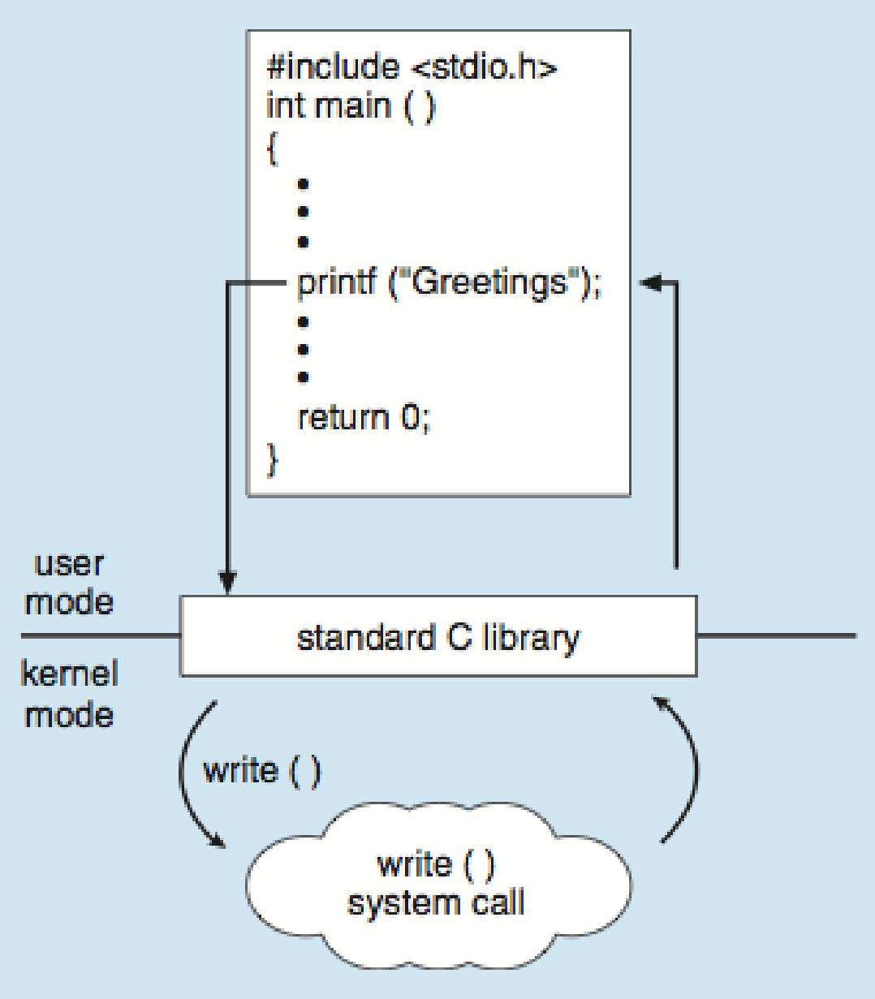  
BỘ MÔN: KHOA HỌC MÁY TÍNH – KHOA CNTT1

# V. QUÁ TRÌNH PHÁT TRIỂN

Các hệ thống đơn giản (những năm 40-50 của thế kỷ trƣớc): tốc độ xử lý của máy tính rất thấp, việc vào/ra đƣợc thực hiện thủ công và khó khăn. Việc nạp chƣơng trình đƣợc thực hiện nhờ công tắc, mạch hàn sẵn, bìa đục lỗ. Trong thời kỳ này, lập trình viên tƣơng tác trực tiếp với phần cứng.

=> Máy tính thời kỳ này chƣa có HDH.

# V. QUÁ TRÌNH PHÁT TRIỂN

# Xử lý theo mẻ:

Chƣơng trình đƣợc phân thành các mẻ: gồm những chƣơng trình có yêu cầu giống nhau

Toàn bộ mẻ đƣợc nạp vào băng từ và đƣợc tải vào máy để thực hiện lần lƣợt

Chương trình giám sát (monitor): mỗi khi một chƣơng trình của mẻ kết thúc, chƣơng trình giám sát tự động nạp chƣơng trình tiếp theo vào máy và cho phép nó chạy => Giảm đáng kể thời gian chuyển đổi giữa hai chƣơng trình trong cùng một mẻ

<table><tr><td>Monitor</td></tr><tr><td>Trinh úng dung</td></tr></table>

Trình giám sát là dạng đơn giản nhất của HDH

Nhƣợc điểm: Mỗi khi có yêu cầu vào/ra, CPU phải dừng việc xử lý dữ liệu để chờ quá trình vào ra kết thúc. Do tốc độ vào/ra thấp hơn tốc độ CPU rất nhiều nên CPU thƣờng xuyên phải chờ đợi 1 thời

BỘ MÔN: KHOA HỌC MÁY TÍNH – KHOA CNTT1

# V. QUÁ TRÌNH PHÁT TRIỂN

# Đa chƣơng trình (đa nhiệm):

Hệ thống chứa đồng thời nhiều chƣơng trình trong bộ nhớ

Khi một chƣơng trình phải dừng lại để thực hiện vào ra, HDH sẽ chuyển CPU sang thực hiện một chƣơng trình khác

=> Giảm thời gian chạy không tải của CPU

<table><tr><td>o</td><td>Hê diêu hành</td></tr><tr><td></td><td>Chuong trinh 1</td></tr><tr><td></td><td>Chuong trình 2</td></tr><tr><td></td><td>Chuong trình 3</td></tr><tr><td>K</td><td>Bô nhó trông</td></tr></table>

# 256K

# V. QUÁ TRÌNH PHÁT TRIỂN

# Đa chƣơng trình:

<table><tr><td>Chay</td><td>Chò doi</td><td>Chay</td><td>Chò dąi</td></tr></table>

# (a) Don chvong trinh

Chuong trinh A Chay Chò dąi Chay Chà dąi

Chuong trinh B Chà doi Chay Chò dgi Chay Chò dgi

<table><tr><td>Chuong trinh C</td><td>Chò doi</td><td>Chay</td><td>Chà dąi</td><td>Chay</td><td>Chò doi</td></tr></table>

<table><tr><td>Toàn hê thóng</td><td>Chay AChay BChay C</td><td></td><td></td><td>Chò doi</td><td></td><td>Chay AChay BChay C</td><td></td><td>Chà doi</td></tr></table>

# (b) Da chvong trình

Thời gian chờ đợi của CPU trong chế độ đa chƣơng trình giảm đáng kể so với trong trƣờng hợp đơn chƣơng trình

HDH phức tạp hơn rất nhiều so với HDH đơn chƣơng trình

Đòi hỏi hỗ trợ từ phần cứng, đặc biệt khả năng vào/ra bằng ngắt và DMA

# V. QUÁ TRÌNH PHÁT TRIỂN

Đa chƣơng trình (Hạn chế)

Mặc dù đa chương trình cho phép sử dụng hiệu quả CPU và các tài nguyên khác của hệ thống song kỹ thuật này không cho người dùng tương tác với hệ thống.

Các máy tính thế hệ sau cho phép máy tính và người dùng làm việc trực tiếp thông quan màn hình và bàn phím.

Đối với các hệ thống này thì thời gian từ khi người dùng gõ lệnh cho tới khi máy tính phản xạ lại tương đối nhỏ.

Kỹ thuật đa chương trình không đảm bảo được thời gian đáp ứng ngắn như vậy.

# V. QUÁ TRÌNH PHÁT TRIỂN

# Chia sẻ thời gian:

Chia sẻ thời gian có thể coi nhƣ đa chƣơng trình cải tiến

CPU lần lƣợt thực hiện các công việc khác nhau trong những khoảng thời gian ngắn gọi là lƣợng tử thời gian

Chuyển đổi giữa các công việc diễn ra với tần số cao và tốc độ CPU lớn

=> Tất cả ngƣời dùng đều có cảm giác máy tính chỉ thực hiện chƣơng trình của mình

=> CPU đƣợc chia sẻ giữa những ngƣời dùng khác nhau tƣơng tác trực tiếp với hệ thống

Quản lý tiến trình:

Tạo và xoá tiến trình

Tạm treo và khôi phục các tiến trình bị treo

Đồng bộ hoá các tiến trình (lập lịch cho các tiến trình .v.v.)

Giải quyết các bế tắc, ví dụ nhƣ khi có xung đột về tài nguyên

Tạo cơ chế liên lạc giữa các tiến trình

Quản lý bộ nhớ:

Quản lý việc phân phối bộ nhớ giữa các tiến trình

Tạo ra bộ nhớ ảo và ánh xạ địa chỉ bộ nhớ ảo vào bộ nhớ thực

Cung cấp và giải phóng bộ nhớ theo yêu cầu của các tiến trình

Quản lý không gian nhớ đã đƣợc cấp và không gian còn trống

(Tiến trình: chƣơng trình đang trong thời gian thực hiện)

# Quản lý vào ra:

Đơn giản hoá và tăng hiệu quả quá trình trao đổi thông tin giữa các tiến trình với thiết bị vào ra

Quản lý tệp và thƣ mục:

Tạo, xóa tệp và thƣ mục

Đọc ghi tệp

Ánh xạ tệp và thƣ mục sang bộ nhớ ngoài

Hỗ trợ mạng và xử lý phân tán

Giao diện với ngƣời dùng

Các chƣơng trình tiện ích và ứng dụng

# VI. CẤU TRÚC HDH 2. NHÂN CỦA HDH

HDH gồm rất nhiều thành phần, tuy nhiên độ quan trọng của các tp khác nhau, có những tp không thể thiếu là cơ sở cho toàn hệ thống hoạt động, một số tp của HDH cung cấp chức năng kém quan trọng hơn.

=> chỉ tải những thành phần quan trọng không thể thiếu đƣợc vào bộ nhớ gọi là nhân.

Nhân (kernel) là phần cốt lõi, thực hiện các chức năng cơ bản nhất, quan trọng nhất của HDH và thường xuyên được giữ trong bộ nhớ

# VI. CẤU TRÚC HDH 2. NHÂN CỦA HDH

Máy tính hiện đại thƣờng đƣợc thiết kế với hai chế độ thực hiện chƣơng trình.

Nhân chạy trong chế độ đặc quyền – chế độ nhân: là chế độ mà chƣơng trình thực hiện trng đó có đầy đủ quyền truy cập và điều khiển phần cứng máy tính.

Chế độ ngƣời dùng: ch trình thực hiện trong chế độ ngƣời dùng bị hạn chế rất nhiều quyền truy cập và sử dụng phần cứng.

Việc phân biệt chế độ nhân và chế độ ngƣời dùng nhằm mục đích ngăn không cho CTUD vô tình hoặc cố ý thực hiện những thao tác làm ảnh hƣởng tới hệ thống.

# VI. CẤU TRÚC HDH

3. MỘT SỐ CẤU TRÚC HDH

# Cấu trúc nguyên khối

Toàn bộ chƣơng trình và dữ liệu của HDH có chung 1 không gian nhớ

HDH trở thành một tập hợp các thủ tục hay các chƣơng trình con

Ƣu điểm: nhanh, không mất thời gian giữa các không gian nhớ

Nhƣợc điểm: Không an toàn: khi bất kỳ thành phần nào có sự cố thì toàn bộ hệ thống sẽ không hoạt động đc; Ko mềm dẻo và khó sửa đổi, thêm bớt tp nào sẽ ảnh hƣởng tới toàn bộ hệ thống, khi có lỗi khó xác định lỗi do tpnào gây ra.

Linux

<table><tr><td>Ché d nguòi dùng</td><td>trình úng dung</td><td>trinh úng dung</td></tr><tr><td>Ché dô dc quyèn</td><td colspan="2">H dièu hành</td></tr></table>

# Cấu trúc vi nhân

Nhân có kích thƣớc nhỏ, chỉ chứa các chức năng quan trọng nhất

Các chức năng còn lại đƣợc đặt vào các modul riêng: chạy trong chế độ đặc quyền hoặc ngƣời dùng. Khi có yêu cầu từ ứng dụng, nhân sẽ chuyển cho module tƣơng ứng để xử lý và nhận lại kết quả, nhân chủ yếu đóng vai trò trung gia liên lạc.

Ƣu điểm: mềm dẻo, an toàn

Nhƣợc điểm: tốc độ chậm hơn so với cấu trúc nguyên khối

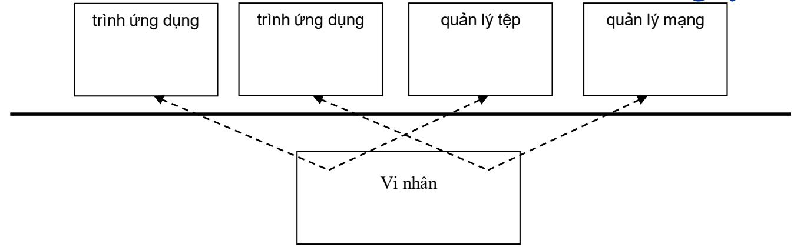  
N: THS NGUYỄN THỊ Hình 1.5 Cấu trúc vi nhân

# VI. CẤU TRÚC HDH

3. MỘT SỐ KIỂU CẤU TRÚC HDH

# Cấu trúc phân lớp

Các thành phần đƣợc chia thành các lớp nằm chồng lên nhau

Mỗi lớp chỉ có thể liên lạc với lớp nằm kề bên trên và kề bên dƣới

Mỗi lớp chỉ có thể sử dụng dịch vụ do lớp nằm ngay bên dƣới cung cấp

Ƣu điểm: chia nhỏ chứng năng, dễ sử dụng, dễ sửa lỗi

Nhƣợc điểm: khó thiết kế do khó sắp xếp các chức năng, tốc độ chậm hơn cấu trúc nguyên khối

<table><tr><td rowspan=1 colspan=1>Trinh úng dung</td></tr><tr><td rowspan=1 colspan=1>Hê thöng file</td></tr><tr><td rowspan=1 colspan=1>Liên lac giūa các tin trinh</td></tr><tr><td rowspan=1 colspan=1>Qun lý vào ra</td></tr><tr><td rowspan=1 colspan=1>Qun lý b nhô</td></tr><tr><td rowspan=1 colspan=1>Qun lý tin trinh</td></tr></table>

PHÂN CÚNG

# VII. MỘT SỐ HDH CỤ THỂ

UNIX

MINIX

LINUX

MS-DOS

Windows NT

# HỌC VIỆN CÔNG NGHỆ BƯU CHÍNH VIỄN THÔNG

BÀI GIẢNG MÔN

HỆ ĐIỀU HÀNH

# CHƢƠNG 2: HỆ THỐNG FILE

Các khái niệm

2. Các phƣơng pháp truy cập file

3. Các thao tác với file

Thƣ mục

5. Cấp phát không gian cho file

- Quản lý không gian trống trên đĩa

Độ tin cậy của hệ thống file

Bảo mật cho hệ thống file

Hệ thống file FAT

Hệ thống máy tính phải có khả năng lƣu lại đƣợc các thông tin, dữ liệu

Hệ thống lƣu trữ của các loại máy tính cao cấp thƣờng có kích thƣớc rất lớn nên sẽ chứa rất nhiều dữ liệu

Lƣợng dữ liệu lƣu trữ quá lớn, nếu không khéo trong việc quản lý truy cập sẽ khó khăn và hao tốn thời gian.

=> cần có các hình thức tổ chức, sắp xếp dữ liệu một cách hợp lý và xây dựng các thuật toán tối ƣu để có thể truy cập nhanh chóng, hiệu quả

# I. CÁC KHÁI NIỆM

File được định nghĩa như tập hợp các thông tin liên quan đến nhau được đặt tên và được lưu trữ trên bộ nhớ ngoài

Thuộc tính của file: để quản lý file ngoài nội dung, HĐH còn định nghĩa các thuộc tính, tính chất. File có các thuộc tính nhƣ sau:

Tên file

Kiểu file

Kích thƣớc file

Ngƣời tạo file, ngƣời sở hữu

Quyền truy cập file

Thời gian tạo file, sửa file, truy cập lần cuối

Vị trí file

# I. CÁC KHÁI NIỆM

# Đặt tên cho file:

Cho phép xác định file

Là thông tin ngƣời dùng thƣờng sử dụng nhất khi làm việc với file Quy tắc đặt tên cho file của một số HDH:

<table><tr><td rowspan=1 colspan=1>H dièu hành</td><td rowspan=1 colspan=1>Dô dài tói da</td><td rowspan=1 colspan=1>Phân bit chhoa, chū thuòng</td><td rowspan=1 colspan=1>Cho phép sú dungdáu cách</td><td rowspan=1 colspan=1>Các ký ty câm</td></tr><tr><td rowspan=1 colspan=1>MS-DOS</td><td rowspan=1 colspan=1>8 cho tên file3 cho mò rng</td><td rowspan=1 colspan=1>không</td><td rowspan=1 colspan=1>không</td><td rowspan=1 colspan=1>Bt dàu bng chū ci hoc sóKhông duęc chúa cc ký ty / \ [] : ; | = ,^? @</td></tr><tr><td rowspan=1 colspan=1>Windows NTFAT</td><td rowspan=1 colspan=1>255 ký ty cho cà tênfile và duòng dn</td><td rowspan=1 colspan=1>không</td><td rowspan=1 colspan=1>có</td><td rowspan=1 colspan=1>Bt dàu bàng chū cái hoc sóKhông duęc chúra cc ký ty / \ [] : ; | = ,^? @</td></tr><tr><td rowspan=1 colspan=1>Windows NTNTFS</td><td rowspan=1 colspan=1>255</td><td rowspan=1 colspan=1>không</td><td rowspan=1 colspan=1>có</td><td rowspan=1 colspan=1>Không duęc chúa các ký ty / \ &lt; &gt; * | :</td></tr><tr><td rowspan=1 colspan=1>Linux (EXT3)</td><td rowspan=1 colspan=1>256</td><td rowspan=1 colspan=1>Có</td><td rowspan=1 colspan=1>có (néu tên filechúra trong ngockép)</td><td rowspan=1 colspan=1>Không duręc chúa các ký ty ! @ # $ %^ &amp;*()[}{}/\:; &lt;&gt;</td></tr></table>

ấu trúc file:

# I. CÁC KHÁI NIỆM

Các thông tin trong file có thể rất khác nhau

Có những file chứa nhiều thông tin không có cấu trúc: file văn bản. File có cấu trúc nhƣ: file CSDL, file excel.

=> Cấu trúc của file cũng rất khác nhau và phụ thuộc vào thông tin chứa trong file

HDH có cần biết và hỗ trợ các kiểu cấu trúc file?

Hỗ trợ cấu trúc file ở mức HDH:

Ƣu điểm:

Các thao tác với file sẽ dễ dàng hơn đối với ngƣời lập trình ứng dụng

HDH có thể kiểm soát đƣợc các thao tác với file

Nhƣợc điểm:

Tăng kích thƣớc hệ thống

Tính mềm dẻo của HDH bị giảm

Thực tế các HDH chỉ coi file là tập hợp các byte không cấu trúc

# I. CÁC KHÁI NIỆM

Đa số HDH không hỗ trợ và quản lý kiểu cấu trúc file

Cấu trúc file do chƣơng trình ứng dụng và ngƣời dùng tự quản lý

Trong HDH UNIX, DOS, WINDOWS, file đƣợc xem nhƣ tập hợp các byte.

Các chƣơng trình ứng dụng khác nhau sẽ tự tạo ra và quản lý cấu trúc file riêng mình.

Ví dụ: chƣơng trình đồ họa lƣu file dƣới dạng mã nhị phân đã đƣợc giải nén, chƣơng trình hệ thống quản lý dữ liệu sẽ tạo ra file bao gồm các bản ghi.

# II. CÁC PHƯƠNG PHÁP TRUY CẬP FILE

Để đọc/ghi file hệ điều hành phải quy định cách thức truy cập tới nội dung file. Mỗi HDH có thể hỗ trợ một hoặc nhiều cách truy cập khác nhau.

Truy cập tuần tự:

Thông tin đƣợc đọc, ghi theo từng byte/ bản ghi lần lƣợt từ đầu file

Sử dụng 1 con trỏ để định vị vị trí hiện thời trong file

Kiểu truy cập này phù hợp với một số thiết bị và một số thiết bị nhớ và một số ứng dụng

# II. CÁC PHƯƠNG PHÁP TRUY CẬP FILE

Truy cập trực tiếp:

File đƣợc xem nhƣ các khối/ bản ghi đƣợc đánh số

Các khối có thể truy cập theo thứ tự bất kỳ

Chẳng hạn ta có thể đọc khối 50 sau đó đọc khổi 13 rồi khối 101.

Việc truy cập trực tiếp dựa trên đặc điểm của đĩa cho phép truy cập các khối bất kỳ

File đƣợc chứa trong các khối khác nhau của đĩa do vậy cũng cho phép truy cập không tuần theo thứ tự

# II. CÁC PHƯƠNG PHÁP TRUY CẬP FILE

Truy cập dựa trên chỉ số:

Cho phép truy cập tới bản ghi trong file, không theo số thứ tự hoặc vị trí của bản ghi trong file mà theo khóa ứng với bản ghi đó.

File chứa 1 chỉ số riêng: gồm các khóa và con trỏ chỉ tới các bản ghi trong file

Truy cập: tìm khóa tƣơng ứng trong chỉ mục, sau đó theo con trỏ xác định bản ghi và truy cập trực tiếp tới nó

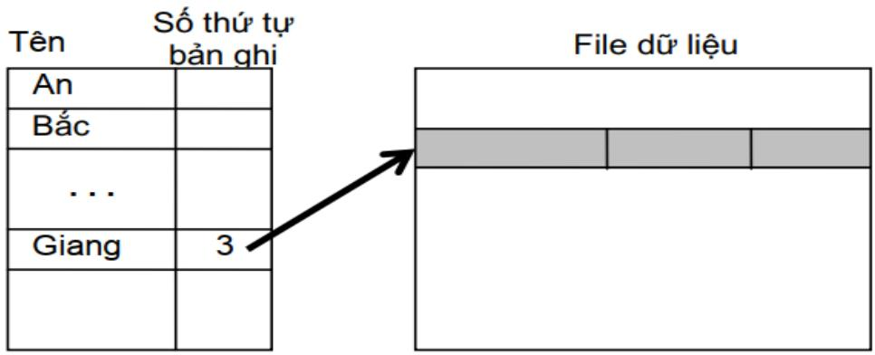  
Hình 4.1: Truy câp theo khói chi só

# III. CÁC THAO TÁC VỚI FILE

# Tạo file:

Tạo file trống chƣa có data; đƣợc dành 1 chỗ trong thƣ mục kèm theo một số thuộc tính nhƣ thời gian tạo file, tên file, ngƣời tạo file,...

# Xóa file:

Giải phóng không gian mà dữ liệu của file chiếm trên đĩa

Giải phóng chỗ của file trong thƣ mục

Việc giải phóng không gian có thể đơn thuần là đánh dấu không gian nhƣ không gian tự do.

# Mở file:

Thực hiện trƣớc khi ghi và đọc file

Đọc các thuộc tính của file trên đĩa vào bộ nhớ để tăng tốc độ cho thao tác đọc ghi tiếp theo.

# III. CÁC THAO TÁC VỚI FILE

# Đóng file:

Xóa các thông tin về file ra khỏi bảng trong bộ nhớ để nhƣờng chỗ cho các file sắp mở.

Rất nhiều hệ điều hành hạn chế số lƣợng file đƣợc mởcùng một lúc nên việc đóng các file đã truy cập xong là rất quan trọng.

Ghi vào file

Đọc file

# IV. THƯ MỤC

1. Khái niệm

Số lƣợng file lƣu trữ trên đĩa rất lớn => phải tổ chức để dễ dàng quản lý, truy cập files

Không gian trên đĩa đƣợc chia thành các phần (partition/ volume) gọi là đĩa logic

Ví dụ: trên máy tính PC có 1 ổ cứng và có thể chia thành các ổ C,D,E => đĩa logic

Để quản lý file trên các đĩa logic, thông tin về file đƣợc lƣu trong thƣ mục của đĩa

Thƣ mục = ∑ các khoản mục \~ files

Khoản mục chứa các thông tin về file: tên, kích thƣớc, vị trí, kiểu file,… hoặc con trỏ tới nơi lƣu trữ thông tin này

Coi thƣ mục nhƣ 1 bảng, mỗi dòng là khoản mục ứng với 1 file

Các cách lƣu thông tin về file trong thƣ mục:

Toàn bộ thuộc tính của file đƣợc lƣu trong thƣ mục, file chỉ chứa data => kích thƣớc khoản mục, thƣ mục lớn

Một phần thuộc tính đƣợc lƣu trữ luôn cùng với dữ liệu của file. Thƣ mục chỉ lƣu thông tin tối thiểu cần thiết cho việc tìm kiếm vị trí file trên đĩa => kích thƣớc giảm

<table><tr><td rowspan=1 colspan=1>file1.txt</td><td rowspan=1 colspan=1>Thuc tính</td></tr><tr><td rowspan=1 colspan=1>file2.c</td><td rowspan=1 colspan=1>Thuc tính</td></tr><tr><td rowspan=1 colspan=1>file3.pas</td><td rowspan=1 colspan=1>Thuc tính</td></tr><tr><td rowspan=1 colspan=1>file4.doc</td><td rowspan=1 colspan=1>Thuc tính</td></tr></table>

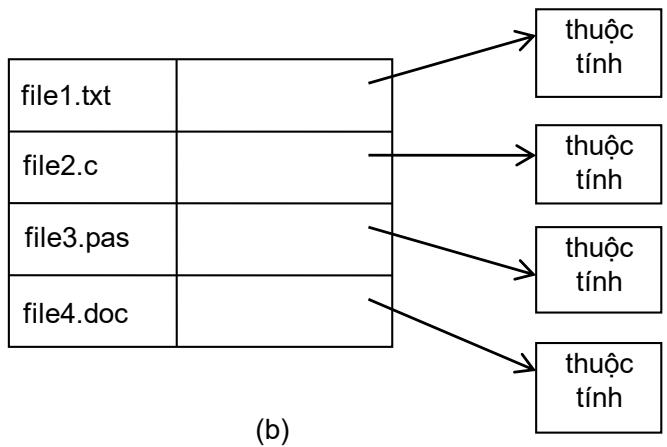

# IV. THƯ MỤC

1. Khái niệm

# Mở file:

HDH tìm trong thƣ mục khoản mục ứng với tên file cần mở

Đọc các thuộc tính và vị trí dữ liệu của file vào bảng chứa thông tin về các file đang mở

Nếu khoản mục trỏ tới CTDL khác chứa thuộc tính file, cấu trúc này sẽ đƣợc đọc vào bảng

Tìm kiếm file: cấu trúc thƣ mục phải cho phép tìm kiếm file theo tên file

Tạo file: tạo khoản mục mới và thêm vào thƣ mục

Xóa file: thông tin về file và khoản mục tƣơng ứng bị xóa khỏi thƣ mục

Duyệt thƣ mục: liệt kê các file trong thƣ mục và thông tin chứa trong khoản mục của file

Đổi tên file: chỉ cần thực hiện với thƣ mục chứ không liên quan đến dữ liệu của file

Thƣ mục 1 mức:

Đơn giản nhất

Chỉ có 1 thƣ mục duy nhất và tất cả các file đƣợc giữ trong thƣ mục này

Khó chọn tên cho file

Tìm kiếm file khó

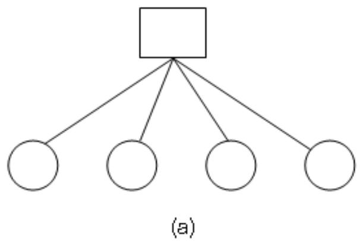

Thƣ mục 2 mức:

Phân cho mỗi ngƣời dùng 1 thƣ mục riêng (UFD: User File Directory), chứa các file của mình

Khi ngƣời dùng truy cập file, file sẽ đƣợc tìm kiếm trong thƣ mục ứng với tên ngƣời đó

=> các ngƣời dùng khác nhau có thể đặt tên file trùng nhau

Cô lập ngƣời dùng

Các file mà nhiều ngƣời dùng truy cập tới => chép vào từng thƣ mục của từng ngƣời dùng => lãng phí

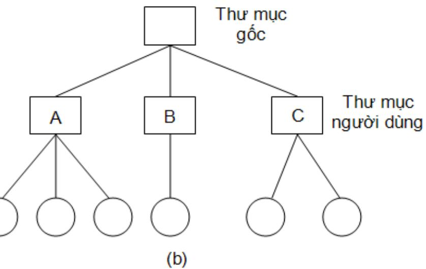

Thƣ mục cấu trúc cây:

Thƣ mục con có thể chứa các thƣ mục con khác và các files

Hệ thống thƣ mục đƣợc biểu diễn phân cấp nhƣ 1 cây: cành là thƣ mục, lá là file

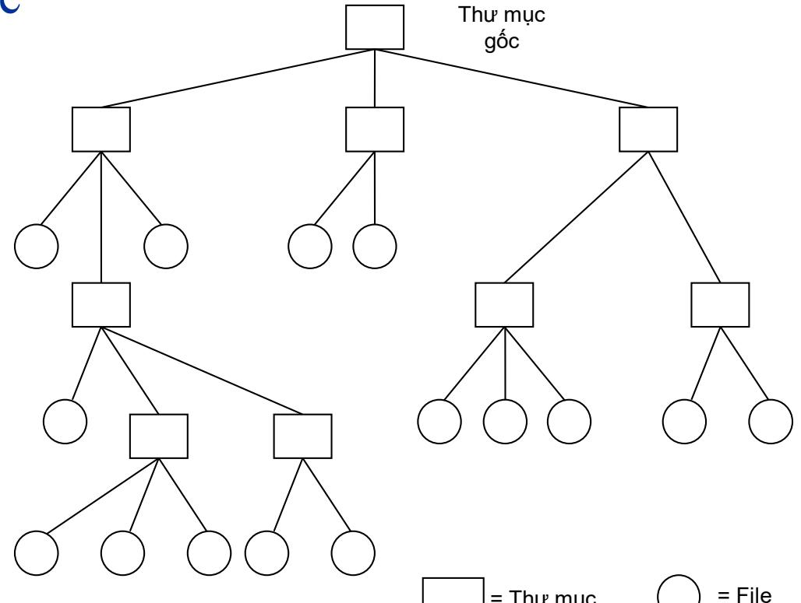

Thƣ mục cấu trúc cây (tt):

Phân biệt khoản mục file và khoản mục của thƣ mục con: thêm bit đặc biệt trong khoản mục

1: khoản mục của thƣ mục mức dƣới   
0: khoản mục của file

Tại mỗi thời điểm, ngƣời dùng làm việc với thƣ mục hiện thời (current directory)

Tổ chức cây thƣ mục cho từng đĩa:

Trong hệ thống file nhƣ FAT của DOS, cây thƣ mục đƣợc xây cho từng đĩa. Hệ thống thƣ mục đƣợc coi là rừng, mỗi cây trên 1 đĩa

Linux: toàn hệ thống chỉ gồm 1 cây thƣ mục

# IV. THƯ MỤC

3. Cấu trúc hệ thống thư mục

Thƣ mục cấu trúc đồ thị không tuần hoàn (acyclic graph ):

Chia sẻ files và thƣ mục để có thể xuất hiện ở nhiều thƣ mục riêng khác nhau

Mở rộng của cấu trúc

cây: lá và cành có thể đồng thời thuộc về những cành khác nhau

Triển khai:

Sử dụng liên kết: con trỏ tới thƣ mục hoặc file khác

Tạo bản sao của file và thƣ mục cần chia sẻ và chứa vào các thƣ mục khác nhau => phải đảm bảo tính đồng bộ và nhất quán Thư mục gốc

Mềm dẻo nhƣng phức tạp

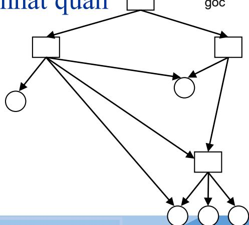

Mô tả vị trí của file trong thƣ mục

Đƣờng dẫn tuyệt đối:

Đƣờng dẫn từ gốc của cây thƣ mục, đi qua các thƣ mục trung gian, dẫn tới file

C:\bc\bin\bc.exe

Đƣờng dẫn tƣơng đối:

Tính từ thƣ mục hiện thời

Thêm 2 khoản mục đặc biệt trong thƣ mục: “.”, “..”

# Danh sách:

Tổ chức thƣ mục dƣới dạng danh sách các khoản mục

Tìm kiếm khoản mục đƣợc thực hiện bằng cách duyệt lần lƣợt danh sách

Thêm file mới vào thƣ mục:

 Duyệt cả thƣ mục để kiểm tra xem khoản mục với tên file nhƣ vậy đã có chƣa

Khoản mục mới đƣợc thêm vào cuối danh sách hoặc 1 ô trong bảng

Mở file, xóa file

Tìm kiếm trong danh sách chậm

Lƣu trữ thƣ mục trong bộ nhớ

# Cây nhị phân:

Tăng tốc độ tìm kiếm nhờ CTDL có hỗ trợ sắp xếp

Hệ thống file NTFS của WinNT

Bảng băm (hash table):

Dùng hàm băm để tính vị trí của khoản mục trong thƣ mục theo tên file

Thời gian tìm kiếm nhanh

Hàm băm phụ thuộc vào kích thƣớc của bảng băm => kích thƣớc bảng cố định

# IV. THƯ MỤC

5. Tổ chức bên trong của thư mục

Tổ chức thƣ mục của DOS:

Mỗi đĩa logic có cây thƣ mục riêng, bắt đầu từ thƣ mục gốc ROOT

Thƣ mục gốc đƣợc đặt ở phần đầu của đĩa, ngay sau sector khởi động BOOT và bảng FAT

Thƣ mục gốc chứa files và các thƣ mục con

Thƣ mục con có thể chứa files và các thƣ mục cấp dƣới nữa

Đƣợc tổ chức dƣới dạng bảng: mỗi khoản mục chiếm 1 dòng trong bảng và có kích thƣớc cố định 32 bytes

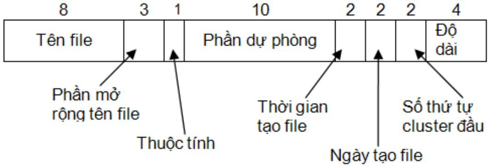

Tổ chức thƣ mục của Linux:

Thƣ mục hệ thống file Ext2 của Linux có cách tổ chức đơn giản

Khoản mục chứa tên file và địa chỉ I-node

Thông tin còn lại về các thuộc tính file và vị trí các khối dữ liệu đƣợc lƣu trên I-node chứ không phải thƣ mục

Kích thƣớc khoản mục phụ thuộc vào độ dài tên file

Phần đầu của khoản mục có trƣờng cho biết kích thƣớc khoản mục

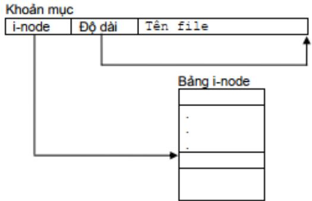

# V. CẤP PHÁT KHÔNG GIAN CHO FILE

Nhiệm vụ quan trọng của HDH trong việc quản lý hệ thống file là cấp phát không gian trên đĩa và các hiết bị nhớ ngoài khác để lƣu trữ file và thƣ mục

Đồng thời, ghi lại vị trí các khối nhớ đã cấp phát để có thể tiến hành truy cập về sau.

Hard Drive Structure:   
A = track   
B = sector   
C = sector of a track   
D = cluster

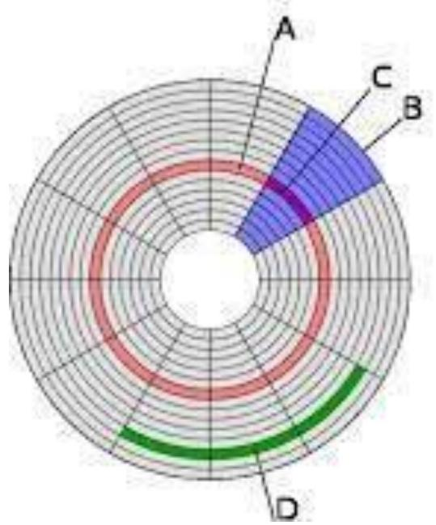

# V. CẤP PHÁT KHÔNG GIAN CHO FILE

Phép ánh xạ file: từ tên file có thể chỉ ra vị trí file trên đĩa

Sơ bộ về tổ chức đĩa:

Thông tin đƣợc đọc/ghi theo từng khối sector

Nhóm các sector thành block hay cluster (khối)

Trên đĩa: 1 file gồm 1 tập các khối. HDH chịu trách nhiệm cấp phát các khối cho file:

Không gian trên đĩa phải đƣợc cấp phát cho file

Cần theo dõi không gian trống sẵn sàng cho việc cấp phát

Một số vấn đề:

Không gian tối đa yêu cầu cấp phát cho file 1 lần là bao nhiêu?

Không gian cấp phát cho file gọi là phần (portion). Kích thƣớc phần ntn?

# V. CẤP PHÁT KHÔNG GIAN CHO FILE 1. Cấp phát các khối liên tiếp

Đƣợc cấp phát 1 khoảng không gian gồm các khối liên tiếp trên đĩa (các sector)

Vị trí file trên đĩa đƣợc xác định bởi vị trí khối đầu tiên và độ dài (số khối) mà file đó chiếm

Khi có yêu cầu cấp phát, HDH sẽ chọn 1 vùng trống có số lƣợng khối đủ cấp cho file đó

Bảng cấp phát file chỉ cần 1 khoản mục cho 1 file, chỉ ra khối bắt đầu, và độ dài của file tính = khối

Là cấp phát trƣớc, sử dụng kích thƣớc phần thay đổi

# V. CẤP PHÁT KHÔNG GIAN CHO FILE 1. Cấp phát các khối liên tiếp (tt)

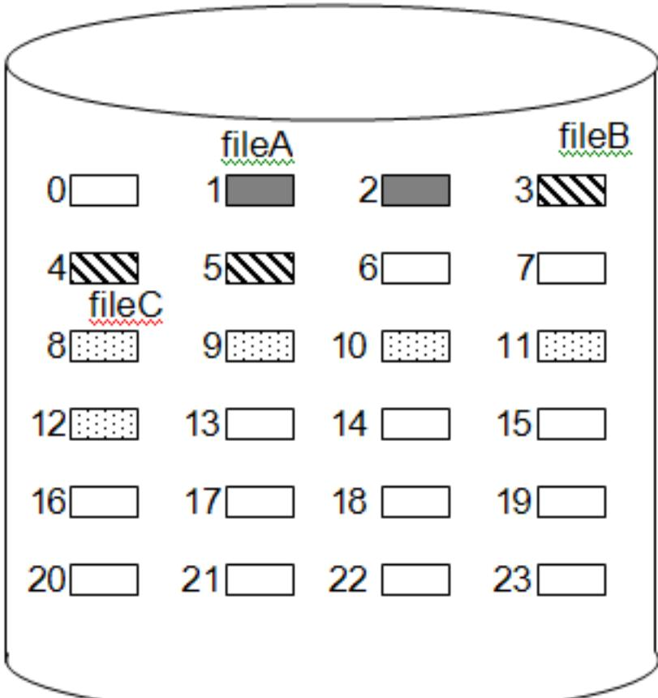

Thu muc   

<table><tr><td>Tên file</td><td>Bt dâu</td><td>Dô dài</td></tr><tr><td>fileA</td><td></td><td></td></tr><tr><td>fileB</td><td>— 3 ∞</td><td>2 3 5</td></tr><tr><td>fileB</td><td></td><td></td></tr></table>

V. CẤP PHÁT KHÔNG GIAN CHO FILE 1. Cấp phát các khối liên tiếp (tt)

Ƣu điểm:

Cho phép truy cập trực tiếp và tuần tự

Đơn giản, tốc độ cao

Nhƣợc điểm:

Phải biết trƣớc kích thƣớc file khi tạo

Khó tìm chỗ cho file

Gây phân mảnh ngoài: đó là hiện tƣợng vùng trống còn lại trên đĩa có kích thƣớc quá nhỏ do vậy không thể cấp phát cho file có kích thƣớc lơn hơn.

# V. CẤP PHÁT KHÔNG GIAN CHO FILE 2. Sử dụng danh sách kết nối

Các khối đƣợc kết nối với nhau thành danh sách kết nối; phần đầu mỗi khối chứa con trỏ trỏ tới khối tiếp theo

Các khối thuộc về 1 file có thể nằm ở vị trí bất kì trên đĩa

Khoản mục của thƣ mục chứa con trỏ tới khối đầu tiên của file

Khi file đƣợc cấp thêm khối mới, khối đó đƣợc thêm vào cuối danh sách

HDH đọc lần lƣợt từng khối và sử dụng con trỏ để xác định khối tiếp theo

# V. CẤP PHÁT KHÔNG GIAN CHO FILE 2. Sử dụng danh sách kết nối (tt)

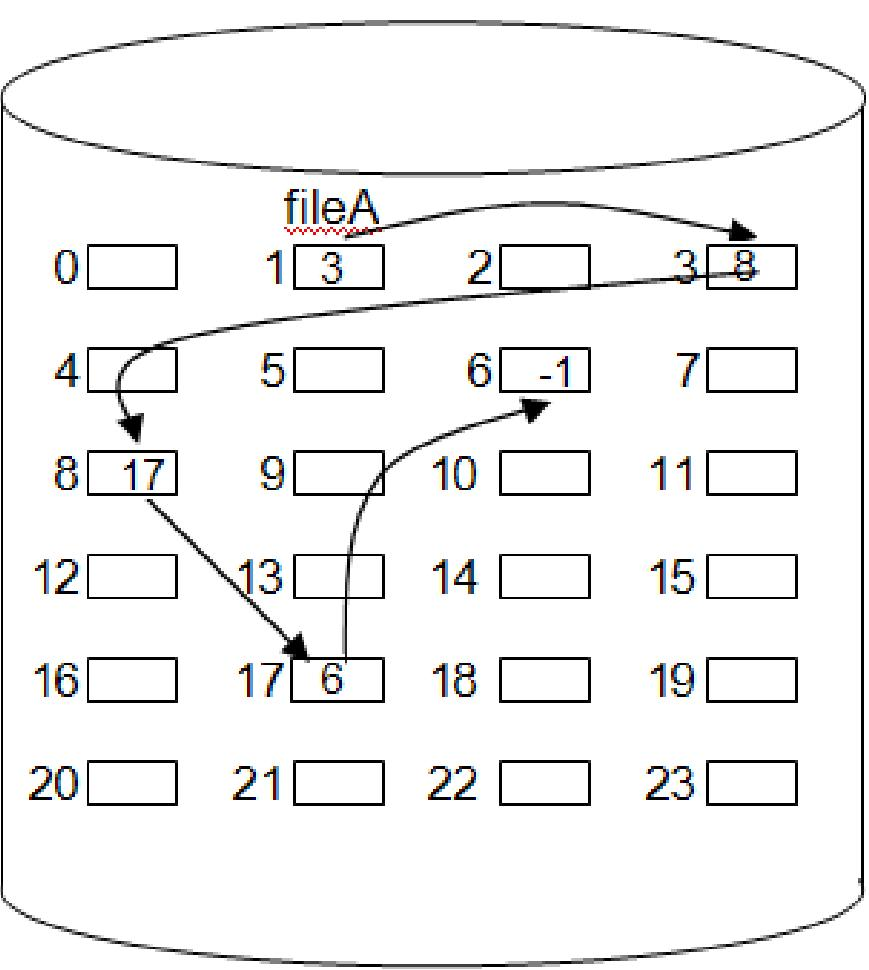

<table><tr><td colspan="2">Thu muc</td></tr><tr><td>Tên file</td><td>Bt dâu</td></tr><tr><td colspan="2">fileA 1</td></tr></table>

V. CẤP PHÁT KHÔNG GIAN CHO FILE 2. Sử dụng danh sách kết nối (tt)

Ƣu điểm:

Không bị phân mảnh ngoài

Không yêu cầu biết trƣớc kích thƣớc file lúc tạo

Dễ tìm vị trí cho file, khoản mục đơn giản

Nhƣợc điểm:

Không hỗ trợ truy cập trực tiếp

Tốc độ truy cập không cao

Giảm độ tin cậy và tính toàn vẹn của hệ thống file

V. CẤP PHÁT KHÔNG GIAN CHO FILE 3. Sử dụng danh sách kết nối trên bảng chỉ số

Bảng chỉ số: mỗi ô của bảng ứng với 1 khối (sector) của đĩa

Con trỏ tới khối tiếp theo của file đƣợc chứa trong ô tƣơng ứng của bảng

Mỗi đĩa logic có 1 bảng chỉ số đƣợc lƣu ở vị trí xác định

Kích thƣớc mỗi ô trên bảng phụ thuộc vào số lƣợng khối trên đĩa

thu muc

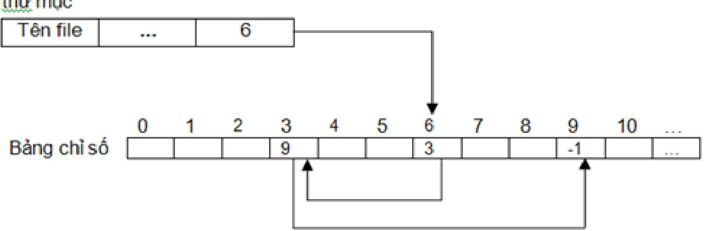

V. CẤP PHÁT KHÔNG GIAN CHO FILE 3. Sử dụng danh sách kết nối trên bảng chỉ số (tt)

Cho phép tiến hành truy cập file trực tiếp: đi theo chuỗi con trỏ chứa trong bảng chỉ mục

Bảng FAT (File Allocation Table): đƣợc lƣu ở đầu mỗi đĩa logic sau sector khởi động

FAT12, FAT16, FAT32: mỗi ô của bảng có kích thƣớc 12, 16, 32 bit

V. CẤP PHÁT KHÔNG GIAN CHO FILE 4. Sử dụng khối chỉ mục (index block/ node)

Tất cả con trỏ tới các khối thuộc về 1 file đƣợc tập trung 1 chỗ

Mỗi file có một mảng riêng của mình chứa trong một khối gọi là khối chỉ mục (I-node)

Mảng chứa thuộc tính của file và vị trí các khối của file trên đĩa

Ô thứ i của mảng chứa con trỏ tới khối thứ i của file

Khoản mục của file trong thƣ mục chứa con trỏ tới khối chỉ mục này

# V. CẤP PHÁT KHÔNG GIAN CHO FILE 4. Sử dụng khối chỉ mục (index block/ node)

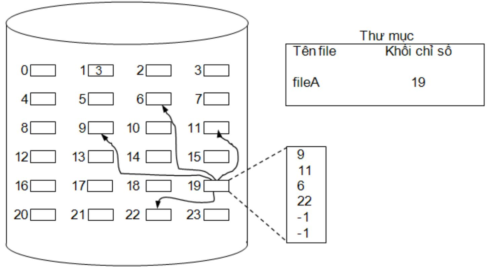

V. CẤP PHÁT KHÔNG GIAN CHO FILE 4. Sử dụng khối chỉ mục (index block/ node)

Chọn kích thƣớc I-node:

Nhỏ: tiết kiệm không gian nhƣng không đủ con trỏ tới các khối nếu file lớn

Lớn: với file nhỏ chỉ chiếm 1 vài ô thì lãng phí

Giải pháp:

Thay đổi kích thƣớc i-node = sử dụng danh sách kết nối Sử dụng I-node có cấu trúc nhiều mức

# V. CẤP PHÁT KHÔNG GIAN CHO FILE 4. Sử dụng khối chỉ mục (index block/ node)

I-node cấu trúc nhiều mức: không trỏ trực tiếp tới ô chứa dữ liệu mà trỏ tới các ô khối chỉ mục sau đó cái ô này mới chứa địa chỉ.

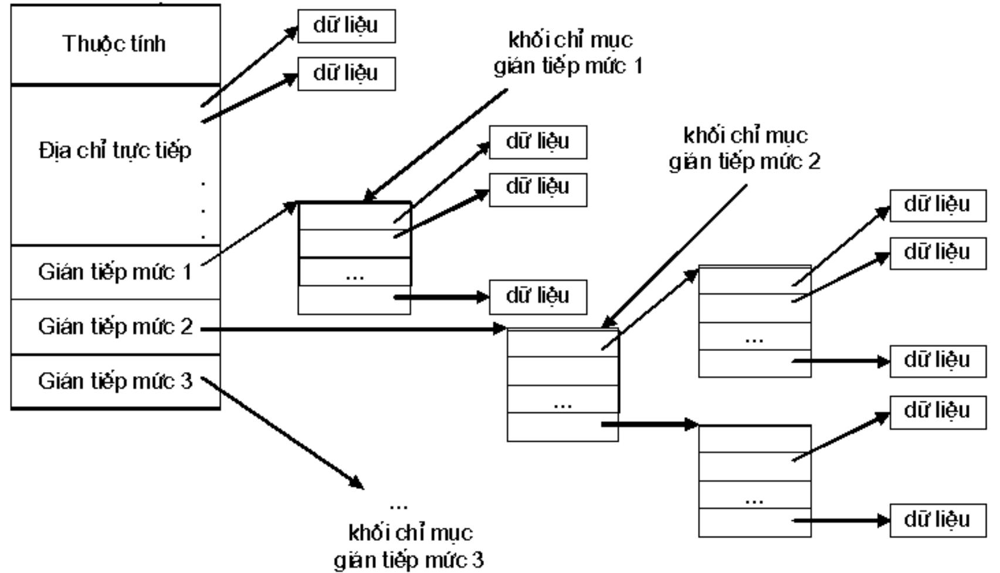

V. CẤP PHÁT KHÔNG GIAN CHO FILE 4. Sử dụng khối chỉ mục (index block/ node)

Ƣu điểm:

Cho phép truy cập trực tiếp

Các khối thuộc 1 file không cần nằm liên tiếp nhau

Nhƣợc điểm:

Tốc độ truy cập file chậm

Kích thƣớc khối (cluster):

Kích thƣớc khối lớn:

Giảm kích thƣớc bảng chỉ mục, tăng tốc độ đọc file; Bị phân mảnh trong

Kích thƣớc khối nhỏ:

Mỗi file chiếm nhiều khối nhớ, nằm rải rác trên đĩa

Thời gian đọc file lâu

Chọn kích thƣớc khối tùy thuộc:

 Kích thƣớc đĩa: đĩa lớn, chọn kích thƣớc khối lớn => thời gian truy cập nhanh, đơn giản hóa việc quản lý

 Kích thƣớc file: hệ thống sử dụng nhiều file lớn, kích thƣớc tăng và ngƣợc

Kích thƣớc khối thƣờng là lũy thừa 2 của sector và nằm trong khoảng từ 512B tới 32 KB

# VI. QUẢN LÝ KHÔNG GIAN TRỐNG TRÊN ĐĨA 1. Bảng bit

Vector bit là mảng 1 chiều

Mỗi ô có kích thƣớc 1 bit tƣơng ứng với một khối trên đĩa

Khối đƣợc cấp phát có bít tƣơng ứng là 0, khối trống: 1 hoặc ngƣợc lại

Dễ tìm 1 hoặc nhóm các khối trống liên tiếp

Với đĩa có kích thƣớc lớn, đọc toàn bộ vector bit vào MEM có thể đòi hỏi khá nhiều không gian nhớ

# VI. QUẢN LÝ KHÔNG GIAN TRỐNG TRÊN ĐĨA 2. Danh sách kết nối

Các khối trống đƣợc liên kết với nhau thành danh sách

Mỗi khối trống chứa con trỏ chỉ tới khối trống tiếp theo

Địa chỉ khối trống đầu tiên đƣợc lƣu ở vị trí đặc biệt trên đĩa và đƣợc HDH giữ trong MEM khi cần làm việc với các file

Đòi hỏi truy cập lần lƣợt khi cần duyệt danh sách này

HDH có thể cấp phát ngay các khối ở đầu danh sách

# VI. QUẢN LÝ KHÔNG GIAN TRỐNG TRÊN ĐĨA 3. danh sách vùng trống

Các khối nằm liền nhau thƣờng đƣợc cấp phát và giải phóng đồng thời

Lƣu vị trí khối trống đầu tiên của vùng các khối trống liên tiếp và số lƣợng các khối trống nằm liền sau đó

Thông tin trên đƣợc lƣu vào danh sách riêng

VII. ĐỘ TIN CẬY CỦA HỆ THỐNG FILE 1. Phát hiện & loại trừ các khối hỏng

# Phát hiện và loại trừ khối hỏng

Phƣơng pháp 1:

Một sector trên đĩa đƣợc dành riêng chứa danh sách các khối hỏng

Một số khối không hỏng đƣợc dành riêng để dự trữ

Các khối hỏng sẽ đƣợc thay thế bởi các khối dự trữ bằng cách thay thế địa chỉ

Truy cập tới khối hỏng thành truy cập tới khối dự trữ

Phƣơng pháp 2:

Tập trung tất cả các khối hỏng thành 1 file

=> đƣợc coi nhƣ đã cấp phát và không đƣợc sử dụng nữa

VII. ĐỘ TIN CẬY CỦA HỆ THỐNG FILE 2. Sao dự phòng

Tạo ra một bản sao của đĩa trên một vật mang khác

Sao lƣu toàn bộ (full backup):

Ghi toàn bộ thông tin trên đĩa ra vật mang tin khác

Chắc chắn nhƣng tốn nhiều thời gian

Sao lƣu tăng dần (incremental backup):

Đƣợc sử dụng sau khi đã tiến hành full backup ít nhất 1 lần

Chỉ ghi lại các file đã bị thay đổi sau lần sao lƣu cuối cùng

Hệ thống lƣu trữ thông tin về các lần lƣu trữ file

DOS: file thay đổi, archive bit =1

Kết hợp:

Full backup: hàng tuần/ tháng

Incremental backup: hàng ngày

VII. ĐỘ TIN CẬY CỦA HỆ THỐNG FILE 3. Kiểm tra tính toàn vẹn của hệ thống file

Hệ thống file chứa nhiều CTDL có mối liên kết => thông tin về liên kết bị hƣ hại, tính toàn vẹn của hệ thống bị phá vỡ

Các khối không có mặt trong danh sách các khối trống, đồng thời cũng không có mặt trong một file nào

Một khối có thể vừa thuộc về một file nào đó vừa có mặt trong danh sách khối trống

HDH có các chƣơng trình kiểm tra tính toàn vẹn của hệ thống file, đƣợc chạy khi hệ thống khởi động, đặc biệt là sau sự cố

VII. ĐỘ TIN CẬY CỦA HỆ THỐNG FILE 3. Kiểm tra tính toàn vẹn của hệ thống file

Ví dụ trong hệ UNIX:

Tạo hai số đếm cho mỗi khối:

Số đếm thứ nhất: số lần khối đó xuất hiện trong danh sách khối trống.

Số đếm thứ hai: số lần khối xuất hiện trong file

Tất cả số đếm đƣợc khởi tạo bằng 0

Duyệt danh sách khối trống và toàn bộ i-node của các file

 Một khối xuất hiện trong danh sách khối trống, số đếm tƣơng ứng thứ nhất đƣợc tăng một đơn vị

Nếu khối xuất hiện trong i-node của file, số đếm tƣơng ứng thứ hai đƣợc tăng một đơn vị Só thú ty khói

Tổng 2 số đếm =1

Só làn xuát hin trong danh sách tróng

<table><tr><td>o</td><td></td><td></td><td>1  2  3  4  5</td><td></td><td></td></tr><tr><td>o</td><td>1</td><td>o</td><td>1</td><td>o</td><td>ci1</td></tr></table>

Só thú ty khói

Só làn xuát hin trong file

<table><tr><td>o</td><td></td><td></td><td>1  2 3 4 5</td><td></td><td></td></tr><tr><td>o</td><td>o</td><td>ci1</td><td>1</td><td>3</td><td>2</td></tr></table>

# VII. ĐỘ TIN CẬY CỦA HỆ THỐNG FILE 4. Đảm bảo tính toàn vẹn bằng cách sử dụng giao tác

Giao tác (transaction) là một tập hợp các thao tác cần phải đƣợc thực hiện trọn vẹn cùng với nhau

Với hệ thống file: mỗi giao tác sẽ bao gồm những thao tác thay đổi liên kết cần thực hiện cùng nhau

Toàn bộ trạng thái hệ thống file đƣợc ghi lại trong file log

Nếu giao tác không đƣợc thực hiện trọn vẹn, HDH sử dụng thông tin từ log để khôi phục hệ thống file về trạng thái không lỗi trƣớc khi thực hiện giao tác

# VIII. BẢO MẬT CHO HỆ THỐNG FILE

Ngăn cản việc truy cập trái phép các thông tin lƣu trữ trong file và thƣ mục

Hạn chế các thao tác truy cập tới file hoặc thƣ mục

Dùng mật khẩu:

Ngƣời dùng phải nhớ nhiều mật khẩu

Mỗi khi thao tác với tài nguyên lại gõ mật khẩu

# VIII. BẢO MẬT CHO HỆ THỐNG FILE

Sử dụng danh sách quản lý truy cập ACL (Access Control List)

Mỗi file đƣợc gán danh sách đi kèm, chứa thông tin định danh ngƣời dùng và các quyền ngƣời đó đƣợc thực hiện với file

ACL thƣờng đƣợc lƣu trữ nhƣ thuộc tính của file/ thƣ mục

Thƣờng đƣợc sử dụng cùng với cơ chế đăng nhập

Các quyền truy cập cơ bản:

Quyền đọc (r)

Quyền ghi, thay đổi (w)

Quyền xóa

Quyền thay đổi chủ file (change owner)

3 phiên bản: FAT12, FAT16, FAT32

Chữ số chỉ kích thƣớc ô bảng FAT tƣơng ứng 12, 16 và 32 bit

Đơn vị cấp phát không gian trên đĩa (khối logic) là cluster (lũy thừa 2 của số lƣợng sector)

<table><tr><td rowspan=1 colspan=1>Boot sectorvà các khói du phòng</td><td rowspan=1 colspan=1>Bång FAT1</td><td rowspan=1 colspan=1>Bång FAT2</td><td rowspan=1 colspan=1>Thu muc góc(chi có trên FAT12 vàFAT16)</td><td rowspan=1 colspan=1>Phàn còn lai cho tói cuói díachúra các file và thu muc ca dřa lô gic</td></tr></table>

# Boot sector:

Sector đầu tiên của đĩa logic

Chứa thông tin mô tả cấu trúc đĩa logic: kích thƣớc sector, cluster, kích thƣớc bảng FAT

Chứa mã chƣơng trình mồi để tải HĐH nếu đĩa logic là đĩa khởi động

FAT: bảng chỉ số quản lý cấp phát khối cho file Thƣ mục gốc ROOT

Vùng dữ liệu: chứa các file và thƣ mục của đĩa logic

# 32 Byte đầu tiên

<table><tr><td rowspan=1 colspan=1>Vi trí</td><td rowspan=1 colspan=1>Dô dài</td><td rowspan=1 colspan=1>Y ngha</td></tr><tr><td rowspan=1 colspan=1>0</td><td rowspan=1 colspan=1>3</td><td rowspan=1 colspan=1>Lnh Jump. Chi thi cho CPU bo qua phàn thông tin và nhy tói thyc hin phàn mã mòi cua h diu hành néuday là dia moi hê diu hành.</td></tr><tr><td rowspan=1 colspan=1>3</td><td rowspan=1 colspan=1>8</td><td rowspan=1 colspan=1>Tên hng sn xuát, bδ sung dáu tráng &amp; cuói cho dù 8B. Ví du: IBM 3.3, MSDOS5.0.v.v.</td></tr><tr><td rowspan=1 colspan=1>11</td><td rowspan=1 colspan=1>2</td><td rowspan=1 colspan=1>Bytes per sector. Kích thuóc sector tính bng byte. Giá tri thuòng gp là 512 dói vói dia cúng.Day cng là vi trí bát dàu cua Khói Thông só BIOs (BIOS Parameter Block, viét tát là BPB)</td></tr><tr><td rowspan=1 colspan=1>13</td><td rowspan=1 colspan=1>1</td><td rowspan=1 colspan=1>Sectors per cluster. Só sector trong mt cluster, luôn là lūy thùa cúa 2 và không lón hon 128.</td></tr><tr><td rowspan=1 colspan=1>14</td><td rowspan=1 colspan=1>2</td><td rowspan=1 colspan=1>Reserved sectors. Só luçng sector dành cho vùng dàu día dén truóc FAT, bao gm boot sector và các sector duphòng.</td></tr><tr><td rowspan=1 colspan=1>16</td><td rowspan=1 colspan=1>1</td><td rowspan=1 colspan=1>Só luąng bång FAT. Thuòng bng 2.</td></tr><tr><td rowspan=1 colspan=1>17</td><td rowspan=1 colspan=1>2</td><td rowspan=1 colspan=1>Só khon muc tói da trong thy muc góc ROOT. Chi sù dung cho FAT12 và FAT16. Bng 0 vói FAT32.</td></tr><tr><td rowspan=1 colspan=1>19</td><td rowspan=1 colspan=1>2</td><td rowspan=1 colspan=1>Total sector. Töng só sector trên da. Néu bng không thì só luçng sector dugc ghi bng 4 byte tai vi trí 0x20.</td></tr><tr><td rowspan=1 colspan=1>21</td><td rowspan=1 colspan=1>1</td><td rowspan=1 colspan=1>Mô tà loai dña. Ví du 0xF0 1à da měm 3.5&quot; hai mt vói 80 rnh trên mōi mt, OxF1 là da cúng .v.v.</td></tr><tr><td rowspan=1 colspan=1>22</td><td rowspan=1 colspan=1>2</td><td rowspan=1 colspan=1>Sectors per FAT. Kích thuóc FAT tính bng sector (dói vói FAT12/16)</td></tr><tr><td rowspan=1 colspan=1>24</td><td rowspan=1 colspan=1>2</td><td rowspan=1 colspan=1>Sectors per track. Só sector trên mt rnh.</td></tr><tr><td rowspan=1 colspan=1>26</td><td rowspan=1 colspan=1>2</td><td rowspan=1 colspan=1>Number of heads. Só luęng dàu doc (mt dia dugc sù dung)</td></tr><tr><td rowspan=1 colspan=1>28</td><td rowspan=1 colspan=1>4</td><td rowspan=1 colspan=1>Hidden sectors. Só luçng sector ân.</td></tr><tr><td rowspan=1 colspan=1>32</td><td rowspan=1 colspan=1>4</td><td rowspan=1 colspan=1>Total sector. Tông só sector trên día cho truòng hop có nhièu hon 65535.</td></tr></table>

# Các byte tiếp theo với FAT12/16

<table><tr><td rowspan=1 colspan=1>Vi trí</td><td rowspan=1 colspan=1>Dô dài</td><td rowspan=1 colspan=1>Y ngha</td></tr><tr><td rowspan=1 colspan=1>36</td><td rowspan=1 colspan=1>1</td><td rowspan=1 colspan=1>Só thú ty vât ly cùa da (0: da měm, 80h: da cúng .v.v.)</td></tr><tr><td rowspan=1 colspan=1>37</td><td rowspan=1 colspan=1>1</td><td rowspan=1 colspan=1>Du phong</td></tr><tr><td rowspan=1 colspan=1>38</td><td rowspan=1 colspan=1>1</td><td rowspan=1 colspan=1>Dáu hiu cúa phàn mã mòi. Chúa giá tri 0x29 (ký ty 2) hoc 0x28.</td></tr><tr><td rowspan=1 colspan=1>39</td><td rowspan=1 colspan=1>4</td><td rowspan=1 colspan=1>Só xê ri cúa dřa (Volume Serial Number) dugc tao lúc format da</td></tr><tr><td rowspan=1 colspan=1>43</td><td rowspan=1 colspan=1>11</td><td rowspan=1 colspan=1>Volume Label. Nhãn cúa día duęc tao khi format.</td></tr><tr><td rowspan=1 colspan=1>54</td><td rowspan=1 colspan=1>8</td><td rowspan=1 colspan=1>Tên h thóng file FAT, ví du&quot;FAT12 &quot;, &quot;FAT16 &quot;.</td></tr><tr><td rowspan=1 colspan=1>62</td><td rowspan=1 colspan=1>448</td><td rowspan=1 colspan=1>Mã möi h dièu hành, dây là phàn chuong trinh ti h dièu hành khi khōi dng.</td></tr><tr><td rowspan=1 colspan=1>510</td><td rowspan=1 colspan=1>2</td><td rowspan=1 colspan=1>Dáu hiu Boot sector (0x55 0xAA)</td></tr></table>

# Các byte tiếp theo với FAT32

<table><tr><td rowspan=1 colspan=1>Vi trí</td><td rowspan=1 colspan=1>Dô dài</td><td rowspan=1 colspan=1>Y nghãa</td></tr><tr><td rowspan=1 colspan=1>36</td><td rowspan=1 colspan=1>4</td><td rowspan=1 colspan=1>Sectors per FAT. Kích thuóc FAT tính bng sector.</td></tr><tr><td rowspan=1 colspan=1>0x28</td><td rowspan=1 colspan=1>2</td><td rowspan=1 colspan=1>Cò cúa FAT</td></tr><tr><td rowspan=1 colspan=1>0x2a</td><td rowspan=1 colspan=1>2</td><td rowspan=1 colspan=1>Version. Phiên bán.</td></tr><tr><td rowspan=1 colspan=1>0x2c</td><td rowspan=1 colspan=1>4</td><td rowspan=1 colspan=1>Só thú ty cüa cluster dàu tiên cua thu muc góc root.</td></tr><tr><td rowspan=1 colspan=1>0x30</td><td rowspan=1 colspan=1>2</td><td rowspan=1 colspan=1>Só sector cúa Information Sector. Dây là phàn nm trong só sector du phòng ngay sau boot sector.</td></tr><tr><td rowspan=1 colspan=1>0x32</td><td rowspan=1 colspan=1>2</td><td rowspan=1 colspan=1>Só thú ty sector dàu tiên cúa bn sao cúa boot sector (néu có)</td></tr><tr><td rowspan=1 colspan=1>0x34</td><td rowspan=1 colspan=1>12</td><td rowspan=1 colspan=1>Du phòng</td></tr><tr><td rowspan=1 colspan=1>0x40</td><td rowspan=1 colspan=1>1</td><td rowspan=1 colspan=1>Só thú ty vât ly cua día</td></tr><tr><td rowspan=1 colspan=1>0x41</td><td rowspan=1 colspan=1>1</td><td rowspan=1 colspan=1>Du phòng</td></tr><tr><td rowspan=1 colspan=1>0x42</td><td rowspan=1 colspan=1>1</td><td rowspan=1 colspan=1>Dáu hiçu cúa phàn mã mòi mo rng.</td></tr><tr><td rowspan=1 colspan=1>0x43</td><td rowspan=1 colspan=1>4</td><td rowspan=1 colspan=1>Só xê ri cúa da (Volume Serial Number)</td></tr><tr><td rowspan=1 colspan=1>0x47</td><td rowspan=1 colspan=1>11</td><td rowspan=1 colspan=1>Volume Label</td></tr><tr><td rowspan=1 colspan=1>0x52</td><td rowspan=1 colspan=1>8</td><td rowspan=1 colspan=1>&quot;FAT32&quot;</td></tr><tr><td rowspan=1 colspan=1>0x5a</td><td rowspan=1 colspan=1>420</td><td rowspan=1 colspan=1>Mã moi h dieu hành</td></tr><tr><td rowspan=1 colspan=1>0x1FE</td><td rowspan=1 colspan=1>2</td><td rowspan=1 colspan=1>Dáu hiu Boot sector (0x55 0xAA)</td></tr></table>

Quản lý các cluster trên đĩa và các file theo nguyên tắc:

Các khối thuộc cùng 1 file đƣợc liên kết thành 1 danh sách

Con trỏ đƣợc chứa trong ô tƣơng ứng của bảng FAT

Mỗi ô trong bảng FAT tƣơng ứng với một cluster trên đĩa, chứa 1 trong các thông tin:

STT cluster tiếp theo trong danh sách các khối của file Dấu hiệu kết thúc nếu ô tƣơng ứng với cluster cuối cùng của file Dấu hiệu đánh dấu cluster hỏng, không đƣợc sử dụng Dấu hiệu đánh dấu cluster dự phòng Bằng 0 nếu cluster trống, chƣa cấp phát cho file nào

# Cluster đầu tiên của vùng dữ liệu đƣợc đánh STT là 2 2 ô đầu tiên của bảng FAT không dùng để quản lý cluster

<table><tr><td rowspan=1 colspan=1>FAT12</td><td rowspan=1 colspan=1>FAT16</td><td rowspan=1 colspan=1>FAT32</td><td rowspan=1 colspan=1>Y ngha</td></tr><tr><td rowspan=1 colspan=1>0x000</td><td rowspan=1 colspan=1>0x0000</td><td rowspan=1 colspan=1>Ox00000000</td><td rowspan=1 colspan=1>Cluster tróng</td></tr><tr><td rowspan=1 colspan=1>0x001</td><td rowspan=1 colspan=1>0x0001</td><td rowspan=1 colspan=1>0x00000001</td><td rowspan=1 colspan=1>Cluster du phòng, không dugcsü dung</td></tr><tr><td rowspan=1 colspan=1>0x002-0xFEF</td><td rowspan=1 colspan=1>0x0002-0xFFEF</td><td rowspan=1 colspan=1>0x00000002-0x0FFFFFEF</td><td rowspan=1 colspan=1>Cluster dã duęc cáp cho file.Chúa só thú ty cluster tiéptheo cúa file.</td></tr><tr><td rowspan=1 colspan=1>0xFF0-0xFF6</td><td rowspan=1 colspan=1>OxFFF0-0xFFF6</td><td rowspan=1 colspan=1>0x0FFFFFFO-0x0FFFFFF6</td><td rowspan=1 colspan=1>Cluster du phòng</td></tr><tr><td rowspan=1 colspan=1>0xFF7</td><td rowspan=1 colspan=1>0xFFF7</td><td rowspan=1 colspan=1>0x0FFFFFF7</td><td rowspan=1 colspan=1>Cluster höng.</td></tr><tr><td rowspan=1 colspan=1>0xFF8-0xFFF</td><td rowspan=1 colspan=1>0xFFF8-0xFFFF</td><td rowspan=1 colspan=1>0x0FFFFFF8–0x0FFFFFFF</td><td rowspan=1 colspan=1>Cluster cuói cùng cúa file</td></tr></table>

Mỗi thƣ mục đƣợc lƣu trong bảng thƣ mục, thực chất là 1 file đặc biệt chứa các khoản mục của thƣ mục

Mỗi khoản mục chứa thông tin về một file hoặc thƣ mục con của thƣ mục đang xét

Với FAT12/16, thƣ mục trên cùng của đĩa đƣợc chứa trong 1 vùng đặc biệt gọi là thƣ mục gốc

Mỗi thƣ mục gồm các khoản mục 32 byte xếp liền nhau int absread(int drive, int nsects, long lsect, void \*buffer)

<table><tr><td rowspan=1 colspan=1>Vi trí</td><td rowspan=1 colspan=1>Dô dài</td><td rowspan=1 colspan=1>Mô tà</td></tr><tr><td rowspan=1 colspan=1>0</td><td rowspan=1 colspan=1>8</td><td rowspan=1 colspan=1>Tên file, thêm bàng dáu tráng &amp; cuói néu ngán hon 8 byte</td></tr><tr><td rowspan=1 colspan=1>8</td><td rowspan=1 colspan=1>3</td><td rowspan=1 colspan=1>Phàn mō rng, thêm bng dáu tráng δ cuói néu ngán hon 3 byte</td></tr><tr><td rowspan=1 colspan=1>11</td><td rowspan=1 colspan=1>1</td><td rowspan=1 colspan=1>Byte thuc tính cúa file. Các bit cūa byte này néu bng 1 s có ý nghãa nhu sau:Bit 0: file chi durgc dąc; Bit 1: file ån; Bit 2: file h thóng; Bit 3: Volume label; Bit 4: thu muc conBit 5: archive; Bit 6: thiét bi nhó khác (dùng cho h dièu hành); Bit 7: không sù dungByte thuc tính bng Ox0F là dáu hiu ca file tên dài.</td></tr><tr><td rowspan=1 colspan=1>12</td><td rowspan=1 colspan=1>1</td><td rowspan=1 colspan=1>Du phòng</td></tr><tr><td rowspan=1 colspan=1>13</td><td rowspan=1 colspan=1>1</td><td rowspan=1 colspan=1>Thòi gian tao file tính theo don vi 10ms, giá tri tùr 0 dén 199</td></tr><tr><td rowspan=1 colspan=1>14</td><td rowspan=1 colspan=1>2</td><td rowspan=1 colspan=1>Thòi gian tao file theo format sau: bit 15-11: giò (0-23); bit 10-5: phút (0-59); bit 4-0: giây/2 (0-29)</td></tr><tr><td rowspan=1 colspan=1>16</td><td rowspan=1 colspan=1>2</td><td rowspan=1 colspan=1>Ngày tao file theo format sau. Bit 15-9: nm (0-1980, 127 =2107); bit 8-5: tháng (1-12); bit 4-0:ngày (1-31)</td></tr><tr><td rowspan=1 colspan=1>18</td><td rowspan=1 colspan=1>2</td><td rowspan=1 colspan=1>Ngày truy cp cuói, theo format nhur ngày tao file</td></tr><tr><td rowspan=1 colspan=1>20</td><td rowspan=1 colspan=1>2</td><td rowspan=1 colspan=1>2 byte cao ca só thú ty cluster dàu tiên ca file trong FAT32</td></tr><tr><td rowspan=1 colspan=1>22</td><td rowspan=1 colspan=1>2</td><td rowspan=1 colspan=1>Thòi gian sra file làn cuói, theo format thòi gian tao file</td></tr><tr><td rowspan=1 colspan=1>24</td><td rowspan=1 colspan=1>2</td><td rowspan=1 colspan=1>Ngày súra file làn cuôi, theo format nhur ngày tao file</td></tr><tr><td rowspan=1 colspan=1>26</td><td rowspan=1 colspan=1>2</td><td rowspan=1 colspan=1>Só thú ty cluster dàu tiên ca file trong FAT12/16.</td></tr><tr><td rowspan=1 colspan=1>28</td><td rowspan=1 colspan=1>4</td><td rowspan=1 colspan=1>Kích thuóc file tính bng byte. Bng 0 vói thu muc con</td></tr></table>

drive: ổ đĩa cần đọc, A: 0, B:1, C:2 nsects: số sector cần đọc lsect: vị trí sector bắt đầu đọc buffer: vùng nhớ lƣu nội dung thông tin cần đọc

Vị trí sector bắt đầu: reserved sector (byte 14, 15 trong bootsector) Tổng số sector cần đọc: sectors per FAT (byte 22, 23)

Vị trí sector bắt đầu: reserved sector + NoOfFATs \* sectors per FAT Tổng số sector cần đọc: NoOfRootEntries \* 32 /BytesPerSector

1. Viết chƣơng trình để hiển thị thông tin boot sector

2. Viết chƣơng trình đọc FAT và in nội dung 100 ô fat đầu tiên lên màn hình

3. Viết chƣơng trình đọc ROOT và in nội dung giống lệnh DIR

4. Cho 1 tên file thuộc ROOT. Viết chƣơng trình tìm tất cả các cluster của file đó

5. Viết chƣơng trình đếm số cluster trống trong 100 cluster đầu tiên của ổ đĩa

Cho 1 tên file thuộc ROOT. Viết chƣơng trình tìm tất cả các cluster của file đó

Đọc Boot sector: lƣu vào bs

2. Đọc ROOT: lƣu trong ROOT

3. Đọc bảng FAT: lƣu trong mảng FAT

4 Giả sử tên file đƣa vào lƣu trong chuỗi tenfile;

5. Kiểm tra xem file “tenfile” có nằm trong thƣ mục gốc???

- duyệt lần lƣợt các khoản mục (i từ 0 tới bs->root_entries) xem có khoản mục nào mà ROOT[i]->filename trùng với “tenfile” nhập vào hay không??

2. Giả sử ROOT[i]->filename ==“tenfile” => khoản mục i trong thƣ mục gốc quản lý “tenfile” đang xét

3. Cluster đầu tiên lƣu trữ data cho file “tenfile” là ROOT[i]- >first_cluster

6. giả sử ROOT[i]->first_cluster = x;   
While (x<0xfff8)   
cout<<x; x= FAT[x];

Viết chƣơng trình đếm số cluster trống của ổ đĩa đọc boot sector absread (2, 1, 0, bs);

Đoc FAT absread(2, bs->sector_per_FAT, bs>reserverd_sector, FAT);

Int dem=0;

For (int I =2; i<(bs->sector_per_FAT \* bs->bytes_per_sector)/2; i++) If (FAT[i]==0) dem++;

# KIỂM TRA

Hệ thống FAT16

Bài 1: Viết đoạn chƣơng trình đếm số cluster trống trong 100 cluster đầu tiên của ổ đĩa D.

Bài 2: Viết đoạn chƣơng trình in nội dung của 50 ô FAT đầu tiên của ổ đĩa C ra màn hình

Bài 3: Giả sử bảng FAT đã đƣợc đọc vào bộ nhớ tại địa chỉ << int \*fat>> . Giả sử một file đƣợc lƣu trữ trên cluster đầu tiên là n. Viết đoạn chƣơng trình liệt kê các cluster thuộc về file đó.

Istruct bootsector   
{ char jump_instruction[3]; char OEM_ID[8]; int bytes_per_sector; char sector_per_cluster; int reserved_sectors; char number_of_fats; int root_entries; int smal]_sectors; char media_descriptor; int sectors_per_fat; int sectors_per_track; int number_of_heads; Jong hidden_sectors; Tong Targe_sectors; char phyšical_drivé_number; char reserved; char extended_boot_signature; char volume_serial_number [4]; char volume_1able[11]; char file_system_type[8]; char bootstrap_code[448]; char end_of_sector_marker [2];   
}; bootsector \*bs= new bootsector(); absread(2,1, 0, bs);

# HỌC VIỆN CÔNG NGHỆ BƯU CHÍNH VIỄN THÔNG

BÀI GIẢNG MÔN

HỆ ĐIỀU HÀNH

Bộ môn:

Khoa học máy tính- Khoa CNTT1

# CHƢƠNG 3: QUẢN LÝ BỘ NHỚ

1. Địa chỉ và các vấn đề liên quan

2. Một số cách tổ chức chƣơng trình

3. Các yêu cầu quản lý bộ nhớ

Phân chƣơng bộ nhớ

5. Phân trang bộ nhớ

6. Phân đoạn bộ nhớ

7. Bộ nhớ ảo

# I. ĐỊA CHỈ VÀ CÁC VẤN ĐỀ LIÊN QUAN

# Vấn đề gán địa chỉ:

Chƣơng trình máy tính thƣờng không đƣợc viết trực tiếp bởi ngôn ngữ máy, trừ thế hệ máy tính đầu tiên, mà viết trên ngôn ngữ bậc cao hoặc hợp ngữ.

Các chƣơng trình phải trải qua một quá trình dịch và liên kết trƣớc khi trở thành chƣơng trình có thể tải vào và thực hiện.

# I. ĐỊA CHỈ VÀ CÁC VẤN ĐỀ LIÊN QUAN

# Vấn đề gán địa chỉ:

Khi viết chƣơng trình, sử dụng địa chỉ dƣới dạng tên (biến, hàm)

Khi dịch, chƣơng trình dịch ánh xạ các tên đó theo địa chỉ tƣơng đối tính từ đầu file obj (biến, hàm)

Chƣơng trình liên kết ánh xạ tiếp địa chỉ đó thành địa chỉ tƣơng đối tính từ đầu chƣơng trình

HDH đọc chƣơng trình vào bộ nhớ để thực hiện; vị trí trong bộ nhớ không biết trƣớc

HDH cần có khả năng gán địa chỉ

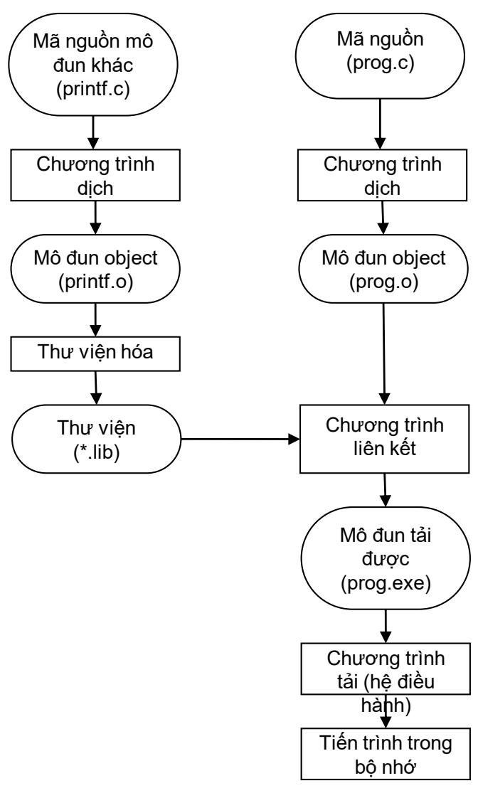

# I. ĐỊA CHỈ VÀ CÁC VẤN ĐỀ LIÊN QUAN

# Địa chỉ logic:

Phân biệt với địa chỉ vật lý, CTUD chỉ quan tâm tới địa chỉ địa chỉ logic còn địa chỉ vật lý là do HDH.

Gán cho các lệnh và dữ liệu không phụ thuộc vào vị trí cụ thể tiến trình trong bộ nhớ

Chƣơng trình ứng dụng chỉ nhìn thấy và làm việc với địa chỉ logic này

Là địa chỉ tƣơng đối tức là mỗi phần tử của chƣơng trình đƣợc gán một địa chỉ tƣơng đối đối với một vị trí nào đó

# I. ĐỊA CHỈ VÀ CÁC VẤN ĐỀ LIÊN QUAN

Địa chỉ vật lý:

Là địa chỉ chính xác trong bộ nhớ máy tính

Các mạch nhớ sử dụng để truy nhập tới chƣơng trình và dữ liệu

Địa chỉ logic đƣợc chuyển thành địa chỉ vật lý nhờ khối ánh xạ địa chỉ. (MMU=Memory Mapping Unit)

# II. MỘT SỐ CÁCH TỔ CHỨC CHƢƠNG TRÌNH 1. Tải trong quá trình thực hiện

Hàm chƣa bị gọi thì chƣa tải vào bộ nhớ

Chƣơng trình chính đƣợc load vào bộ nhớ và chạy

Khi có lời gọi hàm:

Chƣơng trình sẽ kiểm tra hàm đó đƣợc tải vào chƣa.

 Nếu chƣa, chƣơng trình sẽ tiến hành tải sau đó ánh xạ địa chỉ hàm vào không gian chung của chƣơng trình và thay đổi bảng địa chỉ để ghi lại các ánh xạ đó

Lập trình viên đảm nhiệm, HDH cung cấp các hàm thƣ viện cho tải động

# II. MỘT SỐ CÁCH TỔ CHỨC CHƢƠNG TRÌNH 2. Liên kết động và thƣ viện dùng chung

Liên kết tĩnh: các hàm và thƣ viện đƣợc liên kết luôn vào mã chƣơng trình

Kích thƣớc chƣơng trình khi đó sẽ bằng kích thƣớc chƣơng trình vừa đƣợc dịch + kích thƣớc các hàm thƣ viện

=> các hàm sẽ có mặt lặp đi lặp lại trong các chƣơng trình => lãng phí không gian cả trên đĩa và bộ nhớ trong

Giải quyết: sử dụng kỹ thuật liên kết động. Trong giai đoạn liên kết, không kết nối các hàm thƣ viện vào chƣơng trình mà chỉ chèn các thông tin về hàm thƣ viện đó (stub).

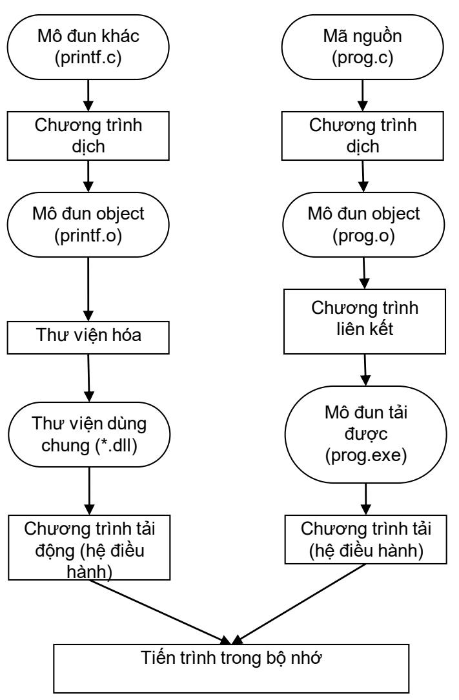

# II. MỘT SỐ CÁCH TỔ CHỨC CHƢƠNG TRÌNH 2. Liên kết động và thƣ viện dùng chung

Các modul thƣ viện đƣợc liên kết trong quá trình thực hiện:

Không giữ bản sao các modul thƣ viện mà tiến trình giữ đoạn mã nhỏ chứa thông tin về modul thƣ viện

Khi đoạn mã nhỏ đƣợc gọi, nó kiểm tra modul tƣơng ứng đã có trong bộ nhớ chƣa. Nếu chƣa, thì tải phần còn lại và dùng.

Lần tiếp theo cần sử dụng, modul thƣ viện sẽ đƣợc chạy trực tiếp

Mỗi modul thƣ viện chỉ có 1 bản sao duy nhất chứa trong MEM

Cần hỗ trợ từ HDH

# III. CÁC YÊU CẦU QUẢN LÝ BỘ NHỚ 1. Cấp phát lại

Cần có khả năng tráo đổi các tiến trình vào và ra ngoài MEM để tối đa sử dụng vi xử lý

Không thể yêu cầu tiến trình đƣợc chuyển lại vào MEM thì phải vào đúng chỗ nó đã dùng trƣớc khi bị chuyển ra

# III. CÁC YÊU CẦU QUẢN LÝ BỘ NHỚ 2. Bảo vệ

Mỗi tiến trình phải đƣợc bảo vệ khỏi các tham chiếu không mong muốn từ các tiến trình khác vào vùng nhớ dành cho mình

Mọi tham chiếu bộ nhớ của 1 tiến trình phải đƣợc kiểm tra lúc chạy

Khi 1 vùng nhớ đã dùng cho tiến trình này thì nó không cho phép tiến trình khác tham chiếu vào vùng nhớ đang dùng đó.

HDH không đoán trƣớc đƣợc mọi tham chiếu MEM => phần cứng VXL đảm nhiệm

# III. CÁC YÊU CẦU QUẢN LÝ BỘ NHỚ3. Chia sẻ

Nhiều tiến trình cần và đƣợc phép truy cập vào cùng 1 vùng nhớ

Các tiến trình đang cộng tác cần chia sẻ truy nhập tới 1 cấu trúc dữ liệu

=> Phải cho phép truy cập tới các vùng chia sẻ

III. CÁC YÊU CẦU QUẢN LÝ BỘ NHỚ 4. Cấu trúc logic & cấu trúc vật lý

Cấu trúc logic:

MEM đƣợc cấu trúc 1 cách tuyến tính gồm các byte, còn chƣơng trình đƣợc tổ chức thành các modul

Phải đáp ứng để:

Các modul có thể đƣợc viết và thông dịch 1 cách độc lập

Mức độ bảo vệ có thể khác nhau

Modul có thể đƣợc chia sẻ giữa các tiến trình

III. CÁC YÊU CẦU QUẢN LÝ BỘ NHỚ 4. Cấu trúc logic & cấu trúc vật lý

Cấu trúc vật lý:

2 mức:

Bộ nhớ chính: nhanh; chi phí cao, dung lƣợng ít

Bộ nhớ phụ: dung lƣợng lớn, cho phép lƣu chƣơng trình và dữ liệu trong thời gian dài

Hệ thống có trách nhiệm chuyển đổi thông tin giữa 2 mức

# IV. KỸ THUẬT PHÂN CHƢƠNG BỘ NHỚ

Để thực hiện tiến trình, HDH cần cấp phát cho tiến trình không gian nhớ cần thiết.

Việc cấp phát và quản lý vùng nhớ là chức năng quan trọng của HDH.

Một kỹ thuật cấp phát đơn giản nhất => mỗi tiến trình đƣợc cấp một vùng bộ nhớ liên tục

HDH tiến hành chia bộ nhớ thành các phần liên tục là chƣơng (partition), mỗi tiến trình sẽ đƣợc cung cấp một chƣơng để chứa lệnh và dữ liệu của mình.

Quá trình phân chia bộ nhớ thành chƣơng nhƣ vậy gọi là phân chƣơng bộ nhớ.

Tùy thuộc việc lựa chọn vị trí và kích thƣớc của chƣơng, có thể phân biệt phân chƣơng cố định và phân chƣơng động

# IV. KỸ THUẬT PHÂN CHƢƠNG BỘ NHỚ 1. Phân chƣơng cố định

Chia MEM thành các chƣơng với kích thƣớc cố định ở những vị trí cố định

Mỗi chƣơng chứa đƣợc đúng một tiến trình => số tiến trình tối đa có thể chứa đồng thời bị giới hạn bởi số lƣợng chƣơng.

Khi đƣợc tải vào, tiến trình đƣợc cấp phát một chƣơng. Sau khi tiến trình kết thúc, HDH giải phóng chƣơng và chƣơng có thể đƣợc cấp phát cho tiến trình mới.

Kích thƣớc các chƣơng bằng nhau:

Đơn giản

Kích thƣớc chƣơng trình > kích thƣớc chƣơng => không thể cấp phát

Gây phân mảnh trong

Kích thƣớc các chƣơng khác nhau: Có hai cách lựa chọn chƣơng nhớ để cấp cho tiến trình đang chờ đợi

Chọn chƣơng có kích thƣớc nhỏ nhất: cần có hàng đợi lệnh cho mỗi chƣơng.

 Mỗi chƣơng có một hàng đợi riêng, tiến trình có kích thƣớc phù hợp với chƣơng nào sẽ nằm trong hàng đợi của chƣơng đó

Giảm phân mảnh trong, tối ƣu cho từng chƣơng => tiết kiệm bộ nhớ.

 Do mỗi chƣơng có một hàng đợi riêng nên có thời điểm hàng đợi của chƣơng lớn hơn thì rỗng, trong khi hàng đợi của chƣơng nhỏ hơn thì không chứa tiến trình nào => Hệ thống không tối ƣu

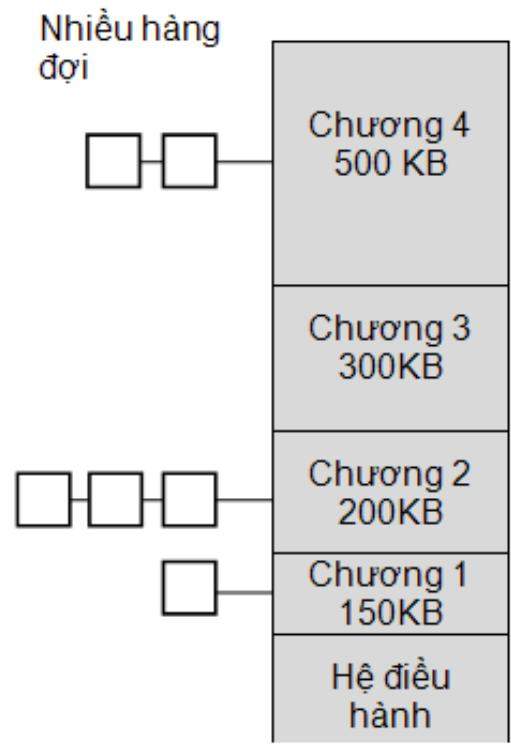

# IV. KỸ THUẬT PHÂN CHƢƠNG BỘ NHỚ 1. Phân chƣơng cố định

Kích thƣớc các chƣơng khác nhau:

Dùng hàng đợi chung cho tất cả các chƣơng:

Mỗi khi có một chƣơng trống, tiến trình nằm gần đầu hàng đợi nhất và có kích thƣớc phù hợp với chƣơng nhất sẽ đƣợc tải và thực hiện

Khi 1 chƣơng đƣợc 2 • ■ giải phóng: chọn tiến trình gần đầu hàng đợi nhất và có kích thƣớc phù hợp nhất

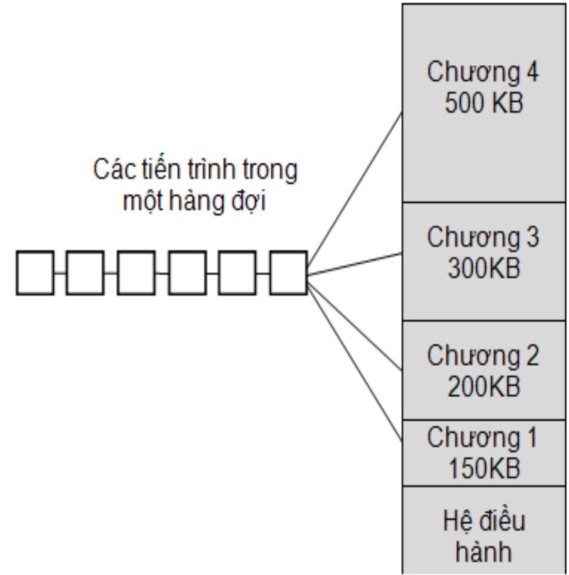

# IV. KỸ THUẬT PHÂN CHƢƠNG BỘ NHỚ 1. Phân chƣơng cố định

Ƣu điểm: đơn giản, ít xử lý

Nhƣợc điểm:

Số lƣợng chƣơng xác định tại thời điểm tạo hệ thống hạn chế số lƣợng tiến trình hoạt động

Kích thƣớc chƣơng thiết lập trƣớc: không hiệu quả

Kích thƣớc, số lƣợng và vị trí chƣơng đều có thể thay đổi

Khi có yêu cầu, HDH cấp cho tiến trình 1 chƣơng có kích thƣớc đúng bằng tiến trình đó đang cần.

Khi tiến trình kết thúc sẽ tạo vùng trống trong MEM

Các vùng trống nằm cạnh nhau đƣợc nhập lại thành vùng lớn hơn. Các vùng trống bộ nhớ cũng có thể đƣợc liên kết thành một danh sách kết

nối

<table><tr><td rowspan=1 colspan=1>C</td><td rowspan=1 colspan=3></td><td rowspan=1 colspan=1>C</td><td rowspan=1 colspan=3></td><td rowspan=1 colspan=1>C</td><td rowspan=1 colspan=1></td><td rowspan=1 colspan=1>C</td></tr><tr><td rowspan=2 colspan=1></td><td rowspan=2 colspan=1>B</td><td rowspan=2 colspan=2></td><td rowspan=2 colspan=1>B</td><td rowspan=2 colspan=3></td><td rowspan=2 colspan=1>B</td><td rowspan=4 colspan=3></td><td rowspan=4 colspan=1></td><td rowspan=4 colspan=1></td><td rowspan=3 colspan=1></td></tr><tr><td rowspan=3 colspan=1>A</td><td rowspan=3 colspan=1></td></tr><tr><td rowspan=2 colspan=1>A</td><td rowspan=2 colspan=2></td><td rowspan=2 colspan=1>A</td><td rowspan=2 colspan=3></td><td rowspan=2 colspan=1></td></tr><tr><td rowspan=1 colspan=1></td></tr><tr><td rowspan=1 colspan=1>H dièuhành</td><td rowspan=1 colspan=1></td><td rowspan=1 colspan=1>H dièuhành</td><td rowspan=1 colspan=2></td><td rowspan=1 colspan=1>H dièuhành</td><td rowspan=1 colspan=3></td><td rowspan=1 colspan=1>H dièuhành</td><td rowspan=1 colspan=3></td><td rowspan=1 colspan=1>H dièuhành</td><td rowspan=1 colspan=1></td><td rowspan=1 colspan=1>H dièuhành</td></tr></table>

# IV. KỸ THUẬT PHÂN CHƢƠNG BỘ NHỚ 2. Phân chƣơng động

Tránh phân mảnh trong

Gây phân mảnh ngoài: dồn những vùng trống nhỏ thành lớn (nén)

Sử dụng các chiến lƣợc cấp chƣơng

Chọn vùng thích hợp đầu tiên (first – fit)

Vùng thích hợp nhất (best fit)

Vùng không thích hợp nhất (worst fit)

250k, 180k, 500k

IV. KỸ THUẬT PHÂN CHƢƠNG BỘ NHỚ 3. Phƣơng pháp kề cận (buddy system)

Các chƣơng và khối trống có kích thƣớc là lũy thừa của 2k (L≤k≤H): 2L: kích thƣớc nhỏ nhất của chƣơng; 2H : kích thƣớc MEM

Đầu tiên, toàn bộ không gian nhớ là 2H , yêu cầu cấp vùng nhớ S

2H-1 <S≤ 2H : cấp cả 2H

Chia đôi thành 2 vùng 2H-1 :

Nếu 2H-2 <S≤ 2H-1 : cấp 2H-1

Tiếp tục chia đôi tới khi tìm đƣợc vùng thỏa mãn 2k-1<S≤ 2k

# IV. KỸ THUẬT PHÂN CHƢƠNG BỘ NHỚ 3. Phƣơng pháp kề cận

Sau một thời gian xuất hiện các khối trống có kích thƣớc 2k

Tạo danh sách móc nối các vùng có cùng kích thƣớc

Nếu có 2 khối trống cùng kích thƣớc và kề nhau thì ghép lại thành 1

Khi cần cấp, sẽ tìm trong danh sách khối phù hợp nhất; nếu không tìm khối lớn hơn và cắt đôi

# IV. KỸ THUẬT PHÂN CHƢƠNG BỘ NHỚ 3. Phƣơng pháp kề cận

<table><tr><td colspan="7">Memory</td></tr><tr><td></td><td colspan="6"></td></tr><tr><td>o</td><td>128 K</td><td>256 K</td><td>384 K</td><td>512K 640 K</td><td>768 K</td><td>896 K</td><td>1M</td></tr></table>

# Initially

# 1 Hole

<table><tr><td rowspan=1 colspan=1>request 70</td><td rowspan=1 colspan=1>A</td><td rowspan=1 colspan=2>128</td><td rowspan=1 colspan=2>256</td><td rowspan=1 colspan=1>512</td><td rowspan=8 colspan=1>33344431</td></tr><tr><td rowspan=1 colspan=1>request 35</td><td rowspan=1 colspan=1>A</td><td rowspan=1 colspan=1>B</td><td rowspan=1 colspan=1>64</td><td rowspan=1 colspan=2>256</td><td rowspan=1 colspan=1>512</td></tr><tr><td rowspan=1 colspan=1>request 80</td><td rowspan=1 colspan=1>A</td><td rowspan=1 colspan=1>B</td><td rowspan=1 colspan=1>64</td><td rowspan=1 colspan=1>C</td><td rowspan=1 colspan=1>128</td><td rowspan=1 colspan=1>512</td></tr><tr><td rowspan=1 colspan=1>return A</td><td rowspan=1 colspan=1>128</td><td rowspan=1 colspan=1>B</td><td rowspan=1 colspan=1>64</td><td rowspan=1 colspan=1>C</td><td rowspan=1 colspan=1>128</td><td rowspan=1 colspan=1>512</td></tr><tr><td rowspan=1 colspan=1>request 60</td><td rowspan=1 colspan=1>128</td><td rowspan=1 colspan=1>B</td><td rowspan=1 colspan=1>D</td><td rowspan=1 colspan=1>C</td><td rowspan=1 colspan=1>128</td><td rowspan=1 colspan=1>512</td></tr><tr><td rowspan=1 colspan=1>return B</td><td rowspan=1 colspan=1>128</td><td rowspan=1 colspan=1>64</td><td rowspan=1 colspan=1>D</td><td rowspan=1 colspan=1>C</td><td rowspan=1 colspan=1>128</td><td rowspan=1 colspan=1>512</td></tr><tr><td rowspan=1 colspan=1>return D</td><td rowspan=1 colspan=3>256</td><td rowspan=1 colspan=1>C</td><td rowspan=1 colspan=1>128</td><td rowspan=1 colspan=1>512</td></tr><tr><td rowspan=1 colspan=1>return C</td><td rowspan=1 colspan=6>1024</td></tr></table>

IV. PHÂN CHƢƠNG BỘ NHỚ 4. Ánh xạ địa chỉ và chống truy cập trái phép

Vị trí các chƣơng thƣờng không biết trƣớc và có thể thay đổi => cần có cơ chế biến đổi địa chỉ logic thành vật lý

Cấm truy cập trái phép: tiến trình này truy cập tới phần MEM của tiến trình khác

Ánh xạ địa chỉ do phần cứng đảm nhiệm

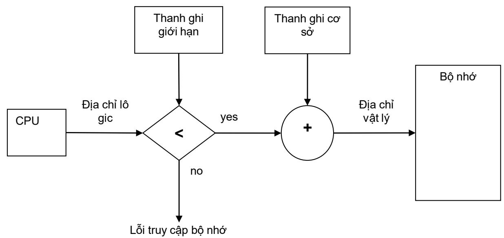

# IV. PHÂN CHƢƠNG BỘ NHỚ 4. Ánh xạ địa chỉ và chống truy cập trái phép

Khi tiến trình đƣợc tải vào MEM, CPU dành 2 thanh ghi:

Thanh ghi cơ sở: chứa địa chỉ bắt đầu của tiến trình

Thanh ghi giới hạn: chứa độ dài chƣơng

Địa chỉ logic đƣợc so sánh với nội dung của thanh ghi giới hạn

Nếu lớn hơn: lỗi truy cập

Nhỏ hơn: đƣợc đƣa tới bộ cộng với thanh ghi cơ sở để thành địa chỉ vật lý

Nếu chƣơng bị di chuyển thì nội dung của thanh ghi cơ sở bị thay đổi chứa địa chỉ vị trí mới

IV. PHÂN CHƢƠNG BỘ NHỚ 5. Trao đổi giữa bộ nhớ và đĩa (swapping)

Các tiến trình đang thực hiện có thể bị tạm thời tải ra đĩa nhƣờng chỗ để tải các tiến trình khác vào

Sau đó lại đƣợc tải vào (nếu chƣa kết thúc) để thực hiện tiếp

Xảy ra khi:

Một tiến trình đã hết khoảng thời gian sử dụng CPU của mình

Nhƣờng chỗ cho một tiến trình khác có thứ tự ƣu tiên cao hơn

# IV. PHÂN CHƢƠNG BỘ NHỚ 5. Trao đổi giữa bộ nhớ và đĩa (swapping)

Thời gian tải phụ thuộc vào tốc độ truy cập đĩa, tốc độ truy cập bộ nhớ và kích thƣớc tiến trình

Khi đƣợc tải vào lại, tiến trình có thể đƣợc chứa vào chƣơng ở vị trí cũ hoặc đƣợc cấp cho một chƣơng địa chỉ hoàn toàn mới

Các tiến trình bị trao đổi phải ở trạng thái nghỉ, đặc biệt không thực hiện các thao tác vào ra

# V. PHÂN TRANG BỘ NHỚ

1. Khái niệm phân trang

Bộ nhớ vật lý đƣợc chia thành các khối nhỏ, kích thƣớc cố định và bằng nhau gọi là khung trang (page frame)

Không gian địa chỉ logic của tiến trình đƣợc chia thành những khối gọi là trang (page), có kích thƣớc bằng khung

<table><tr><td rowspan=15 colspan=1>0-23450∞02=22</td></tr><tr></tr><tr></tr><tr></tr><tr></tr><tr></tr><tr></tr><tr></tr><tr></tr><tr></tr><tr></tr><tr></tr><tr></tr><tr></tr><tr></tr></table>

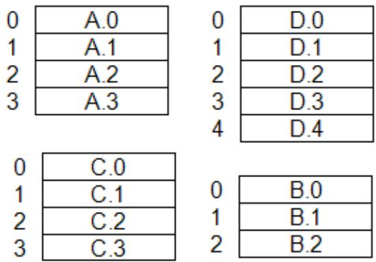

Không gian nhó lô gic cúa các tién trình

A và C: 4 trang B: 3 trang; D: 5 trang

# BỘ MÔN: KHOA HỌC MÁY TÍNH – KHOA CNTT1

Tiến trình đƣợc cấp các khung để chứa các trang của mình.

Các trang có thể chứa trong các khung nằm rải rác trong bộ nhớ

<table><tr><td>Só khung</td><td>Bô nhó</td><td>Só khung</td><td>Bô nhó</td><td>Só khung 0</td><td>B nhó</td></tr><tr><td>0</td><td></td><td>0</td><td>A.0 A.1</td><td></td><td>A.0</td></tr><tr><td>1</td><td></td><td>1</td><td></td><td>1</td><td>A.1</td></tr><tr><td>2</td><td></td><td>2</td><td>A.2</td><td>2</td><td>A.2</td></tr><tr><td>3</td><td></td><td>3</td><td>A.3</td><td>3</td><td>A.3</td></tr><tr><td>4</td><td></td><td>4</td><td></td><td>4 5</td><td>B.0</td></tr><tr><td>5</td><td></td><td>5</td><td></td><td></td><td>B.1</td></tr><tr><td>6</td><td></td><td>6</td><td></td><td>6</td><td>B.2</td></tr><tr><td>7</td><td></td><td>7</td><td></td><td>7</td><td></td></tr><tr><td>8</td><td></td><td>8</td><td></td><td>8</td><td></td></tr><tr><td>9</td><td></td><td>9 10</td><td></td><td>9</td><td></td></tr><tr><td>10</td><td></td><td>11</td><td></td><td>10 11</td><td></td></tr><tr><td>11</td><td></td><td>12</td><td></td><td>12</td><td></td></tr><tr><td>12</td><td></td><td>13</td><td></td><td></td><td></td></tr><tr><td>13</td><td></td><td>14</td><td></td><td>13 14</td><td></td></tr><tr><td>14</td><td></td><td></td><td></td><td></td><td></td></tr><tr><td>Só khung</td><td>Bô nhó</td><td>Só khung 0</td><td>Bô nhó</td><td>Só khung</td><td>B nhó</td></tr><tr><td>0</td><td>A.0</td><td>1</td><td>A.0</td><td>0</td><td>A.0</td></tr><tr><td>1</td><td>A.1</td><td>2</td><td>A.1</td><td>1</td><td>A.1</td></tr><tr><td>2</td><td>A.2</td><td>3</td><td>A.2</td><td>2</td><td>A.2</td></tr><tr><td>3</td><td>A.3</td><td></td><td>A.3</td><td>3</td><td>A.3</td></tr><tr><td>4</td><td>B.0</td><td>4</td><td></td><td>4</td><td>D.0</td></tr><tr><td>5</td><td>B.1</td><td>5</td><td></td><td>5</td><td>D.1</td></tr><tr><td>6</td><td>B.2</td><td>6</td><td></td><td>6</td><td>D.2</td></tr><tr><td>7</td><td>C.0</td><td>7</td><td>C.0</td><td>7</td><td>C.0</td></tr><tr><td>8</td><td>C.1</td><td>8</td><td>C.1</td><td>8</td><td>C.1</td></tr><tr><td>9</td><td></td><td>9</td><td>C.2</td><td>9</td><td>C.2</td></tr><tr><td>10</td><td>C.2</td><td>10</td><td>C.3</td><td>10</td><td>C.3</td></tr><tr><td></td><td>C.3</td><td>11</td><td></td><td>11</td><td>D.3</td></tr><tr><td>11</td><td></td><td>12</td><td></td><td>12</td><td></td></tr><tr><td>12</td><td></td><td>13</td><td></td><td></td><td>D.4</td></tr><tr><td>13</td><td></td><td></td><td></td><td>13</td><td></td></tr><tr><td>14</td><td></td><td>14</td><td></td><td>14</td><td></td></tr></table>

# V. PHÂN TRANG BỘ NHỚ 1. Khái niệm phân trang

#

HDH quản lý việc cấp phát khung cho mỗi tiến trình bằng bảng trang (bảng phân trang): mỗi ô tƣơng ứng với 1 trang và chứa số khung cấp cho trang đó

Mỗi tiến trình có bảng trang riêng

Duy trì danh sách các khung trống trong MEM

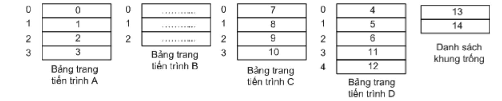

Tƣơng tự nhƣ phân chƣơng cố định: khung tƣơng tự chƣơng, kích thƣớc và vị trí không thay đổi

Tuy nhiên kích thƣớc các phần tƣơng đối nhỏ và các phần cho 1 tiến trình không cần liên tục nhau

Không có phân mảnh ngoài

Có phân mảnh trong

V. PHÂN TRANG BỘ NHỚ 2. Ánh xạ địa chỉ

Để tính toán địa chỉ hiệu quả, kích thƣớc khung đƣợc chọn là lũy thừa của 2

Địa chỉ logic gồm 2 phần:

Số thứ tự trang (p)

Độ dịch (địa chỉ lệch) của địa chỉ so với đầu trang (o)

Nếu kích thƣớc trang là 2n. Biểu diễn địa chỉ logic dƣới dạng địa chỉ có độ dài (m + n) bit

m bit cao: biểu diễn số thứ tự trang

n bit thấp: biểu diễn độ dịch trong trang nhớ

<table><tr><td>Dia chi lô gic</td><td>só thú ty trang (p)</td><td>d dich trong trang (0)</td></tr></table>

Quá trình chuyển địa chỉ logic sang địa chỉ vật lý:

Lấy m bit cao của địa chỉ => đƣợc số thứ tự trang

Dựa vào bảng trang, tìm đƣợc số thứ tự khung vật lý (k)

Địa chỉ vật lý bắt đầu của khung là k\*2n

Địa chỉ vật lý của byte đƣợc tham chiếu là địa chỉ bắt đầu của khung cộng với địa chỉ lệch (độ dịch)

=> Chỉ cần thêm số khung vào trƣớc dãy bit biểu diễn độ lệch

# V. PHÂN TRANG BỘ NHỚ 2. Ánh xạ địa chỉ

Kích thƣớc khung là 1KB

=> Sử dụng 10 bit để biểu diễn địa chỉ lệch (n=10)

Địa chỉ logic 1502

↔ byte 478   
trong trang 1

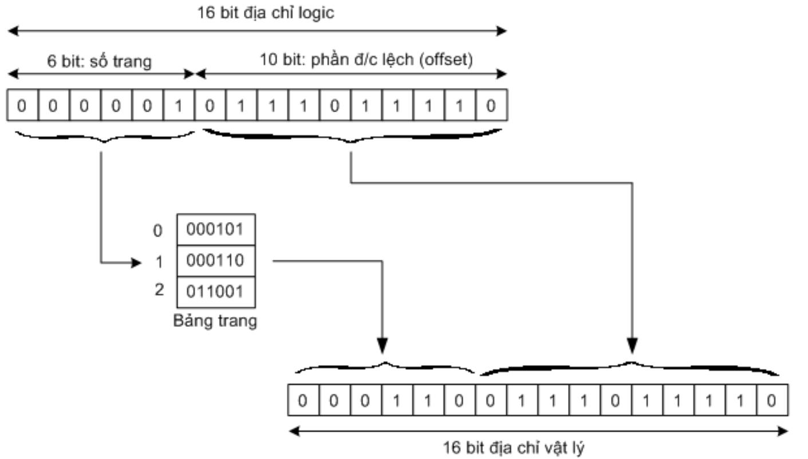

# V. PHÂN TRANG BỘ NHỚ 2. Ánh xạ địa chỉ

Quá trình biến đổi từ địa chỉ logic sang địa chỉ vật lý đƣợc thực hiện bằng phần cứng

Kích thƣớc trang là lũy thừa của 2, nằm trong khoảng từ 512B đến 16MB

Việc tách phần p và o trong địa chỉ logic đƣợc thực hiện dễ dàng bằng phép dịch bit

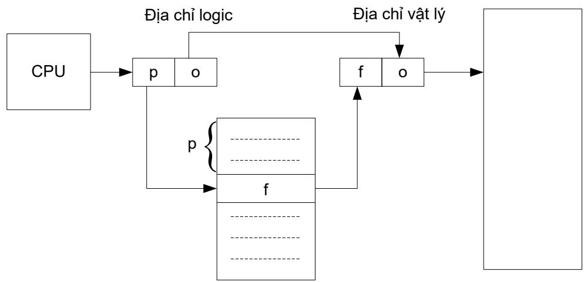

Phân mảnh trong khi phân trang có giá trị trung bình bằng nửa trang

=> giảm kích thƣớc trang cho phép tiết kiệm MEM

Kích thƣớc trang nhỏ => số lƣợng trang tăng => bảng trang to, khó quản lý

Kích thƣớc trang nhỏ: không tiện cho việc trao đổi với đĩa

Windows 32bit: kích thƣớc trang 4KB

Cơ chế ánh xạ giữa hai loại địa chỉ hoàn toàn trong suốt đối với chƣơng trình

V. PHÂN TRANG BỘ NHỚ

3. Tổ chức bảng trang

Mỗi thao tác truy cập bộ nhớ đều đòi hỏi truy cập bảng phân trang

=> tổ chức bảng phân trang sao cho tốc độ truy cập là cao nhất

Sử dụng tập hợp các thanh ghi làm bảng phân trang:

Tốc độ truy cập rất cao

Số lƣợng thanh ghi hạn chế => không áp dụng đƣợc

Giữ các bảng trang trong MEM:

Vị trí mỗi bảng đƣợc trỏ bởi thanh ghi cơ sở bảng trang PTBR (Page Table Base Register)

Nhiều thời gian để truy cập bảng

=> sử dụng bộ nhớ cache tốc độ cao

V. PHÂN TRANG BỘ NHỚ 3. Tổ chức bảng trang- bảng trang nhiều mức

#

Không gian địa chỉ logic lớn (232 -> 264) => kích thƣớc bảng trang tăng

=> cần chia bảng trang thành những phần nhỏ hơn

Tổ chức bảng trang nhiều mức: Khoản mục của bảng mức trên chỉ tới bảng trang khác

V. PHÂN TRANG BỘ NHỚ

3. Tổ chức bảng trang- bảng trang nhiều mức

Ví dụ bảng 2 mức: địa chỉ 32 bit chia thành 3 phần

P1: 10 bit cho phép định vị khoản mục trong bảng mức trên => tìm đƣợc bảng mức dƣới tƣơng ứng

P2: định vị khoản mục trong bảng mức dƣới (chứa địa chỉ khung tƣơng ứng)

O: 12 bit, chứa độ dịch trong trang

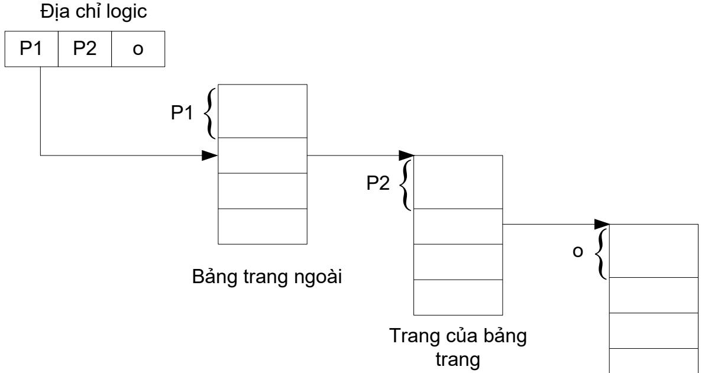

Chƣơng trình thƣờng đƣợc chia thành nhiều phần: dữ liệu, lệnh, ngăn xếp

Chia chƣơng trình thành các đoạn theo cấu trúc logic

Mỗi đoạn đƣợc phân vào 1 vùng nhớ, có kích thƣớc không bằng nhau

Mỗi đoạn tƣơng ứng với không gian địa chỉ riêng, đƣợc phân biệt bởi tên (STT) và độ dài của mình

Các vùng nhớ thuộc các đoạn khác nhau có thể nằm ở vị trí khác nhau

Giống phân chƣơng động: bộ nhớ đƣợc cấp phát theo từng vùng kích thƣớc thay đổi

Khác phân chƣơng động: chƣơng trình có thể chiếm nhiều hơn 1 đoạn và không cần liên tiếp nhau trong MEM

Tránh hiện tƣợng phân mảnh trong

Có phân mảnh ngoài

Dễ sắp xếp bộ nhớ

Dễ chia sẻ các đoạn giữa các tiến trình khác nhau

Kích thƣớc mỗi đoạn có thể thay đổi mà không ảnh hƣởng tới các đoạn khác

Sử dụng bảng đoạn cho mỗi tiến trình. Mỗi ô tƣơng ứng với 1 đoạn, chứa:

Địa chỉ cơ sở: vị trí bắt đầu của đoạn trong bộ nhớ

Địa chỉ giới hạn: độ dài đoạn, sử dụng để chống truy cập trái phép ra ngoài đoạn

Địa chỉ logic gồm 2 thành phần, (s, o):

S: số thứ tự/ tên đoạn

O: độ dịch trong đoạn

# VI. PHÂN ĐOẠN BỘ NHỚ 2. Ánh xạ địa chỉ

Từ chỉ số đoạn s, vào bảng đoạn, tìm địa chỉ vật lý bắt đầu của đoạn

So sánh độ dịch o với chiều dài đoạn, nếu lớn hơn => địa chỉ sai

Địa chỉ vật lý mong muốn là tổng của địa chỉ vật lý bắt đầu đoạn và địa chỉ lệch

# VI. PHÂN ĐOẠN BỘ NHỚ

3. Kết hợp phân trang và Phân đoạn

Phân đoạn chƣơng trình, mỗi đoạn sẽ tiến hành phân trang

Địa chỉ gồm: số thứ tự đoạn, số thự tự trang, độ dịch trong trang

Tiến trình có 1 bảng phân đoạn, mỗi đoạn có 1 bảng phân trang

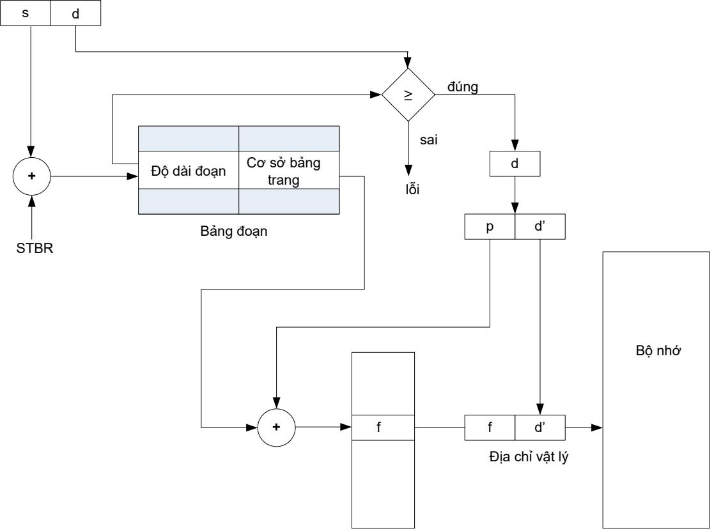

Tiến trình có thể chia thành các phần nhỏ nằm rải rác trong bộ nhớ

Tất cả các phép biến đổi là trong suốt với ngƣời dùng và ngƣời lập trình chỉ làm việc với không gian nhớ logic

Không phải tiến trình nào khi chạy cũng sử dụng tất cả các lệnh và dữ liệu của mình với tần số nhƣ nhau

=> không nhất thiết toàn bộ các trang/ đoạn của một tiến trình phải có mặt đồng thời trong bộ nhớ khi tiến trình chạy

=> Các trang hoặc đoạn có thể đƣợc trao đổi từ đĩa vào bộ nhớ khi có nhu cầu truy cập tới

# V. BỘ NHỚ ẢO

1. Khái niệm

Việc thực hiện các tiến trình chỉ nằm một phần trong bộ nhớ có một số ƣu điểm:

Có thể viết chƣơng trình có kích thƣớc lớn hơn kích thƣớc thực của MEM

Cùng 1 lúc nhiều tiến trình cùng đƣợc tải vào MEM hơn

=> Bộ nhớ ảo là bộ nhớ lôgic theo cách nhìn của ngƣời lập trình và tiến trình và không bị hạn chế bởi bộ nhớ thực.

Bộ nhớ ảo có thể lớn hơn bộ nhớ thực rất nhiều và bao gồm cả không gian trên đĩa

Bộ nhớ ảo thƣờng đƣợc xây dựng dựa trên phƣơng pháp phân trang trong đó các trang là đơn vị để nạp từ đĩa vào khi cần

# V. BỘ NHỚ ẢO

2. Nạp trang theo nhu cầu

Tiến trình đƣợc phân trang và chứa trên đĩa

Khi cần thực hiện, nạp tiến trình vào MEM: chỉ nạp những trang cần dùng

Tiến trình gồm các trang trên đĩa và trong MEM: thêm bit P trong khoản mục bảng trang để phân biệt (P=1: đã nạp vào MEM)

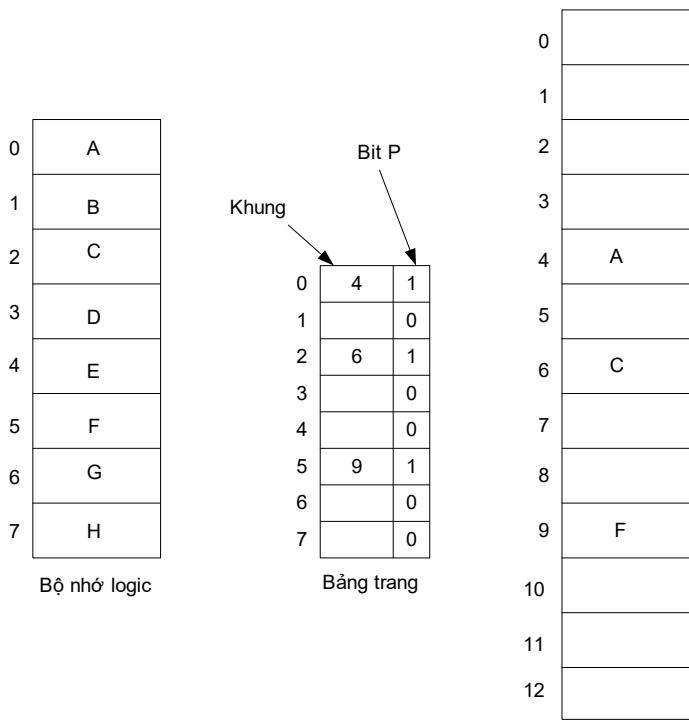

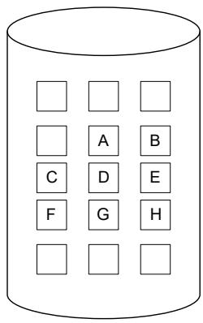

# V. BỘ NHỚ ẢO

2. Nạp trang theo nhu cầu

Quá trình kiểm tra và nạp trang:

Tiến trình truy cập tới 1 trang, kiểm tra bit P. Nếu P=1, truy cập diễn ra bình thƣờng. Nếu P=0, xảy ra sự kiện thiếu trang

Ngắt xử lý thiếu trang:

• HDH tìm 1 khung trống trong MEM

Đọc trang bị thiếu vào khung trang vừa tìm đƣợc

Sửa lại khoản mục tƣơng ứng trong bảng trang: đổi bit P=1 và số khung đã cấp cho trang

Khôi phục lại trạng thái tiến trình và thực hiện tiếp lệnh bị ngắt

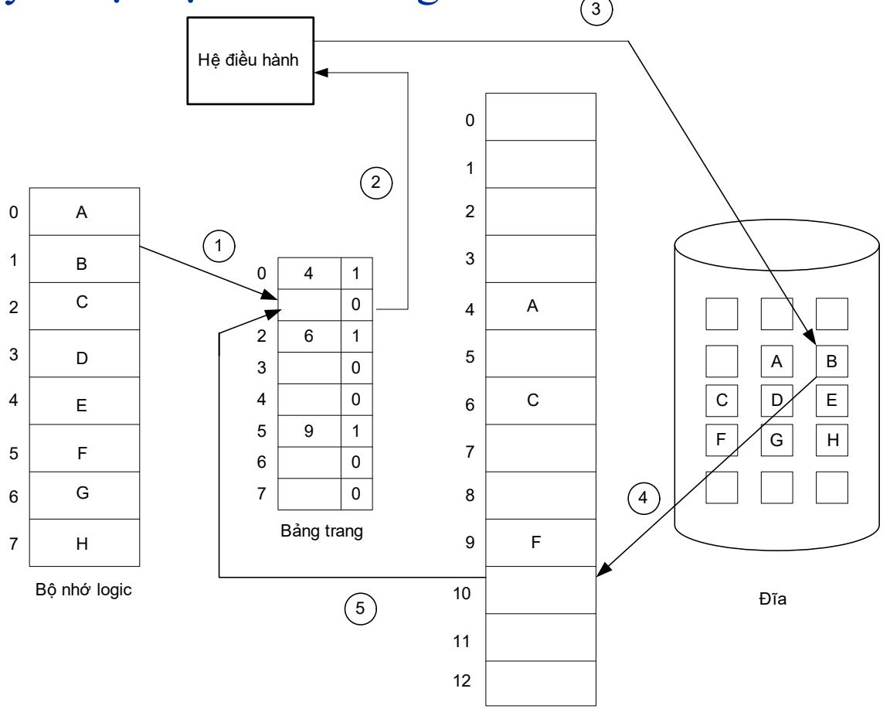

# V. BỘ NHỚ ẢO

2. Nạp trang theo nhu cầu

Nạp trang hoàn toàn theo nhu cầu:

Bắt đầu một tiến trình mà không nạp bất kỳ trang nào vào bộ nhớ

Khi con trỏ lệnh đƣợc HDH chuyển tới lệnh đầu tiên của tiến trình để thực hiện, sự kiện thiếu trang sẽ sinh ra và trang tƣơng ứng đƣợc nạp vào

Tiến trình sau đó thực hiện bình thƣờng cho tới lần thiếu trang tiếp theo

Nạp trang trƣớc: khác với nạp trang theo nhu cầu

Các trang chƣa cần đến cũng đƣợc nạp vào bộ nhớ

Không hiệu quả

Bộ nhớ ảo > bộ nhớ thực và chế độ đa chƣơng trình -> có lúc không còn khung nào trống để nạp trang mới

Giải pháp:

Kết thúc tiến trình

Trao đổi tiến trình ra đĩa và chờ thời điểm thuận lợi hơn Đổi trang

# V. BỘ NHỚ ẢO

3.1. Thao tác đổi trang

Nếu không còn khung nào trống, HDH chọn 1 khung đã cấp phát nhƣng hiện không dùng tới và giải phóng nó

Quá trình đổi trang:

B1: Xác định trang trên đia cần nạp vào MEM

B2: Nếu có khung trống trên MEM thì chuyển sang B4

# B3:

Lựa chọn 1 khung trên MEM để giải phóng, theo 1 thuật toán nào đó

Ghi nội dung khung bị đổi ra đĩa (nếu cần), cập nhật bảng trang và bảng khung

B4: Đọc trang cần nạp vào khung vừa giải phóng; cập nhật bảng trang và bảng khung

B5: Thực hiện tiếp tiến trình từ điểm bị dừng trƣớc khi đổi trang

# V. BỘ NHỚ ẢO

3.1. Thao tác đổi trang

Đổi trang có ghi và đổi trang không ghi:

Việc ghi trang bị đổi ra đĩa làm tăng đáng kể thời gian nạp trang

=> nhận biết các trang không thay đổi từ lúc nạp và không ghi ngƣợc ra đĩa

Sử dụng thêm bit sửa đổi M trong khoản mục trang để đánh dấu trang đã bị sửa đổi (1) hay chƣa (0)

Các khung bị khóa

Một số khung sẽ không bị giải phóng trong quá trình tìm kiếm khung để đổi trang => các khung bị khóa

VD: Khung chứa tiến trình nhân của HDH, chứa các cấu trúc thông tin điều khiển quan trọng

Nhận biết bởi 1 bit riêng chứa trong khoản mục

# V. BỘ NHỚ ẢO

3.2 Các chiến lƣợc đổi trang

Đổi trang tối ƣu (OPT):

Chọn trang sẽ không đƣợc dùng tới trong khoảng thời gian lâu nhất để đổi

Cho phép giảm tối thiểu sự kiện thiếu trang và do đó là tối ƣu theo tiêu chuẩn này

HDH không đoán trƣớc đƣợc nhu cầu sử dụng các trang trong tƣơng lai

=> không áp dụng trong thực tế mà chỉ để so sánh với các chiến lƣợc khác

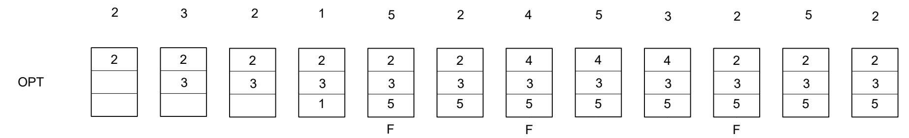

Vào trƣớc ra trƣớc (FIFO):

Trang nào đƣợc nạp vào trƣớc thì bị đổi ra trƣớc

Đơn giản nhất

Trang bị trao đổi là trang nằm lâu nhất trong bộ nhớ

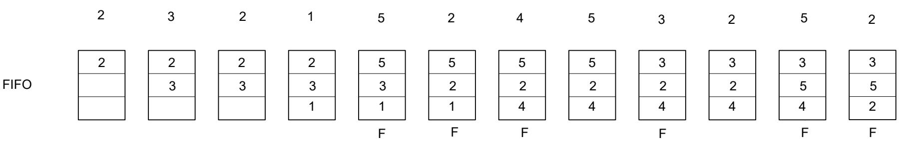

# V. BỘ NHỚ ẢO

3.2 Các chiến lƣợc đổi trang

Đổi trang ít sử dụng nhất trong thời gian cuối (LRU):

Trang bị đổi là trang mà thời gian từ lần truy cập cuối cùng đến thời điểm hiện tại là lâu nhất

Theo nguyên tắc cục bộ về thời gian, đó chính là trang ít có khả năng sử dụng tới nhất trong tƣơng lai

Thực tế LRU cho kết quả tốt gần nhƣ phƣơng pháp đổi trang tối ƣu

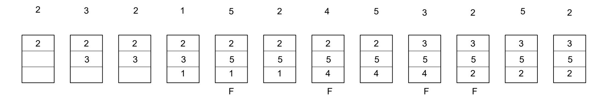

Đổi trang ít sử dụng nhất trong thời gian cuối (LRU):

Xác định đƣợc trang có lần truy cập cuối diễn ra cách thời điểm hiện tại lâu nhất?

Sử dụng biến đếm:

Mỗi khoản mục của bảng phân trang sẽ có thêm một trƣờng chứa thời gian truy cập trang lần cuối - Là thời gian logic

CPU cũng đƣợc thêm một bộ đếm thời gian lôgic này

Chỉ số của bộ đếm tăng mỗi khi xảy ra truy cập bộ nhớ

Mỗi khi một trang nhớ đƣợc truy cập, chỉ số của bộ đếm sẽ đƣợc ghi vào trƣờng thời gian truy cập trong khoản mục của trang đó

> trƣờng thời gian luôn chứa thời gian truy cập trang lần cuối

=> trang bị đổi là trang có giá trị thời gian nhỏ nhất

Đổi trang ít sử dụng nhất trong thời gian cuối (LRU):

Sử dụng ngăn xếp:

Ngăn xếp đặc biệt đƣợc sử dụng để chứa các số trang

Mỗi khi một trang nhớ đƣợc truy cập, số trang sẽ đƣợc chuyển lên đỉnh ngăn xếp

Đỉnh ngăn xếp sẽ chứa trang đƣợc truy cập gần đây nhất

Đáy ngăn xếp chính là trang LRU, tức là trang cần trao đổi

Tránh tìm kiếm trong bảng phân trang

Thích hợp thực hiện bằng phần mềm

Thuật toán đồng hồ (CLOCK):

Cải tiến FIFO nhằm tránh thay những trang mặc dù đã đƣợc nạp vào lâu nhƣng vẫn có khả năng sử dụng

Mỗi trang đƣợc gắn thêm 1 bit sử dụng U

Khi trang đƣợc truy cập đọc/ ghi: U = 1

=> ngay khi trang đƣợc đọc vào bộ nhớ: U =1

Các khung có thể bị đổi (các trang tƣơng ứng) đƣợc liên kết vào 1 danh sách vòng

Khi một trang nào đó bị đổi, con trỏ đƣợc dịch chuyển để trỏ vào trang tiếp theo trong danh sách

# Thuật toán đồng hồ (CLOCK):

Khi có nhu cầu đổi trang, HDH kiểm tra trang đang bị trỏ tới

Nếu U=0: trang sẽ bị đổi ngay

Nếu U=1: đặt U=0 và trỏ sang trang tiếp theo, lặp lại quá trình

Nếu U của tất cả các trang trong danh sách =1 thì con trỏ sẽ quay đúng 1 vòng, đặt U của tất cả các trang =0 và trang hiện thời đang bị trỏ sẽ bị đổi

# V. BỘ NHỚ ẢO

3.2 Các chiến lƣợc đổi trang

# Thuật toán đồng hồ (CLOCK):

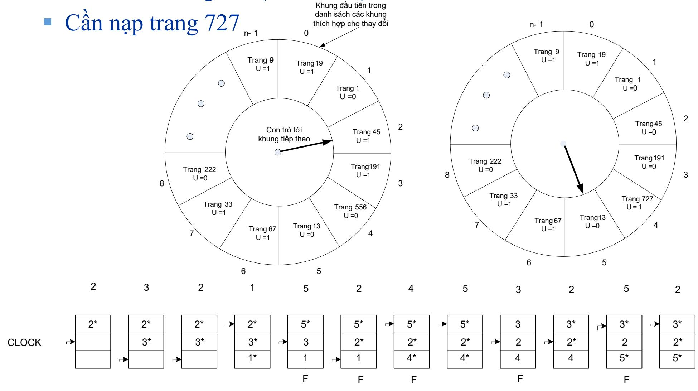

# Thuật toán đồng hồ (CLOCK):

Căn cứ vào 2 thông tin để đƣa ra quyết định đổi trang:

Thời gian trang đƣợc tải vào, thể hiện qua vị trí trang trong danh sách giống nhƣ FIFO

Gần đây trang có đƣợc sử dụng hay không, thể hiện qua bit U

Việc kiểm tra thêm bit U tƣơng tự việc cho trang thêm khả năng đƣợc giữ trong bộ nhớ

=> thuật toán cơ hội thứ 2

# Thuật toán đồng hồ cải tiến:

Sử dụng thêm thông tin về việc nội dung trang có bị thay đổi hay không bằng bit M

Kết hợp bit U và M, có 4 khả năng:

U=0, M=0: trang gần đây không đƣợc truy cập và nội dung cũng không bị thay đổi, rất thích hợp để bị đổi ra ngoài

U=0, M=1: trang có nội dung thay đổi nhƣng gần đây không đƣợc truy cập, cũng là ứng viên để đổi ra ngoài

U=1, M=0: trang mới đƣợc truy cập gần đây và do vậy theo nguyên lý cục bộ về thời gian có thể sắp đƣợc truy cập tiếp

U=1, M=1: trang có nội dung bị thay đổi và mới đƣợc truy cập gần đây, chƣa thật thích hợp để đổi

Thuật toán đồng hồ cải tiến:

Các bƣớc thực hiện đổi trang:

Bƣớc 1:

Bắt đầu từ vị trí hiện tại của con trỏ, kiểm tra các trang

Trang đầu tiên có U=0 và M=0 sẽ bị đổi

Chỉ kiểm tra mà không thay đổi nội dung bit U, bit M

# Bƣớc 2:

Nếu quay hết 1 vòng mà không tìm đƣợc trang có U và M bằng 0 thì quét lại danh sách lần 2

Trang đầu tiên có U=0, M=1 sẽ bị đổi

■ Đặt bit U của những trang đã quét đến nhƣng đƣợc bỏ qua là 0

Nếu chƣa tìm đƣợc thì lặp lại bƣớc 1 và cả bƣớc 2 nếu cần

HDH dành ra một số khung trống đƣợc kết nối thành danh sách liên kết gọi là các trang đệm

Trang bị đổi nhƣ bình thƣờng nhƣng nội dung trang này không bị xóa ngay khỏi bộ nhớ

Khung chứa trang đƣợc đánh dấu là khung trống và thêm vào cuối danh sách trang đệm

Trang mới sẽ đƣợc nạp vào khung đứng đầu trong danh sách trang đệm

Tới thời điểm thích hợp, hệ thống sẽ ghi nội dung các trang trong danh sách đệm ra đĩa

# V. BỘ NHỚ ẢO

3.3 Sử dụng đệm trang

Kỹ thuật đệm trang cho phép cải tiến tốc độ:

Nếu trang bị đổi có nội dung cần ghi ra đĩa, HDH vẫn có thể nạp trang mới vào ngay

Việc ghi ra đĩa sẽ đƣợc lùi lại tới một thời điểm sau

Thao tác ghi ra đĩa có thể thực hiện đồng thời với nhiều trang nằm trong danh sách đƣợc đánh dấu trống.

Trang bị đổi vẫn đƣợc giữ trong bộ nhớ một thời gian:

Nếu có yêu cầu truy cập trong thời gian này, trang sẽ đƣợc lấy ra từ danh sách đệm và sử dụng ngay mà không cần nạp lại từ đĩa

=> Vùng đệm đóng vai trò giống nhƣ bộ nhớ cache

# VI. CẤP PHÁT KHUNG TRANG 1. Giới hạn khung

HDH cấp phát bao nhiêu khung cho mỗi tiến trình?

Khi số lƣợng khung tối đa cấp cho tiến trình giảm tới mức nào đó, lỗi thiếu trang diễn ra thƣờng xuyên

=> Đặt giới hạn tối thiểu các khung cấp phát cho tiến trình

Khi số lƣợng khung cấp cho tiến trình tăng tới mức nào đó thì việc tăng thêm khung cho tiến trình không làm giảm đáng kể tần suất thiếu trang nữa

=> Cấp phát số lƣợng khung cố định và số lƣợng khung thay đổi

VI. CẤP PHÁT KHUNG TRANG 1.1. Cấp phát số lƣợng khung cố định

Cấp cho tiến trình một số lƣợng cố định khung để chứa các trang nhớ

Số lƣợng đƣợc xác định vào thời điểm tạo mới tiến trình và không thay đổi trong quá trình tiến trình tồn tại

Cấp phát bằng nhau:

Các tiến trình đƣợc cấp số khung tối đa bằng nhau

Số lƣợng đƣợc xác định dựa vào kích thƣớc MEM và mức độ đa chƣơng trình mong muốn

Cấp phát không bằng nhau:

Các tiến trình đƣợc cấp số khung tối đa khác nhau

Cấp số khung tỉ lệ thuận với kích thƣớc tiến trình

Có mức ƣu tiên

# VI. CẤP PHÁT KHUNG TRANG 1.2. Cấp phát số lƣợng khung thay đổi

Số lƣợng khung tối đa cấp cho mỗi tiến trình có thể thay đổi trong quá trình thực hiện

Việc thay đổi phụ thuộc vào tình hình thực hiện của tiến trình

Cho phép sử dụng bộ nhớ hiệu quả hơn phƣơng pháp cố định

=> Cần theo dõi và xử lý thông tin về tình hình sử dụng bộ nhớ của tiến trình

# VI. CẤP PHÁT KHUNG TRANG PTI 2. Phạm vi cấp phát khung

Cấp phát toàn thể:

Cho phép tiến trình đổi trang mới vào bất cứ khung nào (không bị khóa), kể cả khung đã đƣợc cấp phát cho tiến trình khác

Cấp phát cục bộ:

Trang chỉ đƣợc đổi vào khung đang đƣợc cấp cho chính tiến trình đó

Phạm vi cấp phát có quan hệ mật thiết với số lƣợng khung tối đa:

Số lƣợng khung cố định tƣơng ứng với phạm vi cấp phát cục bộ Số lƣợng khung thay đổi tƣơng ứng với phạm vi cấp phát toàn thể

# VII. TÌNH TRẠNG TRÌ TRỆ (thrashing)

Là tình trạng đổi trang liên tục do không đủ bộ nhớ

Thời gian đổi trang của tiến trình lớn hơn thời gian thực hiện

Xảy ra khi:

Kích thƣớc bộ nhớ hạn chế

Tiến trình đòi hỏi truy cập đồng thời nhiều trang nhớ

Hệ thống có mức độ đa chƣơng trình cao

VII. TÌNH TRẠNG TRÌ TRỆ (thrashing) Kiểm soát tần suất thiếu trang

Khi tiến trình rơi vào tình trạng trì trệ, tần suất thiếu trang tăng đáng kể

=> sử dụng để phát hiện và giải quyết vấn đề trì trệ

Theo dõi và ghi lại tần suất thiếu trang

Có thể đặt ra giới hạn trên và giới hạn dƣới cho tần suất thiếu trang của tiến trình

Tần suất vƣợt giới hạn trên:

Cấp thêm cho tiến trình khung mới

 Nếu không thể tìm khung để cấp thêm, tiến trình sẽ bị treo hoặc bị kết thúc

Tần suất thiếu trang thấp hơn giới hạn dƣới: thu hồi một số khung của tiến trình

# VIII. QUẢN LÝ BỘ NHỚ TRONG INTEL PENTIUM

Hỗ trợ cơ chế quản lý bộ nhớ: phân đoạn đƣợc kết hợp với phân trang

Không gian nhớ của tiến trình bao gồm nhiều đoạn, mỗi đoạn có thể có kích thƣớc khác nhau và đƣợc phân trang trƣớc khi đặt vào bộ nhớ

Ánh xạ địa chỉ: 2 giai đoạn

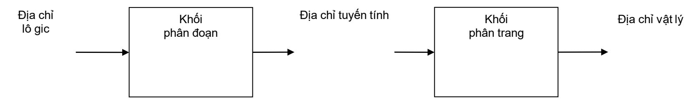

Cho phép tiến trình có tối đa 16KB (hơn 16000) đoạn, mỗi đoạn có kích thƣớc tối đa 4GB

Không gian nhớ lô gic đƣợc chia thành hai phần:

Phần 1: dành riêng cho tiến trình, bao gồm tối đa 8KB đoạn

Phần 2: dùng chung cho tất cả tiến trình, bao gồm cả HDH, và cũng gồm tối đa 8KB đoạn

LDT(Local Descriptor Table) & GDT (Global Descriptor

Table): chứa thông tin quản lý :

Mỗi ô có kích thƣớc 8 byte: chứa địa chỉ cơ sở và giới hạn của đoạn tƣơng ứng

Có 6 thanh ghi đoạn: cho phép tiến trình truy cập đồng thời 6 đoạn

Thông tin về đoạn đƣợc chứa trong 6 thanh ghi 8 byte

Địa chỉ logic gồm (selector, offset):

Selector: chọn ô tƣơng ứng từ hai bảng mô tả LDT, GDT

<table><tr><td>S</td><td>g</td><td>p</td></tr><tr><td>13 bit</td><td>1 bit</td><td>2 bit</td></tr></table>

S: là số thứ tự đoạn G: cho biết đoạn thuộc GDT (g=0) hay LDT(g=1)

 P: cho biết chế độ bảo vệ (p=0 là chế độ nhân, p=3 là chế độ ngƣời dùng)

Offset: độ dịch trong đoạn, kích thƣớc 32bit

# Biến đổi địa chỉ logic thành địa chỉ tuyến tính:

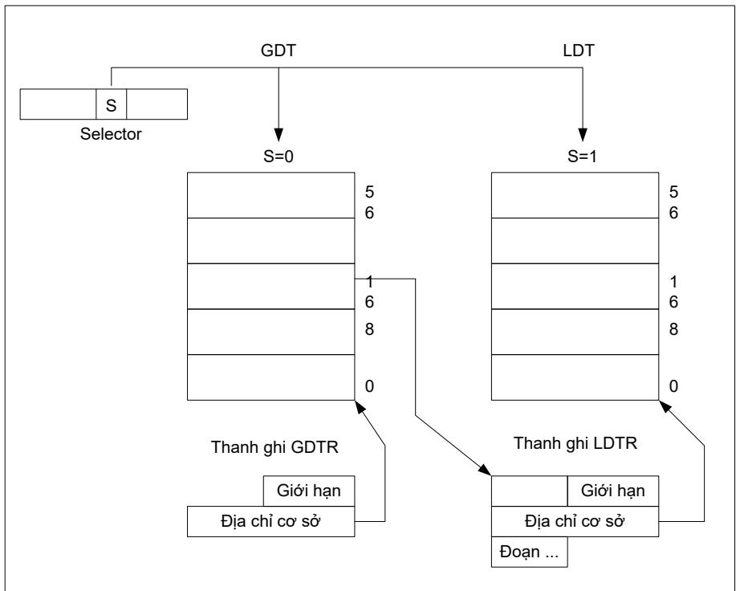

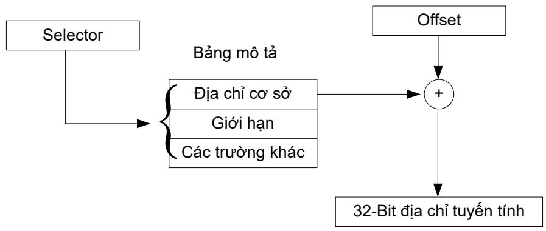

# VIII. QUẢN LÝ BỘ NHỚ TRONG INTEL PENTIUM Phân trang

Hỗ trợ kích thƣớc trang 4KB hoặc 4MB, tùy thuộc vào giá trị cờ kích thƣớc trang

Trang kích thƣớc 4KB: tổ chức bảng trang thành 2 mức

Địa chỉ tuyến tính có kích thƣớc 32 bit

<table><tr><td>p1</td><td>p1</td><td>o</td></tr><tr><td>10 bit</td><td>10 bit</td><td>12 bit</td></tr></table>

P1: cho phép tìm bảng trang mức hai

P2: tìm ô tƣơng ứng trong bảng trang mức 2 kết hợp với độ dịch o tạo ra địa chỉ vật lý

Trang kích thƣớc 4MB: Bảng trang chỉ có một mức

P :10bit O: độ dịch, kích thƣớc 22bit cho phép trỏ tới vị trí cụ thể trong trang nhớ 4MB

# VIII. QUẢN LÝ BỘ NHỚ TRONG INTEL PENTIUM Phân trang

Biến đổi địa chỉ tuyến tính thành địa chỉ vật lý với kích thƣớc trang 4KB Dia chi tuyén tính

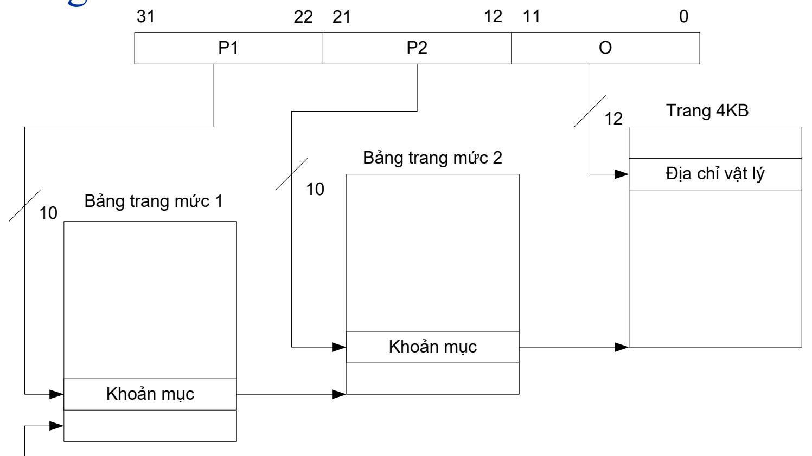

# VIII. QUẢN LÝ BỘ NHỚ TRONG INTEL PENTIUM Ánh xạ địa chỉ

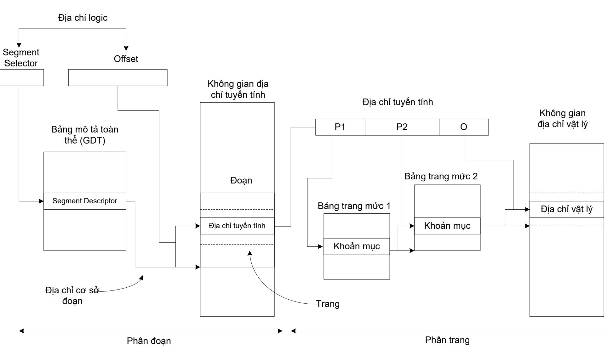

Cho phép tiến trình sử dụng bộ nhớ ảo tới 4GB

2GB đƣợc dùng riêng cho tiến trình

2GB sau đƣợc dùng chung cho hệ thống

Bộ nhớ ảo thực hiện bằng kỹ thuật nạp trang theo nhu cầu và đổi trang

Kích thƣớc trang nhớ 4KB

Tổ chức bảng trang 2 mức

Nạp trang theo cụm: khi xảy ra thiếu trang, nạp cả cụm gồm 1 số trang nằm sau trang bị thiếu

# IX. QUẢN LÝ BỘ NHỚ TRONG WINDOWS XP

Kiểm soát số lƣợng trang: gán cho mỗi tiến trình số lƣợng trang tối đa và tối thiểu

Số lƣợng trang tối đa và tối thiểu cấp cho tiến trình đƣợc thay đổi tùy vào tình trạng bộ nhớ trống

HDH lƣu danh sách khung trống, và sử dụng một ngƣỡng an toàn

Số khung trống ít hơn ngƣỡng: HDH xem xét các tiến trình đang thực hiện.

Tiến trình có số trang lớn hơn số lƣợng tối thiểu sẽ bị giảm số trang cho tới khi đạt tới số lƣợng tối thiểu của mình.

Tùy vào vi xử lý, Windows XP sử dụng thuật toán đổi trang khác nhau

# KIỂM TRA

Bài 1: Kích thƣớc khung bộ nhớ là 4096 bytes. Hãy chuyển địa chỉ logic 8207, 4300 sang địa chỉ vật lý biết rằng bảng trang nhƣ sau:

<table><tr><td rowspan=1 colspan=1>Só</td><td rowspan=2 colspan=1>Sókhung</td></tr><tr><td rowspan=1 colspan=1>trang</td></tr><tr><td rowspan=1 colspan=1>0</td><td rowspan=1 colspan=1>3</td></tr><tr><td rowspan=1 colspan=1>1</td><td rowspan=1 colspan=1>5</td></tr><tr><td rowspan=1 colspan=1>2</td><td rowspan=1 colspan=1></td></tr><tr><td rowspan=1 colspan=1>3</td><td rowspan=1 colspan=1>30</td></tr><tr><td rowspan=1 colspan=1>4</td><td rowspan=1 colspan=1>22</td></tr><tr><td rowspan=1 colspan=1>5</td><td rowspan=1 colspan=1>14</td></tr></table>

Bài 2: Không gian địa chi logic của tiến trình gồm 11 trang, mỗi trang có kích thƣớc 2048B đƣợc ánh xạ vào bộ nhớ vật lý có 20 khung

a. Để biểu diễn địa chỉ logic cần tối thiểu bao nhiêu bit b. Để biểu diễn địa chỉ vật lý cần bao nhiêu bit

# KIỂM TRA

Bài 3: Bộ nhớ vật lý có 4 khung. Thứ tự truy cập các trang là 1, 2, 3, 4, 2, 1, 5, 6, 2, 1, 2, 3, 7, 6, 3, 2, 1, 2, 3, 6. Vẽ sơ đồ cấp phát bộ nhớ và Có bao nhiêu sự kiện thiếu trang xảy ra nếu sử dụng:

Thuật toán tối ƣu   
- FIFO   
- LRU   
- Đồng hồ

Bài 4: Bộ nhớ có kích thƣớc 1MB. Sử dụng phƣơng pháp kề cận (buddy system) để cấp phát cho các tiến trình lần lƣợt với kích thƣớc nhƣ sau: A: 112KB, B: 200KB, C: 150KB, D: 50KB

# HỌC VIỆN CÔNG NGHỆ BƯU CHÍNH VIỄN THÔNG

BÀI GIẢNG MÔN

HỆ ĐIỀU HÀNH

Bộ môn:

# Khoa học máy tính- Khoa CNTT1

# CHƢƠNG 4: QUẢN LÝ TIẾN TRÌNH

1. Các khái niệm liên quan đến tiến trình

2. Luồng (thread)

3 Điều độ tiến trình

4. Đồng bộ hóa các tiến trình đồng thời

5. Tình trạng bế tắc và đói

. CÁC KHÁI NIỆM LIÊN QUAN ĐẾN TIẾN TRÌNH 1. Tiến trình là gì?

Tiến trình là một chương trình đang trong quá trình thực hiện

<table><tr><td rowspan=1 colspan=1>Chuong trình</td><td rowspan=1 colspan=1>Tién trình</td></tr><tr><td rowspan=1 colspan=1>Thuc th tînh</td><td rowspan=1 colspan=1>Thurc thè dng</td></tr><tr><td rowspan=1 colspan=1>Không s hūu tài nguyn cuthě</td><td rowspan=1 colspan=1>Duęc cáp mt só tài nguyênd chúra tién trình và thuchin lnh</td></tr></table>

Tiến trình đƣợc sinh ra khi chƣơng trình đƣợc tải vào bộ nhớ để thực hiện

Tiến trình ngƣời dùng

Tiến trình hệ thống

. CÁC KHÁI NIỆM LIÊN QUAN ĐẾN TIẾN TRÌNH 2. Trạng thái của tiến trình

Phân biệt theo 2 trạng thái: chạy và không chạy

=> Không phản ánh đầy đủ thông tin về trạng thái tiến trình

=> Mô hình 5 trạng thái: mới khởi tạo, sẵn sàng, chạy, chờ đợi, kết thúc

Mới khởi tạo: tiến trình đang đƣợc tạo ra

Sẵn sàng: tiến trình chờ đƣợc cấp CPU để thực hiện lệnh của mình

Chạy: lệnh của tiến trình đƣợc CPU thực hiện

Chờ đợi: tiến trình chờ đợi một sự kiện gì đó xảy ra (blocked)

Kết thúc: tiến trình đã kết thúc việc thực hiện nhƣng vẫn chƣa bị xóa

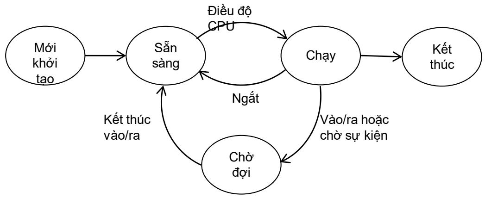

Sơ đồ chuyển đổi trạng thái của tiến trình

# . CÁC KHÁI NIỆM LIÊN QUAN ĐẾN TIẾN TRÌNH 2. Trạng thái của tiến trình

Khởi tạo -> sẵn sàng: tiến trình khởi tạo xong và đã đƣợc tải vào bộ nhớ, chỉ chờ đƣợc cấp Cpu để chạy.

Sẵn sàng -> chạy: do kết quả điều độ CPU của hđh, tiến trình đƣợc HDH cấp phát CPU và chuyển sang trạng thái chạy

Chạy -> sẵn sàng: HĐH cấp phát CPU cho tiến trình khác, do kết quả điều độ/do ngắt xảy ra, tiến trình hiện thời chuyển sang trạng thái sẵn sàng và chờ đƣợc cấp CPU để chạy tiếp.

Chạy -> chờ đợi: Khi tiến trình đó chỉ chạy khi có 1 sự kiện nào đó xảy ra, chuyển sang tt chờ đƣợc phân phối Cpu để chạy tiếp.

Chạy -> end: khi TT đã thực hiện

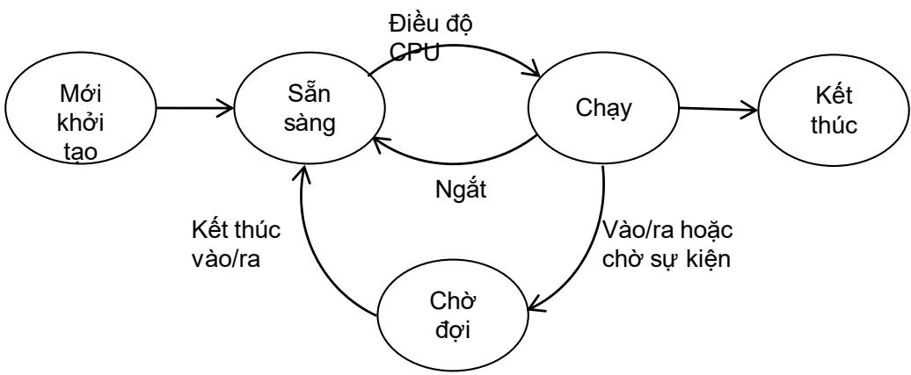

Sơ đồ chuyển đổi trạng thái của tiến trình

. CÁC KHÁI NIỆM LIÊN QUAN ĐẾN TIẾN TRÌNH 3. Thông tin mô tả tiến trình

Để có thể quản lý tiến trình, HĐH cần có các thông tin về tiến trình đó.

Thông tin của tiến trình đƣợc lƣu trong một cấu trúc dữ liệu gọi là khối quản lý tiến trình - PCB (Process Control Block)

Các thông tin chính trong PCB:

Số định danh của tiến trình (PID) Trạng thái tiến trình: một trong năm trạng thái

Nội dung một số thanh ghi CPU:

Thanh ghi con trỏ lệnh: trỏ tới lệnh tiếp theo

Thanh ghi con trỏ ngăn xếp: lƣu tham số/tình trạng hàm khi thực hiện lời gọi hàm/thủ tục của chƣơng trình

Các thanh ghi điều kiện và trạng thái: chứa trạng thái sau khi thực hiện phép toán logic/số học

Các thanh ghi đa năng

. CÁC KHÁI NIỆM LIÊN QUAN ĐẾN TIẾN TRÌNH 3. Thông tin mô tả tiến trình

Lý do phải lƣu lại các thanh ghi này trong PCB là do tiến trình có thể bị chuyển khỏi trạng thái chạy để nhƣờng chỗ cho tiến trình khác. Khi tiến trình quay trời lại, HĐH sẽ dùng thông tin từ PCB để khôi phục lại nội dung các thanh ghi, cho phép tiến trình thực hiện lại từ trạng tháitrƣớc lúc dừng.

# PCB:

Thông tin phục vụ điều độ tiến trình: mức độ ƣu tiên của tiến trình, vị trí trong hàng đợi, …

Thông tin về bộ nhớ của tiến trình

Danh sách các tài nguyên khác: các file đang mở, thiết bị vào ra mà tiến trình sử dụng

Thông tin thống kê phục vụ quản lý: thời gian sử dụng CPU, giới hạn thời gian

. CÁC KHÁI NIỆM LIÊN QUAN ĐẾN TIẾN TRÌNH 4. Bảng và danh sách tiến trình

Để quản lý, HĐH cần biết vị trí các PCB. HĐH sử dụng bảng tiến trình chứa con trỏ tới PCB của toàn bộ tiến trình có trong hệ thống

Ngoài ra, PCB của các tiến trình cùng trạng thái hoặc cùng chờ 1 tài nguyên nào đó đƣợc liên kết thành 1 danh sách, mỗi danh sách gồm một số tiến trình cùng trạng thái.

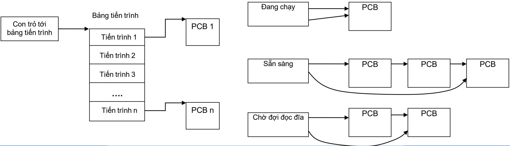

. CÁC KHÁI NIỆM LIÊN QUAN ĐẾN TIẾN TRÌNH 3. Các thao tác với tiến trình

Hoạt động quản lý tiến trình bao gồm một số công việc nhƣ tạo mới, kết thúc tiến trình, chuyển đổi giữa các tiến trình, điều độ, đồng bộ hóa, đảm bảo việc liên lạc giữa các tiến trình.

Tạo mới tiến trình:

Để tạo ra một tiến trình mới, HDH thực hiện một số bƣớc nhƣ sau:

Gán số định danh cho tiến trình đƣợc tạo mới và tạo một ô trong bảng tiến trình

Tạo không gian nhớ cho tiến trình và PCB

Khởi tạo PCB

Liên kết PCB của tiến trình vào các danh sách quản lý

# . CÁC KHÁI NIỆM LIÊN QUAN ĐẾN TIẾN TRÌNH 3. Các thao tác với tiến trình

# 2. Kết thúc tiến trình:

Kết thúc bình thƣờng: yêu cầu HDH kết thúc mình bằng cách gọi lời gọi hệ thống exit()

Bị kết thúc:

Bị tiến trình cha kết thúc

Do các lỗi

Yêu cầu nhiều bộ nhớ hơn so với số lƣơng hệ thống có thể cung cấp

Thực hiện lâu hơn thời gian giới hạn

Do quản trị hệ thống hoặc hệ điều hành kết thúc

# . CÁC KHÁI NIỆM LIÊN QUAN ĐẾN TIẾN TRÌNH 3. Các thao tác với tiến trình

3. Chuyển đổi giữa các tiến trình:

Trong quá trình thực hiện, CPU có thể đƣợc chuyển tử tiến trình hiện thời sang thực hiện tiến trình khác.

Thông tin về tiến trình hiện thời (chứa trong PCB) đƣợc gọi là ngữ cảnh (context) của tiến trình. Việc chuyển giữa tiến trình còn đƣợc gọi là chuyển đổi ngữ cảnh

Việc chuyển đổi tiến trình xảy ra khi:

Có ngắt: ngắt do đồng hồ/ngắt vào/ra

Tiến trình gọi lời gọi hệ thống

Trƣớc khi chuyển sang thực hiện tiến trình khác, ngữ cảnh đƣợc lƣu vào PCB

Khi đƣợc cấp phát CPU thực hiện trở lại, ngữ cảnh đƣợc khôi phục từ PCB vào các thanh ghi và bảng tƣơng ứng.

# . CÁC KHÁI NIỆM LIÊN QUAN ĐẾN TIẾN TRÌNH 3. Các thao tác với tiến trình

3. Chuyển đổi giữa các tiến trình:

Thông tin nào phải đƣợc cập nhật và lƣu vào PCB khi chuyển tiến trình? => Tùy từng trƣờng hợp:

TH đơn giản: Hệ thống chuyển sang thực hiện ngắt vào/ra rồi quay lại thực hiện tiếp tiến trình:

Ngữ cảnh gồm thông tin có thể bị hàm xử lý ngắt thay đổi

 => nội dung thanh ghi, trạng thái CPU

. CÁC KHÁI NIỆM LIÊN QUAN ĐẾN TIẾN TRÌNH 3. Các thao tác với tiến trình

TH phức tạp: Sau khi thực hiện ngắt, hệ thống thực hiện tiến trình khác

Thay đổi trạng thái tiến trình

Cập nhật thông tin thống kê trong PCB

Chuyển liên kết PCB của tiến trình vào danh sách ứng với trạng thái mới

Cập nhật PCB của tiến trình mới đƣợc chọn

Cập nhật nội dung thanh ghi và trạng thái CPU

=> Chuyển đổi tiến trình đòi hỏi thời gian

# II. LUỒNG THỰC HIỆN (THREAD/ dòng) 1. Khái niệm

Tiến trình đƣợc xem xét từ 2 khía cạnh:

Tiến trình là 1 đơn vị sở hữu tài nguyên

Tiến trình là 1 đơn vị thực hiện công việc tính toán xử lý

Các HDH trƣớc đây: mỗi tiến trình chỉ tƣơng ứng với 1 đơn vị xử lý duy nhất

=> Tiến trình không thể thực hiện nhiều hơn một công việc cùng một lúc

# II. LUỒNG THỰC HIỆN 1. Khái niệm (tt)

HDH hiện đại: cho phép tách riêng vai trò thực hiện lệnh của tiến trình

Mỗi đơn vị thực hiện lệnh của tiến trình, tức là 1 chuỗi lệnh được cấp phát CPU để thực hiện độc lập được gọi là một luồng thực hiện

HDH hiện nay thƣờng hỗ trợ đa luồng (multithreading) => cho phép nhiều chuỗi lệnh đƣợc thực hiện cùng một lúc

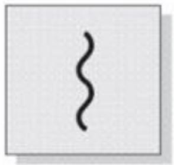  
tién trinh göm môt luông

  
tién trinh gòm nhièu luông

II. LUỒNG THỰC HIỆN 2. Tài nguyên của tiến trình và luồng

Trong hệ thống cho phép đa luồng, tiến trình vẫn là 1 đơn vị để HDH phân phối tài nguyên

Mỗi tiến trình sở hữu chung một số tài nguyên:

Không gian nhớ của tiến trình (logic): chứa chƣơng trình (các lệnh), phần dữ liệu cuả tiến trình.

Các tài nguyên khác: các file đang mở, thiết bị hoặc cổng vào/ra

# II. LUỒNG THỰC HIỆN 2. Tài nguyên của tiến trình và luồng (tt)

Đến đây, có sự khác biệt giữa tiến trình đơn luồng và tiến trình đa luồng.

Mô hình đơn luồng:

Tiến trình có khối quản lý PCB chứa đầy đủ thông tin trạng thái tiến trình, giá trị thanh ghi

Ngăn xếp chứa tham số, trạng thái hàm/ thủ tục/ chƣơng trình con

Khi tiến trình thực hiện, nó sẽ làm chủ nội dung các thanh ghi và con trỏ lệnh

# Mô hình đa luồng:

Mỗi luồng cần có khả năng quản lý con trỏ lệnh, nội dung thanh ghi

Luồng cũng có trạng thái riêng

=> chứa trong khối quản lý luồng

Luồng cũng cần có ngăn xếp riêng

Tất cả các luồng của 1 tiến trình chia sẻ không gian nhớ và tài nguyên

Các luồng có cùng không gian địa chỉ và có thể truy cập tới dữ liệu của tiến trình

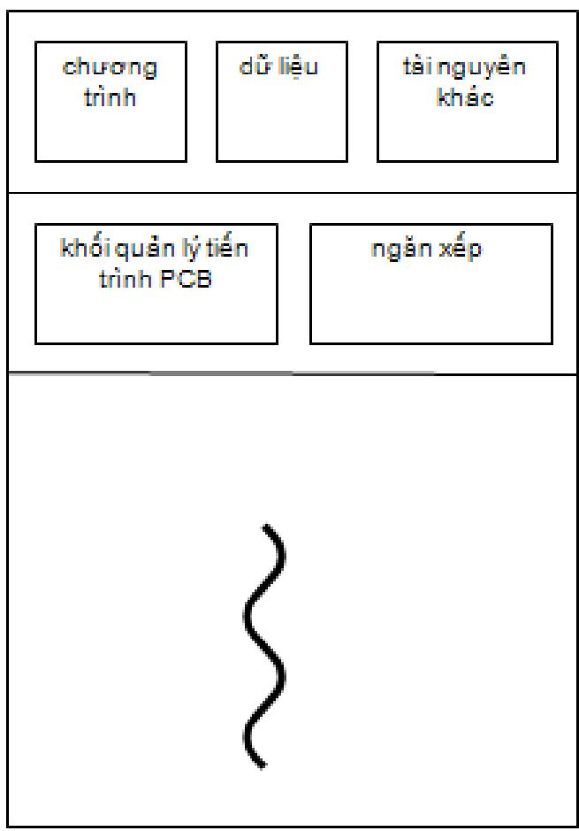

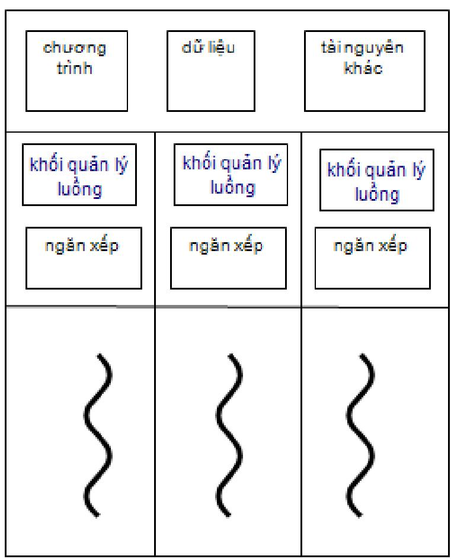  
Tién trinh nhiu luông

II. LUỒNG THỰC HIỆN 3. Ưu điểm của mô hình đa luồng

Tăng hiệu năng và tiết kiệm thời gian

Dễ dàng chia sẻ tài nguyên và thông tin

Tăng tính đáp ứng

Tận dụng đƣợc kiến trúc xử lý với nhiều CPU

Thuận lợi cho việc tổ chức chƣơng trình

Có thể tạo và quản lý luồng ở 2 mức:

Mức ngƣời dùng

Mức nhân

Luồng mức ngƣời dùng: đƣợc tạo ra và quản lý không có sự hỗ trợ của HDH

Luồng mức nhân: đƣợc tạo ra và quản lý bởi HDH

# II. LUỒNG THỰC HIỆN 4.1. Luồng mức người dùng

Do trình ứng dụng tự tạo ra và quản lý

HĐH không biết về sự tồn tại của những dòng nhƣ vậy

Sử dụng thƣ viện do ngôn ngữ lập trình cung cấp

HDH vẫn coi tiến trình nhƣ một đơn vị duy nhất với một trạng thái duy nhất

Việc phân phối CPU đƣợc thực hiện cho cả tiến trình

II. LUỒNG THỰC HIỆN 4.1. luồng mức người dùng (tt)

# Ƣu điểm:

Việc chuyển đổi luồng không đòi hỏi chuyển sang chế độ nhân => tiết kiệm thời gian

Trình ứng dụng có thể điều độ theo đặc điểm riêng của mình, không phụ thuộc vào cách điều độ của HDH

■ Có thể sử dụng trên cả những HDH không hỗ trợ đa luồng

# Nhƣợc điểm:

Khi một luồng gọi lời gọi hệ thống và bị phong tỏa thì toàn bộ tiến trình bị phong tỏa

=> không cho phép tận dụng ƣu điểm về tính đáp ứng của mô hình đa luồng

Không cho phép tận dụng kiến trúc nhiều CPU do HĐH phân phối CPU cho cả tiến trình chứ không phải từng dòng cụ thể

Luồng mức nhân đƣợc HĐH tạo ra và quản lý

HĐH cung cấp giao diện lập trình: gồm các lời gọi hệ thống mà trình ứng dụng có thể yêu cầu tạo/ xóa luồng và thay đổi tham số liên quan quản lý dòng

Tăng tính đáp ứng và khả năng thực hiện đồng thời của các luồng trong cùng tiến trình

Tạo và chuyển đổi luồng thực hiện trong chế độ nhân => tốc độ chậm

HĐH Windows và Linux hỗ trợ luồng mức nhân

Có thể sử dụng dòng mức ngƣời dùng và dòng mức nhân

Theo các tổ chức này:

Luồng mức ngƣời dùng đƣợc tạo ra trong chế độ ngƣời dùng nhờ thƣ viện cuả trình ứng dụng

Luồng mức ngƣời dùng đƣợc ánh xạ lên số lƣợng tƣơng ứng hoặc ít hơn các luồng mức nhân

Số lƣợng dòng mức nhân phụ thuộc vào hệ thống cụ thể, chẳng hạn hệ thống nhiều CPU sẽ có nhiều dòng mức nhân hơn.

# II. DÒNG THỰC HIỆN

4.3. kết hợp Dòng mức nhân và mức người dùng

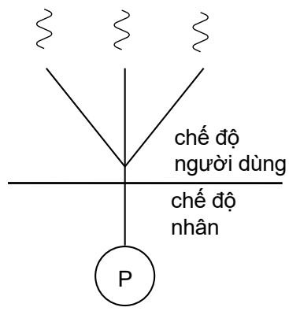

a) Mô hình mức người dùng

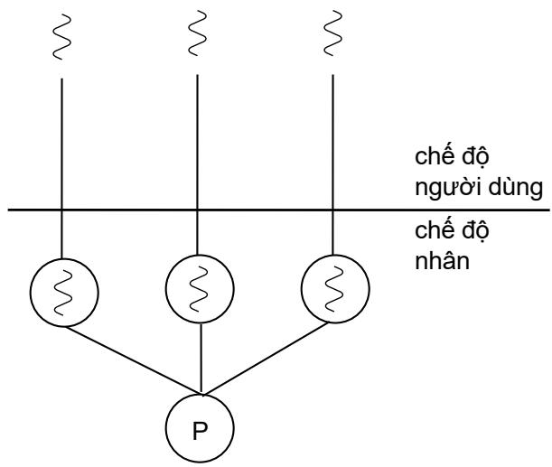  
b) Mô hình mức nhân

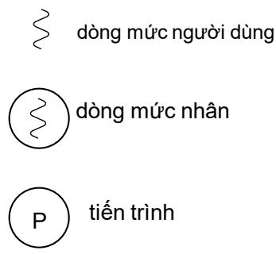

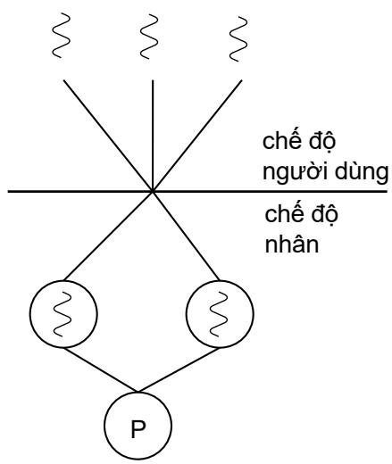  
c) Mô hình kết hợp

Trong hệ thống cho phép đa chương trình, nhiều tiến trình có thể tồn tại và thực hiện cùng lúc.

Kỹ thuật đa chương trình có nhiều ưu điểm do cho cho phép sử dụng CPU hiệu quả, đáp ứng nhu cầu tính toán của người dùng

Tuy nhiên, đặt ra nhiều vấn đề phức tạp hơn đối với HĐH

Điều độ (scheduling) hay lập lịch là quyết định tiến trình nào đƣợc sử dụng tài nguyên phần cứng khi nào, trong thời gian bao lâu

Tập trung vào vấn đề điều độ đối với CPU

=> Quyết định thứ tự và thời gian sử dụng CPU

Điều độ tiến trình và điều độ dòng:

Hệ thống trƣớc kia: tiến trình là đơn vị thực hiện chính => điều độ thực hiện với tiến trình

Hệ thống hỗ trợ luồng: luồng mức nhân là đơn vị thực hiện đƣợc HDH cấp CPU chứ không phải tiến trình.

=> Sử dụng thuật ngữ điều độ tiến trình rộng rãi  điều độ luồng

# Điều độ dài hạn và ngắn hạn

Điều độ dài hạn:

Thực hiện khi mới tạo ra tiến trình

HDH quyết định tiến trình có đƣợc thêm vào danh sách đang hoạt động?

Nếu đƣợc chấp nhận, hệ thống sẽ có thêm tiến trình mới. Ngƣợc lại, chờ tới thời điểm khác để tạo và thực hiện

Ảnh hƣởng tới mức độ đa chƣơng trình

Điều độ trung hạn:

Quyết định tiến trình có đƣợc cấp

MEM để thực hiện?

Điều độ ngắn hạn:

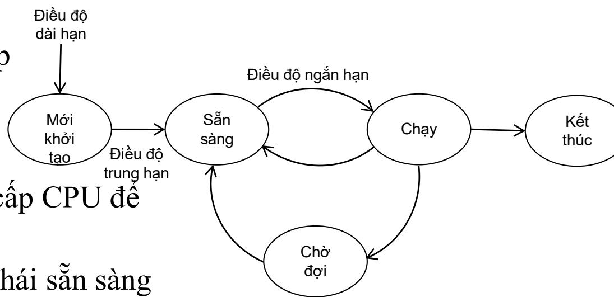

 Quyết định tiến trình nào đƣợc cấp CPU để thực hiện

Thực hiện với tiến trình ở trạng thái sẵn sàng

III. ĐIỀU ĐỘ TIẾN TRÌNH

2. Các dạng điều độ (tt)

2. Điều độ có phân phối lại và không phân phối lại:

Điều độ có phân phối lại (preemptive):

 HDH có thể sử dụng cơ chế ngắt để thu hồi CPU của một tiến trình đang trong trạng thái chạy

Điều độ không phân phối lại (nonpreemptive):

 Tiến trình đang ở trạng thái chạy sẽ đƣợc sử dụng CPU cho đến khi xảy ra một trong các tình huống sau:

Tiến trình kết thúc

Tiến trình phải chuyển sang trạng thái chờ đợi do thực hiện I/O

=> Điều độ hợp tác: chỉ thực hiện đƣợc khi tiến trình hợp tác và nhƣờng CPU

Nếu tiến trình không hợp tác, dùng CPU vô hạn => các tiến trình khác không đƣợc cấp CPU (Windows 96, NT)

# 2. Điều độ có phân phối lại:

So với điều độ không phân phối lại, điều độ có phân phối lại có nhiều ƣu điểm hơn.

HDH chủ động hơn, không phụ thuộc vào hoạt động của tiến trình

Đảm bảo chia sẻ thời gian thực sự

Đòi hỏi phần cứng có bộ định thời gian và một số hỗ trợ khác

Vấn đề quản lý tiến trình phức tạp hơn

III. ĐIỀU ĐỘ TIẾN TRÌNH

3. Các tiêu chí điều độ

Một số tiêu chí thƣờng đƣợc sử dụng:

1. Lƣợng tiến trình đƣợc thực hiện xong:

Số lƣợng tiến trình thực hiện xong trong 1 đơn vị thời gian

Đo tính hiệu quả của hệ thống

Hiệu suất sử dụng CPU

Cố gắng để CPU càng ít phải nghỉ càng tốt

3. Thời gian vòng đời trung bình của tiến trình:

Từ lúc có yêu cầu tạo tiến trình đến khi kết thúc

Thời gian chờ đợi:

Tổng thời gian tiến trình nằm trong trạng thái sẵn sàng và chờ cấp CPU

Ảnh hƣởng trực tiếp của thuật toán điều độ tiến trình

# Thời gian đáp ứng

Đây là tiêu chí hƣớng tới ngƣời dùng và thƣờng đƣợc sử dụng trong hệ thống tƣơng tác trực tiếp.

6. Tính dự đoán đƣợc:

Vòng đời, thời gian chờ đợi, thời gian đáp ứng phải ổn định, không phụ thuộc vào tải của hệ thống

Tính công bằng

Các tiến trình cùng độ ƣu tiên phải đƣợc đối xử nhƣ nhau

III. ĐIỀU ĐỘ TIẾN TRÌNH

4. Các thuật toán điều độ

1. Thuật toán đến trƣớc phục vụ trƣớc (FCFS):

Tiến trình yêu cầu CPU trƣớc sẽ đƣợc cấp trƣớc

HDH xếp các tiến trình sẵn sàng vào hàng đợi FIFO

Tiến trình mới đƣợc xếp vào cuối hàng đợi

Đơn giản, đảm bảo tính công bằng

Thời gian chờ đợi trung bình lớn => Ảnh hƣởng lớn tới hiệu suất chung của toàn hệ thống

Thƣờng là thuật toán điều độ không phân phối lại, sau khi tiến trình đƣợc cấp CPU, tiến trình đó sẽ sử dụng CPU đến khi kết thúc hoặc phải dừng lại để chờ kết quả vào ra.

1. Thuật toán đến trƣớc phục vụ trƣớc (FCFS):

Cho 3 tiến trình với thứ tự xuất hiện và độ dài chu kỳ CPU nhƣ sau:

Tién trinh Dô dài chu ky CPU

P1 10   
P2 4   
P3 2

Két quà diěu dô theo thuât toán FCFS thě hin trên hinh sau:

<table><tr><td></td><td colspan="2">10 14</td></tr><tr><td>10</td><td>4</td><td>2</td></tr><tr><td>P1</td><td>P2</td><td>P3</td></tr></table>

Thōi gian chò dgi cūa P1, P2, P3 làn lugt là 0, 10, và 14.

Thōi gian chò dgi trung binh = (0 + 10 + 14)/3 = 8.

III. ĐIỀU ĐỘ TIẾN TRÌNH

4. Các thuật toán điều độ (tt)

# 2. Điều độ quay vòng (RR: round robin):

Sửa đổi FCFS dùng cho các hệ chia sẻ thời gian

Có thêm cơ chế phân phối lại bằng cách sử dụng ngắt của đồng hồ

Hệ thống xác định những khoảng thời gian nhỏ gọi là lượng tử/ lát cắt thời gian t

Khi CPU đƣợc giải phóng, HDH đặt thời gian của đồng hồ bằng độ dài lƣợng tử, lấy tiến trình ở đầu hàng đợi và cấp CPU cho nó

Tiến trình kết thúc trƣớc khi hết thời gian t: trả quyền điều khiển cho HDH

# 2. Điều độ quay vòng (tt)

Hết lƣợng tử thời gian mà tiến trình chƣa kết thúc:

Đồng hồ sinh ngắt

Tiến trình đang thực hiện bị dừng lại

Quyền điều khiển chuyển cho hàm xử lý ngắt của HDH

HDH chuyển tiến trình về cuối hàng đợi, lấy tiến trình ở đầu và tiếp tục

Cải thiện thời gian đáp ứng so với FCFS

Thời gian chờ đợi trung bình vẫn dài

Lựa chọn độ dài lƣợng tử thời gian?

# 2. Điều độ quay vòng (tt)

<table><tr><td colspan="2">2</td><td colspan="2">4 6</td><td colspan="2">8</td><td colspan="2">10  12  14</td></tr><tr><td>2</td><td>2</td><td>2</td><td>2</td><td>2</td><td>2</td><td>2</td><td>2</td></tr><tr><td></td><td></td><td></td><td></td><td>P1  P2 P3 P1 P2 P1 P1 P1</td><td></td><td></td><td></td></tr></table>

Thòi gian chò dgi cua P1, P2, P3 làn lugt là 6, 6, và 4.

Thòi gian chò dgi trung bình = (6 + 6 + 4)/3=5,33.

III. ĐIỀU ĐỘ TIẾN TRÌNH

4. Các thuật toán điều độ (TT)

3. Điều độ ƣu tiên tiến trình ngắn nhất (SPF)

 Chọn trong hàng đợi tiến trình có chu kỳ sử dụng CPU tiếp theo ngắn nhất để phân phối CPU

Nếu có nhiều tiến trình với chu kỳ CPU tiếp theo bằng nhau, chọn tiến trình đứng trƣớc

Thời gian chờ đợi trung bình nhỏ hơn nhiều so với FCFS

Khó thực hiện vì phải biết độ dài chu kỳ CPU tiếp:

 Trong các hệ thống xử lý theo mẻ: dựa vào thời gian đăng kí tối đa do lập trình viên cung cấp

Dự đoán độ dài chu kỳ CPU tiếp theo: dựa trên độ dài TB các chu kỳ CPU trƣớc đó

Không có phân phối lại

3. Điều độ ƣu tiên tiến trình ngắn nhất (SPF)

<table><tr><td colspan="2">2</td><td>6</td></tr><tr><td>2</td><td>4</td><td>10</td></tr><tr><td>P3</td><td>P2</td><td>P1</td></tr></table>

Thòi gian chò dgi trung bình = (6 + 2 +0)/3 = 2,67.

III. ĐIỀU ĐỘ TIẾN TRÌNH

4. Các thuật toán điều độ (tt)

# 4. Điều độ ƣu tiên thời gian còn lại ngắn nhất

SPF có thêm cơ chế phân phối lại (SRTF)

Khi 1 tiến trình mới xuất hiện trong hàng đợi, HDH so sánh thời gian còn lại của tiến trình đang chạy với thời gian còn lại của tiến trình mới xuất hiện

Nếu tiến trình mới xuất hiện có thời gian còn lại ngắn hơn, HDH thu hồi CPU của tiến trình đang chạy, phân phối cho tiến trình mới

Thời gian chờ đợi trung bình nhỏ

HDH phải dự đoán độ dài chu kỳ CPU của tiến trình

Việc chuyển đổi tiến trình ít hơn so với RR

III. ĐIỀU ĐỘ TIẾN TRÌNH 4. Các thuật toán điều độ (tt)

# 4. Điều độ ƣu tiên thời gian còn lại ngắn nhất (SRTF)

Tién trinh Thōi dim xuåt hin Dô dài chu ky CPU

P1 0 8

P2 0 7

P3 2 2

Két quà diu dô sù dung SRTF dugc thé hin trên biu dò sau:

<table><tr><td>0</td><td>2 6</td><td></td><td>11</td></tr><tr><td>2</td><td>4</td><td>5</td><td>8</td></tr><tr><td>P2</td><td>P3</td><td>P2</td><td>P1</td></tr></table>

# 5. Điều độ có mức ƣu tiên

Mỗi tiến trình có 1 mức ƣu tiên

Tiến trình có mức ƣu tiên cao hơn sẽ đƣợc cấp CPU trƣớc

Các tiến trình có mức ƣu tiên bằng nhau đƣợc điều độ theo FCFS

Mức ƣu tiên đƣợc xác định theo nhiều tiêu chí khác nhau

# 5. Điều độ có mức ƣu tiên

Tién trình Múc uu tiên

P1 4   
P2 1   
P3 3

# V. ĐỒNG BỘ HÓA CÁC TIẾN TRÌNH ĐỒNG THỜI

Những tiến trình cùng tồn tại đƣợc gọi là tiến trình đồng thời /tiến trình tương tranh

Quản lý tiến trình đồng thời là vấn đề quan trọng:

 Liên lạc giữa các tiến trình   
 Cạnh tranh và chia sẻ tài nguyên   
Phối hợp và đồng bộ hóa các tiến trình   
 Vấn đề bế tắc   
 Đói tài nguyên (starvation)

V. ĐỒNG BỘ HÓA CÁC TIẾN TRÌNH ĐỒNG THỜI 1. Các vấn đề đối với tiến trình đồng thời

1. Tiến trình cạnh tranh tài nguyên với nhau:

Đảm bảo loại trừ tương hỗ (mutual exclusion):

 Khi các tiến trình cùng truy nhập tài nguyên mà khả năng chia sẻ của tài nguyên đó là có hạn

=> phải đảm bảo tiến trình này đang truy cập tài nguyên thì tiến trình khác không đƣợc truy cập

Tài nguyên đó gọi là tài nguyên nguy hiểm. Đoạn chƣơng trìn có yêu cầu sử dụng tài nguyên nguy hiểm gọi là đoạn nguy hiểm (critical section)

Mỗi thời điểm chỉ có 1 tiến trình nằm trong đoạn nguy hiểm => loại trừ lẫn nhau

V. ĐỒNG BỘ HÓA CÁC TIẾN TRÌNH ĐỒNG THỜI 1. Các vấn đề đối với tiến trình đồng thời (tt)

1. Tiến trình cạnh tranh tài nguyên với nhau (tt):

Không để xảy ra bế tắc (deadlock):

 Bế tắc: tình trạng hai hoặc nhiều tiến trình không thể thực hiện tiếp do chờ đợi lẫn nhau

Không để đói tài nguyên (starvation):

Tình trạng chờ đợi quá lâu mà không đến lƣợt sử dụng tài nguyên

V. ĐỒNG BỘ HÓA CÁC TIẾN TRÌNH ĐỒNG THỜI 1. Các vấn đề đối với tiến trình đồng thời (tt)

2. Tiến trình hợp tác với nhau qua tài nguyên chung:

Có thể trao đổi thông tin bằng cách chia sẻ vùng nhớ dùng chung (biến toàn thể)

■ Đòi hỏi đảm bảo loại trừ tƣơng hỗ

Xuất hiện tình trạng bế tắc và đói

Yêu cầu đảm bảo tính nhất quán dữ liệu

Điều kiện chạy đua (race condition): tình huống mà một số dòng /tiến trình đọc, ghi dữ liệu sử dụng chung và kết quả phụ thuộc vào thứ tự các thao tác đọc, ghi

=> Đặt thao tác truy cập và cập nhật dữ liệu dùng chung vào đoạn nguy hiểm

# IV. ĐỒNG BỘ HÓA CÁC TIẾN TRÌNH ĐỒNG THỜI 1. Các vấn đề đối với tiến trình đồng thời (tt)

3. Tiến trình có liên lạc nhờ gửi thông điệp:

 Có thể trao đổi thông tin trực tiếp với nhau bằng cách gửi thông điệp (message passing)

 Không có yêu cầu loại trừ tƣơng hỗ

Có thể xuất hiện bế tắc và đói

V. ĐỒNG BỘ HÓA CÁC TIẾN TRÌNH ĐỒNG THỜI 2. Yêu cầu với giải pháp cho đoạn nguy hiểm

Loại trừ tƣơng hỗ

Tiến triển

Chờ đợi có giới hạn

Các giả thiết:

Giải pháp không phụ thuộc vào tốc độ của các tiến trình

Không tiến trình nào đƣợc phép nằm quá lâu trong đoạn nguy hiểm

Thao tác đọc và ghi bộ nhớ là thao tác nguyên tử (atomic) và không thể bị xen ngang giữa chừng

V. ĐỒNG BỘ HÓA CÁC TIẾN TRÌNH ĐỒNG THỜI 2. Yêu cầu với giải pháp cho đoạn nguy hiểm

Các giải pháp đƣợc chia thành 3 nhóm chính:

Nhóm giải pháp phần mềm

Nhóm giải pháp phần cứng

Nhóm sử dụng hỗ trợ của HDH hoặc thƣ viện ngôn ngữ lập trình

# V. ĐỒNG BỘ HÓA CÁC TIẾN TRÌNH ĐỒNG THỜI 3. Giải thuật peterson

Giải pháp thuộc nhóm phần mềm

Đề xuất ban đầu cho đồng bộ 2 tiến trình

P0 và P1 thực hiện đồng thời với một tài nguyên chung và một đoạn nguy hiểm chung

Mỗi tiến trình thực hiện vô hạn và xen kẽ giữa đoạn nguy hiểm với phần còn lại của tiến trình

Yêu cầu 2 tiến trình trao đổi thông tin qua 2 biến chung:

Turn: xác định đến lƣợt tiến trình nào đƣợc vào đoạn nguy hiểm

Cờ cho mỗi tiến trình: flag[i]=true nếu tiến trình thứ i yêu cầu đƣợc vào đoạn nguy hiểm

# V. ĐỒNG BỘ HÓA CÁC TIẾN TRÌNH ĐỒNG THỜI 3. Giải thuật peterson (tt)

bool flag[2]; int turn;

Void P0() { for(;;) { //lặp vô hạn flag[0] = true; turn = 1; while(flag[1] && turn ==1) ;   
//lặp đến khi điều kiện không thỏa <đoạn nguy hiểm> flag[0] = false; <phần còn lại của tiến trình> }   
Void P1() { for(;;) { //lặp vô hạn flag[1] = true; turn = 0; while(flag[0] && turn ==0) ;   
//lặp đến khi điều kiện không thỏa <đoạn nguy hiểm> flag[1] = false; <phần còn lại của tiến trình> }   
}   
Void main() { flag[0] = flag[1] = false; turn =0;   
//tắt tiến trình chính, chạy đồng thời 2 tiến trình P0 và P1 startProcess (P0); startProcess(P1);

BỘ MÔN: KHOA HỌC MÁY TÍNH – KHOA CNTT1

# V. ĐỒNG BỘ HÓA CÁC TIẾN TRÌNH ĐỒNG THỜI

3. Giải thuật peterson (tt)

Thỏa mãn các yêu cầu:

Điều kiện loại trừ tƣơng hỗ

Điều kiện tiến triển:

P0 chỉ có thể bị P1 ngăn cản vào đoạn nguy hiểm nếu flag[1] = true và turn =1 luôn đúng

Có 2 khả năng với P1 ở ngoài đoạn nguy hiểm:

P1 chƣa sẵn sàng vào đoạn nguy hiểm => flag[1] = false, P0 có thể vào ngay đoạn nguy hiểm

P1 đã đặt flag[1]=true và đang trong vòng lặp while => turn = 1 hoặc 0

Turn = 0: P0 vào đoạn nguy hiểm ngay

Turn = 1: P1 vào đoạn nguy hiểm, sau đó đặt flag[1] = false => quay lại khả năng 1

Chờ đợi có giới hạn

# V. ĐỒNG BỘ HÓA CÁC TIẾN TRÌNH ĐỒNG THỜI 3. Giải thuật peterson (tt)

Sử dụng trên thực tế tƣơng đối phức tạp

Đòi hỏi tiến trình đang yêu cầu vào đoạn nguy hiểm phải nằm trong trạng thái chờ đợi tích cực

Chờ đợi tích cực: tiến trình vẫn phải sử dụng CPU để kiểm tra xem có thể vào đoạn nguy hiểm?

=> Lãng phí CPU

# V. ĐỒNG BỘ HÓA CÁC TIẾN TRÌNH ĐỒNG THỜI 4. Giải pháp phần cứng

# Cấm các ngắt:

Tiến trình đang có CPU: thực hiện cho đến khi tiến trình đó gọi dịch vụ hệ điều hành hoặc bị ngắt

=> cấm không để xẩy ra ngắt trong thời gian tiến trình đang ở trong đoạn nguy hiểm để truy cập tài nguyên

Đảm bảo tiến trình đƣợc thực hiện trọn vẹn đoạn nguy hiểm và không bị tiến trình khác chen vào

Đơn giản

Giảm tính mềm dẻo của HDH

Không áp dụng với máy tính nhiều CPU

# IV. ĐỒNG BỘ HÓA CÁC TIẾN TRÌNH ĐỒNG THỜI 4. Giải pháp phần cứng (tt)

# 2. Sử dụng lệnh máy đặc biệt:

Phần cứng đƣợc thiết kế có một số lệnh máy đặc biệt 2 thao tác kiểm tra và thay đổi giá trị cho một biến, hoặc các thao tác so sánh và hoán đổi giá trị hai biến, đƣợc thực hiện trong cùng một lệnh máy

=> Đảm bảo đƣợc thực hiện cùng nhau mà không bị xen vào giữa – thao tác nguyên tử (atomic)

Gọi là lệnh “kiểm tra và xác lập” – Test_and_Set

# IV. ĐỒNG BỘ HÓA CÁC TIẾN TRÌNH ĐỒNG THỜI 4. Giải pháp phần cứng (tt)

2. Sử dụng lệnh máy đặc biệt (tt):

Logic của lệnh Test_and_Set:

Bool Test_and_Set(bool & val) {

bool temp = val;   
val = true;   
return temp;

# V. ĐỒNG BỘ HÓA CÁC TIẾN TRÌNH ĐỒNG THỜI 4. Giải pháp phần cứng (tt)

# 2. Sử dụng lệnh máy đặc biệt (tt):

const int n; //n là số lượng tiến trình   
bool lock;   
void P(int i){ //tiến trình P(i) for(;;){ //lặp vô hạn while(Test_and_Set(lock));//lặp đến khi điều kiện không thỏa <Đoạn nguy hiểm> lock = false; <Phần còn lại của tiến trình> }   
void main(){ lock = false;   
//tắt tiến trình chính, chạy đồng thời n tiến trình StartProcess(P(1)); …. StartProcess(P(n));   
}

# V. ĐỒNG BỘ HÓA CÁC TIẾN TRÌNH ĐỒNG THỜI 4. Giải pháp phần cứng (tt)

2. Sử dụng lệnh máy đặc biệt (tt):

Ƣu điểm:

Việc sử dụng tƣơng đối đơn giản và trực quan

Có thể dùng để đồng bộ nhiều tiến trình

Có thể sử dụng cho trƣờng hợp đa xử lý với nhiều CPU nhƣng có bộ nhớ chung

Nhƣợc điểm:

Chờ đợi tích cực

Có thể gây đói

# V. ĐỒNG BỘ HÓA CÁC TIẾN TRÌNH ĐỒNG THỜI 5. Cờ hiệu

Cờ hiệu S là 1biến nguyên đƣợc khởi tạo bằng khả năng phục vụ đồng thời của tài nguyên

Giá trị của S chỉ có thể thay đổi nhờ gọi 2 thao tác là Wait và Signal

Wait(S):

Giảm S đi 1 đơn vị Nếu giá trị của S<0 thì tiến trình gọi wait(S) sẽ bị phong tỏa

Signal(S):

Tăng S lên 1 đơn vị

Nếu giá trị của S≤0: 1 trong các tiến trình đang bị phong tỏa đƣợc giải phóng và có thể thực hiện tiếp

# V. ĐỒNG BỘ HÓA CÁC TIẾN TRÌNH ĐỒNG THỜI 5. Cờ hiệu (tt)

Wait và Signal là những thao tác nguyên tử

Để tránh tình trạng chờ đợi tích cực, sử dụng 2 thao tác phong tỏa và đánh thức:

Nếu tiến trình thực hiện thao tác wait, giá trị cờ hiệu âm thì thay vì chờ đợi tích cực nó sẽ bị phong tỏa ( bởi thao tác block) và thêm vào hàng đợi của cờ hiệu

Khi có 1 tiến trình thực hiện thao tác signal thì 1 trong các tiến trình bị khóa sẽ đƣợc chuyển sang trạng thái sẵn sàng nhờ thao tác đánh thức (wakeup) chứa trong signal

# ỒNG BỘ HÓA CÁC TIẾN TRÌNH ĐỒNG THỜI 5. Cờ hiệu (tt)

<table><tr><td>struct semaphore {</td></tr><tr><td>int value;</td></tr><tr><td></td></tr><tr><td>process *queue;//danh sách chúra các tién trình bi phong tōa</td></tr><tr><td></td></tr><tr><td>}; void Wait(semaphore&amp; S) {</td></tr><tr><td>S.value--;</td></tr><tr><td>if (S.value &lt; 0) {</td></tr><tr><td>Thêm tién trình goi Wait vào S.queue block(); //phong tōa tién trình</td></tr><tr><td></td></tr><tr><td>}</td></tr><tr><td>void Signal(semaphore&amp; S) {</td></tr><tr><td>S.value++;</td></tr><tr><td></td></tr><tr><td>if (S.value &lt;= 0) {</td></tr><tr><td>Láy mt tién trinh P tù S.queue</td></tr><tr><td>wakeup(P); }</td></tr></table>

# V. ĐỒNG BỘ HÓA CÁC TIẾN TRÌNH ĐỒNG THỜI 5. Cờ hiệu (tt)

Cờ hiệu đƣợc tiến trình sử dụng để gửi tín hiệu trƣớc khi vào và sau khi ra khỏi đoạn nguy hiểm

Khi tiến trình cần truy cập tài nguyên, thực hiện thao tác Wait của cờ hiệu tƣơng ứng

Giá trị cờ hiệu âm sau khi giảm:

Tài nguyên đƣợc sử dụng hết khả năng Tiến trình thực hiện Wait sẽ bị phong tỏa đến khi tài nguyên đƣợc giải phóng Nếu tiến trình khác thực hiện Wait trên cờ hiệu, giá trị cờ hiệu sẽ giảm tiếp Giá trị tuyệt đối của cờ hiệu âm tƣơng ứng với số tiến trình bị phong tỏa

Sau khi dùng xong tài nguyên, tiến trình thực hiện thao tác Signal trên cùng cờ hiệu: tăng giá trị cờ hiệu và cho phép một tiến trình đang phong tỏa đƣợc thực hiện tiếp

# V. ĐỒNG BỘ HÓA CÁC TIẾN TRÌNH ĐỒNG THỜI 5. Cờ hiệu (tt)

<table><tr><td>}</td><td>const int n; //n là só lugng tién trình semaphore S = 1; void P(int i){ //tién trình P(i) for(;){ //lp vô han Wait(S); &lt;Doan nguy hiěm&gt; Signal(S); &lt;Phàn còn lai cúa tién trình&gt; } void main(){ //tát tién trình chính, chay dng thòi n tién trình StartProcess(P(1)); StartProcess(P(n));</td></tr></table>

# V. ĐỒNG BỘ HÓA CÁC TIẾN TRÌNH ĐỒNG THỜI 6. Một số bài toán đồng bộ

Bài toán triết gia ăn cơm:

5 triết gia ngồi trên ghế quanh 1 bàn tròn

Trên bàn có 5 cái đũa: bên phải và bên trái mỗi ngƣời có 1 cái

Triết gia có thể nhặt 2 chiếc đũa theo thứ tự bất kì: phải nhặt từng chiếc một và đũa không nằm trong tay ngƣời khác

Khi cầm đƣợc cả 2 đũa: triết gia bắt đầu ăn và không đặt đũa trong thời gian ăn

Sau khi ăn xong, triết gia đặt 2 đũa xuống bàn

=> 5 triết gia nhƣ 5 tiến trình đồng thời với tài nguyên nguy hiểm là đũa và đoạn nguy hiểm là đoạn dùng đũa để ăn

=> Mỗi đũa đƣợc biểu diễn bằng 1 cờ hiệu

Nhặt đũa: wait(); đặt đũa xuống: signal()

# V. ĐỒNG BỘ HÓA CÁC TIẾN TRÌNH ĐỒNG THỜI 6. Một số bài toán đồng bộ (tt)

# 1. Bài toán triết gia ăn cơm:

<table><tr><td colspan="2">semaphore chopstick[5] = {1,1,1,1,1};</td></tr><tr><td colspan="2">void Philosopher(int i){ //tién trình P(i)</td></tr><tr><td colspan="2">for(;;){ //lp vô han</td></tr><tr><td colspan="2">Wait(chopstick[i]); //láy dūa bên trái</td></tr><tr><td colspan="2">Wait(chopstick[i+1)%5]); //láy dūa bên phài &lt;n com&gt;</td></tr><tr><td colspan="2">Signal(chopstick[(i+1)%5]);</td></tr><tr><td colspan="2">Signal(chopstick[i]);</td></tr><tr><td colspan="2">&lt;Suy ngh&gt;</td></tr><tr><td colspan="2">}</td></tr><tr><td colspan="2">} void main(){</td></tr><tr><td colspan="2">// chay dòng thòi 5 tién trình</td></tr><tr><td colspan="2"></td></tr><tr><td colspan="2">StartProcess(Philosopher(0));</td></tr></table>

V. ĐỒNG BỘ HÓA CÁC TIẾN TRÌNH ĐỒNG THỜI 6. Một số bài toán đồng bộ (tt)

2. Bài toán ngƣời sản xuất, ngƣời tiêu dùng với bộ đệm hạn chế:

Ngƣời sản xuất: tạo ra sản phẩm, xếp nó vào 1 chỗ gọi là bộ đệm, mỗi lần 1 sản phẩm

Ngƣời tiêu dùng: lấy sản phẩm từ bộ đệm, mỗi lần 1 sản phẩm, để sử dụng

Dung lƣợng bộ đệm hạn chế, chứa tối đa N sản phẩm

# V. ĐỒNG BỘ HÓA CÁC TIẾN TRÌNH ĐỒNG THỜI 6. Một số bài toán đồng bộ (tt)

2. Bài toán ngƣời sản xuất, ngƣời tiêu dùng với bộ đệm hạn chế:

3 yêu cầu đồng bộ:

Ngƣời sản xuất và tiêu dùng không đƣợc sử dụng bộ đệm cùng lúc

2. Khi bộ đệm rỗng, ngƣời tiêu dùng không nên cố lấy sản phẩm

3. Khi bộ đệm đầy, ngƣời sản xuất không đƣợc thêm sản phẩm

Giải quyết bằng cờ hiệu:

1. Yêu cầu 1: sử dụng cờ hiệu lock khởi tạo bằng 1

2. Yêu cầu 2: cờ hiệu empty, khởi tạo bằng 0

3. Yêu cầu 3: cờ hiệu full, khởi tạo bằng N

# V. ĐỒNG BỘ HÓA CÁC TIẾN TRÌNH ĐỒNG THỜI 6. Một số bài toán đồng bộ (tt)

2. Bài toán ngƣời sản xuất, ngƣời tiêu dùng:

<table><tr><td>Const int N; I/ kích thuóc b dm Semaphore lock = 1;</td><td>Semaphore empty = 0; Semaphore full = N</td></tr><tr><td>Void producer () { for (; ;) { &lt;sn xuát&gt; t (full); wait wait ( (lock); &lt;thêm 1 sn phâm vào bô dm&gt; signal (lock); signal (empty); }</td><td>Void consumer() { for (; ;) { wait (empty); wait (lock); &lt;láy 1 sn phâm tù bô dm&gt; signal (lock); signal (full); &lt;tiêu dung&gt; }</td></tr><tr><td colspan="2">Void main() { startProcess(producer); startProcess(consumer); }</td></tr></table>

V. ĐỒNG BỘ HÓA CÁC TIẾN TRÌNH ĐỒNG TH 7. Monitor

Đƣợc định nghĩa dƣới dạng một kiểu dữ liệu trừu tƣợng của ngôn ngữ lập trình bậc cao

Gồm một dữ liệu riêng, hàm khởi tạo, và một số hàm hoặc phƣơng thức để truy cập dữ liệu:

Tiến trình/dòng chỉ có thể truy cập dữ liệu của monitor thông qua các hàm hoặc phƣơng thức của monitor

Tại mỗi thời điểm:

Chỉ một tiến trình đƣợc thực hiện trong monitor

Tiến trình khác gọi hàm của monitor sẽ bị phong tỏa, xếp vào hàng đợi của monitor để chờ cho đến khi monitor đƣợc giải phóng

=> Đảm bảo loại trừ tƣơng hỗ đối với đoạn nguy hiểm

Đặt tài nguyên nguy hiểm vào trong monitor

# V. ĐỒNG BỘ HÓA CÁC TIẾN TRÌNH ĐỒNG THỜI 7. Monitor (tt)

Tiến trình đang thực hiện trong monitor và bị dừng lại để đợi sự kiện => trả lại monitor để tiến trình khác dùng

Tiến trình chờ đợi sẽ đƣợc khôi phục lại từ điểm dừng sau khi điều kiện đang chờ đợi đƣợc thỏa mãn

=> Sử dụng các biến điều kiện

Đƣợc khai báo và sử dụng trong monitor với 2 thao tác: cwait() và csignal()

# V. ĐỒNG BỘ HÓA CÁC TIẾN TRÌNH ĐỒNG THỜI 7. Monitor (tt)

x.cwait():

Tiến trình đang ở trong monitor và gọi cwait bị phong tỏa cho tới khi điều kiện x xẩy ra

Tiến trình bị xếp vào hàng đợi của biến điều kiện x

Monitor đƣợc giải phóng và một tiến trình khác sẽ đƣợc vào

x.csignal():

Tiến trình gọi csignal để thông báo điều kiện x đã thỏa mãn

Nếu có tiến trình đang bị phong tỏa và nằm trong hàng đợi của x do gọi x.cwait() trƣớc đó sẽ đƣợc giải phóng

Nếu không có tiến trình bị phong tỏa thì thao tác csignal sẽ không có tác dụng gì cả

# V. ĐỒNG BỘ HÓA CÁC TIẾN TRÌNH ĐỒNG THỜI 7. Monitor (tt)

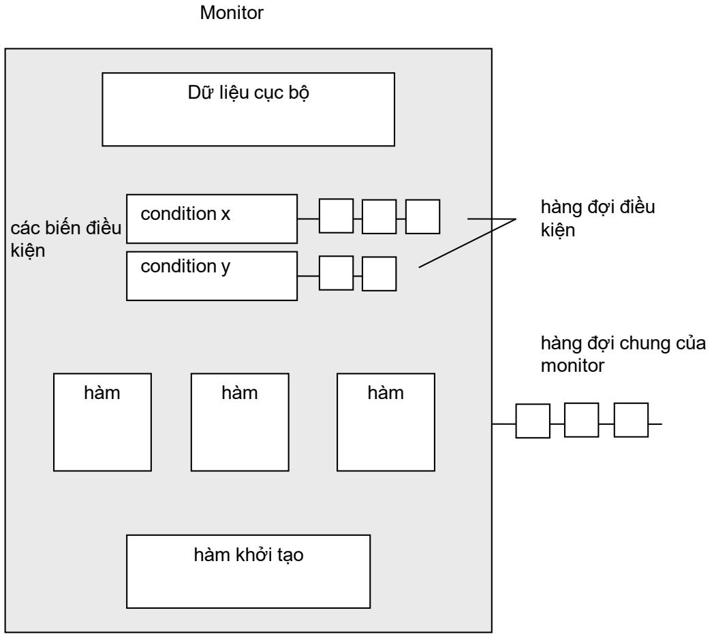

# V. ĐỒNG BỘ HÓA CÁC TIẾN TRÌNH ĐỒNG THỜI 7. Monitor (tt)

monitor BoundedBuffer product buffer[N]; //bộ đệm chứa N sản phẩm kiểu product int count; //số lƣợng sản phẩm hiện thời trong bộ đệm condition notFull, notEmpty; //các biến điều kiện   
public: boundedbuffer( ) { //khởi tạo count = 0; } void append (product x) { if (count == N) notFull.cwait ( ); //dừng và chờ đến khi buffer có chỗ <Thêm một sản phẩm vào buffer> count++; notEmpty.csignal ();

# V. ĐỒNG BỘ HÓA CÁC TIẾN TRÌNH ĐỒNG THỜI 7. Monitor (tt)

product take ( ) { if (count == 0) notEmptry.cwait (); //chờ đến khi buffer không rỗng <Lấy một sản phẩm x từ buffer> count --; notFull.csignal ( ); } }

void producer ( ) { //tiến trình ngƣời sản xuất for (;;){ <Sản xuất sản phẩm x> BoundedBuffer.append (x);   
}

# V. ĐỒNG BỘ HÓA CÁC TIẾN TRÌNH ĐỒNG THỜI 7. Monitor (tt)

void consumer ( ) { //tiến trình ngƣời tiêu dùng for (;;){ product x = BoundedBuffer.take (); <Tiêu dùng x> }   
void main() { Thực hiện song song producer và consumer.   
}

Tình trạng một nhóm tiến trình có cạnh tranh về tài nguyên hay có hợp tác phải dừng vô hạn

Do tiến trình phải chờ đợi một sự kiện chỉ có thể sinh ra bởi tiến trình khác cũng đang trong trạng thái chờ đợi

Đồng thời xảy ra 4 điều kiện:

. Loại trừ tƣơng hỗ: có tài nguyên nguy hiểm, tại 1 thời điểm duy nhất 1 tiến trình sử dụng

2. Giữ và chờ: tiến trình giữ tài nguyên trong khi chờ đợi

3 Không có phân phối lại (no preemption): tài nguyên do tiến trình giữ không thể phân phối lại cho tiến trình khác trừ khi tiến trình đang giữ tự nguyện giải phóng tài nguyên

Chờ đợi vòng tròn: tồn tại nhóm tiến trình P1, P2, …, Pn sao cho P1 chờ đợi tài nguyên do P2 đang giữ, P2 chờ tài nguyên do P3 đang giữ, …, Pn chờ tài nguyên do P1 đang giữ

# Giải quyết vấn đề bế tắc theo cách:

Ngăn ngừa (deadlock prevention): đảm bảo để một trong bốn điều kiện xẩy ra bế tắc không bao giờ thỏa mãn

Phòng tránh (deadlock avoidance): cho phép một số điều kiện bế tắc đƣợc thỏa mãn nhƣng đảm bảo để không đạt tới điểm bế tắc

Phát hiện và giải quyết (deadlock detection): cho phép bế tắc xẩy ra, phát hiện bế tắc và khôi phục hệ thống về tình trạng không bế tắc

# V. BẾ TẮC

3. Ngăn ngừa bế tắc

Đảm bảo ít nhất 1 trong 4 điều kiện không xảy ra

Loại trừ tƣơng hỗ: không thể ngăn ngừa

# Giữ và chờ:

Cách 1:

Yêu cầu tiến trình phải nhận đủ toàn bộ tài nguyên cần thiết trƣớc khi thực hiện tiếp

Nếu không nhận đủ, tiến trình bị phong tỏa để chờ cho đến khi có thể nhận đủ tài nguyên

# Cách 2:

Tiến trình chỉ đƣợc yêu cầu tài nguyên nếu không giữ tài nguyên khác

Trƣớc khi yêu cầu thêm tài nguyên, tiến trình phải giải phóng tài nguyên đã đƣợc cấp và yêu cầu lại (nếu cần) cùng với tài nguyên mới

# Không có phân phối lại:

# Cách 1:

Khi một tiến trình yêu cầu tài nguyên nhƣng không đƣợc do đã bị cấp phát, HDH sẽ thu hồi lại toàn bộ tài nguyên nó đang giữ Tiến trình chỉ có thể thực hiện tiếp sau khi lấy đƣợc tài nguyên cũ cùng với tài nguyên mới yêu cầu

# Cách 2:

Khi tiến trình yêu cầu tài nguyên, nếu còn trống, sẽ đƣợc cấp phát ngay Nếu tài nguyên do tiến trình khác giữ mà tiến trình này đang chờ cấp thêm tài nguyên thì thu hồi lại để cấp cho tiến trình yêu cầu Nếu hai điều kiện trên đều không thỏa thì tiến trình yêu cầu tài nguyên phải chờ

# Chờ đợi vòng tròn:

Xác định thứ tự cho các dạng tài nguyên và chỉ cho phép tiến trình yêu cầu tài nguyên sao cho tài nguyên mà tiến trình yêu cầu sau có thứ tự lớn hơn tài nguyên mà nó yêu cầu trƣớc

Giả sử trong hệ thống có n dạng tài nguyên ký hiệu R1, R2, …, Rn

Giả sử những dạng tài nguyên này đƣợc sắp xếp theo thứ tự tăng dần của chỉ số

Nếu tiến trình đã yêu cầu một số tài nguyên dạng Ri thì sau đó tiến trình chỉ đƣợc phép yêu cầu tài nguyên dạng Rj nếu j > i

Nếu tiến trình cần nhiều tài nguyên cùng dạng thì tiến trình phải yêu cầu tất cả tài nguyên dạng đó cùng một lúc

Ngăn ngừa bế tắc:

Sử dụng quy tắc hay ràng buộc khi cấp phát tài nguyên để ngăn ngừa điều kiện xẩy ra bế tắc

Sử dụng tài nguyên kém hiệu quả, giảm hiệu năng của tiến trình Phòng tránh bế tắc:

Cho phép 3 điều kiện đầu xẩy ra và chỉ đảm bảo sao cho trạng thái bế tắc không bao giờ đạt tới

Mỗi yêu cầu cấp tài nguyên của tiến trình sẽ đƣợc xem xét và quyết định tùy theo tình hình cụ thể

HDH yêu cầu tiến trình cung cấp thông tin về việc sử dụng tài nguyên (số lƣợng tối đa tài nguyên tiến trình cần sử dụng)

Khi tiến trình muốn khởi tạo, thông báo dạng tài nguyên và số lƣợng tài nguyên tối đa cho mỗi dạng sẽ yêu cầu

Nếu số lƣợng yêu cầu không vƣợt quá khả năng hệ thống, tiến trình sẽ đƣợc khởi tạo

Trạng thái đƣợc xác định bởi tình trạng sử dụng tài nguyên hiện thời trong hệ thống:

Số lƣợng tối đa tài nguyên mà tiến trình yêu cầu:

Dƣới dạng ma trận M[n][m]: n là số lƣợng tiến trình, m: số tài nguyên M[i][j]: số lƣợng tài nguyên tối đa dạng j mà tiến trình i yêu cầu

Số lƣợng tài nguyên còn lại:

Dƣới dạng vectơ A[m]

A[j] là số lƣợng tài nguyên dạng j còn lại và có thể cấp phát

Lƣợng tài nguyên đã cấp cho mỗi tiến trình:

Dƣới dạng ma trận D[n][m]

D[i][j] là lƣợng tài nguyên dạng j đã cấp cho tiến trình i

Lƣợng tài nguyên còn cần cấp

Dƣới dạng ma trận C[n][m]

C[i][j]=M[i][j]-D[i][j] là lƣợng tài nguyên dạng j mà tiến trình i còn cần cấp

Trạng thái an toàn: trạng thái mà từ đó có ít nhất một phƣơng án cấp phát sao cho bế tắc không xẩy ra

Cách phòng tránh bế tắc:

Khi tiến trình có yêu cầu cấp tài nguyên, hệ thống giả sử tài nguyên đƣợc cấp

Cập nhật lại trạng thái & xác định xem trạng thái đó có an toàn?

Nếu an toàn, tài nguyên sẽ đƣợc cấp thật

Ngƣợc lại, tiến trình bị phong tỏa &chờ tới khi có thể cấp phát an toàn

# V. BẾ TẮC

4. Phòng tránh bế tắc – thuật toán người cho vay

Hệ thống có 3 dạng tài nguyên X, Y, Z với số lƣợng ban đầu X=10, Y=5, Z=7

4 tiến trình P1, P2, P3, P4 có yêu cầu tài nguyên tối đa cho trong bảng

Xét trạng thái sau của hệ thống:

<table><tr><td rowspan="2">P1</td><td colspan="2">X</td><td colspan="2">Z</td></tr><tr><td>7</td><td>Y 5</td><td>3</td><td></td></tr><tr><td>P2</td><td>3</td><td>2</td><td></td><td>2</td></tr><tr><td>P3</td><td>9</td><td>0</td><td></td><td>2</td></tr><tr><td>P4</td><td>2</td><td>2</td><td></td><td>2</td></tr></table>

Yêu cầu tối đa

Là trạng thái an toàn

Có thể tìm ra cách cấp phát không P1   
dẫn đến bế tắc, VD: P2, P4, P3, P1 P2

<table><tr><td rowspan=1 colspan=3>X     Y     Z</td></tr><tr><td rowspan=1 colspan=1>0</td><td rowspan=1 colspan=1>1</td><td rowspan=1 colspan=1>0</td></tr><tr><td rowspan=1 colspan=1>2</td><td rowspan=1 colspan=1>0</td><td rowspan=1 colspan=1>0</td></tr><tr><td rowspan=1 colspan=1>3</td><td rowspan=1 colspan=1>0</td><td rowspan=1 colspan=1>2</td></tr><tr><td rowspan=1 colspan=1>2</td><td rowspan=1 colspan=1>1</td><td rowspan=1 colspan=1>1</td></tr></table>

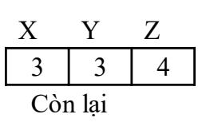  
Đã cấp

Còn cần cấp   

<table><tr><td rowspan=1 colspan=3>X      Y      Z</td></tr><tr><td rowspan=1 colspan=1>7</td><td rowspan=1 colspan=1>4</td><td rowspan=1 colspan=1>3</td></tr><tr><td rowspan=1 colspan=1>1</td><td rowspan=1 colspan=1>2</td><td rowspan=1 colspan=1>2</td></tr><tr><td rowspan=1 colspan=1>6</td><td rowspan=1 colspan=1>0</td><td rowspan=1 colspan=1>0</td></tr><tr><td rowspan=1 colspan=1>0</td><td rowspan=1 colspan=1>1</td><td rowspan=1 colspan=1>1</td></tr></table>

P1 yêu cầu cấp phát 3 tài nguyên dạng Y, tức là yêu cầu = (0,3,0). Nếu yêu cầu thỏa mãn, hệ thống chuyển sang trạng thái:

Trạng thái không an toàn => yêu cầu (0,3,0) bị từ chối

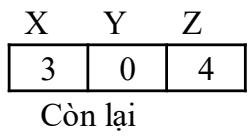

Còn cần cấp   

<table><tr><td rowspan="3">P1 P2</td><td>X</td><td>Y</td><td>Z</td></tr><tr><td>7</td><td>1</td><td>3</td></tr><tr><td>1</td><td>2</td><td>2</td></tr><tr><td rowspan="2">P3 P4</td><td>6</td><td>0</td><td>0</td></tr><tr><td>0</td><td>1</td><td>1</td></tr></table>

# V. BẾ TẮC

4. Phòng tránh bế tắc – thuật toán người cho vay

# Thuật toán xác định trạng thái an toàn:

1. Khai báo mảng W kích thước m và mảng F kích thước n. (F[i] chứa tình trạng tiến trình thứ i đã kết thúc hay chưa, W chứa lượng tài nguyên còn lại) Khởi tạo W=A và F[i]=false (i=0,…,n-1)

2. Tìm i sao cho: F[i] = false và C[i][j]  W[j] với mọi j=0,…,m-1 Nếu không có i như vậy thì chuyển sang bước 4

3. a) W = W + D[i] b) F[i] = true c) Quay lại bước 2

4. If F[i] = true với mọi i =0,…,n-1 thì trạng thái an toàn Else trạng thái không an toàn

Hệ thống không thực hiện biện pháp ngăn ngừa/phòng tránh => bế tắc có thể xảy ra

Hệ thống định kỳ kiểm tra để phát hiện có tình trạng bế tắc hay không?

Nếu có, hệ thống sẽ xử lý để khôi phục lại trạng thái không có bế tắc

# Phát hiện bế tắc:

Trƣờng hợp mỗi dạng tài nguyên chỉ có một tài nguyên duy nhất =>sử dụng đồ thị biểu diễn quan hệ chờ đợi lần nhau giữa tiến trình

Xây dựng đồ thị cấp phát tài nguyên:

Các nút là tiến trình và tài nguyên

Tài nguyên đƣợc nối với tiến trình bằng cung có hƣớng nếu tài nguyên đƣợc cấp cho tiến \`trình đó

Tiến trình đƣợc nối với tài nguyên bằng cung có hƣớng nếu tiến trình đang đƣợc cấp tài nguyên đó

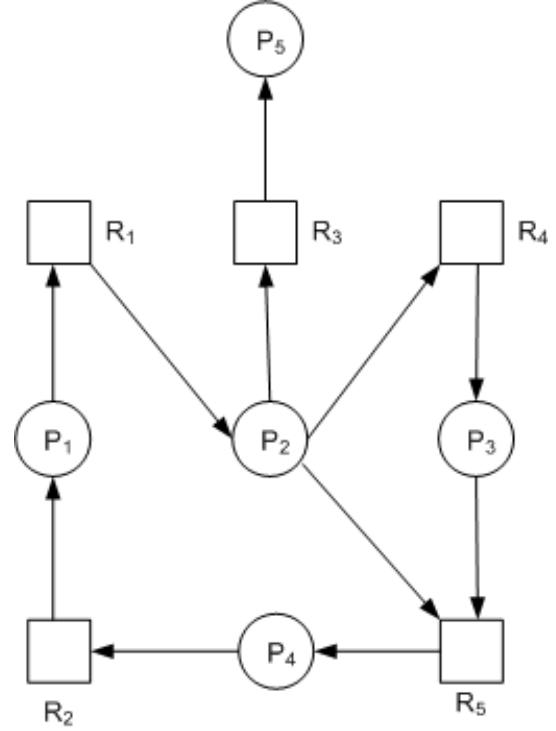

Phát hiện bế tắc:

Đồ thị chờ đợi:

Đƣợc xây dựng từ đồ thị cấp phát tài nguyên bằng cách bỏ đi các nút tƣơng ứng với tài nguyên và nhập các cung đi qua nút bị bỏ

Cho phép phát hiện tình trạng tiến trình chờ đợi vòng tròn là điều kiện đủ để sinh ra bế tắc

Sử dụng thuật toán phát hiện chu trình trên đồ thị có hƣớng để phát hiện bế tắc trên đồ thị chờ đợi

Thời điểm phát hiện bế tắc:

Bế tắc chỉ có thể xuất hiện sau khi một tiến trình nào đó yêu cầu tài nguyên và không đƣợc thỏa mãn

=> Chạy thuật toán phát hiện bế tắc mỗi khi có yêu cầu cấp phát tài nguyên không đƣợc thỏa mãn

=> Cho phép phát hiện bế tắc ngay khi vừa xẩy ra

Chạy thƣờng xuyên làm giảm hiệu năng hệ thống

Giảm tần suất chạy thuật toán phát hiện bế tắc:

Sau từng chu kỳ từ vài chục phút tới vài giờ

Khi có một số dấu hiệu nhƣ hiệu suất sử dụng CPU giảm xuống dƣới một ngƣỡng nào đó

# Xử lý khi bị bế tắc:

Kết thúc tất cả tiến trình đang bị bế tắc

Kết thúc lần lƣợt từng tiến trình đang bị bế tắc đến khi hết bế tắc:

HDH phải chạy lại thuật toán phát hiện bế tắc sau khi kết thúc 1 tiến trình HDH có thể chọn thứ tự kết thúc tiến trình dựa trên tiêu chí nào đó

Khôi phục tiến trình về thời điểm trƣớc khi bị bế tắc sau đó cho các tiến trình thực hiện lại từ điểm này:

Đòi hỏi HDH lƣu trữ trạng thái để có thể thực hiện quay lui và khôi phục về các điểm kiểm tra trƣớc đó

Khi chạy lại, các tiến trình có thể lại rơi vào bế tắc tiếp

Lần lƣợt thu hồi lại tài nguyên từ các tiến trình bế tắc cho tới khi hết bế tắc

# V. BẾ TẮC

6. Ngăn ngừa bế tắc cho bài toán triết gia ăn cơm

Đặt hai thao tác lấy đũa của mỗi triết gia vào đoạn nguy hiểm để đảm bảo triết gia lấy đƣợc hai đũa cùng một lúc

Quy ƣớc bất đối xứng về thứ tự lấy đũa: ví dụ ngƣời có số thứ tự chẵn lấy đũa trái trƣớc đũa phải, ngƣời có số thứ tự lẻ lấy đũa phải trƣớc đũa trái

Tại mỗi thời điểm chỉ cho tối đa bốn ngƣời ngồi vào bàn:

Sử dụng thêm một cờ hiệu table có giá trị khởi tạo bằng 4

Triết gia phải gọi thao tác wait(table) trƣớc khi ngồi vào bàn và lấy đũa

# V. BẾ TẮC

6. Ngăn ngừa bế tắc cho bài toán triết gia ăn cơm

<table><tr><td</table>

Bài 1: Cho các tiến trình với thời điểm xuất hiện, thời gian (chu kỳ) CPU tiếp theo và số ƣu tiên nhƣ trong bảng sau (số ƣu tiên nhỏ ứng với độ ƣu tiên cao). Vẽ biểu đồ thể hiện thứ tự và thời gian cấp phát CPU cho các tiến trình sử dụng thuật toán

a. Điều độ theo mức ƣu tiên không có phân phối lại b. Điều độ ƣu tiên tiến trình ngắn nhất c. Điều độ ƣu tiên thời gian còn lại ngắn nhất

Tính thời gian chờ đợi trung bình cho từng trƣờng hợp.

<table><tr><td rowspan=1 colspan=1>Tién trình</td><td rowspan=1 colspan=1>Thòi diêm xuat hin</td><td rowspan=1 colspan=1>Thòi gian (d dài)</td><td rowspan=1 colspan=1>Só uu tiên</td></tr><tr><td rowspan=1 colspan=1>P1</td><td rowspan=1 colspan=1>0</td><td rowspan=1 colspan=1>10</td><td rowspan=1 colspan=1>1</td></tr><tr><td rowspan=1 colspan=1>P2</td><td rowspan=1 colspan=1>2</td><td rowspan=1 colspan=1>8</td><td rowspan=1 colspan=1>3</td></tr><tr><td rowspan=1 colspan=1>P3</td><td rowspan=1 colspan=1>4</td><td rowspan=1 colspan=1>5</td><td rowspan=1 colspan=1>2</td></tr><tr><td rowspan=1 colspan=1>P4</td><td rowspan=1 colspan=1>5</td><td rowspan=1 colspan=1>3</td><td rowspan=1 colspan=1>2</td></tr></table>

Bài 2: Bộ nhớ vật lý có 5 khung. Thứ tự truy cập các trang là 1, 2, 3, 4, 2, 1, 5, 6, 2, 1, 2, 3, 7, 6, 3, 2, 1, 2, 3, 6. Vẽ sơ đồ cấp phát bộ nhớ và Có bao nhiêu sự kiện thiếu trang xảy ra nếu sử dụng:

- LRU - Đồng hồ

Bài 3: Kích thƣớc khung bộ nhớ là 2048 bytes. Hãy chuyển địa chỉ logic 3500, 5060 sang địa chỉ vật lý biết rằng bảng trang nhƣ sau:

<table><tr><td rowspan=1 colspan=1>Sótrang</td><td rowspan=1 colspan=1>Sókhung</td></tr><tr><td rowspan=1 colspan=1>0</td><td rowspan=1 colspan=1>3</td></tr><tr><td rowspan=1 colspan=1>1</td><td rowspan=1 colspan=1>5</td></tr><tr><td rowspan=1 colspan=1>2</td><td rowspan=1 colspan=1></td></tr><tr><td rowspan=1 colspan=1>3</td><td rowspan=1 colspan=1>30</td></tr></table>

# Bài 2:

a. Sử dụng lệnh Test_and_Set để thực hiện loại trừ tƣơng hỗ cho bài toán triết gia ăn cơm

b. Phân tích rõ ràng giải pháp sử dụng lệnh Test_and_Set ở trên có thể gây bế tắc hoặc đói không

Bài 3: Xét trạng thái cấp phát tài nguyên của hệ thống nhƣ sau:

<table><tr><td rowspan="2">P1</td><td>X</td><td>Y</td><td>Z</td></tr><tr><td>0</td><td>1</td><td>0</td></tr><tr><td>P2</td><td>2</td><td>0</td><td>0</td></tr><tr><td rowspan="2">P3 P4</td><td>3</td><td>0</td><td>2</td></tr><tr><td>2</td><td>1</td><td>1</td></tr></table>

P1   
P2   
P3   
P4

<table><tr><td rowspan=1 colspan=3>X      Y      Z</td></tr><tr><td rowspan=1 colspan=1>7</td><td rowspan=1 colspan=1>4</td><td rowspan=1 colspan=1>3</td></tr><tr><td rowspan=1 colspan=1>1</td><td rowspan=1 colspan=1>2</td><td rowspan=1 colspan=1>2</td></tr><tr><td rowspan=1 colspan=1>6</td><td rowspan=1 colspan=1>0</td><td rowspan=1 colspan=1>0</td></tr><tr><td rowspan=1 colspan=1>0</td><td rowspan=1 colspan=1>1</td><td rowspan=1 colspan=1>1</td></tr></table>

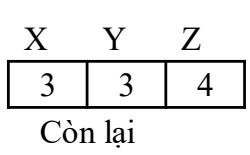  
  
Còn cần cấp

P2 yêu cầu cấp phát 1 tài nguyên Y, 2 tài nguyên Z. Sử dụng thuật toán ngƣời cho vay để xác định xem yêu cầu của P2 có đƣợc đáp ứng hay không?